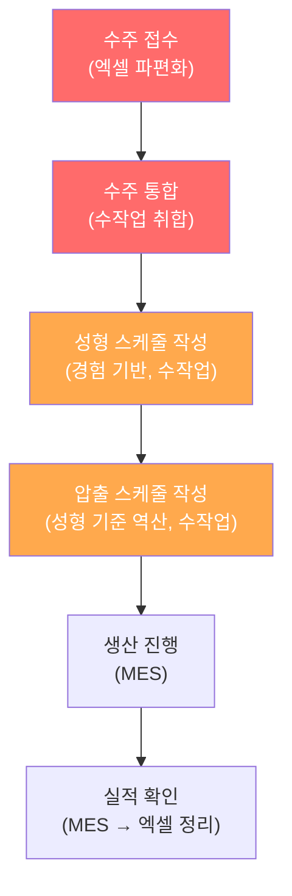
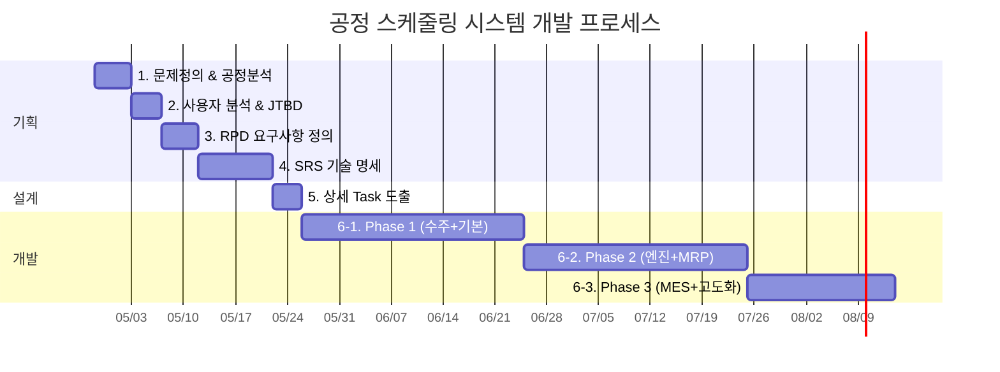

# 공정 스케줄링 시스템 — 개발 프로세스 정의

## 일반 프로세스 vs 우리 프로세스

사내 도구는 **"시장"이 없고 "고객"이 확정**되어 있으므로, 시장 분석 계열 단계를 대폭 축소할 수 있습니다.

| # | 일반 프로세스 | 사내 도구 적용 | 이유 |
|---|-------------|--------------|------|
| 1 | 시장 분석 | ⛔ **생략** | 시장 경쟁 없음. 내부 사용 |
| 2 | Value Chain 분석 | ✅ **변형 적용** | → "사내 공정 흐름 분석"으로 대체 |
| 3 | 핵심 성공요인 도출 | ✅ **변형 적용** | → "도입 성공 기준 정의"로 대체 |
| 4 | 문제정의서 작성 | ✅ **필수** | 현재 Pain Point 명확화 |
| 5 | TAM/SAM/SOM & Segment Map | ⛔ **생략** | 시장 규모 산정 불필요 |
| 6 | 페르소나 & CJM | ✅ **간소화** | 사용자가 20명으로 확정, 간소화 가능 |
| 7 | JTBD | ✅ **간소화** | 역할별 핵심 Job 정리 |
| 8 | VPS (Value Proposition) | ⛔ **생략** | 경쟁 포지셔닝 불필요 |
| 9 | RPD (요구사항 정의) | ✅ **필수** | 기능 요구사항 상세 정의 |
| 10 | SRS (소프트웨어 요구 명세) | ✅ **필수** | 개발 기준 문서 |
| 11 | 상세 Task 도출 | ✅ **필수** | 개발 백로그 |
| 12 | 프로토타이핑 | ✅ **필수** | 사용자 검증 |

---

## 우리의 맞춤 프로세스 (6단계)


---

## 1단계: 문제정의 & 공정 흐름 분석 (1주)

> 일반 프로세스의 "시장 분석 + Value Chain + 핵심 성공요인 + 문제정의서"를 통합

### 산출물: 문제정의서 (Problem Statement)

#### 1-1. 현재 업무 흐름(As-Is) 매핑



#### 1-2. 문제 정의 (Pain Points)

| 영역 | 현재 문제 | 영향 |
|------|----------|------|
| 수주 관리 | 엑셀 파편화, 중복/누락 위험 | 생산 계획 정확도 저하 |
| 성형 스케줄 | 경험 기반 수작업, 제약 변수 미반영 | 설비 가동률 저하, 납기 지연 |
| 압출 스케줄 | 성형과 수기 연동, 불일치 발생 | 관체 부족/과잉 |
| 실적 관리 | MES와 계획 비교가 수동 | 지연 감지 늦음 |

#### 1-3. 도입 성공 기준 (CSF)

| 성공 기준 | 측정 지표 | 목표 |
|----------|----------|------|
| 수주 통합 시간 단축 | 주간 수주 취합 소요 시간 | 현재 대비 80% 단축 |
| 스케줄링 정확도 | 계획 대비 실적 일치율 | 85% 이상 |
| 납기 준수율 | 납기 내 납품 비율 | 95% 이상 |
| 긴급 발주 감소 | 월간 긴급 발주 건수 | 현재 대비 50% 감소 |
| 사용자 채택율 | 20명 중 실사용자 수 | 90% 이상 (18명+) |

---

## 2단계: 사용자 분석 & JTBD (3~4일)

> 일반 프로세스의 "페르소나 + CJM + JTBD"를 간소화

### 산출물: 사용자 역할 정의 + JTBD 맵

#### 2-1. 사용자 역할 (간소화 페르소나)

| 역할 | 인원(예상) | 주요 업무 | 시스템 사용 목적 |
|------|----------|----------|----------------|
| **생산관리 담당자** | 3~5명 | 수주 취합, 스케줄 수립, 자재 관리 | 스케줄 수립/조정, 자재 발주 |
| **성형 현장 관리자** | 5~7명 | 성형 라인 운영, 작업 지시 | 일일 작업 지시 확인, 실적 입력 |
| **압출 현장 관리자** | 3~5명 | 압출 라인 운영 | 일일 작업 지시 확인, 실적 입력 |
| **구매/자재 담당자** | 2~3명 | 자재 발주, 입고 관리 | 소요량 확인, 발주 관리 |
| **관리자/임원** | 2~3명 | 현황 모니터링, 의사결정 | 대시보드 조회 |

#### 2-2. 역할별 JTBD (Jobs To Be Done)

**생산관리 담당자**
```
WHEN   주간 생산 계획을 수립할 때
I WANT 수주 현황과 설비/금형 제약을 한 화면에서 보고 자동 배치하고 싶다
SO THAT 스케줄 수립 시간을 줄이고 제약 위반 없는 계획을 세울 수 있다
```

**현장 관리자**
```
WHEN   일일 작업을 시작할 때
I WANT 오늘의 작업 지시와 우선순위를 즉시 확인하고 싶다
SO THAT 별도 확인 없이 바로 작업에 투입할 수 있다
```

**구매/자재 담당자**
```
WHEN   생산 스케줄이 확정되었을 때
I WANT 부족 자재와 발주 시점이 자동으로 알려주길 원한다
SO THAT 긴급 발주 없이 적시 입고가 가능하다
```

---

## 3단계: RPD — 요구사항 정의 (1주)

> 기능 요구사항을 체계적으로 정의

### 산출물: 기능 요구사항 정의서

#### 모듈별 기능 목록

**M1. 수주 통합 관리**
| ID | 기능 | 우선순위 | 설명 |
|----|------|---------|------|
| F-101 | 엑셀 Import | 필수 | 월별/KD/주간 엑셀 업로드 및 컬럼 매핑 |
| F-102 | 수주 CRUD | 필수 | 수주 등록/수정/삭제/조회 |
| F-103 | 중복 감지 | 필수 | 동일 품번+납기 중복 등록 방지 |
| F-104 | 수주 유형 통합 뷰 | 필수 | 예상/KD/주간/확정을 통합 조회 |
| F-105 | 제품군별 필터 | 필수 | 제품군/품번/거래처별 필터 |

**M2. 성형 공정 스케줄링**
| ID | 기능 | 우선순위 | 설명 |
|----|------|---------|------|
| F-201 | 간트차트 뷰 | 필수 | 설비별 주간 스케줄 시각화 |
| F-202 | 자동 스케줄링 | 필수 | 납기 역산 + 제약 반영 자동 배치 |
| F-203 | 수동 드래그 조정 | 필수 | 간트차트에서 드래그로 일정 변경 |
| F-204 | 제약 위반 알림 | 필수 | 금형 충돌, Capa 초과 시 경고 |
| F-205 | 납기 역산 | 필수 | 납품일 - 2일 자동 계산 |

**M3. 압출 공정 스케줄링**
| ID | 기능 | 우선순위 | 설명 |
|----|------|---------|------|
| F-301 | 성형 연동 자동 생성 | 필수 | 성형 투입일 - 1일 기준 역산 |
| F-302 | 압출 간트차트 | 필수 | 라인별 스케줄 시각화 |
| F-303 | 제약 반영 | 필수 | 배합 교체, 다이 교체 시간 반영 |

**M4. 자재/발주 관리 (Phase 2 확장 대상)**
| ID | 기능 | 우선순위 | 설명 |
|----|------|---------|------|
| F-401 | MRP 자동 계산 | Phase2 | 스케줄 기반 BOM 전개 → 소요량 |
| F-402 | 재고 대비 부족량 | Phase2 | 현재고 차감 → 순소요량 |
| F-403 | 리드타임별 발주일 역산 | Phase2 | 자재별 리드타임 적용 자동 역산 |
| F-404 | 발주 요청 생성 | Phase2 | 부족 자재 발주 요청 자동 생성 |
| F-405 | 입고 관리 | Phase2 | 입고 등록, 발주 대비 입고 추적 |

**M5. MES 연동**
| ID | 기능 | 우선순위 | 설명 |
|----|------|---------|------|
| F-501 | 작업지시 전송 | Phase2 | 확정 스케줄 → MES 전송 |
| F-502 | 실적 수신 | Phase2 | MES 생산 실적 → 스케줄 반영 |
| F-503 | 계획 vs 실적 비교 | Phase2 | 차이 분석 및 지연 알림 |

**M6. 대시보드 & 리포트**
| ID | 기능 | 우선순위 | 설명 |
|----|------|---------|------|
| F-601 | 생산 현황 대시보드 | 필수 | 금일 생산 현황, 납기 임박 건 |
| F-602 | 납기 준수율 리포트 | Phase2 | 월별 납기 준수 통계 |

---

## 4단계: SRS — 소프트웨어 요구 명세 (1~2주)

> 기술적 상세 명세서

### 산출물: SRS 문서

- 시스템 아키텍처 (이전 분석 v2 문서 기반)
- 데이터베이스 ERD 및 스키마 정의
- API 명세 (엔드포인트, 입출력)
- 스케줄링 알고리즘 상세 설계
- MES 연동 인터페이스 정의
- 비기능 요구사항 (성능, 보안, 가용성)
- 화면 설계서 (와이어프레임)

---

## 5단계: 상세 Task 도출 (3~5일)

> 개발 백로그 작성

### 산출물: Task 리스트 (GitHub Issues / Jira)

- SRS 기반 기능 단위 Task 분해
- Task별 예상 공수 산정
- 의존성 정리 (선후행 관계)
- Sprint 계획 수립

---

## 6단계: 프로토타이핑 & 개발 (12~16주)

> 단계별 구축

- Phase 1 (6주): 수주 통합 + 기본 스케줄링
- Phase 2 (6주): 스케줄링 엔진 + MRP
- Phase 3 (4주): MES 연동 + 고도화

---

## 전체 일정 요약



| 단계 | 소요 기간 | 누적 |
|------|----------|------|
| 1. 문제정의 & 공정 분석 | 1주 | 1주 |
| 2. 사용자 분석 & JTBD | 3~4일 | ~2주 |
| 3. RPD 요구사항 정의 | 1주 | ~3주 |
| 4. SRS 기술 명세 | 1~2주 | ~5주 |
| 5. 상세 Task 도출 | 3~5일 | ~6주 |
| 6. 프로토타이핑 & 개발 | 12~16주 | **~22주** |

> [!NOTE]
> 기획 단계(1~5단계)는 약 **5~6주**, 개발(6단계)은 약 **12~16주**로, 전체 약 **5~6개월** 소요 예상입니다.
> 단, 1인 개발 기준이며 팀 구성에 따라 단축 가능합니다.

---

## 다음 단계 제안

> [!IMPORTANT]
> **현재 1단계(문제정의 & 공정 분석)가 마무리 단계에 있습니다.**
> 
> 다음 진행 예정 사항:
> 1. **2단계: 사용자 분석 & JTBD 완성** (역할별 상세 시나리오)
> 2. **3단계: RPD(요구사항 정의) 작성** (실제 데이터 매핑 규칙 포함)
