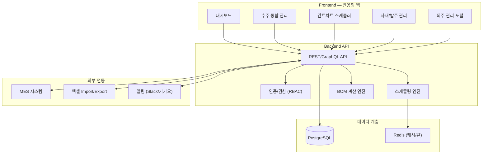

# 공정 스케줄링 시스템 — 아키텍처 분석 및 설계안

## 1. 요구사항 요약

| 항목 | 내용 |
|------|------|
| **사용자** | 생산관리 담당자 + 현장 관리자, 약 20명 |
| **기존 시스템** | ERP/MES 운영 중, MES 작업 결과물 연동 필요 |
| **수주 데이터** | 엑셀 기반, 파편화 → 통합 필요 |
| **BOM** | 제품별 자재 명세 정리 완료 |
| **스케줄링 특성** | 제약 변수가 많음 (설비, 금형, 원료, 납기 등) |

---

## 2. 시스템 아키텍처

> [!IMPORTANT]
> MES 연동 + 제약 기반 스케줄링이 핵심이므로, 프론트엔드와 스케줄링 엔진을 분리한 구조를 권장합니다.

... (내용 중략 - 이전과 동일)
