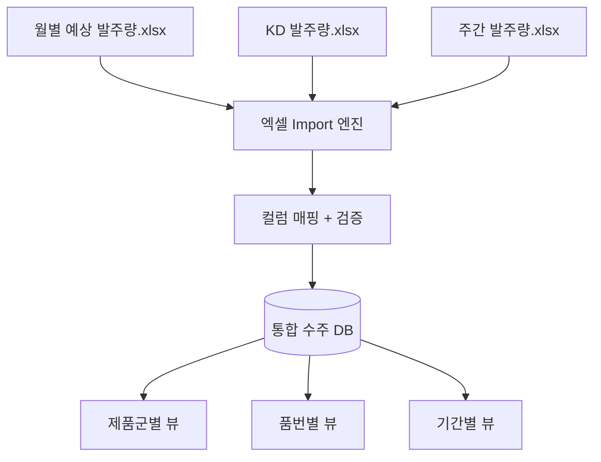
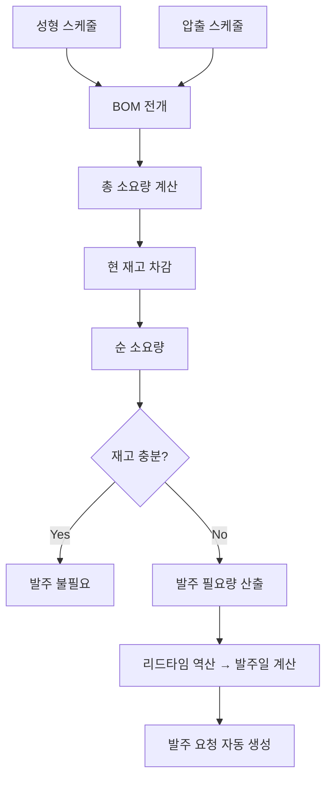

# 고무호스 공정 스케줄링 시스템 — 상세 분석 v2

## 결론: 충분히 해결 가능

요구사항이 명확하고, 공정 흐름이 **선형적(압출 → 성형 → 납품)** 이라 스케줄링 로직이 깔끔하게 설계됩니다.
자체 개발 MES 접근이 가능하다는 점도 큰 강점입니다.

---

## 1. 핵심 공정 흐름과 시간 제약


### 역방향 스케줄링 (Backward Scheduling)

```
납품일:          D-Day
성형 완료 기한:   D-2일
압출 완료 기한:   성형 투입일 - 1일 = D-2일 - 성형소요일 - 1일
자재 발주 기한:   압출 투입일 - 자재 리드타임
```

> [!TIP]
> 이 선형 구조가 바로 이 시스템의 강점입니다. 납품일만 확정되면 모든 공정 일정이 **역산으로 자동 계산**됩니다.

---

## 2. 수주 정보 통합 설계

### 현재 문제
- 월별 예상 발주량 / KD 발주량 / 주간 발주량이 각각 별도 엑셀
- 품번 종류가 많고, 제품군이 다양

### 해결 방안: 통합 수주 데이터베이스



### 수주 데이터 구조

| 필드 | 설명 | 예시 |
|------|------|------|
| 수주 유형 | 예상/KD/주간/확정 | `FORECAST`, `KD`, `WEEKLY`, `CONFIRMED` |
| 제품군 | 대분류 | 냉각호스, 히터호스, 터보호스 등 |
| 품번 | 고유 식별 | ABC-12345-01 |
| 거래처 | 납품처 | 현대모비스, 만도 등 |
| 수량 | 발주 수량 | 5,000 EA |
| 납품 예정일 | 납기 | 2026-05-15 |
| 확정 여부 | 예측 vs 확정 | 확정 |

### Import 시 핵심 기능

1. **중복 감지** — 같은 품번+납기의 데이터가 월별/주간에서 중복 등록되는 것 방지
2. **버전 관리** — 예상 → 확정으로 전환 시 이력 추적
3. **차이 비교** — 이전 Import와 현재 Import 차이를 하이라이트

---

## 3. 성형 공정 스케줄링 상세

### 제약 변수 (예상, 확인 필요)

| 제약 유형 | 설명 | 스케줄링 영향 |
|----------|------|-------------|
| **금형 제약** | 품번별 전용 금형, 동시 사용 불가 | 같은 금형 사용 품번은 순차 배치 |
| **설비 Capa** | 성형 프레스별 최대 가동 시간 | 일일/주간 생산 가능량 제한 |
| **금형 교체 시간** | 금형 교체 셋업 시간 | 빈번한 교체 시 가동률 저하 |
| **가류 조건** | 품번별 온도/시간/압력 상이 | 유사 조건 품번 연속 배치 유리 |
| **작업자** | 숙련도별 배정 | 특정 제품은 숙련자만 |
| **납기 우선순위** | 긴급/일반 구분 | 긴급 건 우선 배치 |

### 주간 스케줄링 화면 (간트차트)

```
설비        | 월        | 화        | 수        | 목        | 금        |
━━━━━━━━━━━━┿━━━━━━━━━━┿━━━━━━━━━━┿━━━━━━━━━━┿━━━━━━━━━━┿━━━━━━━━━━┤
성형기 #1   | ███ A품번 | ███ A품번 | ██ B품번  | ██ B품번  | ██ C품번  |
성형기 #2   | ██ D품번  | ██ E품번  | ███ F품번 | ███ F품번 | █ 셋업    |
성형기 #3   | ████ G품번         | ██ H품번  | ██ I품번  | ██ J품번  |
```

### 자동 스케줄링 로직

```
입력: 주간 확정 수주 리스트 (품번, 수량, 납품일)
  
1. 납품일 - 2일 = 성형 완료 기한 계산
2. 품번별 BOM → 성형 소요시간 계산 (수량 × 단위시간)
3. 금형 그룹핑 (같은 금형 사용 품번 묶기)
4. 납기 긴급도 순 정렬
5. 설비별 가용 시간 슬롯에 배치
6. 제약 검증:
   - 금형 충돌 없는지?
   - 설비 Capa 초과하지 않는지?
   - 셋업 시간 반영했는지?
7. 충돌 시 → 대안 제시 (설비 변경 / 일정 이동)
8. 확정 → 간트차트 반영
```

---

## 4. 압출 공정 스케줄링 상세

### 성형과의 연동 관계


### 압출 공정 제약 변수 (예상)

| 제약 유형 | 설명 |
|----------|------|
| **압출 라인** | 라인별 생산 가능 사이즈/규격 제한 |
| **원료 배합** | 고무 배합 종류별 라인 세척 필요 |
| **다이(Die) 교체** | 관체 사이즈별 다이 교체 시간 |
| **연속 가동** | 유사 배합/사이즈 연속 생산 시 효율적 |
| **건조/숙성** | 압출 후 숙성 시간 필요 여부 |

### 압출 → 성형 연쇄 스케줄링

```
성형 스케줄이 확정되면:
  → 각 성형 작업에 필요한 관체 품번/수량 자동 산출
  → 관체별 압출 소요시간 계산
  → 성형 투입 1일 전 완료 기준으로 압출 스케줄 역산
  → 압출 라인 가용성 확인 후 배치
```

---

## 5. 자재 소요량 계산 (MRP)

### 계산 흐름



### 리드타임 다양성 처리

| 자재 유형 | 리드타임 예시 | 처리 방식 |
|----------|-------------|----------|
| 국산 고무원료 | 3~5일 | 자재 마스터에 리드타임 등록 |
| 수입 고무원료 | 30~45일 | 월별 예상 발주 기반 선발주 |
| 부자재 | 7~14일 | 안전재고 기반 자동 발주 |
| 금속 부품 | 10~20일 | 성형 스케줄 연동 발주 |

### 발주 관리 화면

```
자재코드 | 자재명      | 필요일  | 소요량 | 재고 | 부족량 | 발주일(역산) | 상태
RM-001  | EPDM 원료  | 05/10  | 500kg | 200  | 300   | 04/25       | ⚠️ 발주필요
RM-002  | NR 원료    | 05/12  | 300kg | 400  | 0     | -           | ✅ 재고충분
PT-001  | 클램프 A   | 05/14  | 2000  | 500  | 1500  | 05/01       | 🔴 긴급발주
```

---

## 6. MES 연동 설계

### 자체 개발 MES → 최적의 상황

MES가 자체 개발이므로 연동 자유도가 높습니다:

| 연동 방향 | 데이터 | 방식 |
|----------|--------|------|
| **스케줄러 → MES** | 작업지시 (품번, 수량, 설비, 시간) | REST API 또는 공유 DB |
| **MES → 스케줄러** | 생산 실적, 설비 상태, 불량 | 이벤트/폴링 |

### 실적 기반 리스케줄링

```
MES 실적 데이터 수신
  → 계획 대비 실적 비교
  → 지연 감지 시:
     → 후속 공정(성형) 일정 영향도 계산
     → 납기 위험 건 알림
     → 리스케줄링 제안
```

---

## 7. 실현 가능성 평가

| 항목 | 평가 | 근거 |
|------|------|------|
| **기술적 난이도** | ⭐⭐⭐ 중간 | 공정이 선형적이라 스케줄링 복잡도가 관리 가능 |
| **데이터 준비도** | ⭐⭐⭐⭐ 높음 | BOM 정비 완료, 리드타임 정의됨, MES 접근 가능 |
| **구현 기간** | 12~16주 (MVP 포함 전체) | Phase별 점진 구축 |
| **리스크** | ⭐⭐ 낮음~중간 | 주요 리스크는 제약 변수 모델링 정확도 |

### 왜 해결 가능한가?

1. **공정이 선형적** — 압출 → 성형 → 납품. 병렬 분기가 적어 스케줄링 복잡도가 낮음
2. **시간 제약이 명확** — "납품 2일 전", "투입 1일 전" 같은 명확한 버퍼
3. **BOM이 정비됨** — MRP 계산의 기반 데이터가 준비되어 있음
4. **MES 접근 가능** — 실적 연동으로 계획 vs 실적 비교가 가능
5. **사용자 규모 적절** — 20명이면 동시성 이슈 적음

---

## 8. 확인이 추가로 필요한 사항

> [!IMPORTANT]
> 구현 착수 전 확인이 필요합니다:

### 성형 공정
- 성형기 대수는 몇 대?
- 금형 수는? (품번당 전용 금형? 공용 금형?)
- 금형 교체 셋업 시간은 평균 얼마?
- 1회 성형 사이클 타임은? (품번별 상이 여부)

### 압출 공정
- 압출 라인 수는?
- 배합 종류는 몇 가지?
- 배합 교체 시 라인 세척 시간은?
- 1개 관체 압출 소요 시간은?

### 공통
- 교대 근무 체계는? (1교대/2교대/3교대)
- 주간 가동일은? (월~금 / 월~토)
- 현재 엑셀 수주 파일 샘플을 공유받을 수 있을까?
