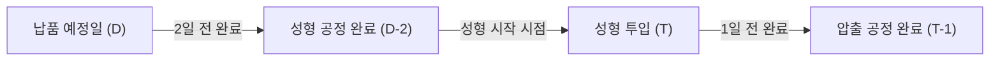

# 고무호스 공정 스케줄링 시스템 — 상세 분석 (MVP 집중 버전)

## 1. 핵심 프로세스: 연동형 역산 스케줄링

MVP 단계에서는 자재 소요량 계산을 제외하고, **납기 → 성형 → 압출**로 이어지는 생산 계획의 정밀도를 높이는 데 집중합니다.

## 2. 수주 통합 전략 (파일럿 제품군 중심)
- **타겟**: 선정된 특정 제품군에 대한 엑셀 데이터만 필터링하여 Import
- **통합 로직**: 
  1. 엑셀 업로드 (월별/KD/주간)
  2. 제품군 필터링 (선정된 아이템만 추출)
  3. 품번/수량/납기 기반 통합 DB 생성

## 3. 공정별 스케줄링 상세

### 3.1 성형 공정 (핵심 제약 반영)
- **제약 변수**: 설비(프레스)별 생산성, 전용 금형 사용 여부, 교대 근무 시간
- **로직**: 납품일로부터 2일 전을 기한으로 설정하고, 설비 가용 슬롯에 자동 배치

### 3.2 압출 공정 (성형 연동)
- **로직**: 성형 스케줄이 확정되거나 변경되면, 해당 성형 작업에 필요한 관체(압출물)의 완료 기한을 '성형 투입 1일 전'으로 자동 설정하여 압출 라인에 배치

## 4. MES 실적 연동
- **계획 vs 실적**: MES에서 들어오는 공정별 실적(성형 완료 수량, 압출 완료 수량)을 계획과 실시간 비교
- **지연 알림**: 압출이 늦어지면 성형 일정에 미치는 영향을 즉시 시각화
