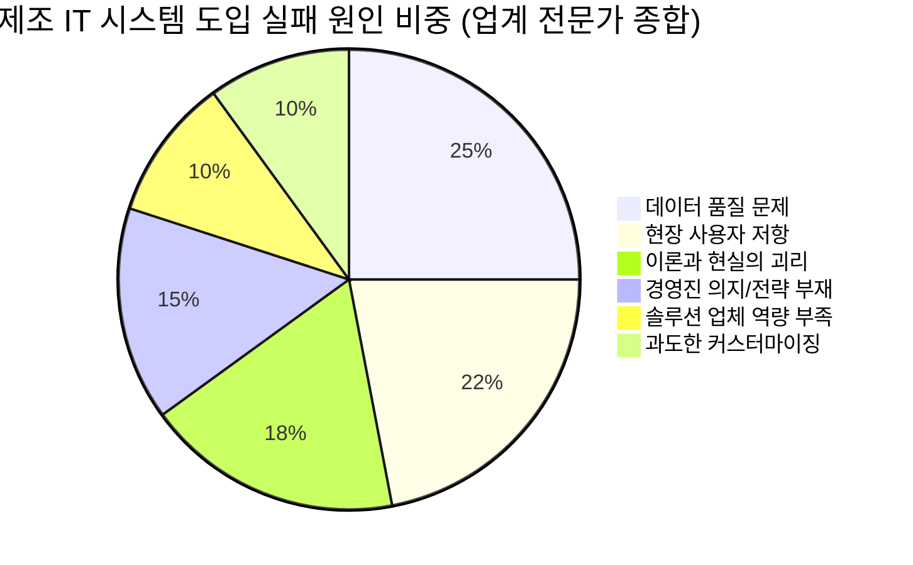

# 공정 스케줄링 시스템 — 유사 사례 분석 및 실패 요인 연구

> 문제정의서 작성 전, 실패 확률을 낮추기 위한 다층적 사전 조사

---

## 1. 산업 통계: 제조 IT 시스템 도입 현황

### 1.1 국내 스마트공장 실태 (2025년 중소벤처기업부 실태조사)

> **출처**: 중소벤처기업부 「제1차 스마트제조혁신 실태조사」 (2025.04 발표, 5,000개 기업 표본)

| 지표 | 수치 | 시사점 |
|------|------|--------|
| 스마트공장 도입률 | **19.5%** | 5개 중 1개 기업만 도입 |
| 기초 수준에 머무는 비율 | **75.5%** | 도입 기업 4개 중 3개가 기초 단계 |
| 부분 도입 비율 | **99.8%** | 전 공정 통합은 거의 없음 |
| 소프트웨어 활용률 | **83.1%** | 하드웨어(90.5%)보다 낮음 |
| 제조데이터 수집률 | **92.4%** | 수집은 하나 분석 활용은 74% |
| 고도화 필요 응답 | **45.7%** | 절반이 현 수준 불충분 인식 |
| 자체 투자 계획 보유 | **25.6%** | 4개 중 1개만 실제 투자 의지 |

> [!WARNING]
> **핵심 인사이트**: 국내 중소 제조업의 75.5%가 기초 수준에 머물러 있다는 것은, **"시스템 도입 자체"보다 "실제로 활용하여 성과를 내는 것"이 훨씬 어렵다**는 것을 의미합니다.

### 1.2 글로벌 ERP/APS 프로젝트 실패율 (Gartner)

> **출처**: Gartner Research (2024~2025)

| 지표 | 수치 |
|------|------|
| ERP 프로젝트 중 목표 미달성 비율 | **70% 이상** (2027년까지) |
| 치명적 실패(프로젝트 중단 등) | **25%** |
| 제조업 ERP 예산 초과율 | 평균 **200% 이상** (이산 제조업) |
| 도입 후 운영 혼란 지속 기간 | **6~12개월** |

> [!IMPORTANT]
> APS 프로젝트도 유사한 경향을 보이며, **최대 50%가 도전 또는 실패**를 경험한다고 업계에서 보고됩니다. 다만 이 수치는 "실패"의 정의(일정 지연, 예산 초과, 사용자 미채택, ROI 미달성)에 따라 달라집니다.

---

## 2. 성공 사례 분석

### 2.1 동아플레이팅 (표면처리 전문 중소기업)

| 항목 | 내용 |
|------|------|
| **도입 시스템** | MES 기반 전사 통합 시스템 |
| **핵심 기능** | 설비 예방 관리, 최적 공정 조건 관리 |
| **성과** | 시간당 생산량 **37% 증가**, 불량률 **77% 개선** |
| **성공 요인** | 데이터 기반 의사결정 체계 구축, 현장 밀착형 구현 |

> **우리 프로젝트에 주는 교훈**: 단순 스케줄링뿐 아니라 **데이터 기반 의사결정 체계**를 함께 설계해야 실질적 성과가 나옴.

### 2.2 삼우금형 (사출금형 전문, 中企)

| 항목 | 내용 |
|------|------|
| **도입 배경** | 기존 ERP만으로는 공정 진행 현황 파악 불가 |
| **핵심 기능** | MES를 통한 공정 진행률 시각화 (TV 모니터링) |
| **성과** | 수주~출하 공정률 수치화, 고객 신뢰도 확보 |
| **성공 요인** | ERP의 한계를 보완하는 **보조 시스템**으로 접근 |

> **우리 프로젝트에 주는 교훈**: 기존 시스템(MES/ERP)을 **대체하는 것이 아니라 보완**하는 포지셔닝이 저항을 줄임.

### 2.3 대웅제약 (APS 도입)

| 항목 | 내용 |
|------|------|
| **도입 시스템** | APS (고급 생산계획 및 스케줄링) |
| **핵심 기능** | 설비, 인력, 원료 등 제약 조건 실시간 반영 |
| **성과** | 수요 변화에 유연한 생산 일정 수립, 대응력 확보 |
| **성공 요인** | 제약 조건의 체계적 모델링, 경영진 의지 |

> **우리 프로젝트에 주는 교훈**: **제약 조건을 얼마나 정확히 모델링하느냐**가 APS/스케줄링 시스템의 핵심 성패 요인.

### 2.4 자동차 부품 업계 공통 도입 효과

| 성과 영역 | 개선 수준 | 출처 |
|----------|----------|------|
| 생산 효율 및 가동률 | **20~30% 향상** | KISTI, 삼성SDS 보고서 |
| 불량률 감소 | 실시간 모니터링으로 사전 예방 | 스마트공장 사업 성과 보고 |
| 납기 준수율 | APS 도입 후 유의미한 개선 | 삼성SDS 제조 솔루션 사례 |

---

## 3. 실패 사례 및 실패 원인 분석

### 3.1 실패 원인 종합 (빈도순 정리)

### 3.2 실패 원인 상세 분석

#### ❌ 원인 1: 데이터 품질 문제 (가장 치명적)

> **"APS 시스템은 데이터의 품질만큼만 작동한다"** — Qwinn Partners

- 마스터 데이터(BOM, 리드타임, 설비 Capa 등)가 부정확하면 시스템이 **"따를 수 없는 비현실적 스케줄"**을 생성
- 수기 입력 의존도가 높으면 데이터 정합성이 떨어짐
- ERP 내 기초 데이터가 관리되지 않은 상태에서 APS만 도입하면 실패

> [!CAUTION]
> **우리 프로젝트 리스크 체크**: 현재 BOM이 정비되어 있다고 하셨지만, **품번별 성형 사이클 타임, 금형 교체 시간, 압출 속도** 등의 공정 파라미터 데이터가 정확한지 사전 검증이 필수입니다.

#### ❌ 원인 2: 현장 사용자의 저항 (변화 관리 실패)

- 현장 실무자가 **"내 업무가 늘어나기만 한다"**고 느끼면 시스템을 외면
- 단순 데이터 입력만 요구하고, 현장에 돌아가는 가치가 없는 경우
- 수십 년 경험으로 스케줄링하던 담당자가 **"컴퓨터가 나보다 잘 안다고?"** 반발
- 결국 **시스템과 엑셀을 병행 → 엑셀로 회귀**하는 패턴

> [!CAUTION]
> **우리 프로젝트 리스크 체크**: 20명 규모이므로 **핵심 사용자(스케줄링 담당자) 1~2명의 참여와 동의**가 프로젝트 성패를 좌우합니다. 초기 기획부터 참여시켜야 합니다.

#### ❌ 원인 3: 이론(알고리즘)과 현실(현장)의 괴리

- 수학적 최적화 모델이 제시하는 "최적 스케줄"이 현장에서는 비현실적
- **설비 고장, 인력 부족, 자재 지연, 긴급 수주** 등 현실 변수 미반영
- 시스템이 제안하는 스케줄을 현장이 무시 → 시스템 무용화

> **우리 프로젝트에 주는 교훈**: MVP에서는 **100% 자동 스케줄링을 목표로 하지 말 것**. "자동 제안 + 수동 조정" 하이브리드 방식이 현실적.

#### ❌ 원인 4: 프로세스 설계 없이 전산화만 추진

- **"비효율적인 업무 방식을 그대로 전산화"**하면 비효율이 자동화될 뿐
- 시스템 도입 전에 업무 프로세스 표준화(BPR)가 선행되어야 함
- 현장의 업무 방식이 정리되지 않은 상태에서 IT만 도입하면 데이터 신뢰성 저하

#### ❌ 원인 5: "Key Person" 의존성 문제 (자체 개발 시)

- 자체 개발 시스템은 **특정 개발자 1명에 의존**하는 경우가 많음
- 해당 인력 이직 시 시스템 유지보수/확장 불가능
- 복잡한 엑셀 매크로도 동일한 문제 ("이 시트는 김 대리만 알아")

> [!WARNING]
> **우리 프로젝트 리스크 체크**: 자체 개발 시 **문서화와 코드 관리**를 철저히 해야 합니다. 개발자 교체 시에도 유지 가능한 구조로 설계해야 합니다.

---

## 4. 엑셀 기반 스케줄링의 한계 (현재 상태 분석)

> **"만약 삭제되면 공장이 멈출 엑셀 파일이 하나라도 있다면, 이미 위험 상태입니다"** — Fabrico.io

### 엑셀이 실패하는 구조적 이유

| 문제 | 설명 | 영향 |
|------|------|------|
| **정적 데이터** | 엑셀은 "그 순간의 스냅샷"일 뿐, 실시간 연동 없음 | 설비 고장/긴급 수주 발생 시 즉시 무용화 |
| **수기 입력 오류** | 연구에 따르면 상당수 스프레드시트에 수식/입력 오류 존재 | 잘못된 스케줄 → 납기 지연 |
| **특정 인물 의존** | "이 파일은 박 과장만 알아" | 담당자 부재 시 스케줄링 마비 |
| **버전 충돌** | `최종_v3_수정본_진짜최종.xlsx` | 부서 간 데이터 불일치 |
| **확장 불가** | 품번/설비 증가 시 시트 관리 한계 | 제약 조건 반영 불가능 |
| **Shadow IT** | ERP 있어도 실제 운영은 비공식 엑셀로 | 경영진 가시성 제로 |

> **우리 프로젝트 맥락**: 현재 수주 엑셀이 파편화되어 있다는 것은 이미 이 문제를 경험하고 있는 것. 이 Pain Point가 프로젝트의 **명확한 정당성**이 됩니다.

---

## 5. 자체 개발 vs 패키지 도입: 우리의 선택에 대한 검증

### 5.1 비교 분석

| 항목 | 패키지 도입 | 자체 개발 |
|------|-----------|----------|
| **장점** | 검증된 로직, 벤더 지원, 업그레이드 | 현장 100% 맞춤, 유연성 |
| **단점** | 커스터마이징 한계, 벤더 종속 | 개발자 의존, 높은 실패 위험 |
| **비용 구조** | 라이선스 + 커스터마이징 비용 | 개발 인건비 + 지속적 유지보수 |
| **실패 위험** | 중간 (과도한 커스터마이징 시 높음) | **높음** (검증된 방법론 없이 시작 시) |
| **성공 조건** | 업무를 패키지에 맞추는 BPR 필요 | 강력한 개발팀 + 문서화 + 장기 의지 |

### 5.2 자체 개발이 적합한 경우 (우리의 상황)

| 조건 | 우리의 상황 | 평가 |
|------|-----------|------|
| 고유한 공정 특성 | 고무호스 성형/압출 특화 제약 | ✅ 해당 |
| 기존 MES 연동 필요 | 자체 개발 MES, 자유로운 접근 | ✅ 강점 |
| 패키지로 해결 불가한 로직 | 품번별 금형/배합 제약이 복잡 | ✅ 해당 |
| 개발 역량 보유 | 확인 필요 | ⚠️ 리스크 |
| 장기 유지보수 의지 | 확인 필요 | ⚠️ 리스크 |

> [!IMPORTANT]
> 자체 개발은 **"현장 맞춤"이라는 강력한 장점**이 있지만, **개발자 의존성과 장기 유지보수**가 최대 리스크입니다. 코드 문서화, 테스트 코드, 그리고 **담당자 2명 이상이 시스템을 이해하는 구조**가 필수입니다.

---

## 6. 성공 확률을 높이기 위한 가이드라인

위 사례 분석에서 도출한 **우리 프로젝트에 적용할 핵심 원칙**:

### ✅ DO (해야 할 것)

| # | 원칙 | 근거 |
|---|------|------|
| 1 | **현장 핵심 사용자를 Day 1부터 참여시킬 것** | 현장 저항이 실패 원인 2위 |
| 2 | **마스터 데이터 정확성 먼저 검증할 것** | 데이터 품질 문제가 실패 원인 1위 |
| 3 | **자동 제안 + 수동 조정 하이브리드로 시작** | 이론과 현실의 괴리 방지 |
| 4 | **일부 제품군으로 파일럿 먼저 진행** | 단계적 접근이 성공률 높임 (이미 계획됨 ✅) |
| 5 | **기존 MES를 보완하는 포지셔닝** | 대체가 아닌 보완이 저항 낮춤 |
| 6 | **엑셀 Export 기능 반드시 제공** | 완전한 전환 강요 시 반발 |
| 7 | **성과 지표(KPI) 사전 정의** | 도입 후 효과 측정 가능해야 지속 투자 |

### ❌ DON'T (하지 말아야 할 것)

| # | 금지 사항 | 근거 |
|---|----------|------|
| 1 | 처음부터 완전 자동 스케줄링 목표로 하지 말 것 | 현실 괴리 → 시스템 외면 |
| 2 | 전 공정을 한 번에 전산화하지 말 것 | 99.8%가 부분 도입인 이유가 있음 |
| 3 | 현장 교육 없이 배포하지 말 것 | 사용자 채택 실패 |
| 4 | 기존 비효율 프로세스를 그대로 전산화하지 말 것 | 비효율의 자동화 |
| 5 | 개발자 1명에만 의존하지 말 것 | Key Person 리스크 |

---

## 7. 우리 프로젝트 리스크 매트릭스

| 리스크 | 발생 확률 | 영향도 | 대응 전략 |
|--------|----------|--------|----------|
| 마스터 데이터 부정확 | 중 | 🔴 치명적 | Phase 1 전 데이터 검증 단계 추가 |
| 현장 사용자 저항 | 중 | 🔴 치명적 | 핵심 사용자 기획 참여, 엑셀 병행 허용 |
| 스케줄 알고리즘 현실 괴리 | 중 | 🟡 높음 | 수동 조정 우선, 점진적 자동화 |
| 개발자 의존성 | 중 | 🟡 높음 | 문서화 필수, 최소 2인 이상 코드 이해 |
| 요구사항 변경 빈번 | 높 | 🟡 높음 | 파일럿 제품군으로 범위 고정 |
| MES 연동 인터페이스 복잡 | 낮 | 🟢 중간 | 자체 개발 MES이므로 유연하게 대응 |

---

## 8. 레퍼런스 목록

### 정부/공공 보고서
- 중소벤처기업부, 「제1차 스마트제조혁신 실태조사」, 2025.04 — [mss.go.kr](https://www.mss.go.kr)
- KISTI, 스마트공장 도입 사례 분석 보고서 — [kisti.re.kr](https://www.kisti.re.kr)
- KDI, 제조 AI 도입 현황 분석 — [kdi.re.kr](https://www.kdi.re.kr)

### 산업 분석 / 해외 리서치
- Gartner, "ERP Implementation Failure Rates" (2024~2025) — [gartner.com](https://www.gartner.com)
- Qwinn Partners, "Why APS Implementations Fail" — [qwinnpartners.com](https://www.qwinnpartners.com)
- Siemens, "Advanced Planning & Scheduling Best Practices" — [siemens.com](https://www.siemens.com)
- Kudos Solutions, "APS Implementation Challenges" — [kudossolutions.co.uk](https://www.kudossolutions.co.uk)

### 성공/실패 사례
- 동아플레이팅 MES 도입 사례 — [industrynews.co.kr](https://www.industrynews.co.kr)
- 삼성SDS, 자동차부품 스마트공장 사례 — [samsungsds.com](https://www.samsungsds.com)
- VMS Solutions, APS 도입 사례 — [vms-solutions.com](https://www.vms-solutions.com)

### 엑셀 vs 전용 시스템 비교
- Fabrico, "From Excel to Smart Scheduling" — [fabrico.io](https://www.fabrico.io)
- Plataine, "Why Excel Fails for Production Scheduling" — [plataine.com](https://www.plataine.com)
- ArcFlow, "Moving Beyond Spreadsheet Scheduling" — [getarcflow.com](https://www.getarcflow.com)

### 자체 개발 vs 패키지 비교
- Wishket, 자체개발 vs 패키지 비교 분석 — [wishket.com](https://www.wishket.com)
- NetSuite, Build vs Buy Decision Framework — [netsuite.com](https://www.netsuite.com)
