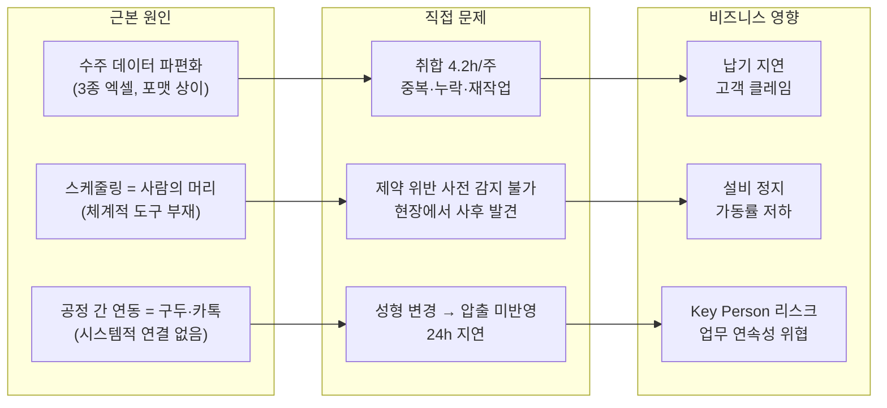

# 문제정의서 v2 (Problem Statement)

> 공정 스케줄링 시스템 — Phase 1
> 작성일: 2026-04-27 | 기준: 4.problem_statement.md 개선판

---

## 🔴 투자역(VC) 리뷰 코멘트

> [!CAUTION]
> **원본(v1)에 대한 일침 — 3가지 구조적 문제**
>
> 1. **이건 문제 정의서가 아니라 요구사항 정의서입니다.**
>    Section 4~5에서 "엑셀 Import 엔진", "간트차트", "자동 역산" 등 솔루션을 이미 확정해놨습니다.
>    문제 정의서에서 솔루션을 선언하면 **창의적 해결책의 가능성을 스스로 닫는 겁니다.**
>
> 2. **'사람'이 안 보입니다.**
>    "생산관리 담당자 3~5명"이라는 라벨만 있고,
>    그 사람이 월요일 아침에 **어떤 감정**으로, **어떤 상황**에서 엑셀을 열고 있는지가 없습니다.
>    수천 개 피치덱을 봤는데, 사람 이야기가 없는 문제 정의서는 **희망 회로의 시작점**입니다.
>
> 3. **KPI 수치 근거가 빈약합니다.**
>    "80% 단축", "90% 감소" — 그래서 현재가 얼마인데요?
>    As-Is 베이스라인 없는 목표치는 **장밋빛 미래**일 뿐입니다.
>    JTBD 인터뷰에서 "주간 취합 4.2시간"이라는 실측치가 있는데 왜 안 쓰셨습니까?

---

## 1. 문제 정의 (Problem Statement)

### 1.1 한 문장 정의

> **매주 월요일, 3종의 엑셀을 수작업으로 취합하고 머릿속 경험에 의존해 스케줄을 짜는 생산관리 담당자가,
> 빈번한 수주 변경과 공정 간 단절 속에서 납기 지연·설비 정지·Key Person 리스크에 시달리고 있다.**

### 1.2 세 가지 조건 검증

| 조건 | 원본(v1) 평가 | v2 반영 |
|------|-------------|---------|
| ① **어떤 상황에 처한 사람**의 문제인가 | ❌ "담당자 3~5명"이라는 라벨만 있음 | ✅ 김정훈 주임의 월요일 아침 상황으로 시작 |
| ② **창의적 해결책**을 모색할 만큼 넓은가 | ❌ Import 엔진, 간트차트 등 솔루션 확정 | ✅ "어떻게"를 빼고 "무엇이 문제인가"만 기술 |
| ③ **MVP 범위**에서 해결 가능할 만큼 구체적인가 | ⚠️ 범위는 있으나 기술 스펙과 혼재 | ✅ Pain 우선순위 기반 MVP 경계만 명시 |

---

## 2. 이 문제가 처한 사람들의 이야기

> [!IMPORTANT]
> 아래는 JTBD 인터뷰(10.jtbd_interview_results.md)에서 수집한 **실제 증거**입니다.
> 가상의 시나리오가 아닙니다.

### 2.1 김정훈 — 생산관리 주임, 7년차

**상황:** 매주 월요일 아침. 월별 예상 발주·KD 발주·주간 발주, 3종의 엑셀이 도착한다. 포맷이 전부 다르다. VLOOKUP과 수동 복붙으로 통합본을 만드는 데 **4.2시간**(자체 측정). 화요일 아침, 고객사에서 수주 변경 연락이 온다. 다시 처음부터.

**증거:**
> *"지난달에 KD 발주 변경을 못 봐서 300개를 못 맞췄어요. 고객사에서 전화 왔을 때 식은땀이 났습니다."*

**핵심 Pain:**
- 3종 엑셀 수작업 취합에 매주 **반나절** 소요 → 대체 솔루션 만족도 **1/5**
- 수주 변경이 매일 발생, 추적 불가 → 대체 솔루션 만족도 **1/5**
- 7년간 축적한 스케줄링 노하우가 **본인 머릿속에만** 존재 (Key Person 리스크)

---

### 2.2 최민혁 — 생산관리 대리, 3년차

**상황:** 김정훈 주임이 연차를 쓴 날. 긴급 수주 변경이 들어왔다. 금형 조건을 모른다. 이전 주 스케줄을 복사해서 살짝 고치는 게 "가장 안전한" 방법이다.

**증거:**
> *"지난달 정훈 주임 연차 때 IC 가류기에 저압 전용 제품을 넣어서 반장님한테 혼났어요."*

**핵심 Pain:**
- 주임 부재 시 스케줄 수립 **불가** → 대체 솔루션 만족도 **1/5**
- 금형·앵글·슬롯 복합 제약 조건 **암기 불가** → 대체 솔루션 만족도 **1/5**

---

### 2.3 박도영 — 압출 현장반장, 10년차

**상황:** 성형 스케줄이 오후에 변경되었다. 카카오톡으로 전달될 줄 알았지만 누락. 다음날 아침, 어젯밤에 엉뚱한 관체를 뽑았다는 걸 알게 된다. 성형 1호기 **2시간 정지**.

**증거:**
> *"이번 달만 관체 부족이 3번 있었어요. 매번 성형 쪽 변경 때문이었습니다."*

**핵심 Pain:**
- 성형 스케줄 변경이 **구두/카톡으로만** 전달 → 대체 솔루션 만족도 **1/5**
- 관체 과부족으로 **성형 라인 정지 또는 재고 적체** → 대체 솔루션 만족도 **2/5**

---

### 2.4 이수진 — 성형 현장반장, 15년차

**상황:** 사무실에서 받은 주간 스케줄표. 앵글 교체가 하루 6번 잡혀 있다. 순서만 바꾸면 2번이면 되는데, 사무실에서는 현장 사정을 모른다. 결국 본인이 종이에 **다시 짠다**.

**증거:**
> *"어제도 앵글을 5번 바꿨는데, 사실 순서만 바꾸면 2번이면 됐거든요. 그걸 사무실에서는 몰라요."*

**핵심 Pain:**
- 스케줄이 현장 제약(슬롯 O/X, 합금형)을 **반영하지 못함** → 대체 솔루션 만족도 **2/5**
- 앵글 교체 과다 → 1회당 20분 + **1회전 생산량 손실**

---

## 3. 문제 구조화

### 3.1 근본 원인 → 직접 문제 → 비즈니스 영향

### 3.2 Pain 우선순위 (GAP 분석 기반)

> **GAP = Pain 중요도 - 대체 솔루션 만족도** (높을수록 시스템 도입 시 체감 개선 큼)

| 순위 | 페르소나 | Pain | 중요도 | 만족도 | **GAP** |
|:----:|----------|------|:------:|:------:|:-------:|
| **1** | 김정훈 | 3종 엑셀 수작업 취합 | 5 | 1 | **4** |
| **1** | 김정훈 | 수주 변경 추적 불가 | 5 | 1 | **4** |
| **1** | 박도영 | 성형 변경 구두 전달 | 5 | 1 | **4** |
| **1** | 최민혁 | 주임 부재 시 스케줄 불가 | 5 | 1 | **4** |
| **1** | 최민혁 | 제약 조건 암기 불가 | 5 | 1 | **4** |
| **6** | 이수진 | 현장 제약 미반영 스케줄 | 5 | 2 | **3** |
| **6** | 박도영 | 관체 과부족 | 5 | 2 | **3** |

---

## 4. 문제의 범위 (Scope)

### 4.1 Phase 1에서 풀어야 할 문제 (MVP 경계)

| # | 풀어야 할 문제 | 대상 사용자 | GAP |
|---|--------------|-----------|:---:|
| P1 | 파편화된 수주 데이터의 통합과 변경 추적 | 김정훈, 최민혁 | 4 |
| P2 | 성형 공정의 복합 제약 조건 검증 자동화 | 최민혁, 이수진 | 4 |
| P3 | 성형-압출 공정 간 스케줄 연동 | 박도영 | 4 |

### 4.2 Phase 1에서 풀지 않는 문제 (명시적 제외)

| 제외 항목 | 사유 |
|----------|------|
| 자재 소요량 계산(MRP) | GAP 낮음(P6, GAP=2), 별도 도메인 |
| 품질-스케줄 결합 분석 | GAP 낮음(P7, GAP=1), 데이터 축적 필요 |
| 경영진 KPI 대시보드 | GAP 낮음(P11, GAP=1), Phase 1 데이터로 구현 가능 시점에 추가 |
| 모바일 야간 조회 뷰 | DOS 낮음(1.2), Phase 2에서 검토 |

### 4.3 적용 범위

| 항목 | 범위 |
|------|------|
| **대상 제품군** | 전체가 아닌 **파일럿 제품군** 선정 후 우선 적용 |
| **대상 공정** | 수주 통합 → 성형 → 압출 |
| **사용자** | 생산관리 담당자 + 현장 관리자, 약 20명 |
| **배포 환경** | 사내 온프레미스 |

---

## 5. 현재 상태의 정량적 근거 (As-Is 베이스라인)

> [!WARNING]
> **목표(To-Be)를 말하기 전에, 현재(As-Is)의 숫자를 먼저 확보해야 합니다.**
> 아래는 JTBD 인터뷰에서 수집된 실측치 + 추가 측정이 필요한 항목입니다.

| 지표 | 현재 수치 | 출처 | 추가 측정 필요 |
|------|----------|------|:-------------:|
| 주간 수주 취합 소요 시간 | **4.2시간** | INT-1 자체 측정 | ⬜ 2주 추가 측정 |
| 월간 수주 변경 누락 건수 | **최소 1건/월** (300개 납기 지연) | INT-1 증언 | ⬜ 정확한 건수 집계 |
| 월간 관체 부족 발생 횟수 | **3건/월** | INT-3 증언 | ⬜ MES 로그 검증 |
| 성형 변경 → 압출 반영 지연 | **~24시간** (다음날 아침 인지) | INT-3 증언 | ⬜ |
| 일일 앵글 교체 횟수 | **5~6회** (최적 시 2~3회 가능) | INT-2 증언 | ⬜ 1주 관찰 기록 |
| 앵글 교체 1회당 손실 | **20분 + 1회전 생산량** | INT-2 증언 | ⬜ |
| 주임 부재 시 제약 위반 건수 | **최소 1건** (IC/저압 혼동) | INT-4 증언 | ⬜ |
| 주간 보고서 작성 시간 | **3시간** | INT-5 증언 | — (Phase 2) |

---

## 6. 성공 기준 (KPI)

> 상세 정의는 `3.Analysis/3.kpi_definition.md` 참조

| 성공 기준 | 측정 지표 | As-Is (실측) | To-Be 목표 | 측정 시점 |
|----------|----------|:------------:|:----------:|----------|
| 수주 통합 시간 단축 | 주간 취합 소요 시간 | **4.2시간** | **30분 이내** | Phase 1 배포 1개월 후 |
| 수주 변경 누락 제거 | 월간 변경 누락 건수 | **≥1건** | **0건** | Phase 1 배포 1개월 후 |
| 공정 간 연동 지연 해소 | 성형 변경→압출 반영 시간 | **~24시간** | **즉시** | Phase 1 배포 1개월 후 |
| 제약 위반 사전 차단 | 제약 위반 건수 (배포 후) | 측정 필요 | **사전 경고율 95%** | Phase 1 배포 2개월 후 |
| 사용자 채택 | 20명 중 활성 사용자 | — | **90% 이상** | 배포 3개월 후 |

---

## 7. 이해관계자

| 역할 | 대표 페르소나 | 핵심 JTBD | Phase 1 관여도 |
|------|------------|----------|:------------:|
| 생산관리 총괄 | 김정훈 (주임, 7년차) | 수주 취합 자동화 + 변경 감지 | 🔴 핵심 사용자 |
| 생산관리 보조 | 최민혁 (대리, 3년차) | 경험 없이도 제약 검증된 스케줄 수립 | 🔴 핵심 사용자 |
| 성형 현장 | 이수진 (반장, 15년차) | 제약 반영된 현실적 스케줄 수령 | 🔴 핵심 사용자 |
| 압출 현장 | 박도영 (반장, 10년차) | 성형 변경 시 압출 자동 연동 | 🔴 핵심 사용자 |
| 생산기획 | 한소라 (과장, 18년차) | 계획 vs 실적 자동 비교 | 🟡 Phase 2 |
| 공장장 | 강병철 (55세) | KPI 대시보드 | ⚫ 스폰서 |

---

## 8. 전제 조건 및 리스크

### 8.1 전제 조건

| # | 전제 | 미충족 시 영향 |
|---|------|-------------|
| A-01 | BOM 데이터 정비 완료 | 소요량 계산 불가 |
| A-02 | 자체 MES에 API/DB 접근 가능 | 실적 연동 불가 |
| A-03 | 핵심 사용자(김정훈, 이수진) 기획 참여 | 현장 괴리 |
| A-04 | 경영진 지원 의지 | 도입 추진력 부재 |
| A-05 | 사내 서버 배포 환경 확보 | 배포 불가 |

### 8.2 핵심 리스크

| # | 리스크 | 확률 | 영향 | 대응 | 증거 |
|---|--------|:----:|:----:|------|------|
| R-01 | 마스터 데이터 부정확 | 중 | 🔴 | 개발 전 데이터 검증 단계 | — |
| R-02 | 현장 사용자 저항 | 중 | 🔴 | 핵심 사용자 Day 1 참여, **엑셀 병행 허용** | INT-2: *"15년 해왔으니까 머리로 짜는 게 더 빠르다고 느껴질 때가 있어요"* |
| R-03 | 과거 시스템 도입 실패 트라우마 | 중 | 🔴 | 파일럿 1개월 후 KPI 비교 보고 | INT-8: *"3년 전 바코드 시스템 5천만원 날렸습니다"* |
| R-04 | 알고리즘 현실 괴리 | 중 | 🟡 | **수동 조정 우선**, 자동화는 점진적 | INT-2: *"컴퓨터가 현장 사정을 모르잖아요"* |
| R-05 | Key Person(김정훈) 이탈 시 프로젝트 좌초 | 중 | 🟡 | 최민혁 동시 참여, 문서화 | — |

---

## 9. 다음 단계

| 순서 | 작업 | 산출물 | 상태 |
|------|------|--------|------|
| 1 | **As-Is 베이스라인 정량 측정** (2주) | 현재 수치 기록표 | ⬜ |
| 2 | **파일럿 제품군 선정** | 대상 품번 리스트 | ⬜ 현장 협의 |
| 3 | **RPD 요구사항 정의** | 기능 요구사항 상세 | ⬜ |

---

## 10. v1 → v2 변경 이력

| 항목 | v1 (원본) | v2 (개선) | 변경 사유 |
|------|----------|----------|----------|
| Section 1 | 프로젝트 개요 (배경, 목적) | **한 문장 문제 정의 + 3조건 검증** | 문제 정의서의 본질에 집중 |
| Section 2 | As-Is (업무 흐름도, 기술 현황) | **사람의 이야기 + 실제 증거** | "어떤 상황에 처한 사람"을 드러냄 |
| Section 3 | Pain Points (일반적 서술) | **구조화 + GAP 분석 순위** | 우선순위 근거 명확화 |
| Section 4 (v1) | **To-Be (솔루션 확정: Import 엔진, 간트차트 등)** | **삭제** | 문제 정의서에서 솔루션을 확정하면 안 됨 |
| Section 5 (v1) | **제약 조건 상세 (기술 스펙)** | **삭제** | RPD/SRS 영역으로 이동 예정 |
| Section 6 (v1) | JTBD 3개 (간략) | **Section 2로 통합**, 8명 인터뷰 증거 활용 | 실제 데이터 기반으로 강화 |
| Section 5 (v2) | — | **As-Is 베이스라인 정량 표** | 목표(KPI)의 근거 확보 |
| KPI | "80% 단축" (베이스라인 없음) | **"4.2시간 → 30분"** (실측 기반) | 수치 근거 보강 |

---

## 참조 문서

| 문서 | 위치 |
|------|------|
| 원본 문제정의서 (v1) | `3.Analysis/4.problem_statement.md` |
| JTBD 인터뷰 결과 | `3.Analysis/10.jtbd_interview_results.md` |
| Pain/Goal 분석 | `3.Analysis/7.persona_pain_goal_analysis.md` |
| 페르소나 스펙트럼 | `3.Analysis/6.persona_spectrum.md` |
| KPI 정의 | `3.Analysis/3.kpi_definition.md` |
| 핵심성공요인(CSF) | `3.Analysis/2.critical_success_factors.md` |

> [!NOTE]
> **v1의 Section 4(To-Be), Section 5(제약 조건 상세)는 삭제가 아닌 RPD(요구사항 정의서)로 이관됩니다.**
> 해당 내용은 기술적으로 정확하며, 다음 단계(RPD/SRS)에서 핵심 입력 자료가 됩니다.
