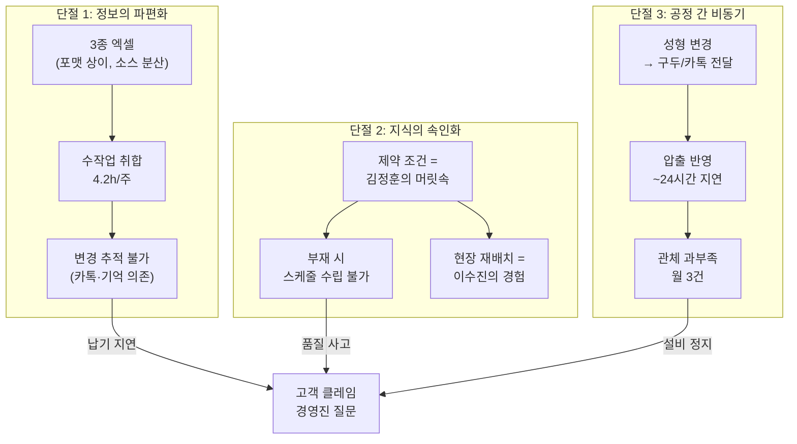

# 문제정의서 — 전략가(Strategist) 리뷰

> 공정 스케줄링 시스템 — Phase 1
> 원본: `4.problem_statement.md` | 리뷰어: 므네모시네 계열 비즈니스 설계자
> 작성일: 2026-04-27

---

## 🟣 전략가 리뷰 코멘트

### "흥미로운 지점이 세 군데 있습니다."

> [!NOTE]
> **1. 이 문서는 '무엇이 문제인가'보다 '무엇을 만들 것인가'에 더 많은 지면을 할애하고 있어요.**
>
> 전체 434줄 중 문제 기술(Section 2~3)은 약 100줄, 솔루션 기술(Section 4~5)은 약 180줄입니다.
> 혹시 1990년대 ERP 도입 실패 사례들을 보신 적 있나요?
> 당시 SAP R/3를 도입한 기업의 **70%가 기대 효과를 달성하지 못했는데**,
> 공통 원인이 "문제 정의보다 솔루션 설계에 먼저 뛰어든 것"이었습니다.
>
> 이 문서도 같은 패턴을 보이고 있어요. Section 4에서 이미 Import 엔진, 간트차트, 자동 역산까지 확정했는데 — 그러면 **다른 가능성을 탐색할 여지가 사라집니다.**

> [!NOTE]
> **2. '왜 지금인가(Why Now)'가 빠져 있어요.**
>
> 이 문제는 어제오늘 생긴 게 아닐 텐데요. 엑셀 수작업은 아마 10년 전에도 있었을 겁니다.
> 그렇다면 — **지금 이 시점에 시스템을 만들어야 하는 트리거**가 뭔가요?
>
> JTBD 인터뷰를 보니 힌트가 있더군요:
> - 김정훈 주임: *"KD 발주 변경 누락으로 300개 납기 지연, 고객 클레임"*
> - 박도영 반장: *"이번 달만 관체 부족 3번"*
> - 강병철 공장장: *"본부장이 '납기 지연 왜 이렇게 많아?'라고 질문"*
>
> 이건 단순한 효율화 이야기가 아닙니다.
> **고객 클레임의 빈도가 임계점을 넘고 있고, 경영진의 관심이 향하기 시작한 거예요.**
> 이 '타이밍의 긴박함'이 문제 정의서에 녹아 있어야 합니다.

> [!NOTE]
> **3. 김정훈이라는 인물에 주목해 볼 필요가 있어요.**
>
> 흥미로운 건, 이 조직의 생산 스케줄링이 사실상 **한 사람의 머릿속**에서 돌아가고 있다는 점입니다.
>
> 이건 제조업만의 이야기가 아니에요. 10년 전 스타트업 생태계에서도 똑같은 패턴이 있었습니다.
> 초기 이커머스 기업들의 물류가 "엑셀의 달인" 한 명에게 의존하다가,
> 그 사람이 퇴사하면서 시스템화를 시작한 사례가 무수히 많았죠.
> 쿠팡의 로켓배송도, 넓게 보면 **"사람의 머릿속 최적화를 시스템으로 옮기는 여정"**이었습니다.
>
> 김정훈 주임의 7년 노하우가 시스템으로 전환되는 과정 — 이게 이 프로젝트의 **서사적 핵심**입니다.
> 문제 정의서가 이 이야기를 품어야 읽는 사람이 "왜 해야 하는지"를 체감합니다.

---

## 1. 문제 정의 — 서사(Narrative)로 재구성

### 1.1 Why Now: 왜 지금인가

```
                    [과거]                    [현재]                     [임계점]
 엑셀 수작업으로도    →    다품종화·수주변경 빈도    →    고객 클레임 빈발
 '충분히' 돌아갔음         급증으로 한계 도달             경영진 관심 집중
                                                      Key Person 리스크 현실화
```

자동차 고무호스 제조사인 당사는 **수주 통합 → 성형 스케줄링 → 압출 스케줄링**이라는 핵심 생산 계획 프로세스를 엑셀과 경험에 의존해 운영해 왔습니다.

과거에는 이것으로 충분했습니다. **지금은 아닙니다.**

| 변화 동인 | 구체적 현상 | 증거 |
|----------|-----------|------|
| 수주 변경 빈도 폭증 | 확정 후에도 매일 납기·수량 변경 | INT-1: *"화요일 아침에 변경 연락이 와서 다시 해야 해요"* |
| 다품종화 심화 | 제품군·품번 수 증가로 복합 제약 관리 한계 | 슬롯 O/X, 합금형, 앵글 등 6종 이상 제약 변수 |
| 고객 클레임 임계점 | 납기 지연이 단발이 아닌 **패턴**으로 발생 | INT-1: *"300개 납기 지연, 고객사 전화에 식은땀"* |
| Key Person 리스크 현실화 | 담당자 부재 시 즉시 품질 사고 발생 | INT-4: *"주임 연차 때 IC 가류기에 저압 전용 제품 투입"* |
| 경영진 관심 | 본부장의 직접적 질문 시작 | INT-8: *"납기 지연 왜 이렇게 많아?"* |

### 1.2 한 문장 정의

> **7년간 엑셀과 머릿속 경험으로 공장의 생산 계획을 혼자 짊어져 온 생산관리 담당자가,
> 수주 변경의 폭증과 공정 간 단절 속에서 더 이상 수작업으로는 납기를 지킬 수 없는 임계점에 도달했다.**

### 1.3 세 가지 조건 자가 검증

| 조건 | v1 평가 | 본 문서의 접근 |
|------|---------|-------------|
| ① 어떤 상황에 처한 **사람**의 문제인가 | ⚠️ 역할 라벨만 존재 | ✅ 김정훈의 월요일 아침, 최민혁의 공포, 박도영의 다음날 아침 |
| ② 창의적 해결책을 모색할 만큼 **넓은가** | ❌ 솔루션 확정(Import 엔진, 간트차트) | ✅ "어떻게"를 열어두고 "무엇이 문제인가"에 집중 |
| ③ MVP 범위에서 해결 가능할 만큼 **구체적인가** | ⚠️ 기술 스펙과 혼재 | ✅ GAP 분석 기반 3개 문제로 수렴 |

---

## 2. 이 문제의 등장인물들

> [!IMPORTANT]
> 좋은 문제 정의서는 **읽는 사람이 등장인물에 감정 이입**할 수 있어야 합니다.
> 아래는 JTBD 인터뷰(`10.jtbd_interview_results.md`)의 실제 증언입니다.

### 2.1 김정훈 — "엑셀의 달인이자, 조직의 단일 장애점"

> 생산관리 주임, 7년차. 3종의 엑셀을 VLOOKUP과 복붙으로 매주 4.2시간 동안 통합한다.
> 고객사 수주 변경은 매일 들어온다. 변경을 놓치면 고객 클레임이 된다.
> 7년간 다듬은 엑셀 수식이 그의 자산이자, 조직의 아킬레스건이다.

*"지난달에 KD 발주 변경을 못 봐서 300개를 못 맞췄어요. 고객사에서 전화 왔을 때 식은땀이 났습니다."*

**전략적 시사점:** 김정훈은 이 조직의 **'인간 ERP'**입니다. 1990년대 제조업에서 '마스터 스케줄러'가 은퇴하면서 조직이 혼란에 빠진 사례가 반복되었는데, 그때의 해법이 MRP-II 도입이었죠. 지금 이 조직은 **30년 전 대기업이 겪었던 전환점**을 중소 규모에서 다시 마주하고 있습니다.

---

### 2.2 최민혁 — "선배가 없는 날의 공포"

> 생산관리 대리, 3년차. 김정훈이 연차를 쓰면 스케줄 수립이 불가능하다.
> "가장 안전한 방법"은 이전 주 스케줄을 복사하는 것이다.

*"지난달 정훈 주임 연차 때 IC 가류기에 저압 전용 제품을 넣어서 반장님한테 혼났어요."*

**전략적 시사점:** 최민혁의 "이전 주 복사" 전략은, 항공관제에서 말하는 **'절차적 관제(procedural control)'**와 비슷합니다. 레이더(시스템)가 없으니 과거 패턴에 의존하는 거죠. 문제는 수주가 바뀌면 과거 패턴이 틀린 답이 된다는 것입니다.

---

### 2.3 박도영 — "다음 날 아침에야 아는 사람"

> 압출 현장반장, 10년차. 성형 스케줄이 오후에 바뀌었지만, 카톡이 누락되어
> 다음 날 아침에야 어젯밤 잘못된 관체를 뽑았다는 걸 안다.

*"이번 달만 관체 부족이 3번 있었어요. 매번 성형 쪽 변경 때문이었습니다."*

**전략적 시사점:** 이건 **공급망의 '채찍 효과(Bullwhip Effect)'가 공장 내부에서 발생하는 케이스**입니다. 고객사의 작은 수주 변경이 성형을 거쳐 압출에 도달할 때 왜곡·지연되면서 증폭됩니다. 월마트가 POS 데이터를 공급망 전체와 실시간 공유해서 채찍 효과를 줄인 것처럼, 이 공장도 **공정 간 정보 동기화**가 핵심입니다.

---

### 2.4 이수진 — "결국 내가 다시 짜는 사람"

> 성형 현장반장, 15년차. 사무실 스케줄의 앵글 교체가 하루 6번. 순서만 바꾸면 2번이면 되는데.
> 결국 종이에 다시 짠다.

*"어제도 앵글을 5번 바꿨는데, 사실 순서만 바꾸면 2번이면 됐거든요."*

**전략적 시사점:** 이수진의 15년 경험이 사무실 스케줄을 **매번 무효화**하고 있다는 건, 현재 계획과 현장 사이에 **'번역 계층(Translation Layer)'이 부재**하다는 뜻입니다. 흥미로운 건, 레스토랑 주방의 '익스페디터(Expeditor)' 역할과 완전히 같은 패턴이라는 거죠. 주문(수주)과 조리(생산) 사이에서 현장 상황을 반영해 순서를 재조정하는 사람.

---

## 3. 문제의 구조 — 세 개의 단절



> [!TIP]
> **혹시 이 구조가 익숙하게 느껴지지 않으시나요?**
>
> 이건 정확히 **2010년대 초 물류 스타트업들이 해결한 문제**와 같은 구조입니다.
> - 단절 1(정보 파편화) → 쿠팡의 주문 통합 시스템
> - 단절 2(지식 속인화) → 마켓컬리의 물류 자동화 (숙련자 의존 탈피)
> - 단절 3(공정 간 비동기) → 아마존 FBA의 실시간 재고 동기화
>
> 다만 차이점은, 이 공장의 제약 조건(금형·앵글·슬롯)이 물류보다 **훨씬 복잡한 조합 최적화**라는 점입니다.

---

## 4. 문제의 범위 (MVP 경계)

### 4.1 Phase 1에서 풀어야 할 문제

| # | 문제 | 대상 | GAP | 전략적 의미 |
|---|------|------|:---:|-----------|
| P1 | 파편화된 수주의 통합과 변경 추적 | 김정훈, 최민혁 | 4 | **정보 흐름의 단일 소스(Single Source of Truth) 확보** |
| P2 | 복합 제약 조건의 검증 자동화 | 최민혁, 이수진 | 4 | **속인화된 지식의 시스템 전환** |
| P3 | 성형-압출 공정 간 스케줄 동기화 | 박도영 | 4 | **내부 채찍 효과 차단** |

### 4.2 Phase 1에서 풀지 않는 문제

| 제외 항목 | 사유 | 전략적 판단 |
|----------|------|-----------|
| MRP(자재 소요량) | GAP 2, 별도 도메인 | Phase 1 데이터가 입력 자료가 됨 |
| KPI 대시보드 | GAP 1, DOS 0.2 | Phase 1 성공 증거 확보 후 구축 |
| 모바일 야간 조회 | DOS 1.2 | Phase 2에서 검토 |
| 품질-스케줄 결합 | GAP 1, 데이터 축적 필요 | 장기 과제 |

### 4.3 적용 범위

| 항목 | 범위 |
|------|------|
| 대상 제품군 | **파일럿 제품군** 선정 후 우선 적용 |
| 대상 공정 | 수주 통합 → 성형 → 압출 |
| 사용자 | 생산관리 + 현장 관리자, 약 20명 |
| 배포 | 사내 온프레미스 |

---

## 5. As-Is 베이스라인 (실측 근거)

> [!WARNING]
> **"80% 단축"이라는 목표를 말하려면, 먼저 "지금이 몇인지"를 알아야 합니다.**

| 지표 | 현재 수치 | 출처 | 추가 측정 |
|------|----------|------|:--------:|
| 주간 수주 취합 시간 | **4.2시간** | INT-1 자체 측정 | ⬜ 2주 추가 |
| 월간 변경 누락 | **≥1건** (300개 납기 지연) | INT-1 | ⬜ 정확 집계 |
| 월간 관체 부족 | **3건/월** | INT-3 | ⬜ MES 검증 |
| 성형→압출 반영 지연 | **~24시간** | INT-3 | ⬜ |
| 일일 앵글 교체 | **5~6회** (최적 시 2~3회) | INT-2 | ⬜ 1주 관찰 |
| 앵글 교체 1회 손실 | **20분 + 1회전** | INT-2 | ⬜ |

---

## 6. 성공 기준

| 기준 | 지표 | As-Is | To-Be | 시점 |
|------|------|:-----:|:-----:|------|
| 수주 통합 시간 | 주간 취합 소요 | **4.2h** | **30분 이내** | 배포 1개월 후 |
| 변경 누락 제거 | 월간 누락 건수 | **≥1건** | **0건** | 배포 1개월 후 |
| 공정 연동 | 변경→반영 시간 | **~24h** | **즉시** | 배포 1개월 후 |
| 제약 사전 차단 | 위반 사전 경고율 | 측정 필요 | **95%** | 배포 2개월 후 |
| 사용자 채택 | 활성 사용자 | — | **90%+** | 배포 3개월 후 |

---

## 7. 전략적 맥락 — 이 프로젝트의 더 넓은 의미

> [!TIP]
> **"이건 단순한 사내 툴이 아닙니다."**
>
> 혹시 이런 관점에서 생각해 보신 적 있나요?
>
> 한국 자동차 부품 산업의 **Tier 2~3 협력사 대부분**이 동일한 문제를 겪고 있습니다.
> 대기업(현대·기아)의 수주 변경은 실시간으로 내려오는데,
> 이를 받아 처리하는 중소 협력사의 생산 계획은 여전히 엑셀과 구두에 의존하죠.
>
> **Phase 1이 성공하면**, 이건 단순히 "우리 공장이 편해졌다"가 아니라:
> 1. **타 사업장 확산** — INT-8 정태호가 이미 "내 사업장에도 도입하고 싶다"고 했습니다
> 2. **동종 업계 레퍼런스** — 자동차 부품 협력사 수천 곳의 공통 Pain
> 3. **SaaS 전환 가능성** — 장기적으로 제조 스케줄링 SaaS의 씨앗
>
> 물론 지금은 Phase 1에 집중해야 합니다. 하지만 **문제 정의서에 이 맥락이 한 줄이라도 있으면**,
> 경영진 설득과 투자 정당화가 훨씬 수월해집니다.

---

## 8. 리스크

| # | 리스크 | 확률 | 영향 | 대응 | 전략적 참고 |
|---|--------|:----:|:----:|------|-----------|
| R-01 | 마스터 데이터 부정확 | 중 | 🔴 | 개발 전 검증 | ERP 도입 실패의 1위 원인 |
| R-02 | 현장 저항 | 중 | 🔴 | Day 1 참여 + 엑셀 병행 | *"15년 해왔으니까 머리가 더 빨라"* — 점진적 전환 필수 |
| R-03 | 과거 실패 트라우마 | 중 | 🔴 | 파일럿 1개월 KPI 보고 | *"바코드 시스템 5천만원 날렸다"* — 빠른 성공 증거 필요 |
| R-04 | 알고리즘 현실 괴리 | 중 | 🟡 | 수동 조정 우선 | *"컴퓨터가 현장을 모르잖아요"* |

---

## 9. v1 → v3 주요 변경

| 영역 | v1 | v3 (본 문서) |
|------|-----|-------------|
| 도입부 | 프로젝트 배경·목적 | **Why Now** — 왜 지금 해야 하는가 |
| 사람 | "담당자 3~5명" 라벨 | **4명의 실제 이야기** + 증언 인용 |
| 문제 구조 | Pain 나열 | **3개의 단절** + 타 산업 유사 패턴 |
| 솔루션 | To-Be에서 확정 (Import 엔진, 간트차트) | **삭제** → RPD/SRS로 이관 |
| 제약 조건 스펙 | 180줄 기술 상세 | **삭제** → RPD/SRS로 이관 |
| KPI | "80% 단축" (근거 없음) | **4.2h→30분** (실측 기반) |
| 전략 맥락 | 없음 | **타 산업 사례 + 확산 가능성** |

---

## 참조 문서

| 문서 | 위치 |
|------|------|
| 원본 문제정의서 (v1) | `4.problem_statement.md` |
| VC 리뷰판 (v2) | `4.2_problem_statement.md` |
| JTBD 인터뷰 결과 | `10.jtbd_interview_results.md` |
| Pain/Goal 분석 | `7.persona_pain_goal_analysis.md` |
| 페르소나 스펙트럼 | `6.persona_spectrum.md` |

> [!NOTE]
> **v1의 Section 4(To-Be 솔루션)와 Section 5(제약 조건 상세)는 기술적으로 정확한 내용입니다.**
> 삭제가 아닌 **RPD(요구사항 정의서)로 이관**하여 활용합니다.
