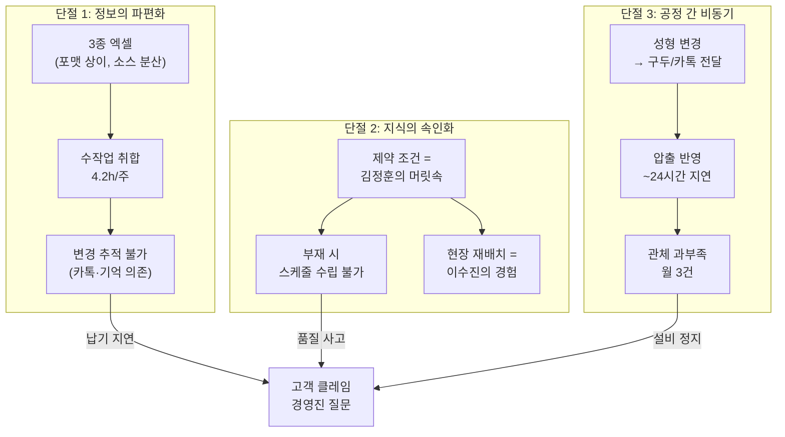

# 문제정의서 — Master (Problem Statement v2.0)

> 공정 스케줄링 시스템 — Phase 1
> 작성일: 2026-04-28 | 통합 기준: 11.1(VC), 11.2(전략가), 11.3(분석가) 리뷰 반영
> 본 문서는 MVP · RPD · SRS 작성의 **단일 기준 문서(Single Source of Truth)**입니다.

---

## 1. Why Now — 왜 지금인가

```
[과거]                      [현재]                        [임계점]
엑셀 수작업으로도      →   다품종화·수주변경 빈도      →   고객 클레임 빈발
'충분히' 돌아갔음           급증으로 한계 도달              경영진 관심 집중
                                                         Key Person 리스크 현실화
```

자동차 고무호스 제조사인 당사는 **수주 통합 → 성형 → 압출**이라는 핵심 생산 계획을 엑셀과 경험에 의존해 운영해 왔다. 과거에는 충분했다. **지금은 아니다.**

| 변화 동인 | 구체적 현상 | 증거 |
|----------|-----------|------|
| 수주 변경 빈도 폭증 | 확정 후에도 매일 납기·수량 변경 | INT-1: *"화요일 아침에 변경 연락이 와서 다시 해야 해요"* |
| 다품종화 심화 | 품번 수 증가, 복합 제약 관리 한계 | 슬롯 O/X, 합금형, 앵글 등 6종 이상 제약 변수 |
| 고객 클레임 임계점 | 납기 지연이 **패턴**으로 발생 | INT-1: *"300개 납기 지연, 고객사 전화에 식은땀"* |
| Key Person 리스크 | 담당자 부재 시 즉시 품질 사고 | INT-4: *"주임 연차 때 IC 가류기에 저압 전용 제품 투입"* |
| 경영진 관심 | 본부장의 직접적 질문 시작 | INT-8: *"납기 지연 왜 이렇게 많아?"* |

---

## 2. 문제 정의 (Problem Statement)

### 2.1 한 문장 정의

> **매주 월요일, 3종의 엑셀을 수작업으로 취합하고 머릿속 경험에 의존해 스케줄을 짜는 생산관리 담당자가, 수주 변경의 폭증과 공정 간 단절 속에서 더 이상 수작업으로는 납기를 지킬 수 없는 임계점에 도달했다.**

### 2.2 세 가지 조건 검증

| 조건 | 원본(v1) | 본 문서(v2.0) |
|------|---------|-------------|
| ① 어떤 상황에 처한 **사람**의 문제인가 | ❌ "담당자 3~5명" 라벨만 존재 | ✅ 4명의 실명·상황·증언으로 기술 |
| ② 창의적 해결책을 모색할 만큼 **넓은가** | ❌ Import 엔진, 간트차트 등 솔루션 확정 | ✅ "어떻게"를 열어두고 "무엇이 문제인가"에 집중 |
| ③ MVP 범위에서 해결 가능할 만큼 **구체적인가** | ⚠️ 기술 스펙과 혼재 | ✅ GAP 분석 기반 3개 문제로 수렴 |

---

## 3. 이 문제를 겪는 사람들

> [!IMPORTANT]
> 아래는 JTBD 인터뷰(`10.jtbd_interview_results.md`)에서 수집한 **실제 증거**입니다.

### 3.1 김정훈 — 생산관리 주임, 7년차 (조직의 '인간 ERP')

**상황:** 매주 월요일 아침. 월별 예상·KD 발주·주간 발주, 3종의 엑셀이 도착한다. 포맷이 전부 다르다. VLOOKUP과 수동 복붙으로 통합본을 만드는 데 **4.2시간**(자체 측정). 화요일 아침, 고객사에서 수주 변경 연락. 다시 처음부터.

> *"지난달에 KD 발주 변경을 못 봐서 300개를 못 맞췄어요. 고객사에서 전화 왔을 때 식은땀이 났습니다."*

**핵심 Pain:**
- 3종 엑셀 수작업 취합 매주 **반나절** 소요 → 대체 솔루션 만족도 **1/5**
- 수주 변경 매일 발생, 추적 불가 → 대체 솔루션 만족도 **1/5**
- 7년간 축적한 노하우가 **본인 머릿속에만** 존재 (Key Person 리스크)

---

### 3.2 최민혁 — 생산관리 대리, 3년차 (선배가 없는 날의 공포)

**상황:** 김정훈 주임이 연차를 쓴 날. 긴급 수주 변경이 들어왔다. 금형 조건을 모른다. "가장 안전한 방법"은 이전 주 스케줄을 복사하는 것이다.

> *"지난달 정훈 주임 연차 때 IC 가류기에 저압 전용 제품을 넣어서 반장님한테 혼났어요."*

**핵심 Pain:**
- 주임 부재 시 스케줄 수립 **불가** → 만족도 **1/5**
- 금형·앵글·슬롯 복합 제약 조건 **암기 불가** → 만족도 **1/5**

---

### 3.3 박도영 — 압출 현장반장, 10년차 (다음 날 아침에야 아는 사람)

**상황:** 성형 스케줄이 오후에 변경되었다. 카카오톡으로 전달될 줄 알았지만 누락. 다음날 아침, 엉뚱한 관체를 뽑았다는 걸 알게 된다.

> *"이번 달만 관체 부족이 3번 있었어요. 매번 성형 쪽 변경 때문이었습니다."*

**핵심 Pain:**
- 성형 스케줄 변경이 **구두/카톡으로만** 전달 → 만족도 **1/5**
- 관체 과부족으로 **성형 라인 정지 또는 재고 적체** → 만족도 **2/5**

---

### 3.4 이수진 — 성형 현장반장, 15년차 (결국 내가 다시 짜는 사람)

**상황:** 사무실에서 받은 주간 스케줄표. 앵글 교체가 하루 6번. 순서만 바꾸면 2번이면 되는데, 사무실에서는 현장 사정을 모른다. 결국 종이에 **다시 짠다**.

> *"어제도 앵글을 5번 바꿨는데, 사실 순서만 바꾸면 2번이면 됐거든요. 그걸 사무실에서는 몰라요."*

**핵심 Pain:**
- 스케줄이 현장 제약(슬롯 O/X, 합금형)을 **반영하지 못함** → 만족도 **2/5**
- 앵글 교체 과다 → 1회당 20분 + **1회전 생산량 손실**

---

## 4. 문제 구조화 — 세 개의 단절



### 세 줄 요약 (실무 언어)

```
1. 엑셀이 3개인데 포맷이 다 달라서, 합치는 데 반나절 걸림
2. 스케줄을 짤 줄 아는 사람이 한 명이라, 그 사람 없으면 사고남
3. 성형이랑 압출이 카톡으로 연결되어서, 누락되면 라인 섬
```

### Pain 우선순위 (GAP 분석)

> **GAP = Pain 중요도 - 대체 솔루션 만족도** (높을수록 시스템 도입 시 체감 개선 큼)

| 순위 | 페르소나 | Pain | 중요도 | 만족도 | **GAP** |
|:----:|----------|------|:------:|:------:|:-------:|
| **1** | 김정훈 | 3종 엑셀 수작업 취합 | 5 | 1 | **4** |
| **1** | 김정훈 | 수주 변경 추적 불가 | 5 | 1 | **4** |
| **1** | 박도영 | 성형 변경 구두 전달 | 5 | 1 | **4** |
| **1** | 최민혁 | 주임 부재 시 스케줄 불가 | 5 | 1 | **4** |
| **1** | 최민혁 | 제약 조건 암기 불가 | 5 | 1 | **4** |
| **6** | 이수진 | 현장 제약 미반영 스케줄 | 5 | 2 | **3** |
| **6** | 박도영 | 관체 과부족 | 5 | 2 | **3** |

---

## 5. 문제의 범위 (Scope)

### 5.1 Phase 1에서 풀어야 할 문제 (MVP 경계)

| # | 문제 | 대상 사용자 | GAP | 전략적 의미 |
|---|------|-----------|:---:|-----------|
| P1 | 파편화된 수주 데이터의 통합과 변경 추적 | 김정훈, 최민혁 | 4 | 정보 흐름의 SSoT 확보 |
| P2 | 성형 공정의 복합 제약 조건 검증 자동화 | 최민혁, 이수진 | 4 | 속인화된 지식의 시스템 전환 |
| P3 | 성형-압출 공정 간 스케줄 연동 | 박도영 | 4 | 내부 채찍 효과 차단 |

### 5.2 Phase 1에서 풀지 않는 문제 (명시적 제외)

| 제외 항목 | 사유 |
|----------|------|
| 자재 소요량 계산(MRP) | GAP 낮음(GAP=2), 별도 도메인. Phase 1 데이터가 입력 자료가 됨 |
| 품질-스케줄 결합 분석 | GAP 낮음(GAP=1), 데이터 축적 필요 |
| 경영진 KPI 대시보드 | GAP 낮음(GAP=1), Phase 1 성공 증거 확보 후 구축 |
| 모바일 야간 조회 뷰 | DOS 낮음(1.2), Phase 2에서 검토 |

### 5.3 적용 범위

| 항목 | 범위 |
|------|------|
| **대상 제품군** | 전체 X → **파일럿 제품군** 선정 후 우선 적용 |
| **대상 공정** | 수주 통합 → 성형 → 압출 |
| **사용자** | 생산관리 담당자 + 현장 관리자, 약 20명 |
| **배포 환경** | 사내 온프레미스 |

---

## 6. As-Is 베이스라인 (실측 근거)

> [!WARNING]
> **목표(To-Be)를 말하기 전에, 현재(As-Is)의 숫자를 먼저 확보해야 한다.**
> "80% 단축"이라고 쓰려면, "지금 몇 시간인데요?"라는 질문에 답할 수 있어야 한다.

| 지표 | 현재 수치 | 출처 | 추가 측정 필요 |
|------|----------|------|:-------------:|
| 주간 수주 취합 소요 시간 | **4.2시간** | INT-1 자체 측정 | ⬜ 2주 추가 측정 |
| 월간 수주 변경 누락 건수 | **≥1건/월** (300개 납기 지연) | INT-1 증언 | ⬜ 정확한 건수 집계 |
| 월간 관체 부족 발생 횟수 | **3건/월** | INT-3 증언 | ⬜ MES 로그 검증 |
| 성형 변경 → 압출 반영 지연 | **~24시간** (다음날 아침 인지) | INT-3 증언 | ⬜ |
| 일일 앵글 교체 횟수 | **5~6회** (최적 시 2~3회 가능) | INT-2 증언 | ⬜ 1주 관찰 기록 |
| 앵글 교체 1회당 손실 | **20분 + 1회전 생산량** | INT-2 증언 | ⬜ |
| 주임 부재 시 제약 위반 건수 | **최소 1건** (IC/저압 혼동) | INT-4 증언 | ⬜ |

---

## 7. 성공 기준 (KPI)

> 상세 정의는 `3.Analysis/3.kpi_definition.md` 참조

| 성공 기준 | 측정 지표 | As-Is (실측) | To-Be 목표 | 측정 시점 |
|----------|----------|:------------:|:----------:|----------|
| 수주 통합 시간 단축 | 주간 취합 소요 시간 | **4.2시간** | **30분 이내** | 배포 1개월 후 |
| 수주 변경 누락 제거 | 월간 변경 누락 건수 | **≥1건** | **0건** | 배포 1개월 후 |
| 공정 간 연동 지연 해소 | 성형 변경→압출 반영 시간 | **~24시간** | **즉시** | 배포 1개월 후 |
| 제약 위반 사전 차단 | 제약 위반 사전 경고율 | 측정 필요 | **95%** | 배포 2개월 후 |
| 사용자 채택 | 20명 중 활성 사용자 | — | **90% 이상** | 배포 3개월 후 |

---

## 8. 이해관계자

| 역할 | 대표 페르소나 | 핵심 JTBD | Phase 1 관여도 |
|------|------------|----------|:------------:|
| 생산관리 총괄 | 김정훈 (주임, 7년차) | 수주 취합 자동화 + 변경 감지 | 🔴 핵심 사용자 |
| 생산관리 보조 | 최민혁 (대리, 3년차) | 경험 없이도 제약 검증된 스케줄 수립 | 🔴 핵심 사용자 |
| 성형 현장 | 이수진 (반장, 15년차) | 제약 반영된 현실적 스케줄 수령 | 🔴 핵심 사용자 |
| 압출 현장 | 박도영 (반장, 10년차) | 성형 변경 시 압출 자동 연동 | 🔴 핵심 사용자 |
| 생산기획 | 한소라 (과장, 18년차) | 계획 vs 실적 자동 비교 | 🟡 Phase 2 |
| 공장장 | 강병철 (55세) | KPI 대시보드 | ⚫ 스폰서 |

---

## 9. 전제 조건 및 리스크

### 9.1 전제 조건

| # | 전제 | 미충족 시 영향 |
|---|------|-------------|
| A-01 | BOM 데이터 정비 완료 | 소요량 계산 불가 |
| A-02 | 자체 MES에 API/DB 접근 가능 | 실적 연동 불가 |
| A-03 | 핵심 사용자(김정훈, 이수진) 기획 참여 | 현장 괴리 |
| A-04 | 경영진 지원 의지 | 도입 추진력 부재 |
| A-05 | 사내 서버 배포 환경 확보 | 배포 불가 |

### 9.2 핵심 리스크

| # | 리스크 | 확률 | 영향 | 대응 | 증거 |
|---|--------|:----:|:----:|------|------|
| R-01 | 마스터 데이터 부정확 | 중 | 🔴 | 개발 전 데이터 검증 단계 | ERP 도입 실패의 1위 원인 |
| R-02 | 현장 사용자 저항 | 중 | 🔴 | Day 1 참여 + **엑셀 병행 허용** | INT-2: *"15년 해왔으니까 머리가 더 빨라"* |
| R-03 | 과거 실패 트라우마 | 중 | 🔴 | 파일럿 1개월 KPI 비교 보고 | INT-8: *"바코드 시스템 5천만원 날렸다"* |
| R-04 | 알고리즘 현실 괴리 | 중 | 🟡 | **수동 조정 우선**, 자동화는 점진적 | INT-2: *"컴퓨터가 현장을 모르잖아요"* |
| R-05 | Key Person(김정훈) 이탈 | 중 | 🟡 | 최민혁 동시 참여, 문서화 | — |

---

## 10. 전략적 맥락 — 더 넓은 의미

> [!TIP]
> 한국 자동차 부품 Tier 2~3 협력사 대부분이 동일한 문제를 겪고 있다.
> Phase 1이 성공하면:
> 1. **타 사업장 확산** — INT-8: "내 사업장에도 도입하고 싶다"
> 2. **동종 업계 레퍼런스** — 자동차 부품 협력사 수천 곳의 공통 Pain
> 3. **SaaS 전환 가능성** — 장기적으로 제조 스케줄링 SaaS의 씨앗

---

## 11. 다음 단계

| 순서 | 작업 | 산출물 | 상태 |
|------|------|--------|------|
| 1 | **As-Is 베이스라인 정량 측정** (2주) | 현재 수치 기록표 | ⬜ |
| 2 | **파일럿 제품군 선정** | 대상 품번 리스트 | ⬜ 현장 협의 |
| 3 | **RPD 요구사항 정의** | 기능 요구사항 상세 | ⬜ |
| 4 | **SRS 시스템 요구사항** | 기술 사양서 | ⬜ |

---

## 12. 문서 이력

### 통합 출처

| 원본 | 관점 | 핵심 기여 |
|------|------|----------|
| `11.1.problem_statement_reinforce_VC.md` | 투자역(VC) | GAP 분석, As-Is 베이스라인, KPI 수치 근거 |
| `11.2.problem_statement_reinforce_strategist.md` | 전략가 | Why Now 서사, 전략적 맥락, 타 산업 유사 패턴 |
| `11.3.problem_statement_reinforce_analyst.md` | 실무 분석가 | 쉬운 언어, 실무 중심 구조, 명확한 MVP 경계 |

### v1 → v2.0 주요 변경

| 영역 | v1 (원본) | v2.0 (본 문서) |
|------|----------|---------------|
| 도입부 | 프로젝트 배경·목적 | **Why Now** — 왜 지금 해야 하는가 |
| 사람 | "담당자 3~5명" 라벨 | **4명의 실제 이야기 + 증언** |
| 문제 구조 | Pain 나열 | **3개의 단절 + GAP 분석** |
| 솔루션 (Section 4~5) | To-Be 확정 (Import 엔진, 간트차트 등) | **삭제 → RPD/SRS로 이관** |
| KPI | "80% 단축" (베이스라인 없음) | **"4.2시간 → 30분" (실측 기반)** |
| 전략 맥락 | 없음 | **타 산업 사례 + 확산 가능성** |

> [!NOTE]
> **v1의 Section 4(To-Be 솔루션)와 Section 5(제약 조건 상세)는 기술적으로 정확한 내용입니다.**
> 삭제가 아닌 **RPD(요구사항 정의서)로 이관**하여 활용합니다.
> 문제 정의서는 "왜 해야 하나", RPD는 "뭘 만들 건가" — 역할이 다릅니다.

---

## 참조 문서

| 문서 | 위치 |
|------|------|
| 원본 문제정의서 (v1) | `3.Analysis/4.problem_statement.md` |
| VC 리뷰판 | `3.Analysis/11.1.problem_statement_reinforce_VC.md` |
| 전략가 리뷰판 | `3.Analysis/11.2.problem_statement_reinforce_strategist.md` |
| 분석가 리뷰판 | `3.Analysis/11.3.problem_statement_reinforce_analyst.md` |
| JTBD 인터뷰 결과 | `3.Analysis/10.jtbd_interview_results.md` |
| Pain/Goal 분석 | `3.Analysis/7.persona_pain_goal_analysis.md` |
| 페르소나 스펙트럼 | `3.Analysis/6.persona_spectrum.md` |
| KPI 정의 | `3.Analysis/3.kpi_definition.md` |
| 핵심성공요인(CSF) | `3.Analysis/2.critical_success_factors.md` |
