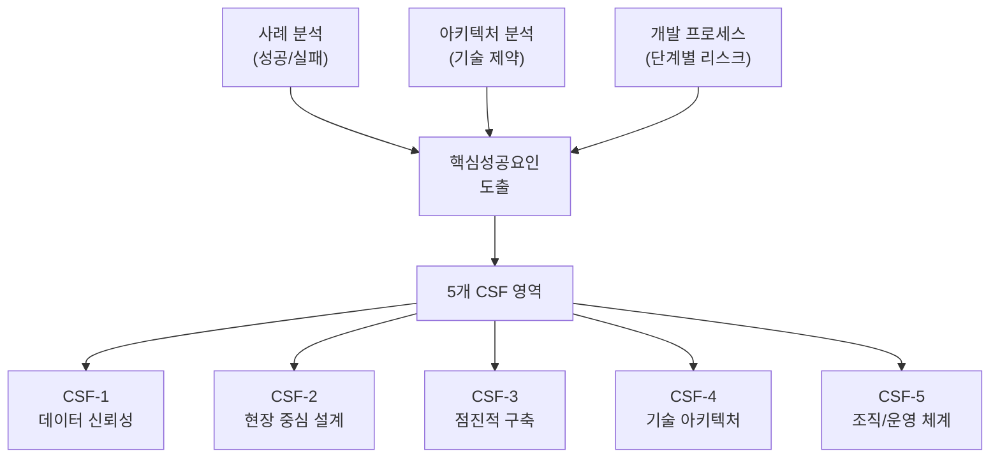
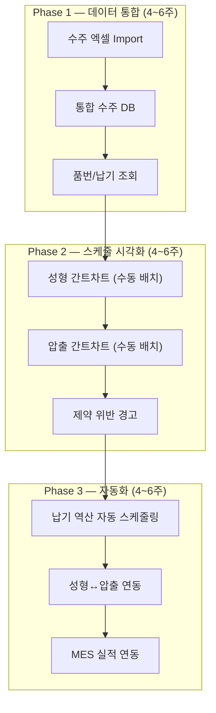
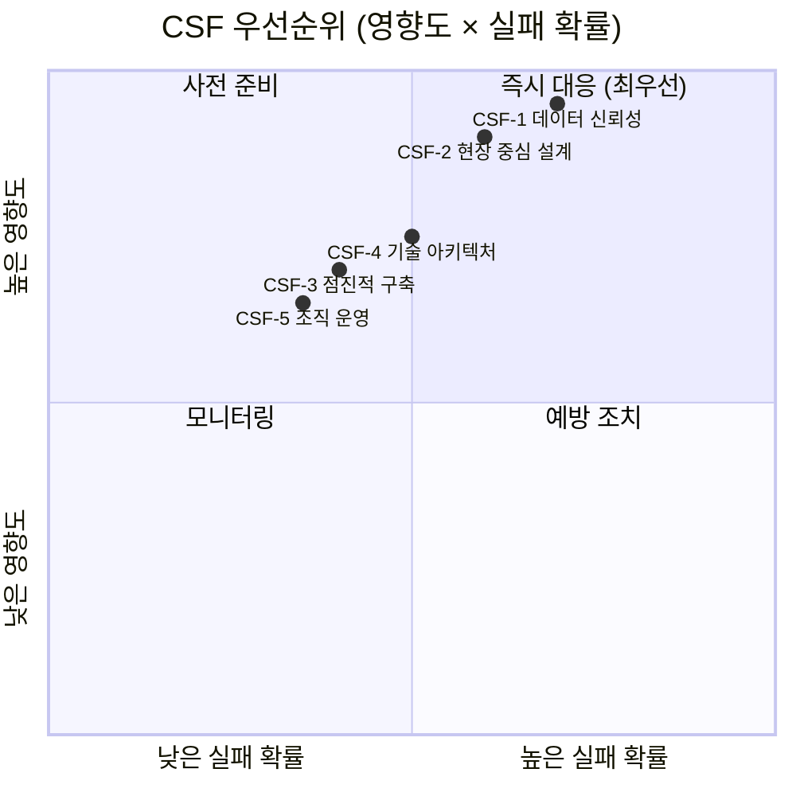

# 공정 스케줄링 시스템 — 핵심성공요인 (CSF)

> 신규 개발자를 위한 서비스 개발 핵심성공요인 도출 문서
> 본 문서는 사례 분석, 아키텍처 분석, 개발 프로세스 정의를 종합하여 작성됨

---

## 1. CSF 도출 프레임워크



---

## 2. CSF 총괄 요약

| CSF | 영역 | 핵심 메시지 | 실패 시 결과 |
|-----|------|-----------|------------|
| **CSF-1** | 데이터 신뢰성 | 마스터 데이터가 정확해야 시스템이 신뢰받는다 | 비현실적 스케줄 → 시스템 외면 |
| **CSF-2** | 현장 중심 설계 | 현장이 쓰지 않으면 아무리 좋은 시스템도 실패 | 엑셀로 회귀 |
| **CSF-3** | 점진적 구축 | 작게 시작해서 증명하고 확장한다 | 범위 과다 → 프로젝트 중단 |
| **CSF-4** | 기술 아키텍처 | 확장 가능하고 유지보수 가능한 구조가 필수 | 개발자 이직 시 시스템 마비 |
| **CSF-5** | 조직/운영 체계 | 경영진 지원과 변화 관리가 기술보다 중요 | 도입 후 방치 |

---

## 3. CSF 상세 분석

### CSF-1: 데이터 신뢰성 확보 🔴 최우선

> **"시스템은 데이터의 품질만큼만 작동한다"** — 사례 분석 실패 원인 1위 (25%)

#### 왜 중요한가

스케줄링 시스템의 핵심은 **"제약 조건을 반영한 현실적인 생산 계획"**을 만드는 것입니다.
입력 데이터가 부정확하면 출력(스케줄)도 부정확해지고, 현장은 시스템을 불신하여 **엑셀로 회귀**합니다.

#### 검증해야 할 데이터 목록

| 데이터 | 현재 상태 | 검증 필요 사항 | 담당 |
|--------|----------|--------------|------|
| **BOM (자재 명세)** | 정비 완료 | 품번별 관체-성형 매핑 정확성 | 생산기술팀 |
| **품번별 생산 로직** | **확인 완료** | 성형: 회전수 기반(주8/야10), 압출: m/min 기반 | 현장 관리자 |
| **금형/앵글 매핑** | **확인 완료** | 앵글당 금형수, 슬롯 위치별 O/X 매핑 | 금형 담당 |
| **설비 Capa** | **확인 완료** | 저압 4대(8슬롯), IC 1대(6슬롯) | 설비 담당 |
| **셋업 페널티** | **확인 완료** | 앵글 교체 시 1회전분 생산 손실 반영 | 현장 관리자 |
| **교대/가동 캘린더** | **확인 완료** | 주5일, 2교대(전/후반 분리) 체계 | 생산관리 |

#### 개발자 실행 가이드

```
Phase 0 (개발 착수 전):
  1. 위 데이터 항목별 실제 값을 현장에서 수집
  2. 샘플 데이터로 역산 스케줄링을 수동 시뮬레이션
  3. 결과가 현장 담당자의 경험과 일치하는지 교차 검증
  4. 불일치 항목 → 데이터 보정 후 재검증
```

> [!CAUTION]
> **개발을 시작하기 전에 반드시 이 검증을 통과해야 합니다.**
> 데이터 검증 없이 코드를 작성하면, 나중에 알고리즘 전체를 재설계해야 할 수 있습니다.

---

### CSF-2: 현장 중심 설계 🔴 최우선

> **사례 분석 실패 원인 2위 (22%) — 현장 사용자 저항**

#### 왜 중요한가

이 시스템의 사용자는 IT 전문가가 아니라 **생산관리 담당자와 현장 관리자**입니다.
시스템이 현장의 실제 업무 흐름과 맞지 않으면, 아무리 기술적으로 우수해도 **사용되지 않습니다**.

#### 현장 중심 설계 원칙

| 원칙 | 설명 | 구현 방법 |
|------|------|----------|
| **엑셀 친화성** | 엑셀에서 전환하는 사용자를 고려 | Import/Export 완벽 지원, 테이블 뷰 기본 |
| **한 화면 원칙** | 핵심 정보를 한 화면에 | 스케줄 + 제약 현황 + 납기 알림 통합 뷰 |
| **수동 우선** | 자동화는 점진적으로 | 드래그 조정 먼저, 자동 배치는 보조 |
| **즉시 피드백** | 조작 결과를 바로 확인 | 제약 위반 시 실시간 경고 |
| **기존 용어 사용** | 현장에서 쓰는 단어 그대로 | "프레스", "금형", "관체" 등 현장 용어 |

#### 핵심 사용자 참여 전략


#### 개발자 실행 가이드

```
1. 스케줄링 담당자(1~2명)를 "Product Owner" 역할로 지정
2. 모든 화면 설계는 이 담당자의 검토를 거칠 것
3. 2주마다 동작하는 프로토타입을 보여주고 피드백 수집
4. "현장에서 10초 안에 이해할 수 있는가?"를 UI 기준으로 삼을 것
5. 엑셀 Export 기능을 모든 데이터 뷰에 기본 제공할 것
```

> [!IMPORTANT]
> **엑셀 완전 폐지를 목표로 하지 마세요.** 엑셀 병행을 허용하면서 시스템의 편의성으로 자연스럽게 이전하는 것이 성공 패턴입니다.

---

### CSF-3: 점진적 구축 전략 🟡 높음

> **국내 스마트공장 도입 기업의 99.8%가 부분 도입 — 중소벤처기업부 (2025)**

#### 왜 중요한가

한 번에 모든 것을 만들려다 실패하는 것이 제조 IT 프로젝트의 가장 흔한 패턴입니다.
**"작게 시작 → 증명 → 확장"**이 유일한 성공 전략입니다.

#### 구축 단계 정의



#### Phase별 성공 기준 (Gate Review)

| Phase | 통과 기준 | 실패 시 대응 |
|-------|----------|------------|
| **Phase 1** | 수주 엑셀을 시스템으로 Import하고, 현장 담당자가 "이게 맞다"고 확인 | 엑셀 포맷 매핑 재조정 |
| **Phase 2** | 간트차트에서 수동으로 스케줄을 배치하고, 현장 담당자가 "이렇게 쓸 수 있겠다"고 인정 | UI/UX 재설계 |
| **Phase 3** | 자동 스케줄이 현장 담당자의 수동 결과와 80% 이상 일치 | 제약 조건 파라미터 재조정 |

> [!TIP]
> **각 Phase가 독립적으로 가치를 제공해야 합니다.** Phase 1만 완성되어도 "수주 취합 시간 80% 단축"이라는 즉각적 가치가 있어야 합니다.

#### 개발자 실행 가이드

```
1. Phase 1 완료 전까지 Phase 2 코드를 작성하지 말 것
2. 각 Phase 완료 후 최소 1~2주 실사용 기간을 둘 것
3. 사용자 피드백 없이 다음 Phase로 넘어가지 말 것
4. Phase 실패 시 → 해당 Phase를 수정하여 재검증 (다음으로 넘어가지 않음)
```

---

### CSF-4: 기술 아키텍처 설계 🟡 높음

> **자체 개발의 최대 리스크: "개발자 1명 의존" — Key Person Dependency**

#### 왜 중요한가

자체 개발 시스템은 **"이 코드는 나만 알아"** 상태에 빠지기 쉽습니다.
개발자 이직이나 부재 시 시스템 전체가 마비될 수 있으며, 이는 사례 분석에서 반복적으로 나타나는 실패 패턴입니다.

#### 아키텍처 필수 원칙

| 원칙 | 구체적 실천 | 이유 |
|------|-----------|------|
| **관심사 분리** | 프론트엔드, API, 스케줄링 엔진, DB를 명확히 분리 | 한 부분 수정이 전체에 영향 주지 않도록 |
| **스케줄링 엔진 독립** | 스케줄링 로직을 별도 모듈/서비스로 분리 | 알고리즘 교체/개선 시 다른 코드 영향 없음 |
| **API 기반 통신** | 프론트↔백엔드는 반드시 REST API로 | MES 연동, 향후 모바일 확장 용이 |
| **테스트 코드 필수** | 스케줄링 로직에 대한 단위 테스트 작성 | 제약 조건 변경 시 회귀 버그 방지 |
| **문서화** | API 명세, DB 스키마, 알고리즘 설계 문서화 | 개발자 교체 시 인수인계 가능 |

#### 기술 스택 선택 기준

| 기준 | 권장 | 비권장 |
|------|------|--------|
| **러닝 커브** | 팀이 이미 아는 기술 우선 | 최신 트렌드 따라가기 |
| **커뮤니티** | 검색하면 답이 나오는 기술 | 마이너 프레임워크 |
| **유지보수** | 타 개발자가 읽을 수 있는 코드 | 과도한 추상화/메타프로그래밍 |
| **사내 배포** | Docker 기반 온프레미스 | 복잡한 클라우드 네이티브 |

#### 개발자 실행 가이드

```
1. 코드 리포지토리(Git) 사용 필수 — 버전 관리와 이력 추적
2. README.md에 프로젝트 구조, 실행 방법, 배포 방법 기술
3. 스케줄링 엔진은 반드시 순수 함수(Pure Function)로 작성
   → 입력(수주 리스트 + 제약 조건) → 출력(스케줄) 형태
   → UI나 DB에 의존하지 않는 독립 모듈
4. DB 스키마 변경은 마이그레이션 스크립트로 관리
5. 핵심 비즈니스 로직(역산 계산, 제약 검증)에 단위 테스트 작성
```

> [!WARNING]
> **"나만 알 수 있는 코드"는 자산이 아니라 부채입니다.**
> 6개월 후의 자기 자신도 이해할 수 있도록 작성하세요.

---

### CSF-5: 조직/운영 체계 🟢 중요

> **Gartner: "ERP/APS 실패의 대부분은 기술이 아니라 조직의 문제"**

#### 왜 중요한가

기술적으로 완벽한 시스템이라도, **경영진의 지원 없이는 현장 도입이 불가능**하고,
**변화 관리 없이는 사용자 채택이 불가능**합니다.

#### 조직적 성공 조건

| 조건 | 구체적 행동 | 담당 |
|------|-----------|------|
| **경영진 스폰서십** | 프로젝트의 중요성을 경영진이 공식 선언 | 공장장/임원 |
| **현장 챔피언** | 현장에서 시스템을 옹호하는 핵심 사용자 1명 확보 | 생산관리 담당자 |
| **교육 계획** | 시스템 사용법 교육 (최소 2회, 배포 전/후) | 개발팀 + 현장 |
| **피드백 채널** | 사용자가 불편/개선 사항을 즉시 전달할 수 있는 창구 | 개발자 |
| **성과 공유** | 도입 후 개선된 지표를 정량적으로 공유 | 생산관리 + 개발 |

#### 변화 관리 로드맵

```
배포 전 2주:   교육 + 데모 + Q&A
배포 후 1개월: 엑셀 병행 허용, 매일 피드백 수집
배포 후 2개월: 시스템 우선, 엑셀은 백업 용도
배포 후 3개월: 시스템 단독 운영 (엑셀 Export로 보고서만)
```

---

## 4. CSF 기반 개발 체크리스트

개발 진행 중 아래 체크리스트를 주기적으로 점검하세요.

### 착수 전 (Phase 0)
- [ ] 마스터 데이터 정확성 검증 완료 (CSF-1)
- [ ] 핵심 사용자(스케줄링 담당자) 참여 확보 (CSF-2)
- [ ] 파일럿 대상 제품군 선정 완료 (CSF-3)
- [ ] 기술 스택 확정 및 개발 환경 구축 (CSF-4)
- [ ] 경영진 프로젝트 승인 (CSF-5)

### Phase 1 완료 시
- [ ] 수주 엑셀 Import → 통합 DB 정상 동작 (CSF-1)
- [ ] 현장 담당자가 데이터 정확성 확인 (CSF-2)
- [ ] Phase 1 단독으로 "수주 취합 시간 단축" 가치 제공 (CSF-3)
- [ ] 코드 리포지토리, README, API 문서 정비 (CSF-4)

### Phase 2 완료 시
- [ ] 간트차트에서 수동 스케줄 배치 가능 (CSF-2)
- [ ] 제약 위반 경고가 현장 규칙과 일치 (CSF-1)
- [ ] 현장 담당자 2주 이상 실사용 피드백 수집 (CSF-2, 3)
- [ ] 스케줄링 로직 단위 테스트 작성 (CSF-4)

### Phase 3 완료 시
- [ ] 자동 스케줄 vs 수동 스케줄 80% 이상 일치 (CSF-1)
- [ ] MES 연동 정상 동작 (CSF-4)
- [ ] 사용자 교육 완료 (CSF-5)
- [ ] 성과 지표(KPI) 측정 및 공유 (CSF-5)

---

## 5. 실패 방지 안전장치 (Anti-Pattern 대응)

| Anti-Pattern | 증상 | 안전장치 |
|-------------|------|---------|
| **"완벽한 자동화" 함정** | "100% 자동 스케줄링을 만들겠다" | 수동 조정을 항상 허용. 자동화는 "제안" 수준으로 시작 |
| **"기능 과다" 함정** | "이것도 넣고 저것도 넣자" | MVP 범위 문서(mvp_scope_definition.md)를 벽에 붙여놓기 |
| **"개발자만의 시스템" 함정** | 현장 피드백 없이 2달 이상 개발 | 2주마다 반드시 현장 데모 |
| **"데이터 낙관" 함정** | "BOM 있으니까 데이터는 괜찮겠지" | Phase 0에서 반드시 샘플 시뮬레이션 |
| **"한 번에 전환" 함정** | "다음 주부터 엑셀 금지" | 최소 1개월 병행 기간 |

---

## 6. CSF 우선순위 매트릭스



---

## 7. 참조 문서

| 문서 | 위치 | CSF 연관 |
|------|------|---------|
| 전체 아키텍처 분석 | `1.Advance Planning/process_scheduling_analysis_full.md` | CSF-1, 4 |
| MVP 범위 정의 | `1.Advance Planning/mvp_scope_definition.md` | CSF-3 |
| 개발 프로세스 정의 | `1.Advance Planning/development_process.md` | CSF-2, 3, 5 |
| 사례 분석 보고서 | `1.Advance Planning/case_study_analysis.md` | 전체 |
