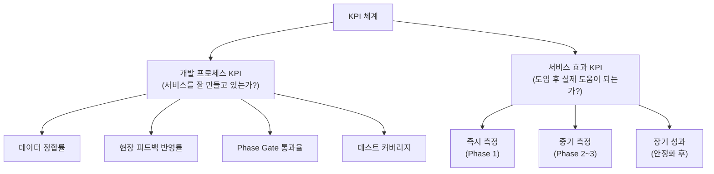
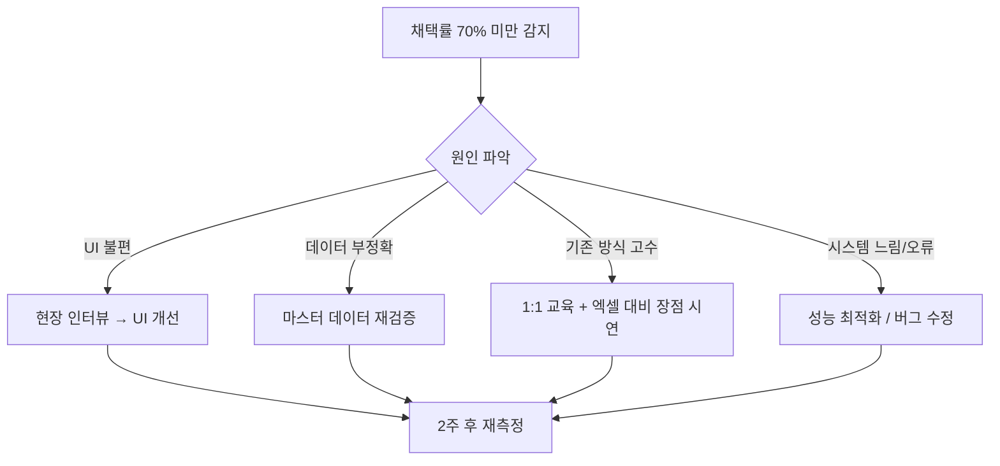

# 공정 스케줄링 시스템 — KPI 정의서

> 서비스 개발 및 운영 성과를 측정하기 위한 핵심성과지표(KPI) 정의
> CSF 문서(2.critical_success_factors.md)와 연계하여 활용

---

## 1. KPI 체계 구조



---

## 2. 개발 프로세스 KPI

> 개발 진행 중 "방향이 맞는지" 점검하는 지표

| ID | KPI | 측정 방법 | 목표 | 측정 주기 | 연관 CSF |
|----|-----|---------|------|----------|---------|
| D-01 | **데이터 정합률** | Import된 수주 데이터 vs 원본 엑셀 일치율 | **99% 이상** | Phase 1 완료 시 | CSF-1 |
| D-02 | **현장 피드백 반영률** | 수집된 피드백 중 반영된 비율 | **70% 이상** | 2주 단위 | CSF-2 |
| D-03 | **Phase Gate 통과율** | Phase별 성공 기준 1차 충족 여부 | **1차 시도에 통과** | Phase 완료 시 | CSF-3 |
| D-04 | **테스트 커버리지** | 스케줄링 핵심 로직 단위 테스트 비율 | **80% 이상** | Sprint 단위 | CSF-4 |
| D-05 | **코드 문서화율** | API 엔드포인트 중 문서화 완료 비율 | **100%** | Phase 완료 시 | CSF-4 |

### Phase별 Gate 통과 기준 (D-03 상세)

| Phase | 통과 기준 | 실패 시 대응 |
|-------|----------|------------|
| **Phase 1** | 수주 엑셀 Import 후 현장 담당자가 데이터 정확성 확인 서명 | 엑셀 포맷 매핑 재조정 |
| **Phase 2** | 간트차트에서 수동 스케줄 배치 후 담당자가 "실무에 사용 가능" 판단 | UI/UX 재설계 |
| **Phase 3** | 자동 스케줄이 수동 결과와 **80% 이상 일치** | 제약 파라미터 재조정 |

---

## 3. 서비스 효과 KPI

> 도입 후 실제 현장 성과를 측정하는 지표

### 3.1 🟢 즉시 측정 가능 (Phase 1 완료 후)

| ID | KPI | As-Is (현재 추정) | To-Be (목표) | 측정 방법 |
|----|-----|-----------------|------------|----------|
| S-01 | **수주 취합 소요 시간** | 수 시간~1일 (수작업 취합) | **80% 단축** | 작업 시작~완료 시간 기록 |
| S-02 | **수주 데이터 중복/누락 건수** | 월 N건 (파편화로 인한) | **90% 감소** | 시스템 중복 감지 로그 |

> [!TIP]
> Phase 1만 완성되어도 이 두 지표로 **즉각적 가치**를 증명할 수 있습니다.
> 이것이 경영진의 지속적 투자를 이끌어내는 핵심 근거가 됩니다.

### 3.2 🟡 중기 측정 (Phase 2~3 완료 후)

| ID | KPI | As-Is | To-Be | 측정 방법 |
|----|-----|-------|-------|----------|
| S-03 | **주간 스케줄 수립 소요 시간** | 경험 기반, 수 시간 | **50% 단축** | 스케줄 생성~확정 소요 시간 |
| S-04 | **스케줄 계획 vs 실적 일치율** | 측정 안 됨 | **85% 이상** | MES 실적 대비 계획 비교 |
| S-05 | **제약 위반 스케줄 발생률** | 파악 불가 (수작업) | **5% 이하** | 시스템 제약 검증 로그 |
| S-06 | **압출-성형 공정 간 불일치 건수** | 월 N건 | **80% 감소** | 관체 부족/과잉 발생 이력 |

> [!NOTE]
> S-04(계획 vs 실적 일치율)는 **MES 연동이 완료된 Phase 3 이후**에만 정량 측정이 가능합니다.
> Phase 2에서는 현장 담당자의 정성 평가("이 스케줄 현실적이다/아니다")로 대체합니다.

### 3.3 🔴 장기 비즈니스 성과 (전체 안정화 후)

| ID | KPI | As-Is | To-Be | 측정 방법 |
|----|-----|-------|-------|----------|
| S-07 | **납기 준수율** | 현재 수준 측정 필요 | **95% 이상** | 납기 내 납품 건수 / 전체 건수 |
| S-08 | **설비 가동률** | 현재 수준 측정 필요 | **10% 이상 향상** | MES 설비 가동 데이터 |
| S-09 | **사용자 채택률** | 0% (시스템 없음) | **90% (18/20명)** | 주간 활성 사용자 수 |

---

## 4. 사용자 채택률 상세 (가장 중요한 KPI)

> [!IMPORTANT]
> **다른 모든 지표가 좋아도, 현장에서 안 쓰면 의미 없습니다.**
> 반대로 사용자 채택률이 높으면 나머지 KPI는 자연스럽게 따라옵니다.

### 4.1 채택률 측정 방법

시스템에 아래 활동 지표를 자동 수집하는 로직을 반드시 심어두어야 합니다.

| 활동 지표 | 측정 대상 | 건강한 수준 | 위험 신호 |
|----------|---------|-----------|---------|
| **주간 로그인 횟수** | 전체 사용자 | 사용자당 주 5회 이상 | 주 1회 미만 |
| **스케줄 조회 횟수** | 현장 관리자 | 일 1회 이상 | 3일 이상 미접속 |
| **스케줄 수정 횟수** | 생산관리 담당자 | 주 3회 이상 | 수정 0건 (시스템 외면) |
| **엑셀 Export 횟수** | 전체 사용자 | 점진적 감소 추세 | 증가 추세 (엑셀 회귀 징후) |

### 4.2 채택률 단계별 목표

```
배포 후 1주:   50% (핵심 사용자 + 관심 있는 사용자)
배포 후 1개월: 70% (대부분의 생산관리 담당자)
배포 후 2개월: 85% (현장 관리자 포함)
배포 후 3개월: 90%+ (전체 정착)
```

### 4.3 채택률 하락 시 대응 프로토콜



---

## 5. As-Is 측정 가이드

> [!WARNING]
> **개발 착수 전 반드시 현재 상태(As-Is)를 수치로 기록해야 합니다.**
> 숫자 없이는 "개선되었다"를 증명할 수 없습니다.

### 개발 전 1~2주간 기록할 항목

| 항목 | 기록 방법 | 기록 주체 | 기간 |
|------|---------|---------|------|
| 수주 취합 소요 시간 | 작업 시작/종료 시간 메모 | 생산관리 담당자 | 2주 |
| 수주 중복/누락 발견 건수 | 건별 메모 | 생산관리 담당자 | 2주 |
| 주간 스케줄 수립 소요 시간 | 작업 시작/종료 시간 메모 | 스케줄링 담당자 | 2주 |
| 납기 지연 건수 | 월간 납기 미준수 건 집계 | 생산관리팀 | 1개월 |
| 압출-성형 불일치 건수 | 관체 부족/과잉 발생 시 기록 | 현장 관리자 | 2주 |

### 기록 양식 (간단 엑셀)

```
날짜 | 항목 | 시작시간 | 종료시간 | 소요시간 | 비고
04/28 | 수주 취합 | 09:00 | 11:30 | 2.5h | KD 발주 누락 1건 발견
04/28 | 성형 스케줄 | 13:00 | 15:00 | 2.0h | 금형 충돌 수기 조정
```

---

## 6. KPI 리포트 템플릿

### 월간 KPI 보고서 구조

```markdown
# [월] 공정 스케줄링 시스템 KPI 리포트

## 1. 핵심 지표 요약
| KPI | 목표 | 이번 달 | 전월 | 추세 |
|-----|------|--------|------|------|
| 수주 취합 시간 | 80% 단축 | -65% | -50% | 📈 |
| 사용자 채택률 | 90% | 75% | 60% | 📈 |
| ... | ... | ... | ... | ... |

## 2. 주요 성과
- (정량적 개선 사항 기술)

## 3. 이슈 및 대응
- (채택률 하락 원인, 데이터 품질 문제 등)

## 4. 다음 달 계획
- (개선 예정 사항)
```

---

## 7. KPI와 CSF 연관 매트릭스

| KPI | CSF-1 데이터 | CSF-2 현장 | CSF-3 점진 | CSF-4 기술 | CSF-5 조직 |
|-----|:-----------:|:--------:|:--------:|:--------:|:--------:|
| D-01 데이터 정합률 | ●● | | | | |
| D-02 피드백 반영률 | | ●● | | | |
| D-03 Gate 통과율 | | | ●● | | |
| D-04 테스트 커버리지 | | | | ●● | |
| S-01 수주 취합 시간 | ● | ● | ●● | | |
| S-03 스케줄 수립 시간 | ● | ●● | | ● | |
| S-04 계획 vs 실적 | ●● | | | ● | |
| S-07 납기 준수율 | ● | ● | | | ● |
| S-09 사용자 채택률 | | ●● | | | ●● |

> ●● = 직접 연관 / ● = 간접 연관

---

## 8. 참조 문서

| 문서 | 위치 | 연관 |
|------|------|------|
| 핵심성공요인(CSF) | `3.Analysis/2.critical_success_factors.md` | KPI의 근거 |
| MVP 범위 정의 | `1.Advance Planning/mvp_scope_definition.md` | Phase별 측정 범위 |
| 사례 분석 | `1.Advance Planning/case_study_analysis.md` | As-Is 측정 중요성 근거 |
