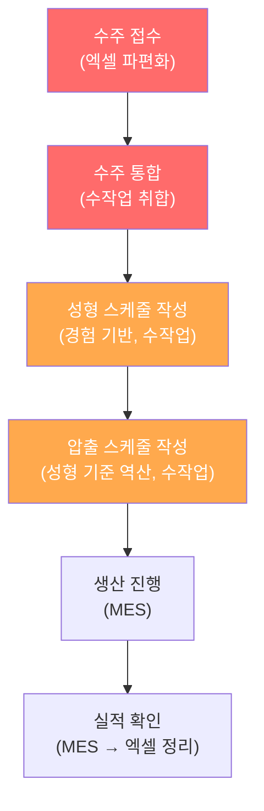
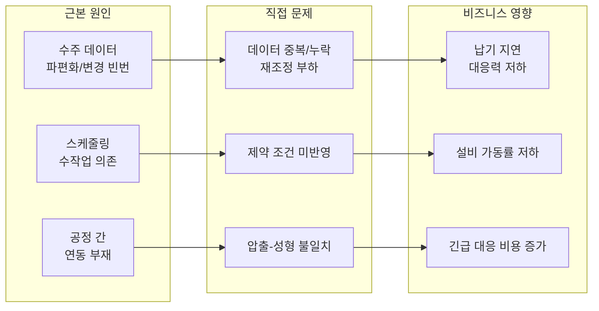
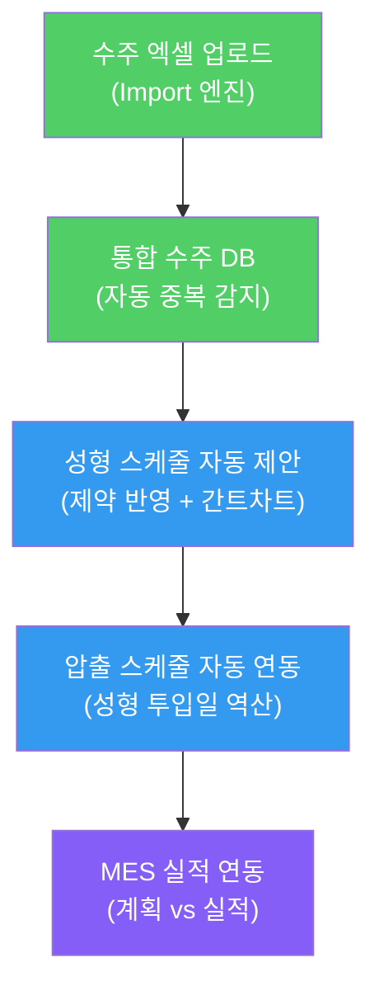

# 문제정의서 (Problem Statement)

> 공정 스케줄링 시스템 — Phase 1: 수주 통합 · 성형 스케줄링 · 압출 스케줄링
> 작성일: 2026-04-27 | 수정일: 2026-04-27 (실제 현장 데이터 반영)

---

## 1. 프로젝트 개요

### 1.1 배경

자동차용 고무호스를 제조하는 당사는 수주 정보 관리와 생산 스케줄링을 **엑셀 기반의 수작업**으로 운영하고 있습니다. 다품종 제품군과 복잡한 공정 제약 변수로 인해 현재 방식은 한계에 도달했으며, 이를 해결하기 위한 **사내 공정 스케줄링 시스템**을 구축합니다.

### 1.2 목적

파편화된 수주 데이터를 통합하고, 성형·압출 공정의 제약 조건을 반영한 스케줄링 시스템을 구축하여 **납기 준수율 향상과 생산 계획 정확도 제고**를 달성합니다.

### 1.3 적용 범위 (Phase 1)

| 항목 | 범위 |
|------|------|
| **대상 제품군** | 전체가 아닌 **일부 파일럿 제품군** 선정 후 우선 적용 |
| **대상 공정** | 수주 통합 → 성형 공정 → 압출 공정 |
| **제외 항목** | 자재 소요량 계산(MRP), 발주/입고 관리, 외주 관리 |
| **사용자** | 생산관리 담당자 + 현장 관리자, 약 20명 |
| **배포 환경** | 사내 온프레미스 |

---

## 2. 현재 상태 분석 (As-Is)

### 2.1 업무 흐름도



### 2.2 수주 관리 현황

| 현황 | 상세 |
|------|------|
| **데이터 소스** | 월별 예상 발주량, KD 발주량, 주간 발주량 — 각각 별도 엑셀 파일 |
| **제품 특성** | 자동차부품 특성상 다수의 제품군, 다수의 품번 |
| **통합 방식** | 담당자가 수작업으로 취합하여 통합본 작성 |
| **문제점** | 중복 등록, 누락, 버전 충돌, **빈번한 수주 수정/변경으로 인한 재취합 부하** |

#### 실제 엑셀 파일 구조 (검증 완료)

| 파일 유형 | 예시 파일 | 주요 컬럼 | 특이 사항 |
|----------|---------|---------|----------|
| **주간 계획** | `실리콘 02월 1주차 주간 계획.xlsx` | 구분, 납품유형, 종류, 차종, 사양, 후가공, 납품처, 고객사품번, 생산품번, 화승품번, 일자별 수량 | 일자별 컬럼에 날짜별 수량 배치 |
| **KD 발주** | `저압 이중관 KD 발주및 납품현황.xlsx` | 오더번호, 발주번호, 품번, 납입요청일, 고객사, 수량, 발주일자, 발주구분 | 다중 시트(KD현황, kd발주, 현대kd발주, srm 등), 일별 발주/입고/미납 추적 |
| **통합 수주** | `통합_수주정보_02월_1_2주차.xlsx` | No, 구분, 납품유형, 종류, 차종, 사양, 후가공, 납품처, 고객사품번, 생산품번, 화승품번, 주차별 일자별 수량, 출처 | 확정/예상 구분, 색상 범례 적용 |

> [!WARNING]
> **3종의 엑셀 파일 포맷이 모두 다릅니다.** Import 엔진은 각 유형별로 별도의 컬럼 매핑 규칙을 지원해야 하며, 통합 시 `생산품번` 또는 `화승품번`을 키(Key)로 사용해야 합니다.

### 2.3 성형 공정 스케줄링 현황

| 현황 | 상세 |
|------|------|
| **스케줄 수립 방식** | 담당자의 경험과 감에 의존한 수작업 |
| **납기 기준** | 납품 예정일 2일 전 성형 완료 필요 |
| **설비 구성** | 저압 가류기 **4대**, IC 가류기 **1대** |
| **스케줄 단위** | **회전수 기반** (주간 8회, 야간 10회) — 시간 단위가 아님 |
| **제약 변수** | 앵글/금형 배치, 슬롯 위치별 적합성(O/X), 합금형(1/2/3/6개), 앵글 교체 페널티 |
| **문제점** | 슬롯·앵글·금형 복합 제약을 수작업으로 모두 고려하기 어려움 → 비효율 배치, 앵글 교체 과다 |

### 2.4 압출 공정 스케줄링 현황

| 현황 | 상세 |
|------|------|
| **공정 위치** | 성형 공정의 앞 공정 (관체 생산 → 성형 투입) |
| **스케줄 수립 방식** | 성형 스케줄 기준으로 수기 역산 |
| **납기 기준** | 성형 공정 투입 1일 전 압출 완료 필요 |
| **설비 구성** | 압출 라인 2대 (포드, 신규) |
| **근무 체계** | 주5일, 주야간 2교대, 각 교대 전반/후반 분리 (주간 4h+4h, 야간 4.5h+5h) |
| **설비 효율** | 75% 적용 |
| **제약 변수** | 셋팅 번호(1~8) 그룹핑, 라인별 배정 우선순위, 속도(m/min)×길이(mm) 기반 생산량 계산 |
| **문제점** | 성형과의 연동이 수기이므로 불일치 발생 (관체 부족 또는 과잉) |

### 2.5 기존 시스템 현황

| 시스템 | 상태 | 비고 |
|--------|------|------|
| **ERP** | 운영 중 | 기준 정보 관리 |
| **MES** | 자체 개발, 운영 중 | 생산 실적 수집, **API/DB 접근 가능** |
| **BOM** | 정비 완료 | 제품별 자재 명세 확보 |

---

## 3. 문제 정의 (Pain Points)

### 3.1 핵심 문제 요약



### 3.2 문제별 상세 분석

#### 문제 1: 수주 데이터 파편화

| 항목 | 내용 |
|------|------|
| **현상** | 월별 예상/KD/주간 발주 데이터가 각각 별도 엑셀로 관리됨 |
| **원인** | 거래처별·시점별로 수주 정보가 다른 형태로 입수됨 |
| **영향** | 통합 시 중복 등록, 누락 발생 → 생산 계획 정확도 저하 |
| **빈도** | 매주 반복 (주간 스케줄 수립 시) |
| **현재 대응** | 담당자 수작업 취합 (수 시간 소요) |
| **관련 사용자** | 생산관리 담당자 3~5명 |

#### 문제 2: 경험 기반 수작업 스케줄링

| 항목 | 내용 |
|------|------|
| **현상** | 성형 공정 스케줄을 담당자의 경험과 감으로 수립 |
| **원인** | 금형·설비·납기 등 복합 제약 변수를 체계적으로 처리할 도구 부재 |
| **영향** | 제약 위반(금형 충돌, Capa 초과) 사전 감지 불가 → 현장에서 발견 후 급수정 |
| **빈도** | 매주 (주간 스케줄 수립 시) |
| **현재 대응** | 경험 많은 담당자에게 의존 (Key Person 리스크) |
| **관련 사용자** | 생산관리 담당자, 성형 현장 관리자 |

#### 문제 3: 압출-성형 공정 간 연동 부재

| 항목 | 내용 |
|------|------|
| **현상** | 성형 스케줄 변경 시 압출 스케줄이 자동으로 반영되지 않음 |
| **원인** | 두 공정의 스케줄이 별개의 엑셀/수작업으로 관리됨 |
| **영향** | 관체 부족 시 성형 라인 정지, 과잉 시 재고 적체 |
| **빈도** | 성형 스케줄 변경 시마다 (주 수회) |
| **현재 대응** | 구두/메신저로 전달 → 누락 위험 |
| **관련 사용자** | 생산관리 담당자, 압출 현장 관리자 |

#### 문제 4: 빈번한 수주 정보 변경 및 대응력 부재

| 항목 | 내용 |
|------|------|
| **현상** | 확정 수주 이후에도 고객사 요청으로 납기/수량이 빈번하게 변경됨 |
| **원인** | 고객사의 생산 계획 변동이 실시간으로 전이됨 |
| **영향** | 변경 시마다 관련 엑셀 시트를 모두 수작업으로 수정해야 하며, 이미 수립된 성형/압출 스케줄의 정합성이 깨짐 |
| **빈도** | 거의 매일 발생 |
| **현재 대응** | 담당자가 변경 건을 수작업으로 찾아 일일이 수정 (휴먼 에러 위험) |
| **관련 사용자** | 생산관리 담당자 |

---

## 4. 목표 상태 정의 (To-Be)

### 4.1 목표 업무 흐름도



### 4.2 핵심 변화 (As-Is → To-Be)

| 영역 | As-Is | To-Be |
|------|-------|-------|
| **수주 통합** | 수작업 엑셀 취합 (수 시간) | 엑셀 Import → 자동 통합 DB |
| **중복/누락** | 사후 발견 | 실시간 자동 감지 |
| **수주 변경 대응** | 수작업 개별 수정 (부하 높음) | **변경분 자동 매핑 및 알림** |
| **성형 스케줄** | 경험 기반 수작업 | 제약 반영 자동 제안 + 수동 조정 |
| **제약 검증** | 현장에서 사후 발견 | 배치 시 실시간 경고 |
| **압출 연동** | 구두/메신저 전달 | 성형 확정 시 자동 역산 |
| **공정 간 일치** | 수기 확인 | 시스템 자동 동기화 |

### 4.3 역방향 스케줄링 로직 (시스템의 핵심)


```
예시:
  납품일 = 5/15 (금)
  성형 완료 기한 = 5/13 (수)
  성형 소요 = 2일 → 성형 시작 = 5/11 (월)
  압출 완료 기한 = 5/10 (일 → 실제 5/9 금)
```

### 4.4 목표 재고 감안 스케줄링

역방향 스케줄링에 추가로, **납품 완료 후 목표 재고 수준**을 유지하기 위한 추가 생산량을 반영해야 합니다.

```
총 생산 필요량 = 납품 수량 + 목표 재고 - 현재 재고
```

> [!NOTE]
> 목표 재고는 품번별로 별도 관리되며, 수주 통합 시 현재 재고와 함께 입력됩니다.

---

## 5. 제약 조건 정의 (실제 데이터 기반)

> [!IMPORTANT]
> 아래 제약 조건은 현장에서 제공받은 실제 엑셀 데이터(`성형공정_제약조건.xlsx`, `압출공정_제약조건.xlsx`)와 프롬프트 문서를 기반으로 작성되었습니다.

### 5.1 성형 공정 제약 변수

#### 설비 구성

| 설비 | 대수 | 슬롯 구성 | 1대당 회전수 |
|------|------|---------|------------|
| **저압 가류기** | 4대 | 상단 2 + 중상단 2 + 중하단 2 + 하단 2 = **8슬롯** | 주간 8회, 야간 10회 |
| **IC 가류기** | 1대 | 상단 2 + 중단 2 + 하단 2 = **6슬롯** | 주간 8회, 야간 10회 |

#### 제약 변수 목록

| # | 제약 유형 | 설명 | 스케줄링 영향 |
|---|----------|------|-------------|
| C-01 | **슬롯 위치 적합성** | 품번별로 저압/IC 가류기의 각 위치(상/중/하단)에 설치 가능 여부가 O/X로 지정됨 | 배치 시 O/X 유효성 검사 필수 |
| C-02 | **합금형** | 품번별 1금형당 제품 수 (1/2/3/6개) | 1회전당 생산량 = 앵글당 금형수 × 합금형 수 × 슬롯 수 |
| C-03 | **앵글 관리** | 품번별 앵글 보유 수량이 정해져 있으며, 저압용·IC용 앵글은 별도 | 앵글 수량이 슬롯 배정 상한을 결정 |
| C-04 | **앵글 교체 페널티** | 앵글을 교체하면 해당 **1회전분의 생산량이 소실**됨 | 교체 횟수 최소화가 효율의 핵심 |
| C-05 | **🔴 앵글 교체 최소화** | 같은 앵글을 연속 회전에 유지하도록 배치 순서를 최적화해야 함 | **최적화 목표** — 단순 제약이 아닌 스케줄링 품질 지표 |
| C-06 | **가류기 유형 우선순위** | 저압/IC 둘 다 가능한 제품은 빈 슬롯에 우선순위 없이 배정 | 가용 슬롯 탐색 로직 필요 |
| C-07 | **납기 우선순위** | 납기 임박 건 우선 배치 | 납품일 D-2 역산 기준 정렬 |
| C-08 | **목표 재고** | 주간 납품 후 목표 재고 수량을 유지해야 함 | 생산 필요량 = 납품량 + 목표재고 - 현재재고 |

#### 성형 생산량 계산 수식

```
1회전당 생산량 = 앵글당 금형수(E/K열) × 합금형 수(D열) × 배정 슬롯 수
일일 생산량 = 1회전당 생산량 × (주간 회전수 + 야간 회전수)
           = 1회전당 생산량 × (8 + 10) = 1회전당 생산량 × 18
```

#### 근무 체계

```
근무일: 월~금 (주 5일)
교대: 주간 + 야간 (2교대)
스케줄링 단위: 회전수 (시간이 아님)
```

---

### 5.2 압출 공정 제약 변수

#### 설비 구성

| 설비 | 라인명 | 배정 우선순위 |
|------|--------|------------|
| **압출 라인 1** | 포드 | 나머지 물량 |
| **압출 라인 2** | 신규 | **먼저 물량 배정** |

#### 근무 체계 및 효율

| 교대 | 구간 | 근무시간 | 효율 75% 적용 후 |
|------|------|---------|----------------|
| 주간 | 전반근무 | 4시간 | **3시간** |
| 주간 | 후반근무 | 4시간 | **3시간** |
| 야간 | 전반근무 | 4.5시간 | **3.375시간** |
| 야간 | 후반근무 | 5시간 | **3.75시간** |
| **합계** | | 17.5시간 | **13.125시간** |

#### 제약 변수 목록

| # | 제약 유형 | 설명 | 스케줄링 영향 |
|---|----------|------|-------------|
| C-09 | **셋팅 번호 그룹핑** | 압출셋팅(E열) 번호 1~8, 같은 번호는 설비 교체 없이 동시 생산 가능 | 같은 셋팅 번호끼리 묶어 배치 → 교체 최소화 |
| C-10 | **라인 배정** | 품번별 생산 가능 라인이 J/K열에 지정 (포드/신규) | 신규 라인 우선 배정, 나머지 포드 |
| C-11 | **설비 효율** | 모든 근무시간에 75% 효율 적용 | 실제 가동시간 = 근무시간 × 0.75 |
| C-12 | **헤드/핀(다이)** | 품번별 헤드/핀 규격(G열) 지정 (예: 22*8) | 규격 변경 시 교체 필요 |

#### 압출 생산량 계산 수식

```
구간별 생산량 = (압출속도(m/min) × 근무시간(min) × 0.75) / 재단길이(m)

예시: 29673-2R060
  압출속도 = 4.5 m/min
  재단길이 = 320mm = 0.32m
  주간 전반 4시간 = 240min
  생산량 = (4.5 × 240 × 0.75) / 0.32 = 810m / 0.32m ≈ 2,531개
```

> [!NOTE]
> 기존 문서의 C-05(작업자 숙련도), C-08(배합 교체)은 현장 데이터에 포함되어 있지 않아 Phase 1에서 제외합니다. 향후 필요 시 추가합니다.

---

## 6. 이해관계자 분석

### 6.1 사용자 역할 및 기대

| 역할 | 인원 | 핵심 기대 | 시스템에서 하는 일 |
|------|------|---------|-----------------|
| **생산관리 담당자** | 3~5명 | 수주 취합 자동화, 스케줄 수립 시간 단축 | 엑셀 Import, 스케줄 수립/확정 |
| **성형 현장 관리자** | 5~7명 | 오늘의 작업 지시 즉시 확인 | 일일 스케줄 조회 |
| **압출 현장 관리자** | 3~5명 | 성형 연동 자동화, 관체 과부족 방지 | 압출 스케줄 조회 |
| **관리자/임원** | 2~3명 | 생산 현황 한눈에 파악 | 대시보드 조회 |

### 6.2 역할별 JTBD (Jobs To Be Done)

**생산관리 담당자**
```
WHEN   주간 생산 계획을 수립할 때
I WANT 수주 현황과 설비/금형 제약을 한 화면에서 보고 자동 배치하고 싶다
SO THAT 스케줄 수립 시간을 줄이고 제약 위반 없는 계획을 세울 수 있다
```

**성형 현장 관리자**
```
WHEN   일일 작업을 시작할 때
I WANT 오늘의 작업 지시와 우선순위를 즉시 확인하고 싶다
SO THAT 별도 확인 없이 바로 작업에 투입할 수 있다
```

**압출 현장 관리자**
```
WHEN   성형 스케줄이 변경되었을 때
I WANT 압출 일정이 자동으로 재계산되어 알려주길 원한다
SO THAT 관체 부족 없이 성형 라인에 적시 공급할 수 있다
```

---

## 7. 성공 기준 (KPI 연동)

> 상세 측정 방법은 `3.Analysis/3.kpi_definition.md` 참조

| 성공 기준 | 측정 지표 | 목표 | 측정 시점 |
|----------|----------|------|----------|
| 수주 통합 시간 단축 | 주간 수주 취합 소요 시간 | 현재 대비 **80% 단축** | Phase 1 후 |
| 수주 데이터 정확성 | 중복/누락 건수 | **90% 감소** | Phase 1 후 |
| 스케줄 수립 효율화 | 주간 스케줄 수립 소요 시간 | **50% 단축** | Phase 2 후 |
| 공정 간 연동 정확성 | 압출-성형 불일치 건수 | **80% 감소** | Phase 2 후 |
| 사용자 채택 | 20명 중 활성 사용자 수 | **90% 이상** | 배포 3개월 후 |

---

## 8. 전제 조건 및 제약

### 8.1 전제 조건 (Assumptions)

| # | 전제 | 미충족 시 영향 |
|---|------|-------------|
| A-01 | BOM 데이터가 정비되어 있음 | 소요량 계산 불가 |
| A-02 | 자체 개발 MES에 API/DB 접근 가능 | 실적 연동 불가 |
| A-03 | 핵심 사용자(스케줄링 담당자)가 기획에 참여함 | 현장 괴리 발생 |
| A-04 | 경영진의 프로젝트 지원 의지 있음 | 현장 도입 추진력 부재 |
| A-05 | 사내 서버 배포 환경 확보 가능 | 배포 불가 |

### 8.2 프로젝트 제약

| # | 제약 | 대응 |
|---|------|------|
| R-01 | 일부 제품군만 우선 적용 | 파일럿 성공 후 점진 확장 |
| R-02 | 자재 관리(MRP)는 Phase 1 제외 | Phase 2+ 에서 추가 |
| R-03 | 외주 관리는 제외 | 별도 Phase에서 검토 |

---

## 9. 리스크 식별

| # | 리스크 | 확률 | 영향 | 대응 |
|---|--------|------|------|------|
| R-01 | 마스터 데이터(사이클타임 등) 부정확 | 중 | 🔴 치명적 | 개발 전 데이터 검증 단계 수행 |
| R-02 | 현장 사용자 저항 | 중 | 🔴 치명적 | 핵심 사용자 Day 1 참여, 엑셀 병행 허용 |
| R-03 | 스케줄 알고리즘 현실 괴리 | 중 | 🟡 높음 | 수동 조정 우선, 자동화는 점진적 |
| R-04 | 개발자 의존성 | 중 | 🟡 높음 | 문서화, 테스트 코드, 2인 이상 코드 이해 |
| R-05 | 요구사항 변경 빈번 | 높 | 🟡 높음 | 파일럿 제품군으로 범위 고정 |

---

## 10. 다음 단계

| 순서 | 작업 | 산출물 | 상태 |
|------|------|--------|------|
| 1 | **파일럿 제품군 선정** | 대상 품번 리스트 | ⬜ 현장 협의 필요 |
| 2 | **현장 데이터 수집** | 제약 변수 수치 | ✅ 완료 (성형: 저압4+IC1, 압출: 포드+신규) |
| 3 | **As-Is KPI 측정** | 현재 상태 수치 기록 (1~2주) | ⬜ 생산관리팀 협조 필요 |
| 4 | **RPD 요구사항 정의** | 기능 요구사항 상세 정의서 | ⬜ 1, 3 완료 후 진행 |

---

## 참조 문서

| 문서 | 위치 |
|------|------|
| 전체 아키텍처 분석 | `1.Advance Planning/process_scheduling_analysis_full.md` |
| MVP 범위 정의 | `1.Advance Planning/mvp_scope_definition.md` |
| 개발 프로세스 | `1.Advance Planning/development_process.md` |
| 사례 분석 | `1.Advance Planning/case_study_analysis.md` |
| 핵심성공요인(CSF) | `3.Analysis/2.critical_success_factors.md` |
| KPI 정의 | `3.Analysis/3.kpi_definition.md` |
