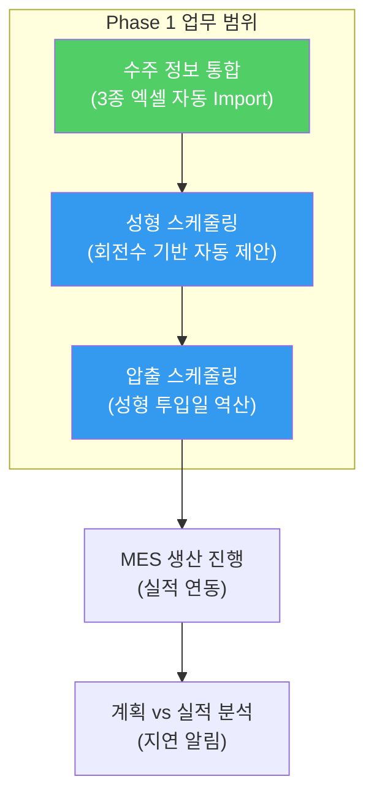

# 공정 스케줄링 시스템 — 개발 프로세스 (Phase 1 집중형)

> **수주 정보 통합 → 성형공정 스케줄링 → 압출공정 스케줄링**
> 본 문서는 Phase 1의 핵심 범위에 집중하여 최적화된 개발 프로세스를 정의합니다.

---

## 1. 개발 범위 및 단계 (Phase 1)

사내 도구의 특성을 고려하여 불필요한 시장 분석을 생략하고, 실제 현장 데이터와 제약 조건을 반영하는 데 집중합니다.

| 단계 | 명칭 | 핵심 산출물 | 상태 |
|---|---|---|---|
| 1단계 | 문제정의 & 공정 분석 | 문제정의서 (Problem Statement) | ✅ 완료 |
| 2단계 | 사용자 분석 & JTBD | 역할별 시나리오 & JTBD 맵 | ⬜ 대기 |
| 3단계 | RPD 요구사항 정의 | 기능 요구사항 정의서 | ⬜ 대기 |
| 4단계 | SRS 기술 명세 | ERD, API 명세, 알고리즘 설계 | ⬜ 대기 |
| 5단계 | 상세 Task 도출 | 개발 백로그 (GitHub Issues) | ⬜ 대기 |
| 6단계 | 프로토타이핑 & 개발 | 작동하는 스케줄링 서비스 | ⬜ 대기 |

---

## 2. 1단계: 핵심 공정 흐름 분석 (As-Is vs To-Be)

### 2.1 대상 범위 (Core Loop)
**수주 통합 → 성형 스케줄링 → 압출 스케줄링** (자재 및 MRP 제외)

### 2.2 공정 흐름 매핑

---

## 3. 모듈별 상세 개발 로직 (RPD 예고)

### M1. 수주 정보 통합 모듈
- **기능**: 주간계획, KD발주, 통합수주 엑셀의 이종 포맷을 자동 파싱.
- **핵심 로직**:
    - `생산품번`을 키로 수량 합산 및 중복 제거.
    - 확정 수주와 예상 수주를 구분하여 데이터베이스화.
    - **수주 변경 감지**: 기존 데이터와 비교하여 변경된 납기/수량을 사용자에게 알림.

### M2. 성형공정 스케줄링 모듈
- **단위**: 시간(Hour)이 아닌 **회전수(Cycle)** 단위 배치.
- **제약 조건**: 
    - 가류기(저압 4대, IC 1대)별 슬롯 위치(상/중/하) 적합성 체크.
    - 앵글당 금형수 및 합금형 수량을 반영한 1회전 생산량 자동 계산.
- **최적화**: **앵글 교체 횟수 최소화** (연속 회전 시 동일 제품 배치 우선).

### M3. 압출공정 스케줄링 모듈
- **역산 로직**: 성형 시작일(T) 기준 **T-1일**에 생산 완료되도록 자동 배치.
- **생산량 계산**: `(속도 × 시간 × 효율 75%) / 제품길이` 공식 적용.
- **셋업 최적화**: 압출 셋팅 번호(1~8)가 동일한 제품군을 묶어서 배치.

---

## 4. 단계별 구축 로드맵 (12~14주)

| 구분 | 기간 | 핵심 목표 |
|---|---|---|
| **Step 1 (데이터)** | 4주 | 3종 수주 엑셀 통합 DB 구축 및 마스터 데이터 검증 |
| **Step 2 (성형)** | 4주 | 회전수 기반 성형 간트차트 및 앵글 교체 최소화 로직 구현 |
| **Step 3 (압출/연동)** | 4주 | 압출 생산량 계산기 및 성형-압출 역산 연동 구현 |
| **Step 4 (안정화)** | 2주 | 실제 데이터 테스트 및 현장 담당자 피드백 반영 |

---

## 5. 성공을 위한 개발 지침 (CSF 연동)

1. **데이터 우선**: 알고리즘보다 수주 데이터의 정합성을 먼저 확보할 것.
2. **수동 조정 허용**: 100% 자동화보다는 **"시스템 제안 + 사용자의 드래그 수정"** 방식을 채택할 것.
3. **가시성 확보**: 앵글 교체로 인해 생산량이 소실되는 구간을 간트차트에 명확히 표시할 것.
4. **유연한 변경**: 수주 정보 변경 시 스케줄 전체가 깨지지 않고 영향 받는 구간만 표시해 줄 것.

---

## 6. 다음 단계 실행 계획

1. **[2단계] 사용자 분석**: 생산관리 담당자가 수주 변경을 처리하고 스케줄을 확정하는 과정을 '사용자 시나리오'로 문서화.
2. **[3단계] RPD 작성**: 엑셀의 각 컬럼별 데이터 타입과 스케줄링 엔진의 상세 수식을 정의.
