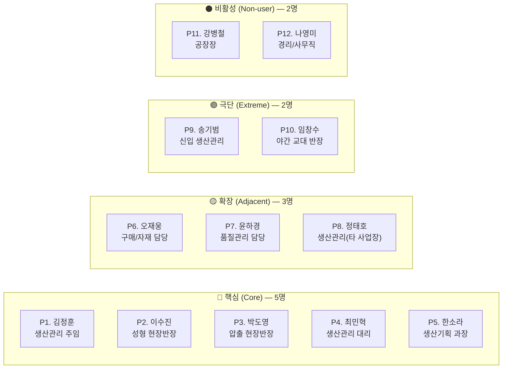

# 공정 스케줄링 시스템 — 페르소나 스펙트럼

> Phase 1 범위: 수주 정보 통합 → 성형공정 스케줄링 → 압출공정 스케줄링
> 총 12명의 페르소나 (핵심 5 / 확장 3 / 극단 2 / 비활성 2)

---

## 1. 페르소나 스펙트럼 개요

---

## 2. 핵심 페르소나 (Core) — 5명

> 매일 시스템을 사용하는 주력 타깃. **이 사용자들이 만족해야 시스템이 성공합니다.**

---

### P1. 김정훈 (35세, 생산관리 주임) — 🔑 핵심 중의 핵심

| 항목 | 내용 |
|------|------|
| **직무** | 수주 취합 및 성형 주간 스케줄 수립 총괄 |
| **경력** | 7년차, 스케줄링의 모든 암묵지 보유 |
| **핵심 문제** | 3종 엑셀 수작업 취합에 매주 반나절 소요. 고객사 수주 변경이 거의 매일 발생하여 수정 작업에 지침 |
| **목표** | 수주 변경 시 영향 범위를 즉시 파악하고, 스케줄을 빠르게 재조정하고 싶음 |
| **감정** | "나만 이 업무를 할 수 있는 게 부담이야. 아프면 라인이 서는 거잖아" |
| **대체 솔루션** | 엑셀 + 머릿속 경험 + 카톡 소통 |

> **MVP 인사이트**: 이 사람이 **2주 안에 "엑셀보다 낫다"고 말해야** 시스템이 성공한다. 수주 Import와 변경 감지가 1순위.

---

### P2. 이수진 (42세, 성형 현장반장)

| 항목 | 내용 |
|------|------|
| **직무** | 성형 라인 4대 + IC 1대 실제 운영, 앵글 셋팅 결정 |
| **경력** | 15년차, 어떤 금형이 어떤 슬롯에 들어가는지 몸으로 체득 |
| **핵심 문제** | 스케줄표를 받아도 앵글 교체가 과다하면 결국 현장에서 순서를 재조정함 |
| **목표** | 앵글 교체를 최소화한 현실적인 스케줄을 받고 싶음 |
| **감정** | "사무실에서 짠 스케줄이 현장에서 안 맞을 때가 제일 답답해" |
| **대체 솔루션** | 종이 스케줄표 + 경험 기반 현장 재배치 |

> **MVP 인사이트**: 앵글 교체 페널티(1회전 손실)가 간트차트에 시각적으로 보여야 함. 슬롯 O/X 검증은 자동화 필수.

---

### P3. 박도영 (38세, 압출 현장반장)

| 항목 | 내용 |
|------|------|
| **직무** | 압출 2라인(포드/신규) 운영, 관체 생산 |
| **경력** | 10년차, 셋팅 번호별 교체 순서 최적화에 숙련 |
| **핵심 문제** | 성형 스케줄 변경이 구두로 전달되어 관체 과부족이 발생 |
| **목표** | 성형 스케줄이 바뀌면 압출 일정이 자동으로 재계산되어 알려주길 원함 |
| **감정** | "성형 쪽에서 바뀌었다고 나중에 얘기하면 이미 늦어" |
| **대체 솔루션** | 카톡 메시지 + 수기 메모 |

> **MVP 인사이트**: 성형 확정 → 압출 T-1 역산 자동 연동이 이 사용자의 핵심 가치. 변경 알림 푸시 필수.

---

### P4. 최민혁 (29세, 생산관리 대리)

| 항목 | 내용 |
|------|------|
| **직무** | 수주 데이터 입력/검증, 김정훈 주임 업무 보조 |
| **경력** | 3년차, 엑셀 능숙하지만 스케줄링 노하우는 부족 |
| **핵심 문제** | 김정훈 주임 부재 시 스케줄 수립이 불가능. 제약 조건을 모두 기억하지 못함 |
| **목표** | 시스템이 제약 조건을 자동 검증하여, 경험 없이도 기본 스케줄을 수립할 수 있으면 좋겠음 |
| **감정** | "정훈 주임이 없으면 내가 다 해야 하는데, 금형 조건이 너무 복잡해서 실수할까봐 걱정" |
| **대체 솔루션** | 김정훈 주임에게 전화 확인 + 이전 주 스케줄 복사 수정 |

> **MVP 인사이트**: "Key Person 리스크" 해소의 핵심 수혜자. 제약 위반 경고와 자동 제안이 이 사람을 위한 기능.

---

### P5. 한소라 (45세, 생산기획 과장)

| 항목 | 내용 |
|------|------|
| **직무** | 주간/월간 생산 실적 집계, 납기 준수율 보고, KPI 관리 |
| **경력** | 18년차, 경영진 보고 담당 |
| **핵심 문제** | 계획 대비 실적 데이터를 MES에서 수동 추출하여 엑셀로 재가공하는 데 많은 시간 소요 |
| **목표** | 계획 vs 실적 비교가 자동화되어 보고서 작성 시간을 줄이고 싶음 |
| **감정** | "매주 같은 보고서를 손으로 만드는 게 비효율적이라는 걸 알지만, 다른 방법이 없어" |
| **대체 솔루션** | MES 데이터 수동 추출 + 엑셀 피벗 테이블 |

> **MVP 인사이트**: 대시보드·리포트 기능의 핵심 수혜자. Phase 1에서는 기본 조회만, Phase 2에서 MES 연동 리포트.

---

## 3. 확장 페르소나 (Adjacent) — 3명

> 유사한 문제를 가지고 있으나, Phase 1의 직접 타깃은 아닌 사용자.
> **이들의 니즈를 파악하면 향후 확장 기회를 발견할 수 있습니다.**

---

### P6. 오재웅 (40세, 구매/자재 담당)

| 항목 | 내용 |
|------|------|
| **직무** | 원자재(고무 배합, 부자재) 발주 및 입고 관리 |
| **핵심 문제** | 스케줄이 확정되어야 자재 소요량을 계산할 수 있는데, 스케줄 확정이 늦어 긴급 발주 발생 |
| **목표** | 스케줄 확정 즉시 부족 자재 리스트가 자동으로 나왔으면 함 |
| **감정** | "스케줄 확정이 늦으면 내 발주도 늦어지고, 결국 라인이 서" |
| **대체 솔루션** | 김정훈 주임에게 "이번 주 뭐 많이 나가나요?" 구두 확인 |

> **확장 기회**: Phase 2에서 MRP 모듈 추가 시 직접 사용자로 전환 가능.

---

### P7. 윤하경 (33세, 품질관리 담당)

| 항목 | 내용 |
|------|------|
| **직무** | 성형/압출 공정 품질 검사 및 불량 이력 관리 |
| **핵심 문제** | 특정 금형/앵글 조합에서 반복적으로 불량이 발생하지만, 스케줄과 연결하여 분석할 수 없음 |
| **목표** | 불량 발생 이력과 스케줄 데이터를 결합하여 문제 조합을 사전에 탐지하고 싶음 |
| **감정** | "같은 금형에서 계속 불량이 나는데, 매번 사후 대응만 하니까 답답해" |
| **대체 솔루션** | 불량 일지(수기) + 기억에 의존한 원인 추정 |

> **확장 기회**: 스케줄 DB에 품질 데이터 연결 시 예측 품질 관리(Predictive QC) 가능.

---

### P8. 정태호 (37세, 타 사업장 생산관리)

| 항목 | 내용 |
|------|------|
| **직무** | 동일 회사 타 사업장(다른 제품군) 생산관리 |
| **핵심 문제** | 본인 사업장도 동일한 엑셀 기반 수작업 문제를 겪고 있음 |
| **목표** | 파일럿이 성공하면 자기 사업장에도 적용하고 싶음 |
| **감정** | "우리 공장도 같은 문제인데, 옆 공장에서 먼저 되면 우리도 빨리 적용하고 싶어" |
| **대체 솔루션** | 현재 엑셀 + 수작업 유지 중 |

> **확장 기회**: Phase 1 성공 시 타 사업장/제품군 확장의 근거. 시스템이 제품군에 독립적으로 설계되어야 하는 이유.

---

## 4. 극단 페르소나 (Extreme) — 2명

> 가장 어려운 상황에서 시스템을 사용해야 하는 사용자.
> **이들의 실패를 방지하면 전체 사용자 경험이 향상됩니다.**

---

### P9. 송기범 (26세, 신입 생산관리)

| 항목 | 내용 |
|------|------|
| **직무** | 생산관리팀 신입, 수주 데이터 입력 및 잡무 |
| **경력** | 6개월, 제조 현장 지식 거의 없음 |
| **핵심 문제** | 금형·앵글·합금형의 개념 자체를 모름. 엑셀의 어떤 값이 무엇을 뜻하는지 이해 못함 |
| **목표** | 복잡한 용어와 제약 조건을 몰라도 기본적인 업무를 수행할 수 있었으면 함 |
| **감정** | "매번 선배한테 물어보기도 눈치 보이고, 혼자 하면 실수가 나" |
| **대체 솔루션** | 선배(김정훈)에게 매번 질문 |

> **MVP 인사이트**: UI에 **도움말 툴팁**과 **제약 위반 사유 설명**이 필수. "왜 이 배치가 안 되는지"를 시스템이 설명해야 함.

---

### P10. 임창수 (48세, 야간 교대 반장)

| 항목 | 내용 |
|------|------|
| **직무** | 야간 교대 성형/압출 라인 운영 |
| **경력** | 20년차, 현장 기술은 최고 수준이나 IT 활용 능력 매우 낮음 |
| **핵심 문제** | 야간에 긴급 스케줄 변경 발생 시 사무실에 아무도 없어 판단 불가. PC 사용이 어렵고 모바일 확인만 가능 |
| **목표** | 야간에도 오늘의 작업 지시와 변경 사항을 쉽게 확인하고 싶음 |
| **감정** | "밤에 뭐가 바뀌면 전화할 데도 없고, 내 맘대로 할 수도 없어" |
| **대체 솔루션** | 주간 반장이 남겨둔 종이 메모 + 비상 시 주임에게 전화 |

> **MVP 인사이트**: **모바일 반응형 뷰** 필수. 복잡한 조작이 아닌 "오늘 작업 목록 조회"만이라도 모바일로 가능해야 함.

---

## 5. 비활성 페르소나 (Non-user) — 2명

> 시스템을 사용하지 않거나, 사용할 의지가 없는 사용자.
> **이들의 거부 요인을 파악해야 도입 장벽을 낮출 수 있습니다.**

---

### P11. 강병철 (55세, 공장장)

| 항목 | 내용 |
|------|------|
| **직무** | 공장 전체 운영 총괄, 경영진 보고 |
| **핵심 문제** | 시스템을 직접 사용할 생각은 없으나, 투자 대비 성과가 보여야 지속 지원 가능 |
| **목표** | "시스템 도입으로 납기 준수율이 올라갔다"를 숫자로 보고 싶음 |
| **감정** | "IT 시스템에 투자했는데 현장에서 안 쓰면 그건 실패야. 확실한 근거를 보여줘" |
| **거부 요인** | 직접 사용은 하지 않음. 성과 지표(KPI)가 없으면 프로젝트 중단 가능 |

> **MVP 인사이트**: 경영진용 **KPI 대시보드**(납기 준수율, 가동률)가 Phase 1에 기본 포함되어야 지속적 지원을 확보할 수 있음.

---

### P12. 나영미 (31세, 경리/사무직)

| 항목 | 내용 |
|------|------|
| **직무** | 회계, 급여, 일반 사무 관리 |
| **핵심 문제** | 생산 스케줄링과 직접적 업무 연관 없음 |
| **목표** | 없음 (사용 대상이 아님) |
| **감정** | "그건 생산팀 일이잖아. 나는 쓸 일이 없을 것 같은데?" |
| **거부 요인** | 업무 관련성 없음. 시스템 접근 권한도 불필요 |

> **MVP 인사이트**: 사용자 범위를 명확히 한정하는 **"누구를 위한 시스템이 아닌가"**의 기준점. 과도한 범위 확장 방지의 근거.

---

## 6. 페르소나 상세 평가

> 각 페르소나의 **현실성·차별성·통찰성·전략성**을 데이터 근거와 함께 평가합니다.

### P1. 김정훈 (생산관리 주임)

| 평가 항목 | 평가 |
|----------|------|
| **현실성** | ⭐⭐⭐ **존재 확률: 매우 높음.** 중소벤처기업부 실태조사(2025)에서 제조 중소기업 75.5%가 기초 수준 스마트공장. 이 환경에서 엑셀 기반 수작업 스케줄링 담당자는 **사실상 모든 중소 제조업에 1명 이상 존재**합니다. 특히 자동차 부품 업종은 다품종 소량 생산이 일반적이므로, 수주 취합 전담자의 존재는 거의 확실합니다. |
| **차별성** | ⭐⭐⭐ P4(최민혁)와 같은 생산관리팀이나, **7년간 축적된 암묵지와 유일한 스케줄링 권한**이 결정적 차이. P4는 "배우는 사람", P1은 "아는 사람". 행동 패턴도 다름 — P1은 자기 방식(엑셀 수식)에 대한 **자부심과 관성**이 강하고, P4는 **불안과 의존**이 핵심 감정. |
| **통찰성** | ⭐⭐⭐ Pain("반나절 취합 + 매일 변경 추적 불가")에서 **"변경 영향 범위를 즉시 파악하고 싶다"**는 Progress 욕구가 명확히 도출됨. 이 욕구는 단순 시간 절약을 넘어 **"통제감 회복"**이라는 감정적 진보로 연결됩니다. |
| **전략성** | ⭐⭐⭐ → **수주 Import 엔진** + **변경 감지/하이라이트** + **엑셀 Export** 기능으로 직접 매핑 가능. 마케팅 메시지: "반나절 취합을 30분으로" |

---

### P2. 이수진 (성형 현장반장)

| 평가 항목 | 평가 |
|----------|------|
| **현실성** | ⭐⭐⭐ **존재 확률: 매우 높음.** 가류(성형) 공정을 운영하는 모든 고무 제조 현장에 반장급 인력이 존재합니다. 특히 앵글/금형 셋팅은 숙련 기술 영역으로, 15년 이상 경력자가 현장 의사결정을 주도하는 것이 업계 일반적 패턴입니다. |
| **차별성** | ⭐⭐⭐ P1(사무실에서 스케줄을 **만드는** 사람)과 대비되는, 현장에서 스케줄을 **실행하고 수정하는** 사람. "사무실 vs 현장"이라는 관점 차이가 핵심. P3(압출 반장)과는 공정 자체가 다르고, 앵글 교체라는 **성형 고유의 제약**을 다루는 점이 차별적. |
| **통찰성** | ⭐⭐⭐ "앵글 교체 과다 → 생산 손실"이라는 Pain에서 **"현장 재배치 없이 바로 투입"**이라는 Progress 욕구가 도출됨. 이는 **"내 전문성을 인정받는 스케줄"**이라는 감정적 니즈로 연결됩니다. 시스템이 현장 경험을 무시한다고 느끼면 즉시 이탈합니다. |
| **전략성** | ⭐⭐⭐ → **앵글 교체 최소화 배치 알고리즘** + **간트차트에 교체 구간 시각화** + **수동 드래그 재배치 허용**. 메시지: "현장이 인정하는 스케줄" |

---

### P3. 박도영 (압출 현장반장)

| 평가 항목 | 평가 |
|----------|------|
| **현실성** | ⭐⭐⭐ **존재 확률: 매우 높음.** 압출 공정이 성형의 전(前) 공정인 제조 환경에서, 압출 라인 운영 책임자는 필수 직무입니다. 2라인 이상 운영하는 중소 제조업에 보편적으로 존재합니다. |
| **차별성** | ⭐⭐ P2(성형 반장)와 "현장 반장"이라는 역할은 유사하나, **타 공정(성형) 의존성**이 핵심 차이. P2는 자기 공정 내부 최적화가 관심사이고, P3은 **공정 간 연동과 정보 전달 타이밍**이 핵심 Pain. |
| **통찰성** | ⭐⭐⭐ "구두 전달 → 관체 과부족"이라는 Pain에서 **"변경 즉시 알림을 받아 선제 대응하고 싶다"**는 Progress 욕구가 도출됨. **"뒤늦게 알아서 당하는 게 아니라, 미리 알아서 대비하는 사람"**이 되고 싶은 욕구. |
| **전략성** | ⭐⭐⭐ → **성형 확정 시 압출 T-1 자동 역산** + **변경 알림(카톡/SMS)**. 메시지: "성형이 바뀌면 즉시 알려줍니다" |

---

### P4. 최민혁 (생산관리 대리)

| 평가 항목 | 평가 |
|----------|------|
| **현실성** | ⭐⭐⭐ **존재 확률: 매우 높음.** 모든 조직에 선임자의 업무를 배우고 백업하는 주니어가 있습니다. 제조업 생산관리팀은 통상 2~4명 구성이며, 그 중 경험 부족한 보조 인력은 100% 존재합니다. |
| **차별성** | ⭐⭐⭐ P1과 동일 팀이지만, **"아는 사람 vs 모르는 사람"**이라는 극명한 차이. P9(신입)보다는 엑셀 능력이 있으나, **스케줄링 암묵지가 없다**는 점이 고유한 포지션. 조직의 **Key Person 리스크를 체감하는 유일한 사용자**. |
| **통찰성** | ⭐⭐⭐ "주임 부재 시 업무 마비"라는 Pain에서 **"경험 없이도 제약 위반 없는 스케줄을 수립할 수 있는 사람"**이 되고 싶다는 Progress 욕구가 도출됨. 이는 **"독립적인 업무 수행 능력"**이라는 성장 욕구로 연결됩니다. |
| **전략성** | ⭐⭐⭐ → **제약 위반 자동 경고** + **위반 사유 설명** + **"시스템 제안 → 사용자 확정" 워크플로우**. 메시지: "경험이 없어도, 실수 없이" |

---

### P5. 한소라 (생산기획 과장)

| 평가 항목 | 평가 |
|----------|------|
| **현실성** | ⭐⭐⭐ **존재 확률: 높음.** 제조업에서 경영진 보고를 위한 실적 집계 담당자는 대부분 존재합니다. 다만 전담이 아닌 겸임인 경우도 많아, 전담 기획 과장은 일정 규모(50명+) 이상 사업장에 존재합니다. |
| **차별성** | ⭐⭐ P1(스케줄 수립자)과는 "만드는 사람 vs 보고하는 사람"으로 구분되나, 시스템 사용 빈도가 상대적으로 낮음. Phase 1 직접 사용보다는 **데이터 소비자** 역할. |
| **통찰성** | ⭐⭐ "수동 보고 반복"이라는 Pain은 있으나, MES 연동 없이는 근본 해결이 어려움. Progress 욕구("보고서 작성 시간 단축")는 유효하나, Phase 1 범위 내에서 완전 충족은 제한적. |
| **전략성** | ⭐⭐ → Phase 1에서는 **기본 KPI 조회 화면**만 제공. MES 연동 리포트는 Phase 2. 경영진 설득 도구로서의 전략적 가치가 있음. |

---

### P6~P8 (확장 페르소나 요약)

| 페르소나 | 현실성 | 차별성 | 통찰성 | 전략성 |
|----------|--------|--------|--------|--------|
| **P6. 오재웅** (구매) | ⭐⭐⭐ 모든 제조업에 자재 담당 존재 | ⭐⭐ 스케줄 확정 의존성이 고유 Pain | ⭐⭐ MRP 자동화 욕구 유효 | ⭐⭐ Phase 2 MRP 모듈의 직접 근거 |
| **P7. 윤하경** (품질) | ⭐⭐ 품질+스케줄 결합 분석은 고도화 영역 | ⭐⭐⭐ 유일한 "데이터 분석" 관점 사용자 | ⭐⭐ 예측 품질 관리 욕구는 장기 가치 | ⭐ Phase 3 이후 |
| **P8. 정태호** (타 사업장) | ⭐⭐⭐ 동일 회사 다 사업장 체제는 보편적 | ⭐⭐ 외부 관찰자 관점 | ⭐ 직접 Pain보다 벤치마킹 관심 | ⭐⭐⭐ 시스템 범용성 설계의 근거 |

---

### P9. 송기범 (신입 생산관리)

| 평가 항목 | 평가 |
|----------|------|
| **현실성** | ⭐⭐⭐ **존재 확률: 매우 높음.** 제조업 평균 이직률 15~20%(고용노동부, 2024). 생산관리팀에 신입이 배치되는 것은 연간 반복되는 일상적 상황입니다. |
| **차별성** | ⭐⭐⭐ P4(3년차)와 달리 **도메인 지식 자체가 전무**. "엑셀은 쓸 줄 알지만 금형이 뭔지 모르는" 독특한 포지션. 시스템의 **온보딩 품질**을 테스트하는 리트머스 시험지. |
| **통찰성** | ⭐⭐⭐ "용어를 몰라서 실수"라는 Pain에서 **"선배에게 의존하지 않고 독립적으로 업무를 수행하는 사람"**이 되고 싶다는 Progress 욕구 도출. P4와 유사하나 더 기초적 수준. |
| **전략성** | ⭐⭐ → **도움말 툴팁** + **제약 위반 사유 설명** + **대안 슬롯 자동 추천**. 이 사용자를 위한 UX가 좋으면 P4도 자동으로 만족. |

---

### P10. 임창수 (야간 교대 반장)

| 평가 항목 | 평가 |
|----------|------|
| **현실성** | ⭐⭐⭐ **존재 확률: 매우 높음.** 2교대 운영 제조업에서 야간 반장은 필수 직무. 50세 전후 현장 베테랑이 야간 교대를 담당하는 패턴은 업계 표준입니다. |
| **차별성** | ⭐⭐⭐ P2(주간 반장)와 동일 역할이나, **"야간 = 사무실 부재 + PC 미사용"**이라는 환경 제약이 핵심 차이. IT 문해력이 낮은 50대 현장 인력이라는 점에서 **접근성(Accessibility)의 극단 사례**. |
| **통찰성** | ⭐⭐ Pain("야간 판단 근거 없음")은 명확하나, 이 사용자의 Progress 욕구는 "정보 접근"에 집중되어 있어 기능적 범위가 좁음(조회 전용). |
| **전략성** | ⭐⭐ → **모바일 반응형 뷰** + **대형 글씨** + **사번 자동 로그인**. 이 사용자를 위한 설계가 되면 모바일 UX 전체 품질이 올라감. |

---

### P11~P12 (비활성 페르소나 요약)

| 페르소나 | 현실성 | 차별성 | 통찰성 | 전략성 |
|----------|--------|--------|--------|--------|
| **P11. 강병철** (공장장) | ⭐⭐⭐ 모든 공장에 의사결정권자 존재 | ⭐⭐ 유일한 "투자 판단" 관점 | ⭐⭐ 과거 실패 트라우마가 핵심 Anxiety | ⭐⭐⭐ KPI 대시보드 = 지속 투자 확보 도구 |
| **P12. 나영미** (경리) | ⭐⭐⭐ 비생산직은 모든 회사에 존재 | ⭐ 시스템과 무관 | ⭐ Pain 없음 | ⭐⭐ "누구를 위한 시스템이 아닌가"의 범위 한정 근거 |

---

### 종합 평가 매트릭스

| 페르소나 | 현실성 | 차별성 | 통찰성 | 전략성 | 종합 |
|----------|:------:|:------:|:------:|:------:|:----:|
| P1. 김정훈 | ⭐⭐⭐ | ⭐⭐⭐ | ⭐⭐⭐ | ⭐⭐⭐ | **최우선** |
| P2. 이수진 | ⭐⭐⭐ | ⭐⭐⭐ | ⭐⭐⭐ | ⭐⭐⭐ | **최우선** |
| P3. 박도영 | ⭐⭐⭐ | ⭐⭐ | ⭐⭐⭐ | ⭐⭐⭐ | **최우선** |
| P4. 최민혁 | ⭐⭐⭐ | ⭐⭐⭐ | ⭐⭐⭐ | ⭐⭐⭐ | **최우선** |
| P5. 한소라 | ⭐⭐⭐ | ⭐⭐ | ⭐⭐ | ⭐⭐ | 높음 |
| P6. 오재웅 | ⭐⭐⭐ | ⭐⭐ | ⭐⭐ | ⭐⭐ | Phase 2 |
| P7. 윤하경 | ⭐⭐ | ⭐⭐⭐ | ⭐⭐ | ⭐ | Phase 3 |
| P8. 정태호 | ⭐⭐⭐ | ⭐⭐ | ⭐ | ⭐⭐⭐ | 확장 근거 |
| P9. 송기범 | ⭐⭐⭐ | ⭐⭐⭐ | ⭐⭐⭐ | ⭐⭐ | UX 기준점 |
| P10. 임창수 | ⭐⭐⭐ | ⭐⭐⭐ | ⭐⭐ | ⭐⭐ | 모바일 근거 |
| P11. 강병철 | ⭐⭐⭐ | ⭐⭐ | ⭐⭐ | ⭐⭐⭐ | KPI 근거 |
| P12. 나영미 | ⭐⭐⭐ | ⭐ | ⭐ | ⭐⭐ | 범위 한정 |

---

## 7. 페르소나 → 기능 매핑

| 기능 | P1 | P2 | P3 | P4 | P5 | P9 | P10 | P11 |
|------|:--:|:--:|:--:|:--:|:--:|:--:|:---:|:---:|
| 수주 엑셀 Import | ●● | | | ●● | | ● | | |
| 수주 변경 감지/알림 | ●● | ● | ● | ●● | | | | |
| 성형 간트차트 | ●● | ●● | | ● | | ● | ● | |
| 앵글 교체 최소화 | ● | ●● | | | | | ● | |
| 슬롯 O/X 검증 | ● | ●● | | ● | | ● | | |
| 압출 자동 역산 | ● | | ●● | ● | | | ● | |
| 제약 위반 경고 | ● | ●● | ● | ●● | | ●● | | |
| 제약 위반 사유 설명 | | | | ● | | ●● | | |
| 대시보드 (KPI) | | | | | ●● | | | ●● |
| 모바일 조회 뷰 | | ● | ● | | | | ●● | |

> ●● = 핵심 니즈 / ● = 부가 니즈

---

## 참조 문서

| 문서 | 위치 |
|------|------|
| 문제정의서 | `Phase 1/3.Analysis/4.problem_statement.md` |
| 핵심성공요인(CSF) | `Phase 1/3.Analysis/2.critical_success_factors.md` |
| KPI 정의 | `Phase 1/3.Analysis/3.kpi_definition.md` |
| 개발 프로세스 v2 | `Phase 1/3.Analysis/5.development_process_v2.md` |
