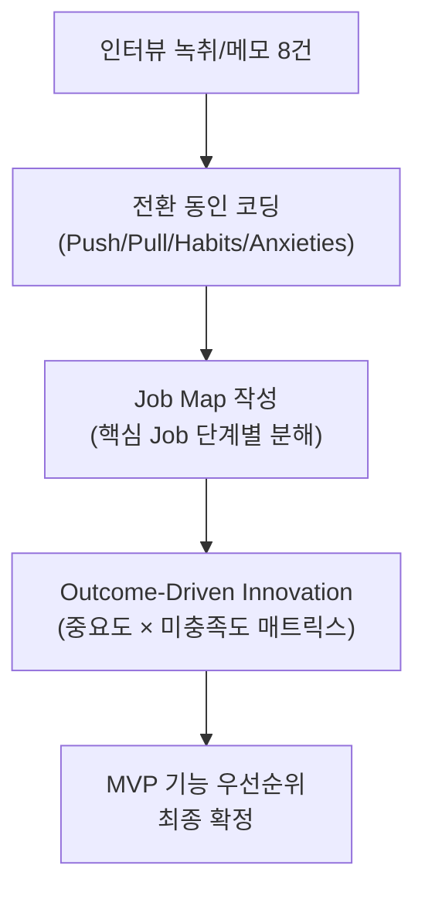

# JTBD 심층 인터뷰 종합 계획서

> 사내 공정 스케줄링 시스템 — Phase 1: 수주 통합 · 성형 스케줄링 · 압출 스케줄링
> 작성일: 2026-04-27

---

## 1. 인터뷰 개요 및 목적

### 1.1 분석을 통해 도출된 핵심 기회 영역

지금까지 수행한 사전 분석(사례 연구, CSF, KPI 정의, 문제정의서, 페르소나 스펙트럼, Pain/Goal 분석)을 통해 다음 **3대 핵심 기회 영역**이 도출되었습니다.

| # | 기회 영역 | 근거 (분석 자료) |
|---|----------|----------------|
| **O-1** | 수주 정보 통합 자동화 | 3종 엑셀 파일의 이종 포맷 취합에 반나절 소요 + 거의 매일 발생하는 수주 변경 (문제정의서 §3.2) |
| **O-2** | 회전수 기반 성형 스케줄링 | 슬롯 O/X, 합금형, 앵글 교체 페널티 등 복합 제약을 수작업으로 처리 불가 (문제정의서 §5.1) |
| **O-3** | 압출-성형 공정 자동 연동 | 성형 변경 시 압출에 구두 전달 → 관체 과부족 발생 (문제정의서 §3.2 문제3) |

### 1.2 왜 JTBD 인터뷰가 필요한가

위 분석은 **기획자의 관점**에서 도출된 것입니다. 실제 사용자가 체감하는 **'전환 순간(Switch Event)'** — 즉, "이 문제를 더는 참을 수 없어서 다른 방법을 찾기 시작한 순간"을 포착하려면, **사용자 본인의 이야기**를 들어야 합니다.

| 목적 | 상세 |
|------|------|
| **가설 검증** | 분석에서 도출한 Pain(GAP 4 이상 7건)이 사용자 실제 체감과 일치하는지 확인 |
| **숨겨진 Job 발굴** | 분석에서 놓친 암묵적 니즈(예: 야간 운영, 심리적 부담)를 발굴 |
| **전환 동인 파악** | Push(현재 방식의 한계) / Pull(새 시스템의 매력) / Habits(엑셀 관성) / Anxieties(새 시스템 불안) 매핑 |
| **MVP 기능 우선순위 확정** | 인터뷰 결과로 "반드시 있어야 하는 기능"과 "나중이어도 되는 기능"을 사용자 관점에서 재정렬 |

---

## 2. 핵심 타겟 인터뷰이 (페르소나 기반 선정)

### 2.1 선정 기준

JTBD 인터뷰 가이드에 따라 **전환 행동(switching behavior)** 관점에서 3개 그룹으로 분류합니다.

| JTBD 그룹 | 의미 (사내 맥락 적용) | 대상 페르소나 |
|----------|---------------------|-------------|
| **최근 전환자** | 기존 엑셀 방식에서 벗어나려 시도한 적 있는 사람 | P1. 김정훈, P4. 최민혁 |
| **이탈/포기자** | 개선을 시도했으나 다시 엑셀로 돌아간 사람 | P2. 이수진, P10. 임창수 |
| **미인지자** | 현재 방식에 문제를 느끼지 못하거나, 대안을 고려해본 적 없는 사람 | P11. 강병철, P9. 송기범 |

### 2.2 인터뷰이 목록 (8명)

| # | 페르소나 | 선정 이유 (분석 근거) | JTBD 그룹 |
|---|---------|---------------------|----------|
| 1 | **P1. 김정훈** (생산관리 주임) | Pain GAP 4 × 2건. 시스템의 핵심 사용자이자 성패 결정자 | 최근 전환자 |
| 2 | **P2. 이수진** (성형 반장) | 앵글 교체 최소화의 실제 판단자. "사무실 스케줄이 현장과 안 맞다" 경험 보유 | 이탈/포기자 |
| 3 | **P3. 박도영** (압출 반장) | 공정 간 연동 부재의 직접 피해자. Pain GAP 4 | 최근 전환자 |
| 4 | **P4. 최민혁** (생산관리 대리) | Key Person 리스크의 체감자. 경험 부족으로 실패 빈도 높음 | 최근 전환자 |
| 5 | **P5. 한소라** (생산기획 과장) | KPI 보고의 수동 반복. 경영진 보고 기능 니즈 검증 | 최근 전환자 |
| 6 | **P9. 송기범** (신입) | 극단 사용자. "용어를 몰라도 사용 가능한가" 검증 | 미인지자 |
| 7 | **P10. 임창수** (야간 반장) | 극단 사용자. IT 접근성 한계. 모바일 뷰 니즈 검증 | 이탈/포기자 |
| 8 | **P11. 강병철** (공장장) | 비활성 사용자. 투자 의사결정자의 기대치 및 불안 요소 파악 | 미인지자 |

---

## 3. 검증을 위한 핵심 가설 (Job-Story 기반)

### 3.1 핵심 Job-Stories

> 형식: `[상황]`일 때, 나는 `[동기]`를 위해 `[과업]`을 하고 싶지만, `[장애물]` 때문에 어렵다.

---

**JS-1: 수주 통합** (P1, P4 대상)
```
[매주 월요일 아침, 3종 엑셀 파일이 도착했을 때]
나는 [정확한 주간 생산 계획의 기초 데이터를 확보하기 위해]
[모든 수주 정보를 하나의 통합 뷰로 빠르게 합치고] 싶지만,
[파일마다 컬럼 구조가 달라서 수작업 취합에 반나절이 걸리고,
매일 발생하는 수주 변경을 추적할 방법이 없어] 어렵다.
```

**JS-2: 성형 스케줄링** (P1, P2 대상)
```
[통합된 수주 데이터를 바탕으로 주간 성형 스케줄을 수립할 때]
나는 [납기를 준수하면서 앵글 교체를 최소화하기 위해]
[금형/슬롯/앵글 제약을 반영한 현실적인 배치를 자동으로 제안받고] 싶지만,
[저압 4대+IC 1대의 슬롯별 O/X 조건과 앵글 교체 페널티를
머릿속에서만 계산해야 해서] 비효율과 실수가 반복된다.
```

**JS-3: 압출 연동** (P3 대상)
```
[성형 스케줄이 확정 또는 변경되었을 때]
나는 [관체 부족 없이 성형 라인에 적시 공급하기 위해]
[압출 일정이 자동으로 역산되어 즉시 알려주길] 원하지만,
[성형 변경이 카톡/구두로만 전달되어 누락되고,
이미 늦은 시점에서야 알게 되어] 라인 정지가 발생한다.
```

**JS-4: Key Person 리스크** (P4, P9 대상)
```
[김정훈 주임이 부재(휴가/출장/병가)인 상황에서]
나는 [스케줄 수립 업무가 중단되지 않도록 하기 위해]
[시스템이 제약 조건을 자동 검증하여 기본 스케줄을 잡아주길] 원하지만,
[금형/앵글/슬롯 조합 경우의 수가 너무 복잡하고
이를 알고 있는 사람이 1명뿐이라] 업무가 마비된다.
```

**JS-5: 야간/모바일 접근** (P10 대상)
```
[야간 교대 근무 중 긴급 변경이 발생했을 때]
나는 [현장에서 즉시 변경 사항을 확인하기 위해]
[모바일로 오늘의 작업 목록과 변경 내역을 조회하고] 싶지만,
[PC가 없고, IT 활용이 어려우며, 사무실에 아무도 없어] 판단 근거가 없다.
```

**JS-6: 투자 정당화** (P11 대상)
```
[IT 시스템 도입을 위한 투자 결정을 내려야 할 때]
나는 [투자 대비 명확한 성과가 있는지 확인하기 위해]
[납기 준수율, 가동률 같은 KPI 변화를 숫자로 보고] 싶지만,
[현재 측정 체계가 없어서 Before/After를 비교할 수 없고,
현장에서 안 쓰면 매몰비용이 될까봐] 불안하다.
```

---

## 4. 심층 인터뷰 질문지

### 4.1 공통 오프닝 (5분)

> 인터뷰 가이드: "스토리텔링을 유도하라. 직설적으로 묻지 말고, 전환 사건에 집중하라."

```
1. 본인 소개와 현재 맡고 계신 업무를 간단히 설명해 주세요.
2. 일주일 업무 중 가장 많은 시간을 차지하는 일은 무엇인가요?
3. 지난주 업무 중 가장 기억에 남는 순간이 있다면 이야기해 주세요.
```

---

### 4.2 Push 질문 — 현재 방식의 한계 (15분)

> 인터뷰 가이드: "특정 상황 중 무엇이 새로운 해결책을 찾도록 이끌었는가?"

```
4. 수주 데이터를 취합하는 과정을 처음부터 끝까지 이야기해 주세요.
   ⤷ 후속: 그때 몇 시쯤이었나요? 어디서 작업하셨나요?
   ⤷ 후속: 취합하면서 "아, 이건 문제다"라고 느낀 순간이 있었나요?

5. 스케줄을 짜다가 "이번에는 정말 힘들었다"고 느낀 적이 있나요?
   ⤷ 후속: 그 상황을 자세히 이야기해 주세요. 무엇이 어려웠나요?
   ⤷ 후속: 그때 주변에 도움을 요청할 수 있었나요?

6. 수주 정보가 변경되었을 때의 경험을 이야기해 주세요.
   ⤷ 후속: 변경을 어떻게 알게 되었나요?
   ⤷ 후속: 변경 후 스케줄을 수정하는 데 얼마나 걸렸나요?

7. (성형 반장 대상) 사무실에서 받은 스케줄이 현장에서 안 맞았던 경험이 있나요?
   ⤷ 후속: 그때 어떻게 대처하셨나요?
   ⤷ 후속: 그런 일이 얼마나 자주 발생하나요?
```

---

### 4.3 Pull 질문 — 이상적인 모습 (10분)

> 인터뷰 가이드: "새로운 해결책의 어떤 점이 그것을 시도하고 싶게 만들었는가?"

```
8. 만약 마법처럼 하나만 바꿀 수 있다면, 업무에서 뭘 바꾸고 싶으세요?
   ⤷ 후속: 그게 바뀌면 하루가 어떻게 달라질까요?

9. "이런 도구가 있으면 좋겠다"고 생각해 본 적 있나요?
   ⤷ 후속: 그 도구는 구체적으로 어떤 모습이었나요?
   ⤷ 후속: 다른 사람(동료, 타 회사)이 사용하는 도구를 본 적 있나요?

10. 스케줄 변경이 자동으로 알려준다면, 지금과 뭐가 달라질까요?
```

---

### 4.4 Habits 질문 — 현재 방식에 대한 관성 (10분)

> 인터뷰 가이드: "새로운 해결책을 시도하는 것을 방해할 수 있는 습관은 무엇인가?"

```
11. 엑셀로 업무하면서 "이건 좋다"고 느끼는 점이 있나요?
    ⤷ 후속: 시스템이 바뀌면 그 장점을 잃을까봐 걱정되나요?

12. 지금 방식이 새로운 시스템보다 나은 점이 있다면 무엇일까요?
    ⤷ 후속: "그냥 이대로도 괜찮은데"라고 느낄 때가 있나요?

13. 이전에 새로운 시스템을 도입하려 했다가 안 된 경험이 있나요?
    ⤷ 후속: 왜 안 됐다고 생각하세요?
```

---

### 4.5 Anxieties 질문 — 새 시스템에 대한 불안 (10분)

> 인터뷰 가이드: "새로운 해결책에 대해 어떤 불안감을 느꼈는가?"

```
14. 새로운 스케줄링 시스템이 도입된다면, 가장 걱정되는 점은 무엇인가요?
    ⤷ 후속: "시스템이 틀린 스케줄을 내놓으면 어떡하지?"라는 걱정이 있나요?
    ⤷ 후속: 시스템을 배우는 데 시간이 많이 걸릴까봐 걱정되나요?

15. 시스템이 자동으로 스케줄을 만들어준다면, 그걸 믿을 수 있을까요?
    ⤷ 후속: 어떤 조건이 충족되면 믿을 수 있을까요?

16. (공장장 대상) 시스템 도입 후 현장에서 안 쓰게 될까봐 걱정되시나요?
    ⤷ 후속: 어떤 증거를 보면 "잘 되고 있다"고 판단하시겠어요?
```

---

### 4.6 클로징 (5분)

```
17. 오늘 이야기하면서 새롭게 느낀 점이 있나요?
18. 마지막으로, 이 시스템이 꼭 해결해줘야 할 한 가지가 있다면?
19. 이 프로젝트에 계속 참여하실 의향이 있으신가요?
```

---

## 5. 인터뷰 수행 절차

### 5.1 일정 계획

| 항목 | 내용 |
|------|------|
| **인터뷰이 수** | 8명 (핵심 5 + 극단 2 + 비활성 1) |
| **인터뷰 시간** | 1인당 **60분** (JTBD 가이드 권장 60~90분) |
| **진행 기간** | 2주 (1주차 4명, 2주차 4명) |
| **진행 방식** | 대면 인터뷰 (현장 사무실 또는 회의실) |
| **인터뷰어** | 기획자 1명 + 기록자 1명 (2인 1조) |

### 5.2 모집 방법

| 단계 | 행동 | 담당 |
|------|------|------|
| 1 | 경영진(공장장)에게 프로젝트 취지 설명 및 협조 요청 | 기획자 |
| 2 | 각 부서 팀장에게 인터뷰 대상자 추천 의뢰 | 기획자 |
| 3 | 대상자에게 개별 연락: 목적, 소요시간, 비밀 보장 안내 | 기획자 |
| 4 | 일정 확정 및 장소 예약 | 기록자 |

### 5.3 기록 및 동의 절차

| 항목 | 방법 |
|------|------|
| **녹음** | 인터뷰이 사전 동의 후 녹음. 미동의 시 필기로 대체 |
| **기록 양식** | Job-Story 프레임(Push/Pull/Habits/Anxieties) 기반 정리 |
| **비밀 보장** | 개인 식별 정보 비공개. 분석 시 페르소나 코드(P1~P12)로 표기 |
| **보상** | 사내 직원이므로 별도 금전 보상 없음. 간식/음료 제공 |

---

## 6. 예상 결과 및 후속 조치

### 6.1 기대 효과

| 검증 항목 | 성공 시 결과 | 실패 시 대응 |
|----------|-----------|-----------|
| **JS-1 가설** 검증 | 수주 Import + 변경 감지가 MVP 1순위로 확정 | Import보다 다른 Pain이 더 크다면 우선순위 재조정 |
| **JS-2 가설** 검증 | 앵글 교체 최소화가 핵심 가치로 확정 | 현장이 수동 배치를 더 선호하면 자동화 수준 조정 |
| **JS-3 가설** 검증 | 성형→압출 자동 역산이 필수로 확정 | 구두 전달에 큰 불편이 없다면 Phase 2로 이동 |
| **숨겨진 Job** 발굴 | 분석에서 놓친 암묵적 니즈 추가 반영 | — |

### 6.2 분석 방법론



| 분석 도구 | 목적 | 산출물 |
|----------|------|--------|
| **전환 동인 코딩** | 8명의 인터뷰에서 Push/Pull/Habits/Anxieties 추출 | 전환 동인 요약 테이블 |
| **Job Map** | 핵심 Job(수주 통합, 스케줄 수립)을 단계별로 분해 | 단계별 Pain 포인트 시각화 |
| **ODI 매트릭스** | 각 Outcome의 중요도 × 현재 만족도 측정 | 과소충족(Underserved) 기회 영역 도출 |

### 6.3 후속 계획 (인터뷰 → MVP 반영)

| 순서 | 작업 | 기간 | 산출물 |
|------|------|------|--------|
| 1 | 인터뷰 데이터 코딩 및 분석 | 1주 | 전환 동인 테이블, Job Map |
| 2 | ODI 매트릭스 작성 | 3일 | 기회 영역 우선순위 |
| 3 | **RPD(요구사항 정의) 최종 확정** | 1주 | JTBD 검증 기반 기능 요구사항 정의서 |
| 4 | SRS(기술 명세) 착수 | 1~2주 | ERD, API 명세, 알고리즘 설계 |

---

## 참조 문서

| 문서 | 위치 | 활용 |
|------|------|------|
| 문제정의서 | `4.problem_statement.md` | §3.2 Pain Points → JS 가설 근거 |
| 페르소나 스펙트럼 | `6.persona_spectrum.md` | 인터뷰이 선정 근거 |
| Pain/Goal 분석 | `7.persona_pain_goal_analysis.md` | GAP 분석 → JS 우선순위 |
| CSF | `2.critical_success_factors.md` | CSF-1(데이터)·CSF-2(현장) → 질문 설계 |
| KPI 정의 | `3.kpi_definition.md` | JS-6 투자 정당화 가설 근거 |
| JTBD 인터뷰 가이드 | `8-1_JTBD-interview-guide-card.html` | 질문 설계 방법론 |
