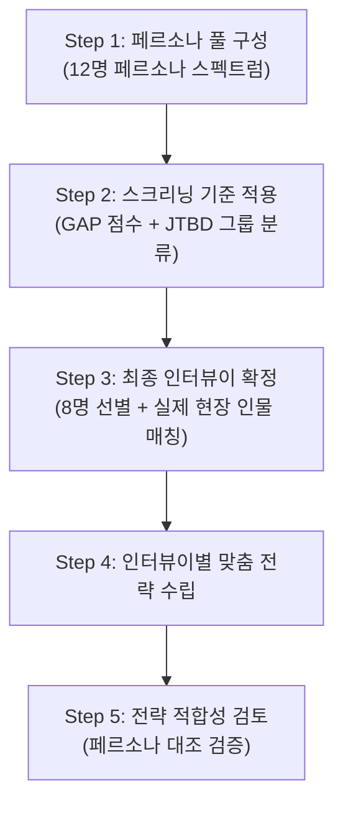

# JTBD 심층 인터뷰 종합 계획서 v2

> 사내 공정 스케줄링 시스템 — Phase 1
> v2 변경점: 페르소나 기반 스크리닝 프로세스 추가, 인터뷰이별 맞춤 전략 및 검토 단계 추가

---

## 1. 인터뷰 개요 및 목적

### 1.1 핵심 기회 영역

| # | 기회 영역 | 근거 |
|---|----------|------|
| O-1 | 수주 정보 통합 자동화 | 3종 엑셀 수작업 취합 + 매일 수주 변경 (문제정의서 §3.2) |
| O-2 | 회전수 기반 성형 스케줄링 | 슬롯 O/X, 합금형, 앵글 교체 페널티 등 복합 제약 (문제정의서 §5.1) |
| O-3 | 압출-성형 공정 자동 연동 | 성형 변경 구두 전달 → 관체 과부족 (문제정의서 §3.2) |

### 1.2 인터뷰 목적

| 목적 | 상세 |
|------|------|
| 가설 검증 | Pain GAP 4 이상 7건이 실제 체감과 일치하는지 확인 |
| 숨겨진 Job 발굴 | 분석에서 놓친 암묵적 니즈 발굴 |
| 전환 동인 파악 | Push/Pull/Habits/Anxieties 매핑 |
| MVP 우선순위 확정 | 사용자 관점 기능 우선순위 재정렬 |

---

## 2. 페르소나 기반 인터뷰이 스크리닝 프로세스

> [!IMPORTANT]
> **v2 핵심 변경**: 인터뷰이는 랜덤 선정이 아니라, 페르소나 스펙트럼(6.persona_spectrum.md)과 Pain/Goal 분석(7.persona_pain_goal_analysis.md)에서 도출된 결과물을 기반으로 **체계적 스크리닝**을 거쳐 선별합니다.

### 2.1 3단계 스크리닝 프로세스



### Step 1: 페르소나 풀 구성 (12명)

페르소나 스펙트럼에서 도출된 전체 12명을 대상 풀로 설정합니다.

| 유형 | 페르소나 | Pain GAP 최대값 |
|------|---------|:--------------:|
| 핵심 | P1 김정훈, P2 이수진, P3 박도영, P4 최민혁, P5 한소라 | 4, 3, 4, 4, 2 |
| 확장 | P6 오재웅, P7 윤하경, P8 정태호 | 2, 1, 1 |
| 극단 | P9 송기범, P10 임창수 | 4, 4 |
| 비활성 | P11 강병철, P12 나영미 | 1, 0 |

### Step 2: 스크리닝 기준 적용

| 기준 | 조건 | 통과 페르소나 |
|------|------|-------------|
| **기준 1**: Pain GAP ≥ 3 | 시스템 도입 시 체감 효과가 큰 사용자 | P1, P2, P3, P4, P9, P10 |
| **기준 2**: JTBD 그룹 다양성 | 전환자/이탈자/미인지자 최소 1명씩 | +P11(미인지자 대표) |
| **기준 3**: 의사결정 영향력 | 투자 결정권자 또는 KPI 보고자 포함 | +P5(보고 담당), P11 유지 |

### Step 3: 최종 인터뷰이 확정 (8명)

| # | 페르소나 | 스크리닝 통과 기준 | JTBD 그룹 |
|---|---------|------------------|----------|
| 1 | **P1. 김정훈** | 기준1(GAP4) + 시스템 성패 결정자 | 최근 전환자 |
| 2 | **P2. 이수진** | 기준1(GAP3) + 현장 제약 판단자 | 이탈/포기자 |
| 3 | **P3. 박도영** | 기준1(GAP4) + 공정 연동 피해자 | 최근 전환자 |
| 4 | **P4. 최민혁** | 기준1(GAP4) + Key Person 리스크 체감 | 최근 전환자 |
| 5 | **P5. 한소라** | 기준3(KPI 보고) + 경영진 접점 | 최근 전환자 |
| 6 | **P9. 송기범** | 기준1(GAP4) + 극단 UX 검증 | 미인지자 |
| 7 | **P10. 임창수** | 기준1(GAP4) + 모바일/IT 한계 검증 | 이탈/포기자 |
| 8 | **P11. 강병철** | 기준2(미인지자) + 기준3(의사결정권) | 미인지자 |

### Step 4~5: 아래 섹션 2-A에서 상세 기술

---

## 2-A. 인터뷰이별 맞춤 전략 및 페르소나 적합성 검토

> [!IMPORTANT]
> **v2 핵심 변경**: 각 인터뷰이에 대해 ① 맞춤 전략을 수립한 뒤, ② 해당 전략이 페르소나의 Pain/Goal/감정과 정합하는지 **교차 검토**합니다.

---

### INT-1. 김정훈 (P1, 생산관리 주임)

**맞춤 인터뷰 전략**

| 항목 | 전략 |
|------|------|
| **검증 가설** | JS-1(수주 통합), JS-2(성형 스케줄링) |
| **집중 질문 영역** | Push(엑셀 취합의 한계, 수주 변경 추적 불가) + Anxieties(시스템 신뢰 가능성) |
| **질문 톤** | 동료 대화 톤. "가장 경험이 많으신 분"으로 존중하며 접근 |
| **핵심 탐색 포인트** | "수주 변경이 발생한 가장 최근 사례를 처음부터 이야기해 주세요" |
| **주의사항** | 본인이 유일한 스케줄링 담당자라는 부담감에 공감. 해결해 달라는 식으로 몰지 않기 |

**✅ 페르소나 적합성 검토**

| 검토 항목 | 페르소나 원본 (P1) | 전략 반영 여부 |
|----------|-------------------|:------------:|
| Pain: 3종 엑셀 반나절 취합 | JS-1에서 직접 검증 | ✅ |
| Pain: 매일 수주 변경, 추적 불가 | Push 질문 #6에서 탐색 | ✅ |
| Goal: 변경 시 영향 범위 즉시 파악 | Pull 질문 #10에서 탐색 | ✅ |
| 감정: "나만 할 수 있어서 부담" | 주의사항에 공감 전략 반영 | ✅ |

---

### INT-2. 이수진 (P2, 성형 현장반장)

**맞춤 인터뷰 전략**

| 항목 | 전략 |
|------|------|
| **검증 가설** | JS-2(성형 스케줄링 — 현장 적합성) |
| **집중 질문 영역** | Push(사무실 스케줄과 현장의 괴리) + Habits(현장 재배치 관성) |
| **질문 톤** | 현장 경험에 대한 존경. "15년 현장 경험이 시스템보다 나은 점은?" |
| **핵심 탐색 포인트** | "받은 스케줄을 현장에서 바꿔야 했던 가장 기억에 남는 순간" |
| **주의사항** | "시스템이 당신을 대체한다"는 인상 절대 금지. 보조 도구로 포지셔닝 |

**✅ 페르소나 적합성 검토**

| 검토 항목 | 페르소나 원본 (P2) | 전략 반영 여부 |
|----------|-------------------|:------------:|
| Pain: 사무실 스케줄이 현장 제약 미반영 | Push 질문 #7에서 직접 탐색 | ✅ |
| Pain: 앵글 교체 과다로 생산 손실 | JS-2에서 검증 | ✅ |
| 감정: "사무실에서 짠 게 안 맞을 때 답답" | 핵심 탐색 포인트에 반영 | ✅ |
| 대체 솔루션 만족도: 3/5 (경험 기반) | Habits 질문으로 관성 강도 측정 | ✅ |

---

### INT-3. 박도영 (P3, 압출 현장반장)

**맞춤 인터뷰 전략**

| 항목 | 전략 |
|------|------|
| **검증 가설** | JS-3(압출-성형 연동) |
| **집중 질문 영역** | Push(구두 전달 누락 경험) + Pull(자동 역산 알림의 가치) |
| **질문 톤** | "성형 쪽 변경 때문에 고생하신 경험"에 공감 |
| **핵심 탐색 포인트** | "관체가 부족해서 성형 라인이 멈춘 가장 최근 사례" |
| **주의사항** | 성형 반장과의 갈등 구조로 몰지 않기. 프로세스 문제로 프레이밍 |

**✅ 페르소나 적합성 검토**

| 검토 항목 | 페르소나 원본 (P3) | 전략 반영 여부 |
|----------|-------------------|:------------:|
| Pain: 성형 변경 구두 전달, 누락 | Push 질문에서 직접 탐색 | ✅ |
| Pain: 관체 과부족 | 핵심 탐색 포인트에 반영 | ✅ |
| 감정: "나중에 얘기하면 이미 늦어" | 스토리텔링 유도로 추출 | ✅ |

---

### INT-4. 최민혁 (P4, 생산관리 대리)

**맞춤 인터뷰 전략**

| 항목 | 전략 |
|------|------|
| **검증 가설** | JS-4(Key Person 리스크), JS-1(수주 통합 보조) |
| **집중 질문 영역** | Push(주임 부재 시 공포) + Anxieties(실수 불안) + Pull(자동 검증 기대) |
| **질문 톤** | 솔직한 어려움을 터놓을 수 있는 안전한 분위기 조성 |
| **핵심 탐색 포인트** | "김정훈 주임이 자리를 비웠을 때 혼자 스케줄을 짜야 했던 경험" |
| **주의사항** | 능력 부족이 아니라 시스템 부재가 원인임을 전제 |

**✅ 페르소나 적합성 검토**

| 검토 항목 | 페르소나 원본 (P4) | 전략 반영 여부 |
|----------|-------------------|:------------:|
| Pain: 주임 부재 시 스케줄 수립 불가 | 핵심 탐색 포인트에 직접 반영 | ✅ |
| Pain: 제약 조건 암기 불가 | JS-4에서 검증 | ✅ |
| 감정: "실수할까봐 걱정" | Anxieties 질문으로 탐색 | ✅ |

---

### INT-5. 한소라 (P5, 생산기획 과장)

**맞춤 인터뷰 전략**

| 항목 | 전략 |
|------|------|
| **검증 가설** | JS-6(투자 정당화 — 실무 관점) |
| **집중 질문 영역** | Push(수동 보고 반복) + Pull(자동 KPI 대시보드) |
| **핵심 탐색 포인트** | "매주 경영진 보고서를 만드는 과정을 처음부터 이야기해 주세요" |
| **주의사항** | Phase 1 직접 사용자는 아니므로 MES 연동 기대치를 과도하게 높이지 않기 |

**✅ 페르소나 적합성 검토**

| 검토 항목 | 페르소나 원본 (P5) | 전략 반영 여부 |
|----------|-------------------|:------------:|
| Pain: 계획 vs 실적 수동 추출 | Push 질문으로 탐색 | ✅ |
| Goal: KPI 자동 대시보드 | Pull 질문으로 탐색 | ✅ |

---

### INT-6. 송기범 (P9, 신입 생산관리)

**맞춤 인터뷰 전략**

| 항목 | 전략 |
|------|------|
| **검증 가설** | JS-4(Key Person 리스크 — 신입 관점) |
| **집중 질문 영역** | Anxieties(용어/개념 미숙) + Push(매번 질문하는 부담) |
| **질문 톤** | 편안하고 비판단적. "신입 때 누구나 겪는 어려움" |
| **핵심 탐색 포인트** | "혼자서 처음 업무를 처리해야 했을 때 가장 막막했던 순간" |
| **주의사항** | 선배와의 관계가 드러나므로, 개인 비밀 보장 재강조 |

**✅ 페르소나 적합성 검토**

| 검토 항목 | 페르소나 원본 (P9) | 전략 반영 여부 |
|----------|-------------------|:------------:|
| Pain: 금형/앵글 개념 자체 미숙 | Anxieties 질문으로 탐색 | ✅ |
| 감정: "물어보기도 눈치 보임" | 안전한 분위기 조성 전략에 반영 | ✅ |

---

### INT-7. 임창수 (P10, 야간 교대 반장)

**맞춤 인터뷰 전략**

| 항목 | 전략 |
|------|------|
| **검증 가설** | JS-5(야간/모바일 접근) |
| **집중 질문 영역** | Push(야간 판단 근거 없음) + Anxieties(IT 활용 어려움) |
| **질문 톤** | 현장 베테랑에 대한 존중. IT 능력이 아닌 환경 제약으로 접근 |
| **핵심 탐색 포인트** | "야간에 급하게 뭔가를 확인해야 했는데 방법이 없었던 경험" |
| **주의사항** | PC/IT 능력을 테스트하는 느낌 주지 않기 |

**✅ 페르소나 적합성 검토**

| 검토 항목 | 페르소나 원본 (P10) | 전략 반영 여부 |
|----------|-------------------|:------------:|
| Pain: 야간 판단 근거 없음 | 핵심 탐색 포인트에 직접 반영 | ✅ |
| Pain: IT 문해력 낮음 | Anxieties로 탐색 (비판단적) | ✅ |

---

### INT-8. 강병철 (P11, 공장장)

**맞춤 인터뷰 전략**

| 항목 | 전략 |
|------|------|
| **검증 가설** | JS-6(투자 정당화) |
| **집중 질문 영역** | Anxieties(매몰비용 불안) + Pull(KPI 수치로 성과 확인) |
| **질문 톤** | 경영 판단자로서 존중. 보고·브리핑 형식 |
| **핵심 탐색 포인트** | "이전에 IT 시스템 도입을 검토하거나 시도한 경험이 있으신지?" |
| **주의사항** | 인터뷰 시간 30분으로 단축. 핵심만 집중 |

**✅ 페르소나 적합성 검토**

| 검토 항목 | 페르소나 원본 (P11) | 전략 반영 여부 |
|----------|-------------------|:------------:|
| Pain: 투자 대비 성과 불확실 | JS-6에서 직접 검증 | ✅ |
| 감정: "안 쓰면 실패" | Anxieties 질문으로 탐색 | ✅ |

---

## 3. 검증을 위한 핵심 가설 (Job-Story)

> 형식: `[상황]`일 때, `[동기]`를 위해 `[과업]`을 하고 싶지만, `[장애물]` 때문에 어렵다.

| ID | Job-Story 요약 | 대상 | 검증 인터뷰이 |
|----|---------------|------|-------------|
| JS-1 | 3종 엑셀 수주 통합 + 변경 추적 | 수주 통합 | INT-1, INT-4 |
| JS-2 | 슬롯/앵글 제약 반영 성형 스케줄 | 성형 스케줄링 | INT-1, INT-2 |
| JS-3 | 성형→압출 자동 역산 연동 | 압출 연동 | INT-3 |
| JS-4 | Key Person 부재 시 업무 마비 | 조직 리스크 | INT-4, INT-6 |
| JS-5 | 야간/모바일 작업 지시 확인 | 접근성 | INT-7 |
| JS-6 | 투자 대비 KPI 성과 확인 | 의사결정 | INT-5, INT-8 |

---

## 4. 심층 인터뷰 질문지

### 4.1 공통 오프닝 (5분)
```
1. 본인 소개와 현재 맡고 계신 업무를 간단히 설명해 주세요.
2. 일주일 업무 중 가장 많은 시간을 차지하는 일은?
3. 지난주 업무 중 가장 기억에 남는 순간을 이야기해 주세요.
```

### 4.2 Push — 현재 방식의 한계 (15분)
```
4. 수주 데이터를 취합하는 과정을 처음부터 끝까지 이야기해 주세요.
   ⤷ 그때 몇 시쯤이었나요? 어디서 작업하셨나요?
   ⤷ "아, 이건 문제다"라고 느낀 순간이 있었나요?
5. 스케줄을 짜다가 "정말 힘들었다"고 느낀 적이 있나요?
   ⤷ 그 상황을 자세히 이야기해 주세요.
6. 수주 정보가 변경되었을 때의 경험을 이야기해 주세요.
   ⤷ 변경 후 스케줄 수정에 얼마나 걸렸나요?
7. (성형 반장) 사무실 스케줄이 현장에서 안 맞았던 경험은?
```

### 4.3 Pull — 이상적인 모습 (10분)
```
8. 마법처럼 하나만 바꿀 수 있다면, 업무에서 뭘 바꾸고 싶으세요?
9. "이런 도구가 있으면 좋겠다"고 생각해 본 적 있나요?
10. 스케줄 변경이 자동으로 알려준다면, 지금과 뭐가 달라질까요?
```

### 4.4 Habits — 현재 방식 관성 (10분)
```
11. 엑셀로 업무하면서 "이건 좋다"고 느끼는 점이 있나요?
12. 지금 방식이 새 시스템보다 나은 점이 있다면?
13. 이전에 새 시스템 도입을 시도했다가 안 된 경험이 있나요?
```

### 4.5 Anxieties — 새 시스템 불안 (10분)
```
14. 새 스케줄링 시스템이 도입된다면, 가장 걱정되는 점은?
15. 시스템이 자동으로 스케줄을 만든다면, 믿을 수 있을까요?
16. (공장장) 시스템 도입 후 현장에서 안 쓰게 될까봐 걱정되시나요?
```

### 4.6 클로징 (5분)
```
17. 오늘 이야기하면서 새롭게 느낀 점이 있나요?
18. 이 시스템이 꼭 해결해줘야 할 한 가지가 있다면?
19. 이 프로젝트에 계속 참여하실 의향이 있으신가요?
```

---

## 5. 인터뷰 수행 절차

| 항목 | 내용 |
|------|------|
| 인터뷰이 수 | 8명 |
| 인터뷰 시간 | 핵심 60분, 공장장 30분 |
| 진행 기간 | 2주 (1주차 4명, 2주차 4명) |
| 진행 방식 | 대면 (현장 회의실) |
| 인터뷰어 | 기획자 1명 + 기록자 1명 |
| 녹음 | 사전 동의 후 녹음, 미동의 시 필기 |
| 비밀 보장 | 페르소나 코드(P1~P12)로 익명화 |

---

## 6. 예상 결과 및 후속 조치

| 검증 항목 | 성공 시 | 실패 시 |
|----------|--------|--------|
| JS-1 | 수주 Import + 변경 감지 MVP 1순위 확정 | 우선순위 재조정 |
| JS-2 | 앵글 교체 최소화 핵심 가치 확정 | 자동화 수준 조정 |
| JS-3 | 성형→압출 자동 역산 필수 확정 | Phase 2로 이동 |

### 후속 계획

| 순서 | 작업 | 기간 |
|------|------|------|
| 1 | 인터뷰 데이터 코딩 (Push/Pull/Habits/Anxieties) | 1주 |
| 2 | Job Map + ODI 매트릭스 작성 | 3일 |
| 3 | RPD 요구사항 정의 최종 확정 | 1주 |
| 4 | SRS 기술 명세 착수 | 1~2주 |

---

## 참조 문서

| 문서 | 위치 |
|------|------|
| 문제정의서 | `4.problem_statement.md` |
| 페르소나 스펙트럼 | `6.persona_spectrum.md` |
| Pain/Goal 분석 | `7.persona_pain_goal_analysis.md` |
| JTBD 인터뷰 가이드 | `8-1_JTBD-interview-guide-card.html` |
| v1 계획서 | `8.jtbd_interview_plan.md` |
