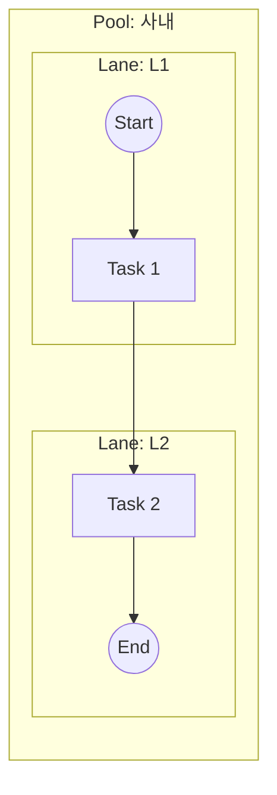
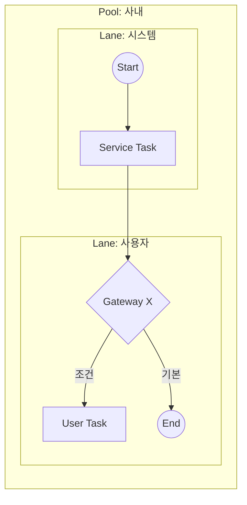

# PDD Template — Process Definition Document

> 본 템플릿은 **ISO/IEC/IEEE 12207:2008**의 "Purpose–Outcomes–Activities" 3-요소 골격과
> **OMG BPMN 2.0 Descriptive Conformance**의 표기법을 동시 준수하도록 구성되어 있다.
> 사내 프로세스 1건당 본 템플릿을 1부 작성한다.

---

## 1. Process Identification

| 항목 | 값 |
|------|-----|
| Process ID | `PDD-XX-vN` |
| Process Name | (한국어 명칭 / English Name) |
| Version | `v1.0` (작성일 기준) |
| Owner | (프로세스 책임자/팀) |
| 12207 Mapping | `§6.4 Technical Processes — Operation` 계열 |
| Conformance Class | BPMN 2.0 Descriptive Process Modeling Conformance Sub-Class |
| Status | Draft / Reviewed / Approved |
| Created / Updated | YYYY-MM-DD / YYYY-MM-DD |

---

## 2. Purpose

> IEEE 12207 §X.Y.1 패턴: *"The purpose of … is to …"* — 1~3문장.

(이 프로세스가 존재하는 이유를 한 문단으로)

---

## 3. Outcomes

> IEEE 12207 §X.Y.2 패턴: 성공 시 **관찰·검증 가능한 결과**의 목록. a)~g) 형식.

a) ...
b) ...
c) ...
d) ...
e) ...
f) ...
g) ...

---

## 4. Scope & Context

### 4.1 트리거 (Triggering Event)
- (이 프로세스가 시작되는 이벤트)

### 4.2 시작 / 종료 조건

| 구분 | 조건 |
|------|------|
| Start | ... |
| End (Normal) | ... |
| End (Exception) | ... |

### 4.3 인접 프로세스 인터페이스

| 인접 프로세스 | 방향 | 교환 데이터 |
|------------|:---:|-----------|
| `PDD-XX` | → 송신 | ... |
| `PDD-YY` | ← 수신 | ... |

---

## 5. Participants & Roles (BPMN Lanes)

> BPMN 2.0 §10.8: Lane은 역할/시스템 단위로 분할 권장.

| Lane | 역할 | 시스템 / 도구 | 책임 (RACI) |
|------|------|-------------|-----------|
| L1 | ... | ... | R / A |
| L2 | ... | ... | C |
| L3 | ... | ... | I |

> 표기: R=Responsible, A=Accountable, C=Consulted, I=Informed

---

## 6. Inputs / Outputs (Data Objects)

### 6.1 Inputs

| Data Object | 출처 | 형식 | 빈도 | 비고 |
|------------|------|------|------|------|
| ... | ... | ... | ... | ... |

### 6.2 Outputs

| Data Object | 수신처 | 형식 | 빈도 | 비고 |
|------------|--------|------|------|------|
| ... | ... | ... | ... | ... |

---

## 7. BPMN Diagram

> Descriptive Conformance: Task / Sub-Process / Start·End Event / 기본 Gateway(X, +, O) / Sequence Flow / Message Flow / Data Object 까지만 사용.

### 7.1 As-Is (현행)

### 7.2 To-Be (목표)

> 별도 `.bpmn` 정식 파일은 `/diagrams/PDD-XX.bpmn` 으로 별첨(향후 작성).

---

## 8. Activities and Tasks

> IEEE 12207 §X.Y.3 패턴: Activity(동사형 그룹) → Task("shall/should …" 단위 행위).
> BPMN 다이어그램의 노드 ID와 본 절의 Task ID를 **1:1 매핑**한다.

### A1. (Activity 이름)

| Task ID | BPMN Node | Task 기술 | 수행 주체 | 산출물 |
|---------|-----------|----------|---------|--------|
| T1.1 | `A1` | The system **shall** ... | 시스템 / L1 | ... |
| T1.2 | `A2` | The user **should** ... | L2 | ... |

### A2. (Activity 이름)

| Task ID | BPMN Node | Task 기술 | 수행 주체 | 산출물 |
|---------|-----------|----------|---------|--------|
| T2.1 | ... | ... | ... | ... |

---

## 9. Business Rules & Gateways

| Gateway ID | 유형 | 조건식 | 기본 경로 (Default) | 비고 |
|-----------|:----:|--------|------------------|------|
| G1 | Exclusive (X) | `if X > threshold` | else → ... | ... |
| G2 | Parallel (+) | — | 모든 분기 동시 진행 | ... |
| G3 | Inclusive (O) | `if A and/or B` | 적어도 하나 충족 | ... |

---

## 10. KPIs / Acceptance Criteria & Traceability

### 10.1 프로세스 KPI

| KPI ID | 측정 지표 | As-Is | To-Be 목표 | 측정 방법 | 측정 주기 |
|--------|---------|:-----:|:---------:|----------|----------|
| K1 | ... | ... | ... | ... | ... |

### 10.2 Acceptance Criteria

- [ ] Outcome a) 검증: ...
- [ ] Outcome b) 검증: ...
- [ ] ...

### 10.3 Traceability Matrix

| Outcome | 근거 (Phase 1 산출물) | 관련 페르소나 | 향후 SRS 항목 |
|--------|-------------------|-------------|-------------|
| a) | `4.problem_statement.md §...` | P1 김정훈 | SRS-FR-... |
| b) | `10.jtbd_interview_results.md DOS=...` | P3 박도영 | SRS-FR-... |

---

## 11. Risks & Exceptions (선택)

| Risk ID | 리스크 | 확률 | 영향 | 대응 |
|---------|-------|:----:|:----:|------|
| R1 | ... | 중 | 🟡 | ... |

---

## 12. Revision History

| Version | Date | Author | Change |
|---------|------|--------|--------|
| v1.0 | YYYY-MM-DD | ... | 초안 작성 |

---

## 참조 문서

| 표준 / 문서 | 적용 부분 |
|------------|----------|
| ISO/IEC/IEEE 12207:2008 §5.2.3 | Purpose & Outcomes 진술 패턴 |
| ISO/IEC/IEEE 12207:2008 §6.4 | Technical Processes 카테고리 매핑 |
| OMG BPMN 2.0 §10.3–10.8 | Diagram 요소 (Task/Event/Gateway/Lane) |
| OMG BPMN 2.0 §9.4 | Sequence Flow vs Message Flow 규칙 |
| `Phase 1/3.Analysis/12.problem_statement_master.md` | 상위 문제정의 |
| `Phase 1/3.Analysis/10.jtbd_interview_results.md` | Outcome/DOS 근거 |
| `Phase 1/3.Analysis/7.persona_pain_goal_analysis.md` | GAP 우선순위 |
