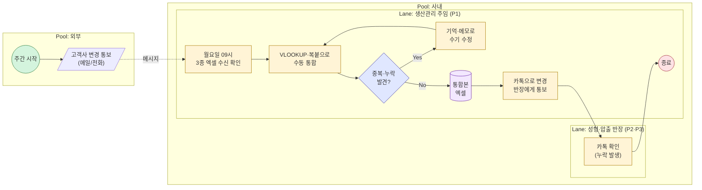
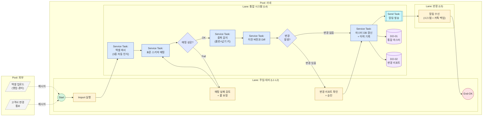

# PDD-01 — 수주 정보 통합 (Order Information Consolidation)

> 공정 스케줄링 시스템 — Phase 1 / 3개 핵심 프로세스 중 1번
> 작성일: 2026-05-14 | 상위 문서: `Phase 1/3.Analysis/12.problem_statement_master.md`
> 본 PDD는 **ISO/IEC/IEEE 12207:2008** Purpose–Outcomes–Activities 골격과 **OMG BPMN 2.0 Descriptive Conformance** 표기를 동시 준수한다.

---

## 1. Process Identification

| 항목 | 값 |
|------|-----|
| Process ID | `PDD-01-v1.0` |
| Process Name | 수주 정보 통합 / Order Information Consolidation |
| Version | v1.0 |
| Owner | 생산관리팀 (Process Owner: 김정훈 주임) |
| 12207 Mapping | `§6.4 Technical Processes` — Stakeholder Requirements Definition + Operation 혼합 |
| Conformance Class | BPMN 2.0 Descriptive Process Modeling Sub-Class |
| Status | Draft v1.0 |
| Created / Updated | 2026-05-14 / 2026-05-14 |
| 우선순위 근거 | 페르소나 P1·P4 GAP=4 (`7.persona_pain_goal_analysis.md`), JTBD DOS=4.0 1순위 (`10.jtbd_interview_results.md`) |

---

## 2. Purpose

> The purpose of the **Order Information Consolidation** process is to **convert three fragmented external order spreadsheets (월별 예상 / KD 발주 / 주간 발주) into a single, version-controlled, change-tracked Master Order Dataset**, which serves as the Single Source of Truth (SSoT) for downstream vulcanization and extrusion scheduling.

본 프로세스는 **포맷이 상이한 3종의 수주 엑셀**을 매주 통합하는 김정훈 주임의 **반나절(4.2시간)** 수작업을, **30분 이내**의 시스템 보조 작업으로 전환하며, 동시에 *수주 변경의 누락 0건*을 보장하는 것을 목적으로 한다.

---

## 3. Outcomes

본 프로세스가 성공적으로 수행되면 다음의 결과가 **관찰·검증 가능**하다.

a) **통합 수주 마스터 DB**가 생성되어, 모든 후속 프로세스(PDD-02 성형, PDD-03 압출)가 동일한 데이터를 참조한다.
b) 3종 엑셀(주간 계획 / KD 발주 / 통합 수주)의 **각기 다른 컬럼 구조가 표준 스키마에 정합 매핑**된다.
c) **품번 + 납기 기준 중복**이 자동 감지되어 중복 등록이 0건이 된다.
d) **수주 변경(납기/수량/품번)**이 이전 Import와 자동 비교되어 차이가 시각적으로 식별된다.
e) **변경 알림**이 영향을 받는 후속 프로세스 담당자(성형/압출 반장)에게 자동 전달된다.
f) **수주 유형(예상/KD/주간/확정)**과 **변경 이력**이 시계열로 추적 가능하다.
g) 모든 통합 결과는 **원본 엑셀로 역-Export 가능**하여 7년간 누적된 수식 자산이 보존된다.

---

## 4. Scope & Context

### 4.1 트리거 (Triggering Event)

| 트리거 유형 | 설명 | 빈도 |
|----------|------|------|
| 정기 트리거 (Timer) | 매주 월요일 09:00 — 주간 정기 통합 | 주 1회 |
| 이벤트 트리거 (Message) | 영업/관리 부서의 신규 엑셀 업로드 | 주중 수시 |
| 이벤트 트리거 (Message) | 고객사 수주 변경 연락 → 엑셀 재수신 | 주중 수시 (일평균 ≥1건) |

### 4.2 시작 / 종료 조건

| 구분 | 조건 |
|------|------|
| **Start** | 3종 엑셀 중 최소 1종이 시스템 업로드 영역에 도착 |
| **End (Normal)** | 통합 마스터 DB 갱신 완료 + 변경 알림 발송 완료 |
| **End (Exception)** | 매핑 실패 / 중복 충돌 / 필수 컬럼 누락 — 사용자에게 검토 요청 후 보류 |

### 4.3 인접 프로세스 인터페이스

| 인접 프로세스 | 방향 | 교환 데이터 |
|------------|:---:|-----------|
| (외부) 영업·관리부서 | ← 수신 | 3종 원본 엑셀 파일 |
| (외부) 고객사 | ← 수신 | 수주 변경 통보 (메일/구두) — 엑셀로 반영 후 시스템 진입 |
| `PDD-02` 성형 스케줄링 | → 송신 | 통합 수주 마스터 (성형 대상 품번 필터) |
| `PDD-03` 압출 스케줄링 | → 송신 | 통합 수주 마스터 (압출 대상 관체 산출 기반) |
| (외부) MES | ↔ 양방향 | 품번 마스터 동기화 (Phase 2 확장 시) |

---

## 5. Participants & Roles (BPMN Lanes)

| Lane | 역할 | 시스템 / 도구 | 책임 (RACI) |
|------|------|-------------|-----------|
| L1 | **생산관리 주임** (P1 김정훈) | 통합 시스템 UI | **R / A** — 매핑 규칙 확정, 변경 검토 승인 |
| L2 | **생산관리 대리** (P4 최민혁) | 통합 시스템 UI | **R** — Import 실행, 결과 검수 |
| L3 | **영업/관리부서** | 엑셀 (외부 Pool) | **C** — 원본 엑셀 송신 |
| L4 | **통합 시스템** (Service Tasks) | Backend / Parser / Diff Engine | **R** — 자동 파싱·매핑·중복감지·변경비교 |
| L5 | **성형 반장 / 압출 반장** (P2 이수진, P3 박도영) | 알림 채널 (시스템 + 카톡 백업) | **I** — 변경 알림 수신 |

> BPMN 2.0 §9.4 준수: 영업/관리부서·고객사는 **별도 Pool**로 두고 Message Flow로 연결, 사내 5개 Lane은 단일 Pool 내 Sequence Flow.

---

## 6. Inputs / Outputs (Data Objects)

### 6.1 Inputs

| Data Object | 출처 | 형식 | 빈도 | 비고 |
|------------|------|------|------|------|
| `DI-01` 월별 예상 발주량 | 영업부서 | `*.xlsx` | 월 1회 + 수시 변경 | 구분·납품유형·차종·사양·일자별 수량 컬럼 |
| `DI-02` KD 발주 현황 | 관리부서 | `*.xlsx` | 월 1~2회 | 오더번호·발주번호·납입요청일·고객사 컬럼 |
| `DI-03` 주간 발주 (실리콘 등) | 영업부서 | `*.xlsx` | 주 1회 | 일자별 수량 매트릭스 형식 |
| `DI-04` 컬럼 매핑 규칙 | 시스템 설정 | JSON | 변경 시 | DI-01/02/03 → 표준 스키마 매핑 |

### 6.2 Outputs

| Data Object | 수신처 | 형식 | 빈도 | 비고 |
|------------|--------|------|------|------|
| `DO-01` 통합 수주 마스터 (현재 버전) | PDD-02, PDD-03 | DB Table + API | 실시간 | SSoT |
| `DO-02` 변경 비교 리포트 | L1, L2 | UI 화면 + PDF Export | Import 시점마다 | 신규/수정/삭제 하이라이트 |
| `DO-03` 변경 알림 | L5 (성형·압출 반장) | 시스템 알림 + 카톡 백업 | 변경 발생 즉시 | 영향 품번·일자 포함 |
| `DO-04` 역-Export 엑셀 | L1, L2 | `*.xlsx` (원본 포맷 호환) | 요청 시 | 7년 수식 자산 보존용 |
| `DO-05` 수주 이력 (시계열) | 감사·분석 | DB Audit Table | 모든 변경 시 | 누가·언제·무엇을 변경 |

---

## 7. BPMN Diagram

> Descriptive Conformance: Task / Sub-Process / Start·End Event / Exclusive·Parallel·Inclusive Gateway / Sequence Flow / Message Flow / Data Object.

### 7.1 As-Is — 현행 수작업 흐름

**As-Is의 문제점 시각화:**
- 평균 4.2시간 소요 (INT-1 실측)
- 중복·변경 누락이 "Yes 분기"에서 빈번 발생 → 월 ≥1건 납기 지연
- 변경 통보가 카톡 → 메시지 누락 시 압출 라인 정지 (월 3건)

---

### 7.2 To-Be — 시스템 도입 후 흐름

**To-Be의 개선 포인트:**
- 자동 파서 → 수작업 4.2h → 사용자 검토만 ≤30분
- 중복 감지를 Gateway G2 이전에 강제 → 누락 0건
- 알림이 Send Task로 자동화 → 메시지 누락 0건

> 별도 정식 BPMN 파일은 향후 `/diagrams/PDD-01.bpmn`으로 작성 예정 (Camunda Modeler).

---

## 8. Activities and Tasks

> IEEE 12207 §X.Y.3 패턴 — Activity는 동사형 그룹, Task는 "shall / should" 형태.
> BPMN 노드 ID와 Task ID는 1:1 매핑.

### A1. 엑셀 수신 및 파싱 (Receive & Parse)

| Task ID | BPMN Node | Task 기술 | 수행 주체 | 산출물 |
|---------|-----------|----------|---------|--------|
| T1.1 | `U1` | The user **shall** initiate the Import process by uploading or selecting the source Excel files. | L1 / L2 | 파일 경로 + 메타데이터 |
| T1.2 | `T1` | The system **shall** automatically detect which of the 3 source types (월별 예상 / KD / 주간) each file belongs to using header signatures. | L4 (시스템) | 파일 분류 결과 |
| T1.3 | `T1` | The system **shall** parse each Excel file into structured rows, handling merged cells, multi-row headers, and date matrix formats. | L4 | Raw row dataset |

### A2. 표준 스키마 매핑 (Map to Master Schema)

| Task ID | BPMN Node | Task 기술 | 수행 주체 | 산출물 |
|---------|-----------|----------|---------|--------|
| T2.1 | `T2` | The system **shall** transform parsed rows into the Master Order Schema using rules in `DI-04`. | L4 | 매핑된 row set |
| T2.2 | `G1` | The system **shall** validate that all required fields (품번·납기·수량·거래처·수주유형) are non-null. | L4 | 검증 결과 |
| T2.3 | `U2` | If validation fails, the user **shall** review the failed rows and either correct the source or update the mapping rule. | L1 / L2 | 보정된 매핑 규칙 |

### A3. 중복 감지 및 변경 비교 (Detect Duplicates & Diff)

| Task ID | BPMN Node | Task 기술 | 수행 주체 | 산출물 |
|---------|-----------|----------|---------|--------|
| T3.1 | `T3` | The system **shall** detect duplicates using the composite key (품번 + 납기일). | L4 | 중복 후보 리스트 |
| T3.2 | `T3` | The system **shall** apply precedence rules: 확정 > 주간 > KD > 예상 — 상위 유형이 하위 유형을 덮어쓴다. | L4 | 중복 해소 결과 |
| T3.3 | `T4` | The system **shall** compute a diff against the previous Master version (`DO-01.v(n-1)`), categorizing each row as 신규 / 수정(필드별) / 삭제. | L4 | Diff dataset |
| T3.4 | `T4` | The system **should** highlight critical changes (납기 변경, 수량 ±20% 이상, 품번 변경) with visual emphasis. | L4 | DO-02 변경 리포트 |

### A4. 검토·승인 및 마스터 갱신 (Review, Approve & Commit)

| Task ID | BPMN Node | Task 기술 | 수행 주체 | 산출물 |
|---------|-----------|----------|---------|--------|
| T4.1 | `U3` | The user **shall** review the change report (`DO-02`) before committing. | L1 | 승인/반려 의사결정 |
| T4.2 | `U3` | The user **shall** approve, reject, or edit individual changes. | L1 | 승인된 변경 셋 |
| T4.3 | `T5` | The system **shall** commit approved changes to the Master DB and write an audit record (`DO-05`) with timestamp, actor, and field-level before/after values. | L4 | DO-01 갱신, DO-05 추가 |

### A5. 변경 알림 발송 (Notify Downstream)

| Task ID | BPMN Node | Task 기술 | 수행 주체 | 산출물 |
|---------|-----------|----------|---------|--------|
| T5.1 | `T6` | The system **shall** identify which downstream lanes (성형 / 압출) are affected by each change. | L4 | 영향도 매핑 |
| T5.2 | `T6` | The system **shall** send a structured notification (시스템 알림 + 카톡 백업) including 품번·일자·변경유형. | L4 | DO-03 알림 |
| T5.3 | `R1` | The downstream user **shall** acknowledge the notification within an SLA defined in §10.1. | L5 | 수신 확인 로그 |

### A6. 역-Export (선택, On-Demand)

| Task ID | BPMN Node | Task 기술 | 수행 주체 | 산출물 |
|---------|-----------|----------|---------|--------|
| T6.1 | (별도 Sub-Process) | The user **may** request export of any Master version into the original Excel format. | L1 / L2 | DO-04 |

---

## 9. Business Rules & Gateways

| Gateway ID | 유형 | 조건식 | 기본 경로 (Default) | 비고 |
|-----------|:----:|--------|------------------|------|
| `G1` | Exclusive (X) | `all required fields non-null && schema-mapped` | Fail → A2 사용자 보정 루프 | 매핑 검증 |
| `G2` | Exclusive (X) | `diff(prev, curr) ≠ ∅` | "변경 없음" 경로 (T5 직행) | 변경 발생 분기 |

### 추가 비즈니스 룰

| Rule ID | 룰 | 적용 위치 |
|---------|-----|----------|
| BR-01 | 동일 (품번, 납기) 중복 시 우선순위: **확정 > 주간 > KD > 예상** | T3.2 |
| BR-02 | 납기 변경 또는 수량 ±20% 이상 변경은 **Critical** 등급으로 표시 | T3.4 |
| BR-03 | 수주 유형이 "확정"이면 사용자 명시 승인 없이 자동 변경 불가 | T4.2 |
| BR-04 | 마스터 DB의 모든 변경은 audit log 기록 없이 커밋 불가 | T4.3 |
| BR-05 | 변경 알림 SLA: Critical 등급은 즉시(<1분), 일반 변경은 5분 이내 | T5.2 |

---

## 10. KPIs / Acceptance Criteria & Traceability

### 10.1 프로세스 KPI

| KPI ID | 측정 지표 | As-Is | To-Be 목표 | 측정 방법 | 측정 주기 |
|--------|---------|:-----:|:---------:|----------|----------|
| K-01 | 주간 수주 취합 소요 시간 | **4.2h** | **≤30분** | UI 진입 ~ 마스터 커밋 타임스탬프 | 주 |
| K-02 | 월간 변경 누락 건수 | **≥1건** | **0건** | DO-05 audit log vs 실제 납품 매칭 | 월 |
| K-03 | 매핑 자동 성공률 | — | **≥95%** | T2.2 통과율 / 총 row | 주 |
| K-04 | Critical 변경 알림 SLA 준수율 | — | **≥99% (<1분)** | T5.2 발송시각 - T4.3 커밋시각 | 월 |
| K-05 | 사용자 작업 만족도 (P1·P4) | 1/5 | **≥4/5** | 분기별 설문 | 분기 |

### 10.2 Acceptance Criteria (Outcome ↔ 검증)

- [ ] **a) SSoT 확보** — PDD-02·PDD-03이 DO-01만을 입력원으로 사용함을 코드 의존성 그래프로 검증
- [ ] **b) 스키마 정합** — 3종 샘플 엑셀로 통합 시 95% 이상 자동 매핑 (T2 회귀 테스트)
- [ ] **c) 중복 0** — (품번, 납기) 키 위반 행 0개 (T3 단위 테스트 100% 통과)
- [ ] **d) 변경 감지** — 의도적으로 수정된 테스트 엑셀의 변경 항목을 100% 식별
- [ ] **e) 알림 도달** — 100건의 시뮬레이션 변경에서 SLA 내 도달률 ≥99%
- [ ] **f) 이력 추적** — 임의 시점 마스터 상태를 audit log로 재구성 가능
- [ ] **g) 역-Export** — Export 후 원본 엑셀과 셀-수준 차이 ≤2% (수식 보존 영역 제외)

### 10.3 Traceability Matrix

| Outcome | 근거 (Phase 1 산출물) | 관련 페르소나 | 향후 SRS 항목 (잠정) |
|--------|-------------------|-------------|-------------------|
| a) SSoT | `12.problem_statement_master.md §4 단절 1` | P1, P4 | SRS-FR-OC-001 |
| b) 스키마 매핑 | `4.problem_statement.md §2.2`, JTBD INT-1 | P1 | SRS-FR-OC-010 ~ 015 |
| c) 중복 0 | `10.jtbd_interview_results.md DOS=4.0 (Outcome #1)` | P1 | SRS-FR-OC-020 |
| d) 변경 감지 | `12.problem_statement_master.md §3.1 인용` | P1, P3 | SRS-FR-OC-030 |
| e) 알림 자동화 | `12.problem_statement_master.md §3.3 단절 3` | P3 | SRS-FR-OC-040 |
| f) 이력 추적 | `2.critical_success_factors.md CSF-1` | P1 | SRS-FR-OC-050 |
| g) 역-Export | `10.jtbd_interview_results.md "엑셀 Export 필수" 신규 발견` | P1 | SRS-FR-OC-060 |

---

## 11. Risks & Exceptions

| Risk ID | 리스크 | 확률 | 영향 | 대응 |
|---------|-------|:----:|:----:|------|
| R-01 | 3종 엑셀 포맷이 추가로 분화되어 매핑 룰 폭증 | 중 | 🟡 | DI-04를 사용자 편집 가능 룰셋으로 외부화, 정기 룰 리뷰 |
| R-02 | 영업/관리부서가 신규 컬럼 추가 → 매핑 실패 누적 | 중 | 🟡 | T2.2 실패 임계 (>5% rows) 발생 시 자동 에스컬레이션 |
| R-03 | "확정" 수주가 다시 변경되어 BR-03 충돌 | 중 | 🟡 | 변경 시 강제 승인 모달 + 영향도 사전 표시 |
| R-04 | 알림 채널 장애 (카톡 백업 포함) | 저 | 🔴 | 다중 채널(시스템 알림+카톡+이메일) + 미수신 시 재전송 |
| R-05 | P1 부재 시 매핑 규칙 변경 불가 | 중 | 🟡 | P4가 같은 권한·교차 학습, 모든 룰 변경은 audit 기록 |

### Exception Flow

- **E-01 매핑 실패**: G1 → A2.T2.3 사용자 보정 루프 (최대 N회 반복, 한도 초과 시 보류)
- **E-02 중복 충돌(BR-01로 해소 불가)**: T3.2 → 사용자 수동 결정 분기 (UI 모달)
- **E-03 커밋 실패(DB 오류 등)**: T4.3 → 트랜잭션 롤백, 직전 상태 복원, 사용자 알림

---

## 12. Revision History

| Version | Date | Author | Change |
|---------|------|--------|--------|
| v1.0 | 2026-05-14 | (작성자) | 초안 작성 — 마스터 문제정의서 v2.0 기준 |

---

## 참조 문서

| 표준 / 문서 | 적용 부분 |
|------------|----------|
| ISO/IEC/IEEE 12207:2008 §5.2.3 | Purpose & Outcomes 진술 패턴 |
| ISO/IEC/IEEE 12207:2008 §6.4 | Technical Processes 카테고리 매핑 |
| OMG BPMN 2.0 §10.3~10.8 | Diagram 요소 (Task/Event/Gateway/Lane) |
| OMG BPMN 2.0 §9.4 | Message Flow는 Pool 간에만, Sequence Flow는 Pool 내부 |
| `Phase 1/3.Analysis/12.problem_statement_master.md` | 상위 문제정의 (마스터) |
| `Phase 1/3.Analysis/10.jtbd_interview_results.md` | DOS=4.0 Outcome 근거, "엑셀 Export 필수" 발견 |
| `Phase 1/3.Analysis/7.persona_pain_goal_analysis.md` | GAP=4 우선순위 |
| `Phase 1/3.Analysis/4.problem_statement.md §2.2` | 3종 엑셀의 실제 컬럼 구조 |
| `Phase 1/2.Raw Materials/Order/*.xlsx` | 입력 데이터 원본 |
