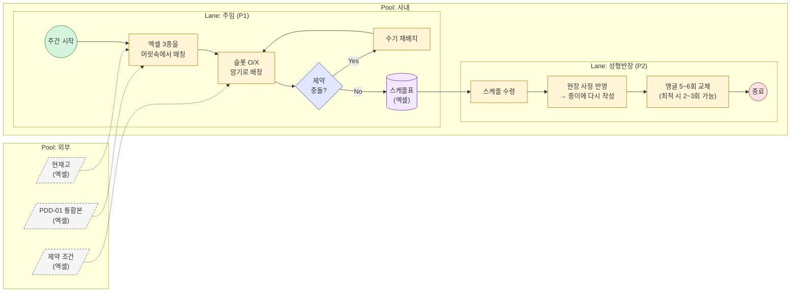
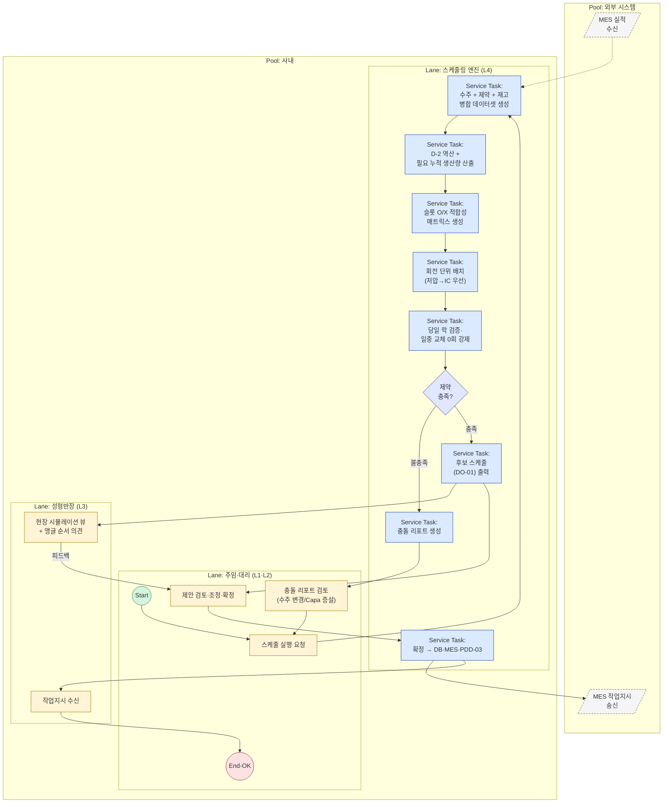

# PDD-02 — 성형(가류) 공정 스케줄링 (Vulcanization Scheduling)

> 공정 스케줄링 시스템 — Phase 2 / 3개 핵심 프로세스 중 2번
> 작성일: 2026-05-14 | 상위 문서: `Phase 1/3.Analysis/12.problem_statement_master.md`
> 본 PDD는 **ISO/IEC/IEEE 12207:2008** Purpose–Outcomes–Activities 골격과 **OMG BPMN 2.0 Descriptive Conformance** 표기를 동시 준수한다.

---

## 1. Process Identification

| 항목 | 값 |
|------|-----|
| Process ID | `PDD-02-v1.1` |
| Process Name | 성형(가류) 공정 스케줄링 / Vulcanization Process Scheduling |
| Version | v1.1 |
| Owner | 생산관리팀 (Process Owner: 김정훈 주임 / 현장 검증: 이수진 반장) |
| 12207 Mapping | `§6.4.9 Operation` — 핵심 운영 프로세스 |
| Conformance Class | BPMN 2.0 Descriptive Process Modeling Sub-Class |
| Status | Draft v1.1 |
| Created / Updated | 2026-05-14 / 2026-05-15 |
| 우선순위 근거 | 페르소나 P2·P4 GAP=4 (Key Person 리스크 해소·**일중 앵글 교체 0회 운영**), JTBD DOS=4.0 (제약 자동 검증) |
| 상류 의존 | `PDD-01` (통합 수주 마스터 DO-01) |
| 하류 영향 | `PDD-03` (성형 투입일 → 압출 완료 기한 역산) |

---

## 2. Purpose

> The purpose of the **Vulcanization Scheduling** process is to **generate a constraint-validated, rotation-based daily production schedule** that assigns each ordered part to a specific machine (저압 4대 / IC 1대), slot position (8 slots / 6 slots), and angle, such that **all hard constraints (slot O/X compatibility, left/right slot side, angle availability, machine-instance pinning, hose-spec angle cap) are satisfied**, **no angle change occurs within a single business day** (angle changes are allowed only at end-of-day after the night shift's last rotation), and **completion is achieved by D-2 of the delivery date** while honoring target inventory levels. When daily required volume exceeds capacity, the system raises a priority-based supplemental request; when it falls short, the system fills the gap by referencing KD orders (수주정보 통합 후 활성).

본 프로세스는 **15년차 이수진 반장의 머릿속 노하우**(슬롯 적합성·앵글 순서)와 **7년차 김정훈 주임의 제약 암기**를 시스템 검증 로직으로 전환한다. 결과적으로 (a) **주임 부재 시 대리(P4 최민혁)도 제약 위반 없이** 스케줄을 수립할 수 있고, (b) **현장이 받자마자 다시 짜는 일**을 없앤다.

---

## 3. Outcomes

본 프로세스가 성공적으로 수행되면 다음의 결과가 **관찰·검증 가능**하다.

a) **제약 적합한 일일 가류 스케줄**이 생성된다 — 모든 (제품, 가류기, 슬롯) 할당이 O/X 매트릭스를 위반하지 않는다.
b) **회전수 기반의 정량 생산량**이 산출된다 — 시간이 아닌 회전수(주간 8회 + 야간 10회 = 18회/일·대) 단위로 계획된다.
c) **일중 앵글 교체가 0회**가 된다 — 당일 생산계획에 투입된 품번은 주간~야간 마지막 회전까지 동일 앵글로 연속 운전되며, 교체는 일말 작업 종료 후(다음 영업일 개시 전)에만 발생한다.
c-2) **품번별 특수 제약이 자동 적용**된다 — `28422-08HA0`(LP 전용·LP-01 단일 셋팅), `28422-2M800`(저압 우측 전용·앵글 ≤2), `28421-2M800`(저압 좌측 전용·앵글 ≤2), `규격<7` 품번(가류기당 앵글 ≤4)이 후보 생성 단계에서 강제된다.
c-3) **capa 초과/부족이 자동 처리**된다 — 초과 시 품번별 우선순위 마스터를 근거로 추가 요청이 사용자에게 제시되고, 부족 시 KD 발주량을 참조해 부족분이 자동 보충된다 (KD/우선순위 입력은 수주정보 통합 작업 완료 후 활성).
d) **납기 D-2 완료 원칙**이 보장된다 — 납기일 기준 2일 전까지 누적 생산량이 (수주량 + 목표재고 - 현재고)를 충족한다.
e) **저압/IC 가류기 capacity 사용률**이 균형 잡힌다 — 저압 4대 × 8슬롯 = 32슬롯·회전, IC 1대 × 6슬롯 = 6슬롯·회전의 가용 한도를 초과하지 않는다.
f) **시스템 제안 + 사용자 확정** 모델을 따른다 — 시스템은 후보 스케줄을 제안하고, 최종 확정은 사용자가 수행한다.
g) **수주 변경(PDD-01)이 발생하면** 영향받는 스케줄 행이 식별되고 재계산 후보가 제시된다.
h) **확정된 스케줄은 PDD-03(압출)에 즉시 전달**되어 압출 완료 기한(D-3) 역산이 트리거된다.

---

## 4. Scope & Context

### 4.1 트리거 (Triggering Event)

| 트리거 유형 | 설명 | 빈도 |
|----------|------|------|
| 정기 트리거 (Timer) | 매주 월요일 — 다음 1주일 분 스케줄 수립 | 주 1회 |
| 이벤트 트리거 (Message) | PDD-01에서 변경 알림(`DO-03`) 수신 → 영향 범위 재계산 | 수시 |
| 이벤트 트리거 (Message) | MES 실적 입력으로 누적 생산량 갱신 → 잔여 스케줄 조정 | 일 단위 |

### 4.2 시작 / 종료 조건

| 구분 | 조건 |
|------|------|
| **Start** | 통합 수주 마스터(`DO-01`)에 D-2 이내 미완료 수주 행 존재 |
| **End (Normal)** | 사용자가 일일·회전 단위 스케줄을 **확정** + PDD-03에 전달 완료 |
| **End (Exception)** | 제약 충족 불가능(over-capacity, 슬롯 적합성 0) → 사용자에게 충돌 리포트 제시 |

### 4.3 인접 프로세스 인터페이스

| 인접 프로세스 | 방향 | 교환 데이터 |
|------------|:---:|-----------|
| `PDD-01` 수주 통합 | ← 수신 | 통합 수주 마스터 `DO-01`, 변경 알림 `DO-03` |
| (외부) 제약 마스터 (성형) | ← 참조 | 성형공정_제약조건.xlsx (품번별 슬롯 O/X·**좌측셋팅(K열)·우측셋팅(L열)**·합금형·앵글) |
| (외부) 제약 마스터 (압출) | ← 참조 | 압출공정_제약조건.xlsx **B열 `규격`** (BR-V18 판정용) |
| (외부) MES | ← 수신 | 일일 누적 실적 (이전 회전 완료 수량) |
| (외부) 현재고 마스터 | ← 참조 | 품번별 현재고·목표재고 |
| `PDD-03` 압출 스케줄링 | → 송신 | 확정 성형 투입 일정 (압출 완료 기한 = 성형 투입 D-1) |
| (외부) MES | → 송신 | 작업지시 (가류기·슬롯·회전번호·품번·수량) |

---

## 5. Participants & Roles (BPMN Lanes)

| Lane | 역할 | 시스템 / 도구 | 책임 (RACI) |
|------|------|-------------|-----------|
| L1 | **생산관리 주임** (P1 김정훈) | 스케줄링 UI (간트·매트릭스 뷰) | **A** — 최종 확정 승인 |
| L2 | **생산관리 대리** (P4 최민혁) | 스케줄링 UI | **R** — 일상 운영, 시스템 제안 검토·조정 |
| L3 | **성형 현장반장** (P2 이수진) | UI 조회 + 현장 피드백 채널 | **C** — 현장 적합성 검증, 순서 조정 의견 |
| L4 | **스케줄링 엔진** (시스템) | Service Tasks · 제약 검증기 · 최적화기 | **R** — 후보 스케줄 자동 생성, 제약 검증 |
| L5 | **MES** (외부 시스템, 별도 Pool) | API / DB 연동 | **I** — 작업지시 수신, 실적 송신 |

> BPMN 2.0 §9.4 준수: MES는 외부 시스템이므로 **별도 Pool**, Message Flow로 연동. 사내 L1~L4는 단일 Pool 내 Sequence Flow.

---

## 6. Inputs / Outputs (Data Objects)

### 6.1 Inputs

| Data Object | 출처 | 형식 | 빈도 | 비고 |
|------------|------|------|------|------|
| `DI-01` 통합 수주 마스터 | PDD-01 `DO-01` | DB View | 실시간 | (품번, 납기, 수량, 수주유형) |
| `DI-02` 제약 마스터 (성형) | 성형공정_제약조건.xlsx | DB Table | 마스터 변경 시 | 품번별 슬롯 O/X, 합금형, 앵글당금형수, 앵글보유수량 |
| `DI-03` 현재고 / 목표재고 | 재고 시스템 | DB View | 일 1회 | 품번별 |
| `DI-04` 가류기 설정 | 시스템 마스터 | JSON | 변경 시 | 저압 4대(8슬롯), IC 1대(6슬롯), 회전수(주8/야10) |
| `DI-05` 일일 실적 | MES | API | 매 회전 종료 시 | 가류기·슬롯·회전·실 생산수량 |
| `DI-06` 변경 알림 | PDD-01 `DO-03` | 이벤트 | 변경 발생 시 | 영향 품번·일자 |
| `DI-07` 품목별 우선순위 마스터 | PDD-01 (수주정보 통합 단계) | DB Table | 마스터 변경 시 | 품번·우선순위 등급 — capa 초과 시 추가요청 분기 키 (수주통합 완료 후 활성) |
| `DI-08` KD 발주 잔량 | PDD-01 (수주정보 통합 단계) | DB View | 일 1회 | 품번·KD 잔량 — capa 부족 시 보충 후보 (수주통합 완료 후 활성) |
| `DI-09` 압출 제약 마스터 | 압출공정_제약조건.xlsx | DB View | 마스터 변경 시 | 품번별 `규격`(B열) — 가류기당 앵글 상한 판정 (BR-V18) |

### 6.2 Outputs

| Data Object | 수신처 | 형식 | 빈도 | 비고 |
|------------|--------|------|------|------|
| `DO-01` 후보 스케줄 (시스템 제안) | L2 UI | DB Table + 간트뷰 | Import/변경 시 | 사용자 검토 대기 상태 |
| `DO-02` 확정 스케줄 | PDD-03, MES, UI | DB Table | 사용자 확정 시 | (날짜·회전·가류기·슬롯·품번·수량·앵글ID) |
| `DO-03` 제약 위반 리포트 | L2 UI | UI 모달 + 로그 | 검증 실패 시 | 위반 유형·원인·대안 |
| `DO-04` 앵글 교체 계획 | L3 (현장반장) | 회전별 변동 요약 | 일 단위 | 교체 시점·앵글ID·소요 회전 |
| `DO-05` 작업지시 | MES (별도 Pool) | API Message | 회전 단위 | 가류기·슬롯·품번·수량 |
| `DO-06` 스케줄 변경 이력 | 감사·분석 | Audit Table | 모든 확정/조정 시 | who·when·what (이전→이후) |

---

## 7. BPMN Diagram

> Descriptive Conformance: Task / Sub-Process / Start·End Event / Exclusive·Parallel·Inclusive Gateway / Sequence Flow / Message Flow / Data Object.

### 7.1 As-Is — 현행 수작업 흐름

**As-Is의 문제점:**
- 주임 부재 시 대리는 제약 암기 불가 → IC/저압 혼동 (INT-4 증언)
- 사무실 작성 스케줄 → 현장이 다시 작성 (INT-2: *"15년 해왔으니까 머리가 더 빨라"*)
- 앵글 교체 5~6회/일 (최적 2~3회 가능, 1회당 1회전분 손실 = 가용량 5~10% 손실)

---

### 7.2 To-Be — 시스템 도입 후 흐름

**To-Be의 개선 포인트:**
- 제약 검증이 Gateway G_VAL로 강제 → 부재자도 실수 없음
- 현장반장 시뮬레이션 뷰 → 사무실-현장 괴리 해소
- **당일 락(일중 교체 0회) 자동 강제** → 회전 손실 0 + 현장 운영 단순화

> 정식 BPMN 파일: `/diagrams/PDD-02.bpmn` (Camunda Modeler, 추후 작성)

---

## 8. Activities and Tasks

### A1. 입력 통합 (Aggregate Inputs)

| Task ID | BPMN Node | Task 기술 | 수행 주체 | 산출물 |
|---------|-----------|----------|---------|--------|
| T1.1 | `T1` | The system **shall** fetch the current Order Master (`DI-01`) filtered by delivery date within the planning horizon (다음 7일). | L4 | 수주 부분집합 |
| T1.2 | `T1` | The system **shall** join each order row with constraint master (`DI-02`) by 품번 (key: `HOSE`). | L4 | 수주 × 제약 join |
| T1.3 | `T1` | The system **shall** subtract current inventory (`DI-03`) and add target inventory to derive **net required quantity** per 품번. | L4 | `Q_net` 산출 |

### A2. 납기 역산 및 누적 목표 계산 (Backward Plan)

| Task ID | BPMN Node | Task 기술 | 수행 주체 | 산출물 |
|---------|-----------|----------|---------|--------|
| T2.1 | `T2` | The system **shall** compute the **vulcanization completion deadline** as `납기일 - 2일 (D-2)`. | L4 | 품번별 완료기한 |
| T2.2 | `T2` | The system **shall** compute `Q_required = Q_net + Q_target_stock - Q_current_stock` for each 품번. | L4 | Q_required |
| T2.3 | `T2` | The system **shall** distribute `Q_required` over available rotations from today to D-2, prioritizing earliest deliveries first. | L4 | 회전별 목표량 |

### A3. 슬롯 적합성 매트릭스 (Slot Compatibility Matrix)

| Task ID | BPMN Node | Task 기술 | 수행 주체 | 산출물 |
|---------|-----------|----------|---------|--------|
| T3.1 | `T3` | The system **shall** build a (품번 × 가류기유형 × 슬롯위치) compatibility matrix from columns G/H/I/J (저압 상·중상·중하·하) and M/N/O (IC 상·중·하). | L4 | 4×품번 + 3×품번 슬롯 매트릭스 |
| T3.2 | `T3` | The system **shall** mark a 품번 as **unschedulable** if all O/X cells are `x` for both machine types (e.g., 7X375-H0020, 28415-08400). | L4 | 예외 품번 리스트 |
| T3.3 | `T3` | The system **shall** route 품번s eligible for both 저압 and IC to **저압 first**, then fall back to IC only when 저압 slots are saturated. | L4 | 라우팅 우선순위 |

### A4. 회전 단위 배치 (Rotation-Based Assignment)

| Task ID | BPMN Node | Task 기술 | 수행 주체 | 산출물 |
|---------|-----------|----------|---------|--------|
| T4.1 | `T4` | The system **shall** treat each day as **18 rotations / machine** (주간 8 + 야간 10), giving a total daily capacity of `4 × 18 = 72` 저압-rotations + `1 × 18 = 18` IC-rotations. | L4 | 일일 가용 capa |
| T4.2 | `T4` | The system **shall** compute **per-rotation yield** for each (품번, slot) = `합금형(D) × 앵글당금형수(E or K)`. | L4 | 단위 생산량 |
| T4.3 | `T4` | The system **shall** assign 품번 to specific (가류기 인스턴스, 슬롯, 회전번호) tuples such that the total slot-rotations used equals `Q_required / yield`. | L4 | 1차 배치안 |
| T4.4 | `T4` | The system **shall** enforce: a single slot may host only **one angle at a time**, and slots within one rotation may carry **different 품번s simultaneously**. | L4 | 슬롯 점유 제약 |
| T4.5 | `T4` | The system **shall** check **angle availability**: `total slots assigned to 품번 ≤ 앵글보유수량 (F or N)`. | L4 | 앵글 capa 검증 |
| T4.6 | `T4` | The system **shall** enforce **품번별 슬롯 좌/우 제약** using master columns K(좌측셋팅)·L(우측셋팅): a 품번 with `K=o, L=x` may occupy only left-side slots; `K=x, L=o` only right-side; `K=o, L=o` either side. | L4 | 좌/우 검증 |
| T4.7 | `T4` | The system **shall** enforce **품번별 호기 단일 셋팅**: `28422-08HA0` is restricted to LP only and may occupy at most **1 slot total on machine LP-01** (no other LP machine, no concurrent multi-slot). | L4 | 호기·수량 제약 |
| T4.8 | `T4` | The system **shall** enforce **품번별 앵글 상한**: `28422-2M800` and `28421-2M800` may concurrently occupy at most **2 slots** each (좌/우 제약과 결합). | L4 | 품번별 상한 |
| T4.9 | `T4` | The system **shall** enforce **규격<7 가류기당 앵글 상한**: any 품번 whose extrusion-master `규격`(B열) value < 7 may not exceed **4 concurrent angles per machine instance** (저압 LP-01~LP-04 each, IC). 근거: 4앵글 초과 시 금형온도 하락→호싱불량률 상승. | L4 | 가류기당 상한 |
| T4.10 | `T4` | If `Σ Q_required > daily_capa`, the system **shall** split assignments into (a) capa 내 자동 채택분 + (b) **추가 요청 큐** ordered by `PRODUCT_PRIORITY`(`DI-07`), and present (b) to the user for explicit approval/rejection. (수주통합 후 활성) | L4 → L1/L2 | 추가요청 큐 |
| T4.11 | `T4` | If `Σ Q_required < daily_capa`, the system **shall** consume KD 발주 잔량(`DI-08`) to backfill the gap, prioritizing (i) same hose_id KD 잔량 → (ii) same setting-group KD 잔량. (수주통합 후 활성) | L4 | 보충 배치안 |

### A5. 당일 락 운영 (Intra-Day Angle Lock)

> **정책 변경 (v1.1)**: 기존 "앵글 교체 최소화"에서 **"일중 교체 0회 + 일말 일괄 교체"**로 전면 전환. 운영 단순화·회전 손실 0 확보.

| Task ID | BPMN Node | Task 기술 | 수행 주체 | 산출물 |
|---------|-----------|----------|---------|--------|
| T5.1 | `T5` | The system **shall** lock each (machine, slot, angle) tuple for the entire business day once it appears in the day's plan: from rotation 1 (주간 시작) through rotation 18 (야간 종료) the angle must not change. | L4 | 당일 락 검증 |
| T5.2 | `T5` | Angle changes are **permitted only at end-of-day** (after rotation 18) and must complete before the next business day's rotation 1. | L4 | 일말 교체 계획 |
| T5.3 | `T5` | The system **shall reject** candidate schedules that would require an intra-day angle change on any (machine, slot). User override requires reason text per REQ-FUNC-CO-010 + audit. | L4 | 위반 차단 |
| T5.4 | `T5` | The system **shall** emit `DO-04` 앵글 교체 계획 keyed by **business-day boundary** (이전일 종료 → 다음일 개시 사이) instead of intra-day rotation indices. | L4 | DO-04 출력 형식 변경 |

### A6. 제약 검증 및 충돌 처리 (Validate & Handle Conflicts)

| Task ID | BPMN Node | Task 기술 | 수행 주체 | 산출물 |
|---------|-----------|----------|---------|--------|
| T6.1 | `G_VAL` | The system **shall** validate that the candidate schedule satisfies ALL of: slot O/X, angle availability, daily capacity, D-2 deadline. | L4 | pass/fail |
| T6.2 | `T6` | If validation fails, the system **shall** produce a conflict report (`DO-03`) categorizing failures by type and proposing remediations (e.g., 야간 회전 추가, 납기 협상, IC 라우팅 전환). | L4 | 충돌 리포트 |
| T6.3 | `U2` | The user **shall** review the conflict report and choose: (a) override with manual adjustment, (b) defer to next planning cycle, (c) escalate to operations meeting. | L1 / L2 | 의사결정 로그 |

### A7. 현장 시뮬레이션 및 확정 (Floor Simulation & Commit)

| Task ID | BPMN Node | Task 기술 | 수행 주체 | 산출물 |
|---------|-----------|----------|---------|--------|
| T7.1 | `T7` | The system **shall** publish the candidate schedule (`DO-01`) to the floor simulation view for L3. | L4 | 시뮬레이션 뷰 |
| T7.2 | `R1` | The floor supervisor (P2) **may** propose reordering of rotations (e.g., to optimize angle sequence) without changing total assignments. | L3 | 조정 요청 |
| T7.3 | `U3` | The planner **shall** review feedback and either accept or reject — final approval rests with L1. | L1 / L2 | 확정 의사결정 |
| T7.4 | `T8` | The system **shall** commit the confirmed schedule (`DO-02`), write audit log (`DO-06`), and emit downstream events. | L4 | 확정 스케줄 + 이력 |

### A8. 하류 전달 (Propagate Downstream)

| Task ID | BPMN Node | Task 기술 | 수행 주체 | 산출물 |
|---------|-----------|----------|---------|--------|
| T8.1 | `T8` → `MES_OUT` | The system **shall** send work orders (`DO-05`) to MES per rotation (가류기·슬롯·품번·수량). | L4 → L5 | MES 작업지시 |
| T8.2 | `T8` | The system **shall** forward the confirmed 성형 투입 일정 to PDD-03 for extrusion deadline computation (성형 투입 D-1). | L4 | PDD-03 트리거 |
| T8.3 | `T8` → `R2` | The system **shall** push the confirmed daily plan (`DO-02` + `DO-04` 앵글 교체 계획) to the floor view. | L4 → L3 | 현장 작업지시 |

### A9. 변경·실적 기반 재계산 (Replan on Change)

| Task ID | BPMN Node | Task 기술 | 수행 주체 | 산출물 |
|---------|-----------|----------|---------|--------|
| T9.1 | (이벤트) | On receipt of `DI-06` (PDD-01 변경 알림), the system **shall** identify schedule rows affected by changed 품번/납기. | L4 | 영향 행 리스트 |
| T9.2 | (이벤트) | On receipt of `DI-05` (MES 실적), the system **shall** update cumulative completion and re-derive remaining `Q_required`. | L4 | 잔여 목표 갱신 |
| T9.3 | (이벤트) | If deviation > threshold (예: 잔여량이 가용 capa 초과), the system **shall** re-invoke A2–A6 partial replanning and notify L2. | L4 | 재계획 트리거 |

---

## 9. Business Rules & Gateways

| Gateway / Rule | 유형 | 조건식 | 기본 경로 / 적용 | 비고 |
|---------------|:----:|--------|----------------|------|
| `G_VAL` | Exclusive (X) | `slot_OX_ok ∧ side_LR_ok ∧ angle_capa_ok ∧ machine_pin_ok ∧ hose_angle_cap_ok ∧ spec_lt7_ok ∧ intraday_lock_ok ∧ daily_capa_ok ∧ D-2_met` | 불충족 → T6 충돌 리포트 | 핵심 검증 게이트 (v1.1: 좌/우·호기·앵글상한·당일락 추가) |
| (라우팅 선택) | Inclusive (O) | `eligible_저압 ∨ eligible_IC` | 둘 다 가능 시 저압 우선 | T3.3 |
| (capa 분기) | Exclusive (X) | `Σ Q_required vs daily_capa` | 초과 → T4.10 우선순위 큐 / 부족 → T4.11 KD 보충 | v1.1 신규 |

### 추가 비즈니스 룰

| Rule ID | 룰 | 적용 위치 | 출처 |
|---------|-----|----------|------|
| BR-V01 | 슬롯-품번 적합성: 해당 슬롯의 O/X 셀이 `o`인 경우에만 배치 가능 | T3, T4 | 성형공정_제약조건.xlsx G~J, M~O 컬럼 |
| BR-V02 | 한 슬롯 = 한 앵글 = 한 품번/회전; 한 회전 내에서 슬롯 간에는 다른 품번 혼재 가능 | T4.4 | 클로드_성형_프롬프트.docx |
| BR-V03 | 회전당 생산량 = 합금형(D) × 앵글당금형수(E or K) | T4.2 | 클로드_성형_프롬프트.docx |
| BR-V04 | 일일 회전수 = 주간 8 + 야간 10 = 18 / 가류기 | T4.1 | 클로드_성형_프롬프트.docx |
| BR-V05 | 저압 4대, IC 1대 — 저압 총 8슬롯/대 = 32, IC 총 6슬롯/대 = 6 | T4.1 | 클로드_성형_프롬프트.docx |
| BR-V06 | 앵글 보유수량(F=저압, N=IC)을 동시에 점유하는 슬롯 수가 초과하면 안 됨 | T4.5 | 클로드_성형_프롬프트.docx |
| BR-V07 | **(v1.1 재정의)** 당일 생산계획에 투입된 (가류기, 슬롯, 품번)은 주간 회전1~야간 회전18까지 동일 앵글로 연속 운전한다. 앵글 교체는 **일말(rotation 18 종료) 이후~다음 영업일 rotation 1 개시 이전**에만 허용한다. 일중 교체는 hard 제약 위반으로 차단(사용자 override 시 사유+audit 필수). | T5.1, T5.3 | 2026-05-15 정책 변경 (이전: "교체 시 1회전 손실 페널티") |
| BR-V08 | 저압/IC 둘 다 가능 품번은 저압 슬롯이 포화될 때까지 저압 우선 배정 | T3.3 | 현장 운영 관행 |
| BR-V09 | 납기 D-2 완료가 가장 강한 hard 제약. 충돌 시 다른 비-납기 품번 조정으로 해소 시도 | T6 | 마스터 문제정의서 §3 |
| BR-V10 | 시스템은 후보를 제안할 뿐, 최종 확정은 항상 사용자 승인 후 | T7.3, T7.4 | JTBD 발견: "제안 vs 확정 분리" |
| BR-V11 | 모든 (품번, 가류기, 슬롯) 슬롯 적합성 매트릭스가 `x`인 품번은 사전 예외 처리 | T3.2 | 데이터 검증 결과 |
| **BR-V12** | **(신규 v1.1)** capa 초과 시 (`Σ Q_required > daily_capa`) 시스템은 `PRODUCT_PRIORITY` 마스터에 따라 (a) capa 내 자동 채택분 + (b) 추가 요청 큐로 분리하여 사용자에게 추가 요청을 제시한다. 우선순위 데이터는 수주정보 통합 작업 완료 후 활성. | T4.10 | 2026-05-15 신규 요건 |
| **BR-V13** | **(신규 v1.1)** capa 부족 시 (`Σ Q_required < daily_capa`) 시스템은 KD 발주 잔량(`KD_ORDER`)을 우선 참조하여 부족분을 채운다. 보충 우선순위: (i) 동일 hose_id KD 잔량 → (ii) 동일 셋팅 그룹 KD 잔량. 수주정보 통합 작업 완료 후 활성. | T4.11 | 2026-05-15 신규 요건 |
| **BR-V14** | **(신규 v1.1)** `28422-08HA0`은 저압 가류기에서만 생산 가능하며 동시에 **LP-01 가류기 1개 슬롯에만** 셋팅 가능. 다른 LP 호기·동시 다중 슬롯 배정은 차단. | T4.7 | 2026-05-15 신규 요건 |
| **BR-V15** | **(신규 v1.1)** `28422-2M800`은 저압 가류기 **우측(L열=`o`)에만** 배정 가능. 동시 점유 슬롯 ≤ 2 (앵글 보유수량 제약과 별개의 품번단위 상한). | T4.6, T4.8 | 2026-05-15 신규 요건 + 마스터 K/L열 신설 |
| **BR-V16** | **(신규 v1.1)** `28421-2M800`은 저압 가류기 **좌측(K열=`o`)에만** 배정 가능. 동시 점유 슬롯 ≤ 2. | T4.6, T4.8 | 2026-05-15 신규 요건 + 마스터 K/L열 신설 |
| **BR-V17** | **(신규 v1.1)** 압출 제약 마스터(`EX_CONSTRAINT.규격`, B열) 값 `< 7`인 품번은 1대 가류기당 **동시 앵글 점유 ≤ 4**. 근거: 4앵글 초과 시 금형온도 하락 → 호싱불량률 상승. | T4.9 | 2026-05-15 신규 요건 — 압출 마스터 cross-reference |

---

## 10. KPIs / Acceptance Criteria & Traceability

### 10.1 프로세스 KPI

| KPI ID | 측정 지표 | As-Is | To-Be 목표 | 측정 방법 | 측정 주기 |
|--------|---------|:-----:|:---------:|----------|----------|
| K-V01 | 제약 위반 사전 차단율 | 측정 불가 | **≥95%** | 사전 차단 위반수 / (차단 + 사후 발견) | 월 |
| K-V02 | **일중(rotation 1~18) 앵글 교체 발생 슬롯 비율** | 측정 필요 | **0%** (일중 교체 0건; 일말 교체만 허용) | DO-04 + 회전 단위 audit | 주 |
| K-V03 | 주임 부재 시 스케줄 수립 가능 여부 | **불가** | **가능** (대리 단독) | P4가 시스템만으로 확정한 주의 비율 | 월 |
| K-V04 | 납기 D-2 충족률 | 측정 필요 | **≥98%** | 실제 완료일 vs 계획 | 주 |
| K-V05 | 현장 재배치 횟수 (반장이 다시 짜는 빈도) | 일상적 | **0회** | L3 피드백·간담회 | 월 |
| K-V06 | 저압/IC 가류기 가용 회전 사용률 | 측정 필요 | **저압 80% / IC 70%** | 사용 회전 / 가용 회전 | 주 |

### 10.2 Acceptance Criteria (Outcome ↔ 검증)

- [ ] **a) 제약 적합** — 회귀 테스트 100건의 (품번, 슬롯) 배치 중 슬롯 O/X 위반 0
- [ ] **b) 회전수 기반** — 모든 스케줄 출력에 `(date, rotation_no ∈ 1..18, machine, slot)` 키 포함
- [ ] **c) 일중 앵글 교체 0** — 회귀 1주 호라이즌의 모든 (machine, slot, business-day) 튜플에서 일중 교체 이벤트 0건
- [ ] **c-2) 품번별 특수 제약** — `28422-08HA0`(LP-01·1슬롯), `28422-2M800`(우측·≤2), `28421-2M800`(좌측·≤2), 규격<7(가류기당 ≤4) 위반 0건
- [ ] **c-3) capa 분기** — 초과 시 우선순위 큐 100% 생성, 부족 시 KD 보충 100% 시도 (수주통합 후 검증 활성)
- [ ] **d) D-2 완료** — 시뮬레이션에서 모든 납기의 D-2까지 누적 생산량 ≥ Q_required
- [ ] **e) capacity 균형** — 일일 저압 회전 사용 ≤ 72, IC ≤ 18
- [ ] **f) 사용자 확정** — DO-02 커밋은 사용자 명시 승인 없이 불가 (BR-V10 단위 테스트)
- [ ] **g) 변경 대응** — PDD-01 변경 시뮬레이션 100건에서 영향 행 식별 정확도 100%
- [ ] **h) 하류 전달** — 확정 후 1초 이내 PDD-03·MES에 이벤트 도달

### 10.3 Traceability Matrix

| Outcome | 근거 (Phase 1 산출물) | 관련 페르소나 | 향후 SRS 항목 (잠정) |
|--------|-------------------|-------------|-------------------|
| a) 제약 적합 | `12.problem_statement_master.md §4 단절 2`, INT-4 IC/저압 혼동 사건 | P4 | SRS-FR-VC-001~010 |
| b) 회전수 기반 | `4.problem_statement.md §2.3`, 클로드_성형_프롬프트 | P1, P2 | SRS-FR-VC-020 |
| c) 일중 앵글 교체 0 (당일 락) | 2026-05-15 정책 변경 (운영 단순화·회전 손실 0) | P1, P2 | SRS-FR-VC-030 (재정의), VC-021 (신규) |
| c-2) 품번별 특수 제약 | 2026-05-15 신규 요건 + 마스터 K/L열 신설 | P1, P4 | SRS-FR-VC-024~027 (신규) |
| c-3) capa 분기 (우선순위/KD) | 2026-05-15 신규 요건 (수주통합 의존) | P1, P4 | SRS-FR-VC-022~023 (신규, deferred) |
| d) D-2 완료 | `12.problem_statement_master.md §3.1 김정훈 증언` | P1 | SRS-FR-VC-040 |
| e) capacity 균형 | 클로드_성형_프롬프트.docx (4대/1대) | P1 | SRS-FR-VC-050 |
| f) 사용자 확정 | `10.jtbd_interview_results.md "제안 vs 확정 분리" 발견` | P1, P4 | SRS-FR-VC-060 |
| g) 변경 대응 | PDD-01 DO-03 알림 연계 | P1, P3 | SRS-FR-VC-070 |
| h) 하류 전달 | PDD-03 (압출) 트리거 요건 | P3 | SRS-FR-VC-080 |

---

## 11. Risks & Exceptions

| Risk ID | 리스크 | 확률 | 영향 | 대응 |
|---------|-------|:----:|:----:|------|
| R-V01 | 제약 마스터(슬롯 O/X) 데이터 부정확 | 중 | 🔴 | 도입 전 현장 검증, 변경 시 dual-review |
| R-V02 | 회전당 생산량 수식의 현장 괴리 | 중 | 🟡 | 초기 2~4주 실적 vs 계획 비교 후 보정 계수 도입 |
| R-V03 | 당일 락 정책으로 인한 capa 경직화 (소량 다품종 처리 어려움) | 중 | 🟡 | L3 시뮬레이션 뷰에서 사전 검증, capa 부족 시 KD 보충(BR-V13)·초과 시 우선순위 큐(BR-V12)로 흡수 |
| R-V08 | `28422-08HA0`의 LP-01 단일 셋팅으로 해당 호기 고장 시 단절 | 저 | 🔴 | 호기 가용성 마스터 + 강제 변경 모드, 외주 fallback 사전 정의 |
| R-V09 | 마스터 K/L(좌/우)·압출 B(규격) 컬럼 정합성 미관리 시 신규 제약 무력화 | 중 | 🔴 | dual-review(BR-X05) 적용, 정기 마스터 무결성 회귀 |
| R-V04 | 저압/IC 둘 다 가능한 품번의 라우팅 정책 분쟁 | 중 | 🟡 | BR-V08 운영 룰을 사용자 설정 가능 옵션으로 노출 |
| R-V05 | "현장이 더 빨라" 저항 (INT-2) | 중 | 🔴 | L3 시뮬레이션 뷰 + 1개월 엑셀 병행 운영 + 점진 채택 |
| R-V06 | 슬롯 적합성 0인 품번(예: 7X375-H0020)에 대한 운영 누락 | 중 | 🟡 | T3.2 예외 리스트를 별도 알림으로 노출, 외주·재고 대응 권고 |
| R-V07 | MES 실적 지연으로 누적량 부정확 → 잘못된 잔여 추정 | 중 | 🟡 | 실적 미수신 시 직전 회전 계획값으로 임시 카운트, 동기화 후 보정 |

### Exception Flow

- **E-V01 슬롯·앵글 capa 불가**: G_VAL 실패 → T6 충돌 리포트 → 사용자 의사결정 (야간 추가 / 납기 협상 / IC 라우팅)
- **E-V02 슬롯 O/X 전부 x**: T3.2 → 사전 예외 리스트로 분류, 본 프로세스 외부에서 처리 (외주·재고)
- **E-V03 변경량 폭증으로 재계산 발산**: T9.3 → 사용자에게 임팩트 요약 후 점진 확정 모드로 전환

---

## 12. Revision History

| Version | Date | Author | Change |
|---------|------|--------|--------|
| v1.0 | 2026-05-14 | (작성자) | 초안 작성 — 마스터 문제정의서 v2.0 + 실 데이터(성형공정_제약조건.xlsx, 클로드_성형_프롬프트.docx) 반영 |
| v1.1 | 2026-05-15 | (작성자) | **성형 스케줄링 제약조건 추가/개정** — (1) BR-V07 정책 전환: "교체 최소화 + 페널티" → **"당일 락 + 일말 일괄 교체"** (T5 재정의, K-V02·AC c) 갱신, EXP-3 영향). (2) BR-V12 신규: capa 초과 시 `PRODUCT_PRIORITY` 기반 추가요청 큐 (수주통합 후 활성). (3) BR-V13 신규: capa 부족 시 KD 발주량 보충 (수주통합 후 활성). (4) BR-V14 신규: `28422-08HA0` LP 전용·LP-01 단일 셋팅. (5) BR-V15 신규: `28422-2M800` 우측 전용·앵글 ≤2. (6) BR-V16 신규: `28421-2M800` 좌측 전용·앵글 ≤2. (7) BR-V17 신규: 압출 마스터 `규격<7` 품번은 가류기당 앵글 ≤4 (호싱불량 방지). 마스터 데이터: 성형공정_제약조건.xlsx에 K(좌측셋팅)·L(우측셋팅) 컬럼 신설 반영, 압출공정_제약조건.xlsx B(규격) cross-reference 추가. 신규 입력 DI-07/08/09 추가. 리스크 R-V03 재정의 + R-V08·R-V09 신규 |

---

## 참조 문서

| 표준 / 문서 | 적용 부분 |
|------------|----------|
| ISO/IEC/IEEE 12207:2008 §5.2.3, §6.4.9 | Purpose/Outcomes 패턴, Operation 프로세스 |
| OMG BPMN 2.0 §10.3~10.8 | Lane·Task·Gateway·DataObject 표기 |
| `Phase 1/2.Raw Materials/Vulcanization/성형공정_제약조건.xlsx` | 슬롯 O/X · **K(좌측셋팅)·L(우측셋팅, v1.1 신설)** · 합금형 · 앵글 데이터 원본 |
| `Phase 1/2.Raw Materials/Vulcanization/클로드_성형_프롬프트.docx` | 회전수·교대·라우팅 규칙 (v1.1: 앵글 교체 페널티 모델은 폐기 — BR-V07 재정의 참조) |
| `Phase 1/2.Raw Materials/Extrusion/압출공정_제약조건.xlsx` | **B열 `규격`** — BR-V17 (가류기당 앵글 ≤4) 판정용 cross-reference |
| `Phase 1/3.Analysis/12.problem_statement_master.md` | 마스터 문제정의 (Why) |
| `Phase 1/3.Analysis/10.jtbd_interview_results.md` | DOS, "제안 vs 확정 분리" 발견 |
| `Phase 1/3.Analysis/7.persona_pain_goal_analysis.md` | P2·P4 GAP 우선순위 |
| `Phase 2/1.PDD/1.process_order_consolidation.md` | 상류 PDD (수주 입력원) |
