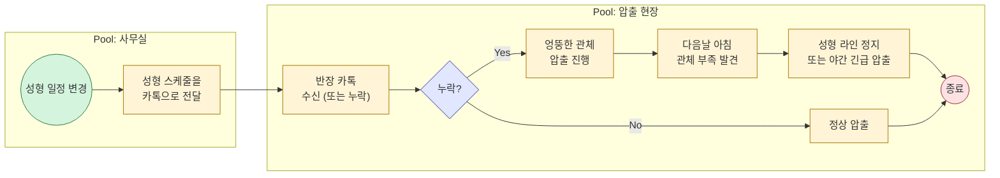
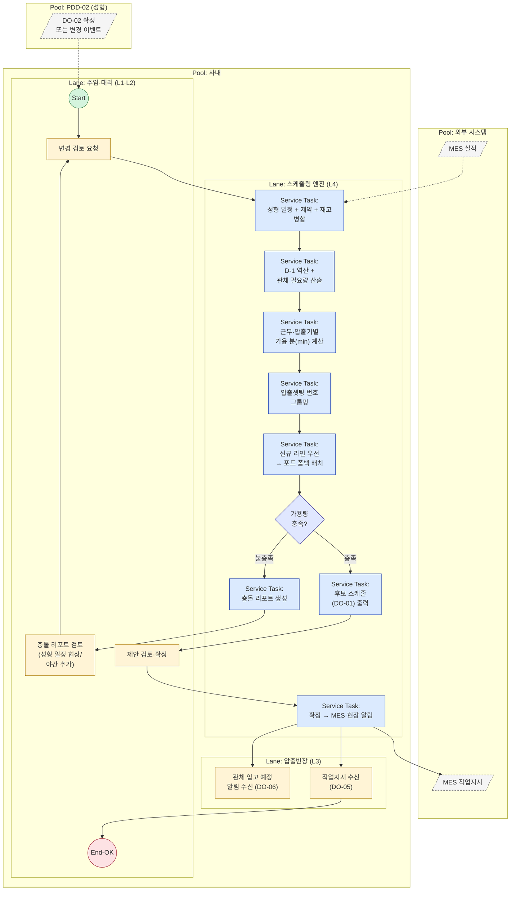

# PDD-03 — 압출 공정 스케줄링 (Extrusion Scheduling)

> 공정 스케줄링 시스템 — Phase 2 / 3개 핵심 프로세스 중 3번 (마지막)
> 작성일: 2026-05-14 | 상위 문서: `Phase 1/3.Analysis/12.problem_statement_master.md`
> 본 PDD는 **ISO/IEC/IEEE 12207:2008** Purpose–Outcomes–Activities 골격과 **OMG BPMN 2.0 Descriptive Conformance** 표기를 동시 준수한다.

---

## 1. Process Identification

| 항목 | 값 |
|------|-----|
| Process ID | `PDD-03-v1.0` |
| Process Name | 압출 공정 스케줄링 / Extrusion Process Scheduling |
| Version | v1.0 |
| Owner | 생산관리팀 (Process Owner: 김정훈 주임 / 현장 검증: 박도영 반장) |
| 12207 Mapping | `§6.4.9 Operation` — 운영성 프로세스 (PDD-02 종속) |
| Conformance Class | BPMN 2.0 Descriptive Process Modeling Sub-Class |
| Status | Draft v1.0 |
| Created / Updated | 2026-05-14 / 2026-05-14 |
| 우선순위 근거 | 페르소나 P3 GAP=4 (성형 변경 구두 전달·관체 부족 월 3건), JTBD DOS=4.0 (성형→압출 자동 역산) |
| 상류 의존 | `PDD-02` (확정 성형 투입 일정 `DO-02`) |
| 하류 영향 | MES (작업지시), 성형 라인(관체 공급) |

---

## 2. Purpose

> The purpose of the **Extrusion Scheduling** process is to **generate a shift-based daily extrusion plan** that guarantees the required quantity of each 관체(tube) is **completed by D-1 of its vulcanization input date**, by allocating production to two extruders (신규 / 포드) and four work shifts (주간 전반·후반 / 야간 전반·후반), while **minimizing equipment setup changes** by grouping parts that share the same 압출셋팅 number.

본 프로세스는 박도영 반장이 *"다음날 아침에야 성형 변경을 알게 되는"* 단절을 끊는다. 성형 스케줄(PDD-02)이 확정되거나 변경되는 순간, 압출 계획이 자동으로 역산·재계산되어 관체 과부족(월 3건)을 0으로 만든다.

---

## 3. Outcomes

본 프로세스가 성공적으로 수행되면 다음의 결과가 **관찰·검증 가능**하다.

a) **성형 투입 D-1 완료 원칙**이 보장된다 — 모든 관체의 압출 완료일이 성형 투입일의 1일 전이다.
b) **수량 충족이 보장**된다 — 일·근무·압출기별 생산량 합이 (성형 소요량 + 목표재고 - 현재고)를 충족한다.
c) **압출속도·재단길이·근무시간·효율 75%** 기반 정량 생산량이 산출된다.
d) **압출셋팅 번호 그룹핑**으로 동일 근무 내 셋업이 0회가 된다 — 같은 셋팅 번호는 셋업 없이 동시 생산.
e) **신규 라인 우선 배정** 룰이 강제된다 — 신규 가능 품번은 신규에 우선 배정, 잔여는 포드.
f) **주 5일 운영**이 강제된다 — 토·일은 가용 회전에서 제외.
g) **PDD-02 변경이 발생하면** 영향받는 압출 행이 식별되고 재계산 후보가 제시된다.
h) **시스템 제안 + 사용자 확정** 모델을 따른다 — 시스템은 후보를 만들고, 최종은 사용자가 확정한다.

---

## 4. Scope & Context

### 4.1 트리거 (Triggering Event)

| 트리거 유형 | 설명 | 빈도 |
|----------|------|------|
| 이벤트 트리거 (Message) | PDD-02 성형 스케줄 확정 시점 | 주 1회 + 수시 |
| 이벤트 트리거 (Message) | PDD-02 변경 알림 (성형 투입일·수량 변동) | 수시 |
| 이벤트 트리거 (Message) | MES 실적 입력 → 잔여 압출 필요량 재계산 | 근무 종료 시 |

### 4.2 시작 / 종료 조건

| 구분 | 조건 |
|------|------|
| **Start** | PDD-02 `DO-02` 확정 + 압출 미충족 관체 1건 이상 존재 |
| **End (Normal)** | 사용자가 (일·근무·압출기)별 압출 계획 확정 + MES 작업지시 송신 |
| **End (Exception)** | 가용 근무시간 ×효율로 필요 수량 달성 불가 → 충돌 리포트 (성형 일정 협상 필요) |

### 4.3 인접 프로세스 인터페이스

| 인접 프로세스 | 방향 | 교환 데이터 |
|------------|:---:|-----------|
| `PDD-02` 성형 스케줄링 | ← 수신 | 확정 성형 투입 일정 (품번·일자·수량) |
| (외부) 제약 마스터 | ← 참조 | 압출공정_제약조건.xlsx (압출셋팅·속도·길이·라인) |
| (외부) MES | ← 수신 | 압출 실적 (근무·압출기 단위) |
| (외부) 현재고 마스터 | ← 참조 | 관체별 현재고·목표재고 |
| (외부) MES | → 송신 | 작업지시 (압출기·근무·품번·수량) |
| (외부) 성형 현장 | → 송신 | 관체 입고 예정 통지 (PDD-02 라인용) |

---

## 5. Participants & Roles (BPMN Lanes)

| Lane | 역할 | 시스템 / 도구 | 책임 (RACI) |
|------|------|-------------|-----------|
| L1 | **생산관리 주임** (P1 김정훈) | 스케줄링 UI | **A** — 최종 확정 승인 |
| L2 | **생산관리 대리** (P4 최민혁) | 스케줄링 UI | **R** — 시스템 제안 검토·조정 |
| L3 | **압출 현장반장** (P3 박도영) | UI 조회 + 알림 수신 | **R** — 현장 실행, 변경 즉시 인지 |
| L4 | **스케줄링 엔진** (시스템) | Service Tasks · 역산 계산기 · 셋팅 그룹핑 | **R** — 자동 역산, 셋업 최소화 배치 |
| L5 | **MES** (외부, 별도 Pool) | API | **I** — 작업지시 수신, 실적 송신 |

> BPMN 2.0 §9.4: MES는 별도 Pool, Message Flow 연동. PDD-02도 사내이지만 별도 프로세스이므로 **본 PDD 내에서는 별도 Pool**로 표현 가능 (또는 단일 사내 Pool 안에 별도 Lane).

---

## 6. Inputs / Outputs (Data Objects)

### 6.1 Inputs

| Data Object | 출처 | 형식 | 빈도 | 비고 |
|------------|------|------|------|------|
| `DI-01` 확정 성형 투입 일정 | PDD-02 `DO-02` | DB View | 확정 시 | (품번, 성형 투입일, 수량) |
| `DI-02` 제약 마스터 (압출) | 압출공정_제약조건.xlsx | DB Table | 마스터 변경 시 | 압출셋팅·속도·헤드핀·합금형·재단길이·라인 |
| `DI-03` 근무 정의 | 시스템 마스터 | JSON | 변경 시 | 주간전반 4h / 주간후반 4h / 야간전반 4.5h / 야간후반 5h |
| `DI-04` 효율 계수 | 시스템 마스터 | 상수 | — | **75%** (전 라인 공통) |
| `DI-05` 라인 정의 | 시스템 마스터 | JSON | — | 신규·포드 2라인 |
| `DI-06` 관체 현재고/목표재고 | 재고 시스템 | DB View | 일 1회 | 품번별 |
| `DI-07` 압출 실적 | MES | API | 매 근무 종료 시 | 압출기·근무·실 생산수 |
| `DI-08` 성형 변경 알림 | PDD-02 변경 이벤트 | 이벤트 | 변경 시 | 영향 품번·일자 |

### 6.2 Outputs

| Data Object | 수신처 | 형식 | 빈도 | 비고 |
|------------|--------|------|------|------|
| `DO-01` 후보 압출 스케줄 | L2 UI | DB Table + 일자/근무 매트릭스 뷰 | 트리거 시 | 검토 대기 |
| `DO-02` 확정 압출 스케줄 | MES, 성형 현장, UI | DB Table | 사용자 확정 시 | 시트명 `*월*일(압출)` 표기 규칙 준수 |
| `DO-03` 충돌 리포트 | L2 UI | UI 모달 + 로그 | 검증 실패 시 | 가용량 부족·셋팅 충돌 |
| `DO-04` 압출 요약 시트 | L1, L3 | UI 요약 + Export | 확정 시 | 일자×근무×압출기 매트릭스 |
| `DO-05` MES 작업지시 | MES | API Message | 근무 단위 | 압출기·근무·품번·수량 |
| `DO-06` 관체 입고 예정 통지 | L3 (압출반장) + 성형 현장 | 시스템 알림 | 확정 시 | 일자·관체·수량 |
| `DO-07` 변경 이력 | 감사·분석 | Audit Table | 모든 확정/조정 시 | who·when·what |

---

## 7. BPMN Diagram

### 7.1 As-Is — 현행 수작업 흐름

**As-Is의 문제:** INT-3 *"이번 달만 관체 부족이 3번"* — 모두 성형 변경 누락이 원인.

---

### 7.2 To-Be — 시스템 도입 후 흐름

**To-Be 핵심 개선:**
- PDD-02 변경이 Message Flow로 즉시 전파 → 카톡 누락 0
- D-1 자동 역산 → 사람이 계산할 필요 없음
- 셋팅 그룹핑 자동화 → 근무 내 셋업 0회

> 정식 BPMN 파일: `/diagrams/PDD-03.bpmn` (Camunda Modeler, 추후 작성)

---

## 8. Activities and Tasks

### A1. 입력 통합 (Aggregate Inputs)

| Task ID | BPMN Node | Task 기술 | 수행 주체 | 산출물 |
|---------|-----------|----------|---------|--------|
| T1.1 | `T1` | The system **shall** fetch confirmed vulcanization input dates (`DI-01`) per 품번. | L4 | 성형 투입 일정 |
| T1.2 | `T1` | The system **shall** join each row with extrusion constraint master (`DI-02`) by 품번 key. | L4 | 수주 × 제약 join |
| T1.3 | `T1` | The system **shall** subtract 관체 현재고 and add 목표재고 (`DI-06`) to derive **net extrusion required quantity** `Q_ext`. | L4 | Q_ext |

### A2. D-1 역산 및 마감 산출 (Backward Plan, D-1)

| Task ID | BPMN Node | Task 기술 | 수행 주체 | 산출물 |
|---------|-----------|----------|---------|--------|
| T2.1 | `T2` | The system **shall** compute **extrusion completion deadline** = `성형 투입일 - 1일`. | L4 | 품번별 압출 완료일 |
| T2.2 | `T2` | The system **shall** exclude Saturdays and Sundays from the available calendar (월~금 5일 운영). | L4 | 가용일 리스트 |
| T2.3 | `T2` | The system **shall** distribute `Q_ext` across available days from today (or last completed) up to the deadline, prioritizing earliest deadlines first (FIFO by deadline). | L4 | 일별 목표량 |

### A3. 근무·압출기별 가용량 계산 (Compute Shift Capacity)

| Task ID | BPMN Node | Task 기술 | 수행 주체 | 산출물 |
|---------|-----------|----------|---------|--------|
| T3.1 | `T3` | The system **shall** model 4 work shifts per day: 주간 전반 4h / 주간 후반 4h / 야간 전반 4.5h / 야간 후반 5h (`DI-03`). | L4 | shift 정의 |
| T3.2 | `T3` | The system **shall** apply equipment efficiency **75%** (`DI-04`): effective minutes per shift = `shift_hours × 60 × 0.75`. | L4 | 유효 가동 분 |
| T3.3 | `T3` | The system **shall** compute per-product yield per shift = `(압출속도 m/min × effective_minutes × 1000mm/m) / 재단길이mm`, rounded down to integer pieces. | L4 | 품번×shift 단위 yield |
| T3.4 | `T3` | The system **shall** treat each (day, shift, 압출기) tuple as an independent capacity bucket; **no setup changes are allowed within a shift**. | L4 | capacity bucket 모델 |

### A4. 압출셋팅 그룹핑 (Setting-Number Grouping)

| Task ID | BPMN Node | Task 기술 | 수행 주체 | 산출물 |
|---------|-----------|----------|---------|--------|
| T4.1 | `T4` | The system **shall** group 품번s sharing the same 압출셋팅 number (1~8) — these can be produced concurrently within one shift without setup. | L4 | 셋팅 그룹 |
| T4.2 | `T4` | The system **shall** plan each shift around a **single setting group**, switching groups only across shift boundaries. | L4 | 그룹별 shift 후보 |
| T4.3 | `T4` | The system **should** order shifts within a day to minimize total setting transitions (예: 같은 그룹을 연속 shift에 배치). | L4 | 순서 최적화 |

### A5. 라인 라우팅 (신규 우선 → 포드 폴백)

| Task ID | BPMN Node | Task 기술 | 수행 주체 | 산출물 |
|---------|-----------|----------|---------|--------|
| T5.1 | `T5` | The system **shall** route 품번s eligible for both lines (`DI-02` 신규=O AND 포드=O) to **신규 first**. | L4 | 신규 우선 배정 |
| T5.2 | `T5` | The system **shall** route 품번s only eligible for 포드 to 포드 unconditionally. | L4 | 포드 강제 배정 |
| T5.3 | `T5` | When 신규 capacity is saturated, the system **shall** spill eligible 품번s back to 포드. | L4 | 폴백 처리 |
| T5.4 | `T5` | The system **shall** maintain **line-level capacity accounting** per (day, shift, line). | L4 | 라인 capa 사용 현황 |

### A6. 제약 검증 및 충돌 처리 (Validate & Handle Conflicts)

| Task ID | BPMN Node | Task 기술 | 수행 주체 | 산출물 |
|---------|-----------|----------|---------|--------|
| T6.1 | `G_VAL` | The system **shall** validate that cumulative production by each deadline ≥ Q_ext, and no shift exceeds capacity. | L4 | pass/fail |
| T6.2 | `T6` | If validation fails, the system **shall** generate a conflict report (`DO-03`) suggesting remediations: (a) earlier kickoff date, (b) 야간 후반 우선 활용, (c) PDD-02 성형 투입일 협상. | L4 | 충돌 리포트 |
| T6.3 | `U2` | The user **shall** review and choose remediation, or escalate. | L1 / L2 | 의사결정 |

### A7. 후보 출력 · 확정 (Publish Candidate & Commit)

| Task ID | BPMN Node | Task 기술 | 수행 주체 | 산출물 |
|---------|-----------|----------|---------|--------|
| T7.1 | `T7` | The system **shall** publish the candidate schedule (`DO-01`) as a (date × shift × 압출기) matrix view. | L4 | 매트릭스 뷰 |
| T7.2 | `U3` | The planner **shall** review and either approve, reject, or manually adjust assignments. | L1 / L2 | 확정 의사결정 |
| T7.3 | `T8` | The system **shall** commit confirmed schedule (`DO-02`), generate the summary sheet (`DO-04`), and write audit log (`DO-07`). | L4 | 확정 + 이력 |
| T7.4 | `T8` | The summary sheet **shall** follow the naming rule `*월*일(압출)`, matching the existing 성형 sheet name pattern `*월*일(성형)`. | L4 | 명명 규칙 준수 |

### A8. 하류 전달 (Propagate Downstream)

| Task ID | BPMN Node | Task 기술 | 수행 주체 | 산출물 |
|---------|-----------|----------|---------|--------|
| T8.1 | `T8` → `MES_OUT` | The system **shall** send work orders (`DO-05`) to MES per shift (압출기·근무·품번·수량). | L4 → L5 | MES 작업지시 |
| T8.2 | `T8` → `R1` | The system **shall** notify L3 of expected tube delivery dates (`DO-06`) to give the floor early visibility. | L4 → L3 | 입고 예정 통지 |
| T8.3 | `T8` → `R2` | The system **shall** push the daily work instruction to the floor view. | L4 → L3 | 작업지시 |

### A9. 변경·실적 기반 재계산 (Replan on Change)

| Task ID | BPMN Node | Task 기술 | 수행 주체 | 산출물 |
|---------|-----------|----------|---------|--------|
| T9.1 | (이벤트) | On receipt of `DI-08` (PDD-02 변경), the system **shall** identify affected extrusion rows and trigger partial replanning (A2~A6). | L4 | 영향 행·재계획 |
| T9.2 | (이벤트) | On receipt of `DI-07` (MES 압출 실적), the system **shall** update cumulative completion and re-derive remaining `Q_ext`. | L4 | 잔여 갱신 |
| T9.3 | (이벤트) | If a deadline becomes infeasible due to actuals, the system **shall** raise an alert to L1·L2 and offer the standard remediations. | L4 | 위험 알림 |

---

## 9. Business Rules & Gateways

| Gateway / Rule | 유형 | 조건식 | 기본 경로 / 적용 | 비고 |
|---------------|:----:|--------|----------------|------|
| `G_VAL` | Exclusive (X) | `∀p: Σ produce(p, d) ≥ Q_ext(p) by deadline(p) ∧ shift_capa_ok` | 불충족 → T6 충돌 | 핵심 검증 |
| (라인 라우팅) | Exclusive (X) | `신규=O ∧ 포드=O` | 신규 우선 (T5.1) | 라우팅 분기 |

### 추가 비즈니스 룰

| Rule ID | 룰 | 적용 위치 | 출처 |
|---------|-----|----------|------|
| BR-E01 | 압출 완료일 = 성형 투입일 - 1일 (D-1) | T2.1 | 클로드_압출_프롬프트.docx |
| BR-E02 | 가용일은 월~금만, 토·일 제외 | T2.2 | 클로드_압출_프롬프트.docx |
| BR-E03 | 4 shift / 일 — 주간 전반 4h, 후반 4h, 야간 전반 4.5h, 후반 5h | T3.1 | 클로드_압출_프롬프트.docx |
| BR-E04 | 압출 효율 = 75% (전 라인 공통, 모든 shift 동일) | T3.2 | 클로드_압출_프롬프트.docx |
| BR-E05 | 단위 생산량(개) = `floor(압출속도 m/min × shift_min × 0.75 × 1000 / 재단길이 mm)` | T3.3 | 클로드_압출_프롬프트.docx |
| BR-E06 | 같은 shift 내에서는 신규 셋업 금지 — 셋팅 변경은 shift 경계에서만 | T3.4 | 클로드_압출_프롬프트.docx |
| BR-E07 | 같은 압출셋팅 번호(1~8)는 셋업 없이 동시 생산 가능 | T4.1 | 클로드_압출_프롬프트.docx |
| BR-E08 | 신규/포드 둘 다 가능한 품번은 **신규 우선**, 포화 시 포드로 폴백 | T5.1, T5.3 | 클로드_압출_프롬프트.docx |
| BR-E09 | 출력 시트 명명 규칙: `*월*일(압출)` (성형은 `*월*일(성형)`) | T7.4 | 클로드_압출_프롬프트.docx |
| BR-E10 | 시스템은 후보를 제안할 뿐, 최종 확정은 사용자 승인 필수 | T7.2 | JTBD 발견: "제안 vs 확정 분리" |
| BR-E11 | PDD-02가 변경되면 본 프로세스는 자동으로 트리거 — 수동 카톡 전달 금지 | T9.1 | 마스터 문제정의서 §3 단절 3 |

### 계산 예시 (BR-E05 검증)

> 품번 `29673-2R060`: 압출속도 4.5 m/min, 재단길이 320 mm, 주간 전반(4h)
> 효과 가동 = 4h × 60 × 0.75 = **180 min**
> 길이 = 4.5 × 180 = **810 m** = 810,000 mm
> 개수 = `floor(810,000 / 320)` = **2,531개**
> ✅ 원본 docx 예시와 일치 → BR-E05 정합성 확인

---

## 10. KPIs / Acceptance Criteria & Traceability

### 10.1 프로세스 KPI

| KPI ID | 측정 지표 | As-Is | To-Be 목표 | 측정 방법 | 측정 주기 |
|--------|---------|:-----:|:---------:|----------|----------|
| K-E01 | 월간 관체 부족 발생 횟수 | **3건** | **0건** | DO-06 vs 실제 입고 매칭 | 월 |
| K-E02 | 성형 변경 → 압출 반영 지연 | **~24h** | **즉시 (<1분)** | DI-08 수신시각 - DO-02 갱신시각 | 월 |
| K-E03 | shift 내 셋업 발생 횟수 | 측정 필요 | **0회** | 동일 shift 내 다른 셋팅 번호 동시 점유 카운트 | 주 |
| K-E04 | 신규 라인 활용률 | 측정 필요 | **>90%** | 신규 자격 품번 중 신규에 배정된 비율 | 월 |
| K-E05 | D-1 마감 준수율 | 측정 필요 | **≥98%** | 실제 완료일 ≤ 성형 투입 D-1 | 주 |
| K-E06 | 라인 가용 시간 사용률 | 측정 필요 | **신규 80% / 포드 75%** | 사용 분 / 가용 분 (효율 75% 적용 후) | 주 |

### 10.2 Acceptance Criteria (Outcome ↔ 검증)

- [ ] **a) D-1 완료** — 시뮬레이션 100건에서 모든 관체의 압출 완료일 ≤ 성형 투입 D-1
- [ ] **b) 수량 충족** — 누적 yield ≥ Q_ext per 품번 (단위 테스트)
- [ ] **c) 생산량 수식** — `29673-2R060` 주간 전반 = 2,531개 예시 일치 (BR-E05 회귀 테스트)
- [ ] **d) 셋팅 그룹핑** — 회귀 데이터셋에서 shift 내 셋업 0회
- [ ] **e) 신규 우선** — 신규 자격 품번이 신규 슬랏 잔여 시 포드로 새는 케이스 0건
- [ ] **f) 주 5일** — 가용 캘린더에 토·일 미포함 (회귀 테스트)
- [ ] **g) 변경 대응** — DI-08 수신 100건에서 영향 행 식별 정확도 100%
- [ ] **h) 확정 게이트** — 사용자 명시 승인 없이 DO-02 커밋 불가 (BR-E10 단위 테스트)

### 10.3 Traceability Matrix

| Outcome | 근거 (Phase 1 산출물) | 관련 페르소나 | 향후 SRS 항목 (잠정) |
|--------|-------------------|-------------|-------------------|
| a) D-1 완료 | `12.problem_statement_master.md §6 As-Is, INT-3 증언` | P3, P1 | SRS-FR-EX-001 |
| b) 수량 충족 | `4.problem_statement.md §2.4` | P1 | SRS-FR-EX-010 |
| c) 생산량 수식 | 클로드_압출_프롬프트.docx 예시 | P1, P3 | SRS-FR-EX-020 |
| d) 셋팅 그룹핑 | 클로드_압출_프롬프트.docx | P3 | SRS-FR-EX-030 |
| e) 신규 우선 | 클로드_압출_프롬프트.docx | P3 | SRS-FR-EX-040 |
| f) 주 5일 | 클로드_압출_프롬프트.docx | P1 | SRS-FR-EX-050 |
| g) 변경 대응 | `10.jtbd_interview_results.md DOS=4.0 (Outcome #2 성형→압출 자동 역산)` | P3 | SRS-FR-EX-060 |
| h) 확정 게이트 | `10.jtbd_interview_results.md "제안 vs 확정 분리"` | P1, P4 | SRS-FR-EX-070 |

---

## 11. Risks & Exceptions

| Risk ID | 리스크 | 확률 | 영향 | 대응 |
|---------|-------|:----:|:----:|------|
| R-E01 | 효율 75%가 실제와 괴리 | 중 | 🟡 | 도입 후 4주 실적 vs 계획 비교 → 라인·shift별 보정 계수 도입 |
| R-E02 | 압출셋팅 그룹이 실제로 셋업 없이 가능하지 않은 경우 | 저 | 🔴 | 현장 사전 검증, 그룹 정의는 변경 가능한 룰셋으로 운영 |
| R-E03 | 신규/포드 라인 가동 중단(고장) | 중 | 🟡 | 라인 가용성 마스터 + 임시 변경 모드 (사용자 강제 라인 변경 허용) |
| R-E04 | PDD-02 변경 폭증으로 압출 재계산 발산 | 중 | 🟡 | 변경 통합 배치(N분 간격 묶음 재계산) + 영향도 임계치 |
| R-E05 | 재단길이 단위 혼선(mm vs m) | 저 | 🔴 | 입력 검증 + 단위 명시(mm) + 회귀 테스트(예: 320 mm) |
| R-E06 | 박도영 반장의 시스템 회피(과거 카톡 의존) | 중 | 🟡 | DO-06 입고 예정 통지로 가시성 제공, 1개월 카톡 병행 운영 |

### Exception Flow

- **E-E01 가용량 부족**: G_VAL 실패 → T6 충돌 리포트 → 사용자 선택 (야간 후반 활용 / 성형 투입일 협상 / 잔여 외주)
- **E-E02 라인 고장 통보 (Operational Event)**: 라인 가용성 0으로 마스터 갱신 → A5 재라우팅 자동 발동
- **E-E03 단위 변환 검증 실패**: T3.3 → 사용자에게 마스터 데이터 검증 요청, 본 사이클 보류

---

## 12. Revision History

| Version | Date | Author | Change |
|---------|------|--------|--------|
| v1.0 | 2026-05-14 | (작성자) | 초안 작성 — 마스터 문제정의서 v2.0 + 압출공정_제약조건.xlsx + 클로드_압출_프롬포트.docx 반영 |

---

## 참조 문서

| 표준 / 문서 | 적용 부분 |
|------------|----------|
| ISO/IEC/IEEE 12207:2008 §5.2.3, §6.4.9 | Purpose/Outcomes 패턴, Operation 프로세스 |
| OMG BPMN 2.0 §10.3~10.8 | Lane·Task·Gateway·DataObject 표기 |
| `Phase 1/2.Raw Materials/Extrusion/압출공정_제약조건.xlsx` | 압출셋팅·속도·재단길이·라인 원본 |
| `Phase 1/2.Raw Materials/Extrusion/클로드_압출_프롬포트.docx` | 근무체계·효율 75%·셋팅 그룹·신규 우선·시트 명명 규칙 |
| `Phase 1/3.Analysis/12.problem_statement_master.md` | 마스터 문제정의 (Why) |
| `Phase 1/3.Analysis/10.jtbd_interview_results.md` | DOS=4.0, "제안 vs 확정 분리" 발견 |
| `Phase 1/3.Analysis/7.persona_pain_goal_analysis.md` | P3 GAP=4 우선순위 |
| `Phase 2/1.PDD/2.process_vulcanization_scheduling.md` | 상류 PDD (성형 투입일 입력원) |
