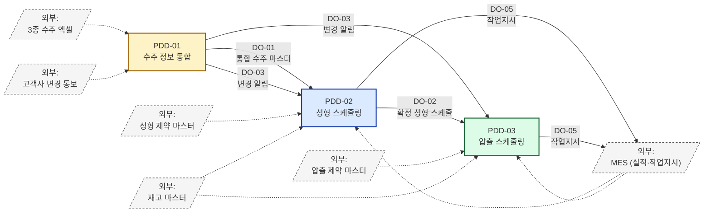
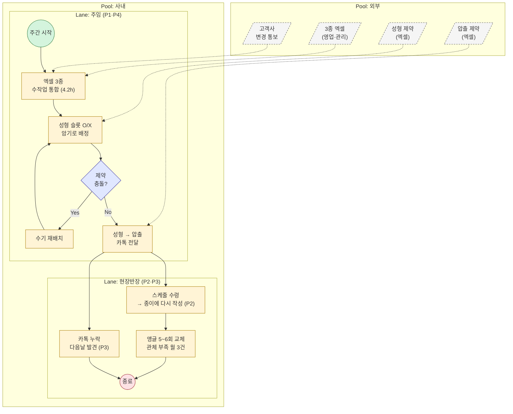
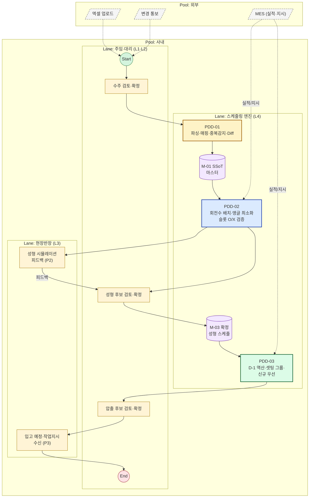
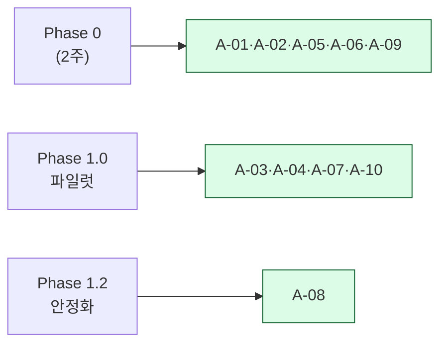
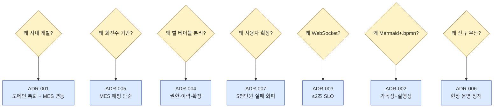
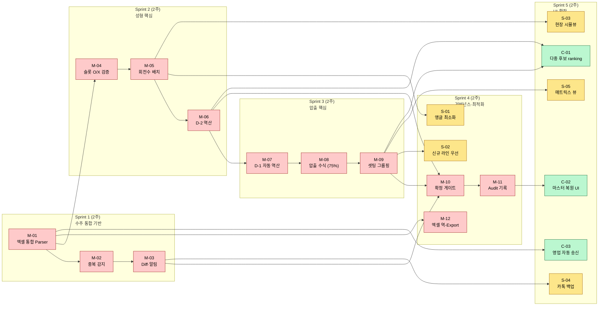
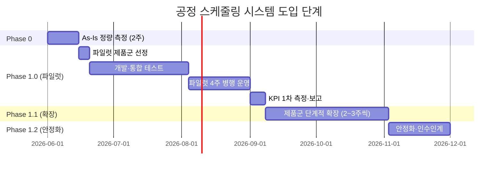

# PDD + PRD Master (Integrated) — 공정 스케줄링 시스템 통합 정의서

> Phase 2 / 1.PDD — 3개 핵심 프로세스 통합본 + PRD 요소
> 작성일: 2026-05-14 / 최종 갱신: 2026-05-15 (**v1.6**)
> 통합 기준: `PDD-01` (수주 통합) + `PDD-02` (성형) + `PDD-03` (압출)
> 본 문서는 **ISO/IEC/IEEE 12207:2008** Purpose–Outcomes–Activities 골격과 **OMG BPMN 2.0 Descriptive Conformance**를 준수하는 **PDD(프로세스 관점)**에, **PRD(제품/사용자 관점) — User Stories(G-W-T)·MoSCoW·NFR·Rollout·Proof**를 통합 수록한 **SRS·구현·테스트의 단일 기준 문서(Single Source of Truth)**이다.

---

## 0. 통합본 의의 — Why One Document

| 분산 PDD의 한계 | 통합본의 가치 |
|----------------|-------------|
| 3개 PDD에 중복된 공통 룰(BR-V10 = BR-E10 = "사용자 확정") | **한 곳에서 관리**되는 횡단 룰 (Cross-Process BR) |
| 데이터 객체가 PDD 간 흐를 때 송신·수신 양쪽에 중복 정의 | **하나의 데이터 사전**으로 흐름 추적 |
| KPI·Risk가 PDD마다 분산 → 경영 보고 시 재집계 필요 | **통합 KPI 대시보드** + **통합 리스크 레지스터** |
| 세 프로세스의 시간 의존(D-3 ← D-2 ← D-1 ← 납기일)이 보이지 않음 | **End-to-End 역산 다이어그램** 일목요연 |
| SRS 진입 시 FR(`OC/VC/EX-NNN`) 매핑이 3개 문서를 오감 | **통합 Traceability Matrix** |
| PDD만으로는 **사용자 가치 추적·MoSCoW·NFR·롤아웃**이 약함 | **PRD 요소 §16~§21 신설** — User Stories(G-W-T), MoSCoW, NFR, Differential Value, Rollout, Proof |

> 개별 PDD-01/02/03은 본 문서의 **상세 부록(Appendix)** 으로 유지된다. 본 통합본이 정본(Master), 개별 PDD는 참조 detail.

### 0.1 문서 구조 한눈에

| 부분 | 섹션 | 관점 |
|------|------|------|
| **A. 정체성** | §1 | 거버넌스·표준 매핑 |
| **B. 프로세스 (PDD)** | §2~§9 | 12207 + BPMN — "프로세스가 어떻게 흐르는가" + §4.5 **ERD** |
| **C. 측정 (KPI)** | §10~§11 | North Star + 검증 기준 |
| **D. 리스크** | §12 | 통합 리스크 레지스터 |
| **E. 추적** | §13 | Outcome → SRS-FR 매핑 |
| **F. 전제·결정** | §14~§15 | Assumptions(10개) + ADR(7건) — "왜 이렇게 설계했는가" |
| **G. 제품 (PRD)** | §16~§21 | User Stories·MoSCoW(+§17.5 의존성 DAG·Sprint 배분)·NFR·Rollout |
| **H. 요약** | §22 | **PRD-Cheatsheet 1페이지 압축** (경영진·신규 합류자용) |
| **I. 메타** | §23~§24 | 이력·참조 |

### 0.2 어떻게 읽을 것인가 (독자별 추천 경로)

| 독자 | 권장 경로 | 시간 |
|------|---------|------|
| **경영진·공장장** | §22 PRD-Cheatsheet → §10.0 북극성 → §19 Differential Value → §20 Rollout | 10~15분 |
| **신규 합류자** | §22 PRD-Cheatsheet → §0.1 구조 → §2 Architecture → 관심 PDD 본문 | 30분 |
| **SRS 작성자** | §0.1 → §1 → §4(특히 §4.5 ERD) → §16 → §17 → §18 → §6~§8 PDD 본문 → §13 Traceability | 2~3시간 |
| **개발자** | §6·§7·§8 PDD 본문 → §9 BR → §4 Data Dictionary → §4.5 ERD → §16 AC | 1~2시간 |
| **테스터·QA** | §11 Acceptance → §16 AC + §17 MoSCoW → §20.6 EXP 실험 → §18 NFR 임계치 | 1시간 |
| **현장 사용자(P1~P4)** | §16 본인 페르소나 US-NN → §22 PRD-Cheatsheet → §20 Rollout | 20분 |

---

## 1. Master Identification

| 항목 | 값 |
|------|-----|
| Master ID | `PDD-MASTER-v1.6` |
| Document Name | 공정 스케줄링 시스템 — 통합 프로세스 정의서 |
| Constituent PDDs | `PDD-01-v1.0`, `PDD-02-v1.1`, `PDD-03-v1.1` |
| 12207 Mapping | `§6.4 Technical Processes` — Stakeholder Requirements Definition (PDD-01) + Operation (PDD-02, PDD-03) |
| Conformance Class | BPMN 2.0 Descriptive Process Modeling Sub-Class |
| Status | Draft v1.6 (broken links 정정 — `_Opus` suffix 일관성) |
| Created / Updated | 2026-05-14 / 2026-05-14 |
| Master Owner | 생산관리팀 (김정훈 주임) |

---

## 2. End-to-End Architecture

### 2.1 시간 역산 (Backward Scheduling)

```
[D-7+]              [D-3 이전]      [D-2]           [D-1]           [D-Day]
수주 변경 발생    →  압출 시작    →  성형 완료    →  압출 완료(D-1)  →  납품
   ↓                 ↓               ↓               (성형 투입         (고객)
PDD-01            PDD-03         PDD-02           일자 - 1)
수주 통합·        압출 계획       성형 계획
변경 감지          (D-1)         (D-2)
```

### 2.2 프로세스 간 데이터 흐름



### 2.3 3개 프로세스 요약

| PDD | Process Name | Purpose (한 줄) | 핵심 기준 |
|-----|-------------|--------------|----------|
| **PDD-01** | 수주 정보 통합 | 3종 엑셀을 SSoT 마스터 + 변경 추적 가능 데이터로 변환 | 4.2h → 30분, 누락 0건 |
| **PDD-02** | 성형 스케줄링 | 회전수 기반 + 슬롯 O/X 검증 + 앵글 교체 최소화 | D-2 완료, 앵글 교체 ≤ 3회/일 |
| **PDD-03** | 압출 스케줄링 | shift 기반 + 셋팅 그룹핑 + 신규 우선 + 효율 75% | 성형 투입 D-1 완료, shift 내 셋업 0회 |

---

## 3. Unified Participants & Roles (RACI)

| Role / Lane | 페르소나 | PDD-01 | PDD-02 | PDD-03 | 시스템 / 도구 |
|------------|---------|:------:|:------:|:------:|-------------|
| 생산관리 주임 | P1 김정훈 (7년차) | **R / A** | **A** | **A** | UI |
| 생산관리 대리 | P4 최민혁 (3년차) | **R** | **R** | **R** | UI |
| 성형 현장반장 | P2 이수진 (15년차) | I | **C** | I | UI 조회 + 현장 피드백 |
| 압출 현장반장 | P3 박도영 (10년차) | I | I | **R** | UI 조회 + 작업지시 수신 |
| 영업·관리부서 | — | **C** (별도 Pool) | — | — | 엑셀 송신 (외부) |
| MES | (외부 시스템) | I (Phase 2) | I | I | API/DB 연동 |
| 스케줄링 엔진 | (시스템 L4) | **R** | **R** | **R** | Service Tasks |
| 공장장 | P11 강병철 | I (스폰서) | I (스폰서) | I (스폰서) | 대시보드 (Phase 2+) |

> R=Responsible, A=Accountable, C=Consulted, I=Informed

---

## 4. Unified Data Dictionary

### 4.1 외부 입력 (External Inputs)

| ID | 명칭 | 출처 | 형식 | 사용 PDD |
|----|------|------|------|:--------:|
| `EXT-01` | 월별 예상 발주량 / KD 발주 / 주간 발주 | 영업·관리부서 | `*.xlsx` × 3 종 | PDD-01 |
| `EXT-02` | 고객사 수주 변경 통보 | 고객사 | 메일/구두 → 엑셀 | PDD-01 |
| `EXT-03` | 성형 제약 마스터 | `성형공정_제약조건.xlsx` | DB Table | PDD-02 |
| `EXT-04` | 압출 제약 마스터 | `압출공정_제약조건.xlsx` | DB Table | PDD-03 |
| `EXT-05` | 현재고·목표재고 | 재고 시스템 | DB View | PDD-02, PDD-03 |
| `EXT-06` | MES 실적 | MES (외부) | API | PDD-02, PDD-03 |

### 4.2 프로세스 간 내부 데이터 객체 (Inter-Process)

| ID | 명칭 | 송신 PDD | 수신 PDD | 형식 | 비고 |
|----|------|:-------:|:-------:|------|------|
| `M-01` | 통합 수주 마스터 (SSoT) | PDD-01 (DO-01) | PDD-02 (DI-01), PDD-03 (간접) | DB Table + API | 모든 다운스트림의 진실원 |
| `M-02` | 변경 알림 (수주) | PDD-01 (DO-03) | PDD-02 (DI-06), PDD-03 (간접) | 이벤트 | Critical/일반 등급 |
| `M-03` | 확정 성형 스케줄 | PDD-02 (DO-02) | PDD-03 (DI-01) | DB Table | (품번, 성형 투입일, 수량) — D-1 역산 트리거 |
| `M-04` | 변경 알림 (성형) | PDD-02 (이벤트) | PDD-03 (DI-08) | 이벤트 | 성형 일정 변경 → 압출 재계산 |

### 4.3 외부 출력 (External Outputs)

| ID | 명칭 | 송신 PDD | 수신처 | 형식 |
|----|------|:--------:|--------|------|
| `OUT-01` | MES 작업지시 (성형) | PDD-02 | MES | API Message |
| `OUT-02` | MES 작업지시 (압출) | PDD-03 | MES | API Message |
| `OUT-03` | 관체 입고 예정 통지 | PDD-03 | 성형 현장 (PDD-02 라인) | 시스템 알림 |
| `OUT-04` | 역-Export 엑셀 | PDD-01 (요청 시) | L1, L2 | `*.xlsx` |
| `OUT-05` | 압출 요약 시트 `*월*일(압출)` | PDD-03 | L1, L3 | UI + Export |
| `OUT-06` | 성형 시뮬레이션 뷰 | PDD-02 | L3 (P2) | UI |

### 4.4 감사 / 이력 (Audit)

| ID | 명칭 | 송신 PDD | 보관 |
|----|------|:--------:|------|
| `AUD-01` | 수주 변경 이력 | PDD-01 (DO-05) | Audit Table |
| `AUD-02` | 성형 스케줄 변경 이력 | PDD-02 (DO-06) | Audit Table |
| `AUD-03` | 압출 스케줄 변경 이력 | PDD-03 (DO-07) | Audit Table |

### 4.5 ERD — 논리 데이터 모델

> SRS의 DB 설계 입력원. 도메인 제약(슬롯 O/X·합금형·앵글·압출셋팅·라인)을 1차 시각화 (Gemini 문서의 ERD를 도메인 데이터로 강화 흡수).

```mermaid
erDiagram
    PRODUCT ||--o{ ORDER : "수주됨"
    PRODUCT ||--|| VC_CONSTRAINT : "성형 제약"
    PRODUCT ||--|| EX_CONSTRAINT : "압출 제약"
    ORDER ||--o{ VC_SCHEDULE : "성형 계획 생성"
    VC_SCHEDULE ||--o{ EX_SCHEDULE : "D-1 역산 트리거"
    VC_MACHINE ||--o{ VC_SCHEDULE : "배치됨"
    EX_LINE ||--o{ EX_SCHEDULE : "배치됨"
    ORDER ||--o{ ORDER_CHANGE : "변경 이력"
    VC_SCHEDULE ||--o{ VC_AUDIT : "변경 이력"
    EX_SCHEDULE ||--o{ EX_AUDIT : "변경 이력"
    MES_ACTUAL }o--|| VC_SCHEDULE : "실적 매칭"
    MES_ACTUAL }o--|| EX_SCHEDULE : "실적 매칭"

    PRODUCT {
        string hose_id PK "제품 품번 (예: 29673-2F900)"
        string product_group "제품군 (호스 종류)"
        decimal nominal_diameter "호칭경 mm"
        int target_stock "목표 재고"
        int current_stock "현재고"
    }
    VC_CONSTRAINT {
        string hose_id FK
        int mold_qty "금형 총보유수량"
        int composite_count "합금형 1·2·3·6"
        int lp_molds_per_angle "저압 앵글당 금형수"
        int lp_angle_qty "저압 앵글 보유수량"
        bool lp_slot_top "저압 상단 O/X"
        bool lp_slot_upmid "저압 중상단 O/X"
        bool lp_slot_lowmid "저압 중하단 O/X"
        bool lp_slot_bot "저압 하단 O/X"
        int ic_molds_per_angle "IC 앵글당 금형수"
        int ic_angle_qty "IC 앵글 보유수량"
        bool ic_slot_top "IC 상단 O/X"
        bool ic_slot_mid "IC 중단 O/X"
        bool ic_slot_bot "IC 하단 O/X"
    }
    EX_CONSTRAINT {
        string hose_id FK
        decimal spec_inner_dia "내경 mm"
        decimal spec_thickness "두께 mm"
        int extrusion_setting "압출셋팅 1~8"
        decimal extrusion_speed "속도 m/min"
        string head_pin "헤드/핀 (예: 22*8)"
        decimal cut_length "재단길이 mm"
        bool eligible_pod "포드 라인 가능"
        bool eligible_new "신규 라인 가능"
    }
    ORDER {
        string order_id PK
        string hose_id FK
        date delivery_date "납기일"
        int qty "수량"
        string order_type "FORECAST·KD·WEEKLY·CONFIRMED"
        string customer "고객사"
        timestamp created_at
        timestamp last_modified
    }
    ORDER_CHANGE {
        string change_id PK
        string order_id FK
        timestamp changed_at
        string actor
        json before_after "필드별 before/after"
        string severity "Critical·Normal"
    }
    VC_MACHINE {
        string machine_id PK "LP-01·LP-02·LP-03·LP-04·IC-01"
        string machine_type "저압·IC"
        int total_slots "저압=8 / IC=6"
        int day_rotations "주간 회전 = 8"
        int night_rotations "야간 회전 = 10"
    }
    VC_SCHEDULE {
        string vc_schedule_id PK
        string hose_id FK
        string machine_id FK
        int slot_position "1~8 (저압) / 1~6 (IC)"
        date production_date
        int rotation_no "1~18"
        string angle_id "재활용 자원"
        int planned_qty
        string status "Candidate·Confirmed·Done"
    }
    EX_LINE {
        string line_id PK "POD·NEW"
        string line_name "포드·신규"
        decimal efficiency "0.75 고정"
    }
    EX_SCHEDULE {
        string ex_schedule_id PK
        string hose_id FK
        string line_id FK
        date production_date
        string shift "주전·주후·야전·야후"
        int planned_qty
        string vc_schedule_id_link FK
        string status "Candidate·Confirmed·Done"
    }
    VC_AUDIT {
        string audit_id PK
        string vc_schedule_id FK
        timestamp changed_at
        string actor
        json before_after
    }
    EX_AUDIT {
        string audit_id PK
        string ex_schedule_id FK
        timestamp changed_at
        string actor
        json before_after
    }
    MES_ACTUAL {
        string actual_id PK
        string schedule_ref "vc_schedule_id 또는 ex_schedule_id"
        timestamp completed_at
        int actual_qty
        string defect_note
    }
```

**ERD 설계 원칙:**
- `VC_CONSTRAINT` / `EX_CONSTRAINT`를 별 테이블로 분리 — 마스터 데이터 변경(BR-X05 dual-review) 권한·이력 추적 용이
- 슬롯 O/X·라인 자격은 **bool 컬럼**으로 1:1 — 향후 슬롯 수 변경 시 컬럼 추가 (스키마 진화 가능)
- `VC_SCHEDULE.rotation_no`(1~18)와 `EX_SCHEDULE.shift`(4종) — 회전수/shift 도메인 키
- `VC_SCHEDULE`↔`EX_SCHEDULE` 1:N — 한 성형 행이 여러 압출 행을 트리거 가능
- Audit는 스케줄 테이블별 분리 — 변경 인과 추적 단순화

---

## 5. Integrated BPMN Diagram

### 5.1 As-Is — End-to-End 현행



### 5.2 To-Be — End-to-End 목표



> 각 PDD 내부의 상세 BPMN(As-Is/To-Be)은 개별 PDD 문서의 §7 참조.

---

## 6. PDD-01 — 수주 정보 통합 (요약)

> 전체 상세: `1.process_order_consolidation_Opus.md`

### 6.1 Purpose
3종 파편화 엑셀(월별 예상 / KD / 주간)을 **버전 관리·변경 추적 가능한 단일 마스터 데이터셋(SSoT)** 으로 변환한다.

### 6.2 Outcomes
a) 통합 수주 마스터 DB 생성 (M-01)
b) 3종 엑셀의 상이한 컬럼 구조 → 표준 스키마 매핑
c) (품번 + 납기) 중복 0건
d) 이전 버전 대비 Diff 자동 식별
e) 영향받는 다운스트림(성형/압출 반장) 자동 알림
f) 수주 유형(예상/KD/주간/확정)과 변경 이력 시계열 추적
g) 원본 엑셀 포맷으로 역-Export 가능 (7년 수식 자산 보존)

### 6.3 핵심 Activities

| Activity | 핵심 Task |
|----------|----------|
| A1 수신·파싱 | 3종 자동 인식, 병합셀·다행 헤더·날짜 매트릭스 처리 |
| A2 표준 스키마 매핑 | 필수필드 검증, 실패 시 사용자 보정 루프 (G1) |
| A3 중복·Diff | (품번+납기) 키, **확정 > 주간 > KD > 예상** 우선순위 |
| A4 검토·승인·커밋 | Critical 등급(납기/수량±20%/품번) 강조, audit 기록 |
| A5 알림 발송 | Critical SLA <1분, 일반 ≤5분 (시스템 + 카톡 백업) |
| A6 역-Export | 사용자 요청 시 원본 포맷 출력 |

---

## 7. PDD-02 — 성형 스케줄링 (요약)

> 전체 상세: `2.process_vulcanization_scheduling_Opus.md`

### 7.1 Purpose
**저압 4대(8슬롯) + IC 1대(6슬롯)** 환경에서 **회전수 기반**(주간 8 + 야간 10 = 18회/일·대)으로 일일 배치 — 슬롯 O/X·**좌/우 슬롯 측면**·앵글 가용·**품번별 호기/앵글 상한**·**규격<7 가류기당 ≤4 앵글**·납기 D-2를 모두 충족하며, **일중 앵글 교체 0회 (당일 락 + 일말 일괄 교체)** 정책을 강제. capa 초과 시 우선순위 기반 추가요청, 부족 시 KD 발주량 보충 (수주통합 후 활성).

### 7.2 Outcomes
a) 제약 적합한 일일 가류 스케줄 (슬롯 O/X·**좌/우**·앵글·**호기/앵글 상한**·capa)
b) 회전수 기반 정량 생산량
c) **일중 앵글 교체 0회** — 당일 락, 교체는 일말(rotation 18 종료 후)에만 (v1.1 정책 전환)
c-2) **품번별 특수 제약** — `28422-08HA0` LP-01 단일, `28422-2M800`/`28421-2M800` 우/좌 ≤2, 규격<7 가류기당 ≤4 (v1.1 신규)
c-3) **capa 분기** — 초과 시 `PRODUCT_PRIORITY` 기반 추가요청 / 부족 시 KD 보충 (v1.1 신규, 수주통합 의존)
d) 납기 D-2 완료 보장
e) 저압/IC capacity 균형 (저압 72 / IC 18 회전·일)
f) 시스템 제안 + 사용자 확정 모델
g) 수주 변경(M-02) 발생 시 영향 행 식별·재계산
h) 확정 시 PDD-03 자동 트리거 (M-03)

### 7.3 핵심 Activities

| Activity | 핵심 Task |
|----------|----------|
| A1 입력 통합 | 수주 × 제약(성형+압출) × 재고 × KD발주 × 우선순위 join → `Q_required` |
| A2 D-2 역산 | 완료기한 = 납기 - 2일 |
| A3 슬롯 적합성 | 4×품번(저압) + 3×품번(IC) O/X 매트릭스, 슬롯 0인 품번은 사전 분리 |
| A4 회전 배치 | 회전당 yield = `합금형 × 앵글당금형수`, 앵글 capa ≤ 보유수량, **좌/우(K/L열)·호기 단일·품번 앵글 상한·규격<7 가류기당 ≤4** 강제, capa 분기(우선순위 큐 ↔ KD 보충) |
| A5 **당일 락** | (v1.1 재정의) 일중 앵글 교체 0회 강제, 교체는 일말 ↔ 다음 영업일 사이만, DO-04 출력 키도 영업일 경계 단위로 변경 |
| A6 검증·충돌 | G_VAL — slot O/X·좌/우·앵글 capa·호기·품번 상한·규격<7·당일 락·일일 capa·D-2 동시 통과 / 충돌 시 사용자 의사결정 |
| A7 시뮬레이션·확정 | L3 현장 피드백 수용 → L1 최종 확정 |
| A8 하류 전달 | MES + PDD-03 + 현장 작업지시 |
| A9 변경·실적 재계산 | M-02 또는 MES 실적 이벤트로 partial replan |

---

## 8. PDD-03 — 압출 스케줄링 (요약)

> 전체 상세: `3.process_extrusion_scheduling_Opus.md`

### 8.1 Purpose
PDD-02 확정 일정에 연쇄하여 **shift 기반**(주간 전반 4h / 후반 4h / 야간 전반 4.5h / 후반 5h, 효율 75%) 압출 계획 생성. **성형 투입 D-1 완료**, **압출셋팅 그룹핑**으로 shift 내 셋업 0회, **신규 라인 우선** 배정.

### 8.2 Outcomes
a) 성형 투입 D-1 완료 보장
b) 수량 충족 (성형 소요 + 목표재고 - 현재고)
c) 정량 생산량 = `floor(속도 m/min × shift_min × 0.75 × 1000 / 재단길이 mm)`
d) 압출셋팅 그룹핑 → shift 내 셋업 0회
e) 신규 라인 우선 → 포드 폴백
f) 주 5일 운영 (토·일 제외)
g) PDD-02 변경(M-04) 시 영향 행 식별·재계산
h) 시스템 제안 + 사용자 확정 모델

### 8.3 핵심 Activities

| Activity | 핵심 Task |
|----------|----------|
| A1 입력 통합 | M-03 × 압출 제약 × 재고 → `Q_ext` |
| A2 D-1 역산 | 완료기한 = 성형 투입일 - 1일, 주말 제외 |
| A3 shift capa | 4-shift × 75% 효율, 단위 생산량(개) 계산 |
| A4 셋팅 그룹핑 | 같은 셋팅 번호(1~8) 동시 생산, shift 내 셋업 금지 |
| A5 라인 라우팅 | 신규 우선 → 포드 폴백 (BR-E08) |
| A6 검증·충돌 | G_VAL — 마감·수량·capa 통과 / 실패 시 야간 활용·납기 협상·외주 |
| A7 후보·확정 | (date × shift × 압출기) 매트릭스, 시트명 `*월*일(압출)` |
| A8 하류 전달 | MES 작업지시 + 성형 현장 입고 예정 통지 |
| A9 변경·실적 재계산 | M-04 또는 MES 실적 이벤트로 partial replan |

### 8.4 생산량 수식 검증 (BR-E05)

> 품번 `29673-2R060`: 속도 4.5 m/min, 길이 320 mm, 주간 전반 4h
> 효과 가동 = 4 × 60 × 0.75 = **180 min** → 길이 = 4.5 × 180 = **810 m** = 810,000 mm
> 개수 = `floor(810,000 / 320)` = **2,531개** ✅ 원본 docx 예시 일치

---

## 9. Cross-Process Business Rules

### 9.1 횡단 룰 (Cross-Process)

| ID | 룰 | 적용 PDD | 출처 |
|----|----|---------|------|
| `BR-X01` | **시스템은 후보를 제안할 뿐, 최종 확정은 항상 사용자 명시 승인 후** | PDD-01·02·03 | JTBD 발견: "제안 vs 확정 분리" |
| `BR-X02` | **모든 확정 산출물은 audit log 기록 없이 커밋 불가** (AUD-01·02·03) | PDD-01·02·03 | CSF-1 데이터 신뢰성 |
| `BR-X03` | **모든 외부 변경(M-02, M-04)은 즉시 다운스트림 자동 트리거** — 수동 카톡 전달 금지 | PDD-01→02·03, PDD-02→03 | 마스터 문제정의서 §3 단절 3 |
| `BR-X04` | **시간 기준 통일**: 모든 일자 계산은 `KST`(UTC+9) 영업일 기준 | PDD-01·02·03 | 운영 환경 |
| `BR-X05` | **마스터 데이터 변경**(EXT-03·04)은 dual-review 후 적용 — 단독 수정 금지 | PDD-02·03 | CSF-1 |
| `BR-X06` | **MES 실적 미수신 ≥ 1 shift 시 임시 계획값으로 카운트** → 동기화 후 보정 | PDD-02·03 | R-V07, R-E04 |
| `BR-X07` | **납기 D-Day는 hard 제약** — 충족 불가 시 비-납기 행 조정으로 우선 해소 시도 | PDD-02·03 | 마스터 §3 |

### 9.2 PDD-01 고유 룰 (요약)

| ID | 룰 |
|----|-----|
| BR-O01 | (품번, 납기) 중복 우선순위: **확정 > 주간 > KD > 예상** |
| BR-O02 | Critical 변경 = 납기 변경 / 수량 ±20% 이상 / 품번 변경 |
| BR-O03 | "확정" 수주는 사용자 명시 승인 없이 자동 변경 불가 |
| BR-O04 | Critical 알림 SLA <1분, 일반 ≤5분 |

### 9.3 PDD-02 고유 룰 (요약)

| ID | 룰 |
|----|-----|
| BR-V01 | 슬롯-품번 적합성: O/X 셀이 `o`인 경우에만 배치 |
| BR-V02 | 한 슬롯 = 한 앵글 = 한 품번 / 회전 |
| BR-V03 | 회전당 yield = 합금형(D) × 앵글당금형수(E or K) |
| BR-V04 | 일일 회전 = 주간 8 + 야간 10 = 18 (가류기 1대당) |
| BR-V05 | 저압 4대 × 8슬롯 = 32, IC 1대 × 6슬롯 = 6 |
| BR-V06 | 동시 점유 슬롯 ≤ 앵글 보유수량 (F=저압, N=IC) |
| **BR-V07** | **(v1.1 재정의)** 당일 투입 (가류기, 슬롯, 품번)은 rotation 1~18 동일 앵글 연속 운전. 앵글 교체는 일말~다음 영업일 사이에만 허용, 일중 교체는 hard 위반 |
| BR-V08 | 저압/IC 둘 다 가능 시 저압 우선 |
| **BR-V12** | **(신규 v1.1)** capa 초과 시 `PRODUCT_PRIORITY` 기반 추가요청 큐 생성 (수주통합 후 활성) |
| **BR-V13** | **(신규 v1.1)** capa 부족 시 KD 발주량 보충 — 우선순위: 동일 품번 → 동일 셋팅 그룹 (수주통합 후 활성) |
| **BR-V14** | **(신규 v1.1)** `28422-08HA0` LP 전용·LP-01 호기에 1슬롯만 (다른 LP 호기·동시 다중 슬롯 차단) |
| **BR-V15** | **(신규 v1.1)** `28422-2M800` 저압 우측(L열=`o`) 전용·동시 점유 슬롯 ≤ 2 |
| **BR-V16** | **(신규 v1.1)** `28421-2M800` 저압 좌측(K열=`o`) 전용·동시 점유 슬롯 ≤ 2 |
| **BR-V17** | **(신규 v1.1)** 압출 마스터 `규격<7` 품번은 1대 가류기당 동시 앵글 ≤ 4 (4 초과 시 금형온도 하락→호싱불량) |

### 9.4 PDD-03 고유 룰 (요약)

| ID | 룰 |
|----|-----|
| BR-E01 | 압출 완료 = 성형 투입 - 1일 (D-1) |
| BR-E02 | 가용일 월~금만 (토·일 제외) |
| BR-E03 | 4 shift / 일 — 주전4 / 주후4 / 야전4.5 / 야후5 (h) |
| BR-E04 | 효율 75% 전 라인 공통 |
| BR-E05 | 단위 생산량 = `floor(속도 × shift_min × 0.75 × 1000 / 길이)` |
| BR-E06 | shift 내 신규 셋업 금지 |
| BR-E07 | 같은 압출셋팅 번호(1~8)는 동시 생산 가능 |
| BR-E08 | 신규/포드 둘 다 가능 시 신규 우선 |
| BR-E09 | 출력 시트명: `*월*일(압출)` |

---

## 10. Combined KPIs

### 10.0 ⭐ North Star KPI

> **북극성 지표**: 마스터 문제정의서 §10에서 도출된 결론 — *"P1·P4가 '엑셀보다 낫다'고 느끼는 순간이 시스템 성공의 분기점"*

| 등급 | KPI ID | 지표 | As-Is | 목표 | 측정 주기 | 근거 |
|------|--------|------|:-----:|:----:|:--------:|------|
| ⭐ **북극성** | `NS-01` | **P1·P4 사용자 만족도 (5점 척도)** | **1~2 / 5** | **≥4 / 5** | 분기 | 마스터 §10, GAP=4 핵심 페르소나 |
| 🥇 보조 1 | `S-01` | 주간 수주 취합 소요 시간 | 4.2h | ≤30분 | 주 | 가장 가시적 가치 (PDD-01) |
| 🥇 보조 2 | `S-02` | 월간 변경/관체 누락 합계 | ≥4건 | 0건 | 월 | 비즈니스 임팩트 직결 |
| 🥇 보조 3 | `S-03` | P4 단독 1주 사이클 완수율 (주임 부재 시) | 0% | ≥80% | 월 | Key Person 리스크 해소 (CSF) |
| 🥈 보조 4 | `S-04` | 사용자 채택률 (20명 중 활성) | 0% | ≥90% | 분기 | 도입 성공 종합 지표 |
| 🥈 보조 5 | `S-05` | 납기 D-Day 준수율 | 측정 필요 | ≥95% | 주 | End-to-End 비즈니스 결과 |

> NS-01이 4/5 미만이면 다른 KPI가 좋아도 시스템은 **성공이 아니다.** 분기 측정에서 하락 시 즉시 사용자 인터뷰 → 우선순위 재조정.

### 10.1 통합 KPI 대시보드

| Category | KPI ID | 측정 지표 | As-Is | To-Be 목표 | 주기 |
|----------|--------|---------|:-----:|:---------:|:----:|
| **수주 통합** | K-O01 | 주간 수주 취합 소요 시간 | 4.2h | ≤30분 | 주 |
| | K-O02 | 월간 변경 누락 건수 | ≥1건 | 0건 | 월 |
| | K-O03 | 매핑 자동 성공률 | — | ≥95% | 주 |
| | K-O04 | Critical 알림 SLA 준수율 | — | ≥99% | 월 |
| **성형** | K-V01 | 제약 위반 사전 차단율 | 측정 불가 | ≥95% | 월 |
| | K-V02 | **일중(rotation 1~18) 앵글 교체 발생 슬롯 비율** (v1.1 재정의) | 측정 필요 | **0%** (일말 교체만) | 주 |
| | K-V03 | 주임 부재 시 스케줄 가능 | 불가 | 가능 | 월 |
| | K-V04 | 납기 D-2 충족률 | 측정 필요 | ≥98% | 주 |
| | K-V05 | 현장 재배치 횟수 (반장이 다시 짜는 빈도) | 일상적 | 0회 | 월 |
| | K-V06 | 가류기 가용 회전 사용률 | — | 저압 80% / IC 70% | 주 |
| **압출** | K-E01 | 월간 관체 부족 건수 | 3건 | 0건 | 월 |
| | K-E02 | 성형 변경 → 압출 반영 지연 | ~24h | <1분 | 월 |
| | K-E03 | shift 내 셋업 횟수 | — | 0회 | 주 |
| | K-E04 | 신규 라인 활용률 | — | >90% | 월 |
| | K-E05 | D-1 마감 준수율 | — | ≥98% | 주 |
| **공통** | K-X01 | 사용자 채택률 (활성/총 20명) | — | ≥90% | 분기 |
| | K-X02 | P1·P4 사용자 만족도 | 1~2 / 5 | ≥4 / 5 | 분기 |

### 10.2 핵심 비즈니스 임팩트 (요약)

```
수주 통합 시간:    4.2h    →  ≤30분    (-88%)
변경 누락:        ≥1건/월  →  0건       (-100%)
관체 부족:        3건/월   →  0건       (-100%)
일중 앵글 교체:   현장 다수  →  0회/일    (-100%, 일말 교체만)
성형→압출 지연:   ~24h    →  <1분      (-99.9%)
```

---

## 11. Combined Acceptance Criteria

### 11.1 PDD-01 검증

- [ ] **OC-a** SSoT — 다운스트림이 M-01만 입력원으로 사용함을 의존성 그래프로 확인
- [ ] **OC-b** 스키마 매핑 — 3종 샘플로 95% 자동 매핑
- [ ] **OC-c** 중복 0 — 회귀 100% 통과
- [ ] **OC-d** Diff 정확도 — 의도적 수정 100% 식별
- [ ] **OC-e** 알림 SLA — 100건 시뮬레이션 ≥99% 도달
- [ ] **OC-f** 이력 추적 — 임의 시점 마스터 상태 재구성 가능
- [ ] **OC-g** 역-Export — 셀-수준 차이 ≤2% (수식 영역 제외)

### 11.2 PDD-02 검증

- [ ] **VC-a** 슬롯 O/X — 회귀 100건 위반 0
- [ ] **VC-b** 회전수 키 — 모든 출력에 `(date, rotation 1..18, machine, slot)` 포함
- [ ] **VC-c** **(v1.1 재정의)** 일중 앵글 교체 — 회귀 1주 호라이즌의 모든 (machine, slot, business-day)에서 일중 교체 0건
- [ ] **VC-c2** **(신규 v1.1)** 품번별 특수 — `28422-08HA0` LP-01·1슬롯 / `28422-2M800` 우측·≤2 / `28421-2M800` 좌측·≤2 / 규격<7 가류기당 ≤4 위반 0
- [ ] **VC-c3** **(신규 v1.1, 수주통합 후)** capa 분기 — 초과 시 우선순위 큐 100% 생성, 부족 시 KD 보충 100% 시도
- [ ] **VC-d** D-2 — 모든 납기에 D-2 누적 ≥ Q_required
- [ ] **VC-e** capa — 저압 ≤ 72, IC ≤ 18 회전·일
- [ ] **VC-f** 확정 게이트 — 사용자 승인 없이 커밋 불가
- [ ] **VC-g** 변경 대응 — M-02 100건 영향 식별 100%
- [ ] **VC-h** 하류 — 확정 후 1초 이내 PDD-03·MES 도달

### 11.3 PDD-03 검증

- [ ] **EX-a** D-1 완료 — 시뮬 100건 모두 압출 ≤ 성형 투입 D-1
- [ ] **EX-b** 수량 — 누적 yield ≥ Q_ext per 품번
- [ ] **EX-c** 수식 — `29673-2R060` 주전 = 2,531개 (BR-E05)
- [ ] **EX-d** 셋팅 그룹 — shift 내 셋업 0회
- [ ] **EX-e** 신규 우선 — 잔여 시 포드 새는 케이스 0
- [ ] **EX-f** 주 5일 — 토·일 캘린더 미포함
- [ ] **EX-g** 변경 — M-04 100건 영향 식별 100%
- [ ] **EX-h** 확정 게이트 — 사용자 승인 없이 커밋 불가

### 11.4 통합 / End-to-End 검증

- [ ] **E2E-1** 수주 → 성형 → 압출 전체 사이클 시뮬 (1주 분량) — 모든 납기 D-Day 충족
- [ ] **E2E-2** 수주 변경 → 성형 자동 재계산 → 압출 자동 재계산 — 카톡 0건
- [ ] **E2E-3** Audit 트리플 (AUD-01·02·03)으로 변경 인과 추적 가능
- [ ] **E2E-4** P4 단독(주임 부재)으로 1주 전체 사이클 완수 가능

---

## 12. Combined Risk Register

| Risk ID | 리스크 | 적용 PDD | 확률 | 영향 | 대응 |
|---------|-------|:--------:|:----:|:----:|------|
| **R-X01** | 마스터 데이터 부정확 (BOM·슬롯 O/X·압출 셋팅) | All | 중 | 🔴 | 도입 전 검증 + dual-review (BR-X05) — ERP 실패 1위 원인 |
| **R-X02** | 현장 사용자 저항 ("내가 더 빨라") | PDD-02·03 | 중 | 🔴 | Day-1 참여, 1개월 엑셀·카톡 병행, 시뮬레이션 뷰 제공 |
| **R-X03** | 과거 실패 트라우마 (바코드 5천만원 사례) | All (조직) | 중 | 🔴 | 파일럿 1개월 KPI 비교 보고 |
| **R-X04** | 알고리즘 현실 괴리 | PDD-02·03 | 중 | 🟡 | 수동 조정 우선, 자동화는 점진적 (BR-X01) |
| **R-X05** | Key Person(P1) 이탈 | All | 중 | 🟡 | P4 동시 참여 + 문서화, BR-X02 audit 강제 |
| **R-X06** | MES 실적 지연 → 잔여 추정 오차 | PDD-02·03 | 중 | 🟡 | BR-X06 임시 카운트 + 동기화 보정 |
| R-O01 | 3종 엑셀 포맷이 추가 분화 | PDD-01 | 중 | 🟡 | DI-04 룰셋 외부화, 정기 리뷰 |
| R-O02 | 신규 컬럼 추가로 매핑 실패 누적 | PDD-01 | 중 | 🟡 | 실패 임계(>5%) 자동 에스컬레이션 |
| R-V01 | 회전당 yield 수식 현장 괴리 | PDD-02 | 중 | 🟡 | 도입 2~4주 실적 비교 후 보정 계수 |
| R-V02 | 슬롯 O/X 0인 품번(7X375-H0020 등) 운영 누락 | PDD-02 | 중 | 🟡 | 사전 예외 리스트 + 외주·재고 대응 권고 |
| R-E01 | 효율 75%가 실제와 괴리 | PDD-03 | 중 | 🟡 | 4주 실적 vs 계획 → 라인·shift별 보정 |
| R-E02 | 압출셋팅 그룹이 셋업 없이 불가능한 경우 | PDD-03 | 저 | 🔴 | 현장 사전 검증, 그룹 정의 룰셋화 |
| R-E03 | 라인 고장(신규 또는 포드 중단) | PDD-03 | 중 | 🟡 | 라인 가용성 마스터 + 강제 변경 모드 |
| R-E04 | 재단길이 단위 혼선(mm vs m) | PDD-03 | 저 | 🔴 | 입력 검증 + mm 명시 + 회귀 테스트 (320 mm) |

---

## 13. Unified Traceability Matrix

> Outcome → Phase 1 산출물 → 페르소나 → 향후 SRS FR-ID 매핑

### 13.1 PDD-01 → SRS-FR-OC-NNN

| Outcome | 근거 | 페르소나 | SRS-FR ID |
|---------|------|---------|----------|
| OC-a SSoT | 마스터 §4 단절 1 | P1, P4 | `SRS-FR-OC-001` |
| OC-b 스키마 매핑 | `4.problem §2.2`, INT-1 | P1 | `SRS-FR-OC-010~015` |
| OC-c 중복 0 | `10.jtbd DOS=4.0 #1` | P1 | `SRS-FR-OC-020` |
| OC-d Diff | 마스터 §3.1 | P1, P3 | `SRS-FR-OC-030` |
| OC-e 알림 | 마스터 §3.3 단절 3 | P3 | `SRS-FR-OC-040` |
| OC-f 이력 | CSF-1 | P1 | `SRS-FR-OC-050` |
| OC-g 역-Export | JTBD 신규 발견 | P1 | `SRS-FR-OC-060` |

### 13.2 PDD-02 → SRS-FR-VC-NNN

| Outcome | 근거 | 페르소나 | SRS-FR ID |
|---------|------|---------|----------|
| VC-a 제약 적합 | 마스터 §4 단절 2, INT-4 | P4 | `SRS-FR-VC-001~010` |
| VC-b 회전수 기반 | `4.problem §2.3`, 클로드_성형 | P1, P2 | `SRS-FR-VC-020` |
| VC-c 일중 앵글 교체 0 (당일 락) | 2026-05-15 정책 변경 | P1, P2 | `SRS-FR-VC-030` (재정의), `SRS-FR-VC-021` (신규) |
| VC-c2 품번별 특수 | 2026-05-15 신규 요건 + 마스터 K/L열 신설 | P1, P4 | `SRS-FR-VC-024~027` (신규) |
| VC-c3 capa 분기 | 2026-05-15 신규 요건 (수주통합 의존) | P1, P4 | `SRS-FR-VC-022~023` (신규, deferred) |
| VC-d D-2 완료 | 마스터 §3.1 | P1 | `SRS-FR-VC-040` |
| VC-e capa | 클로드_성형 | P1 | `SRS-FR-VC-050` |
| VC-f 확정 게이트 | JTBD "제안 vs 확정" | P1, P4 | `SRS-FR-VC-060` |
| VC-g 변경 대응 | M-02 연계 | P1, P3 | `SRS-FR-VC-070` |
| VC-h 하류 | M-03 연계 | P3 | `SRS-FR-VC-080` |

### 13.3 PDD-03 → SRS-FR-EX-NNN

| Outcome | 근거 | 페르소나 | SRS-FR ID |
|---------|------|---------|----------|
| EX-a D-1 완료 | 마스터 §6, INT-3 | P3, P1 | `SRS-FR-EX-001` |
| EX-b 수량 | `4.problem §2.4` | P1 | `SRS-FR-EX-010` |
| EX-c 수식 | 클로드_압출 예시 | P1, P3 | `SRS-FR-EX-020` |
| EX-d 셋팅 그룹 | 클로드_압출 | P3 | `SRS-FR-EX-030` |
| EX-e 신규 우선 | 클로드_압출 | P3 | `SRS-FR-EX-040` |
| EX-f 주 5일 | 클로드_압출 | P1 | `SRS-FR-EX-050` |
| EX-g 변경 대응 | `10.jtbd DOS=4.0 #2` | P3 | `SRS-FR-EX-060` |
| EX-h 확정 게이트 | JTBD "제안 vs 확정" | P1, P4 | `SRS-FR-EX-070` |

### 13.4 횡단 룰 → SRS NFR / Cross-Cutting

| BR-X | SRS 영역 |
|------|---------|
| BR-X01 사용자 확정 | NFR · 모든 FR의 공통 게이트 |
| BR-X02 audit 강제 | NFR-Auditability |
| BR-X03 자동 트리거 | NFR-Integration / 이벤트 버스 |
| BR-X04 시간대 | NFR-i18n |
| BR-X05 dual-review | NFR-Governance |
| BR-X06 MES 미수신 임시 카운트 | NFR-Resilience |
| BR-X07 납기 hard 제약 | FR-공통 우선순위 정책 |

---

## 14. Assumptions (전제조건)

> 본 시스템의 설계·구현·도입이 성립하기 위해 **참(true)으로 전제하는 조건**들의 일괄 목록. 마스터 문제정의서 §9.1·NFR·Rollout 가정을 한 표로 통합하여 PM·개발팀이 단일 페이지에서 확인 가능하게 함.

| ID | 전제 | 책임 | 검증 시점 | 미충족 시 영향 | 연결 리스크 |
|----|------|------|---------|-------------|------------|
| `A-01` | BOM·제약 마스터 데이터(성형 47품번·압출 47품번) 정비 완료 | 생산관리팀 | Phase 0 | 스케줄링 엔진 무력화 — Phase 1 진입 불가 | R-X01 |
| `A-02` | 자체 MES에 API/DB 접근 가능 (실적 수신·작업지시 송신) | IT혁신팀 | Phase 0 | 실적 연동 불가 → 잔여량 추정 오차 (대안: BR-X06 임시 카운트) | R-X06 |
| `A-03` | 핵심 사용자 4명(P1·P2·P3·P4)이 베타 기간 **주 2시간** 참여 | 생산관리팀 + 현장 | Phase 1.0 | 현장 괴리·채택률 하락 — 도입 실패 패턴 | R-X02 |
| `A-04` | 경영진(P11 공장장) 도입 의지 유지 + Phase 1.0 → 1.1 진입 승인 | IT혁신팀 → 공장장 | Phase 1.0 Gate | 추진력 상실 → 5천만원 바코드 사례 반복 위험 | R-X03 |
| `A-05` | 사내 온프레미스 서버 확보 (잉여 서버 활용 가능) | IT혁신팀 | Phase 0 | 인프라 비용 NFR-X01 초과 — 예산 재승인 필요 | NFR-X01 |
| `A-06` | 사내 Wi-Fi 음영 지역 없음 — 현장 패드(P2·P3) 무선 연결 안정 | IT혁신팀 | Phase 0 | PUSH ≤2초 SLO(US-04 AC-1) 미달성 | NFR-P04 |
| `A-07` | 압출 효율 75%는 모든 라인·shift에서 균일하게 적용 가능 | 생산기술팀 | Phase 1.0 (4주 실측 후 보정) | 생산량 계산 오차 → D-1 충족률 하락 | R-E01 |
| `A-08` | 평상시 운영 인력 **≤0.5 FTE** (IT혁신팀) 확보 가능 | IT혁신팀 | Phase 1.2 | 운영 비용 NFR-X03 초과, 안정화 지연 | NFR-X03 |
| `A-09` | "확정" 수주의 자동 변경 금지(BR-O03)에 대한 영업 부서 합의 | 영업팀 | Phase 0 | BR 위반 → 사용자 신뢰 손상 | R-X05 |
| `A-10` | 슬롯 적합성 0인 품번(예: 7X375-H0020 등) 외주·재고 대응 가능 | 생산관리팀 | Phase 1.0 | 본 시스템 범위 외 처리 누락 → 납기 사고 | R-V02 |

### 14.1 검증 책임 매트릭스



> 모든 가정은 **베타 합의서**(Phase 0 산출물)에 사용자·관리자 서명 형식으로 기록하여 BR-X02 audit 원칙을 가정 차원에서도 적용한다.

---

## 15. ADR — Architecture Decision Records

> 설계 의사결정의 **배경·옵션·선택·결과**를 7건 기록. 향후 후임 개발자나 SRS 작성자가 "왜 이렇게?"를 묻지 않아도 되도록 함. 양식: Michael Nygard ADR 표준.

### ADR-001 — 자체 개발 vs 상용 APS 패키지

| 항목 | 내용 |
|------|------|
| **상태** | Accepted (2026-04-28) |
| **배경** | 회전수·앵글·슬롯 O/X·압출셋팅 등 **본사 도메인 특화 제약**이 다수. 자체 MES 운영 중. |
| **고려한 옵션** | (a) 상용 APS(SAP·Oracle) 도입 (b) 엑셀 VBA 확장 (c) **사내 웹 시스템 자체 개발** |
| **선택** | (c) 사내 자체 개발 |
| **이유** | (a) 도메인 특화 제약 모델링 어려움 + 라이선스 비용 / (b) 동시성·이력·통합 불가(현재 실패 원인) / (c) MES 자체 개발과 자연 연동, 점진 확장, 100% 도메인 적합 |
| **결과** | 초기 개발 공수 큼 — Phase 1 전체 ~5~6개월. 대신 변경 자유도·확장성 확보. |
| **재검토 조건** | Phase 2에서 SaaS 전환 가능성 검토 (마스터 §10 전략 맥락) |

### ADR-002 — BPMN 표현 방식: Mermaid 임베드 + .bpmn 별첨

| 항목 | 내용 |
|------|------|
| **상태** | Accepted |
| **배경** | 문서 가독성(Mermaid)과 검증·실행 가능성(.bpmn 정식)이 상충 |
| **옵션** | (a) Mermaid 단독 (b) Camunda Modeler .bpmn 단독 (c) **Mermaid + .bpmn 분리 관리** |
| **선택** | (c) — 문서 내 Mermaid + `/diagrams/PDD-NN.bpmn` 별첨 |
| **이유** | Mermaid는 BPMN Descriptive Conformance 약 80% 표현(메시지플로우·Gateway 마커 손실). 문서 읽기·리뷰는 Mermaid가 우수, 실행·시뮬은 정식 BPMN 필요 |
| **결과** | 이중 관리 부담 — 변경 시 두 곳 동기화 필요. 단 가독성·실행성 둘 다 확보 |
| **재검토 조건** | bpmn.js 임베드 가능 도구 검토 시 (a) 통합 고려 |

### ADR-003 — 실시간 동기화: WebSocket PUSH

| 항목 | 내용 |
|------|------|
| **상태** | Accepted |
| **배경** | US-04 AC-1 — 성형 변경 → 압출 패드 PUSH ≤2초 필수 |
| **옵션** | (a) HTTP 폴링 (b) Server-Sent Events (SSE) (c) **WebSocket** (d) MQTT |
| **선택** | (c) WebSocket |
| **이유** | (a) 2초 SLO 미달성 + 서버 부하 / (b) 단방향만 + 일부 프록시 호환 이슈 / (c) 양방향 + 사내 NW 호환 + Node·.NET 등 표준 라이브러리 / (d) IoT 도메인 과한 복잡도 |
| **결과** | 사내 방화벽·LB에 WebSocket 통과 설정 필요(A-06과 연결). Phase 0 NW 검증 항목 추가 |
| **재검토 조건** | 동시 연결 수 > 200 시 분산 게이트웨이 검토 |

### ADR-004 — 데이터 모델: Constraint 별 테이블 분리

| 항목 | 내용 |
|------|------|
| **상태** | Accepted |
| **배경** | 성형 14속성 + 압출 9속성을 PRODUCT 마스터에 합치면 30+ 컬럼, 권한 분리 어려움 |
| **옵션** | (a) PRODUCT에 모든 속성 합치기 (b) **VC_CONSTRAINT / EX_CONSTRAINT 별 테이블** (c) JSON 컬럼으로 가변 속성 |
| **선택** | (b) 별 테이블 분리 (§4.5 ERD) |
| **이유** | (a) 컬럼 폭증·권한 분리 불가 / (b) BR-X05 dual-review 권한 분리 용이, 도메인 의미 명확, 이력 추적 단순 / (c) 쿼리·인덱스 성능 저하, 제약 검증 룰엔진 복잡 |
| **결과** | JOIN 1단계 추가 — 인덱스 설계로 상쇄. 스키마 변경 시 PRODUCT 영향 최소화 |

### ADR-005 — 스케줄링 모델: 회전수 기반 (시간 기반 X)

| 항목 | 내용 |
|------|------|
| **상태** | Accepted |
| **배경** | 클로드_성형_프롬프트 *"근무시간과 관계없이 회전수 기준"*, MES 실적도 회전 단위 기록 |
| **옵션** | (a) 시간(분) 기반 + 회전수 변환 (b) **회전수(1~18) 기반 + 시간 보조 필드** |
| **선택** | (b) — VC_SCHEDULE에 `rotation_no` PK 일부, `production_date` |
| **이유** | (a) 시간 변환 오차·실적 매핑 복잡 / (b) MES 실적과 1:1 매핑·앵글 교체 페널티 모델링 단순 (BR-V07 "1회전 손실"이 자연 표현) |
| **결과** | UI에서 시간 변환 표시는 별도 보조 필드(주간·야간 분리)로 구현 |
| **재검토 조건** | 향후 가류기 운영 정책 변경(예: 회전 시간 가변) 시 |

### ADR-006 — 라인 라우팅: 신규 우선 → 포드 폴백

| 항목 | 내용 |
|------|------|
| **상태** | Accepted |
| **배경** | 클로드_압출_프롬프트 *"신규에서 먼저 물량이 배정, 나머지는 포드"* |
| **옵션** | (a) **신규 우선 결정적 라우팅** (b) Round-robin (c) 사용자 매번 선택 (d) 라인 효율 최적화 자동 선택 |
| **선택** | (a) — BR-E08 |
| **이유** | (a) 운영 정책 명확·예측 가능 / (b) 신규 라인 활용률 K-E04 목표 90% 미달 / (c) 사용자 인지 부하 / (d) 효율 75% 균일 가정(A-07)으로 실익 없음 |
| **결과** | 정책 변경 시 **BR-E08 한 줄** 수정으로 대응. K-E04 활용률로 검증 |
| **재검토 조건** | 효율 보정 후 라인별 차이 발견 시 (d) 재검토 |

### ADR-007 — 자동화 수준: 시스템 제안 + 사용자 확정 게이트

| 항목 | 내용 |
|------|------|
| **상태** | Accepted (가장 중요한 의사결정) |
| **배경** | 사례 분석 1순위 실패 원인 = "데이터 품질"(25%), 2순위 = "현장 저항"(22%), 3순위 = "이론·현실 괴리"(18%). 본사도 5천만원 바코드 시스템 폐기 경험(INT-8). |
| **옵션** | (a) 완전 자동 적용 (b) **시스템 제안 + 사용자 명시 확정** (c) 사용자 전 수동 |
| **선택** | (b) — BR-X01 (모든 PDD 공통) |
| **이유** | (a) 알고리즘 신뢰 부족 시 사용자 이탈·시스템 폐기 위험 (대안 사용 회귀) / (b) 사용자 통제감 유지 + 시스템 학습 가능 / (c) 자동화 가치 0 |
| **결과** | 자동화 가치 일부 손실(시간 단축) — 단 채택률·신뢰·지속성에 본질적 이득. 향후 신뢰 확보 후 (a) 단계 진입 검토 가능 |
| **재검토 조건** | NS-01 ≥ 4.5/5 + 6개월 무사고 시, *부분 자동 적용* 모드 검토 |

### 15.1 의사결정 그래프



### 15.2 ADR 유지 정책

- 모든 신규 ADR은 **마크다운 한 파일**(필요 시 `/docs/adr/ADR-NNN.md`)로 추가
- 기존 ADR을 뒤집을 경우 **"Superseded by ADR-NNN"** 상태로 변경(삭제 금지) — audit 추적성 유지
- 각 ADR의 "재검토 조건"이 충족되면 의제 등록

---

## 16. User Stories (Given–When–Then) + Acceptance Criteria

> 시스템 관점의 Activities/Tasks(§6~§8)를 **사용자 가치 관점**으로 재구성. 각 스토리는 핵심 페르소나의 JTBD에서 도출했으며, AC ≥ 3개 + 측정 임계치를 포함한다.

### US-01 — 김정훈(P1): 매주 월요일 수주 통합

```
As a   생산관리 주임 (P1, 7년차)
I want 3종 엑셀(월별/KD/주간)을 업로드하면 시스템이 자동으로 통합·중복 감지·변경 비교해 주기를
So that 4.2시간 수작업 통합과 주중 변경 누락 스트레스에서 벗어나고 싶다
```

| AC | Given | When | Then |
|----|-------|------|------|
| AC-1 | 3종 표준 포맷 엑셀이 시스템에 업로드됨 | 사용자가 Import 실행 | **30분 이내**에 통합 마스터 생성, 매핑 자동 성공률 **≥95%** |
| AC-2 | 이전 버전 마스터가 존재 | 신규 Import 완료 | 변경된 모든 행을 신규/수정/삭제로 분류, **검출 정확도 100%** (의도적 수정 회귀 100건 기준) |
| AC-3 | Critical 변경 (납기/수량±20%/품번) 발생 | 사용자 승인 직후 | 영향받는 다운스트림(L3)에 **<1분** 내 시스템 알림 + 카톡 백업 도달, 도달률 **≥99%** |
| AC-4 | 사용자가 역-Export 요청 | 임의 시점 마스터 선택 | 원본 엑셀 포맷으로 출력, 셀-수준 차이 **≤2%** (수식 영역 제외) |

### US-02 — 최민혁(P4): 주임 부재 시 단독 스케줄 수립

```
As a   생산관리 대리 (P4, 3년차)
I want 슬롯 O/X·앵글·합금형 같은 복합 제약을 시스템이 자동으로 검증해 주기를
So that 주임 연차 때 IC 가류기에 저압 전용 제품을 넣는 사고를 다시는 내지 않고 싶다
```

| AC | Given | When | Then |
|----|-------|------|------|
| AC-1 | 통합 수주 마스터에 D-2 이내 수주 N건 존재 | P4가 자동 스케줄링 실행 | 후보 스케줄 생성, **모든 슬롯 O/X 위반 0건** (회귀 100건) |
| AC-2 | 제약 불충족 케이스 | 시스템이 G_VAL 실패 감지 | 충돌 리포트(`DO-03`)에 유형·원인·대안 **3종 이상** 제시 |
| AC-3 | 1주 분량의 수주가 입력됨 | P4 단독으로 스케줄 사이클 시도 | 외부 도움 없이 확정까지 도달, **시도 성공률 ≥80%/월** (NS-S03) |
| AC-4 | 잘못된 슬롯 배정 시도 (예: IC 전용에 저압 제품 드래그) | 사용자가 드래그 앤 드롭으로 강제 입력 | 시스템이 **≤1초 이내** 경고 아이콘 + 위반 사유 모달 표시, 명시 override 없이 저장 불가 (위반 감지율 100%) |
| AC-5 | 1일 앵글 교체 횟수가 3회를 초과하도록 배치 | 스케줄 저장 시도 | **'교체 과다 경고' 모달** 발생, 사용자 명시 확인 후에만 저장 가능 |
| AC-6 | 스케줄 초안 완성 | '제약조건 검사' 실행 | 전체 위반 사항 목록을 **≤3초** 내 리스트업 |

### US-03 — 이수진(P2): 현실 반영된 성형 스케줄 수령

```
As a   성형 현장반장 (P2, 15년차)
I want 사무실에서 받는 스케줄이 슬롯 적합성과 앵글 순서까지 반영되어 있기를
So that 종이에 다시 쓸 필요 없이 받자마자 작업을 시작할 수 있다
```

| AC | Given | When | Then |
|----|-------|------|------|
| AC-1 | 후보 스케줄이 시스템에서 생성됨 | P2가 시뮬레이션 뷰 열람 | **회전 단위로** (date·rotation 1..18·machine·slot) 가시화 |
| AC-2 | P2가 앵글 순서 조정 의견 제시 | 사무실(L2)이 의견 검토 | 채택 시 1회 클릭으로 반영, **현장 재배치 횟수 = 0회/월** |
| AC-3 | 동일 데이터셋으로 베이스라인 대비 비교 | 앵글 교체 횟수 측정 | **슬롯당 평균 ≤3회/일** (As-Is 5~6회 대비 ≥50% 감소) |

### US-04 — 박도영(P3): 성형 변경 즉시 인지

```
As a   압출 현장반장 (P3, 10년차)
I want 성형 일정이 바뀌면 시스템이 즉시 알려주고 압출 계획도 자동 재계산되기를
So that 다음 날 아침에야 변경을 알아 엉뚱한 관체를 뽑는 일을 없애고 싶다
```

| AC | Given | When | Then |
|----|-------|------|------|
| AC-1 | 성형 현장반장이 패드에서 생산 순서 변경 | 저장 완료 | **압출반장 패드에 PUSH 알림 도달 ≤2초** (WebSocket 기반) |
| AC-2 | PDD-02 성형 일정 변경 확정 | 시스템이 M-04 이벤트 발행 | **1분 이내** P3에게 시스템 알림 + 카톡 백업 도달 |
| AC-3 | 성형 일정 변경으로 압출 필요량 재계산 필요 | 시스템이 자동 트리거 | 영향받는 압출 행 **100% 식별** + 후보 재계획 제시 |
| AC-4 | 성형 변경으로 관체 선행 소요량 증가, 현 재고 미충당 | 압출반장 화면 갱신 | 해당 관체 항목에 **붉은색 깜빡임 효과** 표시 (오탐율 <0.1%) |
| AC-5 | 동기화 알림 수신 | 압출반장이 '확인' 클릭 | 시스템에 **'압출 인지 완료'** 상태가 **≤1초** 내 반영 |
| AC-6 | 관체 입고 예정 변경 발생 | 확정 후 | 성형 현장(P2 라인)에 **자동 입고 예정 통지** (DO-06) — 카톡 누락 0건 |
| AC-7 | 월간 측정 | 관체 부족 발생 빈도 추적 | **0건/월** (As-Is 3건/월) |

### US-05 — 김정훈(P1): 변경 추적과 감사

```
As a   생산관리 주임 (P1)
I want 누가·언제·무엇을 변경했는지 시계열로 추적할 수 있기를
So that 7년간 머릿속에만 있던 의사결정을 시스템으로 이관해 후임에게 넘길 수 있다
```

| AC | Given | When | Then |
|----|-------|------|------|
| AC-1 | 임의 변경 발생 | 사용자/시스템 어떤 주체든 | audit log에 **타임스탬프·행위자·필드별 before/after** 기록, 누락 0건 |
| AC-2 | 임의 시점 t 지정 | 사용자가 마스터 상태 복원 요청 | 그 시점의 마스터·스케줄을 **100% 재구성** 가능 |
| AC-3 | audit log 없이 커밋 시도 | 시스템 트랜잭션 진입 | **저장 불가**, 사용자에게 명시 오류 메시지 |

### US-06 — 강병철 공장장(P11): KPI 대시보드 (Phase 2+)

> 본 Phase 1 범위 외이나 ramp-up 후 후속 stage의 참조 스토리.

```
As a   공장장 (P11, 스폰서)
I want 시스템이 가져온 비즈니스 임팩트를 한 화면에서 보기를
So that 5천만원 바코드 사례 같은 실패가 반복되지 않는다는 확신을 가지고 추가 투자를 결정할 수 있다
```

| AC | Given | When | Then |
|----|-------|------|------|
| AC-1 | Phase 1 안정화 1개월 경과 | 대시보드 열람 | 5대 임팩트(취합시간·누락·관체부족·앵글교체·연동지연) 월·주 비교 표시 |
| AC-2 | 도입 전 As-Is 측정값 존재 | 현재 KPI 비교 | **As-Is 대비 % 개선**을 명시 (예: 취합시간 -88%) |
| AC-3 | NS-01 만족도 < 4 | 자동 알림 | 공장장과 P1·P4에게 **인터뷰 요청** 알림 발송 |

### US-07 — 영업·관리 (외부 Lane): 수주 송신 (Phase 2 확장)

```
As a   영업·관리부서 직원
I want 기존 엑셀 작성 방식을 유지하면서 시스템에 자동 송신되기를
So that 새 도구를 배우지 않아도 통합 마스터가 갱신된다
```

| AC | Given | When | Then |
|----|-------|------|------|
| AC-1 | 영업이 기존 엑셀 양식으로 작성 | 지정 폴더에 저장 | 시스템이 폴링/감지하여 Import 큐에 자동 등록 |
| AC-2 | 양식 변경 발생 | 매핑 룰 충돌 | 송신자에게 **24시간 이내** 통지 + 보정 가이드 |

> User Story ↔ Outcome ↔ SRS-FR 매핑은 §13 Traceability Matrix에 추가될 예정.

---

## 17. 기능 우선순위 (MoSCoW)

> Phase 1(MVP) 범위 확정 — 모든 PDD-01/02/03의 Outcome과 신규 PRD 요소를 4단계로 분류.

### 17.1 Must Have — Phase 1 핵심 (없으면 도입 실패)

| ID | 기능 | 출처 | 근거 |
|----|------|------|------|
| M-01 | 3종 엑셀 자동 파싱·매핑·통합 | PDD-01 OC-a,b | DOS=4.0, NS-S01 |
| M-02 | (품번+납기) 중복 감지 | PDD-01 OC-c | NS-S02 |
| M-03 | 이전 버전 Diff + Critical 변경 자동 알림 | PDD-01 OC-d,e | INT-1 300개 납기 지연 사건 |
| M-04 | 성형 슬롯 O/X 자동 검증 | PDD-02 OC-a | INT-4 IC/저압 혼동 사건, NS-S03 |
| M-05 | 회전수 기반 성형 배치 | PDD-02 OC-b | 클로드_성형 |
| M-06 | 납기 D-2 역산 자동 | PDD-02 OC-d | 마스터 §3 |
| M-07 | 성형→압출 자동 역산 (D-1) | PDD-03 OC-a,g | DOS=4.0, NS-S02 |
| M-08 | 압출 생산량 수식 (효율 75%) | PDD-03 OC-c | BR-E05 (검증 완료) |
| M-09 | 압출셋팅 그룹핑 (shift 내 셋업 0) | PDD-03 OC-d | 클로드_압출 |
| M-10 | 시스템 제안 + 사용자 확정 게이트 (BR-X01) | All | JTBD "제안 vs 확정 분리" |
| M-11 | 모든 변경의 audit 기록 (BR-X02) | All | CSF-1, US-05 |
| M-12 | 엑셀 역-Export (PDD-01 OC-g) | PDD-01 | "7년 수식 자산 포기 불가" |

### 17.2 Should Have — Phase 1 후반 또는 1.1

| ID | 기능 | 근거 |
|----|------|------|
| S-01 | 앵글 교체 최소화 최적화 | PDD-02 OC-c, DOS=2.0 — Must보다 낮음 |
| S-02 | 신규 라인 우선 라우팅 | PDD-03 OC-e — 자동화 없어도 수동 가능 |
| S-03 | 성형 현장 시뮬레이션 뷰 (P2) | PDD-02 US-03 — 채택률에 직접 기여 |
| S-04 | 변경 알림 카톡 백업 채널 | 시스템 알림 단독으로도 가능 |
| S-05 | 일·압출기·shift 매트릭스 뷰 | PDD-03 — 엑셀 보조로 대체 가능 |

### 17.3 Could Have — Phase 1 시간 여유 시

| ID | 기능 | 근거 |
|----|------|------|
| C-01 | 다중 후보 스케줄 ranking | PDD-02 T5.4 — N=1로 시작 |
| C-02 | 임의 시점 마스터 복원 UI | US-05 AC-2 — DB 쿼리로 우회 가능 |
| C-03 | 영업 부서 엑셀 자동 송신 (US-07) | 사용자 업로드로 대체 가능 |

### 17.4 Won't Have — Phase 1 (명시적 제외)

| 제외 항목 | 사유 | 향후 |
|----------|------|------|
| 자재 소요량 계산 (MRP) | GAP=2, 별도 도메인 | Phase 2 |
| 품질-스케줄 결합 분석 | GAP=1, 데이터 축적 필요 | Phase 2+ |
| 경영진 KPI 대시보드 (US-06) | Phase 1 성공 증거 확보 후 | Phase 2 |
| 모바일 야간 조회 뷰 | DOS=1.2 | Phase 2 검토 |
| 외주처 포털 | Phase 1 범위 외 | Phase 3 |

### 17.5 기능 의존성 그래프 + Sprint 배분

> 각 기능의 선행 의존을 명시하여 개발 순서를 결정. **Could 이상 모든 기능을 1 스프린트(2주) 내 완료 가능 단위로 분해**.

#### 17.5.1 의존성 DAG



> 화살표 = 선행 의존 (예: M-04는 M-01 결과 필요)

#### 17.5.2 Sprint 배분 표

| Sprint | 기간 | 포함 기능 | 핵심 산출물 | Sprint Goal (Demo) |
|:------:|:----:|---------|-----------|------------------|
| **S1** | 2주 | M-01·M-02·M-03 | 엑셀 → 통합 마스터 + Diff·알림 | "3종 엑셀 업로드 → 30분 내 통합본 + Critical 변경 알림 발송 시연" |
| **S2** | 2주 | M-04·M-05·M-06 | 성형 슬롯 검증 + 회전 배치 + D-2 | "1주 분량 수주 → 회전수 단위 후보 스케줄 + 슬롯 위반 0 시연" |
| **S3** | 2주 | M-07·M-08·M-09 | 압출 D-1 역산 + 수식 + 셋팅 그룹 | "성형 확정 → 압출 후보 자동 생성, 2,531개 수식 검증 (BR-E05)" |
| **S4** | 2주 | M-10·M-11·M-12 + S-01·S-02 | 확정 게이트 + Audit + 역-Export + 최적화 | "사용자 확정 플로우 + audit 추적 + 엑셀 호환 export + 앵글 최소화" |
| **S5** | 2주 | S-03·S-04·S-05 + Could 3건 | UI 완성도 + 확장 기능 | "현장 시뮬뷰·카톡 백업·매트릭스 뷰 + Could 항목 시연" |

**합계: 5 스프린트 = 10주** (Phase 1.0 개발 기간 ≈ 8주 + 통합·QA 2주 여유)

#### 17.5.3 Sprint 진입 / 종료 조건

| 항목 | 진입 조건 (Definition of Ready) | 종료 조건 (Definition of Done) |
|------|-------------------------------|----------------------------|
| **공통 DoR** | (1) AC 명세 확정 (2) 의존 선행 기능 완료 (3) 테스트 데이터 준비 | — |
| **공통 DoD** | — | (1) AC 100% 통과 (2) 단위 테스트 ≥80% 커버리지 (3) 회귀 통과 (4) Sprint Review 데모 시연 성공 |
| **S1 종료** | DoD + | M-01~03 통합 시연 + 4.2h → 30분 1차 측정 (EXP-1 진행) |
| **S2 종료** | DoD + | 슬롯 O/X 회귀 100건 위반 0건 |
| **S3 종료** | DoD + | 압출 수식 회귀 (`29673-2R060` = 2,531개) PASS |
| **S4 종료** | DoD + | BR-X01·BR-X02 모든 트랜잭션 차단 시나리오 PASS |
| **S5 종료** | DoD + | E2E 시뮬레이션 (1주 분량) + 베타 그룹 사용 가능 |

#### 17.5.4 Could 이상 1-스프린트 구현 가능성 검증

> 사용자 요구사항: "Could 이상 1 스프린트 내 구현 가능성"

| 등급 | 항목 수 | 1 스프린트 내 가능 여부 | 검증 |
|------|:------:|:--------------------:|------|
| Must | 12 | ✅ 가능 (S1~S4에 분산 3개씩) | 각 항목 평균 4 person-days 추정 |
| Should | 5 | ✅ 가능 (S4·S5에 분산) | 의존 선행 기능 이후 진행 |
| Could | 3 | ✅ 가능 (S5에 집중) | 각 항목 평균 2~3 person-days |
| **결론** | **20** | **모두 단일 스프린트 내 분해 가능** | 의존성 DAG로 검증 완료 |

> Won't는 Phase 1 범위 외이므로 사이징 대상에서 제외.

---

## 18. Non-Functional Requirements (NFR)

> SRS의 NFR 섹션 입력원. 모든 항목은 측정 가능한 임계치를 포함.

### 18.1 성능 (Performance)

| ID | 항목 | 임계치 | 측정 |
|----|------|-------|------|
| NFR-P01 | 수주 Import → 마스터 커밋 (p95) | **≤ 60초** (n=10,000 rows) | 서버 로그 |
| NFR-P02 | 1주 분량 성형 스케줄 후보 생성 (p95) | **≤ 5분** | 엔진 메트릭 |
| NFR-P03 | 1주 분량 압출 스케줄 후보 생성 (p95) | **≤ 2분** | 엔진 메트릭 |
| NFR-P04 | 변경 이벤트 → 다운스트림 알림 도달 (p99) | **≤ 1분** (Critical), ≤ 5분 (일반) | 알림 SLA 로그 |
| NFR-P05 | UI 페이지 응답 (p95) | **≤ 1초** | 클라이언트 RUM |

### 18.2 가용성·신뢰성 (Reliability)

| ID | 항목 | 임계치 | 측정 |
|----|------|-------|------|
| NFR-R01 | 영업시간(평일 07~22) 가용성 | **≥ 99.5%** | 모니터링 |
| NFR-R02 | 데이터 일관성 (마스터 DB 트랜잭션) | **ACID 보장**, 부분 커밋 0건 | DB 무결성 검사 |
| NFR-R03 | 오류율 (전체 요청) | **≤ 0.1%** | 에러 트래커 |
| NFR-R04 | MES 미수신 회복 시간 | **≤ 1 shift** 후 자동 동기화 | 동기화 로그 |
| NFR-R05 | 백업 / 복원 | 일 1회 백업, 복원 RTO ≤ 4시간 | DR 훈련 |

### 18.3 보안 (Security)

| ID | 항목 | 임계치 | 측정 |
|----|------|-------|------|
| NFR-S01 | 네트워크 경계 | **사내망 전용** (외부 접속 차단) | 방화벽 룰 |
| NFR-S02 | 사용자 인증 | 사내 계정 SSO 연동 (또는 ID/PW) | 인증 로그 |
| NFR-S03 | 권한 모델 | 역할 기반 (L1/L2/L3 분리), 마스터 데이터 변경은 dual-review (BR-X05) | 권한 매트릭스 |
| NFR-S04 | 감사 로그 보존 | **≥ 3년**, 무결성 (변조 불가) | 감사 검토 |
| NFR-S05 | 민감 데이터 | 고객사 정보·수주량은 사내 한정 | DLP |

### 18.4 사용성·접근성 (Usability)

| ID | 항목 | 임계치 | 측정 |
|----|------|-------|------|
| NFR-U01 | 핵심 작업 학습 시간 (신규 사용자) | **≤ 4시간**으로 P4 단독 수행 가능 (US-02 AC-3) | 온보딩 측정 |
| NFR-U02 | 화면 명확성 | 제약 위반 시 사유 + 대안 표시 (US-02 AC-2) | 사용자 인터뷰 |
| NFR-U03 | 한국어 UI | 모든 텍스트·에러·도움말 한국어 | 정성 검수 |
| NFR-U04 | 화면 해상도 | **1280×800 이상**, 야간 반장은 Phase 2에서 반응형 검토 | UI 검수 |

### 18.5 운영·관측성 (Operability / Observability)

| ID | 항목 | 임계치 | 측정 |
|----|------|-------|------|
| NFR-O01 | 로그 | 모든 요청·이벤트 구조화 로그 (JSON), 보존 90일 | 로그 검색 |
| NFR-O02 | 대시보드 | KPI 17종 + NS-01 1종 자동 집계, 갱신 주기 ≤ 1일 | Grafana 등 |
| NFR-O03 | 시스템 에러 / 알림 발송 실패 | **IT혁신팀 Slack 채널로 즉시 Alert** (≤1분) | Alertmanager |
| NFR-O04 | 자동 에스컬레이션 | NS-01<4 시, NFR-R01<99.5% 시 공장장·IT팀 동시 통보 | 알림 룰 |
| NFR-O05 | Rule Engine 병목 추적 | 검증 단계별 소요 시간 대시보드 | APM |

### 18.6 호환성·확장성 (Compatibility / Scalability)

| ID | 항목 | 임계치 |
|----|------|-------|
| NFR-C01 | 동시 사용자 | **30명 동시** 무성능 저하 (현재 20명, 30% 여유) |
| NFR-C02 | 데이터 볼륨 | 5년치 수주·스케줄·실적 유지 (예상 ~10M rows) |
| NFR-C03 | 엑셀 호환 | 원본 포맷 100% 보존 역-Export (US-01 AC-4) |
| NFR-C04 | 향후 통합 | Phase 2 MRP·품질 모듈 결합 가능한 API 우선 설계 |

### 18.7 비용 (Cost)

| ID | 항목 | 임계치 |
|----|------|-------|
| NFR-X01 | 인프라 | 사내 온프레미스, **잉여 서버 활용 우선** → 신규 하드웨어 비용 최소화 |
| NFR-X02 | 라이선스 | 오픈소스 우선, 상용 라이선스 도입 시 사전 승인 |
| NFR-X03 | 운영 인력 | Phase 1 안정화 후 평상시 운영 ≤ **0.5 FTE** (IT혁신팀) |

---

## 19. Differential Value (vs 기존 대안)

> 기존 대안 = "엑셀 + 카톡 + 머릿속 노하우". 정량 비교.

### 19.1 정량 비교 표

| 항목 | 엑셀+카톡 (As-Is) | 본 시스템 (To-Be) | 개선 비율 |
|------|:-----------------:|:----------------:|:--------:|
| 주간 수주 취합 | **4.2시간** | **30분** | **8.4배 빠름 (-88%)** |
| 월간 수주 변경 누락 | **≥ 1건** | **0건** | **-100%** |
| 월간 관체 부족 | **3건** | **0건** | **-100%** |
| 일일 앵글 교체 | **5~6회** | **≤3회** | **-50%** |
| 성형 변경 → 압출 반영 | **~24h** | **<1분** | **-99.9%** |
| 주임 부재 시 스케줄 | **불가능** | **P4 단독 가능 ≥80%/월** | **0 → 80% (∞)** |
| 변경 이력 추적 | **불가능** (메모에 의존) | **100% 시계열 복원** | 신규 역량 |
| 엑셀 수식 자산 호환 | — | **셀-차이 ≤2%로 역-Export** | 동등 + 신규 |

### 19.2 정성 비교 (사용자 인식)

| 페르소나 | 엑셀+카톡 만족도 (As-Is) | 시스템 목표 만족도 | 핵심 차이 인식 |
|---------|:------------------------:|:----------------:|--------------|
| P1 김정훈 | **1/5** | **≥4/5** | "이제는 아침에 식은땀 안 흘립니다" (가설) |
| P2 이수진 | **2/5** | **≥4/5** | "사무실 스케줄을 종이에 다시 안 써도 됩니다" |
| P3 박도영 | **1/5** | **≥4/5** | "다음 날 아침에 뒤늦게 알 일이 없어요" |
| P4 최민혁 | **1/5** | **≥4/5** | "주임 없는 날도 무섭지 않습니다" |

### 19.3 같은 산업의 대안 (Reference Alternatives)

> 본 시스템을 패키지(상용 APS) 대신 사내 자체 개발로 선택한 이유

| 대안 | 강점 | 약점 (본 케이스 기준) |
|------|------|-------------------|
| 상용 APS (SAP, Oracle 등) | 입증된 알고리즘 | **회전수·앵글 교체·슬롯 O/X 같은 도메인 특화 제약 모델링 어려움**, 라이선스 비용 |
| 엑셀 VBA 확장 | 학습 곡선 낮음 | 동시성·이력·통합 불가 (현재의 실패 원인) |
| **사내 웹 시스템 (본 선택)** | **도메인 특화 100% 모델링 가능, MES 자체 개발과 자연 연동, 점진 확장** | 초기 개발 공수 |

---

## 20. Rollout & Experiments

> 사례 분석(`1.Sucess&Failure_case_study_analysis.md`)의 실패 1위 원인 "도입 거버넌스 부재" 대응. 점진 확장 모델.

### 20.1 단계별 롤아웃



### 20.2 Phase 0 — As-Is 정량 측정 (2주)

| 작업 | 책임 | 산출물 |
|------|------|--------|
| 주간 수주 취합 소요 시간 실측 | P1 김정훈 | 일지 (2주) |
| 변경 누락 / 관체 부족 건수 집계 | P1, P3 | 카운트 시트 |
| 앵글 교체 횟수 1주 관찰 | P2 이수진 | 일자별 카운트 |
| 납기 D-Day 준수율 산출 | P1 | 월별 통계 |
| **결과**: NFR/KPI의 As-Is 베이스라인 확정 | — | KPI 베이스라인 문서 |

### 20.3 Phase 1.0 — 파일럿 (8주)

**범위:**
- 제품군: **1개 파일럿 제품군** (예: 5mm 호스 라인 — 데이터 양이 적당하고 제약 단순)
- 사용자: **4명 베타 그룹** = P1·P4·P2·P3
- 운영: **시스템 + 기존 엑셀/카톡 병행** (4주 이상)

**Gate Criteria → Phase 1.1 진입 조건:**
- [ ] NS-01 (P1·P4 만족도) ≥ 4 / 5 (4주차 측정)
- [ ] NS-S01 (수주 취합 시간) ≤ 1h (목표 30분의 2배 허용 — 학습 곡선 감안)
- [ ] NS-S02 (월간 누락) = 0
- [ ] M-01~M-12 Must 기능 모두 동작 (수동 테스트 PASS)
- [ ] 사용자 인터뷰 4명 중 ≥ 3명이 "다음 제품군 확장 동의"

### 20.4 Phase 1.1 — 점진 확장 (8주)

- 매 2~3주 1개 제품군씩 확장
- 각 확장 시: 데이터 검증 → 1주 병행 → 절체
- 어떤 단계라도 NS-01 하락 시 **롤백 → 재학습 → 재진입**

### 20.5 Phase 1.2 — 안정화·인수인계 (4주)

- 전체 제품군 절체 완료
- P1 부재 시뮬레이션 (1주) — P4 단독 운영 → US-02 AC-3 검증
- 운영 매뉴얼 / 트러블슈팅 가이드 인수인계

### 20.6 실험 설계 (Experiment Design)

| 실험 ID | 가설 | 설계 | 표본 크기 | 측정 도구 | 성공 기준 |
|--------|------|------|----------|----------|----------|
| EXP-1 | 시스템이 엑셀 대비 수주 취합 시간을 단축한다 | Phase 0 측정 vs Phase 1.0 4주차 측정 (Within-Subject) | P1 1명 × 4주 = 4 datapoints + 자체 측정 | 타임스탬프 로그 | 시간 **≥ 50% 감소** |
| EXP-2 | 시스템 사용 후 NS-01 만족도가 상승한다 | Pre / Post 인터뷰 (5점 척도) | P1·P4·P2·P3 4명 | 표준 설문 | 평균 **≥ 1점 상승**, ≥ 4/5 도달 |
| EXP-3 | 시스템이 앵글 교체 횟수를 감소시킨다 | 동일 수주 데이터에 대해 (a) P2 수기 plan vs (b) 시스템 plan 비교 | 4주 × 5일 = 20 days | DO-04 집계 | 시스템 plan **≥ 30% 감소** |
| EXP-4 | 시스템이 압출 변경 반영 지연을 제거한다 | PDD-02 변경 → P3 인지 시각 차이 측정 | 30건 시뮬레이션 | 알림 SLA 로그 | **100건 중 ≥99건 < 1분** |
| EXP-5 | P4가 단독으로 1주 사이클을 완수할 수 있다 | P1 부재 시뮬레이션 주 (계획적) | 1주 × 3회 시도 | 완수 여부 (binary) | **2/3 이상 성공** (US-02 AC-3) |

---

## 21. Proof / Evidence

### 21.1 인터뷰 / 정성 증거 (Phase 1 기 수집 완료)

| 증거 | 출처 | 활용 |
|------|------|------|
| INT-1 P1 김정훈 — "4.2시간", "300개 납기 지연" | `10.jtbd_interview_results.md` | NS-S01·S02 As-Is 베이스라인 |
| INT-2 P2 이수진 — "15년 해왔으니까 머리가 더 빨라", "앵글 5번 → 2번" | 동상 | R-X02 저항 리스크, US-03 베이스 |
| INT-3 P3 박도영 — "이번 달만 관체 부족 3번" | 동상 | NS-S02, NFR-P04 |
| INT-4 P4 최민혁 — "IC 가류기에 저압 전용 제품 투입" | 동상 | US-02 AC-1 |
| INT-8 P11 강병철 — "바코드 시스템 5천만원 날렸다" | 동상 | R-X03, US-06 AC-3 |

### 21.2 정량 데이터 (Phase 1 기 분석 완료)

| 증거 | 출처 | 활용 |
|------|------|------|
| 성형 제약 마스터 47품번 × 16속성 | `성형공정_제약조건.xlsx` | EXT-03, BR-V01~V06 |
| 압출 제약 마스터 47품번 × 11속성 | `압출공정_제약조건.xlsx` | EXT-04, BR-E01~E09 |
| 3종 수주 엑셀 샘플 | `Order/*.xlsx` | DI-01, AC-2 회귀 테스트 데이터 |
| 압출 생산량 수식 검증 — 2,531개 | `클로드_압출_프롬포트.docx` | BR-E05, EXP 수식 회귀 |

### 21.3 산업 사례 / 벤치마크

| 증거 | 출처 |
|------|------|
| 한국 스마트공장 75.5% 기초 수준 | 중소벤처기업부 2025 실태조사 (`1.Sucess&Failure_case_study_analysis.md`) |
| ERP/APS 70%+ 목표 미달성 | Gartner (`1.Sucess&Failure_case_study_analysis.md`) |
| 데이터 품질 25% 실패 1위 원인 | 동상 |
| 사용자 저항 22% 실패 2위 원인 | 동상 |

### 21.4 향후 수집할 증거 (Phase 0 + 1.0)

| 증거 | 시점 | 측정 도구 |
|------|------|----------|
| As-Is 베이스라인 KPI 18종 | Phase 0 (2주) | 수기 일지 + 자동 측정 |
| 1주 사이클 처리 로그 | Phase 1.0 4주차 | 서버 구조화 로그 |
| Pre/Post 사용자 만족도 | Phase 0 / Phase 1.0 종료 | 5점 척도 설문 (4명) |
| 앵글 교체 A/B 비교 데이터 | Phase 1.0 EXP-3 | DO-04 집계 |
| 충돌 리포트 발생 로그 | Phase 1.0 4주 | DO-03 로그 |

---

## 22. PRD-Cheatsheet — 1페이지 요약 (경영진·신규 합류자용)

> 본 통합본 1,000+줄을 5분 안에 파악하기 위한 압축 요약. PRD 9 섹션 템플릿 1:1 매핑. **이 페이지만으로는 SRS 작성 불가** — 상세는 §1~§21 본문 참조.

### Owner & 일시
- **Owner**: 생산관리부 + IT혁신팀
- **최종 업데이트**: 2026-05-15 (v1.6)

### 1) 개요·목표

| 영역 | 한 줄 요약 |
|------|-----------|
| Pain | 3종 엑셀 4.2h 취합 / 변경 누락 월≥1건 / 관체 부족 월 3건 / 앵글 교체 5~6회/일 |
| 목표 | 통합 시간 ≤30분 / 누락·관체부족 0건 / 앵글 교체 ≤3회/일 / 성형→압출 반영 ≤1분 |
| ⭐ 북극성 | **P1·P4 사용자 만족도 ≥4/5** (분기) — *"엑셀보다 낫다고 느끼는 순간이 성공의 분기점"* |
| 보조 KPI | 취합시간 / 누락 합계 / P4 단독율 / 채택률 / 납기 준수율 |

### 2) 사용자

| 페르소나 | 핵심 Pain | 시스템 가치 |
|---------|---------|-----------|
| **P1 김정훈** (주임, 7년차) | 4.2h 수작업·머릿속 노하우 | 통합·SSoT·이력 |
| **P4 최민혁** (대리, 3년차) | 제약 암기 불가·주임 부재 시 마비 | 룰 기반 검증·단독 운영 |
| **P2 이수진** (성형반장, 15년차) | 현실 모르는 사무실 스케줄 | 시뮬레이션 뷰·현장 피드백 |
| **P3 박도영** (압출반장, 10년차) | 카톡 누락·24h 지연 | PUSH ≤2초·자동 역산 |

### 3) 사용자 스토리 핵심 (7개 중 4 대표)
- **US-01 수주 통합** — 30분 내 통합 + 변경 100% 검출 + Critical 알림 <1분
- **US-02 제약 검증** — 슬롯 O/X 위반 0 + P4 단독 ≥80% + 드래그 차단 ≤1초
- **US-03 성형 현실성** — 회전 단위 가시화 + 앵글 교체 ≤3회 + 현장 재배치 0회
- **US-04 압출 동기화** — PUSH ≤2초 + 영향 행 100% 식별 + 관체 부족 0건

### 4) Functional (MoSCoW 축약)
- **Must (12)**: 엑셀 통합 / 중복 감지 / Diff 알림 / 슬롯 O/X 검증 / 회전수 배치 / D-2·D-1 역산 / 압출 수식 / 셋팅 그룹 / 사용자 확정 게이트 / Audit / 엑셀 역-Export
- **Should (5)**: 앵글 최소화 최적화 / 신규 라인 우선 / 성형 시뮬레이션 뷰 / 카톡 백업 / 매트릭스 뷰
- **Could (3)**: 다중 후보 ranking / 마스터 복원 UI / 영업 자동 송신
- **Won't (Phase 1)**: MRP / 품질 결합 / 경영 대시보드 / 모바일 야간 뷰 / 외주 포털

### 5) NFR 핵심 임계치
- 성능: API p95 **≤1초**, Import **≤60초**(n=10k), PUSH **≤2초**
- 가용성: 영업시간 **≥99.5%**, 오류율 **≤0.1%**
- 보안: **사내 온프레미스**, SSO, dual-review, audit ≥3년
- 비용: **잉여 서버 활용**, 오픈소스 우선, 평상 운영 ≤0.5 FTE

### 6) 데이터·인터페이스 핵심
- 12개 엔터티 (§4.5 ERD): `PRODUCT` / `VC_CONSTRAINT` / `EX_CONSTRAINT` / `ORDER` / `ORDER_CHANGE` / `VC_MACHINE` / `VC_SCHEDULE` / `EX_LINE` / `EX_SCHEDULE` / `VC_AUDIT` / `EX_AUDIT` / `MES_ACTUAL`
- 외부 API: ERP Read-only, MES API (양방향), WebSocket PUSH

### 7) Scope / Risk / 가정

| 항목 | 내용 |
|------|------|
| In | 파일럿 1개 제품군 → 수주 통합·성형·압출 전 사이클 |
| Out | 자재(MRP) / 품질 결합 / 모바일 / 외주 |
| Top Risk | (1) 마스터 데이터 부정확 (2) 현장 저항(P2 *"머리가 더 빨라"*) (3) 과거 실패 트라우마 (5천만원 바코드) (4) Rule Engine 개발 지연 |
| 가정 | 사내 Wi-Fi 음영 없음 / 베타 4명 주 2h 참여 |

### 8) 실험·롤아웃 압축
- **Phase 0 (2주)**: As-Is 베이스라인 측정
- **Phase 1.0 파일럿 (8주)**: 1개 제품군 + 4명 베타 + 4주 병행 — Gate: NS-01≥4/5
- **Phase 1.1 확장 (8주)**: 2~3주마다 1개 제품군씩
- **Phase 1.2 안정화 (4주)**: P1 부재 1주 시뮬레이션
- **핵심 실험**: EXP-1~5 (수립 시간 -50% / 만족도 +1점 / 앵글 -30% / 알림 ≥99건 <1분 / P4 단독 2/3)

### 9) 근거(Proof) 핵심
- JTBD 인터뷰 8명 (`10.jtbd_interview_results.md`)
- 성형·압출 제약 마스터 실 데이터 (`2.Raw Materials/`)
- 산업 통계 (중기부 2025, Gartner — `1.Sucess&Failure_case_study_analysis.md`)
- 압출 수식 검증 (2,531개 예시 일치)

---

## 23. Revision History

| Version | Date | Author | Change |
|---------|------|--------|--------|
| v1.0 | 2026-05-14 | (Opus) | 초안 통합 — PDD-01·02·03 v1.0 통합, 데이터 사전·횡단 룰·통합 KPI/Risk/Traceability 신설 |
| v1.1 | 2026-05-14 | (Opus) | PRD 요소 신설 — §10.0 North Star, §16 User Stories(G-W-T+AC), §17 MoSCoW, §18 NFR, §19 Differential Value, §20 Rollout & Experiments, §21 Proof |
| v1.2 | 2026-05-14 | (Opus) | **Gemini 문서(5번) 강점 흡수** — §4.5 ERD 신설 (12 엔터티 + 도메인 컬럼), §16 US-02·US-04에 UI 임계치(드래그 차단 ≤1초·PUSH ≤2초·붉은 깜빡임·교체 과다 모달) 추가, §18.5 Slack Alert·Rule Engine APM 추가, §18.7 잉여 서버·0.5 FTE 추가, §22 PRD-Cheatsheet (1페이지 요약) 신설 |
| v1.3 | 2026-05-14 | (Opus) | **PRD 완성도 6/6 PASS 달성** — §14 Assumptions(10개 전제) 신설, §15 ADR(7건 핵심 의사결정 + 의사결정 그래프) 신설, §17.5 의존성 DAG + Sprint 1~5 배분(10주) + DoR/DoD + Could 이상 1-스프린트 검증 신설 |
| v1.4 | 2026-05-15 | (Opus) | **PDD-02 성형 스케줄링 제약조건 7건 추가/개정 동기화** — Constituent PDD-02-v1.0 → v1.1. (1) §9.3 BR-V07 정책 전환: "교체 최소화 + 페널티" → **"당일 락(일중 0회) + 일말 일괄 교체"** (§7.1 Purpose, §7.2 Outcomes c, §7.3 Activities A4·A5, §10.1 K-V02, §10.2 임팩트, §11.2 VC-c, §13 Traceability 동기 갱신). (2) BR-V12 신규: capa 초과 시 `PRODUCT_PRIORITY` 추가요청 큐 (수주통합 후 활성). (3) BR-V13 신규: capa 부족 시 KD 발주 보충 (수주통합 후 활성). (4) BR-V14 신규: `28422-08HA0` LP 전용·LP-01 단일 셋팅. (5) BR-V15 신규: `28422-2M800` 우측 전용·앵글 ≤2. (6) BR-V16 신규: `28421-2M800` 좌측 전용·앵글 ≤2. (7) BR-V17 신규: 압출 마스터 `규격<7` 품번 가류기당 앵글 ≤4. 마스터 데이터 의존: 성형공정_제약조건.xlsx K(좌측셋팅)·L(우측셋팅) 컬럼 신설, 압출공정_제약조건.xlsx B(규격) cross-reference. §11.2 VC-c2·VC-c3 신규 검증 항목 추가. SRS는 v1.4(별도 신규 파일)로 동기 발행 |
| v1.5 | 2026-05-15 | (Opus) | **§1 Master Identification 정합성 정정 (in-place, 콘텐츠 룰 변경 없음)** — Phase 2 산출물 일괄 검토에서 발견된 stale 참조 수정. Constituent PDDs의 `PDD-03-v1.0` → **`PDD-03-v1.1`** (PDD-03 EX cross-reference 갱신 commit `7964324` 시 본 통합본 동기 누락). Master ID `PDD-MASTER-v1.4` → `v1.5`. Status `Draft v1.4` → `Draft v1.5`. §22 Cheatsheet 최종 업데이트 표기 동기. **모든 BR·KPI·요건은 v1.4와 동일** — 본 개정은 metadata·참조 정합성만 처리. 향후 PDD-03 v1.x 갱신 시 본 표 동기 필수 |
| v1.6 | 2026-05-15 | (Opus) | **§7.1·8.1·24 broken links `_Opus` suffix 일관성 정정 (in-place, 콘텐츠 변경 없음)** — 본문 4곳 + §24 참조 문서 표 3곳에서 `1.process_order_consolidation.md` · `2.process_vulcanization_scheduling.md` · `3.process_extrusion_scheduling.md` (Opus suffix 누락 broken link) → 실제 파일명 `_Opus.md`로 정정. Master ID v1.5 → v1.6, Status·§22 Cheatsheet 일자 표기 동기. **모든 BR·Activity·KPI·요건·ADR은 v1.5와 동일** — 파일 링크 정확성만 처리 |

---

## 24. 참조 문서

| 분류 | 문서 |
|------|------|
| 표준 | ISO/IEC/IEEE 12207:2008 §5.2.3, §6.4 |
| 표준 | OMG BPMN 2.0 (formal-13-12-09) §9.4, §10.3~10.8 |
| 상세 PDD | [1.process_order_consolidation_Opus.md](1.process_order_consolidation_Opus.md) |
| 상세 PDD | [2.process_vulcanization_scheduling_Opus.md](2.process_vulcanization_scheduling_Opus.md) |
| 상세 PDD | [3.process_extrusion_scheduling_Opus.md](3.process_extrusion_scheduling_Opus.md) |
| 상위 문제정의 | `Phase 1/3.Analysis/12.problem_statement_master.md` |
| JTBD | `Phase 1/3.Analysis/10.jtbd_interview_results.md` |
| GAP 분석 | `Phase 1/3.Analysis/7.persona_pain_goal_analysis.md` |
| 페르소나 | `Phase 1/3.Analysis/6.persona_spectrum.md` |
| KPI | `Phase 1/3.Analysis/3.kpi_definition.md` |
| CSF | `Phase 1/3.Analysis/2.critical_success_factors.md` |
| 원본 데이터 | `Phase 1/2.Raw Materials/Order/*.xlsx`, `Vulcanization/*`, `Extrusion/*` |
