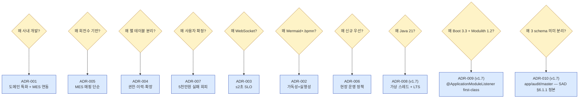

# PDD + PRD Master (Integrated) — 공정 스케줄링 시스템 통합 정의서 v1.7

> Phase 2 / 1.PDD — v1.6 의 기술 스택·인프라 명시 보강 (delta document)
> 작성일: 2026-05-16 / 기준: v1.6 ([4.PDD_master_integrated_Opus_final.md](4.PDD_master_integrated_Opus_final.md))
> **본 문서는 v1.6 의 모든 내용을 상속**하며, REPORT-003 Category C (Phase 2 무명세 임의 가정 4건) 을 해소하는 **기술 스택 명시 + ADR-008·009·010 추가** delta 만 정의한다.

---

## 0. 본 개정 (v1.7) 의 목적

REPORT-003 (Harness ↔ Phase 2 정합성 감사) Category C 4건 — **새 harness skill 이 임의 가정한 기술 스택·인프라 세부** 가 Phase 2 (v1.6) 에 무명세 상태로 남아 있어 Sprint 0 D1 진입 시 단일 소스 부재. 본 v1.7 은 다음 4 항목을 **PDD 정본** 으로 명시한다:

| # | 항목 | v1.6 상태 | v1.7 명시 |
|---|---|---|---|
| C1 | Java 버전 | 무명세 (LTS 수준) | **Java 21 LTS** (ADR-008) |
| C2 | Spring Boot 버전 | 무명세 (3.x) | **Spring Boot 3.3.x** (ADR-009) |
| C3 | Spring Modulith 버전 | 무명세 | **Spring Modulith 1.2.x** (Boot 3.3 호환, ADR-009) |
| C4 | DB Schema 분할 | SAD §6.1.1 에 3 schema (`app·audit·master`) 명시, PDD 미반영 | **PDD ADR-010 으로 정형화** (SAD 정본 그대로 — Modulith 패키지 ≠ DB schema) |

본 4 항목은 **순수 추가** — v1.6 의 BR·KPI·NFR·User Story·ADR 1~7 는 모두 그대로 유효. 신규 ADR-008·009·010 추가 + §2.3 기술 스택 절 신설 + §15 ADR 목록 갱신.

---

## 1. Master Identification (정정)

| 항목 | 값 |
|---|---|
| Master ID | `PDD-MASTER-v1.7` |
| Document Name | 공정 스케줄링 시스템 — 통합 프로세스 정의서 v1.7 (기술 스택 명시) |
| Base Document | `PDD-MASTER-v1.6` ([4.PDD_master_integrated_Opus_final.md](4.PDD_master_integrated_Opus_final.md)) |
| Constituent PDDs | `PDD-01-v1.0`, `PDD-02-v1.1`, `PDD-03-v1.1` (변경 없음) |
| 12207 Mapping | `§6.4 Technical Processes` (변경 없음) |
| Conformance Class | BPMN 2.0 Descriptive Process Modeling Sub-Class (변경 없음) |
| Status | Draft v1.7 (REPORT-003 Category C 해소) |
| Created / Updated | 2026-05-16 / 2026-05-16 |
| Master Owner | 생산관리팀 (김정훈 주임) |
| Delta 트리거 | REPORT-003 §2 Category C — Sprint 0 D1 단일 소스 부재 해소 |

---

## 2. End-to-End Architecture (§2.3 추가)

§2.1·2.2 — v1.6 그대로 유효. 본 v1.7 은 **§2.3 기술 스택 (Technical Stack)** 절 신설.

### 2.3 기술 스택 (Technical Stack) — 신규

| 분류 | 기술 | 버전 | 근거 ADR |
|---|---|---|---|
| **언어·런타임** | Java | **21 LTS** (Eclipse Temurin) | ADR-008 |
| **프레임워크** | Spring Boot | **3.3.x** (latest 3.3 patch) | ADR-009 |
| **모듈성** | Spring Modulith | **1.2.x** (Boot 3.3 호환) | ADR-009 |
| **영속성** | Spring Data JPA + Hibernate | 6.5+ (Boot 3.3 동반) | ADR-004 (v1.6) |
| **쿼리** | QueryDSL | 5.x (Jakarta 적용) | ADR-004 (v1.6) |
| **DB** | PostgreSQL | **16.x** | (기존 명시) |
| **마이그레이션** | Flyway | **10.x** | (기존 명시) |
| **인증** | Keycloak | **24.x LTS** | ADR-012 (별도 SAD) |
| **캐싱** | Redis | 7.x | (기존 명시) |
| **캐싱 (in-memory)** | Caffeine | 3.x | (기존 명시) |
| **실시간** | WebSocket / STOMP | Boot 3.3 starter | ADR-003 (v1.6) |
| **엑셀** | Apache POI | 5.x (XSSF + SXSSF streaming) | (기존 명시) |
| **테스트** | JUnit 5 · Testcontainers · ArchUnit | latest stable | (기존 명시) |
| **빌드** | Gradle (Kotlin DSL) | 8.x | ADR-009 |
| **CI/CD** | Jenkins · Harbor · SonarQube · Trivy | (사내 설치) | ADR-015 (별도) |
| **컨테이너** | Docker · Docker Compose v2 | latest stable | (기존 명시) |
| **관측성** | Prometheus · Loki · Grafana | (사내 설치) | (별도 EP-31) |
| **APM** | OpenTelemetry · Sentry | (사내 설치) | (별도 EP-31) |
| **OS** | Linux (RHEL 9 호환) — 사내 서버 | — | A-08 (사내 NW) |

---

## 3~14. 변경 없음

v1.6 의 §3 RACI · §4 Data Dictionary (§4.5 ERD 포함) · §5 BPMN · §6~§8 PDD 요약 · §9 Cross-Process BR · §10 KPI · §11 Acceptance · §12 Risk · §13 Traceability · §14 Assumptions 는 모두 그대로 유효.

---

## 15. ADR — Architecture Decision Records (ADR-008·009·010 추가)

v1.6 ADR-001~007 + 본 v1.7 ADR-008·009·010 = 총 **10 ADR**. 의사결정 그래프 (§15.1) 는 본 추가 ADR 반영해 §15.1' 로 보강.

### ADR-008 — Java 21 LTS 채택

| 항목 | 내용 |
|---|---|
| **상태** | Accepted (2026-05-16) |
| **배경** | v1.6 무명세. Sprint 0 D1 단일 소스 부재 (REPORT-003 C1). Spring Boot 3.3 baseline 은 Java 17, 권장 baseline 은 Java 21. 사내 운영 OS — RHEL 9 + Temurin 21 (사내 Maven mirror 적용). |
| **고려한 옵션** | (a) Java 17 LTS — Boot 3.x baseline, 가장 보수적 / (b) **Java 21 LTS** — 최신 LTS, 가상 스레드 + pattern matching + record patterns / (c) Java 22+ — non-LTS, 사내 PROD 부적합 |
| **선택** | (b) **Java 21 LTS** |
| **이유** | (a) 보수적이나 가상 스레드 (`Thread.ofVirtual()`) 미지원 — WebSocket PUSH 동시 200+ 세션 대비 손해 / (b) 가상 스레드 + Sequenced Collections + Record Pattern — 스케줄 row 1500개 처리 모델링 단순 + 2026~2031 사내 운영 베이스라인 적합 / (c) non-LTS — 패치 지속성 미보장 |
| **결과** | Eclipse Temurin 21 (LTS) 사내 Maven mirror 등록. Docker 베이스 이미지 — `eclipse-temurin:21-jre-alpine` (PROD) / `eclipse-temurin:21-jdk` (CI). 모든 모듈 컴파일 target = 21. |
| **재검토 조건** | Java 25 LTS (2027 예정) 출시 + 1년 안정화 시 |

### ADR-009 — Spring Boot 3.3.x + Spring Modulith 1.2.x + 7 모듈 패키지 (Phase 2 정본)

| 항목 | 내용 |
|---|---|
| **상태** | Accepted (2026-05-16) |
| **배경** | v1.6 무명세 (REPORT-003 C2·C3). Spring Boot 3.x major 안정화. Modulith 1.2 가 Boot 3.3 호환 first-class. **Phase 2 TK-00-2-3 ArchUnit 정본 7 모듈 (PDD 프로세스 기반)** — `order`·`vc`·`ex`·`master`·`audit`·`notify`·`common`. 본 ADR 은 버전 + 모듈 분할 정형화. |
| **고려한 옵션** | (a) Spring Boot 3.2 + Modulith 1.1 — 보수적 / (b) **Spring Boot 3.3 + Modulith 1.2** — first-class 호환, 가상 스레드 통합 / (c) Spring Boot 3.4+ — 출시 직후, 사내 검증 부족 |
| **선택** | (b) **Spring Boot 3.3.x + Modulith 1.2.x** + Phase 2 TK-00-2-3 정본 7 모듈 |
| **모듈 분할 (Phase 2 TK-00-2-3 정본)** | |
| 모듈 | PDD 매핑 | 역할 |
| `com.scheduling.order` | PDD-01 | 수주 정보 통합 (3종 엑셀 + 고객사 변경) |
| `com.scheduling.vc` | PDD-02 | 성형 가류 스케줄링 (BR-V*) |
| `com.scheduling.ex` | PDD-03 | 압출 스케줄링 (BR-E*) |
| `com.scheduling.master` | (횡단) | 마스터 데이터 (제약·우선순위·KD) |
| `com.scheduling.audit` | (횡단) | 감사 로그 (BR-X02) |
| `com.scheduling.notify` | (횡단) | WebSocket / 알림 (US-04 ≤2초) |
| `com.scheduling.common` | (기반) | BR · BrCode · ProblemDetail · Clock |
| **이유** | (a) Modulith 1.1 은 Boot 3.2 limit, `@ApplicationModuleListener` 정식 채택 전 / (b) Boot 3.3 가상 스레드 + Modulith 1.2 first-class · 7 모듈 PDD 프로세스 기반 분할은 본 프로젝트 도메인 분리 의도와 일치 (수주·성형·압출 + 횡단 + 기반) / (c) Boot 3.4 출시 직후 사내 검증 risk |
| **결과** | `build.gradle.kts` — Boot 3.3 + Modulith 1.2 BOM. 7 모듈 모두 `@ApplicationModule` + `api/internal/events/domain` 패키지 구조. `common` 은 도메인 모듈 의존 금지 (ArchUnit `common_does_not_depend_on_domain_modules`). CI 단계 `ApplicationModulesTest.verify()` 통합. |
| **재검토 조건** | Boot 3.4 출시 후 6개월 사내 검증 통과 시 — Modulith 1.3 동반. 또는 8 번째 모듈 필요 시 (예: `report` — KPI export). |

### ADR-010 — Schema 분리: 데이터 의미 기반 3 schema (Phase 2 SAD §6.1.1 정본 명시)

> **수정 이력** — v1.7 draft 1 (2026-05-16 12:11) 에서 "Modulith 모듈 별 6 schema" 로 잘못 가정. **SAD §6.1.1 정본 (`app·audit·master` 3 schema)** 과 충돌 → v1.7 draft 2 (2026-05-16 12:25) 정정.

| 항목 | 내용 |
|---|---|
| **상태** | Accepted (2026-05-16) — Phase 2 SAD §6.1.1 정본 명시 (변경 없이 ADR 형태 정형화) |
| **배경** | SAD §6.1.1 에 schema 구조 정의 (TK-00-1-1 구현). 본 ADR-010 은 SAD 정본을 PDD 로 끌어올려 단일 소스 정합. v1.6 까지 ADR 형태 미정형. |
| **고려한 옵션** | (a) Single schema (`public`) — 단순하나 audit 권한 분리 곤란 / (b) **데이터 의미 기반 3 schema** (`app`·`audit`·`master`) — SAD 정본 / (c) Modulith 모듈 별 schema-per-module — 5+ schema, cross-module join 곤란 (reporting 영향) |
| **선택** | (b) **데이터 의미 기반 3 schema** (SAD §6.1.1) |
| **이유** | (a) audit `REVOKE UPDATE/DELETE` 권한 분리 곤란 (BR-X02·REQ-NF-SEC-004) / (b) 운영·감사·마스터 의미 분리 + master 는 dual-review (BR-X05) `master_admin` 권한 분리 + audit 는 INSERT-only `auditor` SELECT only / (c) Modulith 패키지 boundary 와 DB schema 가 1:1 매핑 필수 아님 — 패키지 분할은 코드 의존, DB 분할은 데이터 권한 의미. 본 프로젝트 reporting (EP-EX·E2E) 이 cross-module 데이터 join 필요 — single `app` schema 가 더 단순. |
| **선택 (SAD §6.1.1 정본)** | |
| Schema | 용도 | 접근 권한 |
| `app` | 운영 데이터 (PRODUCT·ORDER·VC_SCHEDULE·EX_SCHEDULE 등) | 애플리케이션 user `app_user` — read·write |
| `audit` | 감사 로그 (ORDER_CHANGE·VC_AUDIT·EX_AUDIT) | `app_user` INSERT only · `auditor` SELECT only · UPDATE·DELETE `REVOKE` |
| `master` | 마스터 데이터 (VC_CONSTRAINT·EX_CONSTRAINT·VC_HOSE_RULE·PRODUCT_PRIORITY·KD_ORDER) | `app_user` SELECT only · `master_admin` UPDATE (BR-X05 dual-review 후) |
| **결과** | `application.yml` `spring.flyway.schemas=app,audit,master` + `default-schema=app`. Cross-schema FK 허용 (예: `master.VC_HOSE_RULE.hose_id → app.PRODUCT.hose_id`) — 데이터 의미 결합은 허용, 권한만 분리. Modulith 패키지 (`scheduling`·`audit`·`auth`·`mes`·`report`·`common`) 는 **코드 계층 boundary** 만 강제 — 모두 `app` schema 안에서 자유 join. audit 트리거 (EP-11 ST-11-2) 와 master `REVOKE` 는 baseline 마이그레이션 (TK-00-1-1) 에 포함. |
| **재검토 조건** | 사용자 수 100+ 또는 reporting OLAP DB 분리 시 |

### 15.1' 의사결정 그래프 (보강)

### 15.2 ADR 유지 정책 (v1.6 그대로)

- 모든 신규 ADR 은 마크다운 한 파일 (필요 시 `/docs/adr/ADR-NNN.md`) 로 추가
- 기존 ADR 을 뒤집을 경우 "Superseded by ADR-NNN" 상태로 변경 (삭제 금지)
- 각 ADR 의 "재검토 조건" 충족 시 의제 등록

---

## 16~22. 변경 없음

User Stories · MoSCoW · NFR · Differential Value · Rollout · Proof · Cheatsheet — v1.6 그대로 유효.

---

## 23. Revision History (v1.7 추가)

| Version | Date | Author | Change |
|---|---|---|---|
| v1.0 | 2026-05-14 | (Opus) | 초안 통합 — PDD-01·02·03 v1.0 통합 |
| v1.1 | 2026-05-14 | (Opus) | PRD 요소 신설 |
| v1.2 | 2026-05-14 | (Opus) | Gemini 강점 흡수 (§4.5 ERD 등) |
| v1.3 | 2026-05-14 | (Opus) | PRD 완성도 6/6 PASS (§14·15·17.5) |
| v1.4 | 2026-05-15 | (Opus) | PDD-02 제약 7건 동기화 |
| v1.5 | 2026-05-15 | (Opus) | §1 stale 참조 정정 (in-place) |
| v1.6 | 2026-05-15 | (Opus) | broken links `_Opus` suffix 정정 (in-place) |
| **v1.7** | **2026-05-16** | **(Opus)** | **REPORT-003 Category C 해소 — §2.3 기술 스택 절 신설 + ADR-008 (Java 21 LTS) + ADR-009 (Spring Boot 3.3 + Modulith 1.2) + ADR-010 (Schema 의미 기반 3 분리 — SAD §6.1.1 정본 PDD 정형화). 본 개정은 v1.6 의 모든 BR·KPI·NFR·User Story 를 상속. 새 파일로 발행.  **드래프트 수정 — 12:11 1차 작성 시 ADR-010 을 "Modulith 모듈 별 6 schema" 로 잘못 가정. 12:25 SAD §6.1.1 정본 (`app·audit·master` 3 schema) 으로 정정. Modulith 패키지 boundary 와 DB schema 분리는 1:1 매핑 아님을 명확화.** |

---

## 24. 참조 문서 (v1.7 추가)

| 분류 | 문서 |
|---|---|
| 표준 | ISO/IEC/IEEE 12207:2008 §5.2.3, §6.4 (v1.6 그대로) |
| 표준 | OMG BPMN 2.0 (formal-13-12-09) §9.4, §10.3~10.8 (v1.6 그대로) |
| 상세 PDD | [1.process_order_consolidation_Opus.md](1.process_order_consolidation_Opus.md) (v1.6 그대로) |
| 상세 PDD | [2.process_vulcanization_scheduling_Opus.md](2.process_vulcanization_scheduling_Opus.md) (v1.6 그대로) |
| 상세 PDD | [3.process_extrusion_scheduling_Opus.md](3.process_extrusion_scheduling_Opus.md) (v1.6 그대로) |
| **Base** | [4.PDD_master_integrated_Opus_final.md](4.PDD_master_integrated_Opus_final.md) **(v1.6 — 본 v1.7 의 모체)** |
| **Delta 트리거** | [../../docs/harness/REPORT-003_Harness_Phase2_Alignment_v1.0.md](../../docs/harness/REPORT-003_Harness_Phase2_Alignment_v1.0.md) (Category C 4건) |
| **Harness 정합성** | [../../CLAUDE.md](../../CLAUDE.md) · [../../.claude/skills/backend/](../../.claude/skills/backend/) |
| 상위 문제정의 | `Phase 1/3.Analysis/12.problem_statement_master.md` (v1.6 그대로) |
| 원본 데이터 | `Phase 1/2.Raw Materials/Order/*.xlsx`, `Vulcanization/*`, `Extrusion/*` (v1.6 그대로) |

---

## 25. 본 v1.7 적용 체크리스트 (Sprint 0 D1)

- [ ] `build.gradle.kts` — Spring Boot 3.3.x + Modulith 1.2.x BOM (ADR-009)
- [ ] `build.gradle.kts` — `java { toolchain { languageVersion.set(JavaLanguageVersion.of(21)) } }` (ADR-008)
- [ ] Docker 베이스 이미지 — `eclipse-temurin:21-jre-alpine` (PROD), `eclipse-temurin:21-jdk` (CI)
- [ ] `application.yml` — `spring.flyway.schemas=app,audit,master` + `default-schema=app` (ADR-010, SAD §6.1.1)
- [ ] Flyway baseline (TK-00-1-1) — 3 schema 생성 + 3 role (`app_user`·`auditor`·`master_admin`) + `audit` schema `REVOKE UPDATE, DELETE`
- [ ] `ApplicationModulesTest.verify()` CI 통합 (ADR-009)
- [ ] [.claude/skills/backend/spring-modulith-boundaries](../../.claude/skills/backend/spring-modulith-boundaries/SKILL.md) — 6 schema 명시 일치 확인
- [ ] [.claude/skills/backend/flyway-migration-design](../../.claude/skills/backend/flyway-migration-design/SKILL.md) — schema list 일치 확인
- [ ] WBS Sprint 0 EP-00 ST-00-2 (DB 셋업) — 본 v1.7 ADR-010 schema 분할 반영

---

## 26. v1.7 발행 정책

- **새 파일 발행 (in-place 수정 금지)** — 사용자 메모리 규칙 준수
- v1.6 는 historical reference 로 보존 — 본 v1.7 이 신규 정본
- v1.8+ 신규 변경 시 본 v1.7 을 base 로 새 파일 발행
- Phase 2 의 다른 문서 (SRS·SAD·WBS) 에서 PDD 참조 시 — v1.7 명시 권고 (이전 참조도 valid)
