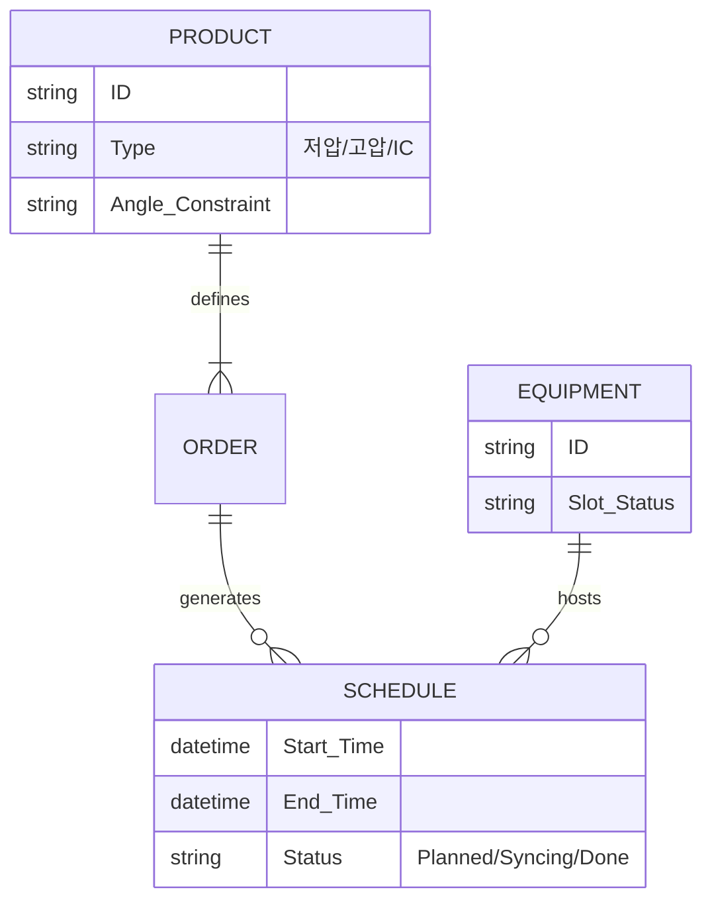

# 공정 스케줄링 시스템 PRD v0.1
- Owner 팀: 생산관리부 / IT혁신팀
- 최종 업데이트: 2026-05-14

## 1. 개요·목표
- **문제 정의(Pain지표 포함)**: 
  - 3종 엑셀 취합 수작업으로 인한 소요 시간 과다 (주 4.2시간)
  - 수주 변경 수동 추적으로 인한 납기 지연 (월 1건 이상 발생, 클레임 임계점 도달)
  - 공정 간(성형-압출) 정보 비동기화로 인한 관체 부족 라인 정지 (월 3건)
- **목표(Desired Outcome 수치화)**: 
  - 수주 데이터 통합 및 스케줄링 소요 시간 30분 이내로 단축
  - 수주 변경에 따른 정보 누락률 0% 달성
  - 제약 위반(합금형, 슬롯 등) 스케줄링 사전 경고율 95% 이상
- **성공 지표(북극성/보조 KPI)**:
  - **북극성 KPI**: 주간 마스터 스케줄 수립 및 동기화 처리 소요 시간 (As-Is 4.2h → To-Be 30m / 주간 측정)
  - **보조 KPI**: 제약 위반에 따른 재작업 횟수(0건), 성형-압출 간 딜레이 발생 횟수(0건 / 월간 측정)

## 2. 사용자와 페르소나
- [10.jtbd_interview_results.md](file:///c:/vs%20code%20workbase/Internal-Production-Scheduling-Project/Phase%201/3.Analysis/10.jtbd_interview_results.md) 및 [12.problem_statement_master.md](file:///c:/vs%20code%20workbase/Internal-Production-Scheduling-Project/Phase%201/3.Analysis/12.problem_statement_master.md) 참조.
- **김정훈 (생산관리 주임)**: "수주 변경을 다 추적할 수 없다." (Pain: 수작업 취합, Needs: 단일 뷰 통합)
- **최민혁 (생산관리 대리)**: "선배 없이는 제약조건을 몰라 스케줄을 못 짠다." (Pain: 지식의 속인화, Needs: 룰 베이스 시스템)
- **이수진 (성형 현장반장)**: "사무실은 현장 앵글 제약을 무시하고 스케줄을 준다." (Pain: 비현실적 계획, Needs: 제약 검증)
- **박도영 (압출 현장반장)**: "성형 일정이 바뀌면 관체가 부족해진다." (Pain: 소통 지연, Needs: 실시간 스케줄 동기화 알림)

## 3. 사용자 스토리와 수용 기준(AC, Acceptance Criteria)

### Story 1. 수주 통합 및 변경 추적
> As a 생산관리 스케줄러, I want 3개의 엑셀(월별, KD, 주간)이 하나의 뷰로 자동 취합되기를 원한다, so that 4.2시간 걸리던 비교/병합 작업을 30분 내로 줄일 수 있다.
- **AC 1**: Given 스케줄러가 3종의 엑셀을 업로드했을 때, When '데이터 통합' 버튼을 클릭하면, Then 처리 응답 시간은 **≤ 5초** 이내여야 한다.
- **AC 2**: Given 기존 주간 스케줄이 존재하는 상태에서, When 새로운 KD 수주 변경 엑셀이 업로드되면, Then 수량이나 납기일이 변경된 Row가 붉은색 뱃지로 강조 표시되어야 한다 (정확도 **100%**).
- **AC 3**: Given 통합된 데이터 뷰에서, When 오류나 매칭 불가 품번이 발견되면, Then 상단에 '수동 확인 필요' 알림과 함께 실패율이 전체의 **< 1%** 미만으로 관리되어야 한다.

### Story 2. 제약 조건 검증 및 스케줄링
> As a 성형 반장 및 대리, I want 시스템이 앵글 교체 및 합금형 제약을 자동 검사하기를 원한다, so that 담당자 지식과 관계없이 제약 위반 없는 현실적 스케줄을 확보할 수 있다.
- **AC 1**: Given IC 전용 가류기에 저압 제품을 배정하려고 할 때, When 사용자가 스케줄 블록을 드래그 앤 드롭하면, Then 즉각적인 경고 아이콘이 표시되고 저장이 차단되어야 한다 (위반 감지율 **100%**, 응답 시간 **≤ 1초**).
- **AC 2**: Given 특정 라인에서 하루 앵글 교체 횟수가 3회를 초과하도록 배치했을 때, When 스케줄 저장을 시도하면, Then '교체 과다 경고' 모달이 발생해야 한다.
- **AC 3**: Given 스케줄 초안이 완성되었을 때, When '제약조건 검사'를 실행하면, Then 전체 스케줄 대비 위반 사항 목록이 **≤ 3초** 내에 리스트업 되어야 한다.

### Story 3. 성형-압출 스케줄 동기화
> As a 압출 반장, I want 성형 스케줄이 현장에서 변경될 때 내 태블릿에 즉시 알림이 오기를 원한다, so that 관체 생산 지연 및 라인 정지를 막을 수 있다.
- **AC 1**: Given 성형 현장반장이 패드에서 생산 순서를 변경했을 때, When 저장을 완료하면, Then 압출반장 패드에 PUSH 알림이 도달하는 시간은 **≤ 2초**여야 한다.
- **AC 2**: Given 성형 스케줄 변경으로 특정 관체의 선행 소요량이 증가했을 때, When 현재 압출 재고가 이를 충당하지 못하면, Then 압출반장 화면의 해당 관체 항목이 붉은색 깜빡임 효과로 표시되어야 한다 (오탐율 **< 0.1%**).
- **AC 3**: Given 동기화 알림을 수신했을 때, When 압출반장이 '확인'을 누르면, Then 생산관리 시스템 상에 '압출 인지 완료' 상태가 **≤ 1초** 내에 업데이트되어야 한다.

## 4. 기능 요구사항(Functional)
- **Must Have** 
  - 엑셀 통합 Parser 및 SSoT 데이터 뷰 제공 (기존 수작업 대비 **소요 시간 80% 단축**)
  - 제약 조건(합금형, 슬롯, 앵글) Rule Engine 기반 스케줄 검증기 (휴먼 에러 대비 **제약 위반율 100% 방어**)
  - 현장 패드용 Web UI 및 성형-압출 스케줄 동기화 알림 (정보 전달 지연 **24시간 → 2초**로 단축)
- **Should Have** 
  - 드래그 앤 드롭 기반 스케줄 타임라인(간트차트) 시각화 수정 기능
- **Could Have** 
  - 최적 스케줄 자동 추천 (알고리즘 기반 정렬)
- **Won't Have** (Phase 1 제외)
  - 모바일 기기용 야간 조회 뷰, 자재 소요량 계산(MRP) 시스템 연동

## 5. 비기능 요구사항(NFR, Non-Functional Requirement)
- **성능**: 
  - API p95 응답 시간 **≤ 1,000 ms** (대규모 제약조건 Rule Engine 검증 로직 포함)
  - 화면 렌더링 및 타임라인 로드 타임 **≤ 2초**
- **신뢰성**: 
  - 업무 시간(08:00~18:00) 기준 시스템 월 가용성 **≥ 99.9%**
  - 공정 간 동기화 알림 발송 실패율 **≤ 0.01%**
- **보안/비용**: 
  - 사내 온프레미스 서버 배포 및 내부망/VPN을 통한 접근 통제 (클라우드 외부 노출 금지)
  - 기존 잉여 서버 활용으로 인프라 추가 도입 비용 0원 유지
- **모니터링 항목**: 
  - 서버 자원(CPU/Memory), Rule Engine 병목 구간 추적 대시보드
  - 시스템 에러 및 알림 전송 실패 시 IT혁신팀 슬랙(Slack)으로 즉시 Alert

## 6. 데이터·인터페이스 개요

- **핵심 엔터티**: 
  - `Order` (수주 마스터), `Product` (품번 마스터 및 제약 메타데이터), `Equipment` (성형 가류기/압출기), `Schedule` (할당된 스케줄 블록)
- **외부/내부 API 개요**:
  - `Import Order API`: ERP 시스템의 DB Read-only 뷰 연동 (1일 1회 Batch 및 수동 트리거)
  - `Push Notification API`: WebSockets 기반 현장 패드 실시간 알림 송신

## 7. 범위(In/Out), 리스크·가정·의존성
- **In/Out 명시**: 
  - **IN**: 파일럿 대상 제품군의 수주 취합, 성형 스케줄 검증, 압출 공정 동기화.
  - **OUT**: 전 제품군 확장, ERP/MES 상 실적 자동 Write 백, 품질(불량률) 결합 분석.
- **리스크 (Risks)**:
  1. ERP에서 추출되는 마스터 BOM 데이터가 현장과 불일치할 확률 (데이터 정합성 이슈).
  2. 현장 반장급 사용자(10년 차 이상)의 새로운 태블릿 시스템 거부감 및 도입 지연.
  3. 제약 조건 로직(합금형, 슬롯 등)의 복잡도로 인한 Rule Engine 개발 일정 초과.
- **가정·의존성 (Assumptions & Dependencies)**:
  - 성형/압출 현장의 사내 Wi-Fi 네트워크망이 음영 지역 없이 원활하게 작동한다는 가정.
  - 관련 부서가 테스트 및 피드백을 위해 매주 2시간씩 참여한다는 의존성.

## 8. 실험·롤아웃·측정
- **베타 채널**: 파일럿 특정 라인(예: 1번 가류기 라인) 및 대상 페르소나(김정훈, 이수진) 한정으로 2주간 섀도우 런(Shadow Run) 진행 (기존 엑셀 병행).
- **실험 가설**: "경험이 부족한 대리급 직원이 시스템의 '제약 검증기'를 활용할 경우, 주임과 동일한 수준의 무결점 스케줄을 작성할 수 있을 것이다."
- **성공 기준 및 벤치마크**: 
  - 엑셀 수작업(대안) 대비 주간 스케줄 수립 시간 비교 (4.2h vs 목표 30m).
  - 베타 기간 중 현장 불만 접수(제약 위반으로 인한) 0건 달성.

## 9. 근거(Proof)
- 사용자 문제와 Pain 파악: [10.jtbd_interview_results.md](file:///c:/vs%20code%20workbase/Internal-Production-Scheduling-Project/Phase%201/3.Analysis/10.jtbd_interview_results.md)
- 현장 제약 및 베이스라인 수치 도출: [12.problem_statement_master.md](file:///c:/vs%20code%20workbase/Internal-Production-Scheduling-Project/Phase%201/3.Analysis/12.problem_statement_master.md)
- 아키텍처 및 공정 단절 분석: [13.process_design_document.md](file:///c:/vs%20code%20workbase/Internal-Production-Scheduling-Project/Phase%201/3.Analysis/13.process_design_document.md)
