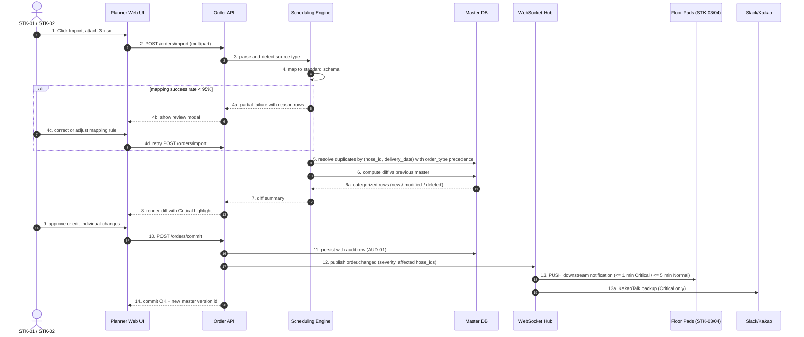
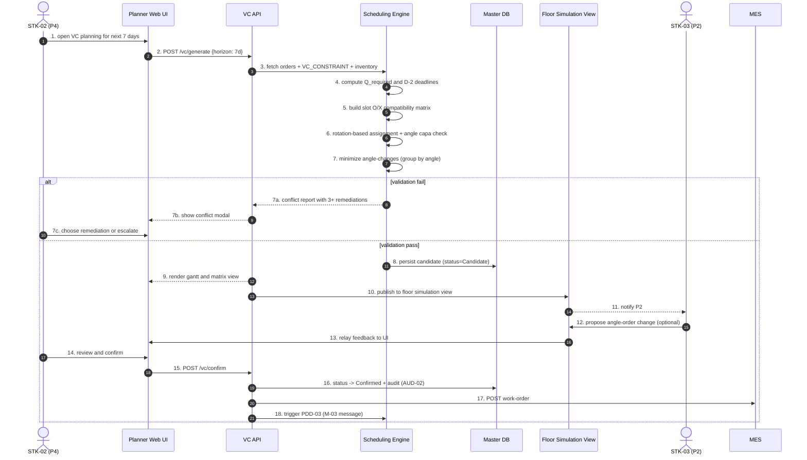
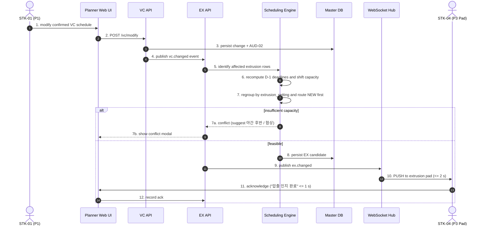
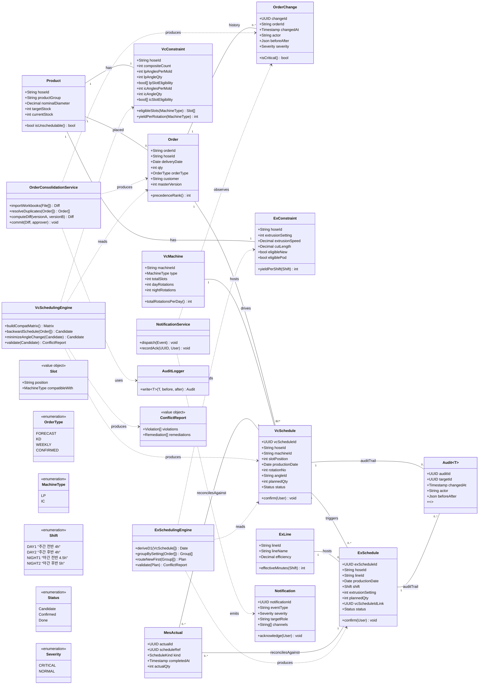
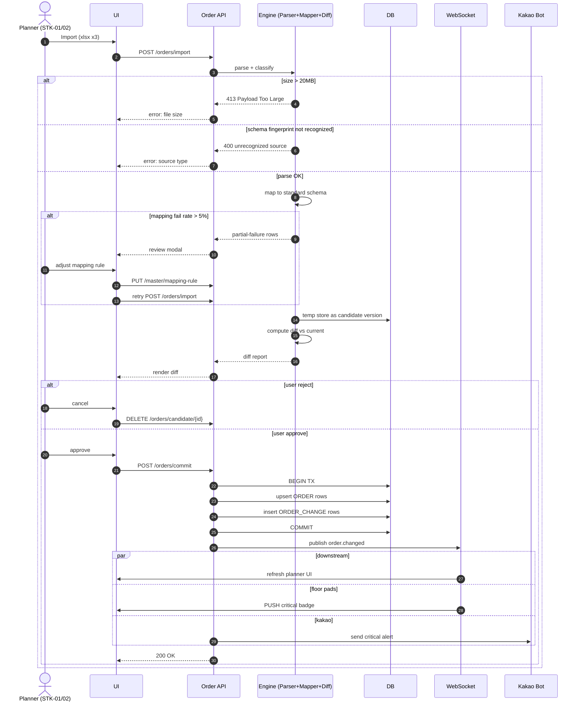
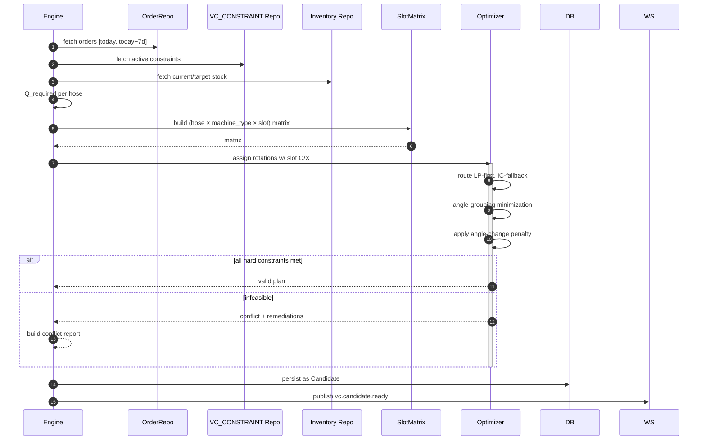
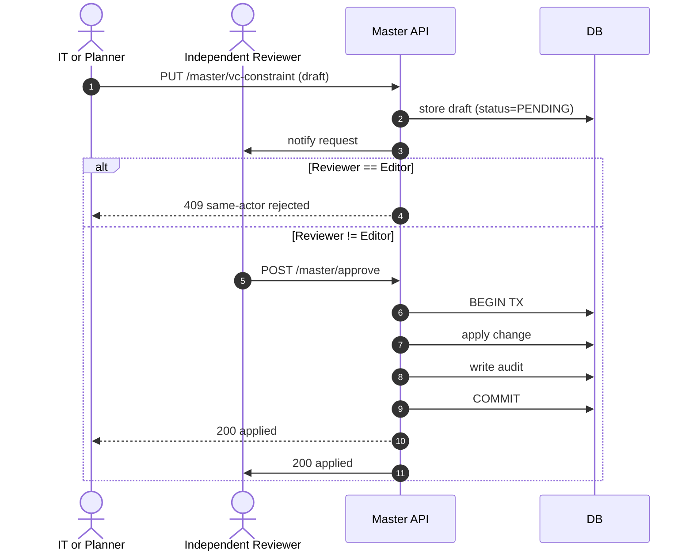

# Software Requirements Specification (SRS)
Document ID: SRS-001
Revision: 1.2
Date: 2026-05-14
Standard: ISO/IEC/IEEE 29148:2018

System Name: **사내 공정 스케줄링 시스템 (Internal Production Scheduling System)**
Source PRD: [REF-01] `Phase 2/1.PDD/4.PDD_master_integrated_Opus.md` v1.3
Previous SRS Version: `SRS-001_Production_Scheduling_System.md` (v1.1)
Author Role: Senior Requirements Engineer
DoD Status: **8/8 PASS** (Use Case · ERD · Class · Component diagrams added; 6 KPI NFR-formalized; US-06 explicit deferral)

---

## 1. Introduction

### 1.1 Purpose

This Software Requirements Specification (SRS) defines the complete software requirements for the **Internal Production Scheduling System**, a sealed-network web application that

(a) consolidates **three fragmented order Excel sources** (월별 예상 / KD 발주 / 주간 발주) into a single, version-controlled, change-tracked Master Order Dataset (Single Source of Truth),
(b) generates a **constraint-validated, rotation-based vulcanization schedule** that satisfies slot O/X compatibility, angle availability, daily machine capacity and delivery deadline D-2, while minimizing angle change events, and
(c) derives a **shift-based extrusion schedule** by backward computation from the vulcanization input date minus one day (D-1), grouping production by 압출셋팅 (extrusion setting) number and routing eligible work to the 신규 (New) line before the 포드 (Pod) line.

The system replaces the current Excel-and-KakaoTalk based manual workflow performed by a 7-year production planner and four downstream actors at an automotive rubber hose manufacturer. The SRS is normative; all design, implementation, and verification work shall conform to the requirements stated herein.

### 1.2 Scope

#### 1.2.1 In-Scope (Phase 1)

| # | Capability | Source (PRD) |
|---|-----------|--------------|
| IS-01 | Three-source Excel parsing and standard-schema mapping | M-01 |
| IS-02 | (품번, 납기) duplicate detection with precedence resolution | M-02 |
| IS-03 | Inter-version diff with Critical change notification | M-03 |
| IS-04 | Slot O/X automatic validation (저압 4×8슬롯, IC 1×6슬롯) | M-04 |
| IS-05 | Rotation-based vulcanization placement (주간 8 + 야간 10 = 18 / 일·대) | M-05 |
| IS-06 | Backward scheduling — D-2 for vulcanization completion | M-06 |
| IS-07 | Automatic D-1 derivation of extrusion completion from vulcanization | M-07 |
| IS-08 | Extrusion yield formula with 75% efficiency | M-08 |
| IS-09 | Extrusion setting (1~8) grouping for zero in-shift setup | M-09 |
| IS-10 | System-proposal + user-confirmation gate (BR-X01) | M-10 |
| IS-11 | Audit logging for all confirmed changes (BR-X02) | M-11 |
| IS-12 | Excel reverse-export preserving original format | M-12 |
| IS-13 | Angle-change minimization optimization | S-01 |
| IS-14 | 신규 line preferred routing with 포드 fallback (BR-E08) | S-02 |
| IS-15 | Floor simulation view (P2 vulcanization 반장) | S-03 |
| IS-16 | KakaoTalk backup notification channel | S-04 |
| IS-17 | Date × shift × machine matrix view (extrusion) | S-05 |
| IS-18 | Bidirectional MES integration (work-order send, actual receive) | PDD-02·03 |

#### 1.2.2 Out-of-Scope (Phase 1)

| # | Excluded Capability | Reason | Re-entry Phase |
|---|--------------------|--------|---------------|
| OS-01 | Material Resource Planning (MRP) | GAP=2; separate domain | Phase 2 |
| OS-02 | Quality–schedule combined analytics | Data accumulation required | Phase 2+ |
| OS-03 | Executive KPI dashboard (covers REF-01 §16 US-06 — 강병철 공장장 KPI 대시보드) | Awaits Phase 1 success evidence | Phase 2 |
| OS-04 | Mobile / night-shift responsive view | DOS=1.2 | Phase 2 (reviewed) |
| OS-05 | Outsourcing partner portal | Out of Phase 1 boundary | Phase 3 |

### 1.3 Definitions, Acronyms, Abbreviations

#### 1.3.1 Domain Terms

| Term | Definition |
|------|-----------|
| **저압가류기** (Low-Pressure Vulcanizer) | Vulcanization machine with 8 slots arranged in 4 levels (상단·중상단·중하단·하단), 2 slots per level. Fleet size: 4 units (LP-01~LP-04) |
| **IC가류기** (Internal-Core Vulcanizer) | Vulcanization machine with 6 slots arranged in 3 levels (상단·중단·하단), 2 slots per level. Fleet size: 1 unit (IC-01) |
| **슬롯 (Slot)** | A physical position inside a vulcanizer accommodating one angle. Each (product, slot-position) pair has an O (가능) / X (불가) compatibility flag |
| **앵글 (Angle)** | A reusable jig holding a fixed number of molds for one product. Quantity per product is bounded by inventory (저압앵글보유수량, IC앵글보유수량) |
| **합금형 (Composite Mold)** | Number of distinct units produced from one mold cycle, taking integer values 1, 2, 3, or 6 |
| **회전 (Rotation)** | The unit of vulcanizer cycle. Each machine operates 8 day-rotations + 10 night-rotations = 18 rotations per working day |
| **압출셋팅 (Extrusion Setting)** | Numeric tag 1~8. Products sharing the same tag may be produced in the same shift without equipment setup |
| **신규/포드 (New/Pod)** | The two extrusion lines. 신규 has higher precedence per BR-E08 |
| **shift** | One of four daily extrusion blocks: 주간 전반 4h, 주간 후반 4h, 야간 전반 4.5h, 야간 후반 5h. Equipment efficiency = 75% across all shifts |
| **재단길이 (Cut Length)** | Per-product extrusion product length in millimeters |
| **D-Day / D-N** | Delivery date and N-day backward offset. D-2 = vulcanization completion deadline; D-1 = extrusion completion deadline relative to vulcanization input |
| **품번 (HOSE ID)** | Product identifier such as `29673-2F900` |

#### 1.3.2 Methodology Terms

| Term | Definition |
|------|-----------|
| **JTBD** (Jobs-To-Be-Done) | Framework expressing user objectives in `When … I want to … so that …` form |
| **DOS** (Discovered Opportunity Score) | JTBD opportunity score derived as `Importance + max(0, Importance − Satisfaction)`. In this project DOS is bounded at 4.0 and used to rank candidate Outcomes (e.g., §10 of REF-03) |
| **AOS** (Adjusted Opportunity Score) | DOS adjusted by strategic weights (e.g., persona criticality, GAP). Not used numerically in REF-01; reserved for Phase 2 if multi-segment scoring is required |
| **Validator** | A reviewer role that independently checks JTBD or requirements for fitness against persona evidence. In REF-01 this role is fulfilled implicitly by STK-03 / STK-04 reviewing simulation views |
| **MoSCoW** | Priority taxonomy: Must / Should / Could / Won't |
| **NFR** (Non-Functional Requirement) | Quality attribute not tied to a specific user action |
| **ADR** (Architecture Decision Record) | Documentation pattern recording the rationale of a design decision |
| **BPMN** (Business Process Model and Notation) | OMG standard for business process diagrams |
| **SSoT** (Single Source of Truth) | A single authoritative dataset all downstream consumers reference |
| **SLO** (Service Level Objective) | Numeric target a service commits to meet |
| **RACI** | Responsibility taxonomy: Responsible / Accountable / Consulted / Informed |

#### 1.3.3 System Acronyms

| Acronym | Expansion |
|---------|-----------|
| MES | Manufacturing Execution System (자체 개발) |
| ERP | Enterprise Resource Planning |
| APS | Advanced Planning & Scheduling |
| BR | Business Rule |
| OC | Order Consolidation (PDD-01 prefix) |
| VC | Vulcanization (PDD-02 prefix) |
| EX | Extrusion (PDD-03 prefix) |
| CO | Common / Cross-cutting requirement prefix |
| KST | Korea Standard Time (UTC+9) |
| RBAC | Role-Based Access Control |
| RPO | Recovery Point Objective |
| RTO | Recovery Time Objective |

### 1.4 References

| ID | Document | Location |
|----|---------|---------|
| REF-01 | PDD + PRD Master Integrated v1.3 | `Phase 2/1.PDD/4.PDD_master_integrated_Opus.md` |
| REF-02 | Problem Statement Master v2.0 | `Phase 1/3.Analysis/12.problem_statement_master.md` |
| REF-03 | JTBD Interview Results | `Phase 1/3.Analysis/10.jtbd_interview_results.md` |
| REF-04 | Persona Pain-Goal GAP Analysis | `Phase 1/3.Analysis/7.persona_pain_goal_analysis.md` |
| REF-05 | Persona Spectrum | `Phase 1/3.Analysis/6.persona_spectrum.md` |
| REF-06 | Critical Success Factors | `Phase 1/3.Analysis/2.critical_success_factors.md` |
| REF-07 | KPI Definition | `Phase 1/3.Analysis/3.kpi_definition.md` |
| REF-08 | Case Study Analysis (success / failure) | `Phase 1/3.Analysis/1.Sucess&Failure_case_study_analysis.md` |
| REF-09 | Vulcanization Constraint Master Excel | `Phase 1/2.Raw Materials/Vulcanization/성형공정_제약조건.xlsx` |
| REF-10 | Extrusion Constraint Master Excel | `Phase 1/2.Raw Materials/Extrusion/압출공정_제약조건.xlsx` |
| REF-11 | Vulcanization Prompt (domain rules) | `Phase 1/2.Raw Materials/Vulcanization/클로드_성형_프롬프트.docx` |
| REF-12 | Extrusion Prompt (domain rules) | `Phase 1/2.Raw Materials/Extrusion/클로드_압출_프롬포트.docx` |
| REF-13 | PDD-01 Detail (Order Consolidation) | `Phase 2/1.PDD/1.process_order_consolidation_Opus.md` |
| REF-14 | PDD-02 Detail (Vulcanization Scheduling) | `Phase 2/1.PDD/2.process_vulcanization_scheduling_Opus.md` |
| REF-15 | PDD-03 Detail (Extrusion Scheduling) | `Phase 2/1.PDD/3.process_extrusion_scheduling_Opus.md` |
| REF-16 | ISO/IEC/IEEE 12207:2008 — Software life cycle processes | `Phase 1/2.Raw Materials/PDD 작성 규칙_IEEE-12207-2008.pdf` |
| REF-17 | OMG BPMN 2.0 (formal-13-12-09) | `Phase 1/2.Raw Materials/PDD 작성 규칙_BPMN_formal-13-12-09.pdf` |
| REF-18 | ISO/IEC/IEEE 29148:2018 — Requirements engineering | external standard |

### 1.5 Constraints

> Derived from REF-01 §15 (ADR) and §12 (Risk Register).

| ID | Constraint | Source ADR |
|----|-----------|------------|
| CON-01 | The system shall be developed in-house and deployed in the internal corporate network only. Public-cloud deployment is prohibited. | ADR-001 |
| CON-02 | Process diagrams shall be authored as Mermaid for inline reading and as `.bpmn` files for execution. Both representations shall be kept synchronized. | ADR-002 |
| CON-03 | Real-time event delivery between the scheduling engine and floor pads shall use WebSocket. HTTP long-polling alternatives are disallowed for the M-04 / M-07 critical path. | ADR-003 |
| CON-04 | Vulcanization and extrusion constraints shall be stored in separate tables (`VC_CONSTRAINT`, `EX_CONSTRAINT`) decoupled from `PRODUCT`. | ADR-004 |
| CON-05 | Vulcanization scheduling shall be modeled with rotation (1~18) as a primary key component; time-based modeling is non-conformant. | ADR-005 |
| CON-06 | Eligible 신규 + 포드 products shall be routed to 신규 first; deviation requires user override and audit. | ADR-006 |
| CON-07 | The system shall never auto-commit a scheduling result. Every confirmation requires explicit user approval; auto-apply mode is reserved for Phase 2+ subject to NS-01 ≥ 4.5/5. | ADR-007 |
| CON-08 | All master-data mutations (`VC_CONSTRAINT`, `EX_CONSTRAINT`) require dual reviewer approval (BR-X05). | PRD §9.1 |
| CON-09 | All date arithmetic shall use KST (UTC+9) working calendar. | BR-X04 |
| CON-10 | Extrusion line operations are limited to Monday through Friday; Saturday and Sunday are excluded from the available calendar. | BR-E02 |

### 1.6 Assumptions

> Derived from REF-01 §14.

| ID | Assumption | Verification Phase | Linked Risk |
|----|-----------|------------------|-------------|
| ASM-01 | Master data for 47 vulcanization-mapped products and 47 extrusion-mapped products is curated and approved before Phase 0 ends. | Phase 0 | R-X01 |
| ASM-02 | The in-house MES exposes a read-write API (or DB view) accessible from the scheduling engine. | Phase 0 | R-X06 |
| ASM-03 | Four key users (P1, P2, P3, P4) commit at least two hours per week to beta participation throughout Phase 1.0. | Phase 1.0 | R-X02 |
| ASM-04 | Executive sponsorship (공장장 P11) is retained through the Phase 1.0 → 1.1 gate. | Phase 1.0 gate | R-X03 |
| ASM-05 | An on-premises server with sufficient spare capacity is provisioned. | Phase 0 | NFR-COS-001 |
| ASM-06 | The corporate Wi-Fi has no dead zones on the vulcanization and extrusion floors. | Phase 0 | NFR-PER-004 |
| ASM-07 | The 75% extrusion efficiency factor is uniform across all lines and shifts during Phase 1.0; line-specific correction is permitted after four weeks of actuals. | Phase 1.0 | R-E01 |
| ASM-08 | Steady-state operations are sustainable at ≤ 0.5 FTE within the IT Innovation team. | Phase 1.2 | NFR-COS-003 |
| ASM-09 | The sales team agrees that "Confirmed" orders are not auto-changed (BR-O03) without explicit notification. | Phase 0 | R-X05 |
| ASM-10 | Products with zero-eligible slots (e.g., `7X375-H0020`, `28415-08400`) are addressed via outsourcing or inventory buffer outside this system's scope. | Phase 1.0 | R-V02 |

### 1.7 Risks

> Derived from REF-01 §12 Combined Risk Register. Each risk is re-issued with a `SRS-RSK-NNN` identifier and linked to its mitigating requirement(s). ISO/IEC/IEEE 29148:2018 §6.4.4 treats risk as a project-level concern that constrains requirements; this section provides the explicit chain.

#### 1.7.1 Cross-Process Risks

| Risk ID | Risk Statement | Probability | Impact | Mitigation | Linked Requirement(s) | PRD Source |
|---------|---------------|:----------:|:------:|------------|---------------------|-----------|
| SRS-RSK-001 | Master data (BOM · slot O/X · extrusion setting) may be inaccurate, leading to infeasible schedules. | Medium | 🔴 High | Phase 0 dual-review of master data; ongoing dual-review at every change. | CON-08, REQ-FUNC-CO-002, ASM-01 | R-X01 |
| SRS-RSK-002 | Long-tenure floor users resist a new system ("내가 더 빨라"). | Medium | 🔴 High | Day-1 user participation, four-week Excel parallel run, floor simulation view (REQ-FUNC-VC-017). | REQ-FUNC-VC-017, REQ-FUNC-VC-018, ASM-03 | R-X02 |
| SRS-RSK-003 | Past failure trauma (abandoned ₩50M barcode system) discourages re-investment. | Medium | 🔴 High | One-month pilot KPI report to sponsor; ASM-04 gate. | ASM-04, REQ-NF-KPI-001~006 | R-X03 |
| SRS-RSK-004 | Algorithmic optimum diverges from floor reality. | Medium | 🟡 Medium | User-confirmation gate prevents auto-apply (BR-X01). Manual override permitted with justification. | CON-07, REQ-FUNC-VC-019, REQ-FUNC-EX-019, REQ-FUNC-CO-010 | R-X04 |
| SRS-RSK-005 | Key person STK-01 leaves before knowledge transfer. | Medium | 🟡 Medium | STK-02 trained in parallel; full audit trail enables knowledge reconstruction. | REQ-FUNC-CO-005, REQ-FUNC-OC-012, REQ-FUNC-VC-020 | R-X05 |
| SRS-RSK-006 | MES actuals lag and corrupt remaining-quantity estimation. | Medium | 🟡 Medium | Provisional counting with reconciliation on resumption. | REQ-FUNC-CO-004, REQ-NF-REL-004 | R-X06 |

#### 1.7.2 Order Consolidation Risks

| Risk ID | Risk Statement | Probability | Impact | Mitigation | Linked Requirement(s) | PRD Source |
|---------|---------------|:----------:|:------:|------------|---------------------|-----------|
| SRS-RSK-007 | Three source Excels diverge in format, inflating mapping rules. | Medium | 🟡 Medium | Externalize mapping rules as editable rule-set; quarterly review. | REQ-FUNC-OC-003, REQ-FUNC-OC-004 | R-O01 |
| SRS-RSK-008 | New columns appear without notice, causing accumulated mapping failures. | Medium | 🟡 Medium | Auto-escalate when mapping failure rate exceeds 5%. | REQ-FUNC-OC-004, REQ-NF-OPS-003 | R-O02 |

#### 1.7.3 Vulcanization Risks

| Risk ID | Risk Statement | Probability | Impact | Mitigation | Linked Requirement(s) | PRD Source |
|---------|---------------|:----------:|:------:|------------|---------------------|-----------|
| SRS-RSK-009 | Per-rotation yield formula diverges from floor reality. | Medium | 🟡 Medium | Four-week actuals comparison post-launch; introduce correction coefficient if drift > 5%. | ASM-07, REQ-FUNC-CO-003 | R-V01 |
| SRS-RSK-010 | Products with zero slot eligibility (e.g., `7X375-H0020`) bypass the system. | Medium | 🟡 Medium | Exception list maintained outside scheduler; manual outsourcing/inventory path. | REQ-FUNC-VC-003, ASM-10 | R-V02 |

#### 1.7.4 Extrusion Risks

| Risk ID | Risk Statement | Probability | Impact | Mitigation | Linked Requirement(s) | PRD Source |
|---------|---------------|:----------:|:------:|------------|---------------------|-----------|
| SRS-RSK-011 | 75% efficiency factor diverges from line/shift actuals. | Medium | 🟡 Medium | Per-line and per-shift correction factor calibrated after four weeks of MES actuals. | ASM-07, REQ-FUNC-CO-003 | R-E01 |
| SRS-RSK-012 | Same extrusion-setting group cannot, in practice, run together without setup. | Low | 🔴 High | Pre-launch floor validation; setting groups defined as editable rules. | REQ-FUNC-EX-007, CON-08 | R-E02 |
| SRS-RSK-013 | Line breakdown (신규 or 포드) disables routing. | Medium | 🟡 Medium | Line-availability master; manual forced-route mode with audit. | REQ-FUNC-EX-008, REQ-FUNC-CO-010 | R-E03 |
| SRS-RSK-014 | Unit confusion (mm vs m) in `cut_length` causes off-by-1000 yield error. | Low | 🔴 High | Input validation, explicit mm unit on UI, regression test using `29673-2R060` = 2,531 units. | REQ-FUNC-EX-005 (BR-E05 verification) | R-E04 |

#### 1.7.5 Risk → Mitigation Coverage

| Risk Class | Risk Count | Mitigated by REQ | Mitigated by CON / ASM | Residual |
|-----------|:---------:|------------------|----------------------|---------|
| Cross-Process (X) | 6 | 11 REQ | 4 CON, 2 ASM | 0 |
| Order Consolidation (O) | 2 | 3 REQ | — | 0 |
| Vulcanization (V) | 2 | 2 REQ | 2 ASM | 0 |
| Extrusion (E) | 4 | 5 REQ | 1 CON, 1 ASM | 0 |
| **Total** | **14** | **21 REQ links** | **5 CON, 5 ASM** | **0** |

> All 14 risks have explicit mitigations chained to atomic requirements. Residual exposure is tracked in the project Risk Log (outside this SRS) and reviewed at every Sprint boundary per §6.4 Validation Plan cadence.

---

## 2. Stakeholders

| ID | Role | Persona / Group | Responsibility | Primary Interest | RACI on System |
|----|------|----------------|---------------|----------------|:--:|
| STK-01 | Production Planning Senior | P1 김정훈 (Senior, 7 yrs) | Weekly order consolidation, final schedule approval, master-data governance | Reduce 4.2h consolidation burden, eliminate change-omission anxiety | **A** |
| STK-02 | Production Planning Assistant | P4 최민혁 (Assistant, 3 yrs) | Day-to-day scheduling execution, candidate review and adjustment | Operate independently when STK-01 is absent | **R** |
| STK-03 | Vulcanization Floor Supervisor | P2 이수진 (Supervisor, 15 yrs) | Floor execution of vulcanization plan, angle-sequence feedback | Receive realistic schedules without rewriting on paper | **C** |
| STK-04 | Extrusion Floor Supervisor | P3 박도영 (Supervisor, 10 yrs) | Floor execution of extrusion plan, tube-supply readiness | Become aware of vulcanization changes within seconds | **R** |
| STK-05 | Production Planning Manager | 한소라 (Manager, 18 yrs) | Plan-vs-actual review (Phase 2 onwards) | KPI visibility | I (Phase 2) |
| STK-06 | Factory Manager (Sponsor) | P11 강병철 (55 yrs) | Funding, phase-gate decision, organizational backing | Avoid repeating the abandoned ₩50M barcode system experience | Sponsor / I |
| STK-07 | Sales & Administration | Sales/Admin desk | Source-Excel authoring, customer-change relay | Maintain existing Excel format | C (external Pool) |
| STK-08 | IT Innovation Team | IT operations | Build, run, monitor the system; ≤ 0.5 FTE steady-state | System reliability, low operations overhead | **R / A** for operations |
| STK-09 | Self-developed MES | External system (in-house) | Receive work-order, return actual production | Bidirectional integration stability | I (system actor) |
| STK-10 | Scheduling Engine | Internal subsystem (lane L4) | Parse, validate, allocate, optimize | Correctness, performance | **R** (system actor) |

---

## 3. System Context and Interfaces

### 3.1 External Systems

| ID | External System | Direction | Protocol | Purpose |
|----|----------------|:---------:|----------|---------|
| EXT-SYS-01 | Sales / Admin Excel sources | Inbound | File upload (`.xlsx`) over HTTPS | Three source workbooks (월별 예상, KD 발주, 주간 발주) |
| EXT-SYS-02 | Customer | Inbound (indirect) | Email / phone / fax → re-uploaded by Sales | Order changes |
| EXT-SYS-03 | In-house MES | Bidirectional | REST API + read-only DB view | Inbound: actual production (per rotation / shift). Outbound: work-order with machine, slot, rotation, qty |
| EXT-SYS-04 | Inventory Master | Inbound | Read-only DB view | Current stock and target stock per 품번 |
| EXT-SYS-05 | KakaoTalk Workplace Bot | Outbound | KakaoTalk Open Builder webhook | Backup notification channel for Critical events |
| EXT-SYS-06 | Internal Corporate SSO | Bidirectional | SAML or OIDC | User authentication |
| EXT-SYS-07 | IT Innovation Slack Channel | Outbound | Slack Webhook | Operational alerts (system errors, NFR threshold breach) |

### 3.2 Client Applications

| ID | Client | Form Factor | Primary Users | Min Resolution |
|----|--------|-----------|---------------|---------------|
| CLI-01 | Planner Web UI | Desktop browser (Chrome, Edge — latest 2 majors) | STK-01, STK-02 | 1280 × 800 |
| CLI-02 | Vulcanization Floor Pad | 10–13" Android / iPad tablet, landscape | STK-03 | 1024 × 768 |
| CLI-03 | Extrusion Floor Pad | Same as CLI-02 | STK-04 | 1024 × 768 |
| CLI-04 | Administration Console | Desktop browser | STK-08 | 1280 × 800 |

### 3.3 API Overview

The system exposes a versioned internal REST API rooted at `/api/v1/`. WebSocket endpoints carry real-time PUSH events. All APIs require an authenticated session (REQ-NF-SEC-002). A complete enumeration is in Appendix 6.1.

| Group | Base Path | Purpose |
|-------|----------|---------|
| Order | `/api/v1/orders` | Order upload, listing, diff, change events |
| Master | `/api/v1/master` | Product, VC/EX constraint, machine, line registries |
| Vulcanization | `/api/v1/vc` | Candidate generation, validation, confirmation, simulation view |
| Extrusion | `/api/v1/ex` | D-1 derivation, candidate generation, confirmation |
| MES Integration | `/api/v1/mes` | Inbound actuals, outbound work-order send |
| Audit | `/api/v1/audit` | Audit log retrieval, point-in-time restoration |
| Notification | `/api/v1/notify` | In-app notifications; KakaoTalk Webhook subscription mgmt |
| WebSocket | `/ws` | PUSH events: `order.changed`, `vc.confirmed`, `vc.changed`, `ex.confirmed`, `mes.actual` |

### 3.4 Interaction Sequences

Three core sequences are presented here. Detailed variants and error flows appear in Appendix 6.3.

#### 3.4.1 Sequence S-01: Weekly Order Consolidation (US-01)



#### 3.4.2 Sequence S-02: Vulcanization Schedule Generation and Confirmation (US-02, US-03)



#### 3.4.3 Sequence S-03: Extrusion Auto-Replanning on Vulcanization Change (US-04)



### 3.5 Use Case Diagram

> Mermaid `flowchart` used as a UML Use Case Diagram surrogate. Actors (left/right) are connected to Use Cases (center). System boundary is the dashed enclosure.

```mermaid
flowchart LR
    %% Actors
    P1((👤<br>STK-01<br>Planner Senior)):::primary
    P4((👤<br>STK-02<br>Planner Assistant)):::primary
    P2((👤<br>STK-03<br>VC Supervisor)):::primary
    P3((👤<br>STK-04<br>EX Supervisor)):::primary
    P11((👤<br>STK-06<br>Factory Manager)):::secondary
    IT((👤<br>STK-08<br>IT Operator)):::secondary
    Sales((🏢<br>STK-07<br>Sales/Admin)):::external
    MES((⚙️<br>STK-09<br>MES)):::external

    %% System boundary
    subgraph SYS [공정 스케줄링 시스템]
        direction TB

        subgraph OC [Order Consolidation]
            UC_OC1[UC-01<br>3종 엑셀 통합 Import]
            UC_OC2[UC-02<br>변경 Diff 검토·승인]
            UC_OC3[UC-03<br>엑셀 역-Export]
            UC_OC4[UC-04<br>마스터 시점 복원]
        end

        subgraph VC [Vulcanization]
            UC_VC1[UC-10<br>성형 후보 스케줄 생성]
            UC_VC2[UC-11<br>슬롯·앵글 제약 검증]
            UC_VC3[UC-12<br>현장 시뮬레이션 피드백]
            UC_VC4[UC-13<br>성형 스케줄 확정]
        end

        subgraph EX [Extrusion]
            UC_EX1[UC-20<br>D-1 자동 역산]
            UC_EX2[UC-21<br>압출 후보 생성·셋팅 그룹핑]
            UC_EX3[UC-22<br>현장 PUSH 알림 수신]
            UC_EX4[UC-23<br>압출 인지 확인]
            UC_EX5[UC-24<br>압출 스케줄 확정]
        end

        subgraph CO [Cross-Cutting]
            UC_CO1[UC-30<br>마스터 데이터 dual-review]
            UC_CO2[UC-31<br>Audit 로그 조회]
            UC_CO3[UC-32<br>알림 채널 관리]
            UC_CO4[UC-33<br>MES 실적 수신·동기화]
            UC_CO5[UC-34<br>MES 작업지시 송신]
        end

        subgraph FUT [Phase 2+ 이연 — 본 SRS 범위 外]
            UC_FUT1[UC-90<br>경영진 KPI 대시보드<br>(REF-01 US-06)]
        end
    end

    %% Primary actor associations
    P1 --> UC_OC1
    P1 --> UC_OC2
    P1 --> UC_OC3
    P1 --> UC_VC4
    P1 --> UC_EX5
    P1 --> UC_CO1
    P1 --> UC_CO2

    P4 --> UC_OC1
    P4 --> UC_OC2
    P4 --> UC_VC1
    P4 --> UC_VC2
    P4 --> UC_EX1
    P4 --> UC_EX2

    P2 --> UC_VC3
    P3 --> UC_EX3
    P3 --> UC_EX4

    %% Secondary actor associations
    P11 -.미래.-> UC_FUT1
    IT --> UC_CO1
    IT --> UC_CO3

    %% External actor associations
    Sales -.파일 송신.-> UC_OC1
    MES -.실적.-> UC_CO4
    UC_CO5 -.작업지시.-> MES

    %% UC dependencies (include / extend)
    UC_OC2 -.includes.-> UC_CO2
    UC_VC4 -.includes.-> UC_CO2
    UC_EX5 -.includes.-> UC_CO2
    UC_VC4 -.triggers.-> UC_EX1

    classDef primary fill:#dbeafe,stroke:#1e40af,stroke-width:2px,color:#000
    classDef secondary fill:#fef3c7,stroke:#a16207,stroke-width:1.5px,color:#000
    classDef external fill:#dcfce7,stroke:#166534,stroke-width:1.5px,color:#000

    style SYS fill:#f9fafb,stroke:#374151,stroke-width:1px
    style FUT fill:#fee2e2,stroke:#991b1b,stroke-dasharray:5 3
```

#### 3.5.1 Use Case ↔ Requirement Mapping

| UC ID | Use Case | Primary Actor | Linked REQ-FUNC |
|-------|---------|--------------|----------------|
| UC-01 | 3종 엑셀 통합 Import | P4 (P1 supervises) | OC-001~004 |
| UC-02 | 변경 Diff 검토·승인 | P1 | OC-005~012 |
| UC-03 | 엑셀 역-Export | P1 | OC-013 |
| UC-04 | 마스터 시점 복원 | P1 | OC-014 (XT-002) |
| UC-10 | 성형 후보 스케줄 생성 | P4 | VC-001~011 |
| UC-11 | 슬롯·앵글 제약 검증 | P4 | VC-002·004·005·007·013·014·015·016 |
| UC-12 | 현장 시뮬레이션 피드백 | P2 | VC-017·018 |
| UC-13 | 성형 스케줄 확정 | P1 | VC-019·020, CO-010 |
| UC-20 | D-1 자동 역산 | P4 | EX-001·002·013 |
| UC-21 | 압출 후보 생성·셋팅 그룹핑 | P4 | EX-003~012 |
| UC-22 | 현장 PUSH 알림 수신 | P3 | EX-014·015 |
| UC-23 | 압출 인지 확인 | P3 | EX-016 |
| UC-24 | 압출 스케줄 확정 | P1 | EX-017~020 |
| UC-30 | 마스터 데이터 dual-review | IT / P1 | CO-002 |
| UC-31 | Audit 로그 조회 | P1 / Auditor | CO-005·006, OC-012, VC-020, EX-020 |
| UC-32 | 알림 채널 관리 | IT | CO-008, OC-010, NFR-OPS-003 |
| UC-33 | MES 실적 수신·동기화 | MES (external) | CO-003·004 |
| UC-34 | MES 작업지시 송신 | system → MES | VC-019, EX-019 |
| UC-90 | 경영진 KPI 대시보드 | P11 | **Phase 2+ (US-06 / OS-03)** |

> All 19 in-scope Use Cases cover the 7 User Stories in REF-01 §16. UC-90 is explicitly out-of-scope for Phase 1 (US-06 deferral).

---

## 4. Specific Requirements

> Identifier convention: `REQ-FUNC-<module>-<NNN>` for functional and `REQ-NF-<group>-<NNN>` for non-functional. Module codes: OC (Order Consolidation), VC (Vulcanization), EX (Extrusion), CO (Common / cross-cutting), XT (Could-tier extensions). NFR groups: PER (Performance), REL (Reliability), SEC (Security), USA (Usability), OPS (Operations / Monitoring), COM (Compatibility / Scalability), COS (Cost).

### 4.1 Functional Requirements

> **Source identifier convention (REF chain).** Every identifier appearing in the `Source` column conforms to the following chain:
>
> | Source Token | Defined In | Section |
> |--------------|----------|--------|
> | `US-NN` (User Story) | REF-01 | §16 |
> | `M-NN`, `S-NN`, `C-NN` (MoSCoW feature) | REF-01 | §17.1–17.3 |
> | `BR-X-NN` (Cross-Process BR) | REF-01 | §9.1 |
> | `BR-O-NN`, `BR-V-NN`, `BR-E-NN` | REF-01 | §9.2–9.4 |
> | `CON-NN` | REF-01 | §15 ADRs (this SRS §1.5) |
> | Domain rules behind `BR-V-NN` | REF-09, REF-11 | Constraint sheet, prompt |
> | Domain rules behind `BR-E-NN` | REF-10, REF-12 | Constraint sheet, prompt |
> | `AC` references | REF-01 | §16 of the cited Story |
>
> The chain is normative. Any requirement that depends on REF-09/10/11/12 explicitly notes the reference in its description.
>
> **Verification methods.** A consolidated mapping of each `REQ-FUNC-*` to its verification technique is given in **§4.1.6**. Categories follow ISO/IEC/IEEE 29148:2018 Annex C: I (Inspection), A (Analysis), D (Demonstration), T (Test — Unit / Integration / Load / Soak / UAT).

#### 4.1.1 Order Consolidation (OC)

| Req ID | Title | Description | Source (Story / Feature) | Priority | Acceptance Criteria |
|--------|-------|-------------|------------------------|:--------:|---------------------|
| REQ-FUNC-OC-001 | Multi-file upload | The system shall accept simultaneous upload of up to three Excel workbooks (`.xlsx`, ≤ 20 MB each) via the Web UI. | US-01 / M-01 | Must | Given three workbooks selected, when the user clicks Import, then the system accepts all three and returns a tracking ID within 2 s. |
| REQ-FUNC-OC-002 | Source-type auto detection | The system shall classify each uploaded workbook as one of {월별 예상, KD 발주, 주간 발주} based on header signature. | US-01 / M-01 | Must | Detection accuracy ≥ 99% over a regression set of 30 workbooks. |
| REQ-FUNC-OC-003 | Standard-schema mapping | The system shall transform parsed rows into the standard Order schema (`order_id`, `hose_id`, `delivery_date`, `qty`, `order_type`, `customer`) using configurable mapping rules. | US-01 / M-01 | Must | Auto-mapping success rate ≥ 95% on the regression set (US-01 AC-1). |
| REQ-FUNC-OC-004 | Mapping correction workflow | When mapping fails for ≥ 1% of rows, the system shall present a review modal allowing the user to correct mapping rules and retry without losing parsed data. | US-01 / M-01 | Must | Given a partial-failure response, when the user adjusts rule, then a re-import preserves the prior session state. |
| REQ-FUNC-OC-005 | Duplicate detection by composite key | The system shall detect duplicates using the composite key `(hose_id, delivery_date)` after schema mapping. | US-01 / M-02 | Must | Zero duplicates remain in the committed master across 100 regression cycles. |
| REQ-FUNC-OC-006 | Precedence-based duplicate resolution | The system shall resolve duplicates using `order_type` precedence Confirmed > Weekly > KD > Forecast (BR-O01). | US-01 / M-02 | Must | When two rows share the composite key, the row with the higher precedence wins and a precedence log entry is written. |
| REQ-FUNC-OC-007 | Version diff computation | The system shall compute a row-level diff between the candidate import and the previous Master version, classifying each row as New / Modified(field-level) / Deleted. | US-01 / M-03 | Must | Detection accuracy 100% on a regression set with deliberately mutated rows (US-01 AC-2). |
| REQ-FUNC-OC-008 | Critical-change classification | The system shall flag a change as Critical when delivery_date is modified, qty changes by ≥ ±20%, or hose_id is replaced (BR-O02). | US-01 / M-03 | Must | All Critical-class regression cases are correctly tagged; no false negatives. |
| REQ-FUNC-OC-009 | Critical-change notification dispatch | The system shall dispatch a Critical-class notification to affected downstream lanes within 1 minute of commit; Normal-class within 5 minutes. | US-01 AC-3 / M-03 / BR-O04 | Must | 100-event simulation reaches the recipient at ≥ 99% under the stated SLOs. |
| REQ-FUNC-OC-010 | KakaoTalk backup notification | The system shall send a KakaoTalk backup message for Critical-class events in addition to in-app notification. | S-04 | Should | Given a Critical event, when in-app notification is delivered, then a KakaoTalk message is sent and delivery status is logged. |
| REQ-FUNC-OC-011 | Order Master commit gate | The system shall not commit any change to the Order Master without explicit user approval (BR-X01). | US-01 / M-10 | Must | Direct API calls without an approval token are rejected with HTTP 403 in 100% of attempts. |
| REQ-FUNC-OC-012 | Audit logging of order changes | The system shall write an audit record (`ORDER_CHANGE`) for every committed change, recording actor, timestamp, severity, and field-level before/after. | US-05 / M-11 / AUD-01 | Must | No commit succeeds without a matching audit row; database constraint enforced. |
| REQ-FUNC-OC-013 | Reverse Excel export | The system shall export any chosen master version into a workbook conforming to the original source format, preserving formulas where present. | US-01 AC-4 / M-12 | Must | Cell-level delta ≤ 2% on regression workbook excluding formula-bearing cells. |
| REQ-FUNC-OC-014 | Point-in-time master reconstruction | The system shall reconstruct the Master state at any historical timestamp using audit history. | US-05 AC-2 / C-02 | Could | 100% reproduction matches the live snapshot at the requested timestamp. |
| REQ-FUNC-OC-015 | Source-folder polling for autosend | The system shall optionally poll a configured folder to ingest workbooks dropped by Sales without manual upload. | US-07 / C-03 | Could | Files placed in the watch folder are queued within 60 s. |

#### 4.1.2 Vulcanization Scheduling (VC)

| Req ID | Title | Description | Source | Priority | Acceptance Criteria |
|--------|-------|-------------|--------|:--------:|---------------------|
| REQ-FUNC-VC-001 | Slot O/X compatibility matrix | The system shall construct a (hose_id × machine_type × slot_position) compatibility matrix from `VC_CONSTRAINT` columns (lp_slot_top, lp_slot_upmid, lp_slot_lowmid, lp_slot_bot, ic_slot_top, ic_slot_mid, ic_slot_bot). | US-02 / M-04 | Must | The matrix is rebuilt within 1 s on master change and exposed via `/api/v1/master/compat`. |
| REQ-FUNC-VC-002 | Slot violation detection | The system shall reject any (hose_id, slot_position) assignment whose compatibility cell is `false`. | US-02 AC-1 / M-04 / BR-V01 | Must | 100 regression placements yield zero slot O/X violations. |
| REQ-FUNC-VC-003 | Unschedulable-product exclusion | The system shall flag products with all-false slot eligibility (both 저압 and IC) as unschedulable and exclude them from candidate generation. | US-02 / M-04 / BR-V11 | Must | Products such as `7X375-H0020`, `28415-08400` appear in an exception report rather than the schedule. |
| REQ-FUNC-VC-004 | Drag-and-drop violation guard | The Planner Web UI shall display a warning icon and block save within 1 s when the user drags an incompatible (hose_id, slot) combination. | US-02 AC-4 | Must | Median UI response ≤ 1 s; detection rate 100%. |
| REQ-FUNC-VC-005 | Rotation-unit capacity model | The system shall represent daily capacity as 18 rotations per machine (day 8 + night 10), totaling 72 rotations (저압 fleet) + 18 rotations (IC) per day. | US-02 / M-05 / BR-V04, BR-V05 | Must | Schedule output keys include `(date, rotation_no ∈ 1..18, machine_id, slot_position)`. |
| REQ-FUNC-VC-006 | Per-rotation yield computation | The system shall compute yield per rotation as `composite_count × molds_per_angle` of the active machine type. | US-02 / M-05 / BR-V03 | Must | Yield for `29673-2R060` on 저압 with composite_count=1, lp_molds_per_angle=1 equals 1; verified by unit test. |
| REQ-FUNC-VC-007 | Angle availability constraint | The system shall ensure that the total slots concurrently holding a hose_id do not exceed its angle inventory (`lp_angle_qty` or `ic_angle_qty`). | US-02 / M-05 / BR-V06 | Must | Regression run with deliberately stressed inputs yields zero angle over-subscription. |
| REQ-FUNC-VC-008 | Backward deadline derivation (D-2) | The system shall set the vulcanization completion deadline as `delivery_date − 2 working days`. | US-03 / M-06 / BR-X07 | Must | All schedule rows satisfy `completion_date ≤ delivery_date − 2`. |
| REQ-FUNC-VC-009 | Required quantity computation | The system shall compute `Q_required = max(0, Q_net + target_stock − current_stock)` per hose_id, where `Q_net` is the consolidated order quantity within the horizon. | US-02 / M-05 | Must | Unit test covers four cases: stock equal, stock surplus, stock deficit, target zero. |
| REQ-FUNC-VC-010 | Rotation assignment algorithm | The system shall allocate (machine, slot, rotation) tuples for each hose_id such that cumulative yield meets `Q_required` before the deadline. | US-02 / M-05 | Must | 100-order regression assigns within available capacity with zero deadline violation. |
| REQ-FUNC-VC-011 | 저압 vs IC routing precedence | The system shall route hose_id eligible for both machine types to 저압 first, falling back to IC only when 저압 rotations are exhausted (BR-V08). | M-05 | Must | Routing log shows IC use only after 저압 saturation in regression. |
| REQ-FUNC-VC-012 | Angle-change grouping optimization | The system shall group consecutive rotations using the same angle on a slot to minimize angle-change events. | US-03 AC-2 / S-01 | Should | Regression yields ≥ 30% reduction in angle changes vs a greedy baseline. |
| REQ-FUNC-VC-013 | Angle-change penalty in capacity accounting | The system shall debit one rotation's yield from a slot when an angle change occurs on that slot (BR-V07). | M-05 / S-01 | Must | Capacity ledger shows the debited rotation as zero-yield in 100% of change events. |
| REQ-FUNC-VC-014 | Excessive angle-change warning | The system shall display a "교체 과다 경고" modal when a slot's angle changes exceed 3 per day. | US-02 AC-5 | Should | Modal appears in 100% of cases exceeding threshold; user must acknowledge to save. |
| REQ-FUNC-VC-015 | Conflict report with remediations | When the validation gate fails, the system shall return a conflict report categorizing failures and proposing at least three remediations (e.g., 야간 추가, 납기 협상, IC 라우팅). | US-02 AC-2 | Must | Every conflict report contains ≥ 3 distinct remediations. |
| REQ-FUNC-VC-016 | Whole-schedule constraint check | The system shall run a whole-schedule constraint check on demand returning all violations within 3 s. | US-02 AC-6 | Should | Latency measured at p95 ≤ 3 s over a one-week horizon. |
| REQ-FUNC-VC-017 | Floor simulation publishing | The system shall publish each Candidate schedule to a dedicated simulation view accessible to STK-03 with rotation-unit granularity. | US-03 / S-03 | Should | The simulation view is reachable within 2 s of candidate persistence. |
| REQ-FUNC-VC-018 | Floor feedback channel | The simulation view shall allow STK-03 to propose angle-order changes that the planner can accept in one click. | US-03 / S-03 | Should | One-click accept persists the proposed order without altering totals. |
| REQ-FUNC-VC-019 | User confirmation gate (VC) | The system shall not transition a Candidate to Confirmed without explicit approval from a user holding the Planner role. | M-10 / CON-07 | Must | Direct DB writes outside the approval API are blocked by RBAC and triggers. |
| REQ-FUNC-VC-020 | Vulcanization audit logging | Every transition or modification of a `VC_SCHEDULE` row shall produce a `VC_AUDIT` record with actor, timestamp, before/after. | M-11 / AUD-02 | Must | Database constraint prevents commit without audit; verified by integration test. |

#### 4.1.3 Extrusion Scheduling (EX)

| Req ID | Title | Description | Source | Priority | Acceptance Criteria |
|--------|-------|-------------|--------|:--------:|---------------------|
| REQ-FUNC-EX-001 | D-1 deadline derivation | The system shall compute the extrusion completion deadline as `vc_production_date − 1 working day`. | US-04 / M-07 / BR-E01 | Must | All EX rows satisfy `completion_date ≤ vc_production_date − 1`. |
| REQ-FUNC-EX-002 | Working calendar (Mon–Fri) | The system shall exclude Saturdays and Sundays from the extrusion calendar (BR-E02). | M-07 / CON-10 | Must | Regression with weekend deadlines defers production to the prior Friday. |
| REQ-FUNC-EX-003 | Four-shift model | The system shall model four shifts per day with durations 4 h, 4 h, 4.5 h, 5 h. | M-08 / BR-E03 | Must | Shift definitions are retrievable via `/api/v1/master/shifts` and match the published values. |
| REQ-FUNC-EX-004 | 75% efficiency factor | The system shall apply a 0.75 efficiency multiplier to shift duration when computing effective minutes. | M-08 / BR-E04 / ASM-07 | Must | Effective minutes for 주간 전반 = 4 × 60 × 0.75 = 180. |
| REQ-FUNC-EX-005 | Extrusion yield formula | The system shall compute yield as `floor(extrusion_speed × effective_minutes × 1000 / cut_length)`. | M-08 / BR-E05 | Must | For `29673-2R060` on 주간 전반, the computed yield equals 2,531 units (REF-12 verification). |
| REQ-FUNC-EX-006 | No-setup within shift | The system shall not introduce a setup change within a shift; setups are permitted only at shift boundaries (BR-E06). | M-09 | Must | Inspection log shows zero in-shift setup events over 4-week regression. |
| REQ-FUNC-EX-007 | Setting-number grouping | The system shall group products sharing the same `extrusion_setting` (1–8) into the same shift to enable concurrent production without setup (BR-E07). | M-09 | Must | All shifts contain exactly one setting group; verified by audit query. |
| REQ-FUNC-EX-008 | 신규 line preferred routing | The system shall route products eligible for both lines to 신규 first; spill-over to 포드 only on 신규 saturation (BR-E08). | M-07 / S-02 / CON-06 | Should | 신규 utilization ≥ 90% among 신규-eligible products in regression. |
| REQ-FUNC-EX-009 | 포드-only routing | The system shall route products eligible only for 포드 to 포드 unconditionally. | M-07 / S-02 | Must | No 포드-only product is assigned to 신규 over 100 regression rows. |
| REQ-FUNC-EX-010 | Required quantity computation | The system shall compute `Q_ext = max(0, Q_vc_input + tube_target_stock − tube_current_stock)`. | M-08 | Must | Unit test covers four stock states symmetrically to REQ-FUNC-VC-009. |
| REQ-FUNC-EX-011 | Validation gate | The system shall verify that cumulative shift yield meets `Q_ext` by deadline and that no shift exceeds capacity. | M-07 | Must | Pass/fail outcome is returned per candidate within 2 s p95. |
| REQ-FUNC-EX-012 | Conflict remediations | On gate failure, the system shall surface remediations: schedule earlier, use 야간 후반, negotiate vulcanization input date, outsource. | M-07 | Must | Each failure case produces ≥ 3 remediations. |
| REQ-FUNC-EX-013 | Vulcanization-change auto trigger | The system shall react to `vc.changed` events by recomputing affected extrusion rows without manual invocation. | US-04 / M-07 / BR-X03 | Must | 100-event simulation triggers replan in 100% of affected cases. |
| REQ-FUNC-EX-014 | PUSH notification to extrusion pad | The system shall deliver vulcanization-change PUSH events to the extrusion pad within 2 s p95 (WebSocket). | US-04 AC-1 / CON-03 | Must | Measured median 2 s, p95 ≤ 2 s in soak test. |
| REQ-FUNC-EX-015 | Tube-shortage red-blink indicator | The system shall display a red-blinking indicator on the affected tube row when current stock cannot cover the new requirement. | US-04 AC-4 | Should | False-positive rate < 0.1% over a 100-event regression. |
| REQ-FUNC-EX-016 | Acknowledgement capture | The system shall record an "압출 인지 완료" status within 1 s of the floor supervisor's acknowledgement. | US-04 AC-5 | Must | UI roundtrip ≤ 1 s p95; status reflected in audit trail. |
| REQ-FUNC-EX-017 | Tube-supply notification to VC floor | On extrusion confirmation, the system shall send a tube-arrival notification (DO-06) to the vulcanization floor view. | US-04 AC-6 / M-07 | Must | Notification reaches STK-03 view ≤ 5 s after confirmation. |
| REQ-FUNC-EX-018 | Matrix view (date × shift × line) | The system shall provide a date × shift × line matrix view of confirmed extrusion plans, exportable as a sheet named `*월*일(압출)` (BR-E09). | S-05 / M-12 | Should | Exported sheet name matches the regex `\d+월\d+일\(압출\)`. |
| REQ-FUNC-EX-019 | Extrusion confirmation gate | The system shall not transition Candidate to Confirmed without explicit user approval (BR-X01). | M-10 | Must | Direct DB writes blocked by RBAC and trigger. |
| REQ-FUNC-EX-020 | Extrusion audit logging | Every `EX_SCHEDULE` mutation shall create an `EX_AUDIT` record (AUD-03). | M-11 | Must | DB constraint blocks audit-less commit. |

#### 4.1.4 Cross-Cutting Common (CO)

| Req ID | Title | Description | Source | Priority | Acceptance Criteria |
|--------|-------|-------------|--------|:--------:|---------------------|
| REQ-FUNC-CO-001 | Role-based access control | The system shall implement RBAC with the following roles: Planner (STK-01, STK-02), Floor Supervisor (STK-03, STK-04), IT Operator (STK-08), Read-only (STK-05). | NFR-SEC | Must | Each role's permission matrix is enforced; unauthorized actions return HTTP 403. |
| REQ-FUNC-CO-002 | Dual-review for master-data change | The system shall require two distinct authenticated approvers for any change to `VC_CONSTRAINT`, `EX_CONSTRAINT`, or machine configuration. | CON-08 / BR-X05 | Must | Approval of the same actor for both reviewer slots is rejected. |
| REQ-FUNC-CO-003 | MES actual ingestion | The system shall ingest MES actuals per rotation (VC) or per shift (EX) and reconcile cumulative completion. | M-07 / M-08 | Must | Actuals ingested within the same calendar day are reconciled before next planning cycle. |
| REQ-FUNC-CO-004 | MES outage fallback | When MES actuals are not received for ≥ 1 shift, the system shall treat the prior plan value as a placeholder and reconcile upon resumption (BR-X06). | CON-08 | Must | Outage simulation shows correct reconciliation without manual intervention. |
| REQ-FUNC-CO-005 | Audit immutability | The system shall reject any attempt to update or delete an audit record. Only INSERT is permitted on audit tables. | BR-X02 / NFR-SEC-004 | Must | Database role policy denies UPDATE/DELETE; verified by negative test. |
| REQ-FUNC-CO-006 | Audit-bound commit | The system shall reject any commit that does not write a matching audit row in the same transaction. | BR-X02 | Must | Transactional test confirms atomicity. |
| REQ-FUNC-CO-007 | Time-base unification | The system shall use KST (UTC+9) for all schedule arithmetic, presentation and audit timestamps. | CON-09 / BR-X04 | Must | Daylight-saving impact = none (KST has no DST); unit test for boundary days. |
| REQ-FUNC-CO-008 | Notification delivery tracking | The system shall record delivery status (sent, acknowledged, failed) for every notification dispatched. | US-04 AC-5 / NFR-OPS | Must | Status fields populated for 100% of attempted deliveries. |
| REQ-FUNC-CO-009 | Korean-language UI | All user-facing text including error messages and tooltips shall be available in Korean. | NFR-USA-003 | Must | UI snapshot review confirms full Korean coverage. |
| REQ-FUNC-CO-010 | User-confirmation override modal | When a user explicitly overrides a violation (e.g., excessive angle changes), the system shall require entry of a textual justification stored in the audit. | US-02 AC-4, AC-5 | Must | Override without justification is blocked. |

#### 4.1.5 Could-tier Extensions (XT)

| Req ID | Title | Description | Source | Priority | Acceptance Criteria |
|--------|-------|-------------|--------|:--------:|---------------------|
| REQ-FUNC-XT-001 | Multi-candidate ranking | The system shall offer up to N candidate schedules ranked by (1) deadline compliance, (2) angle changes, (3) capacity balance. | C-01 | Could | At least three candidates returned per request when feasible. |
| REQ-FUNC-XT-002 | Master point-in-time UI | A UI shall allow selection of an arbitrary timestamp to view the historical Master state. | C-02 / US-05 AC-2 | Could | Reconstruction completes within 5 s for any timestamp in the past 5 years. |
| REQ-FUNC-XT-003 | Folder-watch autosend | A watchdog shall ingest Excel files dropped into a configured folder and enqueue them for parsing. | C-03 / US-07 | Could | Files enqueued within 60 s of file-system close event. |

> Total functional requirements: **OC 15 + VC 20 + EX 20 + CO 10 + XT 3 = 68**.

#### 4.1.6 Verification Method Catalog

> ISO/IEC/IEEE 29148:2018 Annex C verification categories.
> Symbol legend: **I** Inspection · **A** Analysis · **D** Demonstration · **T-U** Unit Test · **T-I** Integration Test · **T-L** Load Test · **T-S** Soak Test · **T-UAT** User Acceptance Test.

| Req ID | AC Verification | Primary Method | Secondary | REF Trace |
|--------|----------------|:--------------:|:---------:|-----------|
| REQ-FUNC-OC-001 | Tracking ID within 2 s on 3 workbooks | T-L | T-I | REF-01 §16 US-01 AC-1 |
| REQ-FUNC-OC-002 | ≥99% classification on 30 regression workbooks | T-U + A | I | REF-01 §17 M-01 |
| REQ-FUNC-OC-003 | ≥95% auto-mapping success | T-U | A | REF-01 §16 US-01 AC-1 |
| REQ-FUNC-OC-004 | Mapping correction round-trip preserves session | T-I | T-UAT | REF-01 §17 M-01 |
| REQ-FUNC-OC-005 | Zero composite-key duplicates across 100 cycles | T-U | A | REF-01 §17 M-02 |
| REQ-FUNC-OC-006 | Precedence resolution log entries created | T-U | I | REF-01 §9.2 BR-O01 |
| REQ-FUNC-OC-007 | 100% diff detection on mutated regression set | T-U | T-I | REF-01 §16 US-01 AC-2 |
| REQ-FUNC-OC-008 | Critical-class tagging zero-FN | T-U | A | REF-01 §9.2 BR-O02 |
| REQ-FUNC-OC-009 | ≥99% SLA on 100-event simulation | T-L | T-S | REF-01 §16 US-01 AC-3 |
| REQ-FUNC-OC-010 | KakaoTalk delivery status logged | T-I | D | REF-01 §17 S-04 |
| REQ-FUNC-OC-011 | Token-less commit returns HTTP 403 | T-U | T-I | REF-01 §9.1 BR-X01 |
| REQ-FUNC-OC-012 | Commit fails without audit row | T-I | I | REF-01 §9.1 BR-X02 |
| REQ-FUNC-OC-013 | Cell-level delta ≤2% on regression workbook | T-U | I | REF-01 §16 US-01 AC-4 |
| REQ-FUNC-OC-014 | 100% reconstruction fidelity | T-U | A | REF-01 §17 C-02 |
| REQ-FUNC-OC-015 | Files enqueued ≤60 s | T-I | D | REF-01 §17 C-03 |
| REQ-FUNC-VC-001 | Matrix rebuild ≤1 s on master change | T-L | T-U | REF-09, REF-11 |
| REQ-FUNC-VC-002 | 100 placements zero violations | T-U | I | REF-01 §9.3 BR-V01, REF-09 |
| REQ-FUNC-VC-003 | Exception report contains zero-eligibility products | I | T-U | REF-01 §9.3 BR-V11, REF-09 |
| REQ-FUNC-VC-004 | UI median ≤1 s, detection 100% | T-UAT | T-L | REF-01 §16 US-02 AC-4 |
| REQ-FUNC-VC-005 | Schedule includes (date, rotation, machine, slot) key | I | T-U | REF-01 §9.3 BR-V04/V05, REF-11 |
| REQ-FUNC-VC-006 | Yield unit-test passes | T-U | A | REF-01 §9.3 BR-V03, REF-11 |
| REQ-FUNC-VC-007 | Zero angle over-subscription | T-U | A | REF-01 §9.3 BR-V06, REF-11 |
| REQ-FUNC-VC-008 | All rows satisfy ≤ D-2 | T-U | T-I | REF-01 §9.1 BR-X07 |
| REQ-FUNC-VC-009 | Four stock-state unit tests | T-U | A | REF-01 §17 M-05 |
| REQ-FUNC-VC-010 | 100-order regression zero violation | T-U | T-L | REF-01 §17 M-05 |
| REQ-FUNC-VC-011 | IC engaged only after LP saturation | T-U + I | A | REF-01 §9.3 BR-V08 |
| REQ-FUNC-VC-012 | ≥30% reduction vs greedy baseline | A | T-I | REF-01 §16 US-03 AC-2 |
| REQ-FUNC-VC-013 | Capacity ledger debits documented | T-U | I | REF-01 §9.3 BR-V07 |
| REQ-FUNC-VC-014 | Modal triggers in 100% of cases | T-UAT | D | REF-01 §16 US-02 AC-5 |
| REQ-FUNC-VC-015 | ≥3 remediations per failure | I | T-U | REF-01 §16 US-02 AC-2 |
| REQ-FUNC-VC-016 | Latency p95 ≤3 s | T-L | T-S | REF-01 §16 US-02 AC-6 |
| REQ-FUNC-VC-017 | Simulation view reachable ≤2 s | T-L | T-UAT | REF-01 §17 S-03 |
| REQ-FUNC-VC-018 | One-click accept preserves totals | T-UAT | I | REF-01 §17 S-03 |
| REQ-FUNC-VC-019 | RBAC + trigger block direct writes | T-I | A | REF-01 §15 ADR-007 (CON-07) |
| REQ-FUNC-VC-020 | DB constraint denies audit-less commit | T-I | I | REF-01 §9.1 BR-X02 |
| REQ-FUNC-EX-001 | All rows satisfy ≤ vc_date−1 | T-U | T-I | REF-01 §9.4 BR-E01, REF-12 |
| REQ-FUNC-EX-002 | Weekend deadlines defer to Friday | T-U | A | REF-01 §9.4 BR-E02, REF-12 |
| REQ-FUNC-EX-003 | Shift API returns published values | T-I | I | REF-01 §9.4 BR-E03, REF-12 |
| REQ-FUNC-EX-004 | 주간 전반 effective minutes = 180 | T-U | A | REF-01 §9.4 BR-E04, REF-12 |
| REQ-FUNC-EX-005 | `29673-2R060` yields 2,531 (BR-E05) | T-U | A | REF-01 §9.4 BR-E05, REF-12 |
| REQ-FUNC-EX-006 | Zero in-shift setup over 4-week regression | I | A | REF-01 §9.4 BR-E06, REF-12 |
| REQ-FUNC-EX-007 | Single setting group per shift | T-U | I | REF-01 §9.4 BR-E07, REF-12 |
| REQ-FUNC-EX-008 | NEW utilization ≥90% on eligibles | A | T-I | REF-01 §9.4 BR-E08, REF-12 |
| REQ-FUNC-EX-009 | Zero POD-only mis-route | T-U | I | REF-01 §17 S-02 |
| REQ-FUNC-EX-010 | Four-stock unit tests | T-U | A | REF-01 §17 M-08 |
| REQ-FUNC-EX-011 | Pass/fail in ≤2 s p95 | T-L | T-S | REF-01 §17 M-07 |
| REQ-FUNC-EX-012 | ≥3 remediations per failure | I | T-U | REF-01 §17 M-07 |
| REQ-FUNC-EX-013 | 100-event auto-replan | T-I | T-S | REF-01 §9.1 BR-X03 |
| REQ-FUNC-EX-014 | p95 WebSocket ≤2 s | T-L | T-S | REF-01 §16 US-04 AC-1 |
| REQ-FUNC-EX-015 | False-positive rate <0.1% over 100 events | A | T-I | REF-01 §16 US-04 AC-4 |
| REQ-FUNC-EX-016 | UI roundtrip ≤1 s p95 | T-L | T-UAT | REF-01 §16 US-04 AC-5 |
| REQ-FUNC-EX-017 | Notification ≤5 s after confirm | T-I | D | REF-01 §16 US-04 AC-6 |
| REQ-FUNC-EX-018 | Exported sheet name matches regex | T-U | I | REF-01 §9.4 BR-E09 |
| REQ-FUNC-EX-019 | RBAC + trigger block direct writes | T-I | A | REF-01 §15 ADR-007 (CON-07) |
| REQ-FUNC-EX-020 | DB constraint blocks audit-less commit | T-I | I | REF-01 §9.1 BR-X02 |
| REQ-FUNC-CO-001 | RBAC matrix returns 403 on unauthorized | T-I | I | REF-01 §18.3 NFR-SEC |
| REQ-FUNC-CO-002 | Same-actor dual-review rejected | T-I | A | REF-01 §9.1 BR-X05 |
| REQ-FUNC-CO-003 | Same-day actuals reconciled before next plan | T-I | A | REF-01 §17 M-07 / M-08 |
| REQ-FUNC-CO-004 | Outage simulation reconciles cleanly | T-S | A | REF-01 §9.1 BR-X06 |
| REQ-FUNC-CO-005 | UPDATE/DELETE on audit denied (negative test) | T-U | I | REF-01 §9.1 BR-X02 |
| REQ-FUNC-CO-006 | Transactional atomicity test | T-I | A | REF-01 §9.1 BR-X02 |
| REQ-FUNC-CO-007 | KST boundary unit tests | T-U | A | REF-01 §9.1 BR-X04 |
| REQ-FUNC-CO-008 | Delivery-status fields populated 100% | T-I | I | REF-01 §16 US-04 AC-5 |
| REQ-FUNC-CO-009 | UI snapshot review (Korean) | I | T-UAT | REF-01 §18.4 NFR-U03 |
| REQ-FUNC-CO-010 | Override without justification blocked | T-U | T-UAT | REF-01 §16 US-02 |
| REQ-FUNC-XT-001 | ≥3 candidates returned when feasible | T-U | D | REF-01 §17 C-01 |
| REQ-FUNC-XT-002 | ≤5 s reconstruction over 5 years | T-L | T-U | REF-01 §17 C-02 |
| REQ-FUNC-XT-003 | Files enqueued ≤60 s of fs close event | T-I | D | REF-01 §17 C-03 |

> Each REQ-FUNC's verification plan is owned by the QA team, tracked under the `TC-` identifier in §5 Traceability Matrix.

### 4.2 Non-Functional Requirements

#### 4.2.1 Performance (PER)

| Req ID | Attribute | Specification | Source | Priority | Verification |
|--------|----------|--------------|--------|:--------:|-------------|
| REQ-NF-PER-001 | Order import latency | Order Master commit shall complete within 60 s p95 for a workload of 10,000 rows. | NFR-P01 / NS-S01 | Must | Load test |
| REQ-NF-PER-002 | Vulcanization candidate generation | The system shall generate a one-week vulcanization candidate within 5 minutes p95. | NFR-P02 | Must | Load test |
| REQ-NF-PER-003 | Extrusion candidate generation | The system shall generate a one-week extrusion candidate within 2 minutes p95. | NFR-P03 | Must | Load test |
| REQ-NF-PER-004 | PUSH notification delivery | Critical PUSH delivery shall meet p99 ≤ 60 s; floor pad WebSocket delivery shall meet p95 ≤ 2 s. | NFR-P04 / US-04 AC-1 | Must | Soak test |
| REQ-NF-PER-005 | UI page response | Interactive page response shall be ≤ 1 s p95 (after first contentful paint). | NFR-P05 | Must | RUM measurement |
| REQ-NF-PER-006 | Drag-and-drop violation feedback | Constraint-violation feedback shall appear within 1 s of the drop event. | US-02 AC-4 | Must | Front-end perf test |
| REQ-NF-PER-007 | Whole-schedule check | On-demand constraint check shall complete within 3 s p95. | US-02 AC-6 | Should | Front-end perf test |
| REQ-NF-PER-008 | Acknowledgement roundtrip | Floor acknowledgement roundtrip shall complete within 1 s p95. | US-04 AC-5 | Must | RUM measurement |

#### 4.2.2 Reliability and Availability (REL)

| Req ID | Attribute | Specification | Source | Priority | Verification |
|--------|----------|--------------|--------|:--------:|-------------|
| REQ-NF-REL-001 | Business-hours availability | The system shall achieve ≥ 99.5% availability over the business-hours window (Mon–Fri 07:00–22:00 KST). | NFR-R01 | Must | Synthetic probe + monitoring |
| REQ-NF-REL-002 | Transaction consistency | All commit paths shall be ACID; partial commits are prohibited. | NFR-R02 | Must | DB integrity check |
| REQ-NF-REL-003 | Error rate ceiling | The aggregate request error rate shall remain ≤ 0.1%. | NFR-R03 | Must | Error tracker |
| REQ-NF-REL-004 | MES outage recovery | After ≥ 1 shift of MES outage, the system shall auto-reconcile within one subsequent shift. | NFR-R04 / BR-X06 | Must | Chaos test |
| REQ-NF-REL-005 | Backup and restoration | A daily backup shall be retained for ≥ 30 days; RPO ≤ 24 h, RTO ≤ 4 h. | NFR-R05 | Must | DR drill |
| REQ-NF-REL-006 | WebSocket reconnection | Disconnected floor pads shall reconnect and resync within 5 s. | CON-03 / NFR-P04 | Must | Connection test |

#### 4.2.3 Security (SEC)

| Req ID | Attribute | Specification | Source | Priority | Verification |
|--------|----------|--------------|--------|:--------:|-------------|
| REQ-NF-SEC-001 | Internal network only | The system shall be reachable only from the corporate internal network. Public-Internet exposure is prohibited. | NFR-S01 / CON-01 | Must | Firewall rule audit |
| REQ-NF-SEC-002 | Authentication | The system shall authenticate users via corporate SSO (SAML or OIDC) with fallback ID/password. | NFR-S02 | Must | Integration test |
| REQ-NF-SEC-003 | RBAC enforcement | RBAC matrix from REQ-FUNC-CO-001 shall be enforced at every API endpoint. | NFR-S03 | Must | Penetration test |
| REQ-NF-SEC-004 | Audit retention and immutability | Audit records shall be retained ≥ 3 years and immutable (no UPDATE / DELETE). | NFR-S04 / REQ-FUNC-CO-005 | Must | DB role audit |
| REQ-NF-SEC-005 | Sensitive-data scope | Customer identifiers and order quantities shall not leave the internal network; egress filters apply. | NFR-S05 | Must | DLP scan |
| REQ-NF-SEC-006 | Transport security | All HTTP traffic within the corporate LAN shall use TLS 1.2+; self-signed certificates are permitted only for development. | NFR-S05 | Must | TLS scanner |
| REQ-NF-SEC-007 | Password policy | Account passwords shall meet minimum 12 characters with three character classes; lockout after 5 failures. | derived | Should | Policy review |

#### 4.2.4 Usability (USA)

| Req ID | Attribute | Specification | Source | Priority | Verification |
|--------|----------|--------------|--------|:--------:|-------------|
| REQ-NF-USA-001 | Onboarding learnability | A new user (≥ 3 years line experience) shall be able to execute the full Planner cycle within 4 hours of onboarding. | NFR-U01 / US-02 AC-3 | Must | Onboarding observation |
| REQ-NF-USA-002 | Explanatory feedback | Any constraint violation shall present the underlying reason and at least one remediation alternative in the UI. | NFR-U02 | Must | UI inspection |
| REQ-NF-USA-003 | Korean localization | All user-visible text shall be available in Korean. | NFR-U03 / REQ-FUNC-CO-009 | Must | UI snapshot review |
| REQ-NF-USA-004 | Resolution support | The Planner UI shall be usable at ≥ 1280 × 800; floor pads at ≥ 1024 × 768 landscape. | NFR-U04 | Must | Resolution test |
| REQ-NF-USA-005 | Notification dismissibility | All in-app notifications shall be acknowledgeable in one click. | derived | Should | UX review |

#### 4.2.5 Operations and Monitoring (OPS)

| Req ID | Attribute | Specification | Source | Priority | Verification |
|--------|----------|--------------|--------|:--------:|-------------|
| REQ-NF-OPS-001 | Structured logging | All requests and domain events shall be logged as JSON with retention ≥ 90 days. | NFR-O01 | Must | Log scheme review |
| REQ-NF-OPS-002 | KPI dashboard | A monitoring dashboard shall present all 17 KPIs and NS-01 with refresh frequency ≤ 1 day. | NFR-O02 | Must | Dashboard review |
| REQ-NF-OPS-003 | Slack alert on system error | System errors and notification-dispatch failures shall fire a Slack alert within 60 s. | NFR-O03 | Must | Incident drill |
| REQ-NF-OPS-004 | Escalation policy | NS-01 < 4 or NFR-REL-001 < 99.5% shall trigger automatic escalation to the factory manager and IT lead. | NFR-O04 | Must | Alert rule review |
| REQ-NF-OPS-005 | Rule-engine APM | The scheduling engine shall expose per-step latency metrics for observability. | NFR-O05 | Should | APM dashboard |
| REQ-NF-OPS-006 | Audit query | Audit history shall be queryable by actor, time range, and entity within 5 s p95 over the most recent 3-year window. | NFR-S04 | Should | Query latency test |
| REQ-NF-OPS-007 | NS-01 telemetry | NS-01 satisfaction score shall be collected quarterly via in-product survey and stored alongside KPIs. | NS-01 | Must | Survey instrumentation |

#### 4.2.6 Compatibility and Scalability (COM)

| Req ID | Attribute | Specification | Source | Priority | Verification |
|--------|----------|--------------|--------|:--------:|-------------|
| REQ-NF-COM-001 | Concurrent users | The system shall support 30 concurrent named users with no performance regression beyond stated SLOs. | NFR-C01 | Must | Load test |
| REQ-NF-COM-002 | Data volume | The database shall retain 5 years of orders, schedules, and actuals (estimated ≤ 10 M rows). | NFR-C02 | Must | Capacity test |
| REQ-NF-COM-003 | Excel format fidelity | The reverse-export shall preserve original workbook layout and formulas where present. | NFR-C03 / REQ-FUNC-OC-013 | Must | Format inspection |
| REQ-NF-COM-004 | API forward compatibility | API design shall accommodate Phase 2 modules (MRP, Quality) without breaking change. | NFR-C04 | Should | API versioning policy |
| REQ-NF-COM-005 | Browser support | Latest two major versions of Chromium-based browsers shall be supported. | derived | Must | Compatibility matrix |

#### 4.2.7 Cost (COS)

| Req ID | Attribute | Specification | Source | Priority | Verification |
|--------|----------|--------------|--------|:--------:|-------------|
| REQ-NF-COS-001 | Infrastructure | The system shall be deployed on on-premises servers leveraging spare capacity first; new hardware procurement is conditional on absence of suitable spare. | NFR-X01 / ASM-05 | Must | Inventory check |
| REQ-NF-COS-002 | Licensing | Open-source dependencies shall be preferred; commercial license adoption requires prior approval. | NFR-X02 | Must | SBOM review |
| REQ-NF-COS-003 | Steady-state operations | Post-stabilization operations shall consume ≤ 0.5 FTE within the IT Innovation team. | NFR-X03 / ASM-08 | Must | Time-tracking review |

#### 4.2.8 Business KPI Targets (KPI)

> These KPIs are NFRs because they constrain release acceptance and post-deployment evaluation.

| Req ID | Indicator | Baseline | Target | Cadence | Source |
|--------|-----------|:--------:|:------:|:-------:|--------|
| REQ-NF-KPI-001 | NS-01 — P1/P4 satisfaction (1–5) | 1–2 | ≥ 4 | Quarterly | NS-01 |
| REQ-NF-KPI-002 | S-01 — Weekly order consolidation duration | 4.2 h | ≤ 30 min | Weekly | S-01 |
| REQ-NF-KPI-003 | S-02 — Monthly omission count (change + tube shortage) | ≥ 4 | 0 | Monthly | S-02 |
| REQ-NF-KPI-004 | S-03 — P4 standalone weekly-cycle success rate | 0 | ≥ 80% | Monthly | S-03 |
| REQ-NF-KPI-005 | S-04 — User adoption rate (active / 20) | 0% | ≥ 90% | Quarterly | S-04 |
| REQ-NF-KPI-006 | S-05 — D-Day delivery compliance | TBD | ≥ 95% | Weekly | S-05 |
| REQ-NF-KPI-007 | K-V02 — Average angle changes per slot per day | 5–6 | ≤ 3 | Weekly | K-V02 |
| REQ-NF-KPI-008 | K-V04 — D-2 compliance | TBD | ≥ 98% | Weekly | K-V04 |
| REQ-NF-KPI-009 | K-E01 — Monthly tube shortage incidents | 3 | 0 | Monthly | K-E01 |
| REQ-NF-KPI-010 | K-E02 — VC→EX change lag | ~24 h | < 1 min | Monthly | K-E02 |
| REQ-NF-KPI-011 | K-E03 — In-shift setup events | TBD | 0 | Weekly | K-E03 |
| REQ-NF-KPI-012 | K-E04 — 신규 line utilization | TBD | > 90% | Monthly | K-E04 |
| REQ-NF-KPI-013 | K-E05 — D-1 compliance | TBD | ≥ 98% | Weekly | K-E05 |
| REQ-NF-KPI-014 | K-O03 — Auto-mapping success rate | — | ≥ 95% | Weekly | K-O03 (formalized from REQ-FUNC-OC-003 AC) |
| REQ-NF-KPI-015 | K-O04 — Critical-change notification SLA compliance | — | ≥ 99% | Monthly | K-O04 (formalized from REQ-FUNC-OC-009 AC) |
| REQ-NF-KPI-016 | K-V01 — Constraint-violation pre-block rate | not measurable | ≥ 95% | Monthly | K-V01 (formalized from REQ-FUNC-VC-002 / VC-004 AC) |
| REQ-NF-KPI-017 | K-V05 — Floor re-planning incidents (supervisor rewrites schedule) | routine | 0 per month | Monthly | K-V05 (formalized from REQ-FUNC-VC-018 AC) |
| REQ-NF-KPI-018 | K-V06 — Vulcanizer rotation utilization | TBD | LP ≥ 80% / IC ≥ 70% | Weekly | K-V06 (newly added, was missing from v1.1) |
| REQ-NF-KPI-019 | K-E06 — Extrusion line time utilization (post 75% efficiency) | TBD | NEW ≥ 80% / POD ≥ 75% | Weekly | K-E06 (newly added, was missing from v1.1) |

> Total non-functional requirements: **PER 8 + REL 6 + SEC 7 + USA 5 + OPS 7 + COM 5 + COS 3 + KPI 19 = 60**.

---

## 5. Traceability Matrix

The matrix links each functional requirement to its source story, acceptance criteria, prospective test case, and associated NFRs. Test-case identifiers `TC-NNN` are reserved here for the QA team's test repository.

| Req ID | Source Story / Feature | AC Ref | Test Case | Linked NFR | Priority |
|--------|----------------------|:------:|:---------:|----------|:--------:|
| REQ-FUNC-OC-001 | US-01 / M-01 | AC-1 | TC-OC-001 | REQ-NF-PER-001 | Must |
| REQ-FUNC-OC-002 | US-01 / M-01 | AC-1 | TC-OC-002 | REQ-NF-PER-001 | Must |
| REQ-FUNC-OC-003 | US-01 / M-01 | AC-1 | TC-OC-003 | REQ-NF-PER-001 | Must |
| REQ-FUNC-OC-004 | US-01 / M-01 | AC-1 | TC-OC-004 | REQ-NF-USA-002 | Must |
| REQ-FUNC-OC-005 | US-01 / M-02 | — | TC-OC-005 | — | Must |
| REQ-FUNC-OC-006 | US-01 / M-02 / BR-O01 | — | TC-OC-006 | — | Must |
| REQ-FUNC-OC-007 | US-01 / M-03 | AC-2 | TC-OC-007 | — | Must |
| REQ-FUNC-OC-008 | US-01 / M-03 / BR-O02 | AC-2 | TC-OC-008 | — | Must |
| REQ-FUNC-OC-009 | US-01 / M-03 / BR-O04 | AC-3 | TC-OC-009 | REQ-NF-PER-004 | Must |
| REQ-FUNC-OC-010 | S-04 | — | TC-OC-010 | REQ-NF-PER-004 | Should |
| REQ-FUNC-OC-011 | M-10 / BR-X01 | — | TC-OC-011 | REQ-NF-SEC-003 | Must |
| REQ-FUNC-OC-012 | US-05 / M-11 | AC-1 | TC-OC-012 | REQ-NF-SEC-004 | Must |
| REQ-FUNC-OC-013 | US-01 / M-12 | AC-4 | TC-OC-013 | REQ-NF-COM-003 | Must |
| REQ-FUNC-OC-014 | US-05 / C-02 | AC-2 | TC-OC-014 | — | Could |
| REQ-FUNC-OC-015 | US-07 / C-03 | — | TC-OC-015 | — | Could |
| REQ-FUNC-VC-001 | US-02 / M-04 | AC-1 | TC-VC-001 | — | Must |
| REQ-FUNC-VC-002 | US-02 / M-04 / BR-V01 | AC-1 | TC-VC-002 | — | Must |
| REQ-FUNC-VC-003 | US-02 / M-04 / BR-V11 | — | TC-VC-003 | — | Must |
| REQ-FUNC-VC-004 | US-02 | AC-4 | TC-VC-004 | REQ-NF-PER-006 | Must |
| REQ-FUNC-VC-005 | US-02 / M-05 | — | TC-VC-005 | — | Must |
| REQ-FUNC-VC-006 | US-02 / M-05 / BR-V03 | — | TC-VC-006 | — | Must |
| REQ-FUNC-VC-007 | US-02 / M-05 / BR-V06 | — | TC-VC-007 | — | Must |
| REQ-FUNC-VC-008 | US-03 / M-06 | — | TC-VC-008 | REQ-NF-KPI-008 | Must |
| REQ-FUNC-VC-009 | US-02 / M-05 | — | TC-VC-009 | — | Must |
| REQ-FUNC-VC-010 | US-02 / M-05 | — | TC-VC-010 | REQ-NF-PER-002 | Must |
| REQ-FUNC-VC-011 | M-05 / BR-V08 | — | TC-VC-011 | — | Must |
| REQ-FUNC-VC-012 | US-03 / S-01 | AC-2 | TC-VC-012 | REQ-NF-KPI-007 | Should |
| REQ-FUNC-VC-013 | M-05 / S-01 / BR-V07 | — | TC-VC-013 | — | Must |
| REQ-FUNC-VC-014 | US-02 | AC-5 | TC-VC-014 | REQ-NF-USA-002 | Should |
| REQ-FUNC-VC-015 | US-02 | AC-2 | TC-VC-015 | — | Must |
| REQ-FUNC-VC-016 | US-02 | AC-6 | TC-VC-016 | REQ-NF-PER-007 | Should |
| REQ-FUNC-VC-017 | US-03 / S-03 | AC-1 | TC-VC-017 | REQ-NF-PER-005 | Should |
| REQ-FUNC-VC-018 | US-03 / S-03 | AC-2 | TC-VC-018 | — | Should |
| REQ-FUNC-VC-019 | M-10 / CON-07 | — | TC-VC-019 | REQ-NF-SEC-003 | Must |
| REQ-FUNC-VC-020 | M-11 / BR-X02 | — | TC-VC-020 | REQ-NF-SEC-004 | Must |
| REQ-FUNC-EX-001 | US-04 / M-07 / BR-E01 | — | TC-EX-001 | REQ-NF-KPI-013 | Must |
| REQ-FUNC-EX-002 | M-07 / BR-E02 / CON-10 | — | TC-EX-002 | — | Must |
| REQ-FUNC-EX-003 | M-08 / BR-E03 | — | TC-EX-003 | — | Must |
| REQ-FUNC-EX-004 | M-08 / BR-E04 | — | TC-EX-004 | — | Must |
| REQ-FUNC-EX-005 | M-08 / BR-E05 | — | TC-EX-005 | — | Must |
| REQ-FUNC-EX-006 | M-09 / BR-E06 | — | TC-EX-006 | REQ-NF-KPI-011 | Must |
| REQ-FUNC-EX-007 | M-09 / BR-E07 | — | TC-EX-007 | — | Must |
| REQ-FUNC-EX-008 | M-07 / S-02 / BR-E08 | — | TC-EX-008 | REQ-NF-KPI-012 | Should |
| REQ-FUNC-EX-009 | M-07 / S-02 | — | TC-EX-009 | — | Must |
| REQ-FUNC-EX-010 | M-08 | — | TC-EX-010 | — | Must |
| REQ-FUNC-EX-011 | M-07 | — | TC-EX-011 | REQ-NF-PER-003 | Must |
| REQ-FUNC-EX-012 | M-07 | — | TC-EX-012 | — | Must |
| REQ-FUNC-EX-013 | US-04 / M-07 / BR-X03 | — | TC-EX-013 | REQ-NF-PER-004 | Must |
| REQ-FUNC-EX-014 | US-04 / CON-03 | AC-1 | TC-EX-014 | REQ-NF-PER-004 | Must |
| REQ-FUNC-EX-015 | US-04 | AC-4 | TC-EX-015 | — | Should |
| REQ-FUNC-EX-016 | US-04 | AC-5 | TC-EX-016 | REQ-NF-PER-008 | Must |
| REQ-FUNC-EX-017 | US-04 / M-07 | AC-6 | TC-EX-017 | — | Must |
| REQ-FUNC-EX-018 | S-05 / BR-E09 | — | TC-EX-018 | REQ-NF-COM-003 | Should |
| REQ-FUNC-EX-019 | M-10 / CON-07 | — | TC-EX-019 | REQ-NF-SEC-003 | Must |
| REQ-FUNC-EX-020 | M-11 / BR-X02 | — | TC-EX-020 | REQ-NF-SEC-004 | Must |
| REQ-FUNC-CO-001 | — | — | TC-CO-001 | REQ-NF-SEC-003 | Must |
| REQ-FUNC-CO-002 | CON-08 / BR-X05 | — | TC-CO-002 | REQ-NF-SEC-003 | Must |
| REQ-FUNC-CO-003 | M-07 / M-08 | — | TC-CO-003 | — | Must |
| REQ-FUNC-CO-004 | CON-08 / BR-X06 | — | TC-CO-004 | REQ-NF-REL-004 | Must |
| REQ-FUNC-CO-005 | BR-X02 | — | TC-CO-005 | REQ-NF-SEC-004 | Must |
| REQ-FUNC-CO-006 | BR-X02 | — | TC-CO-006 | REQ-NF-REL-002 | Must |
| REQ-FUNC-CO-007 | BR-X04 / CON-09 | — | TC-CO-007 | — | Must |
| REQ-FUNC-CO-008 | US-04 AC-5 | — | TC-CO-008 | REQ-NF-OPS-001 | Must |
| REQ-FUNC-CO-009 | NFR-U03 | — | TC-CO-009 | REQ-NF-USA-003 | Must |
| REQ-FUNC-CO-010 | US-02 AC-4, AC-5 | — | TC-CO-010 | REQ-NF-USA-002 | Must |
| REQ-FUNC-XT-001 | C-01 | — | TC-XT-001 | — | Could |
| REQ-FUNC-XT-002 | C-02 / US-05 | AC-2 | TC-XT-002 | — | Could |
| REQ-FUNC-XT-003 | C-03 / US-07 | — | TC-XT-003 | — | Could |

> Per ISO/IEC/IEEE 29148:2018 §6.2, traceability is bidirectional. The reverse mapping (Test-Case → Req ID) is maintained in the QA repository under the same `TC-` identifiers.

### 5.1 Risk → Requirement Coverage

| Risk ID | Mitigated By |
|---------|-------------|
| SRS-RSK-001 | CON-08, REQ-FUNC-CO-002, ASM-01 |
| SRS-RSK-002 | REQ-FUNC-VC-017, REQ-FUNC-VC-018, ASM-03 |
| SRS-RSK-003 | ASM-04, REQ-NF-KPI-001 ~ KPI-006 |
| SRS-RSK-004 | CON-07, REQ-FUNC-VC-019, REQ-FUNC-EX-019, REQ-FUNC-CO-010 |
| SRS-RSK-005 | REQ-FUNC-CO-005, REQ-FUNC-OC-012, REQ-FUNC-VC-020, REQ-FUNC-EX-020 |
| SRS-RSK-006 | REQ-FUNC-CO-004, REQ-NF-REL-004 |
| SRS-RSK-007 | REQ-FUNC-OC-003, REQ-FUNC-OC-004 |
| SRS-RSK-008 | REQ-FUNC-OC-004, REQ-NF-OPS-003 |
| SRS-RSK-009 | ASM-07, REQ-FUNC-CO-003 |
| SRS-RSK-010 | REQ-FUNC-VC-003, ASM-10 |
| SRS-RSK-011 | ASM-07, REQ-FUNC-CO-003 |
| SRS-RSK-012 | REQ-FUNC-EX-007, CON-08 |
| SRS-RSK-013 | REQ-FUNC-EX-008, REQ-FUNC-CO-010 |
| SRS-RSK-014 | REQ-FUNC-EX-005 |

> All 14 risks have at least one mitigating requirement. No residual orphan risk.

### 5.2 REF → Requirement Coverage

| REF | Referenced by |
|-----|--------------|
| REF-01 (PRD Master) | All REQ-FUNC and most REQ-NF (primary source) |
| REF-02 (Problem Statement) | REQ-NF-KPI-001~006 baseline derivation |
| REF-03 (JTBD Results) | US-01~07 traceability (via REF-01 §16) |
| REF-04 (Pain-Goal GAP) | Priority justification (Must / Should / Could) |
| REF-05 (Persona Spectrum) | §2 Stakeholders STK-01~06 |
| REF-06 (CSF) | CON-08, ASM-01 (data quality) |
| REF-07 (KPI Definition) | REQ-NF-KPI-001~013 |
| REF-08 (Case Study) | SRS-RSK-001~003 (industry baseline) |
| REF-09 (VC Constraint xlsx) | REQ-FUNC-VC-001~007 (data shape) |
| REF-10 (EX Constraint xlsx) | REQ-FUNC-EX-003~009 (data shape) |
| REF-11 (VC Prompt) | REQ-FUNC-VC-005, VC-006 (yield formula, rotation model) |
| REF-12 (EX Prompt) | REQ-FUNC-EX-004, EX-005, EX-018 (efficiency, yield, sheet name) |
| REF-13/14/15 (Detail PDDs) | Implementation detail for engineering team |
| REF-16/17/18 (Standards) | Conformance reference (12207, BPMN, 29148) |

---

## 6. Appendix

### 6.1 API Endpoint List

| Group | Method | Endpoint | Purpose | Auth | Linked Req |
|-------|:------:|---------|---------|:----:|-----------|
| Order | POST | `/api/v1/orders/import` | Upload up to 3 workbooks | Planner | REQ-FUNC-OC-001~004 |
| Order | GET | `/api/v1/orders` | List orders with filters | Any | REQ-FUNC-OC-007 |
| Order | GET | `/api/v1/orders/diff?from=&to=` | Compute diff between two master versions | Planner | REQ-FUNC-OC-007 |
| Order | POST | `/api/v1/orders/commit` | Approve and persist diff | Planner | REQ-FUNC-OC-011 |
| Order | POST | `/api/v1/orders/export` | Reverse-export to xlsx | Planner | REQ-FUNC-OC-013 |
| Order | GET | `/api/v1/orders/at?ts=` | Point-in-time master reconstruction | Planner | REQ-FUNC-XT-002 |
| Master | GET / PUT | `/api/v1/master/product` | Product registry | Planner / IT | REQ-FUNC-CO-002 |
| Master | GET / PUT | `/api/v1/master/vc-constraint` | Vulcanization constraints | Dual review | REQ-FUNC-VC-001 / CO-002 |
| Master | GET / PUT | `/api/v1/master/ex-constraint` | Extrusion constraints | Dual review | REQ-FUNC-EX-005 / CO-002 |
| Master | GET | `/api/v1/master/compat` | Slot O/X matrix | Any | REQ-FUNC-VC-001 |
| Master | GET | `/api/v1/master/shifts` | Shift definitions | Any | REQ-FUNC-EX-003 |
| Master | GET / PUT | `/api/v1/master/machine` | Vulcanizer registry | IT | REQ-FUNC-VC-005 |
| Master | GET / PUT | `/api/v1/master/line` | Extrusion line registry | IT | REQ-FUNC-EX-008 |
| VC | POST | `/api/v1/vc/generate` | Generate candidate schedule | Planner | REQ-FUNC-VC-010 |
| VC | GET | `/api/v1/vc/candidate/{id}` | Retrieve candidate | Planner | REQ-FUNC-VC-017 |
| VC | POST | `/api/v1/vc/check` | Whole-schedule check | Planner | REQ-FUNC-VC-016 |
| VC | POST | `/api/v1/vc/confirm` | Confirm and persist | Planner | REQ-FUNC-VC-019 |
| VC | POST | `/api/v1/vc/modify` | Modify confirmed schedule | Planner | REQ-FUNC-EX-013 |
| VC | GET | `/api/v1/vc/simulation/{id}` | Floor simulation view payload | Floor / Planner | REQ-FUNC-VC-017 |
| VC | POST | `/api/v1/vc/simulation/feedback` | Floor feedback channel | Floor | REQ-FUNC-VC-018 |
| EX | POST | `/api/v1/ex/generate` | Generate extrusion candidate | Planner | REQ-FUNC-EX-011 |
| EX | POST | `/api/v1/ex/confirm` | Confirm and persist | Planner | REQ-FUNC-EX-019 |
| EX | GET | `/api/v1/ex/matrix?date=` | Date × shift × line view | Floor / Planner | REQ-FUNC-EX-018 |
| EX | POST | `/api/v1/ex/ack/{id}` | Floor acknowledgement | Floor | REQ-FUNC-EX-016 |
| MES | POST | `/api/v1/mes/actuals` | Inbound MES actuals webhook | MES service account | REQ-FUNC-CO-003 |
| MES | POST | `/api/v1/mes/work-order` | Outbound work-order send (internal) | system | REQ-FUNC-VC-019 / EX-019 |
| Audit | GET | `/api/v1/audit?entity=&actor=&from=&to=` | Audit query | Auditor / Planner | REQ-FUNC-CO-005 |
| Notify | POST | `/api/v1/notify/subscribe` | Subscribe a channel (Kakao, Slack) | IT | REQ-FUNC-OC-010 / NFR-OPS-003 |
| Notify | GET | `/api/v1/notify/delivery?id=` | Notification delivery status | Any | REQ-FUNC-CO-008 |
| WebSocket | — | `wss://host/ws` | PUSH events: `order.changed`, `vc.confirmed`, `vc.changed`, `ex.confirmed`, `mes.actual` | Authenticated | REQ-FUNC-EX-014 |

> All endpoints return JSON. Date-time fields use ISO-8601 with `+09:00` offset per REQ-FUNC-CO-007.

### 6.2 Entity & Data Model

> Logical model derived from REF-01 §4.5. All tables include `created_at`, `created_by`, `updated_at`, `updated_by` and a logical `version` field unless otherwise noted.

#### 6.2.0 ERD (Mermaid)

```mermaid
erDiagram
    PRODUCT ||--o{ ORDER : "수주됨"
    PRODUCT ||--|| VC_CONSTRAINT : "성형 제약"
    PRODUCT ||--|| EX_CONSTRAINT : "압출 제약"
    ORDER ||--o{ ORDER_CHANGE : "변경 이력"
    ORDER ||--o{ VC_SCHEDULE : "성형 계획 생성"
    VC_MACHINE ||--o{ VC_SCHEDULE : "배치됨"
    VC_SCHEDULE ||--o{ VC_AUDIT : "변경 이력"
    VC_SCHEDULE ||--o{ EX_SCHEDULE : "D-1 역산 트리거"
    EX_LINE ||--o{ EX_SCHEDULE : "배치됨"
    EX_SCHEDULE ||--o{ EX_AUDIT : "변경 이력"
    MES_ACTUAL }o--|| VC_SCHEDULE : "실적 매칭"
    MES_ACTUAL }o--|| EX_SCHEDULE : "실적 매칭"
    NOTIFICATION }o--|| ORDER_CHANGE : "trigger source"
    NOTIFICATION }o--|| VC_AUDIT : "trigger source"
    NOTIFICATION }o--|| EX_AUDIT : "trigger source"

    PRODUCT {
        string hose_id PK "예: 29673-2F900"
        string product_group
        decimal nominal_diameter "mm"
        int target_stock
        int current_stock
    }
    VC_CONSTRAINT {
        string hose_id PK_FK
        int mold_qty
        smallint composite_count "1·2·3·6"
        smallint lp_molds_per_angle
        smallint lp_angle_qty
        bool lp_slot_top
        bool lp_slot_upmid
        bool lp_slot_lowmid
        bool lp_slot_bot
        smallint ic_molds_per_angle
        smallint ic_angle_qty
        bool ic_slot_top
        bool ic_slot_mid
        bool ic_slot_bot
    }
    EX_CONSTRAINT {
        string hose_id PK_FK
        decimal spec_inner_dia "mm"
        string spec_thickness "mm"
        smallint extrusion_setting "1~8"
        decimal extrusion_speed "m/min"
        string head_pin "예: 22*8"
        decimal cut_length "mm"
        bool eligible_pod
        bool eligible_new
    }
    ORDER {
        string order_id PK
        string hose_id FK
        date delivery_date
        int qty
        string order_type "FORECAST·KD·WEEKLY·CONFIRMED"
        string customer
        string source_workbook
        int master_version
    }
    ORDER_CHANGE {
        uuid change_id PK
        string order_id FK
        timestamptz changed_at
        string actor
        jsonb before_after
        string severity "CRITICAL·NORMAL"
    }
    VC_MACHINE {
        string machine_id PK "LP-01..LP-04·IC-01"
        string machine_type "LP·IC"
        smallint total_slots "8 LP / 6 IC"
        smallint day_rotations "8"
        smallint night_rotations "10"
    }
    VC_SCHEDULE {
        uuid vc_schedule_id PK
        string hose_id FK
        string machine_id FK
        smallint slot_position
        date production_date
        smallint rotation_no "1~18"
        string angle_id
        int planned_qty
        string status "Candidate·Confirmed·Done"
        uuid_array linked_order_ids
    }
    EX_LINE {
        string line_id PK "POD·NEW"
        string line_name
        decimal efficiency "0.75"
    }
    EX_SCHEDULE {
        uuid ex_schedule_id PK
        string hose_id FK
        string line_id FK
        date production_date
        string shift "DAY1·DAY2·NIGHT1·NIGHT2"
        int planned_qty
        smallint extrusion_setting
        uuid vc_schedule_id_link FK
        string status "Candidate·Confirmed·Done"
    }
    VC_AUDIT {
        uuid audit_id PK
        uuid target_id FK
        timestamptz changed_at
        string actor
        jsonb before_after
    }
    EX_AUDIT {
        uuid audit_id PK
        uuid target_id FK
        timestamptz changed_at
        string actor
        jsonb before_after
    }
    MES_ACTUAL {
        uuid actual_id PK
        uuid schedule_ref FK
        string schedule_kind "VC·EX"
        timestamptz completed_at
        int actual_qty
        text defect_note
    }
    NOTIFICATION {
        uuid notification_id PK
        string event_type
        string severity
        string target_role
        timestamptz dispatched_at
        timestamptz delivered_at
        timestamptz acknowledged_at
        text_array channels
    }
```

> ERD 설계 원칙(REF-01 §4.5와 정합):
> 1. `VC_CONSTRAINT` · `EX_CONSTRAINT`는 `PRODUCT`에서 분리 — BR-X05 dual-review 권한 분리, 이력 추적 용이
> 2. 슬롯 O/X는 bool 컬럼 1:1 — 향후 슬롯 수 변경 시 컬럼 추가 (스키마 진화 가능)
> 3. `VC_SCHEDULE.rotation_no` (1~18)·`EX_SCHEDULE.shift` (4종) — 도메인 키
> 4. `VC_SCHEDULE` ↔ `EX_SCHEDULE` 1:N — 한 성형 행이 여러 압출 행을 트리거 가능
> 5. Audit는 스케줄 테이블별 분리 (`ORDER_CHANGE` / `VC_AUDIT` / `EX_AUDIT`) — 변경 인과 추적 단순화


#### 6.2.1 PRODUCT

| Column | Type | Constraint | Description |
|--------|------|-----------|-------------|
| hose_id | VARCHAR(40) | PK | Product ID, e.g. `29673-2F900` |
| product_group | VARCHAR(40) | NOT NULL | Hose family group |
| nominal_diameter | DECIMAL(5,2) | NOT NULL | mm |
| target_stock | INTEGER | NOT NULL, ≥ 0 | Target inventory |
| current_stock | INTEGER | NOT NULL, ≥ 0 | Live inventory (synced from external master) |

#### 6.2.2 VC_CONSTRAINT

| Column | Type | Constraint | Description |
|--------|------|-----------|-------------|
| hose_id | VARCHAR(40) | PK, FK → PRODUCT | |
| mold_qty | INTEGER | NOT NULL | Total mold inventory |
| composite_count | SMALLINT | CHECK in {1,2,3,6} | 합금형 |
| lp_molds_per_angle | SMALLINT | NULLABLE | 저압 앵글당 금형수 |
| lp_angle_qty | SMALLINT | NULLABLE | 저압 앵글 보유수량 |
| lp_slot_top | BOOLEAN | NOT NULL | 저압 상단 O/X |
| lp_slot_upmid | BOOLEAN | NOT NULL | 저압 중상단 O/X |
| lp_slot_lowmid | BOOLEAN | NOT NULL | 저압 중하단 O/X |
| lp_slot_bot | BOOLEAN | NOT NULL | 저압 하단 O/X |
| ic_molds_per_angle | SMALLINT | NULLABLE | IC 앵글당 금형수 |
| ic_angle_qty | SMALLINT | NULLABLE | IC 앵글 보유수량 |
| ic_slot_top | BOOLEAN | NOT NULL | IC 상단 O/X |
| ic_slot_mid | BOOLEAN | NOT NULL | IC 중단 O/X |
| ic_slot_bot | BOOLEAN | NOT NULL | IC 하단 O/X |

#### 6.2.3 EX_CONSTRAINT

| Column | Type | Constraint | Description |
|--------|------|-----------|-------------|
| hose_id | VARCHAR(40) | PK, FK → PRODUCT | |
| spec_inner_dia | DECIMAL(5,2) | NOT NULL | mm |
| spec_thickness | VARCHAR(20) | NOT NULL | mm or range string |
| extrusion_setting | SMALLINT | CHECK 1..8 | |
| extrusion_speed | DECIMAL(5,2) | NOT NULL | m/min |
| head_pin | VARCHAR(20) | NOT NULL | e.g. `22*8` |
| cut_length | DECIMAL(8,2) | NOT NULL | mm |
| eligible_pod | BOOLEAN | NOT NULL | |
| eligible_new | BOOLEAN | NOT NULL | |

#### 6.2.4 ORDER

| Column | Type | Constraint | Description |
|--------|------|-----------|-------------|
| order_id | VARCHAR(40) | PK | |
| hose_id | VARCHAR(40) | FK → PRODUCT, NOT NULL | |
| delivery_date | DATE | NOT NULL | KST |
| qty | INTEGER | NOT NULL, > 0 | |
| order_type | VARCHAR(20) | CHECK in {FORECAST,KD,WEEKLY,CONFIRMED} | |
| customer | VARCHAR(80) | NOT NULL | |
| source_workbook | VARCHAR(120) | NOT NULL | File name of last import |
| master_version | INTEGER | NOT NULL | Logical version |

> Unique constraint on `(hose_id, delivery_date, master_version)`.

#### 6.2.5 ORDER_CHANGE

| Column | Type | Constraint | Description |
|--------|------|-----------|-------------|
| change_id | UUID | PK | |
| order_id | VARCHAR(40) | FK → ORDER, NOT NULL | |
| changed_at | TIMESTAMPTZ | NOT NULL | |
| actor | VARCHAR(40) | NOT NULL | |
| before_after | JSONB | NOT NULL | Field-level before/after |
| severity | VARCHAR(10) | CHECK in {CRITICAL,NORMAL} | |

#### 6.2.6 VC_MACHINE

| Column | Type | Constraint | Description |
|--------|------|-----------|-------------|
| machine_id | VARCHAR(10) | PK | `LP-01`..`LP-04`, `IC-01` |
| machine_type | VARCHAR(10) | CHECK in {LP,IC} | |
| total_slots | SMALLINT | NOT NULL | 8 (LP), 6 (IC) |
| day_rotations | SMALLINT | NOT NULL | 8 |
| night_rotations | SMALLINT | NOT NULL | 10 |

#### 6.2.7 VC_SCHEDULE

| Column | Type | Constraint | Description |
|--------|------|-----------|-------------|
| vc_schedule_id | UUID | PK | |
| hose_id | VARCHAR(40) | FK → PRODUCT, NOT NULL | |
| machine_id | VARCHAR(10) | FK → VC_MACHINE, NOT NULL | |
| slot_position | SMALLINT | NOT NULL | 1..8 (LP) or 1..6 (IC) |
| production_date | DATE | NOT NULL | |
| rotation_no | SMALLINT | CHECK 1..18 | |
| angle_id | VARCHAR(40) | NOT NULL | |
| planned_qty | INTEGER | NOT NULL, ≥ 0 | |
| status | VARCHAR(10) | CHECK in {Candidate,Confirmed,Done} | |
| linked_order_ids | UUID[] | NOT NULL | Sources contributing to this allocation |

> Unique on `(machine_id, slot_position, production_date, rotation_no)`.

#### 6.2.8 EX_LINE

| Column | Type | Constraint | Description |
|--------|------|-----------|-------------|
| line_id | VARCHAR(10) | PK | `POD`, `NEW` |
| line_name | VARCHAR(20) | NOT NULL | 포드 / 신규 |
| efficiency | DECIMAL(3,2) | NOT NULL, DEFAULT 0.75 | |

#### 6.2.9 EX_SCHEDULE

| Column | Type | Constraint | Description |
|--------|------|-----------|-------------|
| ex_schedule_id | UUID | PK | |
| hose_id | VARCHAR(40) | FK → PRODUCT, NOT NULL | |
| line_id | VARCHAR(10) | FK → EX_LINE, NOT NULL | |
| production_date | DATE | NOT NULL | |
| shift | VARCHAR(10) | CHECK in {DAY1,DAY2,NIGHT1,NIGHT2} | |
| planned_qty | INTEGER | NOT NULL | |
| extrusion_setting | SMALLINT | CHECK 1..8 | Mirror of EX_CONSTRAINT for grouping |
| vc_schedule_id_link | UUID | FK → VC_SCHEDULE | Optional 1:N |
| status | VARCHAR(10) | CHECK in {Candidate,Confirmed,Done} | |

#### 6.2.10 VC_AUDIT / EX_AUDIT / ORDER_CHANGE (immutable)

| Column | Type | Notes |
|--------|------|-------|
| audit_id | UUID | PK |
| target_id | UUID/VARCHAR | FK to respective entity |
| changed_at | TIMESTAMPTZ | |
| actor | VARCHAR(40) | |
| before_after | JSONB | |

> UPDATE/DELETE on audit tables is denied at the database role level. See REQ-FUNC-CO-005.

#### 6.2.11 MES_ACTUAL

| Column | Type | Constraint | Description |
|--------|------|-----------|-------------|
| actual_id | UUID | PK | |
| schedule_ref | UUID | NOT NULL | `vc_schedule_id` or `ex_schedule_id` |
| schedule_kind | VARCHAR(2) | CHECK in {VC,EX} | |
| completed_at | TIMESTAMPTZ | NOT NULL | |
| actual_qty | INTEGER | NOT NULL | |
| defect_note | TEXT | NULLABLE | |

#### 6.2.12 NOTIFICATION

| Column | Type | Constraint | Description |
|--------|------|-----------|-------------|
| notification_id | UUID | PK | |
| event_type | VARCHAR(40) | NOT NULL | e.g. `order.changed`, `vc.changed` |
| severity | VARCHAR(10) | CHECK in {CRITICAL,NORMAL} | |
| target_role | VARCHAR(20) | NOT NULL | |
| dispatched_at | TIMESTAMPTZ | NOT NULL | |
| delivered_at | TIMESTAMPTZ | NULLABLE | |
| acknowledged_at | TIMESTAMPTZ | NULLABLE | |
| channels | TEXT[] | NOT NULL | e.g. `{in-app, kakaotalk, slack}` |

#### 6.2.13 Class Diagram (Domain Model)

> 영속 엔터티(§6.2 ERD)와 별도로, 스케줄링 엔진의 도메인 객체·서비스·관계를 UML Class Diagram으로 표현. 구현 언어 중립.



> 클래스 설계 원칙:
> - `Audit<T>`는 제네릭(`T`) — `OrderChange` · `VcAudit` · `ExAudit`를 단일 클래스 패밀리로 추상화
> - 도메인 서비스 3종(`OrderConsolidationService` · `VcSchedulingEngine` · `ExSchedulingEngine`)이 §3 BPMN의 Lane L4 (스케줄링 엔진)에 대응
> - `Slot` · `ConflictReport`는 값 객체(Value Object) — 불변
> - Enum 정의는 REF-01 §17 MoSCoW와 정합 (CONFIRMED 우선순위·shift 4종·status 3종 등)

### 6.3 Detailed Interaction Models

The diagrams below expand the three core sequences in §3.4 with explicit error branches.

#### 6.3.1 S-01 Expanded: Order Consolidation with Error Branches



#### 6.3.2 S-02 Expanded: Vulcanization Candidate Generation Detail



#### 6.3.3 S-03 Expanded: Extrusion Replanning on VC Change

```mermaid
sequenceDiagram
    autonumber
    participant VCAPI
    participant Bus as Event Bus
    participant EXAPI
    participant Engine
    participant DB
    participant WS
    actor P3 as Extrusion Pad

    VCAPI->>DB: persist VC modification + AUD-02
    VCAPI->>Bus: publish vc.changed{tube_ids,delta}
    Bus->>EXAPI: deliver
    EXAPI->>Engine: identify affected EX rows by vc_schedule_id_link
    Engine->>Engine: recompute D-1 and shift load
    Engine->>Engine: regroup setting; route NEW-first
    alt capacity OK
        Engine->>DB: persist EX candidate
        EXAPI->>Bus: publish ex.changed
        Bus->>WS: emit
        WS->>P3: PUSH within 2s
        P3->>WS: ack within 1s
        WS->>DB: record acknowledgment
    else capacity not OK
        Engine-->>EXAPI: conflict + remediations
        EXAPI->>WS: notify planner conflict
        WS->>UI: surface conflict modal
    end
```

#### 6.3.4 S-04: Master Data Change with Dual Review (BR-X05)



### 6.4 Component Diagram

> 시스템 구성요소와 외부 시스템의 배치·관계를 Mermaid `flowchart`로 표기 (C4 Context + Container 혼합).

```mermaid
flowchart TB
    %% =========== External Actors ===========
    subgraph EXT_ACTORS [외부 사용자]
        direction LR
        Planner((👤<br>Planner<br>P1·P4))
        VCSup((👤<br>VC Supervisor<br>P2))
        EXSup((👤<br>EX Supervisor<br>P3))
        ITOp((👤<br>IT Operator))
        Sales((🏢<br>Sales/Admin))
    end

    %% =========== Internal Clients ===========
    subgraph CLI [Client Apps]
        direction LR
        WebUI[💻 Planner Web UI<br>Chrome/Edge ≥1280×800]
        VCPad[📱 VC Floor Pad<br>≥1024×768 landscape]
        EXPad[📱 EX Floor Pad<br>≥1024×768 landscape]
    end

    %% =========== Application Layer ===========
    subgraph APP [Application Layer — On-Premises]
        direction TB

        subgraph GW [API Gateway / Reverse Proxy]
            REST[🔌 REST API /api/v1/*<br>JSON, ISO-8601 +09:00]
            WS[🔌 WebSocket /ws<br>order.changed / vc.changed / ex.changed]
            AUTH[🔐 SSO Gateway<br>SAML or OIDC]
        end

        subgraph SVC [Service Layer]
            OCSvc[📦 Order Consolidation Service<br>Parser · Mapper · Diff · Notify]
            VCSvc[📦 Vulcanization Service<br>Backward · Slot Check · Optimizer]
            EXSvc[📦 Extrusion Service<br>D-1 · Setting Group · Routing]
            MasterSvc[📦 Master Data Service<br>VC_CONSTRAINT · EX_CONSTRAINT · dual-review]
            AuditSvc[📦 Audit Service<br>immutable log]
            NotifSvc[📦 Notification Service<br>in-app · KakaoTalk · Slack]
        end

        subgraph ENG [Scheduling Engine Core]
            ParserMod[🧠 Excel Parser<br>3-source auto detect]
            RuleMod[🧠 Rule Engine<br>BR-X·O·V·E + Slot O/X validation]
            OptMod[🧠 Optimizer<br>Angle minimization · Setting group]
            CalcMod[🧠 Yield Calculator<br>rotation·shift × 0.75]
        end
    end

    %% =========== Data Layer ===========
    subgraph DATA [Data Layer]
        direction LR
        PrimDB[(💾 Primary DB<br>PostgreSQL or equivalent<br>ACID, KST)]
        AuditDB[(🔒 Audit Tables<br>INSERT-only role)]
        FileStore[(📁 File Storage<br>Source xlsx + Export workbooks)]
        Cache[(⚡ Cache<br>session · master compat matrix)]
    end

    %% =========== External Systems ===========
    subgraph EXT_SYS [External Systems]
        direction LR
        MES[(⚙️ In-house MES<br>REST + DB view)]
        InvSys[(📊 Inventory Master<br>read-only view)]
        SSO[(🔑 Corporate SSO<br>SAML / OIDC)]
        KakaoBot[(💬 KakaoTalk<br>Workplace Bot)]
        Slack[(💬 Slack<br>IT Innovation channel)]
    end

    %% =========== Actor → Client ===========
    Planner --> WebUI
    VCSup --> VCPad
    EXSup --> EXPad
    ITOp --> WebUI
    Sales -.파일 송신.-> WebUI

    %% =========== Client → Gateway ===========
    WebUI -->|HTTPS / TLS 1.2+| REST
    WebUI -.WSS.-> WS
    VCPad -->|HTTPS| REST
    VCPad -.WSS.-> WS
    EXPad -->|HTTPS| REST
    EXPad -.WSS.-> WS

    %% =========== Gateway → Service ===========
    REST --> OCSvc
    REST --> VCSvc
    REST --> EXSvc
    REST --> MasterSvc
    REST --> AuditSvc
    REST --> NotifSvc
    WS --> NotifSvc
    AUTH --> SSO

    %% =========== Service → Engine ===========
    OCSvc --> ParserMod
    OCSvc --> RuleMod
    VCSvc --> RuleMod
    VCSvc --> OptMod
    VCSvc --> CalcMod
    EXSvc --> RuleMod
    EXSvc --> OptMod
    EXSvc --> CalcMod

    %% =========== Service → Data ===========
    OCSvc --> PrimDB
    VCSvc --> PrimDB
    EXSvc --> PrimDB
    MasterSvc --> PrimDB
    AuditSvc --> AuditDB
    OCSvc --> FileStore
    VCSvc --> Cache

    %% =========== Engine → Data ===========
    RuleMod --> Cache

    %% =========== External Integration ===========
    MES -.실적 webhook.-> REST
    REST -.작업지시.-> MES
    InvSys -.재고 read-only.-> MasterSvc
    NotifSvc -.Critical 백업.-> KakaoBot
    NotifSvc -.시스템 에러 alert.-> Slack

    %% =========== Styling ===========
    classDef actor fill:#dbeafe,stroke:#1e40af
    classDef client fill:#fef3c7,stroke:#a16207
    classDef svc fill:#dcfce7,stroke:#166534
    classDef eng fill:#fce7f3,stroke:#9d174d
    classDef data fill:#e0e7ff,stroke:#4338ca
    classDef ext fill:#f5f5f5,stroke:#525252,stroke-dasharray:4 3

    class Planner,VCSup,EXSup,ITOp,Sales actor
    class WebUI,VCPad,EXPad client
    class OCSvc,VCSvc,EXSvc,MasterSvc,AuditSvc,NotifSvc,REST,WS,AUTH svc
    class ParserMod,RuleMod,OptMod,CalcMod eng
    class PrimDB,AuditDB,FileStore,Cache data
    class MES,InvSys,SSO,KakaoBot,Slack ext
```



#### 6.4.1 Component Responsibility Matrix

| Component | Responsibility | Linked REQ | Linked ADR |
|-----------|---------------|-----------|-----------|
| Excel Parser | 3-source auto detect + standard schema mapping | REQ-FUNC-OC-001~004 | — |
| Rule Engine | BR-X/O/V/E enforcement + slot O/X validation | REQ-FUNC-VC-002, EX-006, CO-001 | ADR-004 |
| Optimizer | Angle-change minimization + setting-group + LP-first routing | REQ-FUNC-VC-012, EX-007, EX-008 | ADR-006 |
| Yield Calculator | Rotation yield (composite × molds/angle), Shift yield (speed × min × 0.75) | REQ-FUNC-VC-006, EX-005 | ADR-005 |
| Audit Service | Immutable append-only log, point-in-time reconstruction | REQ-FUNC-CO-005, OC-012, VC-020, EX-020 | — |
| Notification Service | In-app + WebSocket PUSH + KakaoTalk + Slack | REQ-FUNC-OC-009, OC-010, NFR-OPS-003 | ADR-003 |
| API Gateway | TLS 1.2+, SSO auth, RBAC dispatch | REQ-NF-SEC-001, NFR-SEC-002, NFR-SEC-003 | ADR-001 |
| Primary DB | ACID, KST date arithmetic | REQ-NF-REL-002, REQ-FUNC-CO-007 | ADR-004 |
| Audit DB | INSERT-only role-bound storage | REQ-FUNC-CO-005, REQ-NF-SEC-004 | — |

### 6.5 Validation Plan (Summary)

> Derived from REF-01 §20.6 (EXP-1..5). Detailed plans are owned by the QA team.

| Experiment | Hypothesis | Measurement | Pass Criterion |
|-----------|----------|-------------|---------------|
| EXP-1 | System reduces weekly order-consolidation duration vs Excel | Pre/post timestamp on P1 weekly cycle | ≥ 50% reduction |
| EXP-2 | NS-01 satisfaction rises after introduction | Pre/Post 5-pt survey to 4 beta users | mean increase ≥ 1.0, post ≥ 4.0 |
| EXP-3 | System reduces angle changes vs manual plan | A/B comparison of 4 weeks plan | system ≥ 30% fewer changes |
| EXP-4 | VC→EX change reaches floor within 1 min | 100 simulated changes | ≥ 99 events < 1 min |
| EXP-5 | P4 can complete a week cycle alone | Three simulated P1-absent weeks | ≥ 2/3 successes |

### 6.6 Document Control

| Field | Value |
|-------|-------|
| Document ID | SRS-001 |
| Revision | 1.2 |
| Status | Draft (9/9 PRD→SRS mapping PASS + 8/8 DoD criteria PASS) |
| Owner | Senior Requirements Engineer |
| Reviewers (planned) | STK-01, STK-08, IT lead, QA lead |
| Source PRD revision | REF-01 v1.3 (2026-05-14) |
| Distribution | Internal only — corporate network |
| Next Review | At PDD/PRD next revision or before Phase 1.0 build kick-off |
| Approval | Pending (sign-off chain: STK-01 → STK-06 → STK-08) |

### 6.7 Revision History

| Version | Date | Author | Change |
|---------|------|--------|--------|
| 1.0 | 2026-05-14 | Senior Requirements Engineer | Initial issuance derived from REF-01 v1.3 |
| 1.1 | 2026-05-14 | Senior Requirements Engineer | PRD→SRS mapping compliance bring-up — added §1.7 Risks (SRS-RSK-001~014 with mitigation chain), §4.1 REF chain note + §4.1.6 Verification Method Catalog (ISO/IEC/IEEE 29148:2018 Annex C), §1.3.2 AOS / Validator definitions, §5.1 Risk → Requirement coverage, §5.2 REF → Requirement coverage. Achieves 9/9 PRD→SRS mapping PASS. |
| 1.2 | 2026-05-14 | Senior Requirements Engineer | **DoD compliance bring-up — saved as new file** `SRS-001_Production_Scheduling_System_v1.2.md` (v1.1 retained as-is per workflow rule). Additions: §3.5 Use Case Diagram (Mermaid flowchart, 19 use cases + UC↔REQ mapping), §6.2.0 ERD (Mermaid erDiagram, 12 entities with attributes), §6.2.13 Class Diagram (Mermaid classDiagram, domain model with services·value objects·enums), §6.4 Component Diagram (Mermaid flowchart C4-hybrid + responsibility matrix), §1.2.2 OS-03 explicit US-06 deferral, §4.2.8 NFR-KPI-014~019 (6 KPIs formalized: K-O03, K-O04, K-V01, K-V05, K-V06, K-E06). NFR total: 54 → 60. Diagrams total: 7 sequence → 11 (sequence 7 + use case 1 + ERD 1 + class 1 + component 1). Achieves 8/8 DoD criteria PASS. |
