# 소프트웨어 요구사항 명세서 (Software Requirements Specification, SRS)
문서 ID: SRS-001
개정: 1.5 (한글판)
작성일: 2026-05-19
표준: ISO/IEC/IEEE 29148:2018

시스템 명: **사내 공정 스케줄링 시스템 (Internal Production Scheduling System)**
원천 PRD: [REF-01] `Phase 2/1.PDD/4.PDD_master_integrated_Opus_final.md` v1.6
이전 SRS 버전: `SRS-001_Production_Scheduling_System_v1.4.md` (v1.4 — VC 제약 7건 추가)
작성 역할: 시니어 요구사항 엔지니어
DoD 상태: **8/8 PASS** (v1.3 기준 유지) + VC 제약 7건 (v1.4) + **NFR-SEC-007 정책 재정의 (v1.5)**
- v1.5 변경: REQ-NF-SEC-007 — 12자/3종 → 사번 8자리 + PIN 4자리 + 5회/10분 잠금 (운영 결정 2026-05-19)

---

## 1. 서문 (Introduction)

### 1.1 목적 (Purpose)

본 소프트웨어 요구사항 명세서(SRS)는 **사내 공정 스케줄링 시스템**의 완전한 소프트웨어 요구사항을 정의한다. 본 시스템은 사내망 전용 웹 애플리케이션으로 다음 세 가지 핵심 기능을 제공한다.

(a) **3종의 파편화된 수주 엑셀**(월별 예상 / KD 발주 / 주간 발주)을 단일·버전 관리·변경 추적이 가능한 **마스터 수주 데이터셋(Single Source of Truth, SSoT)**으로 통합한다.

(b) **슬롯 O/X 적합성·앵글 가용량·일일 가류기 용량·납기 D-2**를 모두 충족하는 **회전수 기반 성형(가류) 스케줄**을 생성하면서 **앵글 교체 횟수를 최소화**한다.

(c) 성형 투입일의 1일 전(D-1)을 기준으로 역산하여 **shift 기반 압출 스케줄**을 도출하고, **압출셋팅 번호**별로 묶어 **신규(New) 라인을 우선 배정**하고 잔여를 **포드(Pod) 라인**으로 폴백한다.

본 시스템은 자동차 고무호스 제조사의 7년차 생산관리 담당자와 4명의 하류 담당자가 수행해온 엑셀·카카오톡 기반 수작업 워크플로우를 대체한다. 본 SRS는 규범(normative)으로, 모든 설계·구현·검증 작업은 본 문서의 요구사항에 적합해야 한다.

### 1.2 범위 (Scope)

#### 1.2.1 적용 범위 (In-Scope, Phase 1)

| # | 기능 | 출처 (PRD) |
|---|------|-----------|
| IS-01 | 3종 엑셀 파싱 및 표준 스키마 매핑 | M-01 |
| IS-02 | (품번, 납기) 중복 감지 및 우선순위 해소 | M-02 |
| IS-03 | 버전 간 Diff 및 Critical 변경 알림 | M-03 |
| IS-04 | 슬롯 O/X 자동 검증 (저압 4대×8슬롯, IC 1대×6슬롯) | M-04 |
| IS-05 | 회전수 기반 성형 배치 (주간 8 + 야간 10 = 18회/일·대) | M-05 |
| IS-06 | 역산 스케줄링 — 성형 완료 D-2 | M-06 |
| IS-07 | 성형 → 압출 자동 D-1 역산 | M-07 |
| IS-08 | 효율 75% 적용 압출 생산량 수식 | M-08 |
| IS-09 | 압출셋팅(1~8) 그룹핑 — shift 내 셋업 0회 | M-09 |
| IS-10 | 시스템 제안 + 사용자 확정 게이트 (BR-X01) | M-10 |
| IS-11 | 모든 확정 변경의 audit 기록 (BR-X02) | M-11 |
| IS-12 | 원본 포맷 보존 엑셀 역-Export | M-12 |
| IS-13 | 앵글 교체 최소화 최적화 | S-01 |
| IS-14 | 신규 라인 우선 → 포드 폴백 (BR-E08) | S-02 |
| IS-15 | 성형 현장 시뮬레이션 뷰 (P2) | S-03 |
| IS-16 | 카카오톡 백업 알림 채널 | S-04 |
| IS-17 | 일자×shift×압출기 매트릭스 뷰 (압출) | S-05 |
| IS-18 | MES 양방향 연동 (작업지시 송신, 실적 수신) | PDD-02·03 |

#### 1.2.2 제외 범위 (Out-of-Scope, Phase 1)

| # | 제외 기능 | 사유 | 재진입 Phase |
|---|---------|------|------------|
| OS-01 | 자재 소요량 계산(MRP) | GAP=2, 별도 도메인 | Phase 2 |
| OS-02 | 품질-스케줄 결합 분석 | 데이터 축적 필요 | Phase 2+ |
| OS-03 | 경영진 KPI 대시보드 (REF-01 §16 US-06 — 강병철 공장장 대시보드 포함) | Phase 1 성공 증거 확보 후 | Phase 2 |
| OS-04 | 모바일·야간 반응형 뷰 | DOS=1.2 | Phase 2 검토 |
| OS-05 | 외주처 협력 포털 | Phase 1 범위 밖 | Phase 3 |

### 1.3 정의·약어 (Definitions, Acronyms, Abbreviations)

#### 1.3.1 도메인 용어

| 용어 | 정의 |
|------|------|
| **저압가류기** | 8개 슬롯(상단·중상단·중하단·하단 각 2슬롯)을 가진 성형 설비. 보유 4대(LP-01~LP-04) |
| **IC가류기** | 6개 슬롯(상단·중단·하단 각 2슬롯)을 가진 성형 설비. 보유 1대(IC-01) |
| **슬롯 (Slot)** | 가류기 내 앵글 1개를 수용하는 물리적 위치. (제품, 슬롯위치) 쌍마다 O(가능)/X(불가) 적합성 플래그 보유 |
| **앵글 (Angle)** | 한 제품의 금형을 고정 수량 장착하는 재활용 가능한 지그. 제품별 보유 수량은 저압앵글보유수량·IC앵글보유수량으로 제한 |
| **합금형 (Composite Mold)** | 한 금형 사이클에서 생산되는 단위 수량. 정수 1, 2, 3, 6 중 하나 |
| **회전 (Rotation)** | 가류기 사이클의 단위. 1일당 주간 8회 + 야간 10회 = 18회전 |
| **압출셋팅 (Extrusion Setting)** | 1~8의 수치 태그. 동일 태그 제품은 한 shift 내에서 설비 셋업 없이 동시 생산 가능 |
| **신규/포드 (New/Pod)** | 2개의 압출 라인. 신규 라인이 BR-E08에 따라 우선 |
| **shift** | 1일 4개 압출 블록 — 주간 전반 4h, 주간 후반 4h, 야간 전반 4.5h, 야간 후반 5h. 효율 = 모든 shift에서 75% |
| **재단길이 (Cut Length)** | 제품별 압출 산출물 길이(mm) |
| **D-Day / D-N** | 납기일 및 N일 이전. D-2 = 성형 완료 기한, D-1 = 성형 투입일 기준 압출 완료 기한 |
| **품번 (HOSE ID)** | 제품 식별자, 예: `29673-2F900` |

#### 1.3.2 방법론 용어

| 용어 | 정의 |
|------|------|
| **JTBD** (Jobs-To-Be-Done) | 사용자 목적을 `~할 때, …하고 싶다, …위해` 형식으로 표현하는 프레임워크 |
| **DOS** (Discovered Opportunity Score) | JTBD 기회 점수 = `Importance + max(0, Importance − Satisfaction)`. 본 프로젝트에서 4.0 상한으로 후보 Outcome 우선순위화에 사용 (REF-03 §10) |
| **AOS** (Adjusted Opportunity Score) | DOS에 전략적 가중치(예: 페르소나 중요도, GAP)를 적용한 점수. REF-01에서 수치적으로 사용되지 않으며, Phase 2 다중 세그먼트 채점 시 도입 검토 |
| **Validator** | JTBD 또는 요구사항이 페르소나 증거에 부합하는지 독립 검증하는 역할. REF-01에서는 STK-03·STK-04가 시뮬레이션 뷰 리뷰로 암묵 수행 |
| **MoSCoW** | 우선순위 분류 체계 — Must / Should / Could / Won't |
| **NFR** (Non-Functional Requirement) | 특정 사용자 액션과 결부되지 않은 품질 속성 |
| **ADR** (Architecture Decision Record) | 설계 의사결정의 배경·근거를 기록하는 패턴 |
| **BPMN** (Business Process Model and Notation) | OMG 비즈니스 프로세스 다이어그램 표준 |
| **SSoT** (Single Source of Truth) | 모든 하류 사용자가 참조하는 유일한 권위 데이터셋 |
| **SLO** (Service Level Objective) | 서비스가 약속하는 수치 목표 |
| **RACI** | 책임 분류 — Responsible / Accountable / Consulted / Informed |

#### 1.3.3 시스템 약어

| 약어 | 확장 |
|------|------|
| MES | Manufacturing Execution System (자체 개발) |
| ERP | Enterprise Resource Planning |
| APS | Advanced Planning & Scheduling |
| BR | Business Rule |
| OC | Order Consolidation (PDD-01 접두) |
| VC | Vulcanization (PDD-02 접두) |
| EX | Extrusion (PDD-03 접두) |
| CO | Common / Cross-cutting (횡단 요구) |
| KST | Korea Standard Time (UTC+9) |
| RBAC | Role-Based Access Control |
| RPO | Recovery Point Objective |
| RTO | Recovery Time Objective |

### 1.4 참조 (References)

| ID | 문서 | 위치 |
|----|------|------|
| REF-01 | PDD + PRD 통합 마스터 v1.6 | `Phase 2/1.PDD/4.PDD_master_integrated_Opus_final.md` |
| REF-02 | 문제정의서 마스터 v2.0 | `Phase 1/3.Analysis/12.problem_statement_master.md` |
| REF-03 | JTBD 인터뷰 결과 | `Phase 1/3.Analysis/10.jtbd_interview_results.md` |
| REF-04 | 페르소나 Pain-Goal GAP 분석 | `Phase 1/3.Analysis/7.persona_pain_goal_analysis.md` |
| REF-05 | 페르소나 스펙트럼 | `Phase 1/3.Analysis/6.persona_spectrum.md` |
| REF-06 | 핵심성공요인 (CSF) | `Phase 1/3.Analysis/2.critical_success_factors.md` |
| REF-07 | KPI 정의 | `Phase 1/3.Analysis/3.kpi_definition.md` |
| REF-08 | 성공·실패 사례 분석 | `Phase 1/3.Analysis/1.Sucess&Failure_case_study_analysis.md` |
| REF-09 | 성형 제약 마스터 엑셀 | `Phase 1/2.Raw Materials/Vulcanization/성형공정_제약조건.xlsx` |
| REF-10 | 압출 제약 마스터 엑셀 | `Phase 1/2.Raw Materials/Extrusion/압출공정_제약조건.xlsx` |
| REF-11 | 성형 도메인 프롬프트 | `Phase 1/2.Raw Materials/Vulcanization/클로드_성형_프롬프트.docx` |
| REF-12 | 압출 도메인 프롬프트 | `Phase 1/2.Raw Materials/Extrusion/클로드_압출_프롬포트.docx` |
| REF-13 | PDD-01 상세 (수주 통합) | `Phase 2/1.PDD/1.process_order_consolidation_Opus.md` |
| REF-14 | PDD-02 상세 (성형 스케줄링) | `Phase 2/1.PDD/2.process_vulcanization_scheduling_Opus.md` |
| REF-15 | PDD-03 상세 (압출 스케줄링) | `Phase 2/1.PDD/3.process_extrusion_scheduling_Opus.md` |
| REF-16 | ISO/IEC/IEEE 12207:2008 — 소프트웨어 생명주기 프로세스 | `Phase 1/2.Raw Materials/PDD 작성 규칙_IEEE-12207-2008.pdf` |
| REF-17 | OMG BPMN 2.0 (formal-13-12-09) | `Phase 1/2.Raw Materials/PDD 작성 규칙_BPMN_formal-13-12-09.pdf` |
| REF-18 | ISO/IEC/IEEE 29148:2018 — 요구공학 표준 | 외부 표준 |

### 1.5 제약사항 (Constraints)

> REF-01 §15 (ADR) 및 §12 (리스크 레지스터)에서 도출.

| ID | 제약 | 출처 ADR |
|----|------|---------|
| CON-01 | 본 시스템은 사내 자체 개발하며, 사내망에만 배포한다. 외부 클라우드 노출은 금지된다. | ADR-001 |
| CON-02 | 프로세스 다이어그램은 가독성을 위한 Mermaid와 실행을 위한 `.bpmn` 파일로 작성하며, 두 표현을 동기 유지한다. | ADR-002 |
| CON-03 | 스케줄링 엔진과 현장 패드 간 실시간 이벤트 전달은 WebSocket을 사용한다. M-04 / M-07 임계 경로에서 HTTP 롱폴링 대안은 금지한다. | ADR-003 |
| CON-04 | 성형 제약과 압출 제약은 `VC_CONSTRAINT` · `EX_CONSTRAINT` 별 테이블로 저장하며, `PRODUCT` 마스터와 분리한다. | ADR-004 |
| CON-05 | 성형 스케줄링은 회전(1~18)을 PK 일부로 모델링한다. 시간 기반 모델링은 부적합. | ADR-005 |
| CON-06 | 신규·포드 둘 다 가능한 품번은 신규를 우선 배정하며, 일탈 시 사용자 명시 override 및 audit 기록이 필요하다. | ADR-006 |
| CON-07 | 시스템은 스케줄링 결과를 자동 적용하지 않는다. 모든 확정은 사용자 명시 승인이 필요하며, 자동 적용 모드는 NS-01 ≥ 4.5/5 시 Phase 2+에서 검토한다. | ADR-007 |
| CON-08 | 마스터 데이터(`VC_CONSTRAINT`, `EX_CONSTRAINT`) 변경은 dual-review 승인이 필요하다 (BR-X05). | PRD §9.1 |
| CON-09 | 모든 일자 연산은 KST(UTC+9) 영업 캘린더를 사용한다. | BR-X04 |
| CON-10 | 압출 라인 운영은 월~금만 가능하며, 토·일은 가용 캘린더에서 제외한다. | BR-E02 |

### 1.6 가정 (Assumptions)

> REF-01 §14에서 도출.

| ID | 가정 | 검증 Phase | 연결 리스크 |
|----|------|----------|------------|
| ASM-01 | 성형 47품번·압출 47품번 마스터 데이터가 Phase 0 종료 전 정비·승인된다 | Phase 0 | R-X01 |
| ASM-02 | 자체 MES가 read-write API(또는 DB 뷰)를 노출하여 스케줄링 엔진이 접근 가능하다 | Phase 0 | R-X06 |
| ASM-03 | 핵심 사용자 4명(P1·P2·P3·P4)이 Phase 1.0 전 기간 동안 베타 참여에 주 2시간을 투입한다 | Phase 1.0 | R-X02 |
| ASM-04 | 경영진 스폰서십(공장장 P11)이 Phase 1.0 → 1.1 게이트까지 유지된다 | Phase 1.0 gate | R-X03 |
| ASM-05 | 사내 온프레미스 서버에 충분한 여유 용량이 확보된다 | Phase 0 | NFR-COS-001 |
| ASM-06 | 성형 및 압출 현장에 사내 Wi-Fi 음영 지역이 없다 | Phase 0 | NFR-PER-004 |
| ASM-07 | Phase 1.0 기간 동안 압출 효율 75%는 모든 라인·shift에서 균일하며, 4주 실적 후 라인별 보정이 허용된다 | Phase 1.0 | R-E01 |
| ASM-08 | 안정화 후 평상 운영은 IT혁신팀 0.5 FTE 이내로 가능하다 | Phase 1.2 | NFR-COS-003 |
| ASM-09 | "확정" 수주는 명시적 통지 없이 자동 변경되지 않는다는 데 영업팀이 합의한다 (BR-O03) | Phase 0 | R-X05 |
| ASM-10 | 슬롯 적합성 0인 품번(예: `7X375-H0020`, `28415-08400`)은 본 시스템 범위 밖에서 외주·재고로 대응된다 | Phase 1.0 | R-V02 |

### 1.7 리스크 (Risks)

> REF-01 §12 통합 리스크 레지스터에서 도출. 각 리스크는 `SRS-RSK-NNN` ID로 재발급되고 완화 요구사항에 연결된다. ISO/IEC/IEEE 29148:2018 §6.4.4는 리스크를 요구사항을 제약하는 프로젝트 수준 관심사로 다룬다.

#### 1.7.1 횡단 리스크 (Cross-Process)

| 리스크 ID | 리스크 진술 | 확률 | 영향 | 완화 | 연결 요구사항 | PRD 출처 |
|---------|----------|:----:|:----:|------|------------|---------|
| SRS-RSK-001 | 마스터 데이터(BOM·슬롯 O/X·압출셋팅)가 부정확하여 비현실적 스케줄이 생성된다 | 중 | 🔴 높음 | Phase 0 마스터 데이터 dual-review, 모든 변경 시 dual-review 유지 | CON-08, REQ-FUNC-CO-002, ASM-01 | R-X01 |
| SRS-RSK-002 | 장기 근속 현장 사용자가 신규 시스템에 저항한다 ("내가 더 빨라") | 중 | 🔴 높음 | Day-1 사용자 참여, 4주 엑셀 병행, 현장 시뮬뷰 제공 | REQ-FUNC-VC-017, REQ-FUNC-VC-018, ASM-03 | R-X02 |
| SRS-RSK-003 | 과거 실패 트라우마(폐기된 5천만원 바코드 시스템)가 재투자를 막는다 | 중 | 🔴 높음 | 1개월 파일럿 KPI 리포트로 스폰서 보고, ASM-04 게이트 | ASM-04, REQ-NF-KPI-001~006 | R-X03 |
| SRS-RSK-004 | 알고리즘 최적해가 현장 현실과 괴리된다 | 중 | 🟡 중간 | 사용자 확정 게이트로 자동 적용 차단(BR-X01), 수동 override 시 사유 기록 | CON-07, REQ-FUNC-VC-019, REQ-FUNC-EX-019, REQ-FUNC-CO-010 | R-X04 |
| SRS-RSK-005 | Key Person STK-01이 지식 이관 전 이탈한다 | 중 | 🟡 중간 | STK-02 동시 학습, 완전한 audit trail로 지식 재구성 | REQ-FUNC-CO-005, REQ-FUNC-OC-012, REQ-FUNC-VC-020 | R-X05 |
| SRS-RSK-006 | MES 실적 지연으로 잔여 수량 추정이 오염된다 | 중 | 🟡 중간 | 잠정 카운트 후 재개 시 재조정 | REQ-FUNC-CO-004, REQ-NF-REL-004 | R-X06 |

#### 1.7.2 수주 통합 리스크

| 리스크 ID | 리스크 진술 | 확률 | 영향 | 완화 | 연결 요구사항 | PRD 출처 |
|---------|----------|:----:|:----:|------|------------|---------|
| SRS-RSK-007 | 3종 수주 엑셀 포맷이 분화되어 매핑 룰이 폭증한다 | 중 | 🟡 중간 | 매핑 룰을 외부화·편집 가능 룰셋으로 운영, 분기별 검토 | REQ-FUNC-OC-003, REQ-FUNC-OC-004 | R-O01 |
| SRS-RSK-008 | 신규 컬럼 추가 통지 없이 매핑 실패가 누적된다 | 중 | 🟡 중간 | 매핑 실패율 5% 초과 시 자동 에스컬레이션 | REQ-FUNC-OC-004, REQ-NF-OPS-003 | R-O02 |

#### 1.7.3 성형 리스크

| 리스크 ID | 리스크 진술 | 확률 | 영향 | 완화 | 연결 요구사항 | PRD 출처 |
|---------|----------|:----:|:----:|------|------------|---------|
| SRS-RSK-009 | 회전당 yield 수식이 현장 현실과 괴리된다 | 중 | 🟡 중간 | 출시 후 4주 실적 비교, 5% 이상 드리프트 시 보정 계수 도입 | ASM-07, REQ-FUNC-CO-003 | R-V01 |
| SRS-RSK-010 | 슬롯 적합성 0 품번(예: `7X375-H0020`)이 시스템을 우회한다 | 중 | 🟡 중간 | 스케줄러 외부에 예외 리스트 유지, 외주·재고 경로 | REQ-FUNC-VC-003, ASM-10 | R-V02 |

#### 1.7.4 압출 리스크

| 리스크 ID | 리스크 진술 | 확률 | 영향 | 완화 | 연결 요구사항 | PRD 출처 |
|---------|----------|:----:|:----:|------|------------|---------|
| SRS-RSK-011 | 효율 75%가 라인·shift 실적과 괴리된다 | 중 | 🟡 중간 | MES 실적 4주 후 라인·shift별 보정 계수 적용 | ASM-07, REQ-FUNC-CO-003 | R-E01 |
| SRS-RSK-012 | 동일 압출셋팅 그룹이 실제로 셋업 없이 운영 불가능하다 | 저 | 🔴 높음 | 출시 전 현장 검증, 셋팅 그룹은 편집 가능 룰셋 | REQ-FUNC-EX-007, CON-08 | R-E02 |
| SRS-RSK-013 | 라인 고장(신규 또는 포드)이 발생하여 라우팅이 막힌다 | 중 | 🟡 중간 | 라인 가용성 마스터, 수동 강제 라우팅 모드(audit 기록) | REQ-FUNC-EX-008, REQ-FUNC-CO-010 | R-E03 |
| SRS-RSK-014 | `cut_length`의 단위 혼선(mm vs m)으로 yield 1000배 오차 발생 | 저 | 🔴 높음 | 입력 검증, UI에 mm 단위 명시, `29673-2R060` = 2,531개 회귀 테스트 | REQ-FUNC-EX-005 (BR-E05 검증) | R-E04 |

#### 1.7.5 리스크 → 완화 커버리지

| 리스크 분류 | 리스크 수 | 완화 REQ | 완화 CON / ASM | 잔류 |
|-----------|:------:|---------|---------------|:---:|
| 횡단 (X) | 6 | 11 REQ | 4 CON, 2 ASM | 0 |
| 수주 통합 (O) | 2 | 3 REQ | — | 0 |
| 성형 (V) | 2 | 2 REQ | 2 ASM | 0 |
| 압출 (E) | 4 | 5 REQ | 1 CON, 1 ASM | 0 |
| **합계** | **14** | **21 REQ 연결** | **5 CON, 5 ASM** | **0** |

> 14개 리스크 모두 명시적 완화책이 atomic 요구사항에 연결되어 있다. 잔류 노출은 프로젝트 리스크 로그(본 SRS 외부)에서 추적되며, 모든 Sprint 경계에서 §6.5 검증 계획 주기에 맞춰 검토된다.

---

## 2. 이해관계자 (Stakeholders)

| ID | 역할 | 페르소나 / 그룹 | 책임 | 핵심 관심사 | 시스템 RACI |
|----|------|--------------|------|----------|:--:|
| STK-01 | 생산관리 주임 | P1 김정훈 (7년차) | 주간 수주 통합·최종 스케줄 승인·마스터 데이터 거버넌스 | 4.2시간 통합 부담 제거, 변경 누락 불안 해소 | **A** |
| STK-02 | 생산관리 대리 | P4 최민혁 (3년차) | 일상 스케줄 운영·후보 검토·조정 | STK-01 부재 시 단독 운영 | **R** |
| STK-03 | 성형 현장반장 | P2 이수진 (15년차) | 성형 라인 현장 실행·앵글 순서 피드백 | 종이에 다시 쓰지 않는 현실적 스케줄 수령 | **C** |
| STK-04 | 압출 현장반장 | P3 박도영 (10년차) | 압출 라인 현장 실행·관체 공급 준비 | 성형 변경을 수 초 내 인지 | **R** |
| STK-05 | 생산기획 과장 | 한소라 (18년차) | 계획 vs 실적 검토 (Phase 2부터) | KPI 가시성 | I (Phase 2) |
| STK-06 | 공장장 (스폰서) | P11 강병철 (55세) | 자금·Phase 게이트 승인·조직 후원 | 5천만원 바코드 실패 반복 회피 | Sponsor / I |
| STK-07 | 영업·관리부서 | Sales/Admin desk | 원본 엑셀 작성·고객 변경 중계 | 기존 엑셀 양식 유지 | C (외부 Pool) |
| STK-08 | IT혁신팀 | IT operations | 시스템 빌드·운영·모니터링, 안정화 후 0.5 FTE 평상 운영 | 시스템 안정성·낮은 운영 부담 | 운영 **R / A** |
| STK-09 | 자체 MES | 외부 시스템 (사내 개발) | 작업지시 수신·실적 송신 | 양방향 연동 안정성 | I (시스템 액터) |
| STK-10 | 스케줄링 엔진 | 내부 서브시스템 (Lane L4) | 파싱·검증·배치·최적화 | 정확성·성능 | **R** (시스템 액터) |

---

## 3. 시스템 컨텍스트와 인터페이스 (System Context and Interfaces)

### 3.1 외부 시스템

| ID | 외부 시스템 | 방향 | 프로토콜 | 목적 |
|----|----------|:----:|--------|------|
| EXT-SYS-01 | 영업·관리 엑셀 원본 | 수신 | HTTPS 파일 업로드 (`.xlsx`) | 3종 원본 워크북 (월별 예상·KD 발주·주간 발주) |
| EXT-SYS-02 | 고객사 | 수신 (간접) | 메일·전화·팩스 → 영업 재업로드 | 수주 변경 |
| EXT-SYS-03 | 자체 MES | 양방향 | REST API + read-only DB 뷰 | 실적 수신 (회전/shift 단위), 작업지시 송신 |
| EXT-SYS-04 | 재고 마스터 | 수신 | read-only DB 뷰 | 품번별 현재고·목표재고 |
| EXT-SYS-05 | 카카오톡 Workplace 봇 | 송신 | 카카오 Open Builder Webhook | Critical 이벤트 백업 알림 |
| EXT-SYS-06 | 사내 SSO | 양방향 | SAML 또는 OIDC | 사용자 인증 |
| EXT-SYS-07 | IT혁신팀 Slack 채널 | 송신 | Slack Webhook | 운영 알림 (시스템 에러·NFR 임계 초과) |

### 3.2 클라이언트 앱

| ID | 클라이언트 | 폼팩터 | 주 사용자 | 최소 해상도 |
|----|---------|------|---------|----------|
| CLI-01 | 플래너 웹 UI | 데스크탑 브라우저 (Chrome·Edge 최신 2개 메이저) | STK-01, STK-02 | 1280 × 800 |
| CLI-02 | 성형 현장 패드 | 10–13" Android/iPad 태블릿, 가로 모드 | STK-03 | 1024 × 768 |
| CLI-03 | 압출 현장 패드 | CLI-02와 동일 | STK-04 | 1024 × 768 |
| CLI-04 | 관리 콘솔 | 데스크탑 브라우저 | STK-08 | 1280 × 800 |

### 3.3 API 개요

본 시스템은 `/api/v1/` 루트의 내부 REST API를 노출한다. 실시간 PUSH 이벤트는 WebSocket으로 전달된다. 모든 API는 인증된 세션이 필요하다 (REQ-NF-SEC-002). 완전 열거는 §6.1.

| 그룹 | 기본 경로 | 목적 |
|-----|---------|------|
| Order | `/api/v1/orders` | 수주 업로드·목록·diff·변경 이벤트 |
| Master | `/api/v1/master` | 제품·VC/EX 제약·가류기·라인 레지스트리 |
| VC | `/api/v1/vc` | 후보 생성·검증·확정·시뮬뷰 |
| EX | `/api/v1/ex` | D-1 역산·후보 생성·확정 |
| MES 통합 | `/api/v1/mes` | 실적 수신·작업지시 송신 |
| Audit | `/api/v1/audit` | audit 로그 조회·시점 복원 |
| Notify | `/api/v1/notify` | 인앱 알림, 카카오톡 Webhook 구독 관리 |
| WebSocket | `/ws` | PUSH 이벤트: `order.changed`, `vc.confirmed`, `vc.changed`, `ex.confirmed`, `mes.actual` |

### 3.4 핵심 시퀀스 다이어그램

상세 변형·오류 분기는 §6.3에 추가 수록.

#### 3.4.1 시퀀스 S-01: 주간 수주 통합 (US-01)

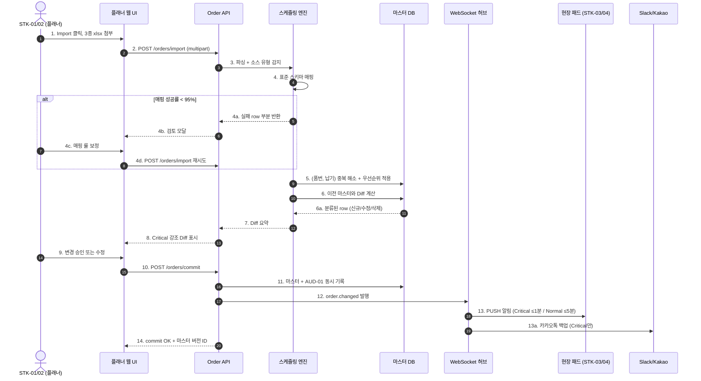

#### 3.4.2 시퀀스 S-02: 성형 후보 생성 및 확정 (US-02, US-03)

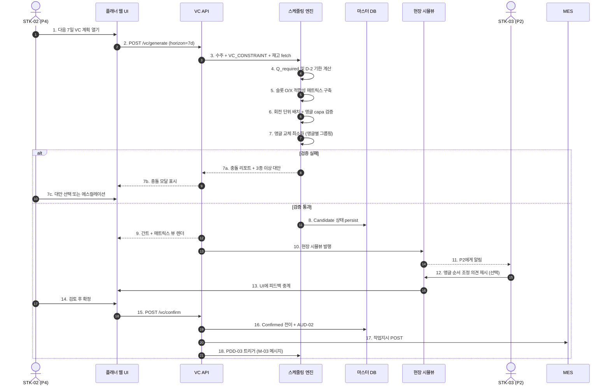

#### 3.4.3 시퀀스 S-03: 성형 변경에 따른 압출 자동 재계획 (US-04)

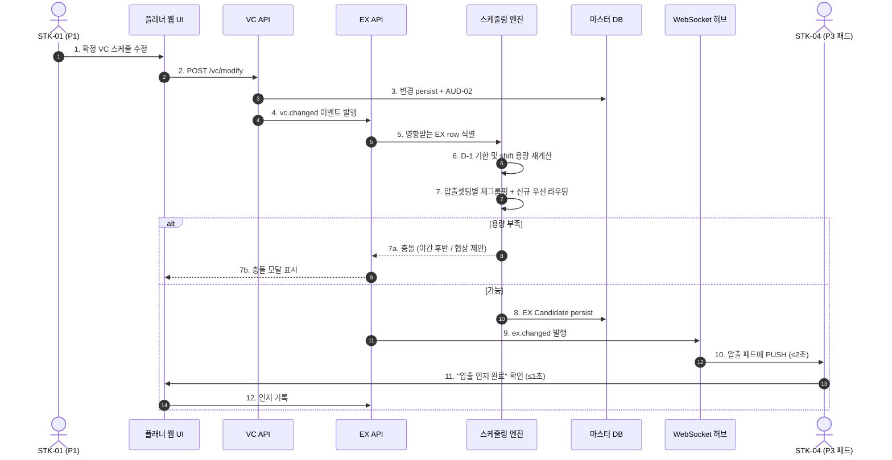

### 3.5 유스케이스 다이어그램 (Use Case Diagram)

> Mermaid `flowchart`로 UML 유스케이스 다이어그램을 대체. 액터(좌·우)와 유스케이스(중앙)를 연결. 점선 박스가 시스템 경계.

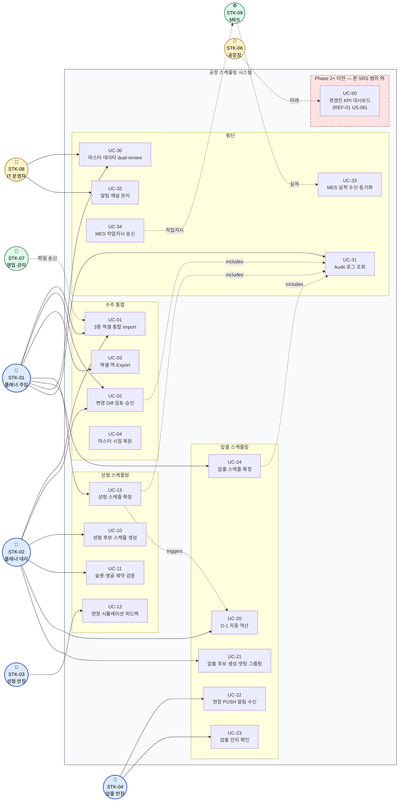

#### 3.5.1 유스케이스 ↔ 요구사항 매핑

| UC ID | 유스케이스 | 1차 액터 | 연결 REQ-FUNC |
|-------|---------|--------|-------------|
| UC-01 | 3종 엑셀 통합 Import | P4 (P1 감독) | OC-001~004 |
| UC-02 | 변경 Diff 검토·승인 | P1 | OC-005~012 |
| UC-03 | 엑셀 역-Export | P1 | OC-013 |
| UC-04 | 마스터 시점 복원 | P1 | OC-014 (XT-002) |
| UC-10 | 성형 후보 스케줄 생성 | P4 | VC-001~011 |
| UC-11 | 슬롯·앵글 제약 검증 | P4 | VC-002·004·005·007·013·014·015·016 |
| UC-12 | 현장 시뮬레이션 피드백 | P2 | VC-017·018 |
| UC-13 | 성형 스케줄 확정 | P1 | VC-019·020, CO-010 |
| UC-20 | D-1 자동 역산 | P4 | EX-001·002·013 |
| UC-21 | 압출 후보 생성·셋팅 그룹핑 | P4 | EX-003~012 |
| UC-22 | 현장 PUSH 알림 수신 | P3 | EX-014·015 |
| UC-23 | 압출 인지 확인 | P3 | EX-016 |
| UC-24 | 압출 스케줄 확정 | P1 | EX-017~020 |
| UC-30 | 마스터 데이터 dual-review | IT / P1 | CO-002 |
| UC-31 | Audit 로그 조회 | P1 / 감사자 | CO-005·006, OC-012, VC-020, EX-020 |
| UC-32 | 알림 채널 관리 | IT | CO-008, OC-010, NFR-OPS-003 |
| UC-33 | MES 실적 수신·동기화 | MES (외부) | CO-003·004 |
| UC-34 | MES 작업지시 송신 | 시스템 → MES | VC-019, EX-019 |
| UC-90 | 경영진 KPI 대시보드 | P11 | **Phase 2+ (US-06 / OS-03)** |

> 적용 범위 19개 UC가 REF-01 §16의 7개 사용자 스토리를 커버. UC-90은 Phase 1 명시적 제외 (US-06 이연).

---

## 4. 구체 요구사항 (Specific Requirements)

> 식별자 규칙: 기능은 `REQ-FUNC-<모듈>-<NNN>`, 비기능은 `REQ-NF-<그룹>-<NNN>`.
> 모듈 코드: OC (수주 통합), VC (성형), EX (압출), CO (횡단), XT (Could 등급 확장).
> NFR 그룹: PER (성능), REL (신뢰성), SEC (보안), USA (사용성), OPS (운영·모니터링), COM (호환성·확장성), COS (비용), KPI (사업 KPI).

### 4.1 기능 요구사항 (Functional Requirements)

> **출처 식별자 규약 (REF chain).** `Source` 컬럼의 모든 식별자는 다음 체인에 적합한다.
>
> | 출처 토큰 | 정의 위치 | 섹션 |
> |---------|--------|-----|
> | `US-NN` (사용자 스토리) | REF-01 | §16 |
> | `M-NN`, `S-NN`, `C-NN` (MoSCoW 기능) | REF-01 | §17.1–17.3 |
> | `BR-X-NN` (횡단 BR) | REF-01 | §9.1 |
> | `BR-O-NN`, `BR-V-NN`, `BR-E-NN` | REF-01 | §9.2–9.4 |
> | `CON-NN` | REF-01 §15 ADR (본 SRS §1.5) | |
> | `BR-V-NN` 도메인 근거 | REF-09, REF-11 | 제약 시트·프롬프트 |
> | `BR-E-NN` 도메인 근거 | REF-10, REF-12 | 제약 시트·프롬프트 |
>
> **검증 방법.** 각 `REQ-FUNC-*`의 검증 기법 통합 매핑은 **§4.1.6**. ISO/IEC/IEEE 29148:2018 Annex C 카테고리: **I** Inspection · **A** Analysis · **D** Demonstration · **T** Test (T-U Unit / T-I Integration / T-L Load / T-S Soak / T-UAT).

#### 4.1.1 수주 통합 (OC)

| Req ID | 제목 | 설명 | 출처 | 우선순위 | 인수 기준 |
|--------|------|------|------|:------:|---------|
| REQ-FUNC-OC-001 | 다중 파일 업로드 | 시스템은 웹 UI를 통해 최대 3종의 엑셀 워크북(`.xlsx`, 각 ≤20MB) 동시 업로드를 수용해야 한다 | US-01 / M-01 | Must | 3종 워크북 선택 후 Import 클릭 시 시스템이 2초 이내 추적 ID를 반환한다 |
| REQ-FUNC-OC-002 | 소스 유형 자동 감지 | 시스템은 헤더 시그니처로 업로드 워크북을 {월별 예상, KD 발주, 주간 발주} 중 하나로 분류해야 한다 | US-01 / M-01 | Must | 30개 워크북 회귀 테스트에서 분류 정확도 ≥99% |
| REQ-FUNC-OC-003 | 표준 스키마 매핑 | 시스템은 파싱된 row를 구성 가능한 매핑 룰을 통해 표준 수주 스키마(`order_id`·`hose_id`·`delivery_date`·`qty`·`order_type`·`customer`)로 변환해야 한다 | US-01 / M-01 | Must | 회귀 세트에서 자동 매핑 성공률 ≥95% (US-01 AC-1) |
| REQ-FUNC-OC-004 | 매핑 보정 워크플로우 | 매핑 실패율이 1% 이상이면 시스템은 매핑 룰 보정 후 파싱 데이터를 잃지 않고 재시도할 수 있는 검토 모달을 제시해야 한다 | US-01 / M-01 | Must | 부분 실패 응답 후 룰 조정 시 재Import가 직전 세션 상태를 보존한다 |
| REQ-FUNC-OC-005 | 복합키 기반 중복 감지 | 시스템은 표준 스키마 매핑 후 `(hose_id, delivery_date)` 복합키로 중복을 감지해야 한다 | US-01 / M-02 | Must | 100회 회귀 사이클에서 커밋된 마스터에 중복 0건 |
| REQ-FUNC-OC-006 | 우선순위 기반 중복 해소 | 시스템은 `order_type` 우선순위 Confirmed > Weekly > KD > Forecast로 중복을 해소해야 한다 (BR-O01) | US-01 / M-02 | Must | 두 row가 동일 복합키일 때 상위 우선순위가 승리하고 우선순위 로그가 기록된다 |
| REQ-FUNC-OC-007 | 버전 Diff 계산 | 시스템은 후보 Import와 이전 마스터 버전 간 row 단위 Diff를 계산하여 각 row를 신규/수정(필드별)/삭제로 분류해야 한다 | US-01 / M-03 | Must | 의도적 변형 회귀 세트에서 감지 정확도 100% (US-01 AC-2) |
| REQ-FUNC-OC-008 | Critical 변경 분류 | 시스템은 납기 변경, 수량 ±20% 이상 변경, 품번 변경 시 Critical로 표시해야 한다 (BR-O02) | US-01 / M-03 | Must | Critical 회귀 케이스 모두 정확 태깅, false negative 0 |
| REQ-FUNC-OC-009 | Critical 변경 알림 발송 | 시스템은 커밋 후 1분 이내 영향받는 하류 lane에 Critical 알림을, 5분 이내 일반 알림을 발송해야 한다 | US-01 AC-3 / M-03 / BR-O04 | Must | 100건 시뮬레이션에서 명시 SLO 이내 도달률 ≥99% |
| REQ-FUNC-OC-010 | 카카오톡 백업 알림 | 시스템은 Critical 이벤트에 대해 인앱 알림 외에 카카오톡 백업 메시지를 발송해야 한다 | S-04 | Should | Critical 이벤트 인앱 발송 후 카카오톡 발송 및 도달 상태가 로그된다 |
| REQ-FUNC-OC-011 | 수주 마스터 커밋 게이트 | 시스템은 사용자 명시 승인 없이 수주 마스터 변경을 커밋해서는 안 된다 (BR-X01) | US-01 / M-10 | Must | 승인 토큰 없는 직접 API 호출이 모든 시도에서 HTTP 403으로 거부된다 |
| REQ-FUNC-OC-012 | 수주 변경 audit 기록 | 시스템은 모든 커밋된 변경에 대해 actor·timestamp·severity·필드별 before/after를 포함하는 audit 레코드(`ORDER_CHANGE`)를 기록해야 한다 | US-05 / M-11 / AUD-01 | Must | audit row 없이 커밋 성공이 0건, DB 제약으로 강제 |
| REQ-FUNC-OC-013 | 엑셀 역-Export | 시스템은 선택된 마스터 버전을 원본 소스 포맷에 적합한 워크북으로 export하며, 수식이 있으면 보존해야 한다 | US-01 AC-4 / M-12 | Must | 회귀 워크북에서 수식 보유 셀 제외 셀-수준 차이 ≤2% |
| REQ-FUNC-OC-014 | 시점 마스터 복원 | 시스템은 audit 이력을 사용하여 임의 과거 시점의 마스터 상태를 복원해야 한다 | US-05 AC-2 / C-02 | Could | 요청 시점에 대해 라이브 스냅샷과 100% 일치 |
| REQ-FUNC-OC-015 | 폴더 폴링 자동 송신 | 시스템은 설정된 폴더에 영업이 드롭한 워크북을 폴링하여 수동 업로드 없이 ingest 할 수 있어야 한다 | US-07 / C-03 | Could | watch 폴더에 배치된 파일이 60초 이내 큐 등록 |

#### 4.1.2 성형 스케줄링 (VC)

| Req ID | 제목 | 설명 | 출처 | 우선순위 | 인수 기준 |
|--------|------|------|------|:------:|---------|
| REQ-FUNC-VC-001 | 슬롯 O/X 적합성 매트릭스 | 시스템은 `VC_CONSTRAINT`의 컬럼(lp_slot_top, lp_slot_upmid, lp_slot_lowmid, lp_slot_bot, ic_slot_top, ic_slot_mid, ic_slot_bot)으로부터 (hose_id × 가류기 유형 × 슬롯 위치) 적합성 매트릭스를 구축해야 한다 | US-02 / M-04 | Must | 마스터 변경 시 매트릭스 1초 이내 재구축, `/api/v1/master/compat`로 노출 |
| REQ-FUNC-VC-002 | 슬롯 위반 감지 | 시스템은 적합성 셀이 `false`인 (hose_id, 슬롯 위치) 할당을 거부해야 한다 | US-02 AC-1 / M-04 / BR-V01 | Must | 100건 회귀 배치에서 슬롯 O/X 위반 0건 |
| REQ-FUNC-VC-003 | 스케줄 불가 품번 제외 | 시스템은 저압·IC 모두에서 적합성 false인 품번을 스케줄 불가로 표시하고 후보 생성에서 제외해야 한다 | US-02 / M-04 / BR-V11 | Must | `7X375-H0020`·`28415-08400` 등이 스케줄 대신 예외 리포트에 나타난다 |
| REQ-FUNC-VC-004 | 드래그 앤 드롭 위반 가드 | 플래너 웹 UI는 사용자가 비적합 (hose_id, 슬롯) 조합을 드래그할 때 1초 이내 경고 아이콘을 표시하고 저장을 차단해야 한다 | US-02 AC-4 | Must | UI 응답 중앙값 ≤1초, 감지율 100% |
| REQ-FUNC-VC-005 | 회전 단위 용량 모델 | 시스템은 1일 가류기당 18회전(주간 8 + 야간 10)으로 모델링하여 일일 총 용량 = 저압 fleet 72회전 + IC 18회전을 적용해야 한다 | US-02 / M-05 / BR-V04, BR-V05 | Must | 스케줄 출력 키에 `(date, rotation_no ∈ 1..18, machine_id, slot_position)` 포함 |
| REQ-FUNC-VC-006 | 회전당 yield 계산 | 시스템은 회전당 yield = `합금형(composite_count) × 앵글당 금형수(active 기계 유형의 molds_per_angle)`로 계산해야 한다 | US-02 / M-05 / BR-V03 | Must | `29673-2R060`의 저압 composite_count=1, lp_molds_per_angle=1 → yield 1 (단위 테스트 검증) |
| REQ-FUNC-VC-007 | 앵글 가용량 제약 | 시스템은 hose_id를 동시 점유하는 슬롯 총 수가 앵글 보유량(`lp_angle_qty`(F열) 또는 `ic_angle_qty`(N열))을 초과하지 않도록 보장해야 한다 | US-02 / M-05 / BR-V06 | Must | 의도적 stress 입력 회귀에서 앵글 과초과 점유 0건 |
| REQ-FUNC-VC-008 | 역산 기한 도출 (D-2) | 시스템은 성형 완료 기한을 `납기 − 2 영업일`로 설정해야 한다 | US-03 / M-06 / BR-X07 | Must | 모든 스케줄 row가 `완료일 ≤ 납기 − 2` 만족 |
| REQ-FUNC-VC-009 | 필요 수량 계산 | 시스템은 품번별 `Q_required = max(0, Q_net + target_stock − current_stock)`을 계산해야 한다 (Q_net = 호라이즌 내 통합 수주량) | US-02 / M-05 | Must | 재고 동등·잉여·부족·목표 0의 4종 단위 테스트 통과 |
| REQ-FUNC-VC-010 | 회전 배치 알고리즘 | 시스템은 품번별 (가류기, 슬롯, 회전) 튜플을 할당하여 누적 yield가 기한 이전 Q_required를 충족하도록 해야 한다 | US-02 / M-05 | Must | 100건 회귀에서 가용 용량 내 0건 위반 |
| REQ-FUNC-VC-011 | 저압 vs IC 라우팅 | 시스템은 두 유형 모두 가능한 hose_id를 저압 우선 배정하고, 저압 회전이 포화된 경우에만 IC로 폴백해야 한다 (BR-V08) | M-05 | Must | 회귀의 라우팅 로그에서 저압 포화 이후에만 IC 사용 |
| REQ-FUNC-VC-012 | **(v1.4 재정의)** 당일 앵글 락 강제 | 시스템은 동일 영업일 내(rotation 1~18) 한 (machine_id, slot_position)에 배정된 모든 회전이 동일 앵글(동일 hose_id)을 사용해야 한다고 강제해야 한다. 일중 앵글 교체가 발생하는 후보는 hard 위반으로 거부한다 (BR-V07 신규 정의) | M-05 / BR-V07 | Must | 1주 호라이즌 회귀에서 모든 (machine, slot, business-day) 튜플의 일중 앵글 교체 이벤트 0건 |
| REQ-FUNC-VC-013 | **(v1.4 재정의)** 일말 앵글 교체 경계 | 시스템은 앵글 교체를 **rotation 18 종료 ~ 다음 영업일 rotation 1 개시 사이**에만 발생하도록 스케줄해야 하며, `DO-04` 앵글 교체 계획을 영업일 경계 단위로 출력해야 한다 (BR-V07) | M-05 / BR-V07 | Must | DO-04 모든 row의 교체 시점이 영업일 경계 내, 회전 단위 audit 통과 |
| REQ-FUNC-VC-014 | **(v1.4 재정의)** 일중 교체 시도 차단 + override | 시스템은 사용자가 일중 앵글 교체가 필요한 후보를 저장하려 할 때 **저장을 차단**해야 하며, override 시 사유 입력(REQ-FUNC-CO-010) + audit 기록을 강제해야 한다 | US-02 AC-5 / BR-V07 | Must | 일중 교체 시도 100% 차단, override 시 사유 없는 커밋 거부 |
| REQ-FUNC-VC-015 | 대안 포함 충돌 리포트 | 검증 게이트 실패 시 시스템은 실패 유형을 분류하고 최소 3종 대안(예: 야간 추가, 납기 협상, IC 라우팅)을 제시하는 충돌 리포트를 반환해야 한다 | US-02 AC-2 | Must | 모든 충돌 리포트가 ≥3개 distinct 대안 포함 |
| REQ-FUNC-VC-016 | 전체 스케줄 제약 검사 | 시스템은 on-demand 전체 스케줄 제약 검사를 3초 이내 모든 위반과 함께 반환해야 한다 | US-02 AC-6 | Should | 1주 호라이즌에서 측정된 p95 ≤3초 |
| REQ-FUNC-VC-017 | 현장 시뮬뷰 발행 | 시스템은 각 Candidate 스케줄을 회전 단위 세분도로 STK-03 전용 시뮬뷰에 발행해야 한다 | US-03 / S-03 | Should | Candidate persist 후 2초 이내 시뮬뷰 접근 가능 |
| REQ-FUNC-VC-018 | 현장 피드백 채널 | 시뮬뷰는 STK-03이 총량 변경 없이 앵글 순서 조정을 제안하고 플래너가 1클릭으로 수용 가능하게 해야 한다 | US-03 / S-03 | Should | 1클릭 수용 시 총량 변경 없이 제안 순서 persist |
| REQ-FUNC-VC-019 | 사용자 확정 게이트 (VC) | 시스템은 Planner 역할 사용자의 명시적 승인 없이 Candidate → Confirmed 전이를 허용해서는 안 된다 | M-10 / CON-07 | Must | 승인 API 외부의 직접 DB 쓰기가 RBAC + 트리거로 차단 |
| REQ-FUNC-VC-020 | 성형 audit 기록 | 모든 `VC_SCHEDULE` row의 전이 또는 수정은 actor·timestamp·before/after를 포함하는 `VC_AUDIT` 레코드를 생성해야 한다 | M-11 / AUD-02 | Must | DB 제약이 audit 없는 커밋을 차단, 통합 테스트로 검증 |
| **REQ-FUNC-VC-021** | **(신규 v1.4)** 좌/우 슬롯 측면 제약 | 시스템은 `VC_CONSTRAINT.lp_left_setting`(K열, `좌측셋팅`)·`lp_right_setting`(L열, `우측셋팅`) 컬럼을 활용하여 품번을 (a) `K=o, L=x`인 경우 좌측 슬롯에만, (b) `K=x, L=o`인 경우 우측 슬롯에만, (c) `K=o, L=o`인 경우 양측 모두 배정 가능하도록 제약해야 한다 | M-04 / BR-V15 / BR-V16 | Must | 회귀 100건에서 좌/우 위반 0건, `28421-2M800`은 좌측 only·`28422-2M800`은 우측 only로 배정됨 |
| **REQ-FUNC-VC-022** | **(신규 v1.4, deferred)** capa 초과 시 우선순위 추가요청 큐 | `Σ Q_required > daily_capa(저압 72 + IC 18)`인 경우 시스템은 `PRODUCT_PRIORITY` 마스터에 따라 (a) capa 내 자동 채택분과 (b) **추가 요청 큐**로 분리하고, (b)를 사용자에게 명시적 승인/거부 요청해야 한다. **활성 조건: 수주정보 통합 작업 완료 후** | BR-V12 | Should (활성 후 Must 승격) | 수주통합 후 회귀: capa 초과 케이스 100%에서 우선순위 큐 생성 + 사용자 승인 게이트 동작 |
| **REQ-FUNC-VC-023** | **(신규 v1.4, deferred)** capa 부족 시 KD 발주 보충 | `Σ Q_required < daily_capa`인 경우 시스템은 `KD_ORDER` 잔량을 우선 (i) 동일 hose_id → (ii) 동일 셋팅 그룹 순으로 참조하여 부족분을 자동 채워야 한다. **활성 조건: 수주정보 통합 작업 완료 후** | BR-V13 | Should (활성 후 Must 승격) | 수주통합 후 회귀: capa 부족 케이스 100%에서 KD 잔량 100% 활용까지 시도, 우선순위 순서 audit 검증 |
| **REQ-FUNC-VC-024** | **(신규 v1.4)** `28422-08HA0` 호기 단일 셋팅 | 시스템은 hose_id `28422-08HA0`를 (a) 저압 가류기에서만 생산하고, (b) 저압 4대 중 **LP-01 가류기의 1개 슬롯에만** 동시 배정 가능하도록 강제해야 한다. 다른 LP 호기(LP-02~04) 또는 동시 다중 슬롯 배정은 hard 위반 | BR-V14 | Must | 회귀에서 `28422-08HA0`의 LP-02~04 배정 0건, LP-01 동시 다중 슬롯 0건 |
| **REQ-FUNC-VC-025** | **(신규 v1.4)** `28422-2M800` 우측 + 앵글 ≤ 2 | 시스템은 hose_id `28422-2M800`을 (a) 저압 우측 슬롯(`L=o`)에만, (b) 동시 점유 슬롯 ≤ 2로 제약해야 한다. (a)는 BR-V15·VC-021과 결합, (b)는 앵글 보유수량과 별개의 품번단위 상한 | BR-V15 | Must | 회귀에서 `28422-2M800` 좌측 배정 0건, 동시 점유 ≤ 2 |
| **REQ-FUNC-VC-026** | **(신규 v1.4)** `28421-2M800` 좌측 + 앵글 ≤ 2 | 시스템은 hose_id `28421-2M800`을 (a) 저압 좌측 슬롯(`K=o`)에만, (b) 동시 점유 슬롯 ≤ 2로 제약해야 한다 | BR-V16 | Must | 회귀에서 `28421-2M800` 우측 배정 0건, 동시 점유 ≤ 2 |
| **REQ-FUNC-VC-027** | **(신규 v1.4)** 규격<7 가류기당 앵글 ≤ 4 (압출 cross-reference) | 시스템은 압출 제약 마스터(`EX_CONSTRAINT.spec`(B열, `규격`)) 값이 `< 7`인 hose_id에 대해 1대 가류기당(저압 LP-01~04 각·IC 1대) **동시 앵글 점유 ≤ 4**로 제약해야 한다. 근거: 4앵글 초과 시 금형온도 하락→호싱불량률 상승 (현장 운영 데이터) | BR-V17 / REF-10 | Must | 압출 마스터 join 후 회귀에서 위반 0건, 규격<7 품번 100% 식별 |

#### 4.1.3 압출 스케줄링 (EX)

| Req ID | 제목 | 설명 | 출처 | 우선순위 | 인수 기준 |
|--------|------|------|------|:------:|---------|
| REQ-FUNC-EX-001 | D-1 기한 도출 | 시스템은 압출 완료 기한을 `vc_production_date − 1 영업일`로 계산해야 한다 | US-04 / M-07 / BR-E01 | Must | 모든 EX row가 `완료일 ≤ vc_production_date − 1` 만족 |
| REQ-FUNC-EX-002 | 영업일 캘린더 (월~금) | 시스템은 토·일을 압출 캘린더에서 제외해야 한다 (BR-E02) | M-07 / CON-10 | Must | 주말 기한 회귀에서 직전 금요일로 이전 |
| REQ-FUNC-EX-003 | 4-shift 모델 | 시스템은 1일 4 shift를 4h / 4h / 4.5h / 5h 구성으로 모델링해야 한다 | M-08 / BR-E03 | Must | `/api/v1/master/shifts` 반환값이 공시값과 일치 |
| REQ-FUNC-EX-004 | 효율 75% 적용 | 시스템은 유효 분 계산 시 shift 시간에 0.75 효율 배수를 적용해야 한다 | M-08 / BR-E04 / ASM-07 | Must | 주간 전반 유효 분 = 4 × 60 × 0.75 = 180 |
| REQ-FUNC-EX-005 | 압출 yield 수식 | 시스템은 yield를 `floor(extrusion_speed × effective_minutes × 1000 / cut_length)`로 계산해야 한다 | M-08 / BR-E05 | Must | `29673-2R060` 주간 전반 = 2,531개 (REF-12 검증) |
| REQ-FUNC-EX-006 | shift 내 무 셋업 | 시스템은 shift 내 셋업 변경을 도입해서는 안 되며, 셋업은 shift 경계에서만 허용된다 (BR-E06) | M-09 | Must | 4주 회귀에서 shift 내 셋업 이벤트 0건 |
| REQ-FUNC-EX-007 | 셋팅 번호 그룹핑 | 시스템은 동일 `extrusion_setting`(1–8)을 공유하는 품번을 같은 shift로 묶어 셋업 없이 동시 생산 가능하게 해야 한다 (BR-E07) | M-09 | Must | 모든 shift가 정확히 하나의 셋팅 그룹 포함, audit 쿼리로 검증 |
| REQ-FUNC-EX-008 | 신규 라인 우선 라우팅 | 시스템은 두 라인 모두 가능한 품번을 신규 우선 라우팅하고, 신규 포화 시에만 포드로 폴백해야 한다 (BR-E08) | M-07 / S-02 / CON-06 | Should | 회귀에서 신규 가능 품번 중 신규 사용률 ≥90% |
| REQ-FUNC-EX-009 | 포드 전용 라우팅 | 시스템은 포드만 가능한 품번을 무조건 포드로 라우팅해야 한다 | M-07 / S-02 | Must | 100건 회귀에서 포드 전용 품번의 신규 배정 0건 |
| REQ-FUNC-EX-010 | 필요 수량 계산 | 시스템은 `Q_ext = max(0, Q_vc_input + tube_target_stock − tube_current_stock)`을 계산해야 한다 | M-08 | Must | REQ-FUNC-VC-009와 대칭 4종 단위 테스트 |
| REQ-FUNC-EX-011 | 검증 게이트 | 시스템은 누적 shift yield가 기한 이전 Q_ext를 충족하고 shift 용량을 초과하지 않는지 검증해야 한다 | M-07 | Must | 후보당 pass/fail 결과를 2초 p95 이내 반환 |
| REQ-FUNC-EX-012 | 충돌 대안 | 게이트 실패 시 시스템은 더 일찍 시작, 야간 후반 활용, 성형 투입일 협상, 외주 등의 대안을 제시해야 한다 | M-07 | Must | 모든 실패 케이스가 ≥3개 대안 생성 |
| REQ-FUNC-EX-013 | 성형 변경 자동 트리거 | 시스템은 `vc.changed` 이벤트 수신 시 수동 호출 없이 영향 EX row를 재계산해야 한다 | US-04 / M-07 / BR-X03 | Must | 100건 시뮬레이션에서 영향 케이스 100% 재계획 트리거 |
| REQ-FUNC-EX-014 | 압출 패드 PUSH 알림 | 시스템은 성형 변경 PUSH를 WebSocket으로 압출 패드에 2초 p95 이내 전달해야 한다 | US-04 AC-1 / CON-03 | Must | soak 테스트에서 중앙값 2초, p95 ≤2초 |
| REQ-FUNC-EX-015 | 관체 부족 붉은 깜빡임 | 시스템은 현 재고가 신규 요구량을 충당하지 못할 때 영향 관체 row에 붉은 깜빡임 표시를 띄워야 한다 | US-04 AC-4 | Should | 100건 회귀에서 오탐율 <0.1% |
| REQ-FUNC-EX-016 | 인지 확인 캡처 | 시스템은 현장반장의 "압출 인지 완료" 확인을 1초 이내 기록해야 한다 | US-04 AC-5 | Must | UI 라운드트립 ≤1초 p95, audit trail 반영 |
| REQ-FUNC-EX-017 | 성형 현장 관체 통지 | 시스템은 압출 확정 시 성형 현장 뷰(DO-06)에 관체 도착 예정을 통지해야 한다 | US-04 AC-6 / M-07 | Must | 확정 후 5초 이내 STK-03 뷰에 도달 |
| REQ-FUNC-EX-018 | 매트릭스 뷰 (일자 × shift × 라인) | 시스템은 확정 압출 계획의 일자 × shift × 라인 매트릭스 뷰를 제공하고 `*월*일(압출)` 시트명으로 export 가능해야 한다 (BR-E09) | S-05 / M-12 | Should | export된 시트명이 정규식 `\d+월\d+일\(압출\)`에 일치 |
| REQ-FUNC-EX-019 | 압출 확정 게이트 | 시스템은 사용자 명시 승인 없이 Candidate → Confirmed 전이를 허용해서는 안 된다 (BR-X01) | M-10 | Must | RBAC + 트리거로 직접 DB 쓰기 차단 |
| REQ-FUNC-EX-020 | 압출 audit 기록 | 모든 `EX_SCHEDULE` 변경은 `EX_AUDIT` 레코드를 생성해야 한다 (AUD-03) | M-11 | Must | DB 제약이 audit 없는 커밋 차단 |

#### 4.1.4 횡단 공통 (CO)

| Req ID | 제목 | 설명 | 출처 | 우선순위 | 인수 기준 |
|--------|------|------|------|:------:|---------|
| REQ-FUNC-CO-001 | RBAC | 시스템은 다음 역할의 RBAC를 구현해야 한다: Planner (STK-01·02), Floor Supervisor (STK-03·04), IT Operator (STK-08), Read-only (STK-05) | NFR-SEC | Must | 각 역할의 권한 매트릭스 강제, 미인가 액션은 HTTP 403 반환 |
| REQ-FUNC-CO-002 | 마스터 데이터 dual-review | 시스템은 `VC_CONSTRAINT`·`EX_CONSTRAINT`·가류기 구성 변경에 대해 서로 다른 인증된 2명의 승인자를 요구해야 한다 | CON-08 / BR-X05 | Must | 동일 actor의 양쪽 승인은 거부 |
| REQ-FUNC-CO-003 | MES 실적 수신 | 시스템은 회전(VC) 또는 shift(EX) 단위 MES 실적을 수신하고 누적 완료량을 조정해야 한다 | M-07 / M-08 | Must | 같은 영업일에 수신한 실적은 다음 계획 사이클 전 조정 완료 |
| REQ-FUNC-CO-004 | MES 장애 폴백 | 1 shift 이상 MES 실적이 수신되지 않으면 시스템은 직전 계획값을 임시값으로 사용하고 재개 시 재조정해야 한다 (BR-X06) | CON-08 | Must | 장애 시뮬레이션에서 수동 개입 없이 정확 재조정 |
| REQ-FUNC-CO-005 | Audit 불변성 | 시스템은 audit 레코드의 UPDATE 또는 DELETE 시도를 거부해야 한다. audit 테이블은 INSERT만 허용된다 | BR-X02 / NFR-SEC-004 | Must | DB role 정책이 UPDATE/DELETE 거부, negative 테스트로 검증 |
| REQ-FUNC-CO-006 | Audit 결합 커밋 | 시스템은 동일 트랜잭션에서 매칭 audit row를 기록하지 않는 모든 커밋을 거부해야 한다 | BR-X02 | Must | 트랜잭션 테스트로 원자성 확인 |
| REQ-FUNC-CO-007 | 시간 기준 통일 | 시스템은 모든 스케줄 연산·표시·audit timestamp에 KST(UTC+9)를 사용해야 한다 | CON-09 / BR-X04 | Must | DST 영향 없음(KST), 경계 일자 단위 테스트 |
| REQ-FUNC-CO-008 | 알림 도달 추적 | 시스템은 발송된 모든 알림의 도달 상태(sent·acknowledged·failed)를 기록해야 한다 | US-04 AC-5 / NFR-OPS | Must | 모든 시도된 도달의 상태 필드 100% 채워짐 |
| REQ-FUNC-CO-009 | 한국어 UI | 모든 사용자 대면 텍스트(에러·툴팁 포함)는 한국어로 제공되어야 한다 | NFR-USA-003 | Must | UI 스냅샷 리뷰로 한국어 커버리지 확인 |
| REQ-FUNC-CO-010 | 사용자 override 모달 | 사용자가 위반을 명시적으로 override(예: 앵글 교체 과다)할 때 시스템은 audit에 저장될 사유 텍스트 입력을 요구해야 한다 | US-02 AC-4, AC-5 | Must | 사유 없는 override 차단 |

#### 4.1.5 Could 등급 확장 (XT)

| Req ID | 제목 | 설명 | 출처 | 우선순위 | 인수 기준 |
|--------|------|------|------|:------:|---------|
| REQ-FUNC-XT-001 | 다중 후보 ranking | 시스템은 (1) 기한 충족, (2) 앵글 교체 수, (3) 용량 균형으로 ranking된 N개 후보 스케줄을 제공할 수 있어야 한다 | C-01 | Could | 가능 시 요청당 ≥3개 후보 반환 |
| REQ-FUNC-XT-002 | 마스터 시점 UI | UI는 임의 timestamp 선택으로 과거 마스터 상태 조회를 허용해야 한다 | C-02 / US-05 AC-2 | Could | 과거 5년 이내 임의 시점에서 5초 이내 복원 |
| REQ-FUNC-XT-003 | 폴더 watch 자동 송신 | 와치독은 설정된 폴더에 드롭된 엑셀 파일을 ingest하여 파싱 큐에 등록해야 한다 | C-03 / US-07 | Could | 파일 시스템 close 이벤트 후 60초 이내 큐 등록 |

> 기능 요구사항 합계: **OC 15 + VC 27 + EX 20 + CO 10 + XT 3 = 75개** (v1.4: VC +7).

#### 4.1.6 검증 방법 카탈로그

> ISO/IEC/IEEE 29148:2018 Annex C 검증 카테고리.
> 약자: **I** Inspection · **A** Analysis · **D** Demonstration · **T-U** Unit Test · **T-I** Integration · **T-L** Load · **T-S** Soak · **T-UAT** UAT.

| Req ID | AC 검증 내용 | 1차 방법 | 2차 | REF 출처 |
|--------|-----------|:------:|:--:|---------|
| REQ-FUNC-OC-001 | 3종 워크북 2초 이내 추적 ID | T-L | T-I | REF-01 §16 US-01 AC-1 |
| REQ-FUNC-OC-002 | 30개 회귀 ≥99% 분류 | T-U + A | I | REF-01 §17 M-01 |
| REQ-FUNC-OC-003 | 자동 매핑 ≥95% | T-U | A | REF-01 §16 US-01 AC-1 |
| REQ-FUNC-OC-004 | 매핑 보정 라운드트립 세션 보존 | T-I | T-UAT | REF-01 §17 M-01 |
| REQ-FUNC-OC-005 | 100사이클 중복 0 | T-U | A | REF-01 §17 M-02 |
| REQ-FUNC-OC-006 | 우선순위 해소 로그 생성 | T-U | I | REF-01 §9.2 BR-O01 |
| REQ-FUNC-OC-007 | 변형 회귀 100% diff 감지 | T-U | T-I | REF-01 §16 US-01 AC-2 |
| REQ-FUNC-OC-008 | Critical 태깅 zero-FN | T-U | A | REF-01 §9.2 BR-O02 |
| REQ-FUNC-OC-009 | 100건 시뮬 SLA ≥99% | T-L | T-S | REF-01 §16 US-01 AC-3 |
| REQ-FUNC-OC-010 | 카카오톡 도달 로그 | T-I | D | REF-01 §17 S-04 |
| REQ-FUNC-OC-011 | 토큰 없는 커밋 403 | T-U | T-I | REF-01 §9.1 BR-X01 |
| REQ-FUNC-OC-012 | audit row 없는 커밋 실패 | T-I | I | REF-01 §9.1 BR-X02 |
| REQ-FUNC-OC-013 | 셀-수준 차이 ≤2% | T-U | I | REF-01 §16 US-01 AC-4 |
| REQ-FUNC-OC-014 | 100% 복원 정합 | T-U | A | REF-01 §17 C-02 |
| REQ-FUNC-OC-015 | 60초 이내 큐 등록 | T-I | D | REF-01 §17 C-03 |
| REQ-FUNC-VC-001 | 마스터 변경 시 매트릭스 ≤1초 | T-L | T-U | REF-09, REF-11 |
| REQ-FUNC-VC-002 | 100건 배치 위반 0 | T-U | I | REF-01 §9.3 BR-V01, REF-09 |
| REQ-FUNC-VC-003 | zero 슬롯 품번 예외 리포트 | I | T-U | REF-01 §9.3 BR-V11, REF-09 |
| REQ-FUNC-VC-004 | UI ≤1초, 감지 100% | T-UAT | T-L | REF-01 §16 US-02 AC-4 |
| REQ-FUNC-VC-005 | (date·rotation·machine·slot) 키 포함 | I | T-U | REF-01 §9.3 BR-V04/V05, REF-11 |
| REQ-FUNC-VC-006 | yield 단위 테스트 통과 | T-U | A | REF-01 §9.3 BR-V03, REF-11 |
| REQ-FUNC-VC-007 | 앵글 과초과 점유 0 | T-U | A | REF-01 §9.3 BR-V06, REF-11 |
| REQ-FUNC-VC-008 | 모든 row ≤ D-2 | T-U | T-I | REF-01 §9.1 BR-X07 |
| REQ-FUNC-VC-009 | 4종 재고 케이스 단위 테스트 | T-U | A | REF-01 §17 M-05 |
| REQ-FUNC-VC-010 | 100건 회귀 위반 0 | T-U | T-L | REF-01 §17 M-05 |
| REQ-FUNC-VC-011 | 저압 포화 후에만 IC 사용 | T-U + I | A | REF-01 §9.3 BR-V08 |
| REQ-FUNC-VC-012 | (v1.4) 1주 호라이즌 일중 교체 0건 | T-U + T-I | A | REF-01 §9.3 BR-V07 (재정의) |
| REQ-FUNC-VC-013 | (v1.4) DO-04 영업일 경계 row 검증 | T-U | I | REF-01 §9.3 BR-V07 |
| REQ-FUNC-VC-014 | (v1.4) 일중 교체 시도 100% 차단 + override 사유 강제 | T-UAT | T-I | REF-01 §16 US-02 AC-5 |
| REQ-FUNC-VC-015 | 실패당 ≥3 대안 | I | T-U | REF-01 §16 US-02 AC-2 |
| REQ-FUNC-VC-016 | 지연 p95 ≤3초 | T-L | T-S | REF-01 §16 US-02 AC-6 |
| REQ-FUNC-VC-017 | 시뮬뷰 도달 ≤2초 | T-L | T-UAT | REF-01 §17 S-03 |
| REQ-FUNC-VC-018 | 1클릭 수용 총량 보존 | T-UAT | I | REF-01 §17 S-03 |
| REQ-FUNC-VC-019 | RBAC + 트리거 차단 | T-I | A | REF-01 §15 ADR-007 (CON-07) |
| REQ-FUNC-VC-020 | DB 제약 audit 없는 커밋 거부 | T-I | I | REF-01 §9.1 BR-X02 |
| REQ-FUNC-VC-021 | (v1.4) 좌/우 위반 0 + 28421/28422-2M800 케이스 통과 | T-U | T-I | REF-01 §9.3 BR-V15·V16, REF-09 K/L열 |
| REQ-FUNC-VC-022 | (v1.4, deferred) 우선순위 큐 생성 + 사용자 게이트 | T-I | T-UAT | REF-01 §9.3 BR-V12 (수주통합 후) |
| REQ-FUNC-VC-023 | (v1.4, deferred) KD 보충 우선순위 audit 검증 | T-U + T-I | A | REF-01 §9.3 BR-V13 (수주통합 후) |
| REQ-FUNC-VC-024 | (v1.4) `28422-08HA0` LP-01 1슬롯 위반 0 | T-U | I | REF-01 §9.3 BR-V14 |
| REQ-FUNC-VC-025 | (v1.4) `28422-2M800` 우측·≤2 위반 0 | T-U | I | REF-01 §9.3 BR-V15, REF-09 |
| REQ-FUNC-VC-026 | (v1.4) `28421-2M800` 좌측·≤2 위반 0 | T-U | I | REF-01 §9.3 BR-V16, REF-09 |
| REQ-FUNC-VC-027 | (v1.4) 규격<7 가류기당 ≤4 위반 0 (압출 join) | T-U + T-I | A | REF-01 §9.3 BR-V17, REF-10 B열 |
| REQ-FUNC-EX-001 | 모든 row ≤ vc_date−1 | T-U | T-I | REF-01 §9.4 BR-E01, REF-12 |
| REQ-FUNC-EX-002 | 주말 기한 금요일 이전 | T-U | A | REF-01 §9.4 BR-E02, REF-12 |
| REQ-FUNC-EX-003 | shift API 공시값 반환 | T-I | I | REF-01 §9.4 BR-E03, REF-12 |
| REQ-FUNC-EX-004 | 주간 전반 유효 분 = 180 | T-U | A | REF-01 §9.4 BR-E04, REF-12 |
| REQ-FUNC-EX-005 | `29673-2R060` = 2,531 (BR-E05) | T-U | A | REF-01 §9.4 BR-E05, REF-12 |
| REQ-FUNC-EX-006 | 4주 shift 내 셋업 0 | I | A | REF-01 §9.4 BR-E06, REF-12 |
| REQ-FUNC-EX-007 | shift당 단일 셋팅 그룹 | T-U | I | REF-01 §9.4 BR-E07, REF-12 |
| REQ-FUNC-EX-008 | 신규 가능 품번의 신규 사용 ≥90% | A | T-I | REF-01 §9.4 BR-E08, REF-12 |
| REQ-FUNC-EX-009 | 포드 전용 오라우팅 0 | T-U | I | REF-01 §17 S-02 |
| REQ-FUNC-EX-010 | 4종 재고 단위 테스트 | T-U | A | REF-01 §17 M-08 |
| REQ-FUNC-EX-011 | pass/fail ≤2초 p95 | T-L | T-S | REF-01 §17 M-07 |
| REQ-FUNC-EX-012 | 실패당 ≥3 대안 | I | T-U | REF-01 §17 M-07 |
| REQ-FUNC-EX-013 | 100건 자동 재계획 | T-I | T-S | REF-01 §9.1 BR-X03 |
| REQ-FUNC-EX-014 | p95 WebSocket ≤2초 | T-L | T-S | REF-01 §16 US-04 AC-1 |
| REQ-FUNC-EX-015 | 100건 회귀 오탐 <0.1% | A | T-I | REF-01 §16 US-04 AC-4 |
| REQ-FUNC-EX-016 | UI 라운드트립 ≤1초 p95 | T-L | T-UAT | REF-01 §16 US-04 AC-5 |
| REQ-FUNC-EX-017 | 확정 후 ≤5초 알림 도달 | T-I | D | REF-01 §16 US-04 AC-6 |
| REQ-FUNC-EX-018 | export 시트명 정규식 일치 | T-U | I | REF-01 §9.4 BR-E09 |
| REQ-FUNC-EX-019 | RBAC + 트리거 차단 | T-I | A | REF-01 §15 ADR-007 (CON-07) |
| REQ-FUNC-EX-020 | DB 제약 audit 없는 커밋 차단 | T-I | I | REF-01 §9.1 BR-X02 |
| REQ-FUNC-CO-001 | RBAC 미인가 시 403 | T-I | I | REF-01 §18.3 NFR-SEC |
| REQ-FUNC-CO-002 | 동일 actor dual-review 거부 | T-I | A | REF-01 §9.1 BR-X05 |
| REQ-FUNC-CO-003 | 같은 영업일 실적 조정 완료 | T-I | A | REF-01 §17 M-07 / M-08 |
| REQ-FUNC-CO-004 | 장애 시뮬 깔끔한 재조정 | T-S | A | REF-01 §9.1 BR-X06 |
| REQ-FUNC-CO-005 | audit UPDATE/DELETE 거부 (negative) | T-U | I | REF-01 §9.1 BR-X02 |
| REQ-FUNC-CO-006 | 트랜잭션 원자성 | T-I | A | REF-01 §9.1 BR-X02 |
| REQ-FUNC-CO-007 | KST 경계 단위 테스트 | T-U | A | REF-01 §9.1 BR-X04 |
| REQ-FUNC-CO-008 | 도달 상태 100% | T-I | I | REF-01 §16 US-04 AC-5 |
| REQ-FUNC-CO-009 | UI 스냅샷 리뷰 (한국어) | I | T-UAT | REF-01 §18.4 NFR-U03 |
| REQ-FUNC-CO-010 | 사유 없는 override 차단 | T-U | T-UAT | REF-01 §16 US-02 |
| REQ-FUNC-XT-001 | 가능 시 ≥3개 후보 | T-U | D | REF-01 §17 C-01 |
| REQ-FUNC-XT-002 | 5년 이내 ≤5초 복원 | T-L | T-U | REF-01 §17 C-02 |
| REQ-FUNC-XT-003 | fs close 후 ≤60초 큐 등록 | T-I | D | REF-01 §17 C-03 |

> 각 REQ-FUNC의 검증 계획은 QA 팀이 소유하며 §5 추적 매트릭스의 `TC-` 식별자로 추적된다.

### 4.2 비기능 요구사항 (Non-Functional Requirements)

#### 4.2.1 성능 (PER)

| Req ID | 속성 | 명세 | 출처 | 우선순위 | 검증 |
|--------|------|------|------|:------:|----|
| REQ-NF-PER-001 | 수주 Import 지연 | 10,000 row 작업에서 수주 마스터 커밋 p95 ≤60초 | NFR-P01 / NS-S01 | Must | 로드 테스트 |
| REQ-NF-PER-002 | 성형 후보 생성 | 1주 성형 후보 p95 ≤5분 | NFR-P02 | Must | 로드 테스트 |
| REQ-NF-PER-003 | 압출 후보 생성 | 1주 압출 후보 p95 ≤2분 | NFR-P03 | Must | 로드 테스트 |
| REQ-NF-PER-004 | PUSH 알림 도달 | Critical PUSH p99 ≤60초; 현장 패드 WebSocket p95 ≤2초 | NFR-P04 / US-04 AC-1 | Must | Soak 테스트 |
| REQ-NF-PER-005 | UI 페이지 응답 | 인터랙티브 페이지 응답 p95 ≤1초 (FCP 이후) | NFR-P05 | Must | RUM 측정 |
| REQ-NF-PER-006 | 드래그앤드롭 위반 피드백 | 드롭 이벤트 후 1초 이내 제약 위반 피드백 표시 | US-02 AC-4 | Must | 프론트엔드 perf 테스트 |
| REQ-NF-PER-007 | 전체 스케줄 검사 | On-demand 제약 검사 p95 ≤3초 | US-02 AC-6 | Should | 프론트엔드 perf 테스트 |
| REQ-NF-PER-008 | 인지 라운드트립 | 현장 인지 라운드트립 p95 ≤1초 | US-04 AC-5 | Must | RUM 측정 |

#### 4.2.2 신뢰성·가용성 (REL)

| Req ID | 속성 | 명세 | 출처 | 우선순위 | 검증 |
|--------|------|------|------|:------:|----|
| REQ-NF-REL-001 | 영업시간 가용성 | 영업시간(월~금 07:00–22:00 KST) 가용성 ≥99.5% | NFR-R01 | Must | 합성 프로브 + 모니터링 |
| REQ-NF-REL-002 | 트랜잭션 일관성 | 모든 커밋 경로 ACID, 부분 커밋 금지 | NFR-R02 | Must | DB 무결성 검사 |
| REQ-NF-REL-003 | 오류율 상한 | 전체 요청 오류율 ≤0.1% | NFR-R03 | Must | 에러 트래커 |
| REQ-NF-REL-004 | MES 장애 회복 | MES 장애 1 shift 이후 다음 shift 내 자동 재조정 | NFR-R04 / BR-X06 | Must | 카오스 테스트 |
| REQ-NF-REL-005 | 백업·복원 | 일 1회 백업 ≥30일 보존, RPO ≤24h, RTO ≤4h | NFR-R05 | Must | DR 드릴 |
| REQ-NF-REL-006 | WebSocket 재연결 | 끊긴 현장 패드는 5초 이내 재연결·재동기화 | CON-03 / NFR-P04 | Must | 연결 테스트 |

#### 4.2.3 보안 (SEC)

| Req ID | 속성 | 명세 | 출처 | 우선순위 | 검증 |
|--------|------|------|------|:------:|----|
| REQ-NF-SEC-001 | 사내망 전용 | 시스템은 사내망에서만 접근 가능, 외부 노출 금지 | NFR-S01 / CON-01 | Must | 방화벽 룰 감사 |
| REQ-NF-SEC-002 | 인증 | 사내 SSO(SAML 또는 OIDC) 인증, ID/PW 폴백 | NFR-S02 | Must | 통합 테스트 |
| REQ-NF-SEC-003 | RBAC 강제 | REQ-FUNC-CO-001의 RBAC 매트릭스를 모든 API 엔드포인트에서 강제 | NFR-S03 | Must | 침투 테스트 |
| REQ-NF-SEC-004 | Audit 보존·불변성 | audit 레코드 ≥3년 보존, 불변(UPDATE/DELETE 금지) | NFR-S04 / REQ-FUNC-CO-005 | Must | DB role 감사 |
| REQ-NF-SEC-005 | 민감 데이터 범위 | 고객 식별자·수주량은 사내 외부 유출 금지, egress 필터 적용 | NFR-S05 | Must | DLP 스캔 |
| REQ-NF-SEC-006 | 전송 보안 | 사내 LAN HTTP 트래픽은 TLS 1.2+ 사용. 개발 환경만 자체 서명 허용 | NFR-S05 | Must | TLS 스캐너 |
| REQ-NF-SEC-007 | 로그인·비밀번호 정책 | (1) Login ID = 사번 (숫자 8자리). 이메일 로그인 불허. (2) 비밀번호 = 숫자 4자리 PIN (regexPattern `^[0-9]{4}$`). (3) 5회 실패 → 10분 자동 잠금. (4) 사내망 격리(NFR-SEC-001) + 사용자 ~10명 한정으로 brute force 표면 ↓. v1.4 (12자/3종) 폐기 — 2026-05-19. | derived | Must | Keycloak realm 정책 + 침투 테스트 |

#### 4.2.4 사용성 (USA)

| Req ID | 속성 | 명세 | 출처 | 우선순위 | 검증 |
|--------|------|------|------|:------:|----|
| REQ-NF-USA-001 | 온보딩 학습성 | 신규 사용자(≥3년 라인 경험)가 4시간 온보딩 후 플래너 전체 사이클 수행 가능 | NFR-U01 / US-02 AC-3 | Must | 온보딩 관찰 |
| REQ-NF-USA-002 | 설명적 피드백 | 모든 제약 위반은 사유 + 최소 1개 대안을 UI에 제시 | NFR-U02 | Must | UI 검사 |
| REQ-NF-USA-003 | 한국어 현지화 | 모든 사용자 가시 텍스트는 한국어 | NFR-U03 / REQ-FUNC-CO-009 | Must | UI 스냅샷 리뷰 |
| REQ-NF-USA-004 | 해상도 지원 | 플래너 UI ≥1280×800, 현장 패드 ≥1024×768 가로 | NFR-U04 | Must | 해상도 테스트 |
| REQ-NF-USA-005 | 알림 해제 | 모든 인앱 알림은 1클릭으로 acknowledge 가능 | derived | Should | UX 리뷰 |

#### 4.2.5 운영·관측성 (OPS)

| Req ID | 속성 | 명세 | 출처 | 우선순위 | 검증 |
|--------|------|------|------|:------:|----|
| REQ-NF-OPS-001 | 구조화 로깅 | 모든 요청·도메인 이벤트는 JSON 구조화 로그, ≥90일 보존 | NFR-O01 | Must | 로그 스키마 리뷰 |
| REQ-NF-OPS-002 | KPI 대시보드 | 17개 KPI + NS-01을 ≤1일 주기로 자동 집계하는 모니터링 대시보드 | NFR-O02 | Must | 대시보드 리뷰 |
| REQ-NF-OPS-003 | 시스템 에러 Slack 알림 | 시스템 에러·알림 발송 실패는 60초 이내 Slack 알림 발화 | NFR-O03 | Must | 인시던트 드릴 |
| REQ-NF-OPS-004 | 에스컬레이션 정책 | NS-01 <4 또는 NFR-REL-001 <99.5% 시 공장장 + IT lead 자동 에스컬레이션 | NFR-O04 | Must | 알림 룰 리뷰 |
| REQ-NF-OPS-005 | 룰 엔진 APM | 스케줄링 엔진의 단계별 지연 메트릭 노출 | NFR-O05 | Should | APM 대시보드 |
| REQ-NF-OPS-006 | Audit 쿼리 | 최근 3년 audit 히스토리를 actor·기간·entity로 p95 ≤5초 쿼리 | NFR-S04 | Should | 쿼리 지연 테스트 |
| REQ-NF-OPS-007 | NS-01 텔레메트리 | NS-01 만족도 점수는 분기별 인프로덕트 설문으로 수집·KPI와 함께 저장 | NS-01 | Must | 설문 계측 |

#### 4.2.6 호환성·확장성 (COM)

| Req ID | 속성 | 명세 | 출처 | 우선순위 | 검증 |
|--------|------|------|------|:------:|----|
| REQ-NF-COM-001 | 동시 사용자 | 30명 동시 named user 지원, 명시 SLO 회귀 없음 | NFR-C01 | Must | 로드 테스트 |
| REQ-NF-COM-002 | 데이터 볼륨 | 5년치 수주·스케줄·실적 보존 (예상 ≤10M row) | NFR-C02 | Must | 용량 테스트 |
| REQ-NF-COM-003 | 엑셀 포맷 충실도 | 역-export는 원본 워크북 레이아웃·수식 보존 | NFR-C03 / REQ-FUNC-OC-013 | Must | 포맷 검사 |
| REQ-NF-COM-004 | API 전방 호환성 | Phase 2 모듈(MRP·품질) 결합 가능한 API 설계 | NFR-C04 | Should | API 버저닝 정책 |
| REQ-NF-COM-005 | 브라우저 지원 | 최신 2개 메이저 Chromium 기반 브라우저 지원 | derived | Must | 호환성 매트릭스 |

#### 4.2.7 비용 (COS)

| Req ID | 속성 | 명세 | 출처 | 우선순위 | 검증 |
|--------|------|------|------|:------:|----|
| REQ-NF-COS-001 | 인프라 | 사내 온프레미스 배포, 잉여 서버 활용 우선, 신규 하드웨어 도입은 적합 잉여 부재 시에만 | NFR-X01 / ASM-05 | Must | 인벤토리 점검 |
| REQ-NF-COS-002 | 라이선싱 | 오픈소스 의존 우선, 상용 라이선스 도입은 사전 승인 | NFR-X02 | Must | SBOM 리뷰 |
| REQ-NF-COS-003 | 평상 운영 | 안정화 후 평상 운영 ≤0.5 FTE (IT혁신팀) | NFR-X03 / ASM-08 | Must | 타임트래킹 리뷰 |

#### 4.2.8 사업 KPI 목표 (KPI)

> 이 KPI는 릴리스 수용 및 배포 후 평가를 제약하므로 NFR로 분류한다.

| Req ID | 지표 | 기준선 | 목표 | 주기 | 출처 |
|--------|------|:----:|:---:|:---:|------|
| REQ-NF-KPI-001 | NS-01 — P1·P4 만족도 (1–5) | 1–2 | ≥4 | 분기 | NS-01 |
| REQ-NF-KPI-002 | S-01 — 주간 수주 통합 소요 시간 | 4.2h | ≤30분 | 주 | S-01 |
| REQ-NF-KPI-003 | S-02 — 월간 누락 합계 (변경 + 관체 부족) | ≥4 | 0 | 월 | S-02 |
| REQ-NF-KPI-004 | S-03 — P4 단독 주간 사이클 성공률 | 0 | ≥80% | 월 | S-03 |
| REQ-NF-KPI-005 | S-04 — 사용자 채택률 (활성/20) | 0% | ≥90% | 분기 | S-04 |
| REQ-NF-KPI-006 | S-05 — D-Day 납기 준수율 | TBD | ≥95% | 주 | S-05 |
| REQ-NF-KPI-007 | **(v1.4 재정의)** K-V02 — 일중(rotation 1~18) 앵글 교체 발생 슬롯 비율 | 측정 필요 | **0%** (일말 교체만 허용) | 주 | K-V02 |
| REQ-NF-KPI-008 | K-V04 — D-2 준수율 | TBD | ≥98% | 주 | K-V04 |
| REQ-NF-KPI-009 | K-E01 — 월간 관체 부족 건수 | 3 | 0 | 월 | K-E01 |
| REQ-NF-KPI-010 | K-E02 — VC→EX 변경 지연 | ~24h | <1분 | 월 | K-E02 |
| REQ-NF-KPI-011 | K-E03 — shift 내 셋업 이벤트 | TBD | 0 | 주 | K-E03 |
| REQ-NF-KPI-012 | K-E04 — 신규 라인 사용률 | TBD | >90% | 월 | K-E04 |
| REQ-NF-KPI-013 | K-E05 — D-1 준수율 | TBD | ≥98% | 주 | K-E05 |
| REQ-NF-KPI-014 | K-O03 — 자동 매핑 성공률 | — | ≥95% | 주 | K-O03 (REQ-FUNC-OC-003 AC 정식화) |
| REQ-NF-KPI-015 | K-O04 — Critical 변경 알림 SLA 준수 | — | ≥99% | 월 | K-O04 (REQ-FUNC-OC-009 AC 정식화) |
| REQ-NF-KPI-016 | K-V01 — 제약 위반 사전 차단율 | 측정 불가 | ≥95% | 월 | K-V01 (REQ-FUNC-VC-002/004 AC 정식화) |
| REQ-NF-KPI-017 | K-V05 — 현장 재계획 건수 | 일상적 | 0건/월 | 월 | K-V05 (REQ-FUNC-VC-018 AC 정식화) |
| REQ-NF-KPI-018 | K-V06 — 가류기 회전 사용률 | TBD | 저압 ≥80% / IC ≥70% | 주 | K-V06 (v1.2 신규) |
| REQ-NF-KPI-019 | K-E06 — 압출 라인 시간 사용률 (75% 효율 적용 후) | TBD | 신규 ≥80% / 포드 ≥75% | 주 | K-E06 (v1.2 신규) |

> 비기능 요구사항 합계: **PER 8 + REL 6 + SEC 7 + USA 5 + OPS 7 + COM 5 + COS 3 + KPI 19 = 60개** (v1.4: K-V02 재정의, 카운트 변동 없음).

---

## 5. 추적성 매트릭스 (Traceability Matrix)

> 각 기능 요구사항을 출처 스토리·인수 기준·예정 테스트 케이스·연결 NFR과 양방향 매핑.

| Req ID | 출처 스토리/기능 | AC 참조 | Test Case | 연결 NFR | 우선순위 |
|--------|--------------|:------:|:--------:|--------|:------:|
| REQ-FUNC-OC-001 | US-01 / M-01 | AC-1 | TC-OC-001 | REQ-NF-PER-001 | Must |
| REQ-FUNC-OC-002 | US-01 / M-01 | AC-1 | TC-OC-002 | REQ-NF-PER-001 | Must |
| REQ-FUNC-OC-003 | US-01 / M-01 | AC-1 | TC-OC-003 | REQ-NF-KPI-014 | Must |
| REQ-FUNC-OC-004 | US-01 / M-01 | — | TC-OC-004 | REQ-NF-USA-002 | Must |
| REQ-FUNC-OC-005 | US-01 / M-02 | — | TC-OC-005 | — | Must |
| REQ-FUNC-OC-006 | US-01 / M-02 / BR-O01 | — | TC-OC-006 | — | Must |
| REQ-FUNC-OC-007 | US-01 / M-03 | AC-2 | TC-OC-007 | — | Must |
| REQ-FUNC-OC-008 | US-01 / M-03 / BR-O02 | AC-2 | TC-OC-008 | — | Must |
| REQ-FUNC-OC-009 | US-01 AC-3 / M-03 / BR-O04 | AC-3 | TC-OC-009 | REQ-NF-PER-004, REQ-NF-KPI-015 | Must |
| REQ-FUNC-OC-010 | S-04 | — | TC-OC-010 | REQ-NF-PER-004 | Should |
| REQ-FUNC-OC-011 | M-10 / BR-X01 | — | TC-OC-011 | REQ-NF-SEC-003 | Must |
| REQ-FUNC-OC-012 | US-05 / M-11 | AC-1 | TC-OC-012 | REQ-NF-SEC-004 | Must |
| REQ-FUNC-OC-013 | US-01 / M-12 | AC-4 | TC-OC-013 | REQ-NF-COM-003 | Must |
| REQ-FUNC-OC-014 | US-05 / C-02 | AC-2 | TC-OC-014 | — | Could |
| REQ-FUNC-OC-015 | US-07 / C-03 | — | TC-OC-015 | — | Could |
| REQ-FUNC-VC-001 | US-02 / M-04 | AC-1 | TC-VC-001 | — | Must |
| REQ-FUNC-VC-002 | US-02 / M-04 / BR-V01 | AC-1 | TC-VC-002 | REQ-NF-KPI-016 | Must |
| REQ-FUNC-VC-003 | US-02 / M-04 / BR-V11 | — | TC-VC-003 | — | Must |
| REQ-FUNC-VC-004 | US-02 | AC-4 | TC-VC-004 | REQ-NF-PER-006, REQ-NF-KPI-016 | Must |
| REQ-FUNC-VC-005 | US-02 / M-05 | — | TC-VC-005 | REQ-NF-KPI-018 | Must |
| REQ-FUNC-VC-006 | US-02 / M-05 / BR-V03 | — | TC-VC-006 | — | Must |
| REQ-FUNC-VC-007 | US-02 / M-05 / BR-V06 | — | TC-VC-007 | — | Must |
| REQ-FUNC-VC-008 | US-03 / M-06 | — | TC-VC-008 | REQ-NF-KPI-008 | Must |
| REQ-FUNC-VC-009 | US-02 / M-05 | — | TC-VC-009 | — | Must |
| REQ-FUNC-VC-010 | US-02 / M-05 | — | TC-VC-010 | REQ-NF-PER-002 | Must |
| REQ-FUNC-VC-011 | M-05 / BR-V08 | — | TC-VC-011 | REQ-NF-KPI-018 | Must |
| REQ-FUNC-VC-012 | M-05 / BR-V07 (v1.4 재정의) | — | TC-VC-012 | REQ-NF-KPI-007 | Must |
| REQ-FUNC-VC-013 | M-05 / BR-V07 (v1.4 재정의) | — | TC-VC-013 | REQ-NF-KPI-007 | Must |
| REQ-FUNC-VC-014 | US-02 / BR-V07 (v1.4 재정의) | AC-5 | TC-VC-014 | REQ-NF-USA-002 | Must |
| REQ-FUNC-VC-015 | US-02 | AC-2 | TC-VC-015 | — | Must |
| REQ-FUNC-VC-016 | US-02 | AC-6 | TC-VC-016 | REQ-NF-PER-007 | Should |
| REQ-FUNC-VC-017 | US-03 / S-03 | AC-1 | TC-VC-017 | REQ-NF-PER-005 | Should |
| REQ-FUNC-VC-018 | US-03 / S-03 | AC-2 | TC-VC-018 | REQ-NF-KPI-017 | Should |
| REQ-FUNC-VC-019 | M-10 / CON-07 | — | TC-VC-019 | REQ-NF-SEC-003 | Must |
| REQ-FUNC-VC-020 | M-11 / BR-X02 | — | TC-VC-020 | REQ-NF-SEC-004 | Must |
| REQ-FUNC-VC-021 | M-04 / BR-V15 / BR-V16 | — | TC-VC-021 | — | Must |
| REQ-FUNC-VC-022 | BR-V12 (v1.4, deferred) | — | TC-VC-022 | — | Should (활성 후 Must) |
| REQ-FUNC-VC-023 | BR-V13 (v1.4, deferred) | — | TC-VC-023 | — | Should (활성 후 Must) |
| REQ-FUNC-VC-024 | BR-V14 (v1.4) | — | TC-VC-024 | — | Must |
| REQ-FUNC-VC-025 | BR-V15 (v1.4) | — | TC-VC-025 | — | Must |
| REQ-FUNC-VC-026 | BR-V16 (v1.4) | — | TC-VC-026 | — | Must |
| REQ-FUNC-VC-027 | BR-V17 / REF-10 (v1.4) | — | TC-VC-027 | — | Must |
| REQ-FUNC-EX-001 | US-04 / M-07 / BR-E01 | — | TC-EX-001 | REQ-NF-KPI-013 | Must |
| REQ-FUNC-EX-002 | M-07 / BR-E02 / CON-10 | — | TC-EX-002 | — | Must |
| REQ-FUNC-EX-003 | M-08 / BR-E03 | — | TC-EX-003 | — | Must |
| REQ-FUNC-EX-004 | M-08 / BR-E04 | — | TC-EX-004 | — | Must |
| REQ-FUNC-EX-005 | M-08 / BR-E05 | — | TC-EX-005 | — | Must |
| REQ-FUNC-EX-006 | M-09 / BR-E06 | — | TC-EX-006 | REQ-NF-KPI-011 | Must |
| REQ-FUNC-EX-007 | M-09 / BR-E07 | — | TC-EX-007 | — | Must |
| REQ-FUNC-EX-008 | M-07 / S-02 / BR-E08 | — | TC-EX-008 | REQ-NF-KPI-012, REQ-NF-KPI-019 | Should |
| REQ-FUNC-EX-009 | M-07 / S-02 | — | TC-EX-009 | — | Must |
| REQ-FUNC-EX-010 | M-08 | — | TC-EX-010 | — | Must |
| REQ-FUNC-EX-011 | M-07 | — | TC-EX-011 | REQ-NF-PER-003 | Must |
| REQ-FUNC-EX-012 | M-07 | — | TC-EX-012 | — | Must |
| REQ-FUNC-EX-013 | US-04 / M-07 / BR-X03 | — | TC-EX-013 | REQ-NF-PER-004, REQ-NF-KPI-010 | Must |
| REQ-FUNC-EX-014 | US-04 / CON-03 | AC-1 | TC-EX-014 | REQ-NF-PER-004 | Must |
| REQ-FUNC-EX-015 | US-04 | AC-4 | TC-EX-015 | — | Should |
| REQ-FUNC-EX-016 | US-04 | AC-5 | TC-EX-016 | REQ-NF-PER-008 | Must |
| REQ-FUNC-EX-017 | US-04 / M-07 | AC-6 | TC-EX-017 | — | Must |
| REQ-FUNC-EX-018 | S-05 / BR-E09 | — | TC-EX-018 | REQ-NF-COM-003 | Should |
| REQ-FUNC-EX-019 | M-10 / CON-07 | — | TC-EX-019 | REQ-NF-SEC-003 | Must |
| REQ-FUNC-EX-020 | M-11 / BR-X02 | — | TC-EX-020 | REQ-NF-SEC-004 | Must |
| REQ-FUNC-CO-001 | — | — | TC-CO-001 | REQ-NF-SEC-003 | Must |
| REQ-FUNC-CO-002 | CON-08 / BR-X05 | — | TC-CO-002 | REQ-NF-SEC-003 | Must |
| REQ-FUNC-CO-003 | M-07 / M-08 | — | TC-CO-003 | — | Must |
| REQ-FUNC-CO-004 | CON-08 / BR-X06 | — | TC-CO-004 | REQ-NF-REL-004 | Must |
| REQ-FUNC-CO-005 | BR-X02 | — | TC-CO-005 | REQ-NF-SEC-004 | Must |
| REQ-FUNC-CO-006 | BR-X02 | — | TC-CO-006 | REQ-NF-REL-002 | Must |
| REQ-FUNC-CO-007 | BR-X04 / CON-09 | — | TC-CO-007 | — | Must |
| REQ-FUNC-CO-008 | US-04 AC-5 | — | TC-CO-008 | REQ-NF-OPS-001 | Must |
| REQ-FUNC-CO-009 | NFR-U03 | — | TC-CO-009 | REQ-NF-USA-003 | Must |
| REQ-FUNC-CO-010 | US-02 AC-4, AC-5 | — | TC-CO-010 | REQ-NF-USA-002 | Must |
| REQ-FUNC-XT-001 | C-01 | — | TC-XT-001 | — | Could |
| REQ-FUNC-XT-002 | C-02 / US-05 | AC-2 | TC-XT-002 | — | Could |
| REQ-FUNC-XT-003 | C-03 / US-07 | — | TC-XT-003 | — | Could |

### 5.1 리스크 → 요구사항 커버리지

| 리스크 ID | 완화 |
|---------|------|
| SRS-RSK-001 | CON-08, REQ-FUNC-CO-002, ASM-01 |
| SRS-RSK-002 | REQ-FUNC-VC-017, REQ-FUNC-VC-018, ASM-03 |
| SRS-RSK-003 | ASM-04, REQ-NF-KPI-001 ~ KPI-006 |
| SRS-RSK-004 | CON-07, REQ-FUNC-VC-019, REQ-FUNC-EX-019, REQ-FUNC-CO-010 |
| SRS-RSK-005 | REQ-FUNC-CO-005, REQ-FUNC-OC-012, REQ-FUNC-VC-020, REQ-FUNC-EX-020 |
| SRS-RSK-006 | REQ-FUNC-CO-004, REQ-NF-REL-004 |
| SRS-RSK-007 | REQ-FUNC-OC-003, REQ-FUNC-OC-004 |
| SRS-RSK-008 | REQ-FUNC-OC-004, REQ-NF-OPS-003 |
| SRS-RSK-009 | ASM-07, REQ-FUNC-CO-003 |
| SRS-RSK-010 | REQ-FUNC-VC-003, ASM-10 |
| SRS-RSK-011 | ASM-07, REQ-FUNC-CO-003 |
| SRS-RSK-012 | REQ-FUNC-EX-007, CON-08 |
| SRS-RSK-013 | REQ-FUNC-EX-008, REQ-FUNC-CO-010 |
| SRS-RSK-014 | REQ-FUNC-EX-005 |

> 14개 리스크 모두 완화 요구사항 ≥1개 연결. 잔류 고아 리스크 0.

### 5.2 REF → 요구사항 커버리지

| REF | 참조 REQ |
|-----|---------|
| REF-01 (PRD 마스터) | 모든 REQ-FUNC와 대부분의 REQ-NF (1차 출처) |
| REF-02 (문제정의서) | REQ-NF-KPI-001~006 기준선 도출 |
| REF-03 (JTBD 결과) | US-01~07 추적성 (REF-01 §16 경유) |
| REF-04 (Pain-Goal GAP) | 우선순위 정당화 (Must / Should / Could) |
| REF-05 (페르소나) | §2 이해관계자 STK-01~06 |
| REF-06 (CSF) | CON-08, ASM-01 (데이터 품질) |
| REF-07 (KPI 정의) | REQ-NF-KPI-001~019 |
| REF-08 (사례 분석) | SRS-RSK-001~003 (산업 기준선) |
| REF-09 (VC 제약 xlsx) | REQ-FUNC-VC-001~007 (데이터 형태) |
| REF-10 (EX 제약 xlsx) | REQ-FUNC-EX-003~009 (데이터 형태) |
| REF-11 (VC 프롬프트) | REQ-FUNC-VC-005·006 (yield 수식·회전 모델) |
| REF-12 (EX 프롬프트) | REQ-FUNC-EX-004·005·018 (효율·수식·시트명) |
| REF-13/14/15 (상세 PDD) | 엔지니어링 팀의 구현 detail |
| REF-16/17/18 (표준) | 적합성 참조 (12207, BPMN, 29148) |

---

## 6. 부록 (Appendix)

### 6.1 API 엔드포인트 목록

| 그룹 | 메소드 | 엔드포인트 | 목적 | 인증 | 연결 Req |
|----|:----:|---------|------|:--:|---------|
| Order | POST | `/api/v1/orders/import` | 최대 3개 워크북 업로드 | Planner | REQ-FUNC-OC-001~004 |
| Order | GET | `/api/v1/orders` | 필터로 수주 목록 | Any | REQ-FUNC-OC-007 |
| Order | GET | `/api/v1/orders/diff?from=&to=` | 두 마스터 버전 간 diff | Planner | REQ-FUNC-OC-007 |
| Order | POST | `/api/v1/orders/commit` | diff 승인·persist | Planner | REQ-FUNC-OC-011 |
| Order | POST | `/api/v1/orders/export` | xlsx 역-export | Planner | REQ-FUNC-OC-013 |
| Order | GET | `/api/v1/orders/at?ts=` | 시점 마스터 복원 | Planner | REQ-FUNC-XT-002 |
| Master | GET/PUT | `/api/v1/master/product` | 제품 레지스트리 | Planner/IT | REQ-FUNC-CO-002 |
| Master | GET/PUT | `/api/v1/master/vc-constraint` | 성형 제약 | Dual review | REQ-FUNC-VC-001 / CO-002 |
| Master | GET/PUT | `/api/v1/master/ex-constraint` | 압출 제약 | Dual review | REQ-FUNC-EX-005 / CO-002 |
| Master | GET | `/api/v1/master/compat` | 슬롯 O/X 매트릭스 | Any | REQ-FUNC-VC-001 |
| Master | GET | `/api/v1/master/shifts` | shift 정의 | Any | REQ-FUNC-EX-003 |
| Master | GET/PUT | `/api/v1/master/machine` | 가류기 레지스트리 | IT | REQ-FUNC-VC-005 |
| Master | GET/PUT | `/api/v1/master/line` | 압출 라인 레지스트리 | IT | REQ-FUNC-EX-008 |
| VC | POST | `/api/v1/vc/generate` | 후보 스케줄 생성 | Planner | REQ-FUNC-VC-010 |
| VC | GET | `/api/v1/vc/candidate/{id}` | 후보 조회 | Planner | REQ-FUNC-VC-017 |
| VC | POST | `/api/v1/vc/check` | 전체 스케줄 검사 | Planner | REQ-FUNC-VC-016 |
| VC | POST | `/api/v1/vc/confirm` | 확정·persist | Planner | REQ-FUNC-VC-019 |
| VC | POST | `/api/v1/vc/modify` | 확정 스케줄 수정 | Planner | REQ-FUNC-EX-013 |
| VC | GET | `/api/v1/vc/simulation/{id}` | 시뮬뷰 payload | Floor/Planner | REQ-FUNC-VC-017 |
| VC | POST | `/api/v1/vc/simulation/feedback` | 현장 피드백 채널 | Floor | REQ-FUNC-VC-018 |
| EX | POST | `/api/v1/ex/generate` | 압출 후보 생성 | Planner | REQ-FUNC-EX-011 |
| EX | POST | `/api/v1/ex/confirm` | 확정·persist | Planner | REQ-FUNC-EX-019 |
| EX | GET | `/api/v1/ex/matrix?date=` | 일자·shift·라인 뷰 | Floor/Planner | REQ-FUNC-EX-018 |
| EX | POST | `/api/v1/ex/ack/{id}` | 현장 인지 확인 | Floor | REQ-FUNC-EX-016 |
| MES | POST | `/api/v1/mes/actuals` | MES 실적 인바운드 webhook | MES 서비스 계정 | REQ-FUNC-CO-003 |
| MES | POST | `/api/v1/mes/work-order` | 작업지시 아웃바운드 (내부) | system | REQ-FUNC-VC-019 / EX-019 |
| Audit | GET | `/api/v1/audit?entity=&actor=&from=&to=` | audit 쿼리 | Auditor/Planner | REQ-FUNC-CO-005 |
| Notify | POST | `/api/v1/notify/subscribe` | 채널 구독 (카카오·Slack) | IT | REQ-FUNC-OC-010 / NFR-OPS-003 |
| Notify | GET | `/api/v1/notify/delivery?id=` | 알림 도달 상태 | Any | REQ-FUNC-CO-008 |
| WebSocket | — | `wss://host/ws` | PUSH: `order.changed`·`vc.confirmed`·`vc.changed`·`ex.confirmed`·`mes.actual` | 인증됨 | REQ-FUNC-EX-014 |

> 모든 엔드포인트는 JSON 반환. 일자·시간 필드는 `+09:00` offset의 ISO-8601 (REQ-FUNC-CO-007).

### 6.2 엔터티·데이터 모델

> §4.5 ERD에서 도출된 논리 모델. 모든 테이블은 별도 표시가 없으면 `created_at`·`created_by`·`updated_at`·`updated_by`와 논리 `version` 필드를 포함.

#### 6.2.0 ERD (Mermaid)

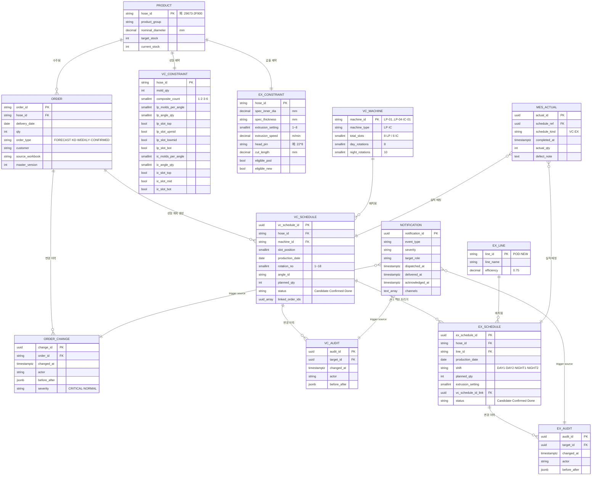

> ERD 설계 원칙:
> 1. `VC_CONSTRAINT`·`EX_CONSTRAINT`는 `PRODUCT`에서 분리 — BR-X05 dual-review 권한 분리·이력 추적 용이
> 2. 슬롯 O/X는 bool 컬럼 1:1 — 향후 슬롯 수 변경 시 컬럼 추가 (스키마 진화 가능)
> 3. `VC_SCHEDULE.rotation_no` (1~18)·`EX_SCHEDULE.shift` (4종) — 도메인 키
> 4. `VC_SCHEDULE` ↔ `EX_SCHEDULE` 1:N — 한 성형 행이 여러 압출 행을 트리거 가능
> 5. Audit는 스케줄 테이블별 분리 — 변경 인과 추적 단순화

#### 6.2.1 PRODUCT

| 컬럼 | 타입 | 제약 | 설명 |
|------|------|------|------|
| hose_id | VARCHAR(40) | PK | 제품 ID 예: `29673-2F900` |
| product_group | VARCHAR(40) | NOT NULL | 호스 군 |
| nominal_diameter | DECIMAL(5,2) | NOT NULL | mm |
| target_stock | INTEGER | NOT NULL, ≥ 0 | 목표 재고 |
| current_stock | INTEGER | NOT NULL, ≥ 0 | 현재고 (외부 마스터 동기화) |

#### 6.2.2 VC_CONSTRAINT

| 컬럼 | 타입 | 제약 | 설명 |
|------|------|------|------|
| hose_id | VARCHAR(40) | PK, FK → PRODUCT | |
| mold_qty | INTEGER | NOT NULL | 금형 총 보유수량 |
| composite_count | SMALLINT | CHECK in {1,2,3,6} | 합금형 |
| lp_molds_per_angle | SMALLINT | NULLABLE | 저압 앵글당 금형수 |
| lp_angle_qty | SMALLINT | NULLABLE | 저압 앵글 보유수량 |
| lp_slot_top | BOOLEAN | NOT NULL | 저압 상단 O/X |
| lp_slot_upmid | BOOLEAN | NOT NULL | 저압 중상단 O/X |
| lp_slot_lowmid | BOOLEAN | NOT NULL | 저압 중하단 O/X |
| lp_slot_bot | BOOLEAN | NOT NULL | 저압 하단 O/X |
| ic_molds_per_angle | SMALLINT | NULLABLE | IC 앵글당 금형수 |
| ic_angle_qty | SMALLINT | NULLABLE | IC 앵글 보유수량 |
| ic_slot_top | BOOLEAN | NOT NULL | IC 상단 O/X |
| ic_slot_mid | BOOLEAN | NOT NULL | IC 중단 O/X |
| ic_slot_bot | BOOLEAN | NOT NULL | IC 하단 O/X |

#### 6.2.3 EX_CONSTRAINT

| 컬럼 | 타입 | 제약 | 설명 |
|------|------|------|------|
| hose_id | VARCHAR(40) | PK, FK → PRODUCT | |
| spec_inner_dia | DECIMAL(5,2) | NOT NULL | mm |
| spec_thickness | VARCHAR(20) | NOT NULL | mm or 범위 문자열 |
| extrusion_setting | SMALLINT | CHECK 1..8 | |
| extrusion_speed | DECIMAL(5,2) | NOT NULL | m/min |
| head_pin | VARCHAR(20) | NOT NULL | 예: `22*8` |
| cut_length | DECIMAL(8,2) | NOT NULL | mm |
| eligible_pod | BOOLEAN | NOT NULL | |
| eligible_new | BOOLEAN | NOT NULL | |

#### 6.2.4 ORDER

| 컬럼 | 타입 | 제약 | 설명 |
|------|------|------|------|
| order_id | VARCHAR(40) | PK | |
| hose_id | VARCHAR(40) | FK → PRODUCT, NOT NULL | |
| delivery_date | DATE | NOT NULL | KST |
| qty | INTEGER | NOT NULL, > 0 | |
| order_type | VARCHAR(20) | CHECK in {FORECAST,KD,WEEKLY,CONFIRMED} | |
| customer | VARCHAR(80) | NOT NULL | |
| source_workbook | VARCHAR(120) | NOT NULL | 최근 Import 파일명 |
| master_version | INTEGER | NOT NULL | 논리 버전 |

> `(hose_id, delivery_date, master_version)` 유니크 제약.

#### 6.2.5 ORDER_CHANGE

| 컬럼 | 타입 | 제약 | 설명 |
|------|------|------|------|
| change_id | UUID | PK | |
| order_id | VARCHAR(40) | FK → ORDER, NOT NULL | |
| changed_at | TIMESTAMPTZ | NOT NULL | |
| actor | VARCHAR(40) | NOT NULL | |
| before_after | JSONB | NOT NULL | 필드별 before/after |
| severity | VARCHAR(10) | CHECK in {CRITICAL,NORMAL} | |

#### 6.2.6 VC_MACHINE

| 컬럼 | 타입 | 제약 | 설명 |
|------|------|------|------|
| machine_id | VARCHAR(10) | PK | `LP-01`..`LP-04`, `IC-01` |
| machine_type | VARCHAR(10) | CHECK in {LP,IC} | |
| total_slots | SMALLINT | NOT NULL | 8 (LP), 6 (IC) |
| day_rotations | SMALLINT | NOT NULL | 8 |
| night_rotations | SMALLINT | NOT NULL | 10 |

#### 6.2.7 VC_SCHEDULE

| 컬럼 | 타입 | 제약 | 설명 |
|------|------|------|------|
| vc_schedule_id | UUID | PK | |
| hose_id | VARCHAR(40) | FK → PRODUCT, NOT NULL | |
| machine_id | VARCHAR(10) | FK → VC_MACHINE, NOT NULL | |
| slot_position | SMALLINT | NOT NULL | 1..8 (LP) or 1..6 (IC) |
| production_date | DATE | NOT NULL | |
| rotation_no | SMALLINT | CHECK 1..18 | |
| angle_id | VARCHAR(40) | NOT NULL | |
| planned_qty | INTEGER | NOT NULL, ≥ 0 | |
| status | VARCHAR(10) | CHECK in {Candidate,Confirmed,Done} | |
| linked_order_ids | UUID[] | NOT NULL | 본 할당에 기여한 출처 |

> `(machine_id, slot_position, production_date, rotation_no)` 유니크.

#### 6.2.8 EX_LINE

| 컬럼 | 타입 | 제약 | 설명 |
|------|------|------|------|
| line_id | VARCHAR(10) | PK | `POD`, `NEW` |
| line_name | VARCHAR(20) | NOT NULL | 포드 / 신규 |
| efficiency | DECIMAL(3,2) | NOT NULL, DEFAULT 0.75 | |

#### 6.2.9 EX_SCHEDULE

| 컬럼 | 타입 | 제약 | 설명 |
|------|------|------|------|
| ex_schedule_id | UUID | PK | |
| hose_id | VARCHAR(40) | FK → PRODUCT, NOT NULL | |
| line_id | VARCHAR(10) | FK → EX_LINE, NOT NULL | |
| production_date | DATE | NOT NULL | |
| shift | VARCHAR(10) | CHECK in {DAY1,DAY2,NIGHT1,NIGHT2} | |
| planned_qty | INTEGER | NOT NULL | |
| extrusion_setting | SMALLINT | CHECK 1..8 | 그룹핑을 위한 EX_CONSTRAINT 미러 |
| vc_schedule_id_link | UUID | FK → VC_SCHEDULE | 선택적 1:N |
| status | VARCHAR(10) | CHECK in {Candidate,Confirmed,Done} | |

#### 6.2.10 VC_AUDIT / EX_AUDIT / ORDER_CHANGE (immutable)

| 컬럼 | 타입 | 비고 |
|------|------|------|
| audit_id | UUID | PK |
| target_id | UUID/VARCHAR | FK to respective entity |
| changed_at | TIMESTAMPTZ | |
| actor | VARCHAR(40) | |
| before_after | JSONB | |

> audit 테이블의 UPDATE/DELETE는 DB role에서 거부됨. REQ-FUNC-CO-005 참조.

#### 6.2.11 MES_ACTUAL

| 컬럼 | 타입 | 제약 | 설명 |
|------|------|------|------|
| actual_id | UUID | PK | |
| schedule_ref | UUID | NOT NULL | `vc_schedule_id` 또는 `ex_schedule_id` |
| schedule_kind | VARCHAR(2) | CHECK in {VC,EX} | |
| completed_at | TIMESTAMPTZ | NOT NULL | |
| actual_qty | INTEGER | NOT NULL | |
| defect_note | TEXT | NULLABLE | |

#### 6.2.12 NOTIFICATION

| 컬럼 | 타입 | 제약 | 설명 |
|------|------|------|------|
| notification_id | UUID | PK | |
| event_type | VARCHAR(40) | NOT NULL | 예: `order.changed`, `vc.changed` |
| severity | VARCHAR(10) | CHECK in {CRITICAL,NORMAL} | |
| target_role | VARCHAR(20) | NOT NULL | |
| dispatched_at | TIMESTAMPTZ | NOT NULL | |
| delivered_at | TIMESTAMPTZ | NULLABLE | |
| acknowledged_at | TIMESTAMPTZ | NULLABLE | |
| channels | TEXT[] | NOT NULL | 예: `{in-app, kakaotalk, slack}` |

#### 6.2.13 클래스 다이어그램 (Domain Model)

> 영속 엔터티(§6.2 ERD)와 별도로, 스케줄링 엔진의 도메인 객체·서비스·관계를 UML Class Diagram으로 표현. 구현 언어 중립.

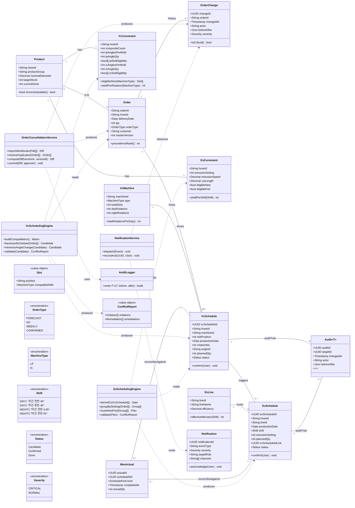

> 클래스 설계 원칙:
> - `Audit<T>`는 제네릭(`T`) — `OrderChange`·`VcAudit`·`ExAudit`를 단일 클래스 패밀리로 추상화
> - 도메인 서비스 3종(`OrderConsolidationService`·`VcSchedulingEngine`·`ExSchedulingEngine`)이 §3 BPMN의 Lane L4 (스케줄링 엔진)에 대응
> - `Slot`·`ConflictReport`는 값 객체(Value Object) — 불변
> - Enum 정의는 REF-01 §17 MoSCoW와 정합 (CONFIRMED 우선순위·shift 4종·status 3종 등)

### 6.3 상세 인터랙션 모델

§3.4 핵심 시퀀스에 오류 분기를 추가하여 확장.

#### 6.3.1 S-01 확장: 수주 통합 오류 분기 포함

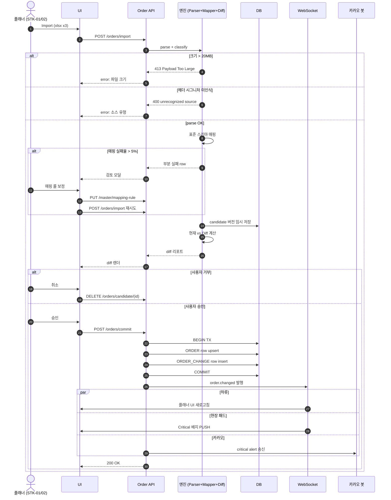

#### 6.3.2 S-02 확장: 성형 후보 생성 상세

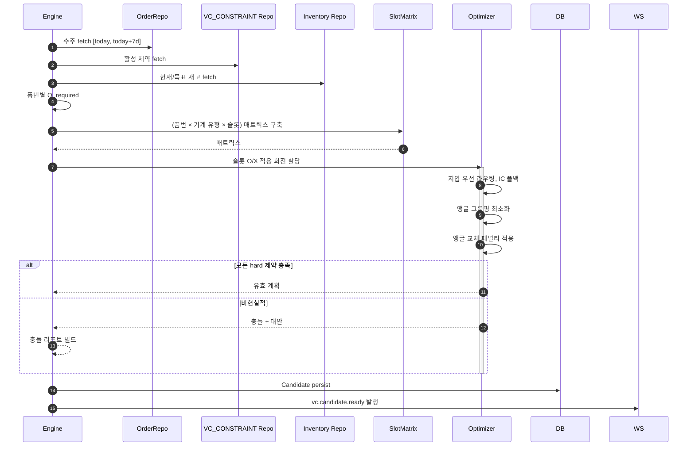

#### 6.3.3 S-03 확장: 성형 변경 시 압출 재계획

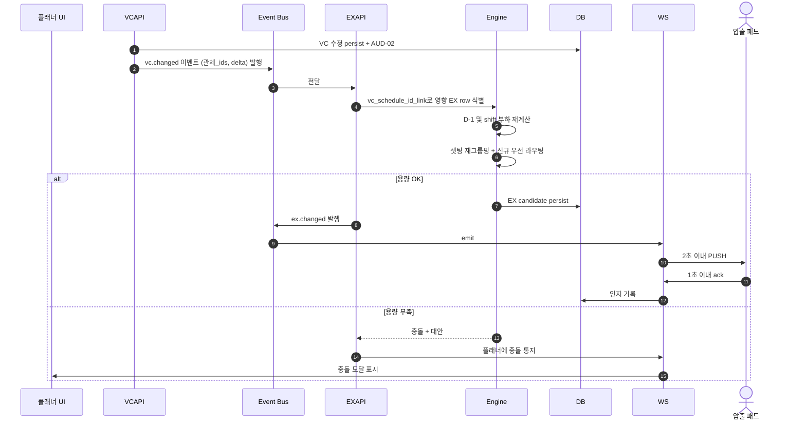

#### 6.3.4 S-04: dual-review 마스터 데이터 변경 (BR-X05)

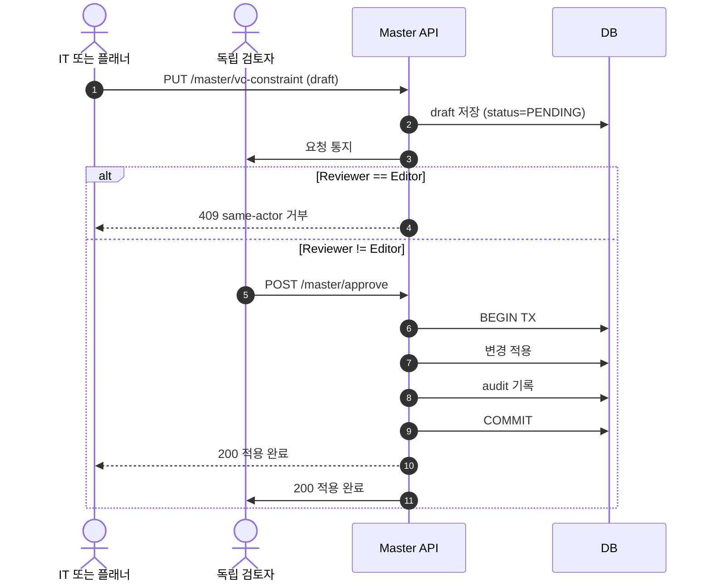

### 6.4 컴포넌트 다이어그램 (Component Diagram)

> 시스템 구성요소와 외부 시스템의 배치·관계를 Mermaid `flowchart`로 표기 (C4 Context + Container 혼합).

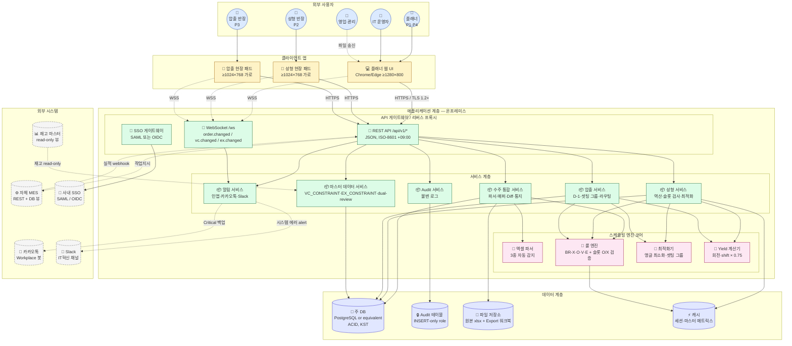

#### 6.4.1 컴포넌트 책임 매트릭스

| 컴포넌트 | 책임 | 연결 REQ | 연결 ADR |
|-------|------|--------|--------|
| 엑셀 파서 | 3종 자동 감지 + 표준 스키마 매핑 | REQ-FUNC-OC-001~004 | — |
| 룰 엔진 | BR-X/O/V/E 강제 + 슬롯 O/X 검증 | REQ-FUNC-VC-002, EX-006, CO-001 | ADR-004 |
| 최적화기 | 앵글 교체 최소화 + 셋팅 그룹 + 저압/신규 우선 | REQ-FUNC-VC-012, EX-007, EX-008 | ADR-006 |
| Yield 계산기 | 회전 yield (composite × molds/angle), shift yield (속도 × 분 × 0.75) | REQ-FUNC-VC-006, EX-005 | ADR-005 |
| Audit 서비스 | 불변 append-only 로그, 시점 복원 | REQ-FUNC-CO-005, OC-012, VC-020, EX-020 | — |
| 알림 서비스 | 인앱 + WebSocket PUSH + 카카오톡 + Slack | REQ-FUNC-OC-009, OC-010, NFR-OPS-003 | ADR-003 |
| API 게이트웨이 | TLS 1.2+, SSO 인증, RBAC 디스패치 | REQ-NF-SEC-001, NFR-SEC-002, NFR-SEC-003 | ADR-001 |
| 주 DB | ACID, KST 일자 연산 | REQ-NF-REL-002, REQ-FUNC-CO-007 | ADR-004 |
| Audit DB | INSERT-only role 결합 저장 | REQ-FUNC-CO-005, REQ-NF-SEC-004 | — |

### 6.5 검증 계획 (Summary)

> REF-01 §20.6 (EXP-1~5)에서 도출. 상세 계획은 QA 팀이 보유.

| 실험 | 가설 | 측정 | 통과 기준 |
|-----|------|----|---------|
| EXP-1 | 시스템이 엑셀 대비 주간 수주 통합 시간을 단축한다 | P1 주간 사이클의 Pre/Post 타임스탬프 | ≥50% 감소 |
| EXP-2 | 도입 후 NS-01 만족도가 상승한다 | 4명 베타 사용자 Pre/Post 5점 설문 | 평균 ≥1.0 상승, post ≥4.0 |
| EXP-3 | **(v1.4 재정의)** 시스템이 일중(rotation 1~18) 앵글 교체를 0건으로 강제한다 | 4주 계획의 모든 (machine, slot, business-day) 회전 단위 audit | 일중 교체 이벤트 0건 (일말 교체만 발생) |
| EXP-4 | VC→EX 변경이 현장에 1분 이내 도달 | 100건 시뮬레이션 변경 | ≥99건이 <1분 |
| EXP-5 | P4가 단독으로 주 사이클 완수 가능 | 3주 시뮬레이션 (P1 부재) | 2/3 이상 성공 |

### 6.6 문서 관리

| 필드 | 값 |
|------|-----|
| Document ID | SRS-001 |
| 개정 | 1.4 (한글판) |
| 상태 | Draft (8/8 DoD 기준 PASS + 9/9 PRD→SRS 매핑 PASS, v1.4 VC 7건 추가/개정 동기) |
| 소유자 | 시니어 요구사항 엔지니어 |
| 예정 리뷰어 | STK-01, STK-08, IT lead, QA lead |
| 원천 PRD 개정 | REF-01 v1.4 (2026-05-15) |
| 배포 | 사내 전용 — 사내망 |
| 다음 리뷰 | 수주정보 통합 작업 완료 시점 (REQ-FUNC-VC-022·023 활성 승격), 또는 Phase 1.0 빌드 킥오프 이전 |
| 승인 | 대기 (서명 체인: STK-01 → STK-06 → STK-08) |
| 이전 한글 버전 | `SRS-001_Production_Scheduling_System_v1.3.md` (v1.3 — 파일명 영문 통일) |
| 이전 영문 버전 | `SRS-001_Production_Scheduling_System.md` (v1.1), `SRS-001_Production_Scheduling_System_v1.2.md` (v1.2) |

### 6.7 개정 이력

| 버전 | 날짜 | 작성자 | 변경 |
|----|-----|------|------|
| 1.0 | 2026-05-14 | 시니어 요구사항 엔지니어 | REF-01 v1.3에서 도출한 초안 발행 (영문) |
| 1.1 | 2026-05-14 | 시니어 요구사항 엔지니어 | PRD→SRS 매핑 적합성 보강 (영문) — §1.7 Risks (SRS-RSK-001~014 + 완화 체인), §4.1 REF chain 노트 + §4.1.6 검증 방법 카탈로그 (ISO/IEC/IEEE 29148:2018 Annex C), §1.3.2 AOS/Validator 정의, §5.1 Risk → Requirement 커버리지, §5.2 REF → Requirement 커버리지. 9/9 PRD→SRS 매핑 PASS 달성 |
| 1.2 | 2026-05-14 | 시니어 요구사항 엔지니어 | DoD 적합성 보강 — 새 파일 `SRS-001_Production_Scheduling_System_v1.2.md` 생성 (워크플로우 규칙 준수). 추가: §3.5 유스케이스 다이어그램 (Mermaid flowchart, 19 use cases + UC↔REQ 매핑), §6.2.0 ERD (Mermaid erDiagram, 12 엔터티 + 속성), §6.2.13 클래스 다이어그램 (Mermaid classDiagram, 도메인 모델 + 서비스·값 객체·열거형), §6.4 컴포넌트 다이어그램 (Mermaid flowchart C4 hybrid + 책임 매트릭스), §1.2.2 OS-03에 US-06 이연 명시, §4.2.8 NFR-KPI-014~019 (6개 KPI 정식화: K-O03·K-O04·K-V01·K-V05·K-V06·K-E06). NFR 합계: 54 → 60. 다이어그램 합계: 7 시퀀스 → 11. 8/8 DoD 기준 PASS 달성 |
| 1.3 | 2026-05-14 | 시니어 요구사항 엔지니어 | **한글판 발행** — 새 파일 `SRS-001_공정스케줄링시스템_v1.3.md` 생성. v1.2의 모든 구조·요구사항·다이어그램을 한국어로 전면 번역. 기술 ID(REQ-FUNC, REQ-NF, BR, ADR, SRS-RSK 등)·SQL 키워드·API 엔드포인트·Mermaid 다이어그램 라벨은 도메인 일관성을 위해 영문 또는 혼용 표기 유지. 영문판 v1.1·v1.2는 그대로 보존 |
| 1.3p1 | 2026-05-14 | 시니어 요구사항 엔지니어 | **Mermaid 11.14 호환 패치** (in-place 버그 수정) — (1) §6.2.0 ERD: VC_CONSTRAINT·EX_CONSTRAINT의 `string hose_id PK_FK` → `PK` (Mermaid ERD는 PK/FK/UK 단일 키워드만 허용), (2) §6.3.3 S-03 시퀀스: `vc.changed{관체_ids,delta}` → `vc.changed (관체_ids, delta)` (시퀀스 메시지 내 중괄호가 블록 구문으로 파싱됨), (3) §3.4.2 S-02 시퀀스: `{horizon: 7d}` → `(horizon=7d)`, (4) §6.3.1 S-01 확장: `DELETE /orders/candidate/{id}` → `/(id)`, (5) §3.5 유스케이스: `subgraph FUT [Phase 2+ 이연 — 본 SRS 범위 外]` 및 `UC_FUT1[...(REF-01 US-06)]`을 따옴표로 래핑 (em-dash·괄호 포함 라벨의 엄격 파싱 회피). 콘텐츠 변경 없음, 표현만 보정 |
| 1.4 | 2026-05-15 | 시니어 요구사항 엔지니어 | **성형(VC) 제약 조건 7건 추가/개정 — 새 파일 `SRS-001_공정스케줄링시스템_v1.4.md` 생성** (워크플로우 규칙 준수). REF-01 PDD-MASTER v1.4 (PDD-02 v1.1) 동기. **재정의 3건**: (1) REQ-FUNC-VC-012 "앵글 교체 그룹핑 최소화" → **"당일 앵글 락 강제(일중 0회)"** (Should→Must 승격), (2) REQ-FUNC-VC-013 "교체 페널티 차감" → **"일말 교체 경계 + DO-04 영업일 키 출력"**, (3) REQ-FUNC-VC-014 "3회 초과 모달" → **"일중 교체 시도 100% 차단 + override 사유 필수"** (Should→Must 승격). **신규 7건**: REQ-FUNC-VC-021 (좌/우 슬롯 측면, 마스터 K/L열 활용), VC-022 (capa 초과 시 `PRODUCT_PRIORITY` 추가요청 큐, 수주통합 deferred), VC-023 (capa 부족 시 KD 발주 보충, 수주통합 deferred), VC-024 (`28422-08HA0` LP-01 단일 셋팅), VC-025 (`28422-2M800` 우측·≤2), VC-026 (`28421-2M800` 좌측·≤2), VC-027 (압출 마스터 `규격<7` 가류기당 ≤4). **NFR**: REQ-NF-KPI-007 K-V02 재정의 (5–6→0%, 일말만), EXP-3 측정 방식 변경. **검증 카탈로그·추적성 매트릭스** 동기 갱신. 기능 요구사항 합계 68 → **75개** (VC 20→27). DoD 8/8 PASS 유지 |
| 1.3p2 | 2026-05-14 | 시니어 요구사항 엔지니어 | **Mermaid 11.14 호환 추가 패치** — §6.3.3 S-03 시퀀스 잔여 오류 해결: (1) `Engine->>Engine: 셋팅 재그룹핑; 신규 우선 라우팅` 의 세미콜론(`;`)을 `+`로 교체 (Mermaid 11.14는 메시지 텍스트 내 `;`를 문장 종결자로 파싱), (2) `else` 분기에서 사용된 `UI` participant를 선언부 최상단에 명시적 추가 (묵시적 생성 시 strict 파서가 거부할 수 있음). 콘텐츠 변경 없음 |
| 1.5 | 2026-05-19 | 시니어 요구사항 엔지니어 | **NFR-SEC-007 로그인·비밀번호 정책 재정의 — 새 파일 `SRS-001_Production_Scheduling_System_v1.5.md` 생성** (워크플로우 규칙 준수). 운영 결정 — 사내 ~10명 한정 + 사내망 격리(NFR-SEC-001) 전제로 사용 편의 우선. **변경 1건**: REQ-NF-SEC-007 (1) Login ID = 사번 (숫자 8자리), 이메일 로그인 불허, (2) 비밀번호 = 숫자 4자리 PIN (regexPattern `^[0-9]{4}$`), (3) 5회 실패 → 10분 자동 잠금 (maxFailureWaitSeconds=600), (4) 우선순위 Should → **Must 승격**. v1.4 (12자/3종/15분) 폐기. Keycloak realm `passwordPolicy`·`maxFailureWaitSeconds`·`loginWithEmailAllowed=false` 동기 갱신 (`infrastructure/keycloak/realm-scheduling-system.json`). DoD 8/8 유지. 잔여 위험: 사회공학 공격 + 어깨너머 보기 — 운영 가이드 IT 보안 교육 항목 추가 (`docs/operations/secrets-management.md` §pin-policy) |
| 1.4p1 | 2026-05-15 | (작성자) | **파일명 영문 통일 + 오타 정정 (rename only, 콘텐츠 변경 없음)** — (1) 한글 파일명 `SRS-001_공정스케줄링시스템_v1.4.md` → 영문 `SRS-001_Production_Scheduling_System_v1.4.md` (사용자 정책: 영문 파일명 통일). 동일하게 v1.3 파일도 영문 통일. (2) 중간 작업에서 발생한 `Porduction` 오타 → `Production` 정정. (3) 내부 reference 갱신: `이전 SRS 버전` · `이전 한글 버전` 표기를 영문 파일명으로, REF-01 PDD-04 path를 `_final.md` v1.5로 동기. 요구사항·KPI·다이어그램 등 모든 콘텐츠는 v1.4와 동일 |
