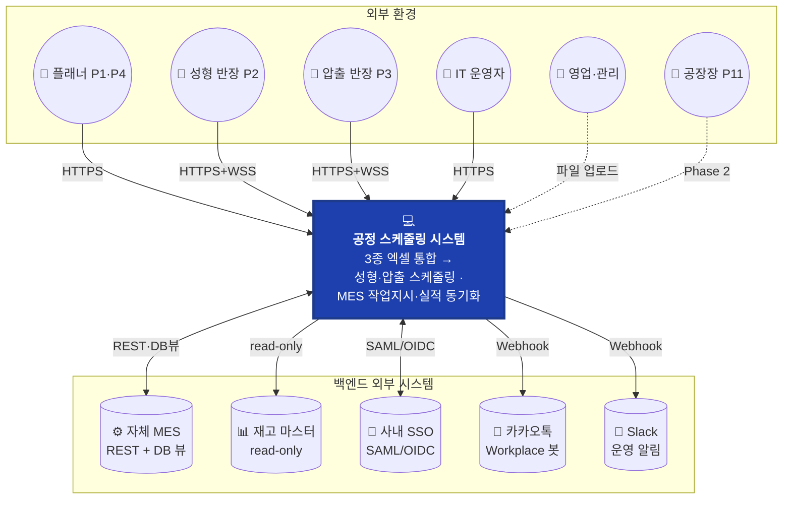
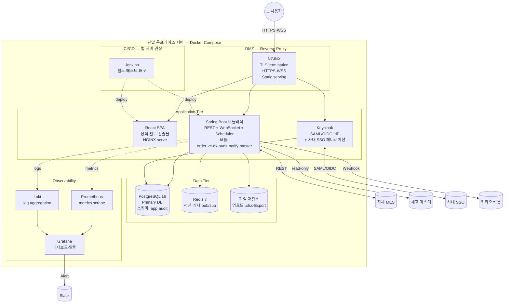
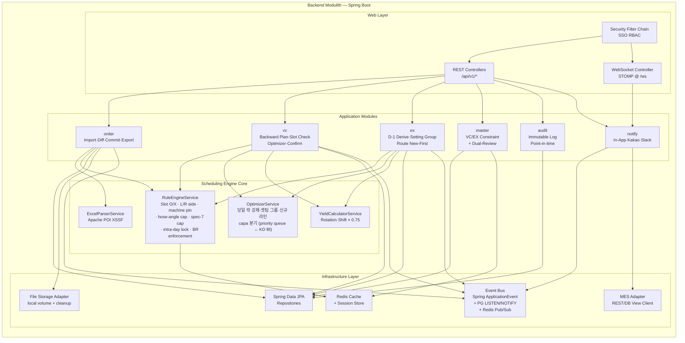
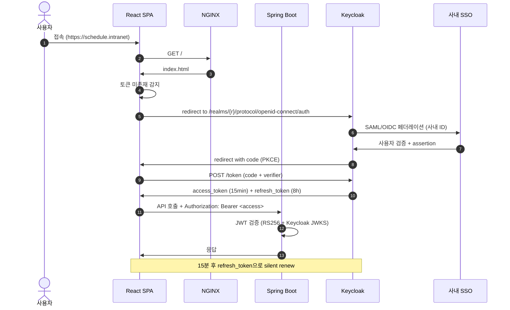
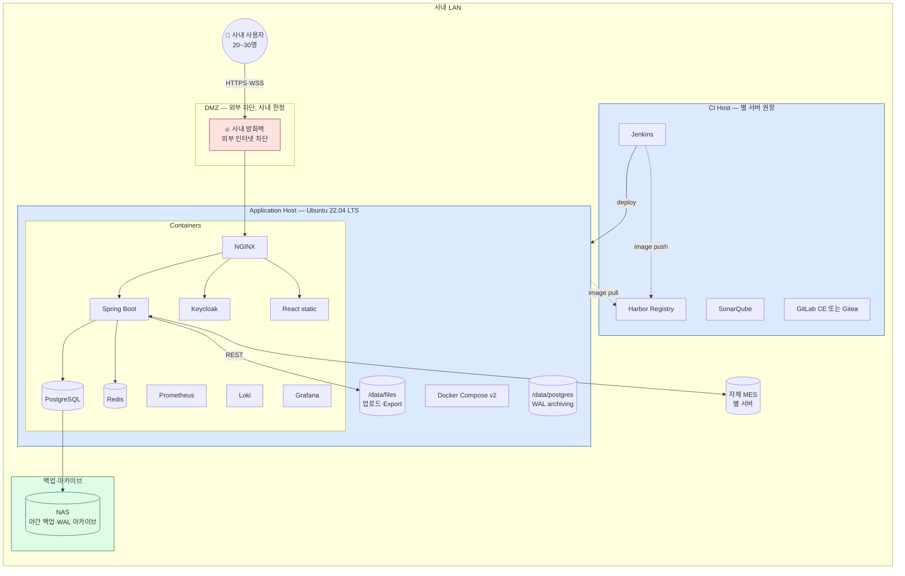
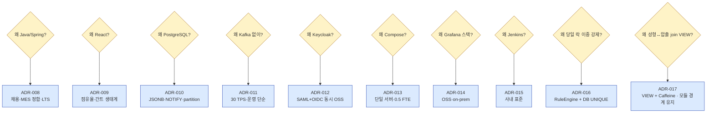

# 소프트웨어 아키텍처 문서 (Software Architecture Document, SAD)
문서 ID: SAD-001
개정: 1.1
작성일: 2026-05-14 / 최종 갱신: 2026-05-15
표준 참조: ISO/IEC/IEEE 42010:2011 (Architecture description), arc42 template

시스템 명: **사내 공정 스케줄링 시스템 (Internal Production Scheduling System)**
원천 문서:
- [REF-SRS] `Phase 2/2.SRS/SRS-001_공정스케줄링시스템_v1.4.md` (요구사항)
- [REF-PRD] `Phase 2/1.PDD/4.PDD_master_integrated_Opus.md` v1.4 (PDD+PRD)

문서 상태: **Draft v1.1 (사용자 검토 대기)** — v1.0의 기술 스택 선택은 유지. v1.1 변경: SRS v1.4의 VC 제약 7건(BR-V07 재정의 + BR-V12~17) 반영을 위한 데이터 스키마·컴포넌트 책임·ADR-016/017 신규 추가.

---

## 1. 서문 (Introduction)

### 1.1 목적

본 SAD는 SRS-001 v1.4에서 정의된 135개 요구사항(REQ-FUNC 75 + REQ-NF 60)을 **충족하는 구체적 기술 아키텍처와 기술 스택**을 정의한다. SRS가 *"무엇을(WHAT)"* 기술한다면, 본 SAD는 *"어떻게(HOW)"* 기술한다. (v1.1: SRS v1.4의 VC 제약 7건 반영)

### 1.2 범위

| In-Scope (본 SAD에서 결정) | Out-of-Scope (별도 산출물) |
|--------------------------|---------------------------|
| 기술 스택 (언어·프레임워크·DB·인프라) | 코드 구현 (Phase 3) |
| 시스템 분할 (백엔드·프론트·데이터·인프라) | 단위 테스트 코드 (Phase 3) |
| 배포 아키텍처 (서버 토폴로지·네트워크) | 사용자 매뉴얼 |
| 관측성·CI/CD 파이프라인 설계 | 운영 런북 (Stage 1.2에서 작성) |
| 신규 ADR (ADR-008~015) | 비즈니스 결정 (REF-PRD §15 ADR-001~007) |
| NFR 실현 방안 | 신규 요구사항 (SRS 수정으로 처리) |

### 1.3 정의·약어

SRS §1.3을 상속하며, 본 SAD에서 추가되는 용어:

| 약어 | 확장 |
|------|------|
| SAD | Software Architecture Document |
| C4 | Context · Container · Component · Code (Simon Brown 아키텍처 모델) |
| OpenAPI | REST API 명세 표준 (구. Swagger) |
| LTS | Long-Term Support |
| JPA | Java Persistence API |
| ORM | Object-Relational Mapping |
| STOMP | Simple Text Oriented Messaging Protocol (WebSocket) |
| RUM | Real User Monitoring |
| SLO | Service Level Objective (SRS 상속) |
| WAL | Write-Ahead Logging (PostgreSQL) |
| HSTS | HTTP Strict Transport Security |
| RPO/RTO | Recovery Point/Time Objective |

### 1.4 참조

| ID | 문서 |
|----|------|
| REF-SRS | `Phase 2/2.SRS/SRS-001_공정스케줄링시스템_v1.4.md` |
| REF-PRD | `Phase 2/1.PDD/4.PDD_master_integrated_Opus.md` v1.4 |
| REF-PDD-1,2,3 | `Phase 2/1.PDD/1·2·3.process_*_Opus.md` |
| REF-CSF | `Phase 1/3.Analysis/2.critical_success_factors.md` |
| ARC42 | arc42 v8 — https://arc42.org |
| C4 | C4 Model — https://c4model.com |
| ISO-42010 | ISO/IEC/IEEE 42010:2011 |
| 12-factor | The Twelve-Factor App methodology |

### 1.5 아키텍처 드라이버

아키텍처 결정을 견인하는 상위 동인(Drivers):

| 우선 | 드라이버 | 원천 |
|:---:|---------|------|
| **1** | **사용자 신뢰 = 시스템 제안 + 사용자 확정** (자동 적용 금지) | REF-PRD ADR-007, CON-07 |
| **2** | **사내망 전용 + 오픈소스 우선 + 잉여 서버 활용** (NFR-COS-001,002) | SRS §1.5 CON-01 |
| **3** | **0.5 FTE 평상 운영** — 운영 부담 최소 (NFR-COS-003) | SRS §4.2.7 |
| **4** | **30명 동시 사용자 한도** — 단순한 모놀리식 충분 (NFR-COM-001) | SRS §4.2.6 |
| **5** | **회전수 기반 스케줄링** — 시간 모델 아님 (CON-05) | REF-PRD ADR-005 |
| **6** | **WebSocket 2초 PUSH SLO** (REQ-NF-PER-004, CON-03) | REF-PRD ADR-003 |
| **7** | **Audit 불변성·Dual-review** (BR-X02·X05) | SRS §1.5 CON-08 |

### 1.6 아키텍처 스타일 — 선택

| 선택지 | 평가 | 채택 여부 |
|--------|------|:--------:|
| 단일 모놀리식 (Modular Monolith) | 30명·0.5 FTE에 최적, 운영 단순, 배포 단순 | ✅ **채택** |
| 마이크로서비스 (≥3개 서비스) | 운영 비용 폭증, scale 불필요 | ❌ |
| 서버리스 (Function-as-a-Service) | 사내망 제약, 적합한 사내 인프라 부재 | ❌ |
| 두-계층 클라이언트-서버 (Fat Client) | 30년 전 패턴, 배포·업데이트 부담 | ❌ |

**채택 스타일: 모듈화 모놀리식 (Modular Monolith)**
- 단일 백엔드 프로세스 내에 모듈 경계(`order`·`vc`·`ex`·`audit`·`notify`)
- 각 모듈은 별도 패키지·DB 스키마 분리, 추후 분할 용이
- 향후 Phase 2(MRP) 추가 시 모듈 추가, 필요 시 서비스 분할 옵션 보유

---

## 2. 시스템 컨텍스트 (C4 Level 1)

> SRS §3.1 외부 시스템 정보를 C4 Context Diagram으로 시각화.



> Phase 2 확장 시 외부 ERP·QMS·MRP 추가 가능. 본 SAD는 Phase 1 In-Scope만 다룸.

---

## 3. 컨테이너 뷰 (C4 Level 2)

> "컨테이너" = 별도 프로세스로 배포되는 단위 (Docker container 단위와 일치).



### 3.1 컨테이너 책임 매트릭스

| 컨테이너 | 이미지 베이스 | 책임 | 연결 SRS |
|---------|------------|------|---------|
| NGINX | `nginx:1.25-alpine` | TLS termination·정적 파일 서빙·WebSocket proxy | NFR-SEC-006, NFR-PER-005 |
| FE (React SPA) | `nginx:1.25-alpine` (정적) | UI 렌더링·상태 관리·WebSocket 클라이언트 | CLI-01~04, REQ-FUNC-VC-004 |
| BE (Spring Boot) | `eclipse-temurin:21-jre-alpine` | 비즈니스 로직·스케줄링 엔진·API·WS 허브 | 모든 REQ-FUNC |
| Keycloak | `quay.io/keycloak/keycloak:24` | SSO IdP·RBAC 토큰 발급 | REQ-NF-SEC-002·003 |
| PostgreSQL 16 | `postgres:16-alpine` | 영속 저장·트랜잭션·LISTEN/NOTIFY | REQ-NF-REL-002, REQ-FUNC-CO-005·006 |
| Redis 7 | `redis:7-alpine` | 세션·매트릭스 캐시·WS 메시지 pub/sub | NFR-PER-001, REQ-NF-COM-001 |
| 파일 저장소 | bind-mount (호스트 볼륨) | 업로드 .xlsx 보관·Export 출력 | REQ-FUNC-OC-001, OC-013 |
| Prometheus | `prom/prometheus` | 메트릭 스크레이프 | REQ-NF-OPS-005 |
| Loki | `grafana/loki` | 로그 집계 | REQ-NF-OPS-001 |
| Grafana | `grafana/grafana` | 17 KPI 대시보드·알림 | REQ-NF-OPS-002·004 |
| Jenkins | 별 서버 권장 | CI/CD 파이프라인 | 운영 인프라 |

---

## 4. 컴포넌트 뷰 (C4 Level 3)

> Backend 컨테이너 내부의 모듈 구조. SRS §6.4를 모듈 패키지 단위로 구체화.



### 4.1 모듈 경계 원칙

| 원칙 | 설명 | 강제 수단 |
|------|------|---------|
| 모듈 간 직접 호출 금지 | 다른 모듈의 내부 클래스 참조 불가 | Spring Modulith 또는 ArchUnit 테스트 |
| 모듈 간 통신 = Event Bus만 | 비동기 이벤트(`OrderChangedEvent`·`VcConfirmedEvent`) | `@TransactionalEventListener` |
| 공통 도메인 = `common` 패키지 | DTO·Enum·Exception | 의존성 그래프에 순환 금지 |
| Audit는 모든 커밋에 강제 | `@Auditable` AOP + DB 트리거 | BR-X02 |

> 모듈 분리는 향후 Phase 2(MRP) 추가 시 서비스 분할(microservices) 옵션을 보유하기 위한 안전장치.

---

## 5. 기술 스택 (Technology Stack)

> 본 SAD의 핵심. 각 선택은 §10의 신규 ADR-008~015로 의사결정 기록.

### 5.1 백엔드 (Backend)

| 항목 | 채택 | 버전 | 근거·대안 |
|------|------|------|---------|
| **언어** | **Java** | **21 LTS** | 한국 제조 사내 시스템 주류, JVM 안정성, 풍부한 라이브러리. 대안: Kotlin (동일 JVM, 신규 채용 용이성 ↑), Python 3.12 (스케줄링 알고리즘 표현력 ↑) — ADR-008 |
| **프레임워크** | **Spring Boot** | **3.3.x** | Spring Modulith로 모듈 경계 강제 가능. Spring Security·Spring Data JPA·Spring WebSocket·Spring Batch 통합 |
| **빌드** | **Gradle** | 8.x (Kotlin DSL) | Maven 대비 빌드 속도, 멀티모듈 표현력 |
| **API 문서** | **springdoc-openapi** | 2.5.x | OpenAPI 3.0 자동 생성 + Swagger UI |
| **엑셀 파싱** | **Apache POI XSSF** | 5.x | .xlsx 표준 라이브러리, 병합 셀·수식 처리. 대안: easyexcel (메모리 효율 ↑) |
| **ORM** | **Spring Data JPA + Hibernate** | 6.x | 표준, 멀티 RDBMS 호환. 대안: jOOQ (타입 안전 ↑, 학습곡선 ↑) |
| **검증** | Hibernate Validator | 8.x | Jakarta Validation (JSR-380) |
| **테스트** | JUnit 5 + Mockito + Testcontainers | latest | 통합 테스트 시 PG·Redis 컨테이너 자동 기동 |
| **모듈화 강제** | **Spring Modulith** | 1.2.x | 모듈 경계 위반을 빌드 타임에 차단 |
| **이벤트** | Spring ApplicationEvent + `@TransactionalEventListener` | 내장 | 모듈 간 비동기 통신 |
| **스케줄러** | Spring `@Scheduled` + Shedlock | 내장 | 야간 배치 (백업·집계) |

### 5.2 프론트엔드 (Frontend)

| 항목 | 채택 | 버전 | 근거·대안 |
|------|------|------|---------|
| **언어** | **TypeScript** | **5.4** | 타입 안전, 런타임 에러 ↓ — ADR-009 |
| **프레임워크** | **React** | **18.3** | 한국 시장 압도적 점유, 풍부한 생태계, Ant Design 호환 |
| **빌드** | **Vite** | 5.x | Webpack 대비 콜드 부트 ↓, HMR 우수 |
| **UI 컴포넌트** | **Ant Design** | 5.x | 한국 enterprise 환경 친화, Table·Form·DatePicker 완비, 한국어 i18n 내장 |
| **상태(서버)** | **TanStack Query** | 5.x | 캐싱·재시도·낙관적 업데이트 |
| **상태(클라이언트)** | **Zustand** | 4.x | Redux 대비 boilerplate ↓ |
| **라우팅** | React Router | 6.x | 표준 |
| **간트/스케줄 뷰** | **Frappe Gantt** + 커스텀 React 래퍼 | open source | 슬롯·회전 매트릭스는 AG Grid Community로 표현 |
| **드래그앤드롭** | dnd-kit | 6.x | 모던, 접근성 우수 (REQ-FUNC-VC-004) |
| **WebSocket** | @stomp/stompjs + sockjs-client | latest | Spring WebSocket STOMP 호환 |
| **차트** | Recharts | 2.x | KPI 대시보드 (Phase 2+ 가능성) |
| **테스트** | Vitest + React Testing Library + Playwright | latest | 단위·통합·E2E |
| **i18n** | i18next | 23.x | 한국어 단일이나 향후 확장 대비 |

### 5.3 데이터 계층 (Data Layer)

| 항목 | 채택 | 버전 | 근거·대안 |
|------|------|------|---------|
| **주 DBMS** | **PostgreSQL** | **16.x** | SRS §6.4 기본값. ACID·JSONB(audit before_after)·LISTEN/NOTIFY·partial index — ADR-010 |
| **마이그레이션** | **Flyway** | 10.x | SQL 기반 버전 관리, Liquibase 대비 단순 |
| **인덱스 전략** | `(hose_id, delivery_date)` 복합, `(machine_id, slot_position, production_date, rotation_no)` unique, audit_id PK | — | SRS §6.2 unique 제약 강제 |
| **파티셔닝** | PG declarative range partitioning by `production_date` (월 단위) | — | 5년 ≈ 60 파티션, 쿼리 성능·삭제 효율 |
| **백업** | `pg_basebackup` 야간 풀백업 + WAL archiving | — | RPO ≤ 24h (REQ-NF-REL-005) |
| **캐시** | **Redis** | **7.2** | 세션 스토어·슬롯 O/X 매트릭스 캐시·WebSocket pub/sub |
| **파일 저장** | 로컬 호스트 볼륨 (bind-mount `/data/files`) | — | 사내·소규모, S3 같은 객체 스토리지 불필요 |
| **검색** | PostgreSQL Full-Text Search (한국어는 mecab 또는 LIKE 정도) | — | Elasticsearch 도입 불필요 |

### 5.4 이벤트·메시징 (Event/Messaging)

| 항목 | 채택 | 근거 |
|------|------|------|
| **사내 이벤트** | **Spring ApplicationEvent (in-process)** | 단일 모놀리식 → 외부 브로커 불필요 |
| **DB 트리거 이벤트** | **PostgreSQL LISTEN/NOTIFY** | 트랜잭션 커밋 후 알림 (Audit 강제 후 publish) |
| **WebSocket 메시지 (다중 인스턴스 대비)** | **Redis Pub/Sub** | 향후 BE 인스턴스 ≥2 확장 시 사용 |
| **외부 MES 이벤트** | **REST polling + webhook** | MES가 push 가능하면 webhook, 아니면 1분 polling |
| **Kafka·RabbitMQ 등** | ❌ 미채택 | 30명·30 TPS 규모에 과잉. 운영 부담 — ADR-011 |

### 5.5 인증·인가 (Auth)

| 항목 | 채택 | 근거 |
|------|------|------|
| **IdP** | **Keycloak 24** | 오픈소스, SAML+OIDC 동시 지원, 사내 LDAP/AD 페더레이션 — ADR-012 |
| **사용자 인증 흐름** | OIDC Authorization Code Flow + PKCE | 표준 |
| **세션 저장** | Spring Session + Redis | NGINX 뒤 다중 BE 인스턴스 대비 |
| **RBAC 모델** | Keycloak Role + Spring Method Security `@PreAuthorize` | REQ-FUNC-CO-001 |
| **비밀번호 해싱** | BCrypt (cost=12) | NFR-SEC-007 (사내 SSO 없이 ID/PW fallback 시) |
| **JWT** | Keycloak 발급 (RS256), 15분 access + 8시간 refresh | 사내망이지만 토큰 만료 정책 유지 |
| **CSRF** | Spring Security CSRF (Cookie-based session 시) | Bearer JWT 시 disable |

### 5.6 컨테이너·배포 (Container & Deployment)

| 항목 | 채택 | 근거 |
|------|------|------|
| **컨테이너 런타임** | **Docker (containerd)** | 표준 |
| **오케스트레이션** | **Docker Compose** | 단일 서버·30명 규모에 충분. Kubernetes는 과잉 — ADR-013 |
| **베이스 이미지** | `*-alpine` 또는 `*-jre` slim | 크기·취약점 ↓ |
| **OS** | Ubuntu Server 22.04 LTS 또는 RHEL 9 | 사내 표준 OS 따름 |
| **프로비저닝** | Docker Compose v2 YAML + Ansible playbook | IaC, 환경 재현성 |
| **재시작 정책** | `restart: unless-stopped` | OS reboot 후 자동 복구 |
| **무중단 배포** | Blue-Green via `docker compose up -d --no-deps --build` + NGINX upstream 토글 | 30명 규모에선 잠깐 중단 허용 가능, 단 NGINX 토글로 ≤30초 |

### 5.7 관측성 (Observability)

| 항목 | 채택 | 근거 |
|------|------|------|
| **메트릭** | **Prometheus 2.x + Micrometer** | Spring Boot Actuator 통합 |
| **로그** | **Loki + Promtail** | Grafana 통합, JSON 구조화 로그 (REQ-NF-OPS-001) — ADR-014 |
| **대시보드** | **Grafana 10.x** | 17개 KPI + NS-01 (REQ-NF-OPS-002) |
| **알림** | **Grafana Alerting → Slack Webhook** | NFR-OPS-003 |
| **분산 트레이싱** | (선택) Tempo + OpenTelemetry Java agent | 모놀리식이라 Phase 1에선 생략 가능 |
| **헬스 체크** | Spring Boot Actuator `/health` + Docker healthcheck | 자동 재기동 |
| **에러 트래커** | Sentry self-hosted (선택) 또는 Grafana 만으로 충분 | 0.1% 오류율 추적 (NFR-REL-003) |

### 5.8 CI/CD

| 항목 | 채택 | 근거 |
|------|------|------|
| **CI 서버** | **Jenkins LTS** (사내 별 서버) | 한국 제조 enterprise 주류, 사내 보안 정책 적합 — ADR-015 |
| **SCM** | 사내 Git (GitLab CE 또는 Gitea) | 사내망 |
| **파이프라인 정의** | Jenkinsfile (declarative) | 코드로 관리 |
| **빌드 단계** | `gradle build` → `docker build` → registry push → SSH deploy | — |
| **테스트 게이트** | 단위 80% 커버리지 + 통합 + SonarQube quality gate | NFR 보장 |
| **코드 품질** | SonarQube CE + Spotless (Java) + ESLint·Prettier (TS) | — |
| **취약점 스캔** | Trivy (이미지 + 의존성) | OWASP Top 10 차단 |
| **컨테이너 레지스트리** | Harbor 또는 Nexus Repository | 사내 |
| **배포** | DEV 자동, STG 수동 승인, PRD 수동 승인 (BR-X05 정신 계승) | — |

### 5.9 개발·품질 도구

| 항목 | 채택 |
|------|------|
| IDE | IntelliJ IDEA Ultimate (백엔드), VS Code (프론트엔드) |
| 코드 포맷 | Spotless (Java) + Prettier (TS·JSON·MD) |
| 정적 분석 | SonarQube + Error Prone (Java) + ESLint (TS) |
| 의존성 관리 | Renovate (자동 PR) |
| Git 워크플로우 | GitHub Flow (main + feature branches), conventional commits |
| API 모킹 | WireMock (MES 미연결 시) |
| 부하 테스트 | k6 또는 Gatling | NFR-PER-001~005 검증 |

### 5.10 기술 스택 한눈에 (요약 매트릭스)

| 계층 | 채택 기술 |
|-----|---------|
| 클라이언트 | React 18 + TypeScript 5 + Vite + Ant Design 5 + TanStack Query + Zustand |
| API 게이트웨이 | NGINX 1.25 (TLS 1.3, WebSocket proxy) |
| 백엔드 | Java 21 LTS + Spring Boot 3.3 + Spring Modulith + Spring Security + Spring Data JPA |
| 스케줄링 엔진 | Apache POI 5 (Excel) + 자체 Rule/Optimizer/Calculator 서비스 |
| 인증·인가 | Keycloak 24 (SAML/OIDC) |
| 데이터 | PostgreSQL 16 + Flyway + Redis 7 |
| 이벤트 | Spring ApplicationEvent + PG LISTEN/NOTIFY + Redis Pub/Sub |
| 컨테이너 | Docker + Docker Compose v2 |
| OS | Ubuntu 22.04 LTS 또는 RHEL 9 |
| 관측성 | Prometheus + Loki + Grafana 10 + Slack 알림 |
| CI/CD | Jenkins LTS + Harbor + SonarQube + Trivy |
| 외부 | 카카오톡 Workplace Bot + Slack Webhook |

---

## 6. 데이터 아키텍처 (Data Architecture)

> SRS §6.2(ERD)·§6.2.13(Class Diagram)을 영속 계층 구현 가이드로 구체화.

### 6.1 물리 스키마 가이드

#### 6.1.1 스키마 분리

| 스키마 | 용도 | 접근 권한 |
|-------|------|---------|
| `app` | 운영 데이터 (PRODUCT·ORDER·VC_SCHEDULE 등) | 애플리케이션 user (read·write) |
| `audit` | 감사 로그 (ORDER_CHANGE·VC_AUDIT·EX_AUDIT) | 애플리케이션 user (INSERT 만), `auditor` role (SELECT 만) |
| `master` | 마스터 데이터 (VC_CONSTRAINT·EX_CONSTRAINT·**PRODUCT_PRIORITY**·**KD_ORDER**) | 애플리케이션 user (SELECT), `master_admin` (UPDATE — dual review 후 BR-X05) |

#### 6.1.1a (v1.1 신규) 마스터 테이블 컬럼·신규 테이블

> SRS v1.4 BR-V07 재정의 + BR-V12~17 신규 7건을 영속 계층에 반영. 마스터 엑셀(`성형공정_제약조건.xlsx` K/L열, `압출공정_제약조건.xlsx` B열)을 권위 데이터원으로 사용.

```sql
-- master.VC_CONSTRAINT: K(좌측셋팅)·L(우측셋팅) 컬럼 신규 (BR-V15·V16, REQ-FUNC-VC-021/025/026)
ALTER TABLE master.VC_CONSTRAINT
    ADD COLUMN lp_left_setting   CHAR(1) NOT NULL DEFAULT 'o' CHECK (lp_left_setting  IN ('o','x')),
    ADD COLUMN lp_right_setting  CHAR(1) NOT NULL DEFAULT 'o' CHECK (lp_right_setting IN ('o','x'));
COMMENT ON COLUMN master.VC_CONSTRAINT.lp_left_setting  IS '저압 좌측 셋팅 가능(o)/불가(x) — 엑셀 K열 매핑';
COMMENT ON COLUMN master.VC_CONSTRAINT.lp_right_setting IS '저압 우측 셋팅 가능(o)/불가(x) — 엑셀 L열 매핑';

-- master.VC_HOSE_RULE: 품번 단위 특수 제약 (BR-V14·V15·V16, REQ-FUNC-VC-024/025/026)
CREATE TABLE master.VC_HOSE_RULE (
    hose_id              VARCHAR(32) PRIMARY KEY REFERENCES app.PRODUCT(hose_id),
    machine_pin          VARCHAR(16),     -- 예: 'LP-01' (BR-V14: 28422-08HA0 → LP-01)
    max_concurrent_slots SMALLINT,        -- 예: 1 (BR-V14), 2 (BR-V15·V16)
    side_lock            CHAR(1) CHECK (side_lock IN ('L','R',NULL)), -- 'L' 좌측 only(28421-2M800), 'R' 우측 only(28422-2M800)
    lp_only              BOOLEAN NOT NULL DEFAULT FALSE,  -- BR-V14
    rule_source          VARCHAR(32) NOT NULL,  -- 'BR-V14' / 'BR-V15' / 'BR-V16'
    activated_at         TIMESTAMPTZ NOT NULL DEFAULT now()
);
COMMENT ON TABLE master.VC_HOSE_RULE IS '품번별 호기·앵글 상한·좌/우 강제 제약 (BR-V14~V16). 마스터 엑셀이 외부 권위 데이터원, 본 테이블은 운영 캐시.';

-- master.PRODUCT_PRIORITY: capa 초과 시 추가요청 우선순위 (BR-V12, REQ-FUNC-VC-022, deferred)
CREATE TABLE master.PRODUCT_PRIORITY (
    hose_id      VARCHAR(32) PRIMARY KEY REFERENCES app.PRODUCT(hose_id),
    priority     SMALLINT NOT NULL CHECK (priority BETWEEN 1 AND 99), -- 1 = 최우선
    reason_code  VARCHAR(32),
    updated_at   TIMESTAMPTZ NOT NULL DEFAULT now(),
    updated_by   VARCHAR(64) NOT NULL
);
COMMENT ON TABLE master.PRODUCT_PRIORITY IS '품번별 우선순위 — capa 초과 시 추가요청 큐 정렬 키. 수주정보 통합 작업 완료 후 활성.';

-- master.KD_ORDER: capa 부족 시 보충용 KD 잔량 (BR-V13, REQ-FUNC-VC-023, deferred)
CREATE TABLE master.KD_ORDER (
    kd_order_id   BIGSERIAL PRIMARY KEY,
    hose_id       VARCHAR(32) NOT NULL REFERENCES app.PRODUCT(hose_id),
    setting_group VARCHAR(8),               -- 압출 셋팅 1~8 (보충 우선순위 (ii))
    qty_remaining INT NOT NULL CHECK (qty_remaining >= 0),
    snapshot_at   TIMESTAMPTZ NOT NULL DEFAULT now(),
    UNIQUE (hose_id, snapshot_at)
);
CREATE INDEX idx_kd_order_hose_qty ON master.KD_ORDER (hose_id, qty_remaining DESC);
CREATE INDEX idx_kd_order_setting  ON master.KD_ORDER (setting_group, qty_remaining DESC);
COMMENT ON TABLE master.KD_ORDER IS 'KD 발주 잔량 스냅샷 — capa 부족 시 (i) 동일 hose_id → (ii) 동일 셋팅 그룹 순 보충. 수주정보 통합 작업 완료 후 활성.';
```

> **참고**: `master.VC_HOSE_RULE`은 마스터 엑셀의 신규 메타(좌측셋팅·우측셋팅·품번 특수제약)를 1차 운영 캐시로 정규화한 테이블. 엑셀이 외부 권위 데이터원이므로 마스터 변경 시 dual-review(BR-X05)와 LISTEN/NOTIFY로 캐시 무효화. **`master.PRODUCT_PRIORITY`·`master.KD_ORDER`는 PDD-01 수주정보 통합 작업 완료 시점에 채워진다** — 그 전까지는 빈 테이블 + REQ-FUNC-VC-022/023은 Should 등급으로 비활성.

#### 6.1.2 주요 인덱스

| 테이블 | 인덱스 | 용도 |
|--------|------|------|
| `ORDER` | UNIQUE `(hose_id, delivery_date, master_version)` | 중복 차단 (REQ-FUNC-OC-005) |
| `ORDER` | `(delivery_date)` BTREE | 호라이즌 쿼리 |
| `VC_SCHEDULE` | UNIQUE `(machine_id, slot_position, production_date, rotation_no)` | 슬롯 점유 충돌 차단 |
| `VC_SCHEDULE` | `(production_date, status)` partial WHERE status='Confirmed' | 일일 작업지시 쿼리 |
| `VC_SCHEDULE` | UNIQUE `(machine_id, slot_position, production_date, hose_id)` deferrable | **(v1.1)** 당일 락 강제 — 한 (machine, slot, day)에 단일 hose_id만 (BR-V07, REQ-FUNC-VC-012) |
| `VC_SCHEDULE` | `(hose_id, machine_id, production_date, rotation_no)` BTREE | **(v1.1)** 동시 점유 슬롯 카운트 (BR-V14·V15·V16 검증) |
| `master.VC_HOSE_RULE` | PRIMARY KEY `(hose_id)` | (v1.1) 품번 단위 호기·앵글 상한 조회 |
| `master.PRODUCT` × `master.EX_CONSTRAINT` | `(hose_id)` FK + view `v_product_with_spec` | **(v1.1)** 압출 마스터 `규격`(B열) cross-join → BR-V17 (규격<7) 검증 |
| `EX_SCHEDULE` | UNIQUE `(line_id, production_date, shift, extrusion_setting)` partial | shift당 단일 셋팅 (REQ-FUNC-EX-007) |
| `*_AUDIT` | `(target_id, changed_at)` BTREE | 시점 복원 (REQ-FUNC-OC-014) |
| `MES_ACTUAL` | `(schedule_ref, completed_at)` BTREE | 실적 매칭 |

#### 6.1.3 파티셔닝

```sql
-- VC_SCHEDULE 월 단위 RANGE 파티션 예시
CREATE TABLE VC_SCHEDULE (
    -- columns ...
) PARTITION BY RANGE (production_date);

CREATE TABLE VC_SCHEDULE_2026_06 PARTITION OF VC_SCHEDULE
    FOR VALUES FROM ('2026-06-01') TO ('2026-07-01');
-- ... 매월 자동 생성 (pg_partman 또는 야간 배치)
```

| 테이블 | 파티션 | 정리 정책 |
|-------|------|---------|
| `VC_SCHEDULE`, `EX_SCHEDULE` | 월 단위 RANGE | 5년 후 archival schema로 이동 |
| `*_AUDIT` | 월 단위 RANGE | 3년(NFR-SEC-004) 유지 후 archival |
| `MES_ACTUAL` | 월 단위 RANGE | 5년 유지 |

#### 6.1.4 트리거 — Audit 강제

```sql
-- BR-X02 강제: 모든 VC_SCHEDULE INSERT/UPDATE/DELETE에 대해 VC_AUDIT row 자동 생성
CREATE OR REPLACE FUNCTION audit_vc_schedule() RETURNS TRIGGER AS $$
BEGIN
    INSERT INTO audit.VC_AUDIT(audit_id, target_id, changed_at, actor, before_after)
    VALUES (gen_random_uuid(), COALESCE(NEW.vc_schedule_id, OLD.vc_schedule_id),
            now(), current_setting('app.current_user'),
            jsonb_build_object('before', to_jsonb(OLD), 'after', to_jsonb(NEW)));
    RETURN COALESCE(NEW, OLD);
END;
$$ LANGUAGE plpgsql;

CREATE TRIGGER trg_audit_vc_schedule
AFTER INSERT OR UPDATE OR DELETE ON app.VC_SCHEDULE
FOR EACH ROW EXECUTE FUNCTION audit_vc_schedule();

-- Audit 테이블 자체에 UPDATE/DELETE 금지 (BR-X02)
REVOKE UPDATE, DELETE ON audit.VC_AUDIT FROM app_user;
```

### 6.2 캐싱 전략

| 데이터 | 캐시 위치 | TTL | 무효화 |
|-------|--------|----|------|
| 슬롯 O/X 적합성 매트릭스 | Redis | 1시간 | `master.vc_constraint` 변경 시 (LISTEN/NOTIFY) |
| 사용자 세션 | Redis (Spring Session) | 8시간 | 로그아웃 |
| 압출 yield 계산 (정적) | 인메모리 (Caffeine) | 영구 | 마스터 변경 시 |
| 가류기·라인 마스터 | 인메모리 (Caffeine) | 24시간 | 마스터 변경 시 |
| Active candidate 스케줄 | Redis | 1주 | 확정 또는 폐기 시 |
| **품번별 호기/앵글 상한 (`VC_HOSE_RULE`)** | 인메모리 (Caffeine) | 24시간 | 마스터 변경 시 (LISTEN/NOTIFY) — v1.1 신규 |
| **품번 × 압출 규격 join (`v_product_with_spec`)** | 인메모리 (Caffeine) | 24시간 | EX_CONSTRAINT 변경 시 — v1.1 신규 (BR-V17) |
| **`PRODUCT_PRIORITY` (활성 후)** | Redis sorted set (priority 키) | 1시간 | 우선순위 변경 시 — v1.1 신규 (deferred) |
| **`KD_ORDER` 잔량 (활성 후)** | 인메모리 (Caffeine) | 1시간 | KD 스냅샷 갱신 시 — v1.1 신규 (deferred) |

### 6.3 백업·복원 (REQ-NF-REL-005)

| 항목 | 방안 | RPO/RTO |
|------|------|--------|
| 풀 백업 | 야간 02:00 KST `pg_basebackup` | RPO 24h |
| WAL 아카이브 | continuous archiving to NAS | RPO 5분 |
| 보존 | 풀백업 30일, WAL 7일 | NFR-REL-005 |
| 복원 | PITR (Point-in-Time Recovery) | RTO ≤ 4h |
| 분기 복원 드릴 | STG 환경에서 풀 복원 검증 | NFR-REL-005 |

---

## 7. 보안 아키텍처

### 7.1 인증 플로우 (OIDC)



### 7.2 인가 (RBAC) — REQ-FUNC-CO-001

| 역할 | Keycloak Role | 권한 범위 |
|------|--------------|--------|
| Planner | `ROLE_PLANNER` | Order·VC·EX 전체 R/W, 확정 권한 |
| Planner Assistant | `ROLE_PLANNER_ASSISTANT` | 동일하나 일부 마스터 변경 제외 |
| Floor Supervisor | `ROLE_FLOOR_VC`, `ROLE_FLOOR_EX` | 조회 + 피드백 채널 + 인지 확인 |
| IT Operator | `ROLE_IT_OPS` | 마스터 dual-review·시스템 설정·알림 채널 |
| Read-only | `ROLE_VIEWER` | SELECT만 |
| Master Admin | `ROLE_MASTER_ADMIN` | VC/EX 제약 변경 (dual-review의 2번째 승인자) |

```java
// Spring Method Security 예시
@PreAuthorize("hasRole('PLANNER')")
public VcSchedule confirmCandidate(UUID id) { ... }

@PreAuthorize("hasAnyRole('IT_OPS', 'MASTER_ADMIN')")
public void updateVcConstraint(...) { ... }
```

### 7.3 암호화

| 영역 | 방안 |
|------|------|
| 전송 (in transit) | TLS 1.3 (HTTPS·WSS) — REQ-NF-SEC-006 |
| 저장 (at rest) | OS-level disk encryption (LUKS) on data volume |
| DB 컬럼 | 민감 필드 없음(고객사 정보는 사내 공개) — 추가 암호화 불필요 |
| 비밀번호 | BCrypt cost=12 (Keycloak 기본) |
| JWT 서명 | RS256 (Keycloak 발급) |
| HSTS | NGINX에서 1년 max-age 헤더 |

### 7.4 감사 (Audit)

| 객체 | 트리거 | 보존 |
|------|------|----|
| ORDER 변경 | DB AFTER 트리거 → `ORDER_CHANGE` | 3년 |
| VC_SCHEDULE 변경 | DB AFTER 트리거 → `VC_AUDIT` | 3년 |
| EX_SCHEDULE 변경 | DB AFTER 트리거 → `EX_AUDIT` | 3년 |
| 로그인 / 권한 변경 | Keycloak Event Listener | 3년 |
| API 호출 | Spring Boot Actuator + structured log | 90일 |

> Audit 테이블에 `REVOKE UPDATE, DELETE`로 불변성 강제 (REQ-FUNC-CO-005).

---

## 8. 배포 아키텍처 (Deployment)

### 8.1 토폴로지 — 사내 단일 서버



### 8.2 환경 분리

| 환경 | 호스트 | 데이터 | 목적 |
|------|------|------|------|
| **DEV** | 개발자 노트북 (Docker Compose) | 합성 데이터 | 개발·단위 테스트 |
| **STG** | 사내 별 VM (소형) | 마스킹된 실제 데이터 부분집합 | UAT·복원 드릴 |
| **PRD** | Application Host (위 토폴로지) | 실 데이터 | 운영 |

| 환경 차이 | DEV | STG | PRD |
|---------|----|----|----|
| TLS | self-signed | self-signed | 사내 PKI 발급 인증서 |
| 사용자 인증 | mock | Keycloak DEV realm | Keycloak PRD + 사내 SSO |
| MES 연동 | WireMock | MES STG | MES PRD |
| 백업 | 없음 | 일 1회 | 야간 풀 + WAL |
| 모니터링 | local | 동일 스택 (별도 Grafana) | 풀 스택 + Slack 알림 |

### 8.3 리소스 산정 (PRD 서버 1대 기준)

| 자원 | 사양 권장 | 근거 |
|------|--------|------|
| CPU | 8 vCPU | Spring Boot + PG + Redis 동시 가동, 동시 30명 |
| RAM | 32 GB | JVM 8G + PG 12G + Redis 4G + 기타 8G |
| 디스크 | SSD 500 GB | DB 200G (5년 ≈ 10M row) + 파일 100G + 여유 |
| 네트워크 | 1 Gbps | 사내 LAN 표준 |
| OS | Ubuntu 22.04 LTS | 사내 표준 따름 |

> 잉여 서버 활용 (ASM-05·NFR-COS-001) — 위 사양에 미달 시 IT혁신팀과 협의.

---

## 9. 품질 속성 실현 (NFR Realization)

> SRS §4.2 NFR-* → 본 SAD에서 어떻게 실현되는지 매핑.

### 9.1 성능 (REQ-NF-PER-*)

| NFR | 실현 방안 |
|-----|---------|
| PER-001 Import ≤60초 (10k row) | Apache POI streaming reader + batch insert (`saveAll` chunk=1000) + 인덱스 지연 활성 |
| PER-002 VC 후보 ≤5분 (1주) | 인메모리 슬롯 매트릭스 캐시 + 그리디 + 휴리스틱 (시간 복잡도 O(n·m)) |
| PER-003 EX 후보 ≤2분 (1주) | 셋팅 그룹핑 후 단순 first-fit 알고리즘 |
| PER-004 PUSH ≤2초 p95 | NGINX WebSocket proxy + Spring STOMP + Redis Pub/Sub (다중 인스턴스 시) |
| PER-005 UI p95 ≤1초 | React 18 concurrent + 코드 스플리팅 + TanStack Query 캐싱 |
| PER-006 드래그 위반 ≤1초 | 클라이언트 사이드 사전 검증 (compat 매트릭스 prefetch) |
| PER-007 전체 검사 ≤3초 | 캐시된 매트릭스 + Java parallel stream |
| PER-008 인지 라운드트립 ≤1초 | WebSocket ACK + DB write-behind |

### 9.2 신뢰성·가용성 (REQ-NF-REL-*)

| NFR | 실현 방안 |
|-----|---------|
| REL-001 영업시간 ≥99.5% | Docker `restart: unless-stopped` + 헬스 체크 + 자동 재기동 |
| REL-002 트랜잭션 ACID | PostgreSQL 기본 + `@Transactional` propagation=REQUIRED |
| REL-003 오류율 ≤0.1% | Sentry/Grafana 알림 + 회복 가능 예외 재시도 (Resilience4j) |
| REL-004 MES 1 shift 회복 | Resilience4j Circuit Breaker + 재시도 큐 + 임시 카운트 |
| REL-005 RPO 24h / RTO 4h | `pg_basebackup` 야간 + WAL archiving + 분기 복원 드릴 |
| REL-006 WebSocket 재연결 5초 | STOMP 자동 재연결 + exponential backoff |

### 9.3 보안 (REQ-NF-SEC-*)

| NFR | 실현 방안 |
|-----|---------|
| SEC-001 사내망 전용 | 사내 방화벽 + private subnet, 외부 차단 |
| SEC-002 SSO | Keycloak + 사내 SAML/OIDC 페더레이션 |
| SEC-003 RBAC | Keycloak Role + Spring `@PreAuthorize` |
| SEC-004 audit ≥3년·불변 | DB 트리거 + `REVOKE UPDATE/DELETE` |
| SEC-005 민감 데이터 사내 한정 | egress 방화벽 룰 |
| SEC-006 TLS 1.2+ | NGINX TLS 1.3 + HSTS |
| SEC-007 비밀번호 정책 | Keycloak password policy (12+ chars, 3 classes, 5 lockout) |

### 9.4 운영·관측성 (REQ-NF-OPS-*)

| NFR | 실현 방안 |
|-----|---------|
| OPS-001 구조화 로그 90일 | Logback JSON encoder + Loki 90일 retention |
| OPS-002 KPI 대시보드 | Grafana provisioned dashboards (17 KPI + NS-01), 갱신 1시간 |
| OPS-003 Slack 60초 알림 | Grafana Alerting → Slack Webhook |
| OPS-004 NS-01·REL 자동 에스컬레이션 | 다단 alerting 규칙 |
| OPS-005 Rule Engine APM | Micrometer 타이머 + Grafana panels |
| OPS-006 audit 쿼리 ≤5초 | `(target_id, changed_at)` 인덱스 |
| OPS-007 NS-01 텔레메트리 | 인프로덕트 분기 설문 + 결과 DB 저장 |

### 9.5 비용 (REQ-NF-COS-*)

| NFR | 실현 방안 |
|-----|---------|
| COS-001 잉여 서버 우선 | Docker Compose 단일 호스트 (8 vCPU·32GB 합리적) |
| COS-002 오픈소스 우선 | 위 스택 전부 오픈소스 (Keycloak·Spring·PG·Redis·Grafana·Loki·Prometheus·Jenkins 등) |
| COS-003 0.5 FTE 운영 | Docker Compose + Grafana 자동 알림 + 90% 자동 복구 |

---

## 10. 신규 ADR (Architecture Decision Records)

> REF-PRD §15의 ADR-001~007에 이어 본 SAD에서 ADR-008~015 추가.

### ADR-008 — 백엔드 언어/프레임워크: Java 21 LTS + Spring Boot 3.3

| 항목 | 내용 |
|------|------|
| 상태 | Proposed (사용자 검토 대기) |
| 배경 | 한국 제조 사내 enterprise 환경, 30명 규모, on-prem, 0.5 FTE 운영 |
| 옵션 | (a) Java 21 + Spring Boot 3.3 (b) Kotlin + Spring Boot (c) Python 3.12 + FastAPI (d) Node.js 20 + NestJS |
| 선택 | **(a) Java 21 + Spring Boot 3.3** |
| 이유 | 한국 제조 사내 개발자 풀 가장 두꺼움 / Apache POI·Spring 생태계 / 사내 MES가 Java일 가능성 ↑ / LTS 8년 / Spring Modulith로 모듈 경계 강제 |
| 결과 | 채용·유지보수 용이, JVM 메모리 풋프린트 (8GB+) — 작은 서버 부담 |
| 재검토 조건 | 사내가 .NET/Python 표준화되어 있다면 (b/c/d) 재검토 |

### ADR-009 — 프론트엔드: React 18 + TypeScript 5 + Vite + Ant Design 5

| 항목 | 내용 |
|------|------|
| 상태 | Proposed |
| 배경 | 데스크탑 플래너 + 태블릿 현장 패드, 한국어 UI, 간트·매트릭스·드래그앤드롭 |
| 옵션 | (a) React (b) Vue 3 (c) Svelte (d) Angular |
| 선택 | **(a) React 18 + TS + Vite + Ant Design 5** |
| 이유 | 한국 점유율 1위, Ant Design 한국어 i18n 내장, 풍부한 간트·드래그앤드롭 생태계, 채용 용이 |
| 결과 | 초기 번들 크기 관리 필요 (code splitting 필수) |
| 재검토 조건 | 사내 표준이 Vue로 정해진 경우 |

### ADR-010 — 데이터: PostgreSQL 16 + Redis 7

| 항목 | 내용 |
|------|------|
| 상태 | Proposed |
| 배경 | SRS §6.2 12 엔터티, ACID 필수, audit 불변성, JSON 컬럼, 30 동시 사용자, on-prem |
| 옵션 | (a) PostgreSQL (b) MySQL/MariaDB (c) Oracle XE |
| 선택 | **(a) PostgreSQL 16** |
| 이유 | JSONB(audit before_after), LISTEN/NOTIFY(이벤트), partial index, RANGE partition, MVCC, 100% 오픈소스 |
| 결과 | MySQL보다 운영 도구 학습 필요 |
| 재검토 조건 | 사내가 Oracle 라이선스 보유 + 표준화된 경우 |

### ADR-011 — 메시지 버스: Spring ApplicationEvent + PG LISTEN/NOTIFY (Kafka 미채택)

| 항목 | 내용 |
|------|------|
| 상태 | Proposed |
| 배경 | 모듈 간 비동기 통신, 30 TPS 수준, 다중 인스턴스 가능성 낮음 |
| 옵션 | (a) Kafka (b) RabbitMQ (c) Spring Event + PG LISTEN/NOTIFY |
| 선택 | **(c)** |
| 이유 | 운영 부담 최소, 트랜잭션 결합 강함, 30 TPS에 충분 |
| 결과 | 향후 폭증 시 Kafka 도입 필요 (모듈 분할과 함께) |
| 재검토 조건 | TPS > 1,000 또는 다중 BE 인스턴스 ≥ 3대 |

### ADR-012 — 인증: Keycloak 24

| 항목 | 내용 |
|------|------|
| 상태 | Proposed |
| 배경 | 사내 SSO 페더레이션 필요, SAML+OIDC 동시 지원, 오픈소스 우선 |
| 옵션 | (a) Keycloak (b) Spring Authorization Server (c) Auth0 (cloud) (d) 자체 구현 |
| 선택 | **(a) Keycloak 24** |
| 이유 | SAML+OIDC 모두 지원, 관리 UI 완비, LDAP·AD 페더레이션, 오픈소스 |
| 결과 | Keycloak 자체 운영 부담 (DB·업그레이드), 컨테이너 추가 |
| 재검토 조건 | 사내가 별도 IdP(예: SiteMinder) 표준 운영 시 직접 연동 |

### ADR-013 — 오케스트레이션: Docker Compose (Kubernetes 미채택)

| 항목 | 내용 |
|------|------|
| 상태 | Proposed |
| 배경 | 단일 서버 30명·0.5 FTE 운영, on-prem |
| 옵션 | (a) Docker Compose (b) Kubernetes (k3s/k8s) (c) Nomad (d) systemd 직접 |
| 선택 | **(a) Docker Compose v2** |
| 이유 | 단일 서버에 최적, 학습곡선 ↓, 컨테이너 격리 유지, 무중단 배포 NGINX 토글로 가능 |
| 결과 | 다중 호스트 확장 시 재설계 필요 |
| 재검토 조건 | 다중 호스트 HA 요구 또는 ≥ 50명 사용자 |

### ADR-014 — 관측성: Prometheus + Loki + Grafana

| 항목 | 내용 |
|------|------|
| 상태 | Proposed |
| 배경 | NFR-OPS-001~007 충족, 17 KPI 대시보드, Slack 알림 |
| 옵션 | (a) Prom+Loki+Grafana (b) ELK Stack (c) Datadog/NewRelic (cloud) |
| 선택 | **(a)** |
| 이유 | 100% 오픈소스, Grafana 통합, on-prem 적합, Spring Boot Actuator 기본 지원 |
| 결과 | 3개 컨테이너 추가 운영 |
| 재검토 조건 | 클라우드 사용 허용 시 cloud 솔루션 검토 |

### ADR-015 — CI/CD: Jenkins + Harbor + SonarQube

| 항목 | 내용 |
|------|------|
| 상태 | Proposed |
| 배경 | 사내망, 한국 제조 enterprise CI 표준 |
| 옵션 | (a) Jenkins (b) GitLab CI (self-hosted) (c) Drone (d) GitHub Actions self-hosted |
| 선택 | **(a) Jenkins LTS** + (별 호스트) Harbor·SonarQube |
| 이유 | 한국 사내 표준, 플러그인 풍부, 사내 SSO 통합 용이 |
| 결과 | 파이프라인 정의에 Groovy 학습 필요 |
| 재검토 조건 | 사내가 GitLab을 SCM으로 정착하면 GitLab CI로 전환 |

### ADR-016 — 당일 락(Intra-Day Angle Lock) 강제 위치: DB 제약 + RuleEngine 이중

| 항목 | 내용 |
|------|------|
| 상태 | Proposed (v1.1) |
| 배경 | SRS v1.4 BR-V07 재정의 — 동일 (machine, slot, business-day) 내 앵글(=hose_id) 변경 0건. 위반 차단 위치를 어디에 둘지 결정 필요 |
| 옵션 | (a) RuleEngineService 만 (앱 계층 차단) (b) DB UNIQUE 제약 만 (스키마 계층) (c) 양쪽 이중 (앱 검증 + DB 가드레일) |
| 선택 | **(c) 이중** — RuleEngine에서 후보 생성 시 차단 + `VC_SCHEDULE`에 `UNIQUE (machine_id, slot_position, production_date, hose_id) DEFERRABLE INITIALLY DEFERRED` |
| 이유 | (1) 앱 계층 단독은 트랜잭션 경합·우회 경로(직접 SQL)에 취약 / (2) DB 단독은 사용자 친화 에러 메시지 곤란 / (3) 이중은 SRS의 "사용자 override 시 사유 입력 + audit"(REQ-FUNC-CO-010, VC-014)도 앱 계층에서 처리 가능 |
| 결과 | 마이그레이션 시 기존 데이터에 위반 row 발견 시 fail-fast — Phase 0 데이터 마이그레이션 절차에 사전 점검 단계 필요 |
| 재검토 조건 | 운영 1개월 후 일중 교체가 정상 운영 케이스로 식별되는 빈도가 있다면 (예: 긴급 납기 대응) hard 제약 → soft 페널티로 완화 검토 |

### ADR-017 — 성형↔압출 마스터 cross-process join: PostgreSQL VIEW + Caffeine 캐시

| 항목 | 내용 |
|------|------|
| 상태 | Proposed (v1.1) |
| 배경 | BR-V17 (REQ-FUNC-VC-027): 압출 마스터의 `규격`(B열) < 7인 hose_id에 대해 가류기당 동시 앵글 ≤ 4. 성형 스케줄링 엔진이 압출 마스터를 참조해야 함 (cross-process data dependency) |
| 옵션 | (a) 매번 EX_CONSTRAINT 직접 join (b) PRODUCT 테이블에 spec 컬럼 미러링 (c) VIEW `v_product_with_spec` + Caffeine 캐시 (d) 별도 마이크로서비스로 마스터 격리 |
| 선택 | **(c)** — `CREATE VIEW master.v_product_with_spec AS SELECT p.*, ec.spec FROM master.PRODUCT p JOIN master.EX_CONSTRAINT ec USING (hose_id);` + Caffeine 24h 캐시 + EX_CONSTRAINT LISTEN/NOTIFY로 무효화 |
| 이유 | (1) 마스터 모듈 경계 유지(미러링은 동기화 부담) / (2) Caffeine으로 핫패스 성능 보장 / (3) 마이크로서비스는 30명 규모에 과잉 (ADR-013 일관성) |
| 결과 | EX_CONSTRAINT 변경 시 캐시 무효화 누락 시 BR-V17 위반 가능 → 통합 테스트로 마스터 변경 → 캐시 무효화 → 재검증 시나리오 강제 |
| 재검토 조건 | Phase 2(MRP) 도입으로 마스터가 외부 시스템으로 이관되면 API 호출 + 캐시 패턴으로 전환 |

### 10.1 ADR 의사결정 그래프



---

## 11. 아키텍처 리스크

> SAD 의사결정에서 새로 생기는 리스크. REF-SRS §1.7과 별도.

| Risk ID | 리스크 | 확률 | 영향 | 완화 |
|---------|------|:----:|:----:|------|
| SAD-RSK-001 | Java/Spring 풀 채용 어려움 (소도시 사업장) | 중 | 🟡 | 외주 개발 옵션 + Spring 학습 자료 제공 |
| SAD-RSK-002 | Docker Compose 단일 서버 SPOF | 중 | 🔴 | NAS 백업 + 분기 복원 드릴 + 4시간 RTO |
| SAD-RSK-003 | PostgreSQL LISTEN/NOTIFY 성능 한계 (다중 인스턴스 시) | 저 | 🟡 | Redis Pub/Sub 백업 경로 사전 구현 |
| SAD-RSK-004 | Keycloak 업그레이드 시 호환성 (메이저 점프) | 중 | 🟡 | DEV/STG에서 메이저 업그레이드 사전 검증 |
| SAD-RSK-005 | Apache POI 메모리 사용 (대용량 엑셀) | 중 | 🟡 | streaming reader 사용 + 20MB 한도 강제 |
| SAD-RSK-006 | 사내 SSO 연동 실패·지연 | 중 | 🔴 | Keycloak 자체 local 사용자 fallback 모드 |
| SAD-RSK-007 | 잉여 서버 사양 부족 (8 vCPU·32 GB 미달) | 중 | 🟡 | Phase 0에서 부하 테스트 → 미달 시 IT 예산 협의 |
| SAD-RSK-008 | Jenkinsfile Groovy 학습 부담 | 저 | 🟡 | 표준 템플릿 제공 + 1주 핸즈온 |
| **SAD-RSK-009** | (v1.1) 당일 락 DB UNIQUE 제약 추가 시 기존 데이터 마이그레이션 실패 (위반 row 잔존) | 중 | 🔴 | Phase 0 마이그레이션 절차에 사전 점검(`SELECT ... GROUP BY HAVING COUNT(DISTINCT hose_id) > 1`) + 데이터 정리 가이드 |
| **SAD-RSK-010** | (v1.1) 마스터 엑셀 K/L열·압출 B열 무결성 누락 시 신규 제약(BR-V14~V17) 무력화 — 잘못된 배치 가능 | 중 | 🔴 | dual-review(BR-X05) 강제, 정기 마스터 무결성 회귀(`SELECT WHERE lp_left_setting NOT IN ('o','x')`), 마이그레이션 시 NOT NULL + CHECK 제약 |
| **SAD-RSK-011** | (v1.1) 성형↔압출 마스터 cross-join 캐시 무효화 누락 시 BR-V17 위반 | 중 | 🟡 | EX_CONSTRAINT 변경 → LISTEN/NOTIFY → Caffeine invalidate 통합 테스트, 캐시 미스 hit ratio 모니터링 |
| **SAD-RSK-012** | (v1.1, deferred) 수주정보 통합 작업 지연으로 BR-V12·V13(우선순위/KD 보충) 활성 시점 불확실 — capa 분기 운영 공백 | 중 | 🟡 | Phase B 시작 시점에 PRODUCT_PRIORITY·KD_ORDER 마스터 정의 → 매주 진척 점검, 그 전까지는 사용자 수동 처리 가이드 제공 |

---

## 12. 추적성 매트릭스 (Architecture → Requirements)

> SAD 구성 요소가 어떤 SRS REQ를 어떻게 충족하는지 매핑.

| SAD 영역 | 충족 REQ |
|---------|---------|
| Modular Monolith (모듈화 모놀리식) | NFR-COM-001·004, REQ-NF-COS-003 |
| Spring Boot + JPA | REQ-FUNC-OC-005·012, VC-019·020, EX-019·020 (트랜잭션·audit) |
| **(v1.1) `master.VC_CONSTRAINT.lp_left/right_setting` 컬럼 + `master.VC_HOSE_RULE` 테이블** | REQ-FUNC-VC-021·024·025·026 (좌/우·호기·앵글 상한) |
| **(v1.1) `master.PRODUCT_PRIORITY` + `master.KD_ORDER` 테이블** | REQ-FUNC-VC-022·023 (deferred — 수주통합 후 활성) |
| **(v1.1) `v_product_with_spec` VIEW + Caffeine 캐시 (ADR-017)** | REQ-FUNC-VC-027 (규격<7 가류기당 ≤4) |
| **(v1.1) `VC_SCHEDULE` UNIQUE `(machine_id, slot_position, production_date, hose_id)` (ADR-016)** | REQ-FUNC-VC-012·013·014 (당일 락) |
| **(v1.1) RuleEngineService — L/R · machine pin · hose-angle cap · spec-7 cap · intra-day lock** | REQ-FUNC-VC-021·024·025·026·027 + 012/013/014 |
| **(v1.1) OptimizerService — capa 분기(priority queue ↔ KD fill)** | REQ-FUNC-VC-022·023 (deferred 활성 후) |
| Apache POI | REQ-FUNC-OC-001~004 |
| Spring WebSocket + STOMP + Redis Pub/Sub | REQ-FUNC-EX-014, REQ-NF-PER-004 (WebSocket ≤2초) |
| PostgreSQL 16 + Flyway | 모든 REQ-FUNC-*-012/020 (audit), REQ-NF-REL-002 (ACID) |
| Redis 7 (캐시·세션·pub/sub) | REQ-NF-PER-005, REQ-NF-COM-001 (30명 동시) |
| Keycloak + Spring Security | REQ-NF-SEC-002·003 + REQ-FUNC-CO-001 |
| Audit DB 트리거 + REVOKE | REQ-FUNC-CO-005·006, REQ-NF-SEC-004 |
| Docker Compose | REQ-NF-COS-001, REQ-NF-COS-003 |
| NGINX TLS 1.3 + HSTS | REQ-NF-SEC-001·006 |
| Prometheus + Grafana + Loki | REQ-NF-OPS-001·002·005·006 |
| Slack Webhook | REQ-FUNC-OC-010, REQ-NF-OPS-003 |
| Jenkins + SonarQube + Trivy | NFR-SEC 일반, 빌드 품질 게이트 |
| pg_basebackup + WAL archiving | REQ-NF-REL-005 (RPO 24h, RTO 4h) |
| Spring Modulith + ArchUnit | NFR-COM-004 (API 전방 호환성 확장 안전성) |
| Caffeine 인메모리 캐시 | REQ-NF-PER-005·006 |
| Flyway 마이그레이션 | NFR-COM-004 (스키마 진화) |
| React 18 + Vite + Ant Design | REQ-NF-USA-003·004, REQ-FUNC-VC-004 |
| TanStack Query + Zustand | REQ-NF-PER-005 (캐싱) |
| OIDC + RS256 JWT | REQ-NF-SEC-002 |
| Frappe Gantt + AG Grid | REQ-FUNC-VC-005·017, REQ-FUNC-EX-018 |
| WireMock (MES mock) | REQ-FUNC-CO-003·004 (장애 시뮬) |
| k6/Gatling 부하 테스트 | REQ-NF-PER-001~003 검증 |
| Playwright E2E | UAT 자동화 |

---

## 13. 문서 관리

| 필드 | 값 |
|------|---|
| Document ID | SAD-001 |
| 개정 | 1.1 (Draft) |
| 상태 | 사용자 검토 대기 |
| 소유자 | 시니어 아키텍트 / STK-08 (IT 운영자) |
| 예정 리뷰어 | STK-01·STK-06·STK-08 + 백엔드 리드·프론트 리드 |
| 원천 SRS | REF-SRS v1.4 (2026-05-15) |
| 배포 | 사내 전용 |
| 다음 리뷰 | (1) 수주정보 통합 작업 완료 시점 (REQ-FUNC-VC-022·023 활성 + ADR-016/017 운영 검증) (2) Phase 2/4.Tasks 진입 전 |
| 승인 | 대기 (서명 체인: 백엔드 리드 → STK-08 → STK-06) |

---

## 14. 개정 이력

| 버전 | 날짜 | 작성자 | 변경 |
|-----|-----|------|------|
| 1.0 | 2026-05-14 | 시니어 아키텍트 | 초안 발행 — 기술 스택 제안(ADR-008~015), 컨테이너·컴포넌트·배포 다이어그램, NFR 실현 매핑 |
| 1.1 | 2026-05-15 | 시니어 아키텍트 | **SRS v1.4 VC 제약 7건 동기 — in-place 갱신** (별도 v1.1 파일 생성하지 않음, 본 파일 헤더만 1.1로 표기). REF-SRS·REF-PRD v1.3 → v1.4. **§6.1.1a 신규**: `master.VC_CONSTRAINT.lp_left_setting`/`lp_right_setting` 컬럼 추가, `master.VC_HOSE_RULE`/`master.PRODUCT_PRIORITY`/`master.KD_ORDER` 테이블 신규. **§6.1.2 인덱스**: `VC_SCHEDULE` 당일 락 UNIQUE + 동시 점유 카운트 인덱스 추가. **§6.2 캐싱**: VC_HOSE_RULE·v_product_with_spec·PRODUCT_PRIORITY·KD_ORDER 캐시 정책. **§4 컴포넌트**: RuleEngineService(L/R·machine pin·hose-angle cap·spec-7·intra-day lock) + OptimizerService(당일 락·capa 분기) 책임 갱신. **§10 ADR 신규 2건**: ADR-016 (당일 락 RuleEngine + DB UNIQUE 이중 강제), ADR-017 (성형↔압출 cross-master VIEW + Caffeine). **§10.1 의사결정 그래프** Q9·Q10 추가. **§11 리스크 신규 4건**: SAD-RSK-009 (마이그레이션 위반 잔존), SAD-RSK-010 (마스터 K/L·B열 무결성), SAD-RSK-011 (cross-join 캐시 무효화 누락), SAD-RSK-012 (수주통합 지연 → BR-V12·V13 활성 공백). **§12 추적성 7행 추가**. PDD-02 v1.1 + PDD-04 v1.4 + SRS v1.4와 동기화 |

---

## 15. 참조

| 분류 | 문서 |
|-----|------|
| 원천 요구 | REF-SRS `Phase 2/2.SRS/SRS-001_공정스케줄링시스템_v1.4.md` |
| 원천 비즈니스 | REF-PRD `Phase 2/1.PDD/4.PDD_master_integrated_Opus.md` v1.4 |
| 표준 | ISO/IEC/IEEE 42010:2011 (Architecture description) |
| 표준 | arc42 v8 — https://arc42.org |
| 모델 | C4 Model — https://c4model.com |
| 방법론 | 12-factor app — https://12factor.net |
| 도구 | Spring Boot 3 — https://spring.io/projects/spring-boot |
| 도구 | Spring Modulith — https://spring.io/projects/spring-modulith |
| 도구 | Keycloak — https://www.keycloak.org |
| 도구 | PostgreSQL 16 — https://www.postgresql.org |
| 도구 | Grafana — https://grafana.com |
| 도구 | Docker Compose — https://docs.docker.com/compose/ |
