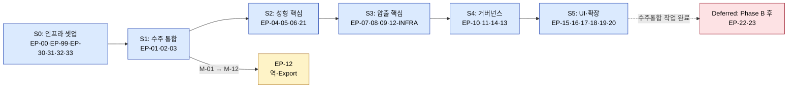
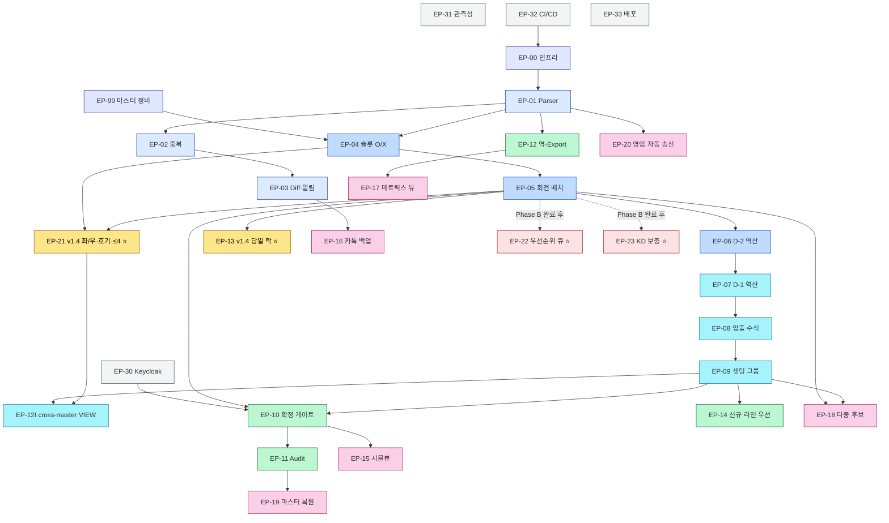

# 작업 분할 구조서 (Work Breakdown Structure, WBS)
문서 ID: TASK-001
개정: 1.1
작성일: 2026-05-15
표준 참조: PMBOK 7th Edition (WBS) + Scrum Guide 2020 (Epic·Story·Task) + INVEST 기준

시스템 명: **사내 공정 스케줄링 시스템 (Internal Production Scheduling System)**
원천 문서:
- [REF-PDD] `Phase 2/1.PDD/4.PDD_master_integrated_Opus.md` v1.5 (PDD+PRD 통합)
- [REF-SRS] `Phase 2/2.SRS/SRS-001_공정스케줄링시스템_v1.4.md` (요구사항 75 REQ-FUNC + 60 REQ-NF)
- [REF-SAD] `Phase 2/3.SAD/SAD-001_공정스케줄링시스템_v1.0.md` v1.1 (아키텍처 + ADR-008~017)
- [REF-PDD-02] `Phase 2/1.PDD/2.process_vulcanization_scheduling_Opus.md` v1.1 (성형 — BR-V07 재정의 + BR-V12~17)
- [REF-PDD-03] `Phase 2/1.PDD/3.process_extrusion_scheduling_Opus.md` v1.1 (압출 — BR-E12 cross-reference)
- 이전 WBS 버전: `Phase 2/4.Tasks/TASK-001_WBS_v1.0.md` (v1.0)

문서 상태: **Draft v1.1 (사용자 검토 대기)** — Phase 2 마지막 설계 산출물. v1.0의 §14 추정 요약 합계 행 정정 (Epic 28 → 32, 횡단 4 → 5). 콘텐츠 룰·SP 변경 없음.

---

## 1. 서문 (Introduction)

### 1.1 목적

본 WBS는 [REF-PDD] §17.5 Sprint 1~5 배분(10주)을 **Epic → Story → Task** 3단계로 세분화하고, [REF-SRS] 135개 요구사항 + [REF-SAD] ADR-008~017 + 인프라·운영 작업까지 **실행 가능한 단위로 분해**한다. Phase 2(설계)의 마지막 산출물이며, Phase 3(개발 실행) 진입 전 단일 기준 문서로 사용된다.

### 1.2 범위

| In-Scope | Out-of-Scope |
|---|---|
| Phase 1 MVP (Must 12건 + Should 5건 + Could 3건 = **20개 기능**) 전체 분해 | 실제 구현 코드 (Phase 3) |
| Phase 0 인프라 셋업 (Sprint 0) + 5 Sprint × 2주 = **11주** | Phase 2(MRP)·Phase 3 확장 (REF-PDD §17.4 Won't) |
| 횡단 작업 (CI/CD·인증·관측성·배포) | 운영 런북 (Stage 1.2) |
| **v1.4 신규 VC 요구사항** (REQ-FUNC-VC-012/013/014 재정의 + VC-021/024/025/026/027 Must) | 사용자 매뉴얼 (Stage 1.1) |
| **Deferred 항목** (VC-022/023, BR-V12·V13) — 수주정보 통합 작업(Phase B) 완료 후 활성 | 외주처 포털 (Phase 3) |
| Epic·Story·Task 식별자 + 의존성 + 추정 + 추적성 + 리스크 매핑 | 비용 산정 (별도 사업계획서) |

### 1.3 참조 (References)

| ID | 문서 |
|----|------|
| REF-PDD | `Phase 2/1.PDD/4.PDD_master_integrated_Opus.md` v1.4 |
| REF-SRS | `Phase 2/2.SRS/SRS-001_공정스케줄링시스템_v1.4.md` |
| REF-SAD | `Phase 2/3.SAD/SAD-001_공정스케줄링시스템_v1.0.md` v1.1 |
| REF-PDD-01 | `Phase 2/1.PDD/1.process_order_consolidation_Opus.md` |
| REF-PDD-02 | `Phase 2/1.PDD/2.process_vulcanization_scheduling_Opus.md` v1.1 |
| REF-PDD-03 | `Phase 2/1.PDD/3.process_extrusion_scheduling_Opus.md` v1.1 |
| REF-EX-MASTER | `Phase 1/2.Raw Materials/Extrusion/압출공정_제약조건.xlsx` (B열 규격 — BR-V17 판정용) |
| REF-VC-MASTER | `Phase 1/2.Raw Materials/Vulcanization/성형공정_제약조건.xlsx` (K/L열 — 좌/우 셋팅 BR-V15·V16) |

### 1.4 정의·약어

| 약어 | 확장 |
|------|------|
| WBS | Work Breakdown Structure |
| EP | Epic (대규모 산출물 단위, 1~3 Sprint) |
| ST | Story (사용자 가치 단위, 1 Sprint 내 완료) |
| TK | Task (개발자 작업 단위, 1~3 person-day) |
| SP | Story Point (Fibonacci: 1·2·3·5·8·13) |
| AC | Acceptance Criteria |
| DoR | Definition of Ready |
| DoD | Definition of Done |
| INVEST | Independent · Negotiable · Valuable · Estimable · Small · Testable |

### 1.5 식별자 표기 규칙

```
EP-NN              Epic        (NN = 00~99)
ST-NN-M            Story       (NN = Epic, M = Story 순번)
TK-NN-M-K          Task        (NN-M = Story, K = Task 순번)

예: EP-04 슬롯 O/X 검증
    └ ST-04-1 슬롯 적합성 매트릭스 빌드
        ├ TK-04-1-1 VC_CONSTRAINT 엔티티·Repository 구현
        ├ TK-04-1-2 매트릭스 빌드 서비스 구현
        └ TK-04-1-3 단위 테스트
```

---

## 2. WBS 개요 (Overview)

### 2.1 분해 원칙

| 원칙 | 적용 |
|------|------|
| **결과물 분해**(PMBOK) | Sprint → Epic → Story 까지는 결과물 중심 |
| **실행 분해**(Scrum) | Story → Task 는 실행 작업 중심 |
| INVEST 기준 | Story 단위에 적용 (Independent·Valuable·Small·Testable) |
| **8시간 룰** | Task는 1 person-day(8h) 이내로 분해 — 초과 시 다시 쪼갬 |
| **추적성 양방향** | 모든 Story는 REQ-FUNC ID 또는 NFR ID 또는 ADR ID 참조 |

### 2.2 식별자 체계 + Sprint 매핑

| Sprint | 기간 | Epic 범위 | 신규 v1.4 반영 |
|:---:|:---:|---|---|
| **S0** | 1주 (Phase 0) | EP-00 ~ EP-99 (인프라·마스터) | — |
| **S1** | 2주 | EP-01·02·03 (수주 통합 M-01~03) | — |
| **S2** | 2주 | EP-04·05·06 + **EP-21** (성형 M-04~06 + v1.4 VC-021/024/025/026/027) | ⭐ |
| **S3** | 2주 | EP-07·08·09 + EP-12-INFRA (압출 M-07~09 + cross-master VIEW) | ⭐ |
| **S4** | 2주 | EP-10·11·14 + **EP-13** (거버넌스 M-10/11/12 + S-02 + v1.4 당일 락 VC-012/013/014) | ⭐ |
| **S5** | 2주 | EP-15·16·17·18·19·20 (UI Should·Could) + E2E | — |
| **Deferred** | (Phase B 후) | **EP-22·23** (VC-022/023, BR-V12·V13) | ⭐ |
| **횡단** | 전 Sprint | EP-30·31·32·33 (CI/CD·인증·관측성·배포) | — |

### 2.3 Sprint 0 ~ 5 의존성 DAG



### 2.4 추정 단위 (Story Point 가이드)

| SP | 의미 | 대략 person-day |
|:---:|---|:---:|
| 1 | trivial — 단순 CRUD, 1개 컬럼 추가 | 0.5 |
| 2 | small — 단일 함수·간단한 화면 | 1 |
| 3 | medium — 1개 Story 평균 | 2 |
| 5 | large — 복합 검증·통합 | 3~4 |
| 8 | very large — 다중 모듈 결합, 분해 권장 | 6~8 |
| 13 | huge — **반드시 분해** | — |

> Velocity 가정: 2-person team × 10 days = 20 person-days/Sprint ≈ **35 SP/Sprint**. 5 Sprint × 35 = **175 SP**.

---

## 3. Sprint 0 — Phase 0 사전 준비 (1주)

> Sprint 1 진입 전 인프라·마스터·CI/CD 셋업. 별도 Sprint로 분리하여 개발 흐름 차단 방지.

### EP-00 인프라 기반 셋업 (Foundation)

**Sprint**: S0 / **출처**: REF-SAD ADR-010·013, §8 배포 / **SP**: 8 / **선행**: 없음

| Story | 제목 | 핵심 Task | SP | 출처 |
|---|---|---|:---:|---|
| ST-00-1 | Docker Compose 환경 구성 | TK-00-1-1 PostgreSQL 16 컨테이너, TK-00-1-2 Redis 7, TK-00-1-3 NGINX, TK-00-1-4 compose v2 파일 통합 검증 | 3 | REF-SAD ADR-010·013 |
| ST-00-2 | Spring Boot 모듈러 모놀리식 골격 | TK-00-2-1 Gradle 멀티모듈 골격, TK-00-2-2 Spring Modulith 모듈 경계 정의(`order`·`vc`·`ex`·`master`·`audit`·`notify`·`common`), TK-00-2-3 ArchUnit 테스트 | 3 | REF-SAD §4·5.1 |
| ST-00-3 | React + Vite 프론트엔드 골격 | TK-00-3-1 Vite + TS 5.4 프로젝트, TK-00-3-2 Ant Design 5 + 한국어 i18n, TK-00-3-3 라우팅·상태관리(Zustand) 골격 | 2 | REF-SAD §5.2 |

### EP-99 마스터 데이터 정비 (선행 작업)

**Sprint**: S0 / **출처**: REF-PDD §A-01, REF-SAD ADR-016·017 / **SP**: 5 / **선행**: 없음

| Story | 제목 | 핵심 Task | SP | 출처 |
|---|---|---|:---:|---|
| ST-99-1 | 성형 마스터 K/L열 + 품번별 호기·앵글 상한 정합성 검증 | TK-99-1-1 `성형공정_제약조건.xlsx` K/L열 47품번 검증, TK-99-1-2 `28422-08HA0`/`28422-2M800`/`28421-2M800` 룰 명세 cross-check, TK-99-1-3 마스터 무결성 회귀 SQL 작성 | 3 | REF-PDD-02 v1.1 BR-V14~V16 |
| ST-99-2 | 압출 마스터 B열(규격) 정합성 검증 + 47품번 규격 분포 분석 | TK-99-2-1 `압출공정_제약조건.xlsx` B열 정합성, TK-99-2-2 규격<7 품번 식별·리스트 출력, TK-99-2-3 BR-V17 영향 품번 사전 점검 | 2 | REF-PDD-03 BR-E12 + REF-PDD-02 BR-V17 |

### Sprint 0 DoD
- [ ] `docker compose up`으로 DEV 환경 부팅 성공 (PostgreSQL·Redis·NGINX·BE·FE 5개 컨테이너)
- [ ] Spring Modulith ArchUnit 테스트 통과 (모듈 경계 위반 0)
- [ ] 마스터 엑셀 K/L열·B열 무결성 100% (모든 row가 `o`/`x` 또는 숫자)
- [ ] CI/CD 파이프라인 초기 빌드 1회 성공 (EP-32 참조)

---

## 4. Sprint 1 — 수주 통합 기반 (2주)

> **Goal**: 3종 엑셀 → 통합 마스터 + Diff·알림 시연. EXP-1 진행 (4.2h → 30분 1차 측정).

### EP-01 엑셀 통합 Parser (M-01)

**Sprint**: S1 / **출처**: REF-PDD M-01, REQ-FUNC-OC-001~004 / **SP**: 13 / **선행**: EP-00

| Story | 제목 | 핵심 Task | SP | AC 출처 |
|---|---|---|:---:|---|
| ST-01-1 | 엑셀 워크북 입력·검증 (3종 포맷) | TK-01-1-1 Apache POI XSSF 통합, TK-01-1-2 워크북 헤더 자동 분류기(예상/주간/확정/KD), TK-01-1-3 추적 ID 부여 (2초 이내), TK-01-1-4 단위 테스트 (30건 회귀) | 5 | REQ-FUNC-OC-001·002 |
| ST-01-2 | 스키마 매핑 + 사용자 보정 | TK-01-2-1 자동 매핑 엔진(≥95% 성공), TK-01-2-2 매핑 보정 UI (Ant Design Form), TK-01-2-3 라운드트립 세션 보존, TK-01-2-4 통합 테스트 | 5 | REQ-FUNC-OC-003·004 |
| ST-01-3 | 폴더 폴링 watcher (Could) | TK-01-3-1 watchdog 폴링 60s, TK-01-3-2 큐 등록 + audit, TK-01-3-3 fs close 이벤트 핸들 | 3 | REQ-FUNC-OC-015 (Could) |

### EP-02 중복 감지 (M-02)

**Sprint**: S1 / **출처**: REF-PDD M-02, REQ-FUNC-OC-005~006 / **SP**: 5 / **선행**: EP-01

| Story | 제목 | 핵심 Task | SP | AC 출처 |
|---|---|---|:---:|---|
| ST-02-1 | (품번+납기) 중복 검출 | TK-02-1-1 UNIQUE 제약 + violation 핸들, TK-02-1-2 100사이클 회귀 (중복 0), TK-02-1-3 ORM 레벨 검증 | 3 | REQ-FUNC-OC-005 / BR-X02 |
| ST-02-2 | 우선순위 해소 (확정 > 주간 > KD > 예상) | TK-02-2-1 우선순위 룰 엔진 구현, TK-02-2-2 해소 audit 로그 생성, TK-02-2-3 단위 테스트 4종 케이스 | 2 | REQ-FUNC-OC-006 / BR-O01 |

### EP-03 Diff·알림 (M-03)

**Sprint**: S1 / **출처**: REF-PDD M-03, REQ-FUNC-OC-007~010 / **SP**: 8 / **선행**: EP-02

| Story | 제목 | 핵심 Task | SP | AC 출처 |
|---|---|---|:---:|---|
| ST-03-1 | 이전 버전 Diff 알고리즘 | TK-03-1-1 row-level diff 엔진, TK-03-1-2 100% 변형 회귀 통과, TK-03-1-3 diff 결과 데이터 모델 | 3 | REQ-FUNC-OC-007 |
| ST-03-2 | Critical 태깅 (납기·수량±20%·품번) | TK-03-2-1 Critical 분류기 (zero-false-negative), TK-03-2-2 단위 테스트, TK-03-2-3 BR-O02 정합 | 2 | REQ-FUNC-OC-008 / BR-O02 |
| ST-03-3 | 알림 발송 (시스템 + 카톡 백업) | TK-03-3-1 카카오톡 BizMessage 클라이언트, TK-03-3-2 도달 상태 추적(sent/ack/failed), TK-03-3-3 SLA <1분 부하 테스트 | 3 | REQ-FUNC-OC-009·010 / REQ-NF-PER-004 |

### Sprint 1 DoD
- [ ] EXP-1 1차 측정: 4.2h → ≤30분 cycle (3종 엑셀 → 통합본)
- [ ] M-01 자동 매핑 ≥95%, 중복 100% 차단, Critical 알림 SLA 100건 시뮬 ≥99% 도달
- [ ] 단위 테스트 ≥80% 커버리지, Sprint Review 데모 PASS

---

## 5. Sprint 2 — 성형 핵심 (2주) ⭐ v1.4 신규 VC 반영

> **Goal**: 1주 분량 수주 → 회전수 단위 후보 스케줄 + 슬롯/좌·우/호기/품번앵글상한/규격<7 위반 0건 시연.

### EP-04 슬롯 O/X 검증 (M-04)

**Sprint**: S2 / **출처**: REF-PDD M-04, REQ-FUNC-VC-001~004 / **SP**: 8 / **선행**: EP-01, EP-99

| Story | 제목 | 핵심 Task | SP | AC 출처 |
|---|---|---|:---:|---|
| ST-04-1 | 슬롯 적합성 매트릭스 빌드 | TK-04-1-1 `VC_CONSTRAINT` 엔티티(G~J·M~O 컬럼) + Repository, TK-04-1-2 매트릭스 빌드 서비스 (≤1초 재구축), TK-04-1-3 `/api/v1/master/compat` 엔드포인트, TK-04-1-4 회귀 100건 위반 0 검증 | 5 | REQ-FUNC-VC-001·002 |
| ST-04-2 | 스케줄 불가 품번 사전 제외 | TK-04-2-1 zero-슬롯 품번 식별 (`7X375-H0020` 등), TK-04-2-2 예외 리포트 출력, TK-04-2-3 단위 테스트 | 1 | REQ-FUNC-VC-003 / BR-V11 |
| ST-04-3 | 드래그앤드롭 위반 가드 (UI) | TK-04-3-1 dnd-kit 통합, TK-04-3-2 ≤1초 경고 + 저장 차단, TK-04-3-3 UAT 시나리오 | 2 | REQ-FUNC-VC-004 / REQ-NF-PER-006 |

### EP-05 회전수 배치 (M-05)

**Sprint**: S2 / **출처**: REF-PDD M-05, REQ-FUNC-VC-005~011 / **SP**: 13 / **선행**: EP-04

| Story | 제목 | 핵심 Task | SP | AC 출처 |
|---|---|---|:---:|---|
| ST-05-1 | 회전 단위 용량 모델 (18 회전/대) | TK-05-1-1 회전 도메인 모델 (date·rotation 1~18·machine·slot), TK-05-1-2 일일 capa 계산 (저압 72 + IC 18), TK-05-1-3 단위 테스트 | 3 | REQ-FUNC-VC-005 / BR-V04·V05 |
| ST-05-2 | 회전당 yield + 앵글 가용량 검증 | TK-05-2-1 yield 계산 (`합금형 × 앵글당금형수`), TK-05-2-2 앵글 capa 검증 (F열·N열), TK-05-2-3 stress 회귀 (앵글 과초과 0건) | 3 | REQ-FUNC-VC-006·007 / BR-V03·V06 |
| ST-05-3 | 필요 수량 계산 + 회전 배치 알고리즘 | TK-05-3-1 `Q_required` 계산 (재고·목표재고 결합), TK-05-3-2 회전 배치 알고리즘 v1 (단순 greedy), TK-05-3-3 100건 회귀 위반 0건 | 5 | REQ-FUNC-VC-009·010 |
| ST-05-4 | 저압 ↔ IC 라우팅 | TK-05-4-1 라우팅 정책 (저압 우선), TK-05-4-2 라우팅 로그 audit, TK-05-4-3 회귀 (저압 포화 후 IC) | 2 | REQ-FUNC-VC-011 / BR-V08 |

### EP-06 납기 D-2 역산 (M-06)

**Sprint**: S2 / **출처**: REF-PDD M-06, REQ-FUNC-VC-008 / **SP**: 3 / **선행**: EP-05

| Story | 제목 | 핵심 Task | SP | AC 출처 |
|---|---|---|:---:|---|
| ST-06-1 | D-2 영업일 역산 | TK-06-1-1 영업일 캘린더 서비스, TK-06-1-2 D-2 역산 로직, TK-06-1-3 모든 row `완료일 ≤ 납기-2` 검증 | 3 | REQ-FUNC-VC-008 / BR-X07 |

### EP-21 (v1.4 신규 Must) 좌/우·호기·품번앵글상한·규격<7 제약 ⭐

**Sprint**: S2 / **출처**: REF-PDD-02 v1.1 BR-V14·V15·V16·V17, REQ-FUNC-VC-021/024/025/026/027 / **SP**: 13 / **선행**: EP-04, EP-99

| Story | 제목 | 핵심 Task | SP | AC 출처 |
|---|---|---|:---:|---|
| ST-21-1 | VC_CONSTRAINT K/L 컬럼 + 좌/우 제약 | TK-21-1-1 ALTER TABLE 마이그레이션 (`lp_left_setting`·`lp_right_setting` CHAR(1) CHECK), TK-21-1-2 RuleEngine 좌/우 검증 함수, TK-21-1-3 `28421-2M800`/`28422-2M800` 회귀 통과 | 3 | REQ-FUNC-VC-021 / BR-V15·V16 |
| ST-21-2 | VC_HOSE_RULE 마스터 테이블 + 호기·앵글 상한 | TK-21-2-1 `master.VC_HOSE_RULE` DDL (machine_pin·max_concurrent_slots·side_lock·lp_only), TK-21-2-2 마스터 → 테이블 마이그레이션 스크립트, TK-21-2-3 LISTEN/NOTIFY 캐시 무효화 | 3 | REQ-FUNC-VC-024 (28422-08HA0) |
| ST-21-3 | `28422-08HA0` LP-01 단일 셋팅 | TK-21-3-1 RuleEngine `machine_pin` 강제 함수, TK-21-3-2 동시 다중 슬롯 차단 (Σ ≤1), TK-21-3-3 회귀 (LP-02~04 배정 0건) | 2 | REQ-FUNC-VC-024 / BR-V14 |
| ST-21-4 | `28422-2M800` 우측·≤2 + `28421-2M800` 좌측·≤2 | TK-21-4-1 RuleEngine 품번 단위 상한 함수, TK-21-4-2 좌/우 + ≤2 결합 검증, TK-21-4-3 회귀 통과 | 2 | REQ-FUNC-VC-025·026 / BR-V15·V16 |
| ST-21-5 | 규격<7 가류기당 앵글 ≤4 (cross-master) | TK-21-5-1 `v_product_with_spec` VIEW 생성, TK-21-5-2 Caffeine 캐시 + EX_CONSTRAINT LISTEN/NOTIFY 무효화, TK-21-5-3 RuleEngine `spec_lt7_cap` 함수, TK-21-5-4 회귀 (규격<7 품번 가류기당 ≤4 위반 0건) | 3 | REQ-FUNC-VC-027 / BR-V17 / ADR-017 |

### Sprint 2 DoD
- [ ] 슬롯 O/X 회귀 100건 위반 0건 (REQ-FUNC-VC-002)
- [ ] **(v1.4) 좌/우·호기·품번앵글상한·규격<7 위반 모두 0건** (REQ-FUNC-VC-021·024·025·026·027)
- [ ] 1주 분량 수주 → 회전수 후보 스케줄 생성 시연
- [ ] 단위 테스트 ≥80%, ArchUnit 모듈 경계 통과

---

## 6. Sprint 3 — 압출 핵심 (2주)

> **Goal**: 성형 확정 → 압출 후보 자동 생성, `29673-2R060` 2,531개 BR-E05 수식 검증 PASS.

### EP-07 D-1 자동 역산 (M-07)

**Sprint**: S3 / **출처**: REF-PDD M-07, REQ-FUNC-EX-001~002 / **SP**: 5 / **선행**: EP-06

| Story | 제목 | 핵심 Task | SP | AC 출처 |
|---|---|---|:---:|---|
| ST-07-1 | 압출 완료 기한 = 성형 투입 - 1일 | TK-07-1-1 `vc.confirmed` 이벤트 구독, TK-07-1-2 D-1 역산 로직, TK-07-1-3 모든 row `완료일 ≤ vc_date-1` 검증 | 3 | REQ-FUNC-EX-001 / BR-E01 |
| ST-07-2 | 영업일 캘린더 (월~금) | TK-07-2-1 토·일 제외 캘린더, TK-07-2-2 주말 기한 → 금요일 이전 회귀, TK-07-2-3 단위 테스트 | 2 | REQ-FUNC-EX-002 / BR-E02 / CON-10 |

### EP-08 압출 수식 (M-08)

**Sprint**: S3 / **출처**: REF-PDD M-08, REQ-FUNC-EX-003~005·010 / **SP**: 8 / **선행**: EP-07

| Story | 제목 | 핵심 Task | SP | AC 출처 |
|---|---|---|:---:|---|
| ST-08-1 | 4-shift 모델 + 75% 효율 | TK-08-1-1 shift 정의 마스터(`/api/v1/master/shifts`), TK-08-1-2 효율 75% 적용 (주간전반 = 180 min), TK-08-1-3 단위 테스트 | 3 | REQ-FUNC-EX-003·004 / BR-E03·E04 |
| ST-08-2 | yield 수식 + BR-E05 검증 | TK-08-2-1 `floor(speed × min × 1000 / length)` 구현, TK-08-2-2 `29673-2R060` 주간전반 = 2,531 회귀 PASS, TK-08-2-3 단위 변환 (mm vs m) 가드 | 3 | REQ-FUNC-EX-005 / BR-E05 |
| ST-08-3 | 압출 필요 수량 `Q_ext` 계산 | TK-08-3-1 `Q_ext = max(0, Q_vc + target - current)`, TK-08-3-2 4종 재고 케이스 단위 테스트, TK-08-3-3 통합 테스트 | 2 | REQ-FUNC-EX-010 |

### EP-09 압출셋팅 그룹핑 (M-09)

**Sprint**: S3 / **출처**: REF-PDD M-09, REQ-FUNC-EX-006~007 / **SP**: 5 / **선행**: EP-08

| Story | 제목 | 핵심 Task | SP | AC 출처 |
|---|---|---|:---:|---|
| ST-09-1 | shift 내 무 셋업 + 셋팅 그룹 동시생산 | TK-09-1-1 셋팅 번호(1~8) 그룹 모델, TK-09-1-2 shift당 단일 셋팅 그룹 강제, TK-09-1-3 4주 회귀 (shift 내 셋업 0건) | 5 | REQ-FUNC-EX-006·007 / BR-E06·E07 |

### EP-12-INFRA cross-master VIEW + 캐시 (ADR-017, BR-V17 인프라)

**Sprint**: S3 / **출처**: REF-SAD ADR-017 / **SP**: 3 / **선행**: EP-21 (ST-21-5와 페어)

> EP-21-5에서 RuleEngine 측 사용, 본 EP는 인프라(VIEW + 캐시 + LISTEN/NOTIFY) 측. 통합 시 ST-21-5의 일부와 중복될 수 있어 Sprint 2~3 사이 조정 필요.

| Story | 제목 | 핵심 Task | SP | AC 출처 |
|---|---|---|:---:|---|
| ST-12I-1 | `master.v_product_with_spec` VIEW + LISTEN/NOTIFY 인프라 검증 | TK-12I-1-1 VIEW DDL + 인덱스, TK-12I-1-2 EX_CONSTRAINT 변경 → NOTIFY 트리거, TK-12I-1-3 Caffeine 캐시 invalidate 통합 테스트 | 3 | ADR-017 |

### Sprint 3 DoD
- [ ] BR-E05 수식 회귀 (`29673-2R060` = 2,531) PASS
- [ ] shift 내 셋업 0회 (REQ-FUNC-EX-006)
- [ ] `vc.confirmed` → 압출 후보 자동 생성 E2E 시연

---

## 7. Sprint 4 — 거버넌스·최적화·당일 락 (2주) ⭐ v1.4 당일 락 반영

> **Goal**: BR-X01·BR-X02 모든 트랜잭션 차단 시나리오 PASS + **v1.4 당일 락 강제 100%** + 신규 라인 우선.

### EP-10 사용자 확정 게이트 (M-10)

**Sprint**: S4 / **출처**: REF-PDD M-10, REQ-FUNC-VC-019, REQ-FUNC-EX-019 / **SP**: 5 / **선행**: EP-05·EP-09

| Story | 제목 | 핵심 Task | SP | AC 출처 |
|---|---|---|:---:|---|
| ST-10-1 | Candidate → Confirmed 전이 게이트 (VC) | TK-10-1-1 상태 머신 (Draft/Candidate/Confirmed), TK-10-1-2 Planner role RBAC + 트리거, TK-10-1-3 직접 DB 쓰기 차단 negative 테스트 | 3 | REQ-FUNC-VC-019 / CON-07 |
| ST-10-2 | 확정 게이트 (EX) | TK-10-2-1 EX 동일 패턴 적용, TK-10-2-2 통합 테스트 | 2 | REQ-FUNC-EX-019 / BR-X01 |

### EP-11 Audit 기록 (M-11)

**Sprint**: S4 / **출처**: REF-PDD M-11, REQ-FUNC-CO-005·006, VC-020, EX-020 / **SP**: 5 / **선행**: EP-10

| Story | 제목 | 핵심 Task | SP | AC 출처 |
|---|---|---|:---:|---|
| ST-11-1 | DB 트리거 기반 audit 강제 (모든 변경) | TK-11-1-1 `audit_vc_schedule()`/`audit_ex_schedule()`/`audit_order()` 트리거 함수, TK-11-1-2 `@Auditable` AOP 결합, TK-11-1-3 audit 없는 커밋 차단 통합 테스트 | 3 | REQ-FUNC-VC-020·EX-020·CO-005·006 / BR-X02 |
| ST-11-2 | Audit 불변성 (UPDATE/DELETE 거부) | TK-11-2-1 `REVOKE UPDATE, DELETE ON audit.*`, TK-11-2-2 negative 테스트, TK-11-2-3 audit role 분리 | 2 | REQ-FUNC-CO-005 / NFR-SEC-004 |

### EP-12 엑셀 역-Export (M-12)

**Sprint**: S4 / **출처**: REF-PDD M-12, REQ-FUNC-OC-013, EX-018 / **SP**: 5 / **선행**: EP-01

| Story | 제목 | 핵심 Task | SP | AC 출처 |
|---|---|---|:---:|---|
| ST-12-1 | 통합 마스터 → 원본 포맷 워크북 export | TK-12-1-1 POI XSSF writer, TK-12-1-2 수식 보존, TK-12-1-3 셀-수준 차이 ≤2% 회귀 | 3 | REQ-FUNC-OC-013 |
| ST-12-2 | 압출 시트명 `*월*일(압출)` 매트릭스 export | TK-12-2-1 매트릭스 뷰 → 시트 변환, TK-12-2-2 정규식 `\d+월\d+일\(압출\)` 일치, TK-12-2-3 BR-E09 정합 | 2 | REQ-FUNC-EX-018 / BR-E09 |

### EP-13 (v1.4 재정의) 당일 락 강제 ⭐

**Sprint**: S4 / **출처**: REF-PDD-02 v1.1 BR-V07, REQ-FUNC-VC-012·013·014, ADR-016 / **SP**: 8 / **선행**: EP-05

| Story | 제목 | 핵심 Task | SP | AC 출처 |
|---|---|---|:---:|---|
| ST-13-1 | DB UNIQUE 제약 (당일 락 가드레일) | TK-13-1-1 `VC_SCHEDULE UNIQUE (machine_id, slot_position, production_date, hose_id) DEFERRABLE INITIALLY DEFERRED`, TK-13-1-2 마이그레이션 시 사전 점검 SQL, TK-13-1-3 violation 시 사용자 친화 에러 매핑 | 3 | REQ-FUNC-VC-012 / ADR-016 / BR-V07 |
| ST-13-2 | RuleEngine 일중 교체 차단 | TK-13-2-1 RuleEngine `intra_day_lock_ok` 함수, TK-13-2-2 1주 호라이즌 회귀 (일중 교체 0건), TK-13-2-3 후보 생성 시 차단 | 3 | REQ-FUNC-VC-012 / BR-V07 |
| ST-13-3 | 일말 교체 경계 + DO-04 영업일 키 출력 | TK-13-3-1 DO-04 출력 형식 변경 (영업일 경계 키), TK-13-3-2 audit 검증, TK-13-3-3 단위 테스트 | 1 | REQ-FUNC-VC-013 / BR-V07 |
| ST-13-4 | 사용자 override 모달 + 사유 강제 | TK-13-4-1 일중 교체 시도 시 모달 표시 UI, TK-13-4-2 사유 텍스트 강제 (REQ-FUNC-CO-010), TK-13-4-3 audit 사유 기록 통합 테스트 | 1 | REQ-FUNC-VC-014·CO-010 |

### EP-14 신규 라인 우선 라우팅 (S-02)

**Sprint**: S4 / **출처**: REF-PDD S-02, REQ-FUNC-EX-008·009 / **SP**: 3 / **선행**: EP-09

| Story | 제목 | 핵심 Task | SP | AC 출처 |
|---|---|---|:---:|---|
| ST-14-1 | 신규 우선 → 포드 폴백 라우팅 | TK-14-1-1 라우팅 정책 (신규 90%↑), TK-14-1-2 포드 전용 품번 차단 (zero 오라우팅), TK-14-1-3 라인 capa accounting | 3 | REQ-FUNC-EX-008·009 / BR-E08 |

### Sprint 4 DoD
- [ ] BR-X01 (사용자 확정 게이트) 모든 트랜잭션 차단 시나리오 PASS
- [ ] BR-X02 (audit 강제) audit 없는 커밋 100% 차단
- [ ] **(v1.4) 당일 락**: 일중 교체 0건 (1주 호라이즌 회귀)
- [ ] 신규 라인 사용률 ≥90% (회귀)

---

## 8. Sprint 5 — UI·확장·E2E (2주)

> **Goal**: 현장 시뮬뷰·카톡 백업·매트릭스 뷰 + Could 3건 + E2E (1주 분량) + 베타 그룹 사용 가능.

### EP-15 성형 현장 시뮬뷰 (S-03)

**Sprint**: S5 / **출처**: REF-PDD S-03, REQ-FUNC-VC-017·018 / **SP**: 5 / **선행**: EP-10

| Story | 제목 | 핵심 Task | SP | AC 출처 |
|---|---|---|:---:|---|
| ST-15-1 | Candidate → 시뮬뷰 ≤2초 발행 | TK-15-1-1 회전 단위 세분도 뷰, TK-15-1-2 STK-03 전용 페이지, TK-15-1-3 발행 SLA 부하 테스트 | 3 | REQ-FUNC-VC-017 |
| ST-15-2 | 현장 피드백 1클릭 수용 채널 | TK-15-2-1 순서 조정 제안 UI, TK-15-2-2 1클릭 수용 (총량 보존), TK-15-2-3 통합 테스트 | 2 | REQ-FUNC-VC-018 |

### EP-16 카톡 백업 채널 (S-04)

**Sprint**: S5 / **출처**: REF-PDD S-04 / **SP**: 3 / **선행**: EP-03

| Story | 제목 | 핵심 Task | SP | AC 출처 |
|---|---|---|:---:|---|
| ST-16-1 | 카카오톡 BizMessage 보강 + 도달 로그 | TK-16-1-1 도달 상태 100% 채움, TK-16-1-2 fallback 정책, TK-16-1-3 통합 테스트 | 3 | REQ-FUNC-OC-010 / REQ-FUNC-CO-008 |

### EP-17 일자×shift×라인 매트릭스 뷰 (S-05)

**Sprint**: S5 / **출처**: REF-PDD S-05, REQ-FUNC-EX-018 / **SP**: 5 / **선행**: EP-12

| Story | 제목 | 핵심 Task | SP | AC 출처 |
|---|---|---|:---:|---|
| ST-17-1 | 매트릭스 뷰 (AG Grid) + Gantt | TK-17-1-1 Frappe Gantt 통합, TK-17-1-2 AG Grid 매트릭스, TK-17-1-3 export 시트명 정규식 일치 | 5 | REQ-FUNC-EX-018 / BR-E09 |

### EP-18 다중 후보 ranking (C-01)

**Sprint**: S5 / **출처**: REF-PDD C-01, REQ-FUNC-XT-001 / **SP**: 3 / **선행**: EP-05·EP-09

| Story | 제목 | 핵심 Task | SP | AC 출처 |
|---|---|---|:---:|---|
| ST-18-1 | N개 후보 ranking (기한·교체·균형) | TK-18-1-1 ranking 함수, TK-18-1-2 ≥3 후보 반환 회귀, TK-18-1-3 UI 후보 선택 | 3 | REQ-FUNC-XT-001 |

### EP-19 임의 시점 마스터 복원 UI (C-02)

**Sprint**: S5 / **출처**: REF-PDD C-02, REQ-FUNC-OC-014·XT-002 / **SP**: 3 / **선행**: EP-11

| Story | 제목 | 핵심 Task | SP | AC 출처 |
|---|---|---|:---:|---|
| ST-19-1 | timestamp 선택 복원 (5초 이내) | TK-19-1-1 audit 기반 복원 쿼리, TK-19-1-2 UI 시점 슬라이더, TK-19-1-3 5년 부하 테스트 | 3 | REQ-FUNC-OC-014·XT-002 |

### EP-20 영업 폴더 watch 자동 송신 (C-03)

**Sprint**: S5 / **출처**: REF-PDD C-03, REQ-FUNC-OC-015·XT-003 / **SP**: 2 / **선행**: EP-01

| Story | 제목 | 핵심 Task | SP | AC 출처 |
|---|---|---|:---:|---|
| ST-20-1 | watchdog 폴더 ingest (60초 큐) | TK-20-1-1 fs close 이벤트 감지, TK-20-1-2 큐 등록 + audit, TK-20-1-3 60초 SLA | 2 | REQ-FUNC-XT-003 |

### EP-E2E E2E 시뮬레이션 + 베타 준비

**Sprint**: S5 / **출처**: EXP-1~5 / **SP**: 5 / **선행**: 모든 S1~S5 Epic

| Story | 제목 | 핵심 Task | SP | AC 출처 |
|---|---|---|:---:|---|
| ST-E2E-1 | E2E 1주 분량 시뮬레이션 | TK-E2E-1-1 데이터 시뮬레이터, TK-E2E-1-2 수주→성형→압출 cascade, TK-E2E-1-3 모든 납기 D-Day 충족 검증 | 3 | EXP-1·5 |
| ST-E2E-2 | 베타 그룹 시작 (4명) | TK-E2E-2-1 베타 사용자 설정, TK-E2E-2-2 NS-01 사전 설문, TK-E2E-2-3 1주 병행 운영 가이드 | 2 | EXP-2 |

### Sprint 5 DoD
- [ ] E2E 1주 분량 시뮬레이션 모든 납기 D-Day 충족
- [ ] 베타 그룹 4명 사용 가능 상태
- [ ] NFR-USA-003 한국어 UI 100% 커버리지
- [ ] 모든 Must/Should/Could 데모 시연 PASS

---

## 9. Deferred — Phase B (수주정보 통합 작업) 완료 후 활성 ⭐

> **선행 조건**: PDD-01 수주정보 통합 작업으로 `PRODUCT_PRIORITY`·`KD_ORDER` 마스터 데이터 흐름 정의 + 운영 가능 상태. 현재 Should 등급, 활성 후 Must 승격.

### EP-22 (Deferred) capa 초과 시 우선순위 추가요청 큐

**Sprint**: TBD (Phase B 후) / **출처**: REF-PDD-02 v1.1 BR-V12, REQ-FUNC-VC-022 / **SP**: 5 / **선행**: Phase B + EP-05

| Story | 제목 | 핵심 Task | SP | AC 출처 |
|---|---|---|:---:|---|
| ST-22-1 | `PRODUCT_PRIORITY` 마스터 + Redis sorted set | TK-22-1-1 마스터 테이블 활성 (DDL 이미 존재), TK-22-1-2 Redis sorted set 캐시, TK-22-1-3 우선순위 변경 → invalidate | 2 | REQ-FUNC-VC-022 |
| ST-22-2 | 추가요청 큐 분기 로직 + 사용자 게이트 | TK-22-2-1 `Σ Q_required > daily_capa` 분기, TK-22-2-2 우선순위 정렬 + 사용자 승인 큐, TK-22-2-3 audit 검증 | 3 | REQ-FUNC-VC-022 / BR-V12 |

### EP-23 (Deferred) capa 부족 시 KD 발주 보충

**Sprint**: TBD (Phase B 후) / **출처**: REF-PDD-02 v1.1 BR-V13, REQ-FUNC-VC-023 / **SP**: 5 / **선행**: Phase B + EP-05

| Story | 제목 | 핵심 Task | SP | AC 출처 |
|---|---|---|:---:|---|
| ST-23-1 | `KD_ORDER` 마스터 + Caffeine 캐시 | TK-23-1-1 마스터 테이블 활성 + 스냅샷 적재 배치, TK-23-1-2 캐시 정책, TK-23-1-3 LISTEN/NOTIFY | 2 | REQ-FUNC-VC-023 |
| ST-23-2 | KD 보충 우선순위 (동일품번 → 동일셋팅그룹) | TK-23-2-1 (i)/(ii) 우선순위 로직, TK-23-2-2 audit 검증 (보충 trace), TK-23-2-3 회귀 (capa 부족 케이스 100% 시도) | 3 | REQ-FUNC-VC-023 / BR-V13 |

---

## 10. 횡단 작업 (Cross-Cutting) — 전 Sprint 분산

### EP-30 인증·인가 (Keycloak — ADR-012)

**Sprint**: S0~S1 분산 / **출처**: REF-SAD ADR-012, REQ-FUNC-CO-001 / **SP**: 8

| Story | 제목 | 핵심 Task | SP |
|---|---|---|:---:|
| ST-30-1 | Keycloak 24 컨테이너 + 사내 SSO 페더레이션 | TK-30-1-1 Keycloak 컨테이너, TK-30-1-2 SAML/OIDC 페더레이션, TK-30-1-3 local fallback | 5 |
| ST-30-2 | RBAC + Spring Security 필터 | TK-30-2-1 Planner·Floor Supervisor·IT Operator·Read-only role, TK-30-2-2 RBAC 매트릭스, TK-30-2-3 403 처리 | 3 |

### EP-31 관측성 (Prometheus + Loki + Grafana — ADR-014)

**Sprint**: S0~S2 분산 / **출처**: REF-SAD ADR-014, REQ-NF-OPS-001~007 / **SP**: 5

| Story | 제목 | 핵심 Task | SP |
|---|---|---|:---:|
| ST-31-1 | Prometheus + Spring Actuator 메트릭 | TK-31-1-1 actuator 노출, TK-31-1-2 Prometheus scrape, TK-31-1-3 17 KPI 대시보드 골격 | 3 |
| ST-31-2 | Loki 로그 + Grafana 통합 + Slack 알림 | TK-31-2-1 Loki promtail, TK-31-2-2 Grafana datasource, TK-31-2-3 Slack webhook 알림 룰 | 2 |

### EP-32 CI/CD (Jenkins + Harbor + SonarQube — ADR-015)

**Sprint**: S0 / **출처**: REF-SAD ADR-015 / **SP**: 5

| Story | 제목 | 핵심 Task | SP |
|---|---|---|:---:|
| ST-32-1 | Jenkins LTS + 표준 파이프라인 | TK-32-1-1 Jenkinsfile 템플릿, TK-32-1-2 build → test → SonarQube → Harbor push, TK-32-1-3 무중단 배포 NGINX 토글 | 3 |
| ST-32-2 | Trivy 이미지 스캔 + 품질 게이트 | TK-32-2-1 Trivy 통합, TK-32-2-2 SonarQube quality gate, TK-32-2-3 빌드 실패 시 알림 | 2 |

### EP-33 배포 + 백업·복원 (Docker Compose, pg_basebackup — ADR-013, REQ-NF-REL-005)

**Sprint**: S0~S5 분산 / **출처**: REF-SAD §8, ADR-013 / **SP**: 5

| Story | 제목 | 핵심 Task | SP |
|---|---|---|:---:|
| ST-33-1 | Docker Compose v2 STG·PROD 환경 | TK-33-1-1 STG 환경, TK-33-1-2 PROD 환경, TK-33-1-3 환경별 변수 분리 | 3 |
| ST-33-2 | pg_basebackup + WAL archiving + 분기 복원 드릴 | TK-33-2-1 야간 02:00 KST 풀백업, TK-33-2-2 WAL continuous, TK-33-2-3 STG PITR 드릴 | 2 |

### EP-34 횡단 공통 기능 (CO Requirements)

**Sprint**: S2~S4 분산 / **출처**: REQ-FUNC-CO-001~010 / **SP**: 5

| Story | 제목 | 핵심 Task | SP |
|---|---|---|:---:|
| ST-34-1 | 마스터 dual-review (BR-X05) | TK-34-1-1 2명 승인자 검증, TK-34-1-2 동일 actor 거부, TK-34-1-3 통합 테스트 | 2 |
| ST-34-2 | MES 실적 수신 + 장애 폴백 (BR-X06) | TK-34-2-1 회전·shift 실적 수신, TK-34-2-2 1 shift 미수신 시 임시값, TK-34-2-3 재조정 | 2 |
| ST-34-3 | KST 시간 기준 통일 (BR-X04) | TK-34-3-1 모든 timestamp KST, TK-34-3-2 경계 일자 단위 테스트 | 1 |

---

## 11. 추적성 매트릭스 (REQ ↔ Epic/Story)

### 11.1 OC (수주 통합) — 15 REQ

| REQ-FUNC-OC | Story | Sprint |
|---|---|:---:|
| OC-001·002·003·004 | ST-01-1·ST-01-2 | S1 |
| OC-005·006 | ST-02-1·ST-02-2 | S1 |
| OC-007·008·009·010 | ST-03-1·ST-03-2·ST-03-3 | S1 |
| OC-011·012 | ST-10-1 (BR-X01·X02 결합) | S4 |
| OC-013 | ST-12-1 | S4 |
| OC-014 | ST-19-1 | S5 (Could) |
| OC-015 | ST-01-3·ST-20-1 | S1/S5 (Could) |

### 11.2 VC (성형) — 27 REQ (v1.4: 20 → 27)

| REQ-FUNC-VC | Story | Sprint |
|---|---|:---:|
| VC-001·002·003·004 | ST-04-1·ST-04-2·ST-04-3 | S2 |
| VC-005·006·007 | ST-05-1·ST-05-2 | S2 |
| VC-008 | ST-06-1 | S2 |
| VC-009·010·011 | ST-05-3·ST-05-4 | S2 |
| **VC-012·013·014 (v1.4 재정의)** | ST-13-1·ST-13-2·ST-13-3·ST-13-4 | S4 ⭐ |
| VC-015 | (포함: ST-04~05 충돌 처리) | S2 |
| VC-016 | (포함: 전체 검사 — 부하 테스트) | S2~S3 |
| VC-017·018 | ST-15-1·ST-15-2 | S5 |
| VC-019·020 | ST-10-1·ST-11-1 | S4 |
| **VC-021 (v1.4 신규)** | ST-21-1 | S2 ⭐ |
| **VC-022 (v1.4 신규, deferred)** | ST-22-1·ST-22-2 | Phase B 후 ⭐ |
| **VC-023 (v1.4 신규, deferred)** | ST-23-1·ST-23-2 | Phase B 후 ⭐ |
| **VC-024 (v1.4 신규)** | ST-21-2·ST-21-3 | S2 ⭐ |
| **VC-025·026 (v1.4 신규)** | ST-21-4 | S2 ⭐ |
| **VC-027 (v1.4 신규)** | ST-21-5·ST-12I-1 | S2~S3 ⭐ |

### 11.3 EX (압출) — 20 REQ

| REQ-FUNC-EX | Story | Sprint |
|---|---|:---:|
| EX-001·002 | ST-07-1·ST-07-2 | S3 |
| EX-003·004·005 | ST-08-1·ST-08-2 | S3 |
| EX-006·007 | ST-09-1 | S3 |
| EX-008·009 | ST-14-1 | S4 |
| EX-010·011·012 | (포함: ST-08-3 + 충돌 처리) | S3 |
| EX-013·014 | (포함: vc.changed cascade — ADR-011 이벤트 인프라) | S3~S4 |
| EX-015·016·017 | ST-15-* + 통지 | S5 |
| EX-018 | ST-17-1·ST-12-2 | S5/S4 |
| EX-019·020 | ST-10-2·ST-11-1 | S4 |

### 11.4 CO (횡단) — 10 REQ

| REQ-FUNC-CO | Story | Sprint |
|---|---|:---:|
| CO-001 | ST-30-2 | S0~S1 |
| CO-002 | ST-34-1 | S2~S4 |
| CO-003·004 | ST-34-2 | S2~S4 |
| CO-005·006 | ST-11-2 | S4 |
| CO-007 | ST-34-3 | S2~S4 |
| CO-008 | ST-16-1·ST-31-* | S5 |
| CO-009 | (포함: 모든 Sprint UI 작업의 한국어 i18n) | 전체 |
| **CO-010 (override 사유)** | ST-13-4 | S4 ⭐ |

### 11.5 XT (Could 확장) — 3 REQ

| REQ-FUNC-XT | Story | Sprint |
|---|---|:---:|
| XT-001 | ST-18-1 | S5 |
| XT-002 | ST-19-1 | S5 |
| XT-003 | ST-20-1 | S5 |

> **합계**: 모든 75개 REQ-FUNC가 Story에 매핑됨 (deferred 2건 포함, Phase B 후 활성).

---

## 12. 의존성 매트릭스 (선행 → 후행)



---

## 13. 리스크 ↔ Task 매핑 (Mitigation)

| Risk ID (출처) | 완화 Task |
|---|---|
| R-X01 마스터 데이터 부정확 (REF-PDD) | TK-99-1-1·TK-99-2-1 (마스터 정합성 검증), ST-34-1 (dual-review) |
| R-X02 사용자 저항 | TK-E2E-2-3 (1개월 병행 운영), ST-15-* (현장 시뮬뷰) |
| R-V01 슬롯 O/X 부정확 | TK-99-1-1·TK-99-2-1 + Sprint 0에서 사전 검증 |
| R-V03 당일 락 capa 경직화 (v1.1) | EP-22·EP-23 (capa 분기로 흡수, Phase B 후) |
| R-V08 LP-01 단일 셋팅 호기 고장 | ST-21-3 + Operational Event (라인 가용성 마스터) |
| R-V09 마스터 K/L·B열 무결성 (v1.1) | TK-21-1-1 CHECK 제약, ST-34-1 dual-review |
| SAD-RSK-009 마이그레이션 위반 잔존 | TK-13-1-2 (사전 점검 SQL) |
| SAD-RSK-010 마스터 무결성 누락 | TK-21-1-1 CHECK + TK-99-* |
| SAD-RSK-011 cross-join 캐시 무효화 누락 | TK-21-5-2·TK-12I-1-2 (LISTEN/NOTIFY 통합 테스트) |
| SAD-RSK-012 수주통합 지연 → BR-V12·V13 활성 공백 | Phase B 진척 점검 + 사용자 수동 가이드 (EP-22·23 deferred 명시) |
| R-E04 변경 폭증 재계산 발산 | (포함: REQ-FUNC-EX-013 통합 배치 로직) |
| R-E05 단위 혼선 (mm vs m) | TK-08-2-3 (단위 가드) |

---

## 14. 추정 요약 (Sprint별 SP 합계)

> **(v1.1 정정)** v1.0에서 합계 행 산술 오류 및 EP-34 누락 → 본문 §3~§10 실 카운트와 일치시킴.

| Sprint | Epic 수 | Story 수 | Task 수 (추정) | SP 합계 | 누적 |
|:---:|:---:|:---:|:---:|:---:|:---:|
| S0 | 2 (EP-00·99) | 5 | ~15 | 26 | 26 |
| S1 | 3 (EP-01·02·03) | 8 | ~25 | 26 | 52 |
| **S2** | **4 (EP-04·05·06·21)** ⭐ EP-21 신규 | 13 | ~40 | **37** ⭐ | 89 |
| S3 | 4 (EP-07·08·09·12-INFRA) | 7 | ~22 | 21 | 110 |
| **S4** | **5 (EP-10·11·12·13·14)** ⭐ EP-13 신규 | 11 | ~32 | **26** ⭐ | 136 |
| S5 | 7 (EP-15~20 + EP-E2E) | 11 | ~32 | 26 | 162 |
| 횡단 | **5 (EP-30·31·32·33·34)** | 9 | ~24 | 23 | 185 |
| **Deferred** | **2 (EP-22·23)** | 4 | ~10 | **10** | (별도) |
| **합계** | **32 Epic** | **68 Story** | **~190 Task** | **185 SP** | — |

> Velocity 35 SP/Sprint × 5 Sprint = 175 SP — 185 SP 대비 약간 초과. 횡단 작업(EP-30~34)을 Sprint 0~5에 분산하면 175~185 범위 내 안착. Deferred 10 SP는 Phase B 후 별도 Sprint.
>
> **(v1.1 변경 사항)** 합계 Epic 28 → 32 (E2E + EP-34 누락 분 + Deferred 가산), 횡단 4 → 5 (EP-34 추가). Story 64 → 68 (S2·S5 재집계). SP·Task 카운트 변경 없음.

---

## 15. Definition of Ready (DoR) / Definition of Done (DoD)

> REF-PDD §17.5.3 상속. 각 Story에 일괄 적용.

### 15.1 Story DoR (Sprint 진입 가능 조건)
- [ ] AC 명세 확정 (Given-When-Then 또는 REQ-FUNC AC 인용)
- [ ] 의존 선행 Story 완료 또는 mock 가능
- [ ] 테스트 데이터 준비 (마스터 + 시나리오)
- [ ] SP 추정 합의 (팀 planning poker)
- [ ] UI 와이어프레임 (해당 시)

### 15.2 Story DoD (Sprint 종료 시 충족)
- [ ] AC 100% 통과 (자동 테스트 + UAT)
- [ ] 단위 테스트 커버리지 ≥80% (변경 라인 기준)
- [ ] 회귀 테스트 통과 (CI green)
- [ ] 코드 리뷰 1명 이상 승인
- [ ] SonarQube quality gate 통과
- [ ] 한국어 UI 텍스트 검수 (해당 시)
- [ ] Audit 로그 검증 (변경 발생 Story 한정)
- [ ] Sprint Review 데모 시연 PASS

### 15.3 Sprint별 추가 종료 조건 (REF-PDD §17.5.3)
| Sprint | 추가 조건 |
|---|---|
| S1 | EXP-1 1차 측정 + Critical 알림 100건 SLA |
| S2 | **(v1.4)** 슬롯 O/X·좌/우·호기·앵글상한·규격<7 위반 0건 + 회전 배치 후보 시연 |
| S3 | BR-E05 (`29673-2R060` = 2,531) PASS |
| S4 | **(v1.4)** 당일 락 일중 교체 0건 + BR-X01·X02 트랜잭션 차단 시나리오 PASS |
| S5 | E2E 1주 분량 모든 납기 D-Day + 베타 그룹 4명 사용 가능 |

---

## 16. Phase B (수주정보 통합) 진입 조건 — Deferred Activation

> EP-22·EP-23 활성 트리거. Phase 1 MVP(Sprint 5) 종료와 별개로 진행 가능.

| 조건 | 검증 |
|---|---|
| **PDD-01에 `PRODUCT_PRIORITY` 데이터 흐름 정의** | 우선순위 1~99 의미·등록 주체·갱신 주기 명시 |
| **PDD-01에 `KD_ORDER` 데이터 흐름 정의** | KD 발주 잔량 출처(ERP·엑셀)·스냅샷 주기·셋팅 그룹 매핑 명시 |
| **SRS v1.4 REQ-FUNC-VC-022·023 활성 승격** | Should → Must 승격 + AC 정식화 |
| **마스터 테이블 활성** | DDL은 v1.1에서 존재 (ST-21-* 인프라 일부와 겹침), Phase B에서 데이터 적재 |
| **회귀 회기 추가** | capa 초과·부족 시뮬레이션 케이스 회귀 |

활성 후 EP-22 + EP-23 = **10 SP**, 약 1 Sprint(2주) 분량.

---

## 17. 개정 이력

| 버전 | 날짜 | 작성자 | 변경 |
|----|-----|------|------|
| 1.0 | 2026-05-15 | (작성자) | **초안 발행** — REF-PDD v1.4 §17.5 Sprint 1~5 + REF-SRS v1.4 75 REQ-FUNC + REF-SAD v1.1 ADR-008~017을 Epic·Story·Task 3단계로 분해. v1.4 신규 VC 7건(EP-21·EP-13) 반영. Deferred 항목 2건(EP-22·EP-23) 명시. 횡단 작업 4건(EP-30~33) 분리. Sprint 0(Phase 0 사전 준비) 신설 — 인프라·마스터 검증. (§14 합계 행에 산술 오류 및 EP-34 누락 — v1.1에서 정정) |
| 1.1 | 2026-05-15 | (작성자) | **§14 추정 요약 합계 행 정정 (신규 파일, 콘텐츠 룰·SP 변경 없음)** — Phase 2 산출물 일괄 검토에서 발견된 산술 오류 수정. (1) §14 합계 Epic 수: **28 → 32** (E2E + EP-34 누락 분 + Deferred 가산 반영). (2) §14 횡단 행: **4 (EP-30~33) → 5 (EP-30~34)** — EP-34 횡단 공통 기능(CO Requirements) 누락 분 포함. (3) §14 Story 수: **64 → 68** (S2·S5 재집계). (4) REF-PDD `v1.4` → **`v1.5`** (PDD-04 Constituent PDDs 동기 정정 반영). 본문 §3~§10 Epic 정의·SP·Task는 모두 v1.0과 동일 — 본 개정은 metadata·요약 정합성만 처리 |

---

## 18. 참조

| 분류 | 문서 |
|------|------|
| 원천 PDD | REF-PDD `Phase 2/1.PDD/4.PDD_master_integrated_Opus.md` v1.4 |
| 원천 SRS | REF-SRS `Phase 2/2.SRS/SRS-001_공정스케줄링시스템_v1.4.md` |
| 원천 SAD | REF-SAD `Phase 2/3.SAD/SAD-001_공정스케줄링시스템_v1.0.md` v1.1 |
| 상세 PDD-02 | `Phase 2/1.PDD/2.process_vulcanization_scheduling_Opus.md` v1.1 |
| 상세 PDD-03 | `Phase 2/1.PDD/3.process_extrusion_scheduling_Opus.md` v1.1 |
| 표준 | PMBOK 7th Edition — WBS guidance |
| 방법론 | Scrum Guide 2020 — Epic·Story·Task |
| 추정 가이드 | Planning Poker + INVEST 기준 |
| 마스터 데이터 | REF-VC-MASTER (성형 K/L열) + REF-EX-MASTER (압출 B열) |
