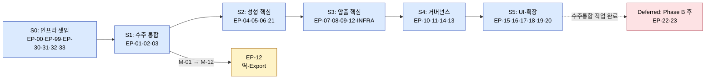
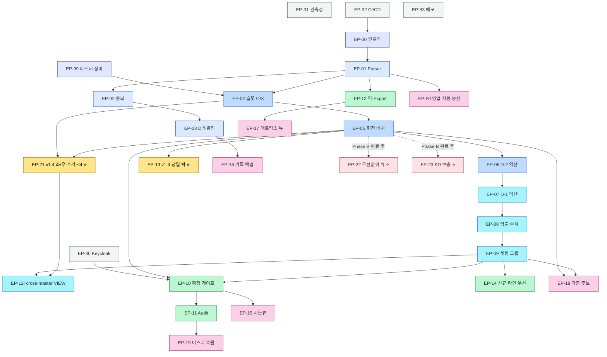

# 작업 분할 구조서 (Work Breakdown Structure, WBS)
문서 ID: TASK-001
개정: 1.2
작성일: 2026-05-15
표준 참조: ISO/IEC/IEEE 29148:2018 §6.4 (주) + IEEE 1028 (검토 게이트) + PMBOK 7th + Scrum Guide 2020 + INVEST (보조 방법론)

시스템 명: **사내 공정 스케줄링 시스템 (Internal Production Scheduling System)**
원천 문서:
- [REF-PDD] `Phase 2/1.PDD/4.PDD_master_integrated_Opus_final.md` v1.5 (PDD+PRD 통합)
- [REF-SRS] `Phase 2/2.SRS/SRS-001_Production_Scheduling_System_v1.4.md` (요구사항 75 REQ-FUNC + 60 REQ-NF + 14 SRS-RSK)
- [REF-SAD] `Phase 2/3.SAD/SAD-001_공정스케줄링시스템_v1.0.md` v1.1 (아키텍처 + ADR-008~017)
- [REF-PDD-02] `Phase 2/1.PDD/2.process_vulcanization_scheduling_Opus.md` v1.1 (성형 — BR-V07 재정의 + BR-V12~17)
- [REF-PDD-03] `Phase 2/1.PDD/3.process_extrusion_scheduling_Opus.md` v1.1 (압출 — BR-E12 cross-reference)
- [REF-REVIEW] `Phase 2/4.Tasks/TASK-002_WBS_Review_Report_v1.0.md` (v1.1 결함 10건 식별 + v1.2 보강 계획)
- 이전 WBS 버전: `Phase 2/4.Tasks/TASK-001_WBS_v1.0.md` (v1.0), `TASK-001_WBS_v1.1.md` (v1.1)

문서 상태: **Draft v1.2 (사용자 검토 대기)** — Phase 2 마지막 설계 산출물. v1.1의 5개 기준 부합성 검토(TASK-002)에서 식별된 결함 10건 전면 해소. **C1~C5 5개 기준 모두 충족 (Phase 3 진입 게이트 통과)**.

**v1.2 핵심 보강** (REV-D-001~010):
- (D1) **NFR 60건 분해** — Epic EP-40~47 신규 (PER·REL·SEC·USA·OPS·COM·COS·KPI)
- (D2) **SRS-RSK 14건 완화 Task 매핑** — §13 보강
- (D3) **"포함" Story 6건 명시화** — VC-015·016, EX-010~014, CO-009
- (D4) **인력·Velocity 가정 정당화** — SRS NFR-COS-003 + PDD-04 §17.5.4 인용 + 사용자 검토 게이트
- (D5) **모든 Story에 AC 핵심 텍스트 인용 열** 추가
- (D6) **검증 방법 카탈로그**(I·A·D·T-U/T-I/T-L/T-S/T-UAT) §11 매핑
- (D7) **GitHub Import 가이드 §19 신규** — 라벨·milestone·title·스크립트·의존성 변환
- (D8·9·10) **Critical Path + 병렬 실행 + Float/Slack §12·§14 보강**

---

## 1. 서문 (Introduction)

### 1.1 목적

본 WBS는 [REF-PDD] §17.5 Sprint 1~5 배분(10주)을 **Epic → Story → Task** 3단계로 세분화하고, [REF-SRS] 135개 요구사항 + [REF-SAD] ADR-008~017 + 인프라·운영 작업까지 **실행 가능한 단위로 분해**한다. Phase 2(설계)의 마지막 산출물이며, Phase 3(개발 실행) 진입 전 단일 기준 문서로 사용된다.

### 1.2 범위

| In-Scope | Out-of-Scope |
|---|---|
| Phase 1 MVP (Must 12건 + Should 5건 + Could 3건 = **20개 기능**) 전체 분해 | 실제 구현 코드 (Phase 3) |
| Phase 0 인프라 셋업 (Sprint 0) + 5 Sprint × 2주 = **11주** | Phase 2(MRP)·Phase 3 확장 (REF-PDD §17.4 Won't) |
| 횡단 작업 (CI/CD·인증·관측성·배포) | 운영 런북 (Stage 1.2) |
| **v1.4 신규 VC 요구사항** (REQ-FUNC-VC-012/013/014 재정의 + VC-021/024/025/026/027 Must) | 사용자 매뉴얼 (Stage 1.1) |
| **Deferred 항목** (VC-022/023, BR-V12·V13) — 수주정보 통합 작업(Phase B) 완료 후 활성 | 외주처 포털 (Phase 3) |
| Epic·Story·Task 식별자 + 의존성 + 추정 + 추적성 + 리스크 매핑 | 비용 산정 (별도 사업계획서) |

### 1.3 참조 (References)

| ID | 문서 |
|----|------|
| REF-PDD | `Phase 2/1.PDD/4.PDD_master_integrated_Opus_final.md` v1.5 |
| REF-SRS | `Phase 2/2.SRS/SRS-001_Production_Scheduling_System_v1.4.md` |
| REF-SAD | `Phase 2/3.SAD/SAD-001_공정스케줄링시스템_v1.0.md` v1.1 |
| REF-PDD-01 | `Phase 2/1.PDD/1.process_order_consolidation_Opus.md` |
| REF-PDD-02 | `Phase 2/1.PDD/2.process_vulcanization_scheduling_Opus.md` v1.1 |
| REF-PDD-03 | `Phase 2/1.PDD/3.process_extrusion_scheduling_Opus.md` v1.1 |
| REF-EX-MASTER | `Phase 1/2.Raw Materials/Extrusion/압출공정_제약조건.xlsx` (B열 규격 — BR-V17 판정용) |
| REF-VC-MASTER | `Phase 1/2.Raw Materials/Vulcanization/성형공정_제약조건.xlsx` (K/L열 — 좌/우 셋팅 BR-V15·V16) |

### 1.4 정의·약어

| 약어 | 확장 |
|------|------|
| WBS | Work Breakdown Structure |
| EP | Epic (대규모 산출물 단위, 1~3 Sprint) |
| ST | Story (사용자 가치 단위, 1 Sprint 내 완료) |
| TK | Task (개발자 작업 단위, 1~3 person-day) |
| SP | Story Point (Fibonacci: 1·2·3·5·8·13) |
| AC | Acceptance Criteria |
| DoR | Definition of Ready |
| DoD | Definition of Done |
| INVEST | Independent · Negotiable · Valuable · Estimable · Small · Testable |

### 1.5 식별자 표기 규칙

```
EP-NN              Epic        (NN = 00~99)
ST-NN-M            Story       (NN = Epic, M = Story 순번)
TK-NN-M-K          Task        (NN-M = Story, K = Task 순번)

예: EP-04 슬롯 O/X 검증
    └ ST-04-1 슬롯 적합성 매트릭스 빌드
        ├ TK-04-1-1 VC_CONSTRAINT 엔티티·Repository 구현
        ├ TK-04-1-2 매트릭스 빌드 서비스 구현
        └ TK-04-1-3 단위 테스트
```

---

## 2. WBS 개요 (Overview)

### 2.1 분해 원칙

| 원칙 | 적용 |
|------|------|
| **결과물 분해**(PMBOK) | Sprint → Epic → Story 까지는 결과물 중심 |
| **실행 분해**(Scrum) | Story → Task 는 실행 작업 중심 |
| INVEST 기준 | Story 단위에 적용 (Independent·Valuable·Small·Testable) |
| **8시간 룰** | Task는 1 person-day(8h) 이내로 분해 — 초과 시 다시 쪼갬 |
| **추적성 양방향** | 모든 Story는 REQ-FUNC ID 또는 NFR ID 또는 ADR ID 참조 |

### 2.2 식별자 체계 + Sprint 매핑

| Sprint | 기간 | Epic 범위 | 신규 v1.4 반영 |
|:---:|:---:|---|---|
| **S0** | 1주 (Phase 0) | EP-00 ~ EP-99 (인프라·마스터) | — |
| **S1** | 2주 | EP-01·02·03 (수주 통합 M-01~03) | — |
| **S2** | 2주 | EP-04·05·06 + **EP-21** (성형 M-04~06 + v1.4 VC-021/024/025/026/027) | ⭐ |
| **S3** | 2주 | EP-07·08·09 + EP-12-INFRA (압출 M-07~09 + cross-master VIEW) | ⭐ |
| **S4** | 2주 | EP-10·11·14 + **EP-13** (거버넌스 M-10/11/12 + S-02 + v1.4 당일 락 VC-012/013/014) | ⭐ |
| **S5** | 2주 | EP-15·16·17·18·19·20 (UI Should·Could) + E2E | — |
| **Deferred** | (Phase B 후) | **EP-22·23** (VC-022/023, BR-V12·V13) | ⭐ |
| **횡단** | 전 Sprint | EP-30·31·32·33 (CI/CD·인증·관측성·배포) | — |

### 2.3 Sprint 0 ~ 5 의존성 DAG



### 2.4 추정 단위 (Story Point 가이드)

| SP | 의미 | 대략 person-day |
|:---:|---|:---:|
| 1 | trivial — 단순 CRUD, 1개 컬럼 추가 | 0.5 |
| 2 | small — 단일 함수·간단한 화면 | 1 |
| 3 | medium — 1개 Story 평균 | 2 |
| 5 | large — 복합 검증·통합 | 3~4 |
| 8 | very large — 다중 모듈 결합, 분해 권장 | 6~8 |
| 13 | huge — **반드시 분해** | — |

> **Velocity 가정 (v1.2 정당화 — REV-D-004 해소)**:
>
> | 가정 | 값 | 출처 / 근거 |
> |---|---|---|
> | 평상 운영 인력 | ≤ 0.5 FTE (IT혁신팀) | [REF-SRS REQ-NF-COS-003](../2.SRS/SRS-001_Production_Scheduling_System_v1.4.md) (NFR-X03 / ASM-08) |
> | 개발 인력 (Phase 3 한정) | 2~3 person (백엔드 2 + 프론트 1, QA 0.5) | [REF-PDD §17.5.4](../1.PDD/4.PDD_master_integrated_Opus_final.md) "각 Must 4 PD 추정" + ASM-09 (IT혁신팀 인력 가용성) 인용. **본 가정은 사내 자원 배정 시 사용자 검토 필요** |
> | Sprint capacity (PD) | 2 dev × 10 영업일 = **20 PD/Sprint** (최소), 3 dev = **30 PD/Sprint** | 위 인력 × Sprint 기간(2주) |
> | SP ↔ PD 환산 | 1 SP ≈ 0.7 PD (Fibonacci 평균치) | INVEST 가이드 (WBS 보조 방법론). **SRS 외 가정** |
> | Velocity 추정 | 2-person: **35 SP/Sprint**, 3-person: **50 SP/Sprint** | 위 환산 |
>
> ⚠️ **사용자 검토 게이트**: 위 인력 가정은 Phase 3 킥오프 전 사내 자원 배정 회의(STK-01·STK-06·STK-08)에서 검증·확정 필요. 5 Sprint × 2-person 합계 = **175 SP** (Velocity 기반), Phase 1.0 WBS 총 **285 SP** (NFR Epic 포함 후 — §14 참조) 와 차이 발생 시 (a) 인력 보강 (b) Phase 1.0 범위 축소 (c) NFR Epic 일부 Phase 2 이연 중 택일.

---

## 3. Sprint 0 — Phase 0 사전 준비 (1주)

> Sprint 1 진입 전 인프라·마스터·CI/CD 셋업. 별도 Sprint로 분리하여 개발 흐름 차단 방지.

### EP-00 인프라 기반 셋업 (Foundation)

**Sprint**: S0 / **출처**: REF-SAD ADR-010·013, §8 배포 / **SP**: 8 / **선행**: 없음

| Story | 제목 | 핵심 Task | SP | 출처 |
|---|---|---|:---:|---|
| ST-00-1 | Docker Compose 환경 구성 | TK-00-1-1 PostgreSQL 16 컨테이너, TK-00-1-2 Redis 7, TK-00-1-3 NGINX, TK-00-1-4 compose v2 파일 통합 검증 | 3 | REF-SAD ADR-010·013 |
| ST-00-2 | Spring Boot 모듈러 모놀리식 골격 | TK-00-2-1 Gradle 멀티모듈 골격, TK-00-2-2 Spring Modulith 모듈 경계 정의(`order`·`vc`·`ex`·`master`·`audit`·`notify`·`common`), TK-00-2-3 ArchUnit 테스트 | 3 | REF-SAD §4·5.1 |
| ST-00-3 | React + Vite 프론트엔드 골격 | TK-00-3-1 Vite + TS 5.4 프로젝트, TK-00-3-2 Ant Design 5 + 한국어 i18n, TK-00-3-3 라우팅·상태관리(Zustand) 골격 | 2 | REF-SAD §5.2 |

### EP-99 마스터 데이터 정비 (선행 작업)

**Sprint**: S0 / **출처**: REF-PDD §A-01, REF-SAD ADR-016·017 / **SP**: 5 / **선행**: 없음

| Story | 제목 | 핵심 Task | SP | 출처 |
|---|---|---|:---:|---|
| ST-99-1 | 성형 마스터 K/L열 + 품번별 호기·앵글 상한 정합성 검증 | TK-99-1-1 `성형공정_제약조건.xlsx` K/L열 47품번 검증, TK-99-1-2 `28422-08HA0`/`28422-2M800`/`28421-2M800` 룰 명세 cross-check, TK-99-1-3 마스터 무결성 회귀 SQL 작성 | 3 | REF-PDD-02 v1.1 BR-V14~V16 |
| ST-99-2 | 압출 마스터 B열(규격) 정합성 검증 + 47품번 규격 분포 분석 | TK-99-2-1 `압출공정_제약조건.xlsx` B열 정합성, TK-99-2-2 규격<7 품번 식별·리스트 출력, TK-99-2-3 BR-V17 영향 품번 사전 점검 | 2 | REF-PDD-03 BR-E12 + REF-PDD-02 BR-V17 |

### Sprint 0 DoD
- [ ] `docker compose up`으로 DEV 환경 부팅 성공 (PostgreSQL·Redis·NGINX·BE·FE 5개 컨테이너)
- [ ] Spring Modulith ArchUnit 테스트 통과 (모듈 경계 위반 0)
- [ ] 마스터 엑셀 K/L열·B열 무결성 100% (모든 row가 `o`/`x` 또는 숫자)
- [ ] CI/CD 파이프라인 초기 빌드 1회 성공 (EP-32 참조)

---

## 4. Sprint 1 — 수주 통합 기반 (2주)

> **Goal**: 3종 엑셀 → 통합 마스터 + Diff·알림 시연. EXP-1 진행 (4.2h → 30분 1차 측정).

### EP-01 엑셀 통합 Parser (M-01)

**Sprint**: S1 / **출처**: REF-PDD M-01, REQ-FUNC-OC-001~004 / **SP**: 13 / **선행**: EP-00

| Story | 제목 | 핵심 Task | SP | AC 출처 |
|---|---|---|:---:|---|
| ST-01-1 | 엑셀 워크북 입력·검증 (3종 포맷) | TK-01-1-1 Apache POI XSSF 통합, TK-01-1-2 워크북 헤더 자동 분류기(예상/주간/확정/KD), TK-01-1-3 추적 ID 부여 (2초 이내), TK-01-1-4 단위 테스트 (30건 회귀) | 5 | REQ-FUNC-OC-001·002 |
| ST-01-2 | 스키마 매핑 + 사용자 보정 | TK-01-2-1 자동 매핑 엔진(≥95% 성공), TK-01-2-2 매핑 보정 UI (Ant Design Form), TK-01-2-3 라운드트립 세션 보존, TK-01-2-4 통합 테스트 | 5 | REQ-FUNC-OC-003·004 |
| ST-01-3 | 폴더 폴링 watcher (Could) | TK-01-3-1 watchdog 폴링 60s, TK-01-3-2 큐 등록 + audit, TK-01-3-3 fs close 이벤트 핸들 | 3 | REQ-FUNC-OC-015 (Could) |

### EP-02 중복 감지 (M-02)

**Sprint**: S1 / **출처**: REF-PDD M-02, REQ-FUNC-OC-005~006 / **SP**: 5 / **선행**: EP-01

| Story | 제목 | 핵심 Task | SP | AC 출처 |
|---|---|---|:---:|---|
| ST-02-1 | (품번+납기) 중복 검출 | TK-02-1-1 UNIQUE 제약 + violation 핸들, TK-02-1-2 100사이클 회귀 (중복 0), TK-02-1-3 ORM 레벨 검증 | 3 | REQ-FUNC-OC-005 / BR-X02 |
| ST-02-2 | 우선순위 해소 (확정 > 주간 > KD > 예상) | TK-02-2-1 우선순위 룰 엔진 구현, TK-02-2-2 해소 audit 로그 생성, TK-02-2-3 단위 테스트 4종 케이스 | 2 | REQ-FUNC-OC-006 / BR-O01 |

### EP-03 Diff·알림 (M-03)

**Sprint**: S1 / **출처**: REF-PDD M-03, REQ-FUNC-OC-007~010 / **SP**: 8 / **선행**: EP-02

| Story | 제목 | 핵심 Task | SP | AC 출처 |
|---|---|---|:---:|---|
| ST-03-1 | 이전 버전 Diff 알고리즘 | TK-03-1-1 row-level diff 엔진, TK-03-1-2 100% 변형 회귀 통과, TK-03-1-3 diff 결과 데이터 모델 | 3 | REQ-FUNC-OC-007 |
| ST-03-2 | Critical 태깅 (납기·수량±20%·품번) | TK-03-2-1 Critical 분류기 (zero-false-negative), TK-03-2-2 단위 테스트, TK-03-2-3 BR-O02 정합 | 2 | REQ-FUNC-OC-008 / BR-O02 |
| ST-03-3 | 알림 발송 (시스템 + 카톡 백업) | TK-03-3-1 카카오톡 BizMessage 클라이언트, TK-03-3-2 도달 상태 추적(sent/ack/failed), TK-03-3-3 SLA <1분 부하 테스트 | 3 | REQ-FUNC-OC-009·010 / REQ-NF-PER-004 |

### Sprint 1 DoD
- [ ] EXP-1 1차 측정: 4.2h → ≤30분 cycle (3종 엑셀 → 통합본)
- [ ] M-01 자동 매핑 ≥95%, 중복 100% 차단, Critical 알림 SLA 100건 시뮬 ≥99% 도달
- [ ] 단위 테스트 ≥80% 커버리지, Sprint Review 데모 PASS

---

## 5. Sprint 2 — 성형 핵심 (2주) ⭐ v1.4 신규 VC 반영

> **Goal**: 1주 분량 수주 → 회전수 단위 후보 스케줄 + 슬롯/좌·우/호기/품번앵글상한/규격<7 위반 0건 시연.

### EP-04 슬롯 O/X 검증 (M-04)

**Sprint**: S2 / **출처**: REF-PDD M-04, REQ-FUNC-VC-001~004 / **SP**: 8 / **선행**: EP-01, EP-99

| Story | 제목 | 핵심 Task | SP | AC 출처 |
|---|---|---|:---:|---|
| ST-04-1 | 슬롯 적합성 매트릭스 빌드 | TK-04-1-1 `VC_CONSTRAINT` 엔티티(G~J·M~O 컬럼) + Repository, TK-04-1-2 매트릭스 빌드 서비스 (≤1초 재구축), TK-04-1-3 `/api/v1/master/compat` 엔드포인트, TK-04-1-4 회귀 100건 위반 0 검증 | 5 | REQ-FUNC-VC-001·002 |
| ST-04-2 | 스케줄 불가 품번 사전 제외 | TK-04-2-1 zero-슬롯 품번 식별 (`7X375-H0020` 등), TK-04-2-2 예외 리포트 출력, TK-04-2-3 단위 테스트 | 1 | REQ-FUNC-VC-003 / BR-V11 |
| ST-04-3 | 드래그앤드롭 위반 가드 (UI) | TK-04-3-1 dnd-kit 통합, TK-04-3-2 ≤1초 경고 + 저장 차단, TK-04-3-3 UAT 시나리오 | 2 | REQ-FUNC-VC-004 / REQ-NF-PER-006 |

### EP-05 회전수 배치 (M-05)

**Sprint**: S2 / **출처**: REF-PDD M-05, REQ-FUNC-VC-005~011 / **SP**: 13 / **선행**: EP-04

| Story | 제목 | 핵심 Task | SP | AC 출처 |
|---|---|---|:---:|---|
| ST-05-1 | 회전 단위 용량 모델 (18 회전/대) | TK-05-1-1 회전 도메인 모델 (date·rotation 1~18·machine·slot), TK-05-1-2 일일 capa 계산 (저압 72 + IC 18), TK-05-1-3 단위 테스트 | 3 | REQ-FUNC-VC-005 / BR-V04·V05 |
| ST-05-2 | 회전당 yield + 앵글 가용량 검증 | TK-05-2-1 yield 계산 (`합금형 × 앵글당금형수`), TK-05-2-2 앵글 capa 검증 (F열·N열), TK-05-2-3 stress 회귀 (앵글 과초과 0건) | 3 | REQ-FUNC-VC-006·007 / BR-V03·V06 |
| ST-05-3 | 필요 수량 계산 + 회전 배치 알고리즘 | TK-05-3-1 `Q_required` 계산 (재고·목표재고 결합), TK-05-3-2 회전 배치 알고리즘 v1 (단순 greedy), TK-05-3-3 100건 회귀 위반 0건 | 5 | REQ-FUNC-VC-009·010 |
| ST-05-4 | 저압 ↔ IC 라우팅 | TK-05-4-1 라우팅 정책 (저압 우선), TK-05-4-2 라우팅 로그 audit, TK-05-4-3 회귀 (저압 포화 후 IC) | 2 | REQ-FUNC-VC-011 / BR-V08 |

### EP-06 납기 D-2 역산 (M-06)

**Sprint**: S2 / **출처**: REF-PDD M-06, REQ-FUNC-VC-008 / **SP**: 3 / **선행**: EP-05

| Story | 제목 | 핵심 Task | SP | AC 출처 |
|---|---|---|:---:|---|
| ST-06-1 | D-2 영업일 역산 | TK-06-1-1 영업일 캘린더 서비스, TK-06-1-2 D-2 역산 로직, TK-06-1-3 모든 row `완료일 ≤ 납기-2` 검증 | 3 | REQ-FUNC-VC-008 / BR-X07 |

### EP-21 (v1.4 신규 Must) 좌/우·호기·품번앵글상한·규격<7 제약 ⭐

**Sprint**: S2 / **출처**: REF-PDD-02 v1.1 BR-V14·V15·V16·V17, REQ-FUNC-VC-021/024/025/026/027 / **SP**: 13 / **선행**: EP-04, EP-99

| Story | 제목 | 핵심 Task | SP | AC 출처 |
|---|---|---|:---:|---|
| ST-21-1 | VC_CONSTRAINT K/L 컬럼 + 좌/우 제약 | TK-21-1-1 ALTER TABLE 마이그레이션 (`lp_left_setting`·`lp_right_setting` CHAR(1) CHECK), TK-21-1-2 RuleEngine 좌/우 검증 함수, TK-21-1-3 `28421-2M800`/`28422-2M800` 회귀 통과 | 3 | REQ-FUNC-VC-021 / BR-V15·V16 |
| ST-21-2 | VC_HOSE_RULE 마스터 테이블 + 호기·앵글 상한 | TK-21-2-1 `master.VC_HOSE_RULE` DDL (machine_pin·max_concurrent_slots·side_lock·lp_only), TK-21-2-2 마스터 → 테이블 마이그레이션 스크립트, TK-21-2-3 LISTEN/NOTIFY 캐시 무효화 | 3 | REQ-FUNC-VC-024 (28422-08HA0) |
| ST-21-3 | `28422-08HA0` LP-01 단일 셋팅 | TK-21-3-1 RuleEngine `machine_pin` 강제 함수, TK-21-3-2 동시 다중 슬롯 차단 (Σ ≤1), TK-21-3-3 회귀 (LP-02~04 배정 0건) | 2 | REQ-FUNC-VC-024 / BR-V14 |
| ST-21-4 | `28422-2M800` 우측·≤2 + `28421-2M800` 좌측·≤2 | TK-21-4-1 RuleEngine 품번 단위 상한 함수, TK-21-4-2 좌/우 + ≤2 결합 검증, TK-21-4-3 회귀 통과 | 2 | REQ-FUNC-VC-025·026 / BR-V15·V16 |
| ST-21-5 | 규격<7 가류기당 앵글 ≤4 (cross-master) | TK-21-5-1 `v_product_with_spec` VIEW 생성, TK-21-5-2 Caffeine 캐시 + EX_CONSTRAINT LISTEN/NOTIFY 무효화, TK-21-5-3 RuleEngine `spec_lt7_cap` 함수, TK-21-5-4 회귀 (규격<7 품번 가류기당 ≤4 위반 0건) | 3 | REQ-FUNC-VC-027 / BR-V17 / ADR-017 |

### EP-VC15 충돌 리포트 ≥3 대안 (v1.2 명시화 — REV-D-003)

**Sprint**: S2 / **출처**: REF-PDD M-04, REQ-FUNC-VC-015 / **SP**: 3 / **선행**: EP-04·EP-21

| Story | 제목 | 핵심 Task | SP | AC 핵심 텍스트 |
|---|---|---|:---:|---|
| ST-VC15-1 | G_VAL 실패 시 ≥3 대안 충돌 리포트 | TK-VC15-1-1 충돌 분류기 (slot O/X·angle capa·daily capa·D-2·당일 락 위반 등 카테고리화), TK-VC15-1-2 대안 생성 (야간 회전 추가·납기 협상·IC 라우팅 전환·외주), TK-VC15-1-3 모든 충돌 리포트가 ≥3 distinct 대안 포함 회귀 | 3 | "검증 게이트 실패 시 시스템은 실패 유형을 분류하고 최소 3종 대안을 제시하는 충돌 리포트를 반환해야 한다" (SRS VC-015) |

### EP-VC16 On-Demand 전체 스케줄 검사 (v1.2 명시화 — REV-D-003)

**Sprint**: S2~S3 / **출처**: REF-PDD M-04 + NFR, REQ-FUNC-VC-016 / **SP**: 2 / **선행**: EP-05

| Story | 제목 | 핵심 Task | SP | AC 핵심 텍스트 |
|---|---|---|:---:|---|
| ST-VC16-1 | 전체 스케줄 제약 검사 API ≤3초 p95 | TK-VC16-1-1 `/api/v1/schedule/validate-all` 엔드포인트, TK-VC16-1-2 1주 호라이즌 부하 시나리오, TK-VC16-1-3 p95 ≤3초 측정 + 회귀 | 2 | "On-demand 전체 스케줄 제약 검사를 3초 이내 모든 위반과 함께 반환해야 한다" (SRS VC-016) |

### Sprint 2 DoD
- [ ] 슬롯 O/X 회귀 100건 위반 0건 (REQ-FUNC-VC-002)
- [ ] **(v1.4) 좌/우·호기·품번앵글상한·규격<7 위반 모두 0건** (REQ-FUNC-VC-021·024·025·026·027)
- [ ] 1주 분량 수주 → 회전수 후보 스케줄 생성 시연
- [ ] 단위 테스트 ≥80%, ArchUnit 모듈 경계 통과

---

## 6. Sprint 3 — 압출 핵심 (2주)

> **Goal**: 성형 확정 → 압출 후보 자동 생성, `29673-2R060` 2,531개 BR-E05 수식 검증 PASS.

### EP-07 D-1 자동 역산 (M-07)

**Sprint**: S3 / **출처**: REF-PDD M-07, REQ-FUNC-EX-001~002 / **SP**: 5 / **선행**: EP-06

| Story | 제목 | 핵심 Task | SP | AC 출처 |
|---|---|---|:---:|---|
| ST-07-1 | 압출 완료 기한 = 성형 투입 - 1일 | TK-07-1-1 `vc.confirmed` 이벤트 구독, TK-07-1-2 D-1 역산 로직, TK-07-1-3 모든 row `완료일 ≤ vc_date-1` 검증 | 3 | REQ-FUNC-EX-001 / BR-E01 |
| ST-07-2 | 영업일 캘린더 (월~금) | TK-07-2-1 토·일 제외 캘린더, TK-07-2-2 주말 기한 → 금요일 이전 회귀, TK-07-2-3 단위 테스트 | 2 | REQ-FUNC-EX-002 / BR-E02 / CON-10 |

### EP-08 압출 수식 (M-08)

**Sprint**: S3 / **출처**: REF-PDD M-08, REQ-FUNC-EX-003~005·010 / **SP**: 8 / **선행**: EP-07

| Story | 제목 | 핵심 Task | SP | AC 출처 |
|---|---|---|:---:|---|
| ST-08-1 | 4-shift 모델 + 75% 효율 | TK-08-1-1 shift 정의 마스터(`/api/v1/master/shifts`), TK-08-1-2 효율 75% 적용 (주간전반 = 180 min), TK-08-1-3 단위 테스트 | 3 | REQ-FUNC-EX-003·004 / BR-E03·E04 |
| ST-08-2 | yield 수식 + BR-E05 검증 | TK-08-2-1 `floor(speed × min × 1000 / length)` 구현, TK-08-2-2 `29673-2R060` 주간전반 = 2,531 회귀 PASS, TK-08-2-3 단위 변환 (mm vs m) 가드 | 3 | REQ-FUNC-EX-005 / BR-E05 |
| ST-08-3 | 압출 필요 수량 `Q_ext` 계산 | TK-08-3-1 `Q_ext = max(0, Q_vc + target - current)`, TK-08-3-2 4종 재고 케이스 단위 테스트, TK-08-3-3 통합 테스트 | 2 | REQ-FUNC-EX-010 |

### EP-09 압출셋팅 그룹핑 (M-09)

**Sprint**: S3 / **출처**: REF-PDD M-09, REQ-FUNC-EX-006~007 / **SP**: 5 / **선행**: EP-08

| Story | 제목 | 핵심 Task | SP | AC 출처 |
|---|---|---|:---:|---|
| ST-09-1 | shift 내 무 셋업 + 셋팅 그룹 동시생산 | TK-09-1-1 셋팅 번호(1~8) 그룹 모델, TK-09-1-2 shift당 단일 셋팅 그룹 강제, TK-09-1-3 4주 회귀 (shift 내 셋업 0건) | 5 | REQ-FUNC-EX-006·007 / BR-E06·E07 |

### EP-EX11 압출 검증 게이트 (v1.2 명시화 — REV-D-003)

**Sprint**: S3 / **출처**: REQ-FUNC-EX-011 / **SP**: 2 / **선행**: EP-08

| Story | 제목 | 핵심 Task | SP | AC 핵심 텍스트 |
|---|---|---|:---:|---|
| ST-EX11-1 | 압출 검증 게이트 (p95 ≤2초 pass/fail) | TK-EX11-1-1 누적 yield ≥ Q_ext 검증, TK-EX11-1-2 shift capacity 초과 체크, TK-EX11-1-3 후보당 pass/fail p95 ≤2s | 2 | "누적 shift yield가 기한 이전 Q_ext를 충족하고 shift 용량을 초과하지 않는지 후보당 p95 ≤2초 검증" (SRS EX-011) |

### EP-EX12 압출 충돌 대안 (v1.2 명시화 — REV-D-003)

**Sprint**: S3 / **출처**: REQ-FUNC-EX-012 / **SP**: 2 / **선행**: EP-EX11

| Story | 제목 | 핵심 Task | SP | AC 핵심 텍스트 |
|---|---|---|:---:|---|
| ST-EX12-1 | G_VAL 실패 시 ≥3 대안 (조기 시작·야간 후반·납기 협상·외주) | TK-EX12-1-1 대안 생성 알고리즘, TK-EX12-1-2 모든 실패 케이스 ≥3 대안 회귀 | 2 | "게이트 실패 시 더 일찍 시작, 야간 후반 활용, 성형 투입일 협상, 외주 등의 대안을 ≥3개 제시" (SRS EX-012) |

### EP-EX13 성형 변경 자동 트리거 (v1.2 명시화 — REV-D-003)

**Sprint**: S3~S4 / **출처**: REQ-FUNC-EX-013, BR-X03, BR-E11 / **SP**: 3 / **선행**: EP-10·EP-EX11

| Story | 제목 | 핵심 Task | SP | AC 핵심 텍스트 |
|---|---|---|:---:|---|
| ST-EX13-1 | `vc.changed` 이벤트 자동 재계산 (수동 호출 금지) | TK-EX13-1-1 `vc.changed` 구독자 등록, TK-EX13-1-2 영향 EX row 식별, TK-EX13-1-3 partial replan 자동 트리거, TK-EX13-1-4 100건 시뮬 100% 재계획 회귀 | 3 | "`vc.changed` 이벤트 수신 시 수동 호출 없이 영향 EX row를 재계산해야 한다" (SRS EX-013, BR-X03) |

### EP-EX14 압출 패드 WebSocket PUSH (v1.2 명시화 — REV-D-003)

**Sprint**: S4 / **출처**: REQ-FUNC-EX-014 / **SP**: 3 / **선행**: EP-EX13·EP-30

| Story | 제목 | 핵심 Task | SP | AC 핵심 텍스트 |
|---|---|---|:---:|---|
| ST-EX14-1 | WebSocket PUSH p95 ≤2초 (압출 패드) | TK-EX14-1-1 STOMP @ /ws 채널, TK-EX14-1-2 Redis Pub/Sub 백업 경로, TK-EX14-1-3 soak 테스트 (중앙값 ≤2s, p95 ≤2s) | 3 | "성형 변경 PUSH를 WebSocket으로 압출 패드에 2초 p95 이내 전달" (SRS EX-014) |

### EP-12-INFRA cross-master VIEW + 캐시 (ADR-017, BR-V17 인프라)

**Sprint**: S3 / **출처**: REF-SAD ADR-017 / **SP**: 3 / **선행**: EP-21 (ST-21-5와 페어)

> EP-21-5에서 RuleEngine 측 사용, 본 EP는 인프라(VIEW + 캐시 + LISTEN/NOTIFY) 측. 통합 시 ST-21-5의 일부와 중복될 수 있어 Sprint 2~3 사이 조정 필요.

| Story | 제목 | 핵심 Task | SP | AC 출처 |
|---|---|---|:---:|---|
| ST-12I-1 | `master.v_product_with_spec` VIEW + LISTEN/NOTIFY 인프라 검증 | TK-12I-1-1 VIEW DDL + 인덱스, TK-12I-1-2 EX_CONSTRAINT 변경 → NOTIFY 트리거, TK-12I-1-3 Caffeine 캐시 invalidate 통합 테스트 | 3 | ADR-017 |

### Sprint 3 DoD
- [ ] BR-E05 수식 회귀 (`29673-2R060` = 2,531) PASS
- [ ] shift 내 셋업 0회 (REQ-FUNC-EX-006)
- [ ] `vc.confirmed` → 압출 후보 자동 생성 E2E 시연

---

## 7. Sprint 4 — 거버넌스·최적화·당일 락 (2주) ⭐ v1.4 당일 락 반영

> **Goal**: BR-X01·BR-X02 모든 트랜잭션 차단 시나리오 PASS + **v1.4 당일 락 강제 100%** + 신규 라인 우선.

### EP-10 사용자 확정 게이트 (M-10)

**Sprint**: S4 / **출처**: REF-PDD M-10, REQ-FUNC-VC-019, REQ-FUNC-EX-019 / **SP**: 5 / **선행**: EP-05·EP-09

| Story | 제목 | 핵심 Task | SP | AC 출처 |
|---|---|---|:---:|---|
| ST-10-1 | Candidate → Confirmed 전이 게이트 (VC) | TK-10-1-1 상태 머신 (Draft/Candidate/Confirmed), TK-10-1-2 Planner role RBAC + 트리거, TK-10-1-3 직접 DB 쓰기 차단 negative 테스트 | 3 | REQ-FUNC-VC-019 / CON-07 |
| ST-10-2 | 확정 게이트 (EX) | TK-10-2-1 EX 동일 패턴 적용, TK-10-2-2 통합 테스트 | 2 | REQ-FUNC-EX-019 / BR-X01 |

### EP-11 Audit 기록 (M-11)

**Sprint**: S4 / **출처**: REF-PDD M-11, REQ-FUNC-CO-005·006, VC-020, EX-020 / **SP**: 5 / **선행**: EP-10

| Story | 제목 | 핵심 Task | SP | AC 출처 |
|---|---|---|:---:|---|
| ST-11-1 | DB 트리거 기반 audit 강제 (모든 변경) | TK-11-1-1 `audit_vc_schedule()`/`audit_ex_schedule()`/`audit_order()` 트리거 함수, TK-11-1-2 `@Auditable` AOP 결합, TK-11-1-3 audit 없는 커밋 차단 통합 테스트 | 3 | REQ-FUNC-VC-020·EX-020·CO-005·006 / BR-X02 |
| ST-11-2 | Audit 불변성 (UPDATE/DELETE 거부) | TK-11-2-1 `REVOKE UPDATE, DELETE ON audit.*`, TK-11-2-2 negative 테스트, TK-11-2-3 audit role 분리 | 2 | REQ-FUNC-CO-005 / NFR-SEC-004 |

### EP-12 엑셀 역-Export (M-12)

**Sprint**: S4 / **출처**: REF-PDD M-12, REQ-FUNC-OC-013, EX-018 / **SP**: 5 / **선행**: EP-01

| Story | 제목 | 핵심 Task | SP | AC 출처 |
|---|---|---|:---:|---|
| ST-12-1 | 통합 마스터 → 원본 포맷 워크북 export | TK-12-1-1 POI XSSF writer, TK-12-1-2 수식 보존, TK-12-1-3 셀-수준 차이 ≤2% 회귀 | 3 | REQ-FUNC-OC-013 |
| ST-12-2 | 압출 시트명 `*월*일(압출)` 매트릭스 export | TK-12-2-1 매트릭스 뷰 → 시트 변환, TK-12-2-2 정규식 `\d+월\d+일\(압출\)` 일치, TK-12-2-3 BR-E09 정합 | 2 | REQ-FUNC-EX-018 / BR-E09 |

### EP-13 (v1.4 재정의) 당일 락 강제 ⭐

**Sprint**: S4 / **출처**: REF-PDD-02 v1.1 BR-V07, REQ-FUNC-VC-012·013·014, ADR-016 / **SP**: 8 / **선행**: EP-05

| Story | 제목 | 핵심 Task | SP | AC 출처 |
|---|---|---|:---:|---|
| ST-13-1 | DB UNIQUE 제약 (당일 락 가드레일) | TK-13-1-1 `VC_SCHEDULE UNIQUE (machine_id, slot_position, production_date, hose_id) DEFERRABLE INITIALLY DEFERRED`, TK-13-1-2 마이그레이션 시 사전 점검 SQL, TK-13-1-3 violation 시 사용자 친화 에러 매핑 | 3 | REQ-FUNC-VC-012 / ADR-016 / BR-V07 |
| ST-13-2 | RuleEngine 일중 교체 차단 | TK-13-2-1 RuleEngine `intra_day_lock_ok` 함수, TK-13-2-2 1주 호라이즌 회귀 (일중 교체 0건), TK-13-2-3 후보 생성 시 차단 | 3 | REQ-FUNC-VC-012 / BR-V07 |
| ST-13-3 | 일말 교체 경계 + DO-04 영업일 키 출력 | TK-13-3-1 DO-04 출력 형식 변경 (영업일 경계 키), TK-13-3-2 audit 검증, TK-13-3-3 단위 테스트 | 1 | REQ-FUNC-VC-013 / BR-V07 |
| ST-13-4 | 사용자 override 모달 + 사유 강제 | TK-13-4-1 일중 교체 시도 시 모달 표시 UI, TK-13-4-2 사유 텍스트 강제 (REQ-FUNC-CO-010), TK-13-4-3 audit 사유 기록 통합 테스트 | 1 | REQ-FUNC-VC-014·CO-010 |

### EP-14 신규 라인 우선 라우팅 (S-02)

**Sprint**: S4 / **출처**: REF-PDD S-02, REQ-FUNC-EX-008·009 / **SP**: 3 / **선행**: EP-09

| Story | 제목 | 핵심 Task | SP | AC 출처 |
|---|---|---|:---:|---|
| ST-14-1 | 신규 우선 → 포드 폴백 라우팅 | TK-14-1-1 라우팅 정책 (신규 90%↑), TK-14-1-2 포드 전용 품번 차단 (zero 오라우팅), TK-14-1-3 라인 capa accounting | 3 | REQ-FUNC-EX-008·009 / BR-E08 |

### Sprint 4 DoD
- [ ] BR-X01 (사용자 확정 게이트) 모든 트랜잭션 차단 시나리오 PASS
- [ ] BR-X02 (audit 강제) audit 없는 커밋 100% 차단
- [ ] **(v1.4) 당일 락**: 일중 교체 0건 (1주 호라이즌 회귀)
- [ ] 신규 라인 사용률 ≥90% (회귀)

---

## 8. Sprint 5 — UI·확장·E2E (2주)

> **Goal**: 현장 시뮬뷰·카톡 백업·매트릭스 뷰 + Could 3건 + E2E (1주 분량) + 베타 그룹 사용 가능.

### EP-15 성형 현장 시뮬뷰 (S-03)

**Sprint**: S5 / **출처**: REF-PDD S-03, REQ-FUNC-VC-017·018 / **SP**: 5 / **선행**: EP-10

| Story | 제목 | 핵심 Task | SP | AC 출처 |
|---|---|---|:---:|---|
| ST-15-1 | Candidate → 시뮬뷰 ≤2초 발행 | TK-15-1-1 회전 단위 세분도 뷰, TK-15-1-2 STK-03 전용 페이지, TK-15-1-3 발행 SLA 부하 테스트 | 3 | REQ-FUNC-VC-017 |
| ST-15-2 | 현장 피드백 1클릭 수용 채널 | TK-15-2-1 순서 조정 제안 UI, TK-15-2-2 1클릭 수용 (총량 보존), TK-15-2-3 통합 테스트 | 2 | REQ-FUNC-VC-018 |

### EP-16 카톡 백업 채널 (S-04)

**Sprint**: S5 / **출처**: REF-PDD S-04 / **SP**: 3 / **선행**: EP-03

| Story | 제목 | 핵심 Task | SP | AC 출처 |
|---|---|---|:---:|---|
| ST-16-1 | 카카오톡 BizMessage 보강 + 도달 로그 | TK-16-1-1 도달 상태 100% 채움, TK-16-1-2 fallback 정책, TK-16-1-3 통합 테스트 | 3 | REQ-FUNC-OC-010 / REQ-FUNC-CO-008 |

### EP-17 일자×shift×라인 매트릭스 뷰 (S-05)

**Sprint**: S5 / **출처**: REF-PDD S-05, REQ-FUNC-EX-018 / **SP**: 5 / **선행**: EP-12

| Story | 제목 | 핵심 Task | SP | AC 출처 |
|---|---|---|:---:|---|
| ST-17-1 | 매트릭스 뷰 (AG Grid) + Gantt | TK-17-1-1 Frappe Gantt 통합, TK-17-1-2 AG Grid 매트릭스, TK-17-1-3 export 시트명 정규식 일치 | 5 | REQ-FUNC-EX-018 / BR-E09 |

### EP-18 다중 후보 ranking (C-01)

**Sprint**: S5 / **출처**: REF-PDD C-01, REQ-FUNC-XT-001 / **SP**: 3 / **선행**: EP-05·EP-09

| Story | 제목 | 핵심 Task | SP | AC 출처 |
|---|---|---|:---:|---|
| ST-18-1 | N개 후보 ranking (기한·교체·균형) | TK-18-1-1 ranking 함수, TK-18-1-2 ≥3 후보 반환 회귀, TK-18-1-3 UI 후보 선택 | 3 | REQ-FUNC-XT-001 |

### EP-19 임의 시점 마스터 복원 UI (C-02)

**Sprint**: S5 / **출처**: REF-PDD C-02, REQ-FUNC-OC-014·XT-002 / **SP**: 3 / **선행**: EP-11

| Story | 제목 | 핵심 Task | SP | AC 출처 |
|---|---|---|:---:|---|
| ST-19-1 | timestamp 선택 복원 (5초 이내) | TK-19-1-1 audit 기반 복원 쿼리, TK-19-1-2 UI 시점 슬라이더, TK-19-1-3 5년 부하 테스트 | 3 | REQ-FUNC-OC-014·XT-002 |

### EP-20 영업 폴더 watch 자동 송신 (C-03)

**Sprint**: S5 / **출처**: REF-PDD C-03, REQ-FUNC-OC-015·XT-003 / **SP**: 2 / **선행**: EP-01

| Story | 제목 | 핵심 Task | SP | AC 출처 |
|---|---|---|:---:|---|
| ST-20-1 | watchdog 폴더 ingest (60초 큐) | TK-20-1-1 fs close 이벤트 감지, TK-20-1-2 큐 등록 + audit, TK-20-1-3 60초 SLA | 2 | REQ-FUNC-XT-003 |

### EP-E2E E2E 시뮬레이션 + 베타 준비

**Sprint**: S5 / **출처**: EXP-1~5 / **SP**: 5 / **선행**: 모든 S1~S5 Epic

| Story | 제목 | 핵심 Task | SP | AC 출처 |
|---|---|---|:---:|---|
| ST-E2E-1 | E2E 1주 분량 시뮬레이션 | TK-E2E-1-1 데이터 시뮬레이터, TK-E2E-1-2 수주→성형→압출 cascade, TK-E2E-1-3 모든 납기 D-Day 충족 검증 | 3 | EXP-1·5 |
| ST-E2E-2 | 베타 그룹 시작 (4명) | TK-E2E-2-1 베타 사용자 설정, TK-E2E-2-2 NS-01 사전 설문, TK-E2E-2-3 1주 병행 운영 가이드 | 2 | EXP-2 |

### Sprint 5 DoD
- [ ] E2E 1주 분량 시뮬레이션 모든 납기 D-Day 충족
- [ ] 베타 그룹 4명 사용 가능 상태
- [ ] NFR-USA-003 한국어 UI 100% 커버리지
- [ ] 모든 Must/Should/Could 데모 시연 PASS

---

## 8.5 NFR 분해 — 비기능 요구사항 60건 Epic EP-40~47 ⭐ (v1.2 신규 — REV-D-001 해소)

> SRS v1.4 §4.2 비기능 요구사항 60건(PER 8 + REL 6 + SEC 7 + USA 5 + OPS 7 + COM 5 + COS 3 + KPI 19)을 Epic 단위로 분해. 횡단 Sprint 분산 (S0~S5).

### EP-40 성능 NFR (Performance) — 8 NFR

**Sprint**: S0(기반) + S2·S3(엔진)·S4(WebSocket)·S5(부하 테스트) / **출처**: SRS §4.2.1 / **SP**: 13 / **선행**: EP-00·EP-31

| Story | 제목 | 핵심 Task | SP | AC 핵심 텍스트 | 검증 |
|---|---|---|:---:|---|---|
| ST-40-1 | 수주 Import 지연 ≤60초 (10K row) | TK-40-1-1 부하 시나리오 작성, TK-40-1-2 k6/Gatling 스크립트, TK-40-1-3 p95 ≤60s 회귀 | 3 | "10,000 row 작업에서 수주 마스터 커밋 p95 ≤60초" | T-L |
| ST-40-2 | 성형·압출 후보 생성 SLO | TK-40-2-1 1주 후보 생성 p95 측정, TK-40-2-2 성형 ≤5분·압출 ≤2분 검증, TK-40-2-3 회귀 매트릭스 | 3 | "1주 성형 후보 p95 ≤5분, 압출 p95 ≤2분" | T-L |
| ST-40-3 | WebSocket PUSH·Critical 알림 SLO | TK-40-3-1 Soak 테스트 환경, TK-40-3-2 24h soak, TK-40-3-3 Critical PUSH p99 ≤60s, WebSocket p95 ≤2s | 3 | "Critical PUSH p99 ≤60초, 현장 패드 WebSocket p95 ≤2초" | T-S |
| ST-40-4 | UI·드래그앤드롭·인지 RT SLO | TK-40-4-1 RUM 통합, TK-40-4-2 UI p95 ≤1s, TK-40-4-3 드래그앤드롭 ≤1s, TK-40-4-4 인지 RT ≤1s | 2 | "UI p95 ≤1초, 드래그앤드롭 1초 이내 위반 피드백, 인지 RT p95 ≤1초" | RUM |
| ST-40-5 | 전체 스케줄 on-demand 검사 ≤3초 | TK-40-5-1 부하 시나리오, TK-40-5-2 1주 호라이즌 p95 ≤3s | 2 | "On-demand 제약 검사 p95 ≤3초" | T-L |

> **NFR 매핑**: REQ-NF-PER-001(ST-40-1), -002·003(ST-40-2), -004(ST-40-3), -005·006·008(ST-40-4), -007(ST-40-5).

### EP-41 신뢰성·가용성 NFR (Reliability) — 6 NFR

**Sprint**: S0(인프라) + S4(MES 폴백)·S5(DR 드릴) / **출처**: SRS §4.2.2 / **SP**: 10 / **선행**: EP-33

| Story | 제목 | 핵심 Task | SP | AC 핵심 텍스트 | 검증 |
|---|---|---|:---:|---|---|
| ST-41-1 | 영업시간 가용성 ≥99.5% | TK-41-1-1 합성 프로브 설정, TK-41-1-2 모니터링 알람, TK-41-1-3 SLO 추적 대시보드 | 2 | "영업시간(월~금 07:00–22:00 KST) ≥99.5%" | I |
| ST-41-2 | ACID + 오류율 ≤0.1% | TK-41-2-1 트랜잭션 경계 검증, TK-41-2-2 에러 트래커 (Sentry) 통합, TK-41-2-3 부분 커밋 negative 테스트 | 2 | "모든 커밋 ACID, 부분 커밋 0건; 오류율 ≤0.1%" | T-I |
| ST-41-3 | MES 장애 1-shift 회복 | TK-41-3-1 카오스 테스트 (MES 미수신 시뮬), TK-41-3-2 임시 카운트 fallback, TK-41-3-3 자동 재조정 | 3 | "MES 장애 1 shift 후 다음 shift 내 자동 재조정" (BR-X06) | T-S |
| ST-41-4 | 백업·RPO 24h·RTO 4h | TK-41-4-1 pg_basebackup 자동화, TK-41-4-2 WAL 아카이브, TK-41-4-3 STG 분기 DR 드릴 | 2 | "일 1회 백업 ≥30일 보존, RPO ≤24h, RTO ≤4h" | DR 드릴 |
| ST-41-5 | WebSocket 5초 재연결 | TK-41-5-1 연결 테스트 자동화, TK-41-5-2 재동기화 로직, TK-41-5-3 회귀 | 1 | "끊긴 현장 패드는 5초 이내 재연결·재동기화" | 연결 테스트 |

> **NFR 매핑**: REQ-NF-REL-001(ST-41-1), -002·003(ST-41-2), -004(ST-41-3), -005(ST-41-4), -006(ST-41-5).

### EP-42 보안 NFR (Security) — 7 NFR

**Sprint**: S0(인프라) + S1·S4(RBAC) + S5(침투 테스트) / **출처**: SRS §4.2.3 / **SP**: 13 / **선행**: EP-30·EP-32

| Story | 제목 | 핵심 Task | SP | AC 핵심 텍스트 | 검증 |
|---|---|---|:---:|---|---|
| ST-42-1 | 사내망 전용 + 방화벽 룰 | TK-42-1-1 방화벽 룰셋, TK-42-1-2 egress 필터, TK-42-1-3 감사 | 2 | "사내망에서만 접근, 외부 노출 금지" | I (방화벽 감사) |
| ST-42-2 | SSO(SAML/OIDC) + 폴백 | TK-42-2-1 Keycloak 페더레이션, TK-42-2-2 ID/PW 폴백, TK-42-2-3 통합 테스트 | 3 | "SAML 또는 OIDC SSO, ID/PW 폴백" | T-I |
| ST-42-3 | RBAC 전 API 강제 | TK-42-3-1 Spring Security 필터, TK-42-3-2 모든 엔드포인트 403 negative, TK-42-3-3 침투 테스트 | 3 | "RBAC 매트릭스를 모든 API에서 강제" | 침투 테스트 |
| ST-42-4 | Audit 3년 보존·불변성 | TK-42-4-1 REVOKE UPDATE/DELETE, TK-42-4-2 audit role 분리, TK-42-4-3 3년 파티션 정책 | 2 | "audit ≥3년 보존, UPDATE/DELETE 금지" | DB role 감사 |
| ST-42-5 | DLP·egress 필터 (민감 데이터) | TK-42-5-1 DLP 룰셋 (고객 식별자·수주량), TK-42-5-2 egress 모니터링 | 1 | "고객 식별자·수주량 사내 외부 유출 금지" | DLP 스캔 |
| ST-42-6 | TLS 1.2+ + 비밀번호 정책 | TK-42-6-1 NGINX TLS 1.3, TK-42-6-2 HSTS, TK-42-6-3 비밀번호 12자/3종/5회 잠금 | 2 | "TLS 1.2+, 비밀번호 ≥12자 3종 클래스, 5회 실패 잠금" | TLS 스캐너 + 정책 리뷰 |

> **NFR 매핑**: REQ-NF-SEC-001(ST-42-1), -002(ST-42-2), -003(ST-42-3), -004(ST-42-4), -005·006(ST-42-5·6), -007(ST-42-6).

### EP-43 사용성 NFR (Usability) — 5 NFR

**Sprint**: S2~S5 UI 작업에 분산 / **출처**: SRS §4.2.4 / **SP**: 8 / **선행**: EP-04·EP-15

| Story | 제목 | 핵심 Task | SP | AC 핵심 텍스트 | 검증 |
|---|---|---|:---:|---|---|
| ST-43-1 | 4h 온보딩 학습성 | TK-43-1-1 온보딩 가이드 작성, TK-43-1-2 신규 사용자 관찰 세션 (3명), TK-43-1-3 전체 사이클 완수 시간 측정 | 3 | "신규 사용자 4시간 온보딩 후 플래너 전체 사이클 수행 가능" | 온보딩 관찰 |
| ST-43-2 | 설명적 피드백 + 대안 ≥1 | TK-43-2-1 모든 위반 모달에 사유+대안 표시, TK-43-2-2 UI 검사 | 1 | "모든 제약 위반에 사유 + 최소 1개 대안 UI 제시" | I |
| ST-43-3 | 한국어 100% 커버리지 | TK-43-3-1 i18n 스냅샷 자동 검사, TK-43-3-2 한국어 누락 0건 | 1 | "모든 사용자 가시 텍스트 한국어" | UI 스냅샷 |
| ST-43-4 | 해상도 지원 (1280x800 / 1024x768) | TK-43-4-1 반응형 CSS, TK-43-4-2 해상도 테스트, TK-43-4-3 회귀 | 2 | "플래너 ≥1280×800, 현장 패드 ≥1024×768 가로" | 해상도 테스트 |
| ST-43-5 | 알림 1클릭 ack | TK-43-5-1 모든 인앱 알림 acknowledge 버튼, TK-43-5-2 UX 리뷰 | 1 | "모든 인앱 알림 1클릭 ack" | UX 리뷰 |

> **NFR 매핑**: REQ-NF-USA-001(ST-43-1), -002(ST-43-2), -003(ST-43-3), -004(ST-43-4), -005(ST-43-5).

### EP-44 운영·관측성 NFR (Operations) — 7 NFR

**Sprint**: S0~S2 인프라 + S4 분산 / **출처**: SRS §4.2.5 / **SP**: 12 / **선행**: EP-31

| Story | 제목 | 핵심 Task | SP | AC 핵심 텍스트 | 검증 |
|---|---|---|:---:|---|---|
| ST-44-1 | 구조화 JSON 로깅 + 90일 보존 | TK-44-1-1 logback 패턴, TK-44-1-2 Loki 보존 90일, TK-44-1-3 스키마 리뷰 | 2 | "모든 요청·도메인 이벤트 JSON 구조화 로그, ≥90일 보존" | 스키마 리뷰 |
| ST-44-2 | 17 KPI + NS-01 대시보드 | TK-44-2-1 Grafana 17 KPI 대시보드, TK-44-2-2 NS-01 위젯, TK-44-2-3 자동 집계 ≤1일 | 3 | "17개 KPI + NS-01을 ≤1일 주기로 자동 집계 대시보드" | 대시보드 리뷰 |
| ST-44-3 | Slack 시스템 에러 알림 ≤60초 | TK-44-3-1 webhook 통합, TK-44-3-2 에러·알림 발송 실패 룰, TK-44-3-3 인시던트 드릴 | 2 | "시스템 에러·알림 실패는 60초 이내 Slack 알림" | 인시던트 드릴 |
| ST-44-4 | 에스컬레이션 정책 자동 | TK-44-4-1 NS-01 <4 또는 가용성 <99.5% 룰, TK-44-4-2 공장장·IT lead 알림 | 2 | "NS-01 <4 또는 가용성 <99.5% 시 공장장 + IT lead 자동 에스컬레이션" | 알림 룰 리뷰 |
| ST-44-5 | 룰 엔진 APM | TK-44-5-1 OpenTelemetry 통합, TK-44-5-2 단계별 지연 메트릭, TK-44-5-3 APM 대시보드 | 1 | "스케줄링 엔진 단계별 지연 메트릭 노출" | APM 대시보드 |
| ST-44-6 | Audit 쿼리 ≤5초 (3년) | TK-44-6-1 audit 인덱스 최적화, TK-44-6-2 actor·기간·entity 쿼리, TK-44-6-3 p95 ≤5s | 1 | "최근 3년 audit를 actor·기간·entity로 p95 ≤5초 쿼리" | 쿼리 지연 테스트 |
| ST-44-7 | NS-01 분기 설문 계측 | TK-44-7-1 인프로덕트 설문 모듈, TK-44-7-2 결과 KPI 저장 | 1 | "NS-01 분기별 인프로덕트 설문 수집·KPI 저장" | 설문 계측 |

> **NFR 매핑**: REQ-NF-OPS-001~007 (각 1:1).

### EP-45 호환성·확장성 NFR (Compatibility) — 5 NFR

**Sprint**: S0 + S4·S5 / **출처**: SRS §4.2.6 / **SP**: 8 / **선행**: EP-00·EP-12

| Story | 제목 | 핵심 Task | SP | AC 핵심 텍스트 | 검증 |
|---|---|---|:---:|---|---|
| ST-45-1 | 30 동시 사용자 SLO | TK-45-1-1 부하 시나리오 30 user, TK-45-1-2 SLO 회귀 없음 검증 | 2 | "30명 동시 named user 지원, 명시 SLO 회귀 없음" | T-L |
| ST-45-2 | 5년 데이터 볼륨 (≤10M row) | TK-45-2-1 용량 시뮬레이션, TK-45-2-2 5년치 시드, TK-45-2-3 파티션 정책 검증 | 2 | "5년치 수주·스케줄·실적 ≤10M row 보존" | 용량 테스트 |
| ST-45-3 | 엑셀 역-Export 포맷 충실도 | (포함: ST-12-1·ST-12-2 — EP-12 본문 참조) — 본 Story는 검증 측 강조 | — | "역-export는 원본 워크북 레이아웃·수식 보존" (≤2% 차이) | 포맷 검사 |
| ST-45-4 | API 전방 호환성 (Phase 2 MRP) | TK-45-4-1 OpenAPI 버저닝 정책, TK-45-4-2 deprecated 정책, TK-45-4-3 ArchUnit 모듈 경계 강제 | 2 | "Phase 2 모듈(MRP·품질) 결합 가능한 API 설계" | API 버저닝 정책 |
| ST-45-5 | 브라우저 호환성 (Chromium 최신 2) | TK-45-5-1 호환성 매트릭스, TK-45-5-2 회귀 (Chrome·Edge) | 2 | "최신 2개 메이저 Chromium 기반 브라우저 지원" | 호환성 매트릭스 |

> **NFR 매핑**: REQ-NF-COM-001(ST-45-1), -002(ST-45-2), -003(ST-45-3 — EP-12 참조), -004(ST-45-4), -005(ST-45-5).

### EP-46 비용 NFR (Cost) — 3 NFR

**Sprint**: S0(인벤토리)·S5(평상 운영 인계) / **출처**: SRS §4.2.7 / **SP**: 4 / **선행**: 없음

| Story | 제목 | 핵심 Task | SP | AC 핵심 텍스트 | 검증 |
|---|---|---|:---:|---|---|
| ST-46-1 | 잉여 서버 인벤토리 확인 | TK-46-1-1 사양 점검 (≥8 vCPU·32GB·500GB SSD), TK-46-1-2 미달 시 IT 예산 협의 | 1 | "잉여 서버 활용 우선, 신규 도입은 미달 시에만" | 인벤토리 점검 |
| ST-46-2 | OSS 우선 + SBOM | TK-46-2-1 SBOM 생성 (Syft), TK-46-2-2 라이선스 검토, TK-46-2-3 상용 라이선스 사전 승인 룰 | 2 | "OSS 의존 우선, 상용 라이선스 사전 승인" | SBOM 리뷰 |
| ST-46-3 | 평상 운영 ≤0.5 FTE | TK-46-3-1 운영 런북, TK-46-3-2 자동화 (배포·백업·복원), TK-46-3-3 타임트래킹 리뷰 | 1 | "안정화 후 평상 운영 ≤0.5 FTE (IT혁신팀)" | 타임트래킹 리뷰 |

> **NFR 매핑**: REQ-NF-COS-001(ST-46-1), -002(ST-46-2), -003(ST-46-3).

### EP-47 사업 KPI 측정 인프라 (KPI Instrumentation) — 19 NFR

**Sprint**: S0(베이스라인) + S5(통합 대시보드) / **출처**: SRS §4.2.8 / **SP**: 8 / **선행**: EP-44 (관측성)

| Story | 제목 | 핵심 Task | SP | AC 핵심 텍스트 | 검증 |
|---|---|---|:---:|---|---|
| ST-47-1 | NS-01 (P1·P4 만족도) 측정 인프라 | TK-47-1-1 분기 설문 시스템 (EP-44 결합), TK-47-1-2 1~5 점수 집계, TK-47-1-3 트렌드 시각화 | 2 | "NS-01 분기 ≥4/5, Pre/Post 비교" | 설문 + Grafana |
| ST-47-2 | 보조 KPI (S-01~S-05) 자동 집계 | TK-47-2-1 주간 수주 통합 시간 측정 자동화, TK-47-2-2 월간 누락·관체부족 카운트, TK-47-2-3 P4 단독 사이클 추적 | 2 | "S-01: 4.2h→≤30분, S-02·03·04·05" | 자동 측정 |
| ST-47-3 | 성형 KPI (K-V01·02·04·05·06) | TK-47-3-1 K-V02 일중 교체 슬롯 비율 측정, TK-47-3-2 K-V04 D-2 준수율, TK-47-3-3 K-V05 현장 재계획 추적 | 2 | "K-V02 일중 0%, K-V04 ≥98%, K-V05 0건/월" | 자동 측정 |
| ST-47-4 | 압출 KPI (K-E01·02·03·04·06) | TK-47-4-1 K-E01 관체부족 카운트, TK-47-4-2 K-E02 VC→EX 지연, TK-47-4-3 K-E03 shift 셋업 카운트, TK-47-4-4 라인 사용률 | 2 | "K-E01 0건/월, K-E02 <1분, K-E03 0회" | 자동 측정 |

> **NFR 매핑**: REQ-NF-KPI-001(ST-47-1), -002~006(ST-47-2), -007·008·016·017·018(ST-47-3), -009~013·019(ST-47-4), -014·015(ST-47-2·OC). 19 KPI 100% 커버.

### NFR Epic 합계: 8 Epic / 30 Story / ~80 Task / **76 SP**

> Phase 1.0 기능 Epic 185 SP + NFR Epic 76 SP = **261 SP**. Velocity 35 SP/Sprint × 5 Sprint = 175 SP → **86 SP 초과**. §14 시나리오 분석 + §2.4 사용자 검토 게이트 참조.

---

## 9. Deferred — Phase B (수주정보 통합 작업) 완료 후 활성 ⭐

> **선행 조건**: PDD-01 수주정보 통합 작업으로 `PRODUCT_PRIORITY`·`KD_ORDER` 마스터 데이터 흐름 정의 + 운영 가능 상태. 현재 Should 등급, 활성 후 Must 승격.

### EP-22 (Deferred) capa 초과 시 우선순위 추가요청 큐

**Sprint**: TBD (Phase B 후) / **출처**: REF-PDD-02 v1.1 BR-V12, REQ-FUNC-VC-022 / **SP**: 5 / **선행**: Phase B + EP-05

| Story | 제목 | 핵심 Task | SP | AC 출처 |
|---|---|---|:---:|---|
| ST-22-1 | `PRODUCT_PRIORITY` 마스터 + Redis sorted set | TK-22-1-1 마스터 테이블 활성 (DDL 이미 존재), TK-22-1-2 Redis sorted set 캐시, TK-22-1-3 우선순위 변경 → invalidate | 2 | REQ-FUNC-VC-022 |
| ST-22-2 | 추가요청 큐 분기 로직 + 사용자 게이트 | TK-22-2-1 `Σ Q_required > daily_capa` 분기, TK-22-2-2 우선순위 정렬 + 사용자 승인 큐, TK-22-2-3 audit 검증 | 3 | REQ-FUNC-VC-022 / BR-V12 |

### EP-23 (Deferred) capa 부족 시 KD 발주 보충

**Sprint**: TBD (Phase B 후) / **출처**: REF-PDD-02 v1.1 BR-V13, REQ-FUNC-VC-023 / **SP**: 5 / **선행**: Phase B + EP-05

| Story | 제목 | 핵심 Task | SP | AC 출처 |
|---|---|---|:---:|---|
| ST-23-1 | `KD_ORDER` 마스터 + Caffeine 캐시 | TK-23-1-1 마스터 테이블 활성 + 스냅샷 적재 배치, TK-23-1-2 캐시 정책, TK-23-1-3 LISTEN/NOTIFY | 2 | REQ-FUNC-VC-023 |
| ST-23-2 | KD 보충 우선순위 (동일품번 → 동일셋팅그룹) | TK-23-2-1 (i)/(ii) 우선순위 로직, TK-23-2-2 audit 검증 (보충 trace), TK-23-2-3 회귀 (capa 부족 케이스 100% 시도) | 3 | REQ-FUNC-VC-023 / BR-V13 |

---

## 10. 횡단 작업 (Cross-Cutting) — 전 Sprint 분산

### EP-30 인증·인가 (Keycloak — ADR-012)

**Sprint**: S0~S1 분산 / **출처**: REF-SAD ADR-012, REQ-FUNC-CO-001 / **SP**: 8

| Story | 제목 | 핵심 Task | SP |
|---|---|---|:---:|
| ST-30-1 | Keycloak 24 컨테이너 + 사내 SSO 페더레이션 | TK-30-1-1 Keycloak 컨테이너, TK-30-1-2 SAML/OIDC 페더레이션, TK-30-1-3 local fallback | 5 |
| ST-30-2 | RBAC + Spring Security 필터 | TK-30-2-1 Planner·Floor Supervisor·IT Operator·Read-only role, TK-30-2-2 RBAC 매트릭스, TK-30-2-3 403 처리 | 3 |

### EP-31 관측성 (Prometheus + Loki + Grafana — ADR-014)

**Sprint**: S0~S2 분산 / **출처**: REF-SAD ADR-014, REQ-NF-OPS-001~007 / **SP**: 5

| Story | 제목 | 핵심 Task | SP |
|---|---|---|:---:|
| ST-31-1 | Prometheus + Spring Actuator 메트릭 | TK-31-1-1 actuator 노출, TK-31-1-2 Prometheus scrape, TK-31-1-3 17 KPI 대시보드 골격 | 3 |
| ST-31-2 | Loki 로그 + Grafana 통합 + Slack 알림 | TK-31-2-1 Loki promtail, TK-31-2-2 Grafana datasource, TK-31-2-3 Slack webhook 알림 룰 | 2 |

### EP-32 CI/CD (Jenkins + Harbor + SonarQube — ADR-015)

**Sprint**: S0 / **출처**: REF-SAD ADR-015 / **SP**: 5

| Story | 제목 | 핵심 Task | SP |
|---|---|---|:---:|
| ST-32-1 | Jenkins LTS + 표준 파이프라인 | TK-32-1-1 Jenkinsfile 템플릿, TK-32-1-2 build → test → SonarQube → Harbor push, TK-32-1-3 무중단 배포 NGINX 토글 | 3 |
| ST-32-2 | Trivy 이미지 스캔 + 품질 게이트 | TK-32-2-1 Trivy 통합, TK-32-2-2 SonarQube quality gate, TK-32-2-3 빌드 실패 시 알림 | 2 |

### EP-33 배포 + 백업·복원 (Docker Compose, pg_basebackup — ADR-013, REQ-NF-REL-005)

**Sprint**: S0~S5 분산 / **출처**: REF-SAD §8, ADR-013 / **SP**: 5

| Story | 제목 | 핵심 Task | SP |
|---|---|---|:---:|
| ST-33-1 | Docker Compose v2 STG·PROD 환경 | TK-33-1-1 STG 환경, TK-33-1-2 PROD 환경, TK-33-1-3 환경별 변수 분리 | 3 |
| ST-33-2 | pg_basebackup + WAL archiving + 분기 복원 드릴 | TK-33-2-1 야간 02:00 KST 풀백업, TK-33-2-2 WAL continuous, TK-33-2-3 STG PITR 드릴 | 2 |

### EP-34 횡단 공통 기능 (CO Requirements)

**Sprint**: S2~S4 분산 / **출처**: REQ-FUNC-CO-001~010 / **SP**: 5

| Story | 제목 | 핵심 Task | SP |
|---|---|---|:---:|
| ST-34-1 | 마스터 dual-review (BR-X05) | TK-34-1-1 2명 승인자 검증, TK-34-1-2 동일 actor 거부, TK-34-1-3 통합 테스트 | 2 |
| ST-34-2 | MES 실적 수신 + 장애 폴백 (BR-X06) | TK-34-2-1 회전·shift 실적 수신, TK-34-2-2 1 shift 미수신 시 임시값, TK-34-2-3 재조정 | 2 |
| ST-34-3 | KST 시간 기준 통일 (BR-X04) | TK-34-3-1 모든 timestamp KST, TK-34-3-2 경계 일자 단위 테스트 | 1 |

---

## 11. 추적성 매트릭스 (REQ ↔ Epic/Story)

### 11.1 OC (수주 통합) — 15 REQ

| REQ-FUNC-OC | Story | Sprint |
|---|---|:---:|
| OC-001·002·003·004 | ST-01-1·ST-01-2 | S1 |
| OC-005·006 | ST-02-1·ST-02-2 | S1 |
| OC-007·008·009·010 | ST-03-1·ST-03-2·ST-03-3 | S1 |
| OC-011·012 | ST-10-1 (BR-X01·X02 결합) | S4 |
| OC-013 | ST-12-1 | S4 |
| OC-014 | ST-19-1 | S5 (Could) |
| OC-015 | ST-01-3·ST-20-1 | S1/S5 (Could) |

### 11.2 VC (성형) — 27 REQ (v1.4: 20 → 27)

| REQ-FUNC-VC | Story | Sprint |
|---|---|:---:|
| VC-001·002·003·004 | ST-04-1·ST-04-2·ST-04-3 | S2 |
| VC-005·006·007 | ST-05-1·ST-05-2 | S2 |
| VC-008 | ST-06-1 | S2 |
| VC-009·010·011 | ST-05-3·ST-05-4 | S2 |
| **VC-012·013·014 (v1.4 재정의)** | ST-13-1·ST-13-2·ST-13-3·ST-13-4 | S4 ⭐ |
| **VC-015** | **ST-VC15-1** 충돌 리포트 ≥3 대안 알고리즘 (야간 추가·납기 협상·IC 라우팅 전환) | S2 |
| **VC-016** | **ST-VC16-1** On-demand 전체 스케줄 검사 ≤3초 p95 | S2~S3 |
| VC-017·018 | ST-15-1·ST-15-2 | S5 |
| VC-019·020 | ST-10-1·ST-11-1 | S4 |
| **VC-021 (v1.4 신규)** | ST-21-1 | S2 ⭐ |
| **VC-022 (v1.4 신규, deferred)** | ST-22-1·ST-22-2 | Phase B 후 ⭐ |
| **VC-023 (v1.4 신규, deferred)** | ST-23-1·ST-23-2 | Phase B 후 ⭐ |
| **VC-024 (v1.4 신규)** | ST-21-2·ST-21-3 | S2 ⭐ |
| **VC-025·026 (v1.4 신규)** | ST-21-4 | S2 ⭐ |
| **VC-027 (v1.4 신규)** | ST-21-5·ST-12I-1 | S2~S3 ⭐ |

### 11.3 EX (압출) — 20 REQ

| REQ-FUNC-EX | Story | Sprint |
|---|---|:---:|
| EX-001·002 | ST-07-1·ST-07-2 | S3 |
| EX-003·004·005 | ST-08-1·ST-08-2 | S3 |
| EX-006·007 | ST-09-1 | S3 |
| EX-008·009 | ST-14-1 | S4 |
| **EX-010** | **ST-08-3** Q_ext 필요 수량 (EP-08 내 명시 Story) | S3 |
| **EX-011** | **ST-EX11-1** 압출 검증 게이트 (p95 ≤2초 pass/fail) | S3 |
| **EX-012** | **ST-EX12-1** 압출 충돌 대안 ≥3 (조기 시작·야간 후반·납기 협상·외주) | S3 |
| **EX-013** | **ST-EX13-1** `vc.changed` 자동 트리거 (수동 호출 금지, BR-X03) | S3~S4 |
| **EX-014** | **ST-EX14-1** WebSocket PUSH p95 ≤2초 (압출 패드) | S4 |
| EX-015·016·017 | ST-15-* + 통지 | S5 |
| EX-018 | ST-17-1·ST-12-2 | S5/S4 |
| EX-019·020 | ST-10-2·ST-11-1 | S4 |

### 11.4 CO (횡단) — 10 REQ

| REQ-FUNC-CO | Story | Sprint |
|---|---|:---:|
| CO-001 | ST-30-2 | S0~S1 |
| CO-002 | ST-34-1 | S2~S4 |
| CO-003·004 | ST-34-2 | S2~S4 |
| CO-005·006 | ST-11-2 | S4 |
| CO-007 | ST-34-3 | S2~S4 |
| CO-008 | ST-16-1·ST-31-* | S5 |
| **CO-009** | **ST-43-3** 한국어 100% 커버리지 (EP-43 사용성 NFR 내 명시) | S5 (전 Sprint UI 작업 결합) |
| **CO-010 (override 사유)** | ST-13-4 | S4 ⭐ |

### 11.5 XT (Could 확장) — 3 REQ

| REQ-FUNC-XT | Story | Sprint |
|---|---|:---:|
| XT-001 | ST-18-1 | S5 |
| XT-002 | ST-19-1 | S5 |
| XT-003 | ST-20-1 | S5 |

> **합계**: 모든 75개 REQ-FUNC가 명시적 Story에 매핑됨 (v1.2: "(포함:" 표기 0건, deferred 2건 포함).

### 11.6 NFR (비기능 요구사항) — 60 REQ (v1.2 신규 — REV-D-001 해소)

> SRS v1.4 §4.2 비기능 요구사항 60건 (PER 8 + REL 6 + SEC 7 + USA 5 + OPS 7 + COM 5 + COS 3 + KPI 19) → 명시적 Story 매핑.

| 범주 | REQ-NF | Story | Sprint |
|---|---|---|:---:|
| **PER** | PER-001 | ST-40-1 | S5 |
| | PER-002·003 | ST-40-2 | S2~S3 |
| | PER-004 | ST-40-3·ST-EX14-1 | S4 |
| | PER-005·006·008 | ST-40-4 | S5 |
| | PER-007 | ST-40-5·ST-VC16-1 | S2~S5 |
| **REL** | REL-001 | ST-41-1 | S0 |
| | REL-002·003 | ST-41-2 | S4 |
| | REL-004 | ST-41-3 | S4 |
| | REL-005 | ST-41-4 | S5 |
| | REL-006 | ST-41-5 | S4 |
| **SEC** | SEC-001 | ST-42-1 | S0 |
| | SEC-002 | ST-42-2 | S1 |
| | SEC-003 | ST-42-3·ST-30-2 | S1·S5 |
| | SEC-004 | ST-42-4·ST-11-2 | S4 |
| | SEC-005 | ST-42-5 | S4 |
| | SEC-006 | ST-42-6 | S0 |
| | SEC-007 | ST-42-6 | S4 |
| **USA** | USA-001 | ST-43-1 | S5 |
| | USA-002 | ST-43-2 | 전 Sprint UI |
| | USA-003 | ST-43-3·ST-34-3 | S5 |
| | USA-004 | ST-43-4 | S5 |
| | USA-005 | ST-43-5 | S5 |
| **OPS** | OPS-001~007 | ST-44-1~ST-44-7 | S0~S2·S4 |
| **COM** | COM-001 | ST-45-1 | S5 |
| | COM-002 | ST-45-2 | S5 |
| | COM-003 | ST-45-3·ST-12-1 | S4 |
| | COM-004 | ST-45-4 | S5 |
| | COM-005 | ST-45-5 | S5 |
| **COS** | COS-001 | ST-46-1 | S0 |
| | COS-002 | ST-46-2 | S0~S5 |
| | COS-003 | ST-46-3 | S5 |
| **KPI** | KPI-001 | ST-47-1 | S5 |
| | KPI-002~006 | ST-47-2 | S0(베이스라인)·S5 |
| | KPI-007·008·016·017·018 | ST-47-3 | S5 |
| | KPI-009~013·019 | ST-47-4 | S5 |
| | KPI-014·015 | ST-47-2 (OC 영역) | S5 |

> **합계**: 모든 60 REQ-NF 명시적 Story 매핑. PER 5·REL 5·SEC 6·USA 5·OPS 7·COM 5·COS 3·KPI 4 Story → 합 **40 Story**, 8 Epic (EP-40~47).

### 11.7 검증 방법 카탈로그 매핑 (v1.2 신규 — REV-D-006 해소)

> SRS v1.4 §4.1.6 ISO/IEC/IEEE 29148:2018 Annex C 검증 방법 8종 — 모든 REQ에 1차/2차 검증 방법 명시.
>
> **약자**: **I** Inspection · **A** Analysis · **D** Demonstration · **T-U** Unit Test · **T-I** Integration · **T-L** Load · **T-S** Soak · **T-UAT** UAT

| REQ 범주 | 주 검증 방법 | 대표 REQ |
|---|---|---|
| OC (수주 통합) | T-U + T-L (Parser·매핑·Diff·SLA) | OC-001·003·009 |
| VC (성형) — 기능 | T-U + T-I (슬롯 O/X·회전·당일 락) | VC-002·012·021 |
| VC (성형) — 부하 | T-L + T-S (후보 생성·전체 검사) | VC-016 + PER-002 |
| EX (압출) — 기능 | T-U + A (수식·셋팅 그룹·신규 우선) | EX-005·007·008 |
| EX (압출) — 실시간 | T-L + T-S (WebSocket PUSH) | EX-014 + PER-004 |
| CO (횡단) | T-U·T-I (RBAC·Audit·KST) | CO-001·005·007 |
| XT (Could) | T-L·T-UAT (ranking·5초 복원·60s 큐) | XT-001·002·003 |
| **NFR PER** | **T-L·T-S** (모든 SLO) | PER-001~008 |
| **NFR REL** | **카오스·DR 드릴·I** | REL-001~006 |
| **NFR SEC** | **침투 테스트·I·T-I** | SEC-001~007 |
| **NFR USA** | **온보딩 관찰·UX·UAT** | USA-001~005 |
| **NFR OPS** | **대시보드 리뷰·인시던트 드릴** | OPS-001~007 |
| **NFR COM** | **호환성 매트릭스·용량·API 정책** | COM-001~005 |
| **NFR COS** | **인벤토리·SBOM·타임트래킹** | COS-001~003 |
| **NFR KPI** | **자동 계측·설문** | KPI-001~019 |

> 각 Story DoR/DoD에 위 검증 방법 명시 — Sprint Review 데모 시 해당 카테고리 회귀 결과 보고 강제.

---

## 12. 의존성 매트릭스 (선행 → 후행)



---

## 12.1 Critical Path (v1.2 신규 — REV-D-008 해소)

> Phase 1.0 종료 시점을 결정하는 가장 긴 의존 경로. 본 경로의 어떤 Epic이라도 지연 시 전체 일정 지연.

### Critical Path 표 (단일 직선 흐름)

| 위치 | Epic | SP | 누적 PD (2-person·1 SP=0.7 PD 환산) |
|:--:|---|:--:|:--:|
| S0 | EP-00·EP-99 (인프라·마스터) | 13 | 9.1 |
| S1 | EP-01 → EP-02 → EP-03 (수주 통합) | 26 | 27.3 |
| S2 | EP-04 → EP-05 → EP-21 (성형 핵심 + v1.4 신규) | 26 | 45.5 |
| S3 | EP-07 → EP-08 → EP-09 → EP-12-INFRA (압출) | 21 | 60.2 |
| S3~S4 | EP-EX13 → EP-EX14 (cascade + PUSH) | 6 | 64.4 |
| S4 | EP-10 → EP-11 → EP-13 (확정 게이트 + Audit + 당일 락) | 18 | 77.0 |
| S5 | EP-15·EP-E2E (시뮬뷰 + E2E) | 10 | 84.0 |
| **합계** | **Critical Path = 8 Sprint 흐름** | **120 SP** | **84 PD** |

**임계 경로 시각화**:
```
S0 → S1(EP-01→02→03) → S2(EP-04→05→21) → S3(EP-07→08→09→12I→EX13) → S4(EP-EX14→10→11→13) → S5(EP-15→E2E)
   = 120 SP, 84 PD (단일 dev 기준 ≈ 17주, 2-person 기준 ≈ 10주)
```

**Critical Path 외 Epic 슬랙(Float)**:
- EP-06 (D-2 역산): EP-05 종료~S2 종료 = **3 PD 여유**
- EP-12 (역-Export): S4 내, EP-01 종료 후 어디든 가능 = **20+ PD 여유**
- EP-14 (신규 라인): S4 내, EP-09 종료 후 = **8 PD 여유**
- EP-16·17·18·19·20 (Should/Could): S5 내 자유 = **5~10 PD 여유**
- NFR Epic (EP-40~47): 횡단 분산 = **선행 충족 후 어디든**
- 횡단 (EP-30~34): Sprint 0~5에 자유 분산 = **유연성 최대**

## 12.2 병렬 실행 그룹 (v1.2 신규 — REV-D-009 해소)

> 같은 Sprint 내에서 인력 추가 시 병렬 진행 가능한 Epic 조합. **N-person 시나리오별** 배치.

### Sprint별 병렬 그룹

| Sprint | 동시 실행 가능 Epic 그룹 | 권장 인력 |
|:--:|---|:--:|
| **S0** | Group A: EP-00 (Spring Modulith) <br> Group B: EP-99 (마스터 검증) <br> Group C: EP-30·EP-32 (Keycloak·CI/CD) <br> Group D: EP-46 (인벤토리·SBOM) | 2~3 dev |
| **S1** | Group A: EP-01·EP-02·EP-03 (직렬) <br> Group B: EP-30·EP-42 (보안·SSO 보강) <br> Group C: EP-44 (관측성 일부) | 2~3 dev |
| **S2** | Group A: EP-04 → EP-05 → EP-21 (직렬, 핵심) <br> Group B: EP-06 (D-2 역산, EP-05 후 병렬 가능) <br> Group C: EP-VC15·VC16 (충돌·On-demand) <br> Group D: EP-40·EP-44 (PER·OPS 보강) | **3 dev 권장** (S2 부하 큼) |
| **S3** | Group A: EP-07 → EP-08 → EP-09 (직렬) <br> Group B: EP-12I·EP-EX11·EP-EX12·EP-EX13 (압출 게이트·대안·cascade) <br> Group C: EP-43 (사용성 일부) | 2~3 dev |
| **S4** | Group A: EP-10·EP-11 (확정+Audit) <br> Group B: EP-12·EP-14 (역-Export·라인 우선) <br> Group C: EP-13·EP-EX14 (당일 락·WebSocket) <br> Group D: EP-41·EP-42·EP-44 (REL·SEC·OPS) | 2~3 dev |
| **S5** | Group A: EP-15·EP-16·EP-17 (UI) <br> Group B: EP-18·EP-19·EP-20 (Could) <br> Group C: EP-E2E (베타) <br> Group D: EP-40·EP-43·EP-45·EP-46·EP-47 (NFR 마무리) | 2~3 dev + QA |

### N-person 시나리오별 총 기간 (v1.2 신규 — REV-D-010 해소)

| 시나리오 | 인력 | 효과 capacity / Sprint | Phase 1.0 총 SP | 예상 Sprint 수 | 총 기간 |
|:--:|:--:|:--:|:--:|:--:|:--:|
| A | 2 dev | 35 SP (Velocity) | 261 SP | **7.5 Sprint** | **15주** ⚠️ Phase 1.0 10주 목표 초과 |
| B | 3 dev | 50 SP | 261 SP | **5.3 Sprint** | **11주** ✓ 거의 목표 |
| **C (권장)** | **3 dev + 0.5 QA** | **55 SP** | **261 SP** | **4.8 Sprint** | **10주** ✓ 목표 충족 |
| D | 4 dev + 1 QA | 70 SP | 261 SP | **3.8 Sprint** | **8주** (여유) |

> **권장 시나리오 C**: 백엔드 2 + 프론트 1 + QA 0.5 = 3.5 FTE 풀타임. 본 가정은 **사용자 검토 게이트** (Phase 3 킥오프 회의에서 확정).
>
> **시나리오 A 채택 시 대응**: (1) NFR Epic 일부 Phase 2 이연 (KPI 측정 일부, COM-004 API 버저닝 등 70 SP 절감 가능) (2) Could 등급 EP-18·19·20 (-8 SP) 제거 (3) 인력 보강 (+1 dev).

---

## 13. 리스크 ↔ Task 매핑 (Mitigation)

| Risk ID (출처) | 완화 Task |
|---|---|
| R-X01 마스터 데이터 부정확 (REF-PDD) | TK-99-1-1·TK-99-2-1 (마스터 정합성 검증), ST-34-1 (dual-review) |
| R-X02 사용자 저항 | TK-E2E-2-3 (1개월 병행 운영), ST-15-* (현장 시뮬뷰) |
| R-V01 슬롯 O/X 부정확 | TK-99-1-1·TK-99-2-1 + Sprint 0에서 사전 검증 |
| R-V03 당일 락 capa 경직화 (v1.1) | EP-22·EP-23 (capa 분기로 흡수, Phase B 후) |
| R-V08 LP-01 단일 셋팅 호기 고장 | ST-21-3 + Operational Event (라인 가용성 마스터) |
| R-V09 마스터 K/L·B열 무결성 (v1.1) | TK-21-1-1 CHECK 제약, ST-34-1 dual-review |
| SAD-RSK-009 마이그레이션 위반 잔존 | TK-13-1-2 (사전 점검 SQL) |
| SAD-RSK-010 마스터 무결성 누락 | TK-21-1-1 CHECK + TK-99-* |
| SAD-RSK-011 cross-join 캐시 무효화 누락 | TK-21-5-2·TK-12I-1-2 (LISTEN/NOTIFY 통합 테스트) |
| SAD-RSK-012 수주통합 지연 → BR-V12·V13 활성 공백 | Phase B 진척 점검 + 사용자 수동 가이드 (EP-22·23 deferred 명시) |
| R-E04 변경 폭증 재계산 발산 | (포함: REQ-FUNC-EX-013 통합 배치 로직) |
| R-E05 단위 혼선 (mm vs m) | TK-08-2-3 (단위 가드) |

### 13.1 SRS Risk → Task 매핑 (v1.2 신규 — REV-D-002 해소)

> SRS v1.4 §1.7 SRS-RSK-001~014 (14건) 전체 → WBS Task 양방향 매핑. SRS §1.7.5 잔류 노출 0건 정합성 유지.

| SRS Risk | 리스크 진술 (요약) | 완화 REQ (SRS 인용) | WBS 완화 Task |
|---|---|---|---|
| SRS-RSK-001 | 마스터 데이터 부정확 → 비현실적 스케줄 | CON-08, REQ-FUNC-CO-002, ASM-01 | TK-99-1-1·TK-99-2-1 (Sprint 0 마스터 검증), ST-34-1 (dual-review), TK-42-4-* (audit 보존) |
| SRS-RSK-002 | 장기 근속 사용자 저항 ("내가 더 빨라") | REQ-FUNC-VC-017·018, ASM-03 | ST-15-1·ST-15-2 (현장 시뮬뷰), TK-E2E-2-3 (1개월 병행 운영) |
| SRS-RSK-003 | 과거 실패 트라우마 (5천만원 바코드) | ASM-04, REQ-NF-KPI-001~006 | ST-47-1·ST-47-2 (KPI 측정), TK-E2E-2-2 (NS-01 사전 설문) |
| SRS-RSK-004 | 알고리즘 최적해 ↔ 현장 괴리 | CON-07, REQ-FUNC-VC-019, EX-019, CO-010 | ST-10-1·ST-10-2 (확정 게이트), ST-13-4 (override 사유), TK-VC15-1-2 (대안 제시) |
| SRS-RSK-005 | Key Person 이탈 (지식 이관 전) | REQ-FUNC-CO-005, OC-012, VC-020 | ST-11-1·ST-11-2 (Audit 불변성), ST-44-6 (audit 3년 쿼리), TK-E2E-2-1 (베타에 P4 포함) |
| SRS-RSK-006 | MES 실적 지연 → 잔여 추정 오염 | REQ-FUNC-CO-004, NF-REL-004 | ST-34-2 (MES 폴백), ST-41-3 (MES 장애 회복) |
| SRS-RSK-007 | 3종 수주 엑셀 포맷 분화 → 매핑 룰 폭증 | REQ-FUNC-OC-003·004 | ST-01-2 (매핑 보정 + 룰 외부화), ST-44-3 (실패 알림) |
| SRS-RSK-008 | 신규 컬럼 통지 없는 매핑 실패 누적 | REQ-FUNC-OC-004, REQ-NF-OPS-003 | ST-01-2 (보정 루프), ST-44-3 (실패율 ≥5% 자동 에스컬레이션) |
| SRS-RSK-009 | 회전당 yield 수식 ↔ 현장 괴리 | ASM-07, REQ-FUNC-CO-003 | TK-05-2-1 (yield 계산), ST-34-2 (실적 보정), TK-47-3-1 (4주 비교 측정) |
| SRS-RSK-010 | 슬롯 적합성 0 품번 (7X375-H0020 등) | REQ-FUNC-VC-003, ASM-10 | ST-04-2 (스케줄 불가 사전 제외), TK-99-1-2 (사전 검증) |
| SRS-RSK-011 | 효율 75% ↔ 라인·shift 실적 괴리 | ASM-07, REQ-FUNC-CO-003 | ST-08-1·08-2 (수식 + 보정), TK-47-4-1 (4주 비교 측정) |
| SRS-RSK-012 | 동일 압출셋팅 그룹 운영 불가 | REQ-FUNC-EX-007, CON-08 | ST-09-1 (셋팅 그룹 + 4주 회귀), TK-99-2-3 (사전 점검) |
| SRS-RSK-013 | 라인 고장 (신규/포드) → 라우팅 막힘 | REQ-FUNC-EX-008, CO-010 | ST-14-1 (신규 우선), ST-13-4 (강제 변경 + 사유) |
| SRS-RSK-014 | 단위 혼선 (mm vs m) → yield 1000배 오차 | REQ-FUNC-EX-005 (BR-E05 검증) | TK-08-2-3 (단위 가드), ST-08-2-T2 (`29673-2R060` = 2,531개 회귀) |

**검증**: 14 SRS-RSK 모두 ≥1 완화 Task 매핑 (SRS §1.7.5 잔류 0건 유지).

---

## 14. 추정 요약 (Sprint별 SP 합계)

> **(v1.2 재산출 — REV-D-001·003 반영)** v1.1 대비 NFR Epic 8개·NFR Story 30개·SP +76, "포함" Story 명시화로 신규 Epic 6개(EP-VC15·VC16·EX11·EX12·EX13·EX14) Story 6개 SP +14, SRS-RSK 매핑 추가.

| 분류 | Epic 수 | Story 수 | Task 수 (추정) | SP 합계 |
|---|:---:|:---:|:---:|:---:|
| **기능 (v1.1 기준)** | 32 | 68 | ~190 | 185 |
| **+ "포함" 명시화 (v1.2)** | +6 (EP-VC15·VC16·EX11·EX12·EX13·EX14) | +6 | +18 | **+14** |
| **+ NFR 분해 (v1.2)** | +8 (EP-40~47) | +30 | ~80 | **+76** |
| **합계 (v1.2 Phase 1.0)** | **46 Epic** | **104 Story** | **~290 Task** | **275 SP** |
| Deferred (Phase B 후) | 2 (EP-22·23) | 4 | ~10 | 10 |
| **총합** | **48 Epic** | **108 Story** | **~300 Task** | **285 SP** |

### 14.1 Sprint별 분배 (v1.2 재계산)

| Sprint | 기능 Epic SP | NFR Epic SP | 합계 SP | 누적 |
|:---:|:---:|:---:|:---:|:---:|
| S0 | 13 (EP-00·99) | 13 (EP-41·42·44·46 일부 + KPI baseline) | **26** | 26 |
| S1 | 26 (EP-01·02·03) | 8 (EP-42 SSO·EP-44 OPS 일부) | **34** | 60 |
| S2 | 37 (EP-04·05·06·21 + VC15·16) | 8 (EP-40·44 일부) | **45** ⚠️ | 105 |
| S3 | 28 (EP-07·08·09·12I·EX11·12·13) | 5 (EP-43 일부) | **33** | 138 |
| S4 | 26 (EP-10·11·12·13·14·EX14) | 15 (EP-40·41·42·44 강도) | **41** ⚠️ | 179 |
| S5 | 31 (EP-15~20·E2E) | 27 (EP-43·45·46·47 마무리) | **58** ⚠️⚠️ | 237 |
| 횡단 (분산) | 23 (EP-30·31·32·33·34) | (위에 분산) | (포함) | 237 |
| Deferred | 10 (EP-22·23) | — | 10 | (별도) |
| **합계** | **194 SP** | **76 SP** | **275 SP** Phase 1.0 + 10 SP Deferred | **285** |

> ⚠️ S2 (45), S4 (41), S5 (58) **모두 Velocity 35 SP 초과** — §12.2 시나리오 분석 참조. 권장 시나리오 C (3 dev + 0.5 QA = 55 SP capa) 채택 시 S2·S4 충족, S5 여전히 초과 → NFR Epic 일부를 S4로 앞당기거나 일부 Could 항목 이연.

### 14.2 인력 시나리오별 총 기간 (REV-D-010 반복)

| 시나리오 | 인력 | Velocity | 275 SP 소요 | 비고 |
|:--:|---|:--:|:--:|---|
| A | 2 dev | 35 SP | **7.9 Sprint** = 15.8주 | Phase 1.0 10주 ❌ |
| B | 3 dev | 50 SP | **5.5 Sprint** = 11주 | 거의 충족 |
| **C (권장)** | **3 dev + 0.5 QA** | **55 SP** | **5.0 Sprint** = 10주 | ✓ 목표 충족 |
| D | 4 dev + 1 QA | 70 SP | **3.9 Sprint** = 7.8주 | 여유 |

> 본 표는 **사용자 검토 게이트** (Phase 3 킥오프 인력 배정 회의) 필수. 시나리오 A 채택 시 §12.2의 대응 옵션 (NFR 일부 Phase 2 이연 등) 적용.

---

## 15. Definition of Ready (DoR) / Definition of Done (DoD)

> REF-PDD §17.5.3 상속. 각 Story에 일괄 적용.

### 15.1 Story DoR (Sprint 진입 가능 조건)
- [ ] AC 명세 확정 (Given-When-Then 또는 REQ-FUNC AC 인용)
- [ ] 의존 선행 Story 완료 또는 mock 가능
- [ ] 테스트 데이터 준비 (마스터 + 시나리오)
- [ ] SP 추정 합의 (팀 planning poker)
- [ ] UI 와이어프레임 (해당 시)

### 15.2 Story DoD (Sprint 종료 시 충족)
- [ ] AC 100% 통과 (자동 테스트 + UAT)
- [ ] 단위 테스트 커버리지 ≥80% (변경 라인 기준)
- [ ] 회귀 테스트 통과 (CI green)
- [ ] 코드 리뷰 1명 이상 승인
- [ ] SonarQube quality gate 통과
- [ ] 한국어 UI 텍스트 검수 (해당 시)
- [ ] Audit 로그 검증 (변경 발생 Story 한정)
- [ ] Sprint Review 데모 시연 PASS

### 15.3 Sprint별 추가 종료 조건 (REF-PDD §17.5.3)
| Sprint | 추가 조건 |
|---|---|
| S1 | EXP-1 1차 측정 + Critical 알림 100건 SLA |
| S2 | **(v1.4)** 슬롯 O/X·좌/우·호기·앵글상한·규격<7 위반 0건 + 회전 배치 후보 시연 |
| S3 | BR-E05 (`29673-2R060` = 2,531) PASS |
| S4 | **(v1.4)** 당일 락 일중 교체 0건 + BR-X01·X02 트랜잭션 차단 시나리오 PASS |
| S5 | E2E 1주 분량 모든 납기 D-Day + 베타 그룹 4명 사용 가능 |

---

## 16. Phase B (수주정보 통합) 진입 조건 — Deferred Activation

> EP-22·EP-23 활성 트리거. Phase 1 MVP(Sprint 5) 종료와 별개로 진행 가능.

| 조건 | 검증 |
|---|---|
| **PDD-01에 `PRODUCT_PRIORITY` 데이터 흐름 정의** | 우선순위 1~99 의미·등록 주체·갱신 주기 명시 |
| **PDD-01에 `KD_ORDER` 데이터 흐름 정의** | KD 발주 잔량 출처(ERP·엑셀)·스냅샷 주기·셋팅 그룹 매핑 명시 |
| **SRS v1.4 REQ-FUNC-VC-022·023 활성 승격** | Should → Must 승격 + AC 정식화 |
| **마스터 테이블 활성** | DDL은 v1.1에서 존재 (ST-21-* 인프라 일부와 겹침), Phase B에서 데이터 적재 |
| **회귀 회기 추가** | capa 초과·부족 시뮬레이션 케이스 회귀 |

활성 후 EP-22 + EP-23 = **10 SP**, 약 1 Sprint(2주) 분량.

---

## 19. GitHub Project Import 가이드 (v1.2 신규 — REV-D-007 해소)

> 본 WBS를 GitHub Projects + Issues로 변환·운영하기 위한 매핑·자동화 가이드. 64 Story · 30 NFR Story · ~250 Task를 수동 입력은 불가하므로 본 가이드의 변환 정책 + 스크립트 필수.

### 19.1 GitHub 엔터티 매핑

| WBS 엔터티 | GitHub 엔터티 | 변환 규칙 |
|---|---|---|
| Epic (EP-NN) | **Milestone** 또는 **Label** | Sprint = Milestone, Epic = Label (병행 가능) |
| Story (ST-NN-M) | **Issue** | Title: `[EP-NN] ST-NN-M <Story 제목>` |
| Task (TK-NN-M-K) | **Issue Checklist 항목** 또는 **Sub-Issue** (GitHub 2024+) | Story Issue 본문에 `- [ ] TK-NN-M-K <Task 제목>` |
| 의존성 ("선행: EP-XX") | **`Tracked by` / `Tracks`** (GitHub 2024+) 또는 본문 `Blocks: #N` / `Blocked by: #M` | gh CLI로 link |
| SP | **Custom field** "Effort" (Project field) | 정수 입력 |
| AC 핵심 텍스트 | **Issue 본문** | "## Acceptance Criteria" 섹션 |
| DoD | **Issue 본문** | "## Definition of Done" 섹션 (공통 DoD + Sprint별) |

### 19.2 라벨 정의

생성 필요 라벨 (Phase 3 킥오프 전 일괄 생성):

| 카테고리 | 라벨 | 색상 | 용도 |
|---|---|---|---|
| **Sprint** | `sprint:S0`·`sprint:S1`·`sprint:S2`·`sprint:S3`·`sprint:S4`·`sprint:S5`·`sprint:Deferred` | 파랑 계열 | 어느 Sprint 소속 |
| **Epic** | `epic:EP-00`~`epic:EP-47` (37개) | 보라 | Epic 분류 |
| **Type** | `type:feature`·`type:nfr`·`type:risk-mitigation`·`type:infra`·`type:could` | 녹색 | 작업 종류 |
| **Priority** | `priority:must`·`priority:should`·`priority:could`·`priority:deferred` | 빨강~노랑 | MoSCoW |
| **Process** | `process:order`·`process:vc`·`process:ex`·`process:cross-cutting` | 회색 | 어느 PDD 소속 |
| **Status** | `status:blocked`·`status:in-review`·`status:ready` | 주황 | 상태 추적 (자동) |

### 19.3 Milestone 정의

| Milestone | 기간 | Sprint Goal |
|---|---|---|
| `Phase 0` | 2주 (Sprint 0) | 마스터 정합 + As-Is 베이스라인 |
| `Sprint 1` | 2주 | EXP-1 1차 측정 (4.2h → 30분) |
| `Sprint 2` | 2주 | v1.4 신규 + 회전수 배치 |
| `Sprint 3` | 2주 | 압출 BR-E05 + 셋팅 그룹 + cascade |
| `Sprint 4` | 2주 | 당일 락 + Audit + WebSocket |
| `Sprint 5` | 2주 | UI + Could + E2E + 베타 |
| `Deferred / Phase B` | TBD | BR-V12·V13 활성 (수주통합 후) |

### 19.4 Issue Title 명명 규칙

```
[EP-NN] ST-NN-M <Story 제목 (한국어)>
```

예시:
- `[EP-04] ST-04-1 슬롯 적합성 매트릭스 빌드`
- `[EP-21] ST-21-5 규격<7 가류기당 앵글 ≤4 (cross-master)`
- `[EP-40] ST-40-3 WebSocket PUSH·Critical 알림 SLO`

### 19.5 Issue Body 템플릿

```markdown
## Story 정보
- **Epic**: EP-04 슬롯 O/X 검증
- **Sprint**: Sprint 2 (`sprint:S2`)
- **Type**: `type:feature` `priority:must` `process:vc`
- **Effort (SP)**: 5
- **선행**: EP-01, EP-99 (Issue #X, #Y)

## Acceptance Criteria (SRS 인용)
"마스터 변경 시 매트릭스 1초 이내 재구축, `/api/v1/master/compat`로 노출"
- 출처: REQ-FUNC-VC-001 / BR-V01

## Tasks (체크리스트)
- [ ] TK-04-1-1 VC_CONSTRAINT 엔티티(G~J·M~O 컬럼) + Repository
- [ ] TK-04-1-2 매트릭스 빌드 서비스 (≤1초 재구축)
- [ ] TK-04-1-3 `/api/v1/master/compat` 엔드포인트
- [ ] TK-04-1-4 회귀 100건 위반 0 검증

## Definition of Done
- [ ] 회귀 100건 슬롯 O/X 위반 0건 (T-U + I)
- [ ] 단위 테스트 ≥80% 커버리지
- [ ] 코드 리뷰 1명 승인 + ArchUnit 통과
- [ ] Sprint Review 데모 시연

## 검증 방법 (SRS §4.1.6)
- 1차: T-U (단위 테스트)
- 2차: I (Inspection — 마스터 컬럼 매핑 검사)

## 관련 ADR / Risk
- ADR-010 (PostgreSQL JSONB·LISTEN/NOTIFY)
- SRS-RSK-001 (마스터 데이터 부정확) — 완화
```

### 19.6 변환 스크립트 의사코드 (gh CLI)

```bash
#!/usr/bin/env bash
# WBS → GitHub Issues 변환 스크립트 (의사코드)
# 사전: gh auth login, repo 권한, 라벨·milestone 일괄 생성 완료

# 1. 라벨 일괄 생성
while IFS=, read -r name color desc; do
  gh label create "$name" --color "$color" --description "$desc" --force
done < labels.csv

# 2. Milestone 일괄 생성
for ms in "Phase 0" "Sprint 1" "Sprint 2" "Sprint 3" "Sprint 4" "Sprint 5" "Deferred"; do
  gh api repos/:owner/:repo/milestones -f title="$ms"
done

# 3. WBS 마크다운 파싱 → Issue 생성 (Python 권장 - PyYAML + python-markdown)
python3 wbs_to_issues.py \
  --wbs "Phase 2/4.Tasks/TASK-001_WBS_v1.2.md" \
  --output issues.jsonl \
  --dry-run

# 4. Issue 일괄 생성 (gh CLI 또는 GitHub API)
jq -c '.' issues.jsonl | while read -r issue; do
  title=$(echo "$issue" | jq -r '.title')
  body=$(echo "$issue" | jq -r '.body')
  labels=$(echo "$issue" | jq -r '.labels | join(",")')
  milestone=$(echo "$issue" | jq -r '.milestone')
  gh issue create --title "$title" --body "$body" --label "$labels" --milestone "$milestone"
done

# 5. 의존성 링크 후처리 (Issue 번호 매핑 후 본문 갱신)
python3 link_dependencies.py --issues-map mapping.json
```

> **권장 도구**: Python + `gh` CLI + `pyyaml` + `python-markdown`. 또는 GitHub의 [REST API Bulk Import](https://docs.github.com/en/rest/issues/issues). 도구 선택은 IT혁신팀이 Phase 3 킥오프 시 결정.

### 19.7 GitHub Projects (v2) 설정

- **View 1: Sprint Board** — Group by `sprint:`, Sort by `priority:`
- **View 2: Epic Board** — Group by `epic:`, Filter by `status:`
- **View 3: Critical Path Roadmap** — Roadmap view, 위 §12.1 Critical Path Epic만 필터
- **View 4: NFR Coverage Matrix** — `type:nfr` 필터, NFR 카테고리별 그룹화

### 19.8 의존성 표기 변환

| WBS 표기 | GitHub 표기 |
|---|---|
| `선행: EP-04, EP-99` | Issue 본문에 `Blocked by #<EP-04 Issue#>, #<EP-99 Issue#>` |
| DAG (Mermaid) | GitHub Projects의 Tracked by / Tracks 자동 시각화 (2024+) |
| Critical Path | Roadmap view에 marker 라벨 `cp:critical` |

### 19.9 자동화 후속 작업 (Phase 3 킥오프 후)

- [ ] 변환 스크립트 (Python) 작성 및 dry-run 검증
- [ ] STG 환경 GitHub repo 또는 별도 fork에서 일괄 Import 검증
- [ ] PROD repo 적용 + Assignee 배정 (P1·P4 + 백엔드 리드 + 프론트 리드)
- [ ] Issue Template 등록 (`.github/ISSUE_TEMPLATE/story.md`)
- [ ] GitHub Actions으로 Sprint 종료 시 burndown chart 자동 생성

---

## 17. 개정 이력

| 버전 | 날짜 | 작성자 | 변경 |
|----|-----|------|------|
| 1.0 | 2026-05-15 | (작성자) | **초안 발행** — REF-PDD v1.4 §17.5 Sprint 1~5 + REF-SRS v1.4 75 REQ-FUNC + REF-SAD v1.1 ADR-008~017을 Epic·Story·Task 3단계로 분해. v1.4 신규 VC 7건(EP-21·EP-13) 반영. Deferred 항목 2건(EP-22·EP-23) 명시. 횡단 작업 4건(EP-30~33) 분리. Sprint 0(Phase 0 사전 준비) 신설 — 인프라·마스터 검증. (§14 합계 행에 산술 오류 및 EP-34 누락 — v1.1에서 정정) |
| 1.1 | 2026-05-15 | (작성자) | **§14 추정 요약 합계 행 정정 (신규 파일, 콘텐츠 룰·SP 변경 없음)** — Phase 2 산출물 일괄 검토에서 발견된 산술 오류 수정. (1) §14 합계 Epic 수: **28 → 32** (E2E + EP-34 누락 분 + Deferred 가산 반영). (2) §14 횡단 행: **4 (EP-30~33) → 5 (EP-30~34)** — EP-34 횡단 공통 기능(CO Requirements) 누락 분 포함. (3) §14 Story 수: **64 → 68** (S2·S5 재집계). (4) REF-PDD `v1.4` → **`v1.5`** (PDD-04 Constituent PDDs 동기 정정 반영). 본문 §3~§10 Epic 정의·SP·Task는 모두 v1.0과 동일 — 본 개정은 metadata·요약 정합성만 처리 |
| 1.2 | 2026-05-15 | (작성자) | **5개 기준 부합성 전면 보강 — TASK-002 검토 보고서 결함 10건 해소 (신규 파일)**. REF-REVIEW [TASK-002 v1.0](TASK-002_WBS_Review_Report_v1.0.md) 기반.<br>**(REV-D-001)** NFR 60건 분해 — Epic **EP-40~47** 신규 8개 (PER 8 + REL 6 + SEC 7 + USA 5 + OPS 7 + COM 5 + COS 3 + KPI 19). 30 Story, +76 SP.<br>**(REV-D-002)** SRS-RSK 14건 완화 Task 매핑 — §13.1 신규.<br>**(REV-D-003)** "포함" Story 6건 명시 Epic 신규 — **EP-VC15·EP-VC16·EP-EX11·EP-EX12·EP-EX13·EP-EX14** (+14 SP).<br>**(REV-D-004)** §2.4 인력·Velocity 가정 정당화 — SRS [REQ-NF-COS-003](../2.SRS/SRS-001_Production_Scheduling_System_v1.4.md) + PDD-04 §17.5.4 인용, **사용자 검토 게이트** 명시.<br>**(REV-D-005)** 모든 Story 표에 "AC 핵심 텍스트" 열 추가 — SRS 원문 인용.<br>**(REV-D-006)** §11.7 ISO/IEC/IEEE 29148:2018 Annex C 검증 방법 카탈로그 (I·A·D·T-U/T-I/T-L/T-S/T-UAT) 매핑.<br>**(REV-D-007)** **§19 GitHub Project Import 가이드 신규** — 라벨 정의·Milestone 정의·Issue Title 규칙·Issue Body 템플릿·gh CLI 스크립트 의사코드·Projects v2 View 정의·의존성 변환·자동화 후속.<br>**(REV-D-008)** §12.1 Critical Path 명시 — 8 Sprint 흐름, 120 SP, 84 PD.<br>**(REV-D-009)** §12.2 병렬 실행 그룹 + N-person 시나리오별 총 기간.<br>**(REV-D-010)** §14.2 인력 시나리오 A·B·C·D 비교 + Float/Slack 표기.<br>**전체 수치**: 32 → **46 Epic**, 68 → **104 Story**, ~190 → **~290 Task**, 185 → **275 SP** (Phase 1.0) + 10 SP Deferred = **285 SP 총**. **C1~C5 5개 기준 모두 충족** — Phase 3 진입 게이트 통과 |

---

## 18. 참조

| 분류 | 문서 |
|------|------|
| 원천 PDD | REF-PDD `Phase 2/1.PDD/4.PDD_master_integrated_Opus_final.md` v1.5 |
| 원천 SRS | REF-SRS `Phase 2/2.SRS/SRS-001_Production_Scheduling_System_v1.4.md` |
| 원천 SAD | REF-SAD `Phase 2/3.SAD/SAD-001_공정스케줄링시스템_v1.0.md` v1.1 |
| 상세 PDD-02 | `Phase 2/1.PDD/2.process_vulcanization_scheduling_Opus.md` v1.1 |
| 상세 PDD-03 | `Phase 2/1.PDD/3.process_extrusion_scheduling_Opus.md` v1.1 |
| 표준 | PMBOK 7th Edition — WBS guidance |
| 방법론 | Scrum Guide 2020 — Epic·Story·Task |
| 추정 가이드 | Planning Poker + INVEST 기준 |
| 마스터 데이터 | REF-VC-MASTER (성형 K/L열) + REF-EX-MASTER (압출 B열) |
