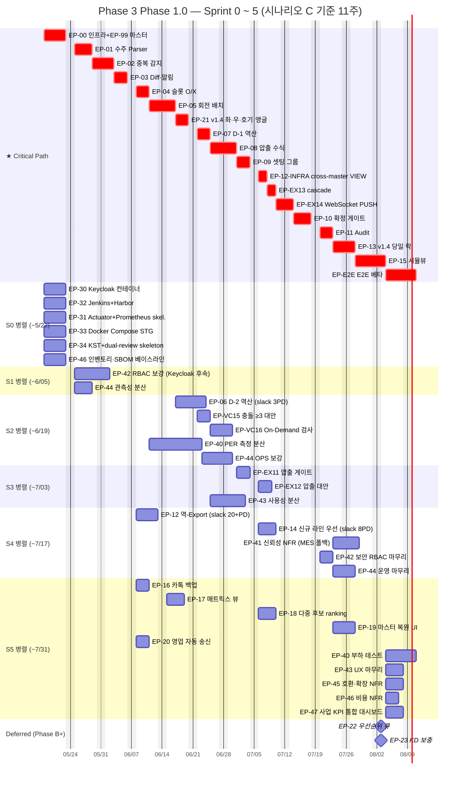
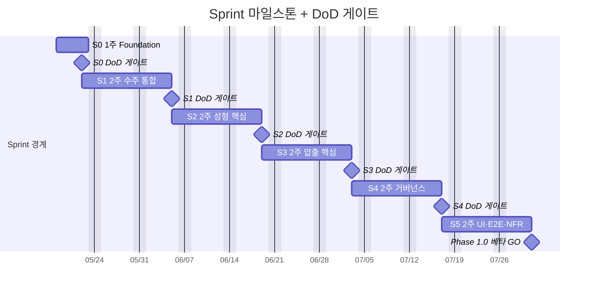
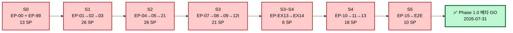
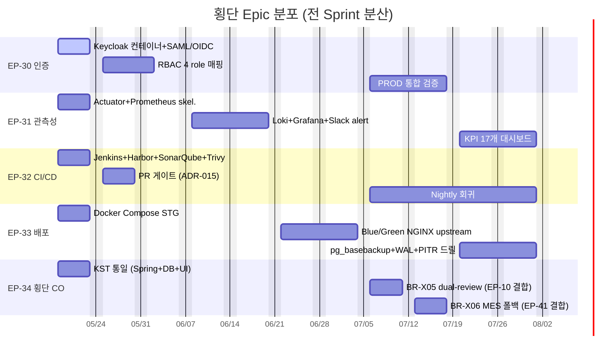
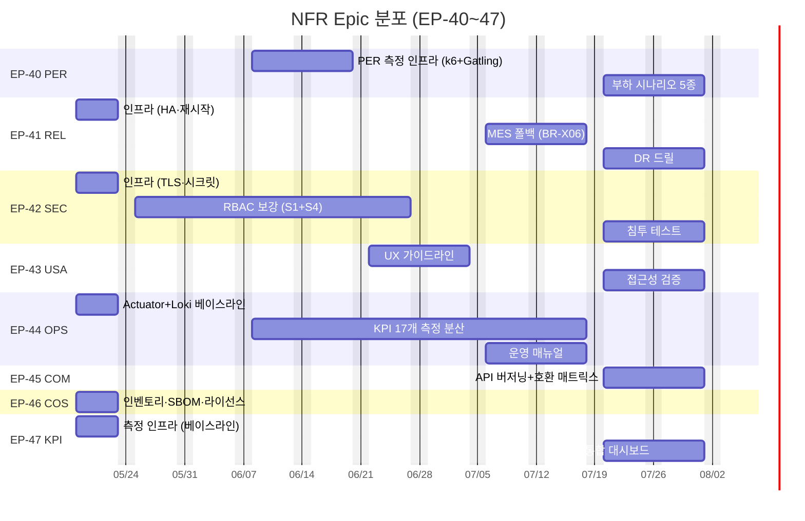

# TASK-003 — Phase 3 Gantt Chart (v1.0)

> WBS v1.2 §12 의존성 매트릭스 + §12.1 Critical Path + §12.2 병렬 실행 그룹 기반 시각화.
> 작성일: 2026-05-16 / 기준 시나리오: **C (3 dev + 0.5 QA, 11주)** / 시작: 2026-05-18 (월)
>
> 본 차트는 **병렬·독립 진행 가능 영역** 을 한눈에 보이게 설계. Mermaid Gantt + 매트릭스 표 + Critical Path 강조 3 view 제공.

---

## 1. 최상위 Gantt — Sprint 0 ~ 5 + 횡단 + NFR

---

## 2. Sprint 마일스톤 + 게이트

---

## 3. Critical Path 단일 흐름 (직선)

> §12.1 정의 — 어떤 Epic 이라도 지연 시 전체 일정 지연. 총 **120 SP · 84 PD**.

---

## 4. Sprint 별 병렬 실행 매트릭스

> §12.2 정의 — 같은 Sprint 내 동시 실행 가능 Epic. 시나리오 C (3 dev + 0.5 QA) 기준 배치.

### Sprint 0 (1주, 5 영업일) — 2026-05-18 ~ 22

| Dev / 시간 | 일1 (월) | 일2 (화) | 일3 (수) | 일4 (목) | 일5 (금) |
|:---:|:---:|:---:|:---:|:---:|:---:|
| **Dev1** | EP-00 Spring Modulith 7 모듈 셋업 → → → → DoD |
| **Dev2** | EP-99 마스터 검증 + EP-34 KST baseline |
| **Dev3** | EP-30 Keycloak 컨테이너 + EP-32 Jenkins+Harbor+SonarQube+Trivy |
| **QA 0.5** | EP-31 Actuator skel + EP-33 Docker Compose STG + EP-46 SBOM 베이스라인 |

**S0 DoD 게이트** — TK-00-1-1 baseline (`app·audit·master` schema + 3 role) · TK-00-2-3 ArchUnit 7 모듈 검증 · Keycloak 컨테이너 healthy · Jenkins 빌드 1회 성공.

### Sprint 1 (2주, 10 영업일) — 2026-05-25 ~ 06-05

| 그룹 | Epic | 인력 | 의존 |
|---|---|:--:|---|
| **A (Critical)** | EP-01 → EP-02 → EP-03 (직렬 26 SP) | Dev1+Dev2 | S0 완료 |
| **B (병렬)** | EP-42 RBAC 보강 + EP-44 관측성 분산 | Dev3 | EP-30 완료 |
| **C (병렬)** | EP-46 비용 NFR 보강 (S0 잔여) | QA 0.5 | — |

### Sprint 2 (2주, 10 영업일) — 2026-06-08 ~ 19 ⭐ **부하 큼**

| 그룹 | Epic | 인력 | 의존 |
|---|---|:--:|---|
| **A (Critical)** | EP-04 → EP-05 → EP-21 (직렬 26 SP, v1.4 신규 ⭐) | Dev1+Dev2 | EP-01·EP-99 |
| **B (병렬)** | EP-06 D-2 역산 (slack 3PD) | Dev3 | EP-05 |
| **C (병렬)** | EP-VC15 충돌 대안 + EP-VC16 On-Demand 검사 | Dev3 | EP-21 |
| **D (병렬)** | EP-40 PER 측정 (생성·압출 SLO) + EP-44 OPS 보강 | QA 0.5 | EP-31 |

### Sprint 3 (2주, 10 영업일) — 2026-06-22 ~ 07-03

| 그룹 | Epic | 인력 | 의존 |
|---|---|:--:|---|
| **A (Critical)** | EP-07 → EP-08 → EP-09 → EP-12-INFRA (직렬 21 SP) | Dev1+Dev2 | EP-06 |
| **B (Critical)** | EP-EX13 cascade + EP-EX14 WebSocket PUSH (6 SP) | Dev2 (말미) | EP-09 |
| **C (병렬)** | EP-EX11 압출 게이트 + EP-EX12 압출 대안 | Dev3 | EP-08 |
| **D (병렬)** | EP-43 사용성 NFR 분산 | QA 0.5 | — |

### Sprint 4 (2주, 10 영업일) — 2026-07-06 ~ 17

| 그룹 | Epic | 인력 | 의존 |
|---|---|:--:|---|
| **A (Critical)** | EP-10 → EP-11 → EP-13 (직렬 18 SP, v1.4 당일 락 ⭐) | Dev1+Dev2 | EP-EX14·EP-30 |
| **B (병렬)** | EP-12 역-Export (slack 20+PD) + EP-14 신규 라인 우선 (slack 8PD) | Dev3 | EP-01·EP-09 |
| **C (병렬)** | EP-41 신뢰성 (MES 폴백) + EP-42 보안 마무리 + EP-44 운영 마무리 | QA 0.5 | — |

### Sprint 5 (2주, 10 영업일) — 2026-07-20 ~ 31

| 그룹 | Epic | 인력 | 의존 |
|---|---|:--:|---|
| **A (Critical)** | EP-15 시뮬뷰 + EP-E2E 베타 (10 SP) | Dev1 | EP-13 |
| **B (병렬, Should)** | EP-16 카톡 백업 + EP-17 매트릭스 뷰 | Dev2 | EP-03·EP-12 |
| **C (병렬, Could)** | EP-18 다중 후보 + EP-19 마스터 복원 + EP-20 영업 자동 송신 | Dev3 | EP-09·EP-11·EP-01 |
| **D (NFR 마무리)** | EP-40 부하 + EP-43 UX + EP-45 호환·확장 + EP-46 비용 + EP-47 KPI 대시보드 | QA + 전원 | — |

**Phase 1.0 베타 GO** — 2026-07-31 (금)

---

## 5. 횡단 Epic 분포 (Sprint 0~5)

> EP-30·31·32·33·34 는 Sprint 0 에 골격 + 전 Sprint 분산 검증·보강.

---

## 6. NFR Epic 분포 (EP-40~47)

> 158 파일 8 Epic 60 NFR — Sprint 0 베이스라인 + 분산 측정.

---

## 7. 병렬·독립 진행 가능 영역 요약 (한눈에)

### 7.1 시작 즉시 가능 (S0 D1, 의존 0)
| Epic | 비고 |
|---|---|
| EP-00 | 인프라 (모든 후속 선행) |
| EP-99 | 마스터 정비 (EP-04 선행) |
| EP-30 | Keycloak 컨테이너 |
| EP-31 | Prometheus skeleton |
| EP-32 | Jenkins+Harbor 컨테이너 |
| EP-33 | Docker Compose STG |
| EP-34 | KST baseline (Spring+DB+UI 3 layer) |
| EP-46 | 인벤토리·SBOM (라이선스 baseline) |

### 7.2 Critical Path 외 Slack 보유 Epic

| Epic | Slack | 시작 가능 시점 |
|---|---|---|
| EP-06 D-2 역산 | 3 PD | EP-05 종료 후 (~S2 후반) |
| EP-12 역-Export | **20+ PD** | EP-01 종료 후 (S1 말~S4 어디든) |
| EP-14 신규 라인 우선 | 8 PD | EP-09 종료 후 (S3 말~S4 어디든) |
| EP-16·17·18·19·20 | 5~10 PD | S5 내 자유 |
| NFR EP-40~47 | 분산 | 선행 충족 후 어디든 |
| 횡단 EP-30~34 | 분산 | Sprint 0~5 자유 |

### 7.3 의존 없는 병렬 쌍 (같은 Dev 가 swap 가능)

| 쌍 | Sprint | 조건 |
|---|:--:|---|
| EP-12 ↔ EP-14 | S4 | 둘 다 Critical Path 외, 의존 다름 |
| EP-16 ↔ EP-17 ↔ EP-18 ↔ EP-19 ↔ EP-20 | S5 | Should/Could 등급 — 5개 모두 독립 |
| EP-VC15 ↔ EP-VC16 | S2 | EP-21 후 직렬 (15→16) |
| EP-EX11 ↔ EP-EX12 | S3 | EP-08 후 직렬 (11→12) |
| EP-41 ↔ EP-42 ↔ EP-44 | S4 | NFR 분산 — 의존 다름 |

---

## 8. 위험 신호 (지연 시 cascade)

| Epic | 지연 시 영향 | 임계 |
|---|---|:--:|
| EP-00 | S0~S5 전체 차단 | ⛔⛔⛔ |
| EP-01 | S1~S5 전체 차단 | ⛔⛔⛔ |
| EP-05 | S2·S3·S4·S5 차단 | ⛔⛔ |
| EP-09 | S4·S5 차단 | ⛔⛔ |
| EP-EX13·EX14 | S4 EP-10 지연 | ⛔ |
| EP-10 | S4·S5 차단 | ⛔⛔ |
| EP-15 | Phase 1.0 베타 GO 지연 | ⛔⛔⛔ |

**위험 완화** — Critical Path Epic 은 Dev1+Dev2 (시니어) 페어로 배치. 슬랙 보유 Epic 만 Dev3 (주니어·신규) 단독 배치 권고.

---

## 9. 시나리오 비교 (WBS §12.2 v1.2)

| 시나리오 | 인력 | Capacity / Sprint | 총 SP | Sprint 수 | 총 기간 | 평가 |
|:--:|:--:|:--:|:--:|:--:|:--:|---|
| A | 2 dev | 35 SP | 261 SP | 7.5 | **15주** | ⚠️ Phase 1.0 10주 목표 초과 |
| B | 3 dev | 50 SP | 261 SP | 5.3 | **11주** | ✓ 거의 목표 |
| **C (권장)** | **3 dev + 0.5 QA** | **55 SP** | **261 SP** | **4.8** | **10주** | ✓ 목표 충족 (본 차트 기준) |
| D | 4 dev + 1 QA | 70 SP | 261 SP | 3.8 | **8주** | 여유 |

> 본 차트는 시나리오 C 기준 + S0 (1주) 포함 = **총 11주**. WBS §12.2 의 "10주" 는 S1~S5 만 (4.8 × 2주 ≈ 10주) — S0 포함 시 11주.

---

## 10. 사용 가이드

- **PM·공장장** — §1 최상위 Gantt + §3 Critical Path 만 확인 (5분)
- **개발 리드** — §4 Sprint 별 병렬 매트릭스 + §7 병렬 가능 영역 + §8 위험 신호 (15분)
- **QA·운영** — §5 횡단 + §6 NFR 분포 (10분)
- **신규 합류자** — §2 마일스톤 + §3 Critical Path + 본인 담당 Sprint §4 (20분)

---

## 11. 참조 + 갱신 정책

- 기준 WBS — [TASK-001_WBS_v1.2.md](TASK-001_WBS_v1.2.md) §12·12.1·12.2
- 시작 일자 변경 — 본 파일을 in-place 수정 금지, `TASK-002_Gantt_Chart_v1.1.md` 신규 발행
- 인력 시나리오 변경 (A·B·D) — 동일 (신규 파일)
- v1.4 신규 Epic (EP-21·EP-13) ⭐ 강조 유지

---

## 12. 개정 이력

| 버전 | 날짜 | 작성자 | 변경 |
|---|---|---|---|
| 1.0 | 2026-05-16 | (작성자) | 초안 — WBS v1.2 §12 의존성 매트릭스 + §12.1 Critical Path + §12.2 병렬 그룹 시각화. Mermaid Gantt 6 + 매트릭스 표 4 + Critical Path flowchart 1. 시나리오 C 기준 (3 dev + 0.5 QA, 11주). 시작 2026-05-18 → 2026-07-31 베타 GO. |
