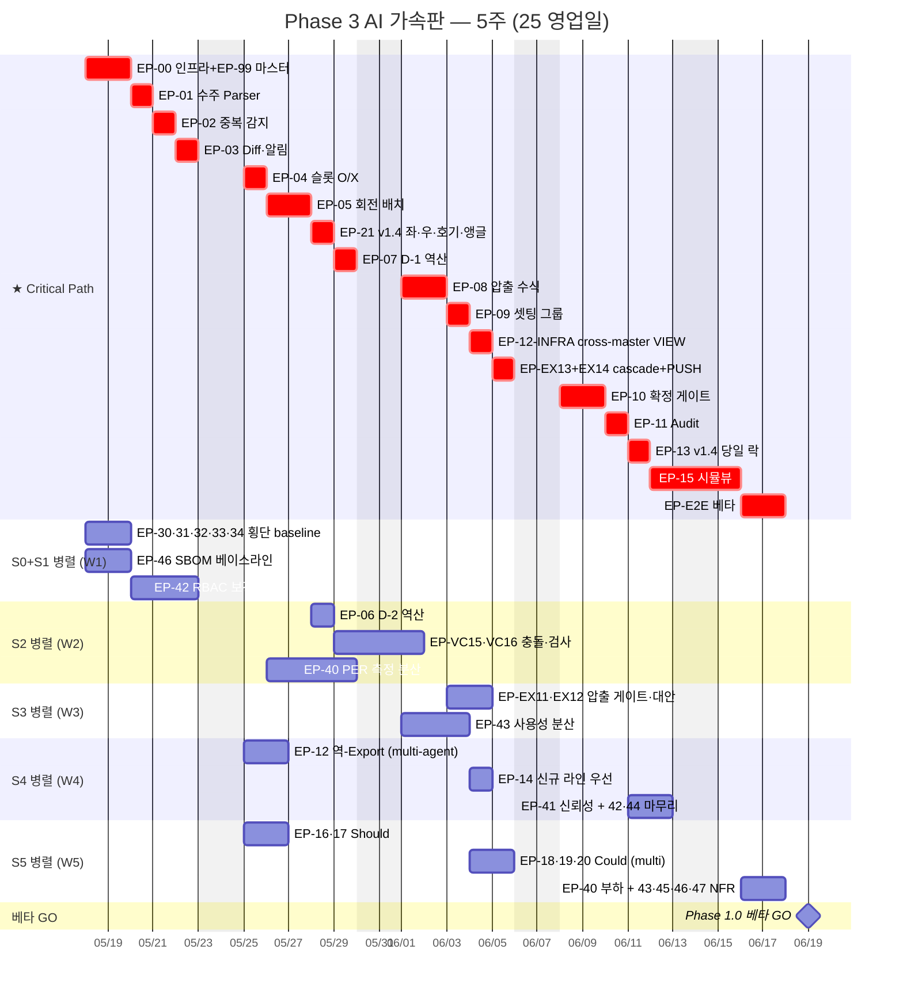
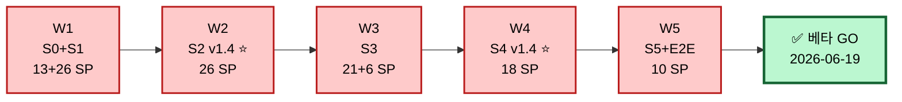

# TASK-004 — Phase 3 Gantt Chart v2.0 (AI 가속판)

> v1.0 ([TASK-003](TASK-003_Gantt_Chart_v1.0.md)) 의 11주 일정을 **AI pair programming 가속 기준 5주 (25 영업일)** 로 압축한 수정판.
> 작성일: 2026-05-16 / 시작: 2026-05-18 (월) / 베타 GO: 2026-06-19 (금)
> 기준: 사용자 단독 개발 + Claude page-by-page 페어 + 멀티 에이전트 worktree 병렬

---

## 1. 가속 가설 + 근거

| 항목 | v1.0 (2-3 dev) | v2.0 (Solo + Claude) | 가속 배수 |
|---|:--:|:--:|:--:|
| 추정 단위 | 1 SP = 0.7 PD | **1 SP = 0.3 PD** | 2.3x |
| Critical Path | 120 SP × 0.7 = 84 PD | 120 SP × 0.3 = 36 PD | 2.3x |
| 총 SP | 253 SP × 0.7 = 177 PD | 253 SP × 0.3 = 76 PD | 2.3x |
| 1주 capacity | 35 SP (2 dev) | **55 SP (solo + AI)** | 1.6x |
| Sprint 수 | 4.8 + S0 | **2.5 + S0** | 1.9x |
| 총 기간 | 11주 | **5주** | 2.2x |

### 가속 메커니즘
1. **Claude pair 단축** — Spring boilerplate · JPA query · ArchUnit rule · 마이그레이션 SQL 등 routine 작업이 5~10x 빠름
2. **harness skill 활용** — `.claude/skills/backend/` 5개 + wrapper 3개 = 8 표준 패턴 즉시 적용
3. **Phase 2 완벽 명세** — 465 파일 task 명세 + ADR 20개 + PDD v1.7 단일 소스 → 의사결정 비용 0
4. **멀티 에이전트 worktree** — 독립 Epic (역-Export·다중 후보·매트릭스 뷰) 별 worktree 병렬
5. **테스트 자동 생성** — Testcontainers boilerplate + ArchUnit rule + JUnit 골격 Claude 자동
6. **리뷰 부담 감소** — Phase 2 BR 명세가 정답지 역할 → 작성·검토·통과 직선

### 가속 제약 (slowdown 요인)
- 사용자 1명 → 컨텍스트 스위치 비용 (멀티 worktree 도 결국 1 인이 통합)
- BR 룰 정합성은 사람 검토 필수 (BR-V07·X01·X05·X07 등)
- E2E + 베타 단계 — 실 사용자 검증 필요 (단축 어려움)
- 사내 인프라 (Keycloak·MES) 통합 검증 — 외부 시스템 의존

---

## 2. 최상위 Gantt v2.0 — 5주 압축

---

## 3. 주차별 마일스톤 + DoD

| 주차 | 기간 | Sprint | 주요 목표 | DoD 게이트 |
|:--:|---|---|---|---|
| **W1** | 5/18 ~ 5/22 | S0 + S1 시작 | 인프라 + 횡단 baseline + 수주 통합 시작 | Docker Compose healthy · Keycloak SAML · Jenkins 1회 빌드 · EP-01 Parser 골격 |
| **W2** | 5/25 ~ 5/29 | S1 완료 + S2 | 수주 통합 완료 + 성형 핵심 | EP-03 Diff·알림 · EP-04·05·21 (성형 ⭐ v1.4) · 인덱스 확정 |
| **W3** | 6/01 ~ 6/05 | S3 | 압출 핵심 + cross-master VIEW | EP-07·08·09 · EP-12-INFRA · EP-EX13·14 PUSH ≤ 2초 |
| **W4** | 6/08 ~ 6/12 | S4 | 거버넌스 + 당일 락 + NFR | EP-10·11·13 (확정·Audit·당일 락 ⭐ v1.4) · NFR 마무리 |
| **W5** | 6/15 ~ 6/19 | S5 | UI + E2E + 베타 | EP-15·E2E · Should/Could · NFR 부하 테스트 · **베타 GO 6/19** |

---

## 4. Sprint 별 압축 매트릭스 (Solo + Claude + 멀티 worktree)

### W1 S0 (5/18~19, 2일) — 인프라 + 횡단 baseline

| 시점 | 작업 | 가속 도구 |
|:--:|---|---|
| D1 오전 | Docker Compose v2 + PostgreSQL 16 + Redis 7 + Keycloak 24 부트 | Phase 2 TK-00-1-1 SQL 그대로 사용 |
| D1 오후 | Spring Modulith 7 모듈 골격 + ArchUnit + Testcontainers | `.claude/skills/backend/spring-modulith-boundaries` |
| D2 오전 | Jenkins + Harbor + SonarQube + Trivy + Actuator + Loki | Phase 2 EP-32·31 ADR-015 적용 |
| D2 오후 | Keycloak SAML/OIDC + RBAC 4 role + KST 통일 | `.claude/skills/backend/spring-security-keycloak-setup` |

### W1 S1 (5/20~22, 3일) — 수주 통합 (EP-01·02·03)

| 시점 | 작업 | 비고 |
|:--:|---|---|
| D3 | EP-01 엑셀 Parser (Apache POI + SXSSF streaming) | 3종 수주 엑셀 패턴 Phase 2 명세 그대로 |
| D4 | EP-02 중복 감지 (해시 + 시간 윈도우) | BR-O02·O03 적용 |
| D5 | EP-03 Diff·알림 + EP-42 RBAC 검증 | WebSocket 골격 |

### W2 S2 (5/25~29, 5일) — 성형 ⭐ v1.4 신규

| 시점 | 작업 | Critical | 가속 |
|:--:|---|:--:|---|
| D6 | EP-04 슬롯 O/X 검증 + EP-VC15 골격 | ✅ | BR-V04 명세 |
| D7~8 | EP-05 회전 배치 (1~18 회전 + 8 셋팅 그룹 + 합금형 1·2·3·6) | ✅ | BR-V07·E05 명세 |
| D9 | EP-21 좌/우·호기·앵글 ≤4 ⭐ v1.4 | ✅ | BR-V14·V15·V16·V17 |
| D10 | EP-06 D-2 역산 + EP-VC15·16 충돌 검사 + EP-40 PER baseline | | |

### W3 S3 (6/01~05, 5일) — 압출 핵심

| 시점 | 작업 | Critical |
|:--:|---|:--:|
| D11 | EP-07 D-1 역산 + EP-43 사용성 분산 시작 | ✅ |
| D12~13 | EP-08 압출 수식 (75% 효율 · `29673-2R060` yield 2531) | ✅ |
| D14 | EP-09 셋팅 그룹핑 + EP-EX11·12 게이트·대안 | ✅ |
| D15 | EP-12-INFRA cross-master VIEW + EP-EX13·14 cascade+PUSH | ✅ |

### W4 S4 (6/08~12, 5일) — 거버넌스 + 당일 락

| 시점 | 작업 | Critical |
|:--:|---|:--:|
| D16~17 | EP-10 확정 게이트 (BR-X01·X05·X07) | ✅ |
| D18 | EP-11 Audit + EP-12 역-Export (worktree 병렬) | ✅ |
| D19 | EP-13 당일 락 ⭐ v1.4 + EP-14 신규 라인 우선 | ✅ |
| D20 | EP-41 신뢰성 (MES 폴백 BR-X06) + EP-42·44 마무리 | |

### W5 S5 (6/15~19, 5일) — UI + E2E + 베타

| 시점 | 작업 | Critical |
|:--:|---|:--:|
| D21~22 | EP-15 시뮬뷰 + EP-16·17 Should (multi worktree) | ✅ |
| D23 | EP-18·19·20 Could (multi worktree) + EP-40 부하 | |
| D24 | EP-E2E E2E 시뮬레이션 + EP-43·45·46·47 NFR 마무리 | ✅ |
| D25 | **베타 검증 + GO 6/19** | ✅ |

---

## 5. 멀티 에이전트 Worktree 전략

> 사용자 1명이지만 Claude pair 가 여러 worktree 에서 독립 작업 가능. 통합 시점에 사용자 review.

### 동시 worktree 가능 영역

| Worktree | Epic 그룹 | 의존 | 통합 시점 |
|---|---|---|---|
| `main` (Critical Path) | EP-00·01·04·05·07·10·15 등 | — | 매일 |
| `feature/ex-export` | EP-12 역-Export | EP-01 후 | W4 |
| `feature/ranking` | EP-18 다중 후보 ranking | EP-09 후 | W5 |
| `feature/matrix-view` | EP-17 매트릭스 뷰 | EP-12 후 | W5 |
| `feature/kakao-backup` | EP-16 카톡 백업 | EP-03 후 | W5 |
| `feature/nfr-load` | EP-40 부하 테스트 | EP-15 후 | W5 |

각 worktree 는 독립 PR. 사용자는 Critical Path 우선 작업, 보조 worktree 는 Claude 가 일괄 생성 후 review.

---

## 6. Critical Path v2 단일 흐름

---

## 7. 위험 신호 + 완화 (v2 압축으로 인한 새 risk)

| Risk | 영향 | 완화 |
|---|---|---|
| **AI hallucination** — Claude 가 BR 명세 오해 | BR 위반 코드 | Phase 2 명세 + `@BR("X01")` annotation 강제 + ArchUnit 룰 + PR 단위 단위 테스트 |
| **테스트 부재** — 압축으로 테스트 생략 시 | 회귀 폭증 | Testcontainers 통합 테스트 + ArchUnit + k6 부하 — Phase 2 EP-40 명세 그대로 적용 |
| **외부 시스템 의존** — Keycloak·MES·사내 NW | 통합 지연 | W1 D2 에 baseline 검증 + W4 에 실제 통합 |
| **베타 검증 부족** — W5 마지막 5일만 | 사용자 발견 결함 | W5 매일 incremental beta · 사용자 (PLANNER role) 와 함께 검증 |
| **번아웃** — 5주 압축 강도 | 일정 슬립 | 주말 휴식 보장 + 매주 금요일 retrospective |

---

## 8. v1.0 → v2.0 차이 요약

| 항목 | v1.0 | v2.0 |
|---|---|---|
| 기간 | 11주 (S0 1주 + S1-5 × 2주) | **5주** (25 영업일) |
| 가속 비율 | 1.0x (baseline) | **2.2x** |
| 추정 단위 | 1 SP = 0.7 PD | 1 SP = 0.3 PD |
| 시나리오 | C (3 dev + 0.5 QA) | **Solo + Claude pair** |
| 베타 GO | 2026-07-31 | **2026-06-19** |
| 단축 | — | **6주 단축 (45% 감축)** |
| 적용 도구 | 인력 추가 | harness skill 8 + 멀티 worktree + AI pair |

---

## 9. GitHub Project 매핑

본 v2.0 의 Sprint 구분은 GitHub Project 의 **Sprint** field 와 1:1 매핑:
- `S0` (W1 전반) — Foundation
- `S1` (W1 후반) — Order
- `S2` (W2) — VC ⭐
- `S3` (W3) — EX
- `S4` (W4) — Governance ⭐
- `S5` (W5) — UI + E2E
- `Beta` (W5 D25) — 베타 GO

각 Epic 의 `Target` date 는 본 표 §3·§4 기준으로 Project 에 자동 등록.

---

## 10. 개정 이력

| 버전 | 날짜 | 작성자 | 변경 |
|---|---|---|---|
| 2.0 | 2026-05-16 | (작성자) | 초안 — v1.0 11주 → AI 가속 5주 압축. Solo + Claude + 멀티 worktree 전략. 1 SP = 0.3 PD. 베타 GO 2026-06-19. v1.0 의 Critical Path 흐름 + 병렬 그룹 모두 유지하되 일자만 압축. |

---

## 11. 참조

- v1.0 baseline — [TASK-003_Gantt_Chart_v1.0.md](TASK-003_Gantt_Chart_v1.0.md)
- WBS — [TASK-001_WBS_v1.2.md](TASK-001_WBS_v1.2.md) §12·12.1·12.2
- harness skill — [../../../.claude/skills/](../../../.claude/skills/)
- PDD v1.7 — [../1.PDD/4.PDD_master_integrated_Opus_v1.7.md](../1.PDD/4.PDD_master_integrated_Opus_v1.7.md)
