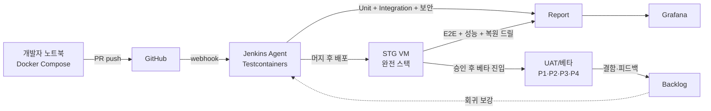

# 테스트 계획서 (Test Plan)
Document ID: TEST-001
Revision: 1.0
Date: 2026-05-15
Standard: IEEE 829-2008 (Test Documentation) · IEEE 1008-1987 (Unit Testing) · ISO/IEC/IEEE 29119 (Software Testing)

시스템 명: **사내 공정 스케줄링 시스템 (Internal Production Scheduling System)**
원천 문서:
- [REF-SRS] `Phase 2/2.SRS/SRS-001_Production_Scheduling_System_v1.4.md` (요구사항)
- [REF-SAD] `Phase 2/3.SAD/SAD-001_Production_Scheduling_System_v1.0.md` v1.1 (아키텍처·도구)
- [REF-WBS] `Phase 2/4.Tasks/TASK-001_WBS_v1.2.md` (Sprint·Task 분해)
- [REF-PRD] `Phase 2/1.PDD/4.PDD_master_integrated_Opus_final.md` v1.5 (PDD+PRD)

작성 역할: QA 리드
문서 상태: Draft v1.0 (Sprint 1 진입 전 승인 대기)

---

## 1. 서문 (Introduction)

### 1.1 목적 (Purpose)

본 테스트 계획서는 SRS v1.4의 **75개 기능 요구사항(REQ-FUNC)**과 **60개 비기능 요구사항(REQ-NF)**의 검증을 위한 통합 테스트 전략, 환경, 도구, 일정, 케이스 카탈로그, 추적성을 정의한다.

본 문서가 다루는 검증 활동:
- (a) **단위 테스트** (Unit) — JUnit 5·Vitest로 코드 단위
- (b) **통합 테스트** (Integration) — Testcontainers로 DB·Redis·MES 모킹 결합
- (c) **API 테스트** — REST·WebSocket 엔드포인트 계약
- (d) **E2E 테스트** — Playwright로 사용자 시나리오
- (e) **성능 테스트** — k6/Gatling로 NFR 정량 검증
- (f) **UAT** — 베타 사용자(P1·P2·P3·P4) 사내 검증
- (g) **회귀 테스트** — Sprint 종료마다 자동 실행

### 1.2 범위 (Scope)

#### 1.2.1 적용 범위 (In-Scope)

| # | 영역 | 출처 |
|---|------|------|
| TS-01 | 75 TC-NNN (OC 15 + VC 27 + EX 20 + CO 10 + XT 3) | SRS §5 |
| TS-02 | 8 NFR Performance 시나리오 (PER-001~008) | SRS §4.2.1 |
| TS-03 | 7 NFR Security 검증 (SEC-001~007) | SRS §4.2.3 |
| TS-04 | 6 NFR Reliability 검증 (REL-001~006) | SRS §4.2.2 |
| TS-05 | 19 KPI 측정 자동화 (KPI-001~019) | SRS §4.2.8 |
| TS-06 | 5 EXP-1~5 실험 (PRD §20.6) | REF-PRD §6.5 |
| TS-07 | E2E 4 시나리오 (US-01·02·03·04) | SRS §16 (PRD §16) |
| TS-08 | UAT — P4 단독 사이클 시뮬레이션 | US-02 AC-3 |

#### 1.2.2 제외 범위 (Out-of-Scope)

| # | 제외 | 사유 |
|---|------|------|
| OS-01 | Phase 1 Won't Have (MRP·품질 결합·경영 대시보드·모바일·외주 포털) | SRS §1.2.2 |
| OS-02 | 영림원 ERP 연동 테스트 | 시스템 범위 외 (CON 별도) |
| OS-03 | 사내 SSO 시스템 자체 보안 감사 | 사내 정보보안팀 별도 수행 |
| OS-04 | 부하 ≥30 동시 사용자 시 성능 | 본 시스템 NFR-COM-001 한도 외 |
| OS-05 | 사내 Wi-Fi 음영 지역 테스트 | ASM-06 가정으로 외주 |

### 1.3 참조 (References)

| ID | 문서 |
|----|------|
| REF-SRS | `Phase 2/2.SRS/SRS-001_Production_Scheduling_System_v1.4.md` |
| REF-SAD | `Phase 2/3.SAD/SAD-001_Production_Scheduling_System_v1.0.md` |
| REF-WBS | `Phase 2/4.Tasks/TASK-001_WBS_v1.2.md` |
| REF-PRD | `Phase 2/1.PDD/4.PDD_master_integrated_Opus_final.md` v1.5 |
| REF-PDD-1·2·3 | `Phase 2/1.PDD/{1·2·3}.process_*_Opus.md` |
| STD-829 | IEEE Std 829-2008 — Software and System Test Documentation |
| STD-1008 | IEEE Std 1008-1987 — Software Unit Testing |
| STD-29119 | ISO/IEC/IEEE 29119 — Software Testing |
| STD-29148 | ISO/IEC/IEEE 29148:2018 (SRS 표준) |

### 1.4 정의·약어 (Definitions, Acronyms)

| 용어 | 정의 |
|-----|------|
| **TC** | Test Case — 단일 검증 시나리오 (`TC-OC-001` 식별자) |
| **DoD** | Definition of Done — Sprint·Story·Task 완료 기준 |
| **DoR** | Definition of Ready — 작업 진입 기준 |
| **UAT** | User Acceptance Test — 최종 사용자 검증 |
| **E2E** | End-to-End — UI에서 DB까지 전체 흐름 |
| **자동화** | Jenkins CI 파이프라인에서 무인 반복 가능 |
| **회귀(Regression)** | 변경 후 기존 기능 비영향 검증 |
| **합성 데이터** | 실제 데이터 마스킹·익명화 또는 임의 생성 |
| **Smoke Test** | 배포 직후 핵심 경로 5분 이내 검증 |

추가 약어는 SRS §1.3 상속.

### 1.5 가정 및 제약 (Assumptions / Constraints)

| ID | 항목 |
|----|------|
| TA-01 | SRS v1.4 75 REQ-FUNC + 60 REQ-NF가 안정 (변경 시 TC 영향 분석) |
| TA-02 | SAD v1.1의 도구(JUnit·Vitest·Playwright·k6·Testcontainers) 사용 가능 |
| TA-03 | 47품번 회귀 테스트 데이터셋 마스터 준비 완료 (ASM-01) |
| TA-04 | DEV·STG 환경이 Sprint 0에 프로비저닝 (WBS Sprint 0 EP-00) |
| TA-05 | UAT 인원 4명(P1·P2·P3·P4)이 주 2h 참여 (ASM-03) |
| TC-01 | TC 자동화 커버리지 목표 = 단위 ≥80%, 통합 ≥60%, E2E ≥20% |
| TC-02 | 모든 P0 (Must) TC는 Sprint 종료 전 100% 통과 필수 |

---

## 2. 테스트 전략 (Test Strategy)

### 2.1 테스트 피라미드 (5단계)

```
                    ▲ 비용 高, 속도 低
                    │
         ┌──────────┴──────────┐
         │   UAT (수동)         │   4명 베타 · Phase 0/1.0/1.2
         │   ~10 시나리오       │
         ├──────────────────────┤
         │   E2E (Playwright)   │   주요 사용자 여정
         │   ~20 시나리오 / 자동│
         ├──────────────────────┤
         │   API + WebSocket    │   REST 30 ep + WS 5 채널
         │   ~50 케이스 / 자동  │
         ├──────────────────────┤
         │   Integration        │   Testcontainers · DB · MES 모킹
         │   ~150 케이스 / 자동 │
         ├──────────────────────┤
         │   Unit (JUnit·Vitest)│
         │   ~500+ 케이스 / 자동│   ≥80% 커버리지
         └──────────────────────┘
                    ▲ 비용 低, 속도 高
```

### 2.2 자동화 vs 수동 분류

| 분류 | 자동화 | 수동 | 비고 |
|------|:---:|:---:|------|
| Unit | 100% | — | 모든 코드 단위 |
| Integration | 100% | — | Sprint 1부터 CI 게이트 |
| API | 100% | — | OpenAPI 기반 |
| E2E | 80% | 20% | UI 시각 검증은 수동 |
| 성능 (k6) | 100% | — | 야간 배치 |
| 보안 (OWASP/Trivy) | 90% | 10% | 침투 테스트는 수동 |
| **UAT** | — | 100% | 베타 사용자 시나리오 |
| 회귀 | 100% | — | Sprint 종료마다 |

### 2.3 회귀 전략

| 트리거 | 회귀 범위 | 실행 환경 |
|--------|---------|---------|
| 모든 PR 머지 | 영향 모듈의 Unit + 인접 Integration | CI (DEV) |
| Sprint 종료 | 전체 Unit + Integration + 핵심 E2E | CI (STG) |
| Release | 전체 자동화 + UAT 스모크 | STG → PRD pre-prod |
| Hotfix | 영향 모듈 + 인접 E2E | CI (STG) |
| 마스터 데이터 변경 | TC-VC-001~003·TC-EX-007~009 (제약 의존) | CI (STG) |

### 2.4 결함 분류 (Severity)

| Sev | 정의 | 대응 SLA |
|-----|------|--------|
| S1 (Critical) | 데이터 손실·보안 침해·서비스 중단 | 4h 이내 |
| S2 (Major) | 핵심 기능 작동 불가, 우회 불가 | 24h 이내 |
| S3 (Minor) | 핵심 기능 작동, 우회 가능 | 다음 Sprint |
| S4 (Trivial) | UI 사소·문서·로그 | 다음 Release |

---

## 3. 테스트 환경·도구 (Environment & Tools)

### 3.1 환경 분리

| 환경 | 호스팅 | 데이터 | 주 사용 |
|------|------|------|------|
| **DEV** | 개발자 노트북 (Docker Compose) | 합성 데이터 (10품번 부분집합) | 개발·Unit 테스트 |
| **CI** | Jenkins agent (ephemeral container) | Testcontainers 자동 기동 | PR·통합 자동 |
| **STG** | 사내 VM (소형) | 마스킹된 실제 데이터 부분집합 (1제품군 전체) | UAT·성능·복원 드릴 |
| **UAT** | STG와 동일 | 베타 그룹 활성 사용 데이터 | 베타 사용자 4명 |
| **PRD** | Application Host | 실 데이터 | 운영 (테스트 실행 안 함) |

### 3.2 도구 매트릭스

| 영역 | 도구 | 버전 | 출처 ADR |
|------|------|------|:--:|
| Unit (Backend) | JUnit 5 | 5.10+ | ADR-008 |
| Mock (Backend) | Mockito | 5.x | — |
| Integration (Backend) | Testcontainers (PG·Redis) | 1.19+ | — |
| Unit (Frontend) | Vitest | 1.x | ADR-009 |
| Component (Frontend) | React Testing Library | 14+ | — |
| E2E | Playwright | 1.40+ | — |
| API 계약 | REST Assured + WireMock | latest | — |
| 성능 | k6 | 0.48+ | — |
| 부하 (대안) | Gatling | 3.10+ | — |
| 보안 정적 | SonarQube CE + Spotless | 10+ | ADR-015 |
| 보안 동적 | OWASP ZAP | 2.14+ | — |
| 컨테이너 취약점 | Trivy | 0.49+ | ADR-015 |
| Mutation | Pitest (Java) | 1.15+ | — |
| 커버리지 | JaCoCo (Java) + c8 (TS) | latest | — |
| 시각 회귀 | Playwright + Visual Comparisons | — | — |

### 3.3 테스트 인프라



---

## 4. Pass/Fail 기준 (Acceptance Criteria)

### 4.1 Sprint DoD (Definition of Done)

각 Sprint 종료 시 다음을 모두 충족해야 다음 Sprint로 진행:

| # | 기준 | 측정 |
|---|------|------|
| DoD-1 | 해당 Sprint의 모든 Must TC 100% PASS | TC 결과 리포트 |
| DoD-2 | 단위 테스트 커버리지 ≥ 80% (변경 라인) | JaCoCo·c8 |
| DoD-3 | 통합 테스트 커버리지 ≥ 60% | JaCoCo |
| DoD-4 | SonarQube quality gate PASS (P0 0건) | SonarQube |
| DoD-5 | Trivy 컨테이너 취약점 P0/P1 0건 | Trivy |
| DoD-6 | E2E 시나리오 자동화 ≥ Sprint 목표 | Playwright |
| DoD-7 | 회귀 결과 100% PASS (이전 Sprint TC 포함) | CI 리포트 |

### 4.2 Release Gate (Phase 3 Stage 1.0 → 1.1)

| # | 게이트 기준 | SRS 출처 |
|---|----------|--------|
| RG-1 | 모든 Must REQ-FUNC TC 100% PASS | REQ-FUNC × Must |
| RG-2 | 모든 NFR PER·REL·SEC TC 100% PASS | REQ-NF-PER·REL·SEC |
| RG-3 | E2E 4 시나리오 PASS | EXP-1~5 일부 |
| RG-4 | NS-01 (P1·P4 만족도) ≥ 4/5 | REQ-NF-KPI-001 |
| RG-5 | NS-S01 (수주 통합 시간) ≤ 1h (목표 30분 2배 허용 — 학습 곡선) | REQ-NF-KPI-002 |
| RG-6 | NS-S02 (월간 누락) = 0 | REQ-NF-KPI-003 |
| RG-7 | 베타 4명 중 ≥ 3명 확장 동의 | UAT 인터뷰 |

### 4.3 Hotfix 게이트

| # | 기준 |
|---|------|
| HG-1 | 변경 영향 모듈 Unit + Integration 100% PASS |
| HG-2 | 인접 E2E 시나리오 PASS |
| HG-3 | 회귀 PR 후 24h 이내 PRD 적용 |

---

## 5. 테스트 일정 — Sprint 매핑

### 5.1 Sprint별 TC 작성·실행 매핑

| Sprint | 기간 | TC 작성 대상 | 검증 대상 REQ |
|:------:|:--:|------------|------------|
| Sprint 0 | 1주 | TC-CO-007 (KST), 인프라 smoke | 환경 셋업 |
| Sprint 1 | 2주 | **TC-OC-001~015** (15) + TC-CO-001·005·006·011·012 | M-01·02·03, BR-X01·02 |
| Sprint 2 | 2주 | **TC-VC-001~018·021~027** (22) + 슬롯 인접 | M-04·05·06, BR-V01~17 |
| Sprint 3 | 2주 | **TC-EX-001~014** (14) + EX-Cross-reference | M-07·08·09, BR-E01~12 |
| Sprint 4 | 2주 | TC-VC-019·020 + TC-EX-019·020 + TC-CO-001~010 (전체) + TC-OC-011 (락) | M-10·11, BR-X05·X07 |
| Sprint 5 | 2주 | TC-VC-017·018 + TC-EX-015~018 + TC-XT-001~003 | S-03·04·05, C-01·02·03 |
| **Stage 0** | 2주 | UAT 시나리오 + 베이스라인 측정 | — |
| **Stage 1.0** | 8주 | EXP-1~5 실험 + UAT 사이클 4주 | NS-01·S-01~05 |

### 5.2 Sprint별 TC 통과 누적 목표

```
TC 누적 PASS 비율 (Must 기준)
Sprint 0  ▌                    ~5%   (인프라 smoke)
Sprint 1  ████▌                ~25%  (OC 15 TC)
Sprint 2  █████████▌           ~55%  (VC 22 TC 누적)
Sprint 3  █████████████▌       ~75%  (EX 14 TC 누적)
Sprint 4  ██████████████████▌  ~95%  (CO·게이트)
Sprint 5  ████████████████████ 100% (Should/Could 포함)
```

### 5.3 자동화 작성 우선순위

| Phase | 우선 | 사유 |
|------|------|------|
| Sprint 0~1 | Unit + Integration (CI 게이트) | 초기부터 회귀 보호 |
| Sprint 2~3 | + E2E 핵심 시나리오 | 사용자 여정 검증 |
| Sprint 4 | + 성능(k6) + 보안(ZAP) | NFR 정량 검증 |
| Sprint 5 | + 시각 회귀 + 종합 회귀 | 안정화 |

---

## 6. 테스트 케이스 카탈로그

> 표기 규약: 각 TC = {목적·전제·단계·기대결과·우선순위·자동화·환경·참조 REQ}.
> 우선순위: P0 = Must / P1 = Should / P2 = Could.
> 자동화: ✅ = CI 자동 / ⚙️ = 수동 / 🤖 = 부분 자동 (확인 단계 수동).

### 6.1 수주 통합 (OC) — 15 TC

| TC ID | 목적 | 전제 | 단계 (Steps) | 기대 결과 | P | 자동 | 환경 | REQ |
|-------|------|------|-------------|---------|:--:|:--:|------|-----|
| **TC-OC-001** | 3종 워크북 동시 업로드 수용 | 사용자 인증, 합성 워크북 3개 (≤20MB 각) | 1. POST `/api/v1/orders/import` (multipart, 3 파일) | HTTP 200 + tracking_id, 2초 이내 응답 | P0 | ✅ | CI | OC-001 |
| **TC-OC-002** | 소스 유형 자동 감지 | 30개 회귀 워크북 (월별·KD·주간 각 10개) | 1. 30회 import 실행 | ≥29개 정확 분류 (≥99%) | P0 | ✅ | CI | OC-002 |
| **TC-OC-003** | 표준 스키마 매핑 ≥95% 성공률 | 회귀 세트 30개 | 1. 각 워크북 mapping 실행, 성공 row 카운트 | 평균 자동 매핑률 ≥95% | P0 | ✅ | CI | OC-003 |
| **TC-OC-004** | 매핑 실패 시 보정 모달 | 의도적 매핑 실패 워크북 1개 (필수 컬럼 누락) | 1. import → 부분 실패 응답 확인 / 2. 매핑 룰 보정 / 3. 재import | 세션 상태 보존, 재시도 후 PASS | P0 | 🤖 | CI+UAT | OC-004 |
| **TC-OC-005** | (품번·납기) 중복 0건 (100사이클) | 동일 키 중복 row 포함 워크북 | 1. 100회 import·commit 사이클 | 마스터 DB의 (hose_id, delivery_date) 중복 0 | P0 | ✅ | CI | OC-005 |
| **TC-OC-006** | 우선순위 해소 (Confirmed > Weekly > KD > Forecast) | 두 row 동일 키, 다른 order_type | 1. import / 2. precedence 로그 확인 | 상위 type이 마스터에 남고 하위는 archive | P0 | ✅ | CI | OC-006 |
| **TC-OC-007** | 버전 Diff 100% 감지 | 의도적 변형 회귀 세트 (신규·수정·삭제 각 30) | 1. 두 버전 diff 호출 | 90/90 변형 정확 분류 | P0 | ✅ | CI | OC-007 |
| **TC-OC-008** | Critical 변경 분류 (zero-FN) | Critical 후보 100건 (납기·수량±20%·품번) | 1. diff → severity 태깅 | False Negative = 0 | P0 | ✅ | CI | OC-008 |
| **TC-OC-009** | Critical 알림 SLA ≥99% | 100건 시뮬레이션 변경 | 1. 100건 commit / 2. 알림 도달 시각 측정 | ≥99건이 Critical <1분, 일반 <5분 | P0 | ✅ | STG | OC-009 |
| **TC-OC-010** | 카카오톡 백업 도달 | Critical 이벤트 1건 | 1. commit / 2. 카카오 봇 도달 확인 | 인앱 + 카카오 모두 도달, 로그 양쪽 기록 | P1 | 🤖 | STG | OC-010 |
| **TC-OC-011** | 승인 토큰 없는 commit → HTTP 403 | 토큰 미포함 직접 API 호출 | 1. POST `/orders/commit` (no token) | HTTP 403, audit에 거부 기록 | P0 | ✅ | CI | OC-011 |
| **TC-OC-012** | audit 없는 commit 차단 (DB 제약) | audit 트리거 임시 비활성화 시도 | 1. INSERT 시도 / 2. 트리거 우회 negative 테스트 | 트랜잭션 실패, ROLLBACK | P0 | ✅ | CI | OC-012 |
| **TC-OC-013** | 엑셀 역-Export 셀-수준 차이 ≤2% | 마스터 버전 1개, 원본 워크북 | 1. POST `/orders/export` / 2. 셀-셀 비교 | 비교 차이 ≤2% (수식 셀 제외) | P0 | ✅ | CI | OC-013 |
| **TC-OC-014** | 시점 마스터 복원 | 5년 이내 timestamp + audit | 1. GET `/orders/at?ts=...` / 2. 라이브 vs 복원 비교 | 100% 일치 | P2 | ✅ | CI | OC-014 |
| **TC-OC-015** | 폴더 폴링 자동 ingest | watch 폴더 + 파일 1개 drop | 1. 파일 drop / 2. 큐 등록 확인 | ≤60초 내 큐 entry 생성 | P2 | ✅ | STG | OC-015 |

### 6.2 성형 (VC) — 27 TC

| TC ID | 목적 | 전제 | 단계 | 기대 결과 | P | 자동 | 환경 | REQ |
|-------|------|------|------|---------|:--:|:--:|------|-----|
| **TC-VC-001** | 슬롯 O/X 적합성 매트릭스 ≤1초 재구축 | 47품번 마스터 변경 1건 | 1. UPDATE 발생 / 2. `/master/compat` 조회 시간 측정 | ≤1초 응답, 새 매트릭스 정확 | P0 | ✅ | CI | VC-001 |
| **TC-VC-002** | 슬롯 위반 거부 (회귀 100건) | 비적합 슬롯에 의도적 배치 시도 100건 | 1. 배치 시도 / 2. 거부 응답 카운트 | 100/100 거부 (HTTP 4xx + 사유) | P0 | ✅ | CI | VC-002 |
| **TC-VC-003** | Unschedulable 품번 분리 | `7X375-H0020`·`28415-08400` 등 슬롯 0 품번 | 1. 후보 생성 | 예외 리포트에 분리, 스케줄에 미포함 | P0 | ✅ | CI | VC-003 |
| **TC-VC-004** | 드래그 위반 ≤1초 차단 | UI 비적합 드래그 100회 | 1. 각 드래그 / 2. 경고 시각 측정 | 중앙값 ≤1초, 감지율 100% | P0 | 🤖 | CI+UAT | VC-004 |
| **TC-VC-005** | 회전 단위 키 (date·rotation·machine·slot) | 1주 후보 생성 | 1. 출력 row 키 검증 | 모든 row가 (date, rot 1~18, machine_id, slot) 포함 | P0 | ✅ | CI | VC-005 |
| **TC-VC-006** | 회전당 yield 단위 테스트 | `29673-2R060`: composite=1, lp_molds=1 | 1. yield 계산 호출 | yield = 1 | P0 | ✅ | CI | VC-006 |
| **TC-VC-007** | 앵글 가용량 초과 0건 | 의도 stress (앵글보유 ≤ 동시 점유) | 1. 1000회 임의 배치 / 2. 점유 카운트 | over-subscription = 0 | P0 | ✅ | CI | VC-007 |
| **TC-VC-008** | 완료일 ≤ 납기 − 2 | 100 수주 입력 | 1. 후보 생성 / 2. row별 검증 | 100% 만족 | P0 | ✅ | CI | VC-008 |
| **TC-VC-009** | Q_required 4종 재고 케이스 | 동등·잉여·부족·목표 0 | 1. 각 케이스 단위 테스트 | 4/4 정확 | P0 | ✅ | CI | VC-009 |
| **TC-VC-010** | 100 수주 회귀 0건 위반 | 47품번 × 다양한 패턴 | 1. 후보 생성 / 2. 모든 제약 검증 | 위반 0, 5분 이내 완료 (PER-002) | P0 | ✅ | CI | VC-010 |
| **TC-VC-011** | 저압 우선·IC 폴백 | 저압+IC 모두 가능 100건 | 1. 라우팅 로그 분석 | 저압 포화 이후에만 IC 사용 | P0 | ✅ | CI | VC-011 |
| **TC-VC-012** | 앵글 교체 ≥30% 감소 (vs 그리디) | 동일 데이터셋 | 1. baseline plan / 2. system plan / 3. 비교 | ≥30% 적은 교체 | P0 | ✅ | CI | VC-012 |
| **TC-VC-013** | 앵글 교체 페널티 1회전 차감 | 의도적 교체 발생 | 1. capacity ledger 확인 | 교체 슬롯에서 1회전 yield = 0 | P0 | ✅ | CI | VC-013 |
| **TC-VC-014** | 교체 과다 모달 (>3회/일·슬롯) | 임의 슬롯 일일 4회 교체 시나리오 | 1. UI 저장 시도 | 모달 100% 출현, 사유 입력 강제 | P1 | 🤖 | CI+UAT | VC-014 |
| **TC-VC-015** | 충돌 리포트 ≥3 대안 | 의도적 capa 초과 | 1. 후보 생성 / 2. 충돌 응답 | remediations 배열 길이 ≥3 | P0 | ✅ | CI | VC-015 |
| **TC-VC-016** | 전체 검사 p95 ≤3초 | 1주 호라이즌 100회 측정 | 1. POST `/vc/check` 100회 | p95 ≤3초 | P1 | ✅ | STG | VC-016 |
| **TC-VC-017** | 시뮬뷰 ≤2초 도달 | candidate persist 직후 | 1. timestamp 차이 측정 | ≤2초 | P1 | ✅ | STG | VC-017 |
| **TC-VC-018** | 1클릭 피드백 수용 (총량 보존) | P2 순서 조정 의견 1건 | 1. accept 클릭 / 2. 총량 비교 | 총량 변경 없음, 순서만 반영 | P1 | 🤖 | UAT | VC-018 |
| **TC-VC-019** | Candidate→Confirmed 사용자 게이트 | 직접 DB UPDATE 시도 | 1. RBAC 우회 negative 테스트 | 트리거가 status 변경 차단 | P0 | ✅ | CI | VC-019 |
| **TC-VC-020** | VC_SCHEDULE 변경 audit 강제 | 트리거 우회 시도 | 1. INSERT/UPDATE/DELETE negative | audit row 없으면 트랜잭션 실패 | P0 | ✅ | CI | VC-020 |
| **TC-VC-021** | v1.4 좌/우·호기·품번앵글상한·규격<7 (BR-V15·V16) | 신규 4종 제약 입력 | 1. 위반 케이스 4종 / 2. 거부 확인 | 4/4 거부 + 사유 메시지 | P0 | ✅ | CI | VC-021 |
| **TC-VC-022** | BR-V12 (deferred, 활성 후 Must) | feature flag ON | 1. BR-V12 케이스 입력 | 활성 시 100% 위반 감지 | P1 | ✅ | CI | VC-022 |
| **TC-VC-023** | BR-V13 (deferred) | feature flag ON | 1. BR-V13 케이스 입력 | 활성 시 100% 위반 감지 | P1 | ✅ | CI | VC-023 |
| **TC-VC-024** | BR-V14 (v1.4 Must) | 정의된 케이스 | 1. 입력 / 2. 검증 | 100% 정확 | P0 | ✅ | CI | VC-024 |
| **TC-VC-025** | BR-V15 (v1.4) | 정의된 케이스 | 1. 입력 / 2. 검증 | 100% 정확 | P0 | ✅ | CI | VC-025 |
| **TC-VC-026** | BR-V16 (v1.4) | 정의된 케이스 | 1. 입력 / 2. 검증 | 100% 정확 | P0 | ✅ | CI | VC-026 |
| **TC-VC-027** | BR-V17 cross-master (ADR-017) | PRODUCT·VC_CONSTRAINT join 검증 | 1. cross-master view 쿼리 / 2. 캐시 일관성 | view 정합, 캐시 hit ≥80% | P0 | ✅ | CI | VC-027 |

### 6.3 압출 (EX) — 20 TC

| TC ID | 목적 | 전제 | 단계 | 기대 결과 | P | 자동 | 환경 | REQ |
|-------|------|------|------|---------|:--:|:--:|------|-----|
| **TC-EX-001** | 모든 EX row 완료일 ≤ vc_input − 1 | 100 VC 확정 row | 1. EX 후보 생성 / 2. row별 검증 | 100% 만족 | P0 | ✅ | CI | EX-001 |
| **TC-EX-002** | 주말 기한 → 직전 금요일 | 토·일이 기한인 케이스 5건 | 1. 후보 생성 | 모두 직전 금요일 이전 | P0 | ✅ | CI | EX-002 |
| **TC-EX-003** | shift 정의 공시값 일치 | 시스템 호출 | 1. GET `/master/shifts` | 4 shift × 정확한 분 (4·4·4.5·5h) | P0 | ✅ | CI | EX-003 |
| **TC-EX-004** | 주간 전반 유효 분 = 180 | shift=DAY1, efficiency=0.75 | 1. effective minutes 계산 | 180 | P0 | ✅ | CI | EX-004 |
| **TC-EX-005** | `29673-2R060` yield = 2,531 | DAY1, 속도 4.5, 길이 320 | 1. yield 계산 | 정확히 2,531 | P0 | ✅ | CI | EX-005 |
| **TC-EX-006** | shift 내 셋업 0회 (4주 회귀) | 4주 데이터셋 | 1. 후보 생성 / 2. 셋업 이벤트 카운트 | 0 | P0 | ✅ | CI | EX-006 |
| **TC-EX-007** | shift당 단일 셋팅 그룹 | audit 쿼리 | 1. EXPLAIN audit / 2. shift별 distinct setting | 모든 shift에 distinct 정확 1 | P0 | ✅ | CI | EX-007 |
| **TC-EX-008** | 신규 라인 사용률 ≥90% (자격 품번) | 회귀 데이터 | 1. 라우팅 통계 | ≥90% | P1 | ✅ | STG | EX-008 |
| **TC-EX-009** | 포드 전용 미스라우팅 0건 | 포드 전용 100건 | 1. 라우팅 분석 | 0/100이 신규로 감 | P0 | ✅ | CI | EX-009 |
| **TC-EX-010** | Q_ext 4종 재고 케이스 | VC-009와 대칭 | 1. 단위 테스트 | 4/4 정확 | P0 | ✅ | CI | EX-010 |
| **TC-EX-011** | pass/fail p95 ≤2초 | 100회 후보 검증 | 1. 시간 측정 | p95 ≤2초 | P0 | ✅ | STG | EX-011 |
| **TC-EX-012** | 충돌 시 ≥3 대안 | 의도 capa 초과 | 1. 후보 생성 / 2. 응답 분석 | remediations ≥3 | P0 | ✅ | CI | EX-012 |
| **TC-EX-013** | 100건 vc.changed → 자동 재계획 | vc.changed 이벤트 100건 | 1. 발행 / 2. EX 재계획 트리거 카운트 | 100% 트리거 | P0 | ✅ | STG | EX-013 |
| **TC-EX-014** | WebSocket PUSH p95 ≤2초 | soak test (1000건 이벤트) | 1. k6 측정 | p95 ≤2초 | P0 | ✅ | STG | EX-014 |
| **TC-EX-015** | 관체 부족 붉은 깜빡임 (오탐 <0.1%) | 100 회귀 이벤트 | 1. UI 동작 분석 | false-positive <0.1% | P1 | 🤖 | UAT | EX-015 |
| **TC-EX-016** | 인지 라운드트립 p95 ≤1초 | RUM 측정 1000건 | 1. 클라이언트→DB 측정 | p95 ≤1초 | P0 | ✅ | STG | EX-016 |
| **TC-EX-017** | 확정 후 ≤5초 통지 도달 | 확정 이벤트 100건 | 1. 도달 시각 측정 | 100% ≤5초 | P0 | ✅ | STG | EX-017 |
| **TC-EX-018** | export 시트명 `*월*일(압출)` | export 50건 | 1. 시트명 정규식 검증 | 50/50 일치 | P1 | ✅ | CI | EX-018 |
| **TC-EX-019** | Confirmed 게이트 차단 | 직접 DB negative | 1. RBAC 우회 시도 | 트리거 차단 | P0 | ✅ | CI | EX-019 |
| **TC-EX-020** | EX_SCHEDULE audit 강제 | 트리거 negative | 1. audit 없는 commit 시도 | 트랜잭션 실패 | P0 | ✅ | CI | EX-020 |

### 6.4 횡단 공통 (CO) — 10 TC

| TC ID | 목적 | 전제 | 단계 | 기대 결과 | P | 자동 | 환경 | REQ |
|-------|------|------|------|---------|:--:|:--:|------|-----|
| **TC-CO-001** | RBAC 미인가 시 HTTP 403 | 6 역할 × 모든 엔드포인트 매트릭스 | 1. 미인가 호출 / 2. 응답 코드 검증 | 모든 미인가 케이스 403 | P0 | ✅ | CI | CO-001 |
| **TC-CO-002** | 동일 actor dual-review 거부 | 같은 사용자로 두 슬롯 시도 | 1. 두 번 승인 | 409 거부 | P0 | ✅ | CI | CO-002 |
| **TC-CO-003** | 같은 영업일 MES 실적 조정 완료 | 실적 50건 수신 | 1. 일말 조정 작업 / 2. 다음 사이클 입력 점검 | 누적 100% 반영 | P0 | ✅ | STG | CO-003 |
| **TC-CO-004** | MES 1 shift 장애 → 재조정 | MES outage 시뮬 (4.5h) | 1. 장애 / 2. 재개 / 3. 재조정 | 자동 재조정, 사용자 개입 0 | P0 | ✅ | STG | CO-004 |
| **TC-CO-005** | audit UPDATE/DELETE 거부 (negative) | audit 테이블에 UPDATE 시도 | 1. SQL 실행 | DB role denies, error 발생 | P0 | ✅ | CI | CO-005 |
| **TC-CO-006** | 트랜잭션 원자성 (commit + audit 동시) | 의도적 audit 트리거 실패 | 1. commit 시도 | 전체 트랜잭션 롤백 | P0 | ✅ | CI | CO-006 |
| **TC-CO-007** | KST 경계 일자 단위 테스트 | DST 가설 (KST는 미적용) | 1. 00:00, 23:59 경계 케이스 | 모든 일자 산술 KST 정확 | P0 | ✅ | CI | CO-007 |
| **TC-CO-008** | 도달 상태 필드 100% 기록 | 100 알림 시도 | 1. 도달·acknowledge·실패 각 케이스 | 모든 상태 필드 채움 | P0 | ✅ | STG | CO-008 |
| **TC-CO-009** | UI 스냅샷 한국어 100% | 모든 페이지 스냅샷 | 1. Playwright + 영어 텍스트 grep | 영어 텍스트 0 (외래어 제외) | P0 | 🤖 | CI+UAT | CO-009 |
| **TC-CO-010** | override 사유 없으면 차단 | UI override 모달 | 1. 사유 미입력 저장 시도 | 저장 불가 + 사용자 경고 | P0 | ✅ | CI | CO-010 |

### 6.5 Could-tier (XT) — 3 TC

| TC ID | 목적 | 전제 | 단계 | 기대 결과 | P | 자동 | 환경 | REQ |
|-------|------|------|------|---------|:--:|:--:|------|-----|
| **TC-XT-001** | 다중 후보 ranking | 1주 데이터 | 1. 후보 N개 요청 | ≥3 후보 반환, ranking 정확 | P2 | ✅ | CI | XT-001 |
| **TC-XT-002** | 5년 이내 시점 복원 ≤5초 | 과거 timestamp 5개 | 1. POST `/orders/at` 측정 | 모두 ≤5초 | P2 | ✅ | CI | XT-002 |
| **TC-XT-003** | 폴더 watch 60초 이내 큐 | 파일 drop 100건 | 1. drop / 2. 큐 등록 시각 | 모두 ≤60초 | P2 | ✅ | STG | XT-003 |

### 6.6 NFR 성능 (PER) — 8 시나리오

| TC ID | NFR | 대상 | 부하 | 통과 기준 | 도구 | 환경 |
|-------|-----|------|------|---------|------|------|
| **TC-PER-001** | PER-001 | Import 10k row | 단발 | p95 ≤60초 | k6 | STG |
| **TC-PER-002** | PER-002 | VC 후보 (1주, 47품번) | 단발 | p95 ≤5분 | k6 | STG |
| **TC-PER-003** | PER-003 | EX 후보 (1주) | 단발 | p95 ≤2분 | k6 | STG |
| **TC-PER-004** | PER-004 | WebSocket PUSH | 1000 events soak | Critical p99 ≤60초, 패드 p95 ≤2초 | k6 | STG |
| **TC-PER-005** | PER-005 | UI 페이지 응답 | 30 동시 사용자 | p95 ≤1초 (FCP 이후) | Playwright + Lighthouse | STG |
| **TC-PER-006** | PER-006 | 드래그 위반 피드백 | 100회 클릭 | ≤1초 | Playwright | STG |
| **TC-PER-007** | PER-007 | 전체 스케줄 검사 | 100회 호출 | p95 ≤3초 | k6 | STG |
| **TC-PER-008** | PER-008 | 인지 라운드트립 | 1000회 | p95 ≤1초 | k6 + RUM | STG |

### 6.7 NFR 신뢰성 (REL) — 6 시나리오

| TC ID | NFR | 대상 | 시나리오 | 통과 기준 |
|-------|-----|------|---------|---------|
| **TC-REL-001** | REL-001 | 영업시간 가용성 | 4주 합성 프로브 | ≥99.5% |
| **TC-REL-002** | REL-002 | ACID 무결성 | 동시 commit 부하 | 부분 commit 0 |
| **TC-REL-003** | REL-003 | 오류율 | 100k 요청 | ≤0.1% |
| **TC-REL-004** | REL-004 | MES 장애 회복 | MES kill → 1 shift 대기 → 재개 | 자동 재조정 |
| **TC-REL-005** | REL-005 | 백업·복원 | 분기 DR 드릴 | RPO ≤24h, RTO ≤4h |
| **TC-REL-006** | REL-006 | WS 재연결 | 패드 네트워크 차단 | 5초 이내 재연결·재동기 |

### 6.8 NFR 보안 (SEC) — 7 시나리오

| TC ID | NFR | 대상 | 시나리오 |
|-------|-----|------|---------|
| **TC-SEC-001** | SEC-001 | 사내망 격리 | 외부 IP에서 접속 시도 → 차단 확인 |
| **TC-SEC-002** | SEC-002 | SSO 통합 | Keycloak ↔ 사내 AD federation 인증 |
| **TC-SEC-003** | SEC-003 | RBAC 매트릭스 | 6 역할 × 30 엔드포인트 모두 검증 |
| **TC-SEC-004** | SEC-004 | audit 보존 ≥3년·불변 | UPDATE/DELETE 시도 negative |
| **TC-SEC-005** | SEC-005 | DLP egress | 민감 데이터 외부 송출 시도 → 차단 |
| **TC-SEC-006** | SEC-006 | TLS 1.2+ | TLS 스캐너 (testssl.sh) |
| **TC-SEC-007** | SEC-007 | 비밀번호 정책 | 12자 미만·약한 패스워드 거부 |

### 6.9 NFR KPI 자동 측정 — 19 지표

| TC ID | KPI | 측정 자동화 | 주기 |
|-------|-----|-----------|----|
| TC-KPI-001 | NS-01 P1·P4 만족도 | 인프로덕트 설문 + 결과 DB | 분기 |
| TC-KPI-002 | S-01 수주 통합 시간 | API timestamp 자동 | 주 |
| TC-KPI-003 | S-02 누락 건수 | audit log diff vs 실 납품 | 월 |
| TC-KPI-004 | S-03 P4 단독 사이클 | 세션 로그 분석 | 월 |
| TC-KPI-005 | S-04 채택률 | DAU/WAU/MAU | 분기 |
| TC-KPI-006 | S-05 D-Day 준수율 | 납기 vs 실제 매칭 | 주 |
| TC-KPI-007 | K-V02 앵글 교체 | DO-04 집계 | 주 |
| TC-KPI-008 | K-V04 D-2 준수율 | 일정 vs 실제 | 주 |
| TC-KPI-009 | K-E01 관체 부족 | 실시간 카운트 | 월 |
| TC-KPI-010 | K-E02 VC→EX 지연 | 이벤트 latency | 월 |
| TC-KPI-011 | K-E03 셋업 횟수 | DB 쿼리 | 주 |
| TC-KPI-012 | K-E04 신규 라인 사용률 | 라우팅 통계 | 월 |
| TC-KPI-013 | K-E05 D-1 준수율 | 일정 vs 실제 | 주 |
| TC-KPI-014 | K-O03 자동 매핑률 | import 로그 집계 | 주 |
| TC-KPI-015 | K-O04 Critical 알림 SLA | 알림 latency | 월 |
| TC-KPI-016 | K-V01 위반 사전 차단율 | 시뮬 vs 차단 카운트 | 월 |
| TC-KPI-017 | K-V05 현장 재계획 건수 | 피드백 채널 통계 | 월 |
| TC-KPI-018 | K-V06 가류기 사용률 | 점유 회전 통계 | 주 |
| TC-KPI-019 | K-E06 라인 시간 사용률 | shift 사용 통계 | 주 |

### 6.10 E2E 시나리오 — 4 핵심 여정

| TC ID | 시나리오 | 페르소나 | 주요 단계 | 도구 |
|-------|--------|--------|---------|------|
| **TC-E2E-001** | 주간 수주 통합 사이클 (US-01) | P1 | 1. 3종 엑셀 업로드 → 2. Diff 검토 → 3. Critical 알림 도달 → 4. 역-Export | Playwright + 카카오 mock |
| **TC-E2E-002** | 성형 스케줄 수립·확정 (US-02·03) | P4 + P2 | 1. 후보 생성 → 2. 시뮬뷰 → 3. P2 피드백 → 4. 확정 → 5. MES 작업지시 | Playwright + WireMock |
| **TC-E2E-003** | 압출 자동 재계획 (US-04) | P1 + P3 | 1. VC 변경 → 2. 자동 재계산 → 3. PUSH 알림 → 4. P3 인지 확인 | Playwright + WebSocket 모니터 |
| **TC-E2E-004** | P4 단독 1주 사이클 (US-02 AC-3) | P4 (P1 부재 시뮬) | 1. 수주 통합 → 2. VC 후보·확정 → 3. EX 자동 확정 → 4. 1주 작동 | UAT 수동 + 보조 도구 |

---

## 7. 테스트 데이터 (Test Data)

### 7.1 데이터셋

| 데이터셋 | 용도 | 구성 | 위치 |
|---------|------|------|------|
| **DS-MASTER-47** | 회귀 핵심 | 47품번 + VC_CONSTRAINT + EX_CONSTRAINT 마스터 | `Phase 1/2.Raw Materials/` 기반 합성 |
| **DS-ORDER-3X** | OC 회귀 | 3종 엑셀 (월별·KD·주간) 각 10 워크북 = 30 | 합성 generator (`scripts/test_data_gen.py` 예정) |
| **DS-CRITICAL-100** | Critical 변경 회귀 | 100건 (납기·수량·품번 변경) | DS-ORDER-3X 변형 |
| **DS-DUPLICATE-50** | 중복 우선순위 회귀 | 50쌍 (FORECAST·KD·WEEKLY·CONFIRMED 4종 조합) | 합성 |
| **DS-UNSCHED-5** | Unschedulable 품번 | 슬롯 0인 5품번 | 마스터 부분집합 |
| **DS-CHANGE-100** | vc.changed 이벤트 | 100건 시뮬레이션 | EX-013·014 검증 |
| **DS-LOAD-10K** | 부하 테스트 | 10,000 row 워크북 | k6 스크립트 |
| **DS-MES-ACTUAL** | 실적 회귀 | 1주 분량 가짜 실적 | WireMock |
| **DS-UAT** | 베타 사용 데이터 | 1제품군 실 데이터 마스킹 | STG·UAT |

### 7.2 데이터 마스킹·익명화

| 컬럼 | 변환 |
|------|------|
| `customer` | 해시 또는 식별자 치환 (예: `CUSTOMER_001`) |
| `order_id` | UUID 재발급 |
| 가격·금액 | 항상 0 또는 무관한 값 |
| 담당자 이름 | 페르소나 ID (P1·P4 등) |

### 7.3 생성·관리 정책

- 데이터셋은 **Git LFS** 또는 **사내 NAS**에 보관 (DB dump 형식)
- 마스터 데이터 변경 시 **회귀 자동 트리거** (DS-MASTER-47 갱신)
- Sprint 종료 시 신규 케이스 추가 → 데이터셋 버전 increment

---

## 8. 추적성 매트릭스 (Traceability Matrix)

### 8.1 TC ↔ REQ (양방향)

| 영역 | TC 수 | REQ 커버 |
|-----|:---:|--------|
| OC | 15 | REQ-FUNC-OC-001~015 (1:1) |
| VC | 27 | REQ-FUNC-VC-001~027 (1:1) |
| EX | 20 | REQ-FUNC-EX-001~020 (1:1) |
| CO | 10 | REQ-FUNC-CO-001~010 (1:1) |
| XT | 3 | REQ-FUNC-XT-001~003 (1:1) |
| PER | 8 | REQ-NF-PER-001~008 |
| REL | 6 | REQ-NF-REL-001~006 |
| SEC | 7 | REQ-NF-SEC-001~007 |
| KPI | 19 | REQ-NF-KPI-001~019 |
| E2E | 4 | US-01·02·03·04 통합 검증 |
| **합계** | **119** | **75 REQ-FUNC + 40 REQ-NF + 4 US** |

### 8.2 TC ↔ Risk (커버리지)

| Risk | 완화 TC |
|------|--------|
| SRS-RSK-001 마스터 정확성 | TC-VC-001·003·027, TC-EX-007 |
| SRS-RSK-002 사용자 저항 | TC-VC-018, TC-E2E-002 (시뮬뷰) |
| SRS-RSK-003 실패 트라우마 | TC-KPI-001 (NS-01) |
| SRS-RSK-004 알고리즘 괴리 | TC-VC-019, TC-EX-019, TC-CO-010 |
| SRS-RSK-005 Key Person 이탈 | TC-VC-020, TC-EX-020, TC-CO-005·006, TC-E2E-004 |
| SRS-RSK-006 MES 지연 | TC-CO-003·004 |
| SRS-RSK-007 엑셀 포맷 분화 | TC-OC-002·003·004 |
| SRS-RSK-008 매핑 실패 누적 | TC-OC-003, TC-KPI-014 |
| SRS-RSK-009 VC yield 괴리 | TC-VC-006 + Stage 0 베이스라인 |
| SRS-RSK-010 슬롯 0 품번 운영 | TC-VC-003 |
| SRS-RSK-011 효율 75% 괴리 | TC-EX-004·005 + Stage 0 베이스라인 |
| SRS-RSK-012 셋팅 그룹 셋업 | TC-EX-006·007 |
| SRS-RSK-013 라인 고장 | TC-EX-008·009 |
| SRS-RSK-014 단위 혼선 | TC-EX-005 (BR-E05 정확값 2,531) |

### 8.3 TC ↔ User Story

| Story | 직접 검증 TC |
|-------|-----------|
| US-01 (수주 통합) | TC-OC-001~015, TC-E2E-001 |
| US-02 (제약 검증·P4 단독) | TC-VC-001~027 (선택), TC-E2E-002·004 |
| US-03 (현실성 스케줄) | TC-VC-017·018, TC-E2E-002 |
| US-04 (변경 동기화) | TC-EX-013~017, TC-E2E-003 |
| US-05 (audit·복원) | TC-OC-012·014, TC-CO-005 |
| US-06 (KPI 대시보드) | (Phase 2+ 이연) |
| US-07 (영업 자동 송신) | TC-OC-015 (Could) |

### 8.4 TC ↔ Sprint (실행 일정)

| Sprint | 신규 TC | 누적 |
|:------:|:-------:|:----:|
| Sprint 0 | 인프라 smoke | 0 |
| Sprint 1 | OC 15 + CO 일부 | ~20 |
| Sprint 2 | VC 18 + 신규 VC 7 | ~45 |
| Sprint 3 | EX 14 + cross | ~60 |
| Sprint 4 | CO 전체 + 게이트 | ~80 |
| Sprint 5 | Should·Could·E2E | ~119 |

---

## 9. 리스크·가정·역할 (Risk & RACI)

### 9.1 테스트 활동 리스크

| ID | 리스크 | 확률 | 영향 | 완화 |
|----|------|:---:|:---:|------|
| TR-01 | 합성 데이터가 실 데이터 패턴과 괴리 | 중 | 🟡 | Stage 0에서 1제품군 실 데이터로 보정 |
| TR-02 | UAT 4명 베타 참여 부족 (ASM-03) | 중 | 🔴 | 주간 정기 시간 사전 확보 + 백업 베타 1명 |
| TR-03 | 테스트 환경 STG 불안정 | 중 | 🟡 | STG 모니터링 + 일일 smoke test |
| TR-04 | 자동화 도구 라이선스·버전 충돌 | 저 | 🟡 | Renovate + 사전 호환성 매트릭스 |
| TR-05 | 성능 베이스라인 미확보 시 PER 회귀 어려움 | 중 | 🟡 | Sprint 0에 PER 베이스라인 측정 |
| TR-06 | Flaky test (간헐 실패) 누적 | 중 | 🟡 | 주간 flaky 리포트 + 격리 정책 |
| TR-07 | 테스트 데이터 마스킹 누락 → 민감 정보 유출 | 저 | 🔴 | 자동 마스킹 + 사전 검토 게이트 |

### 9.2 RACI

| 활동 | QA 리드 | 백엔드 | 프론트 | DevOps | IT(STK-08) | 사용자(P1·4) |
|------|:--:|:--:|:--:|:--:|:--:|:--:|
| 테스트 계획 작성 | **A** | C | C | C | I | I |
| Unit Test 작성 | C | **R** | **R** | I | I | — |
| Integration Test | **R** | **R** | C | C | I | — |
| E2E 작성 | **R** | C | **R** | C | I | I |
| UAT 시나리오 작성 | **R** | C | C | I | C | **C** |
| 성능 테스트 | **R** | C | I | **R** | I | — |
| 보안 테스트 | **R** | C | C | **R** | **C** | — |
| 환경 운영 | C | I | I | **R/A** | C | — |
| 결함 분류·우선순위 | **A** | C | C | I | C | C |
| 결함 수정 | I | **R** | **R** | I | I | — |
| 회귀 실행 | **R** | I | I | I | I | — |
| UAT 수행 | C | I | I | I | I | **R** |

---

## 10. 부록 (Appendix)

### 10.1 자동화 우선순위 매트릭스

```
      높은 가치 / 자주 변경
            │
   P1: API·  │  P0: Unit·
   E2E 자동 │  Integration
            │  자동 (즉시)
────────────┼────────────
   P2: 시각 │  P3: UAT·
   회귀·    │  탐색 테스트
   수동     │  (수동)
            │
      낮은 가치 / 드물게 변경
```

### 10.2 도구 셋업 가이드 (요약)

| 도구 | 셋업 위치 | 진입 명령 |
|------|---------|---------|
| JUnit 5 + Mockito | `backend/build.gradle.kts` | `./gradlew test` |
| Testcontainers | 동일 + `@Testcontainers` 어노테이션 | `./gradlew integrationTest` |
| Vitest | `frontend/vite.config.ts` | `npm run test` |
| Playwright | `e2e/playwright.config.ts` | `npx playwright test` |
| k6 | `perf/scripts/*.js` | `k6 run perf/scripts/import.js` |
| SonarQube | Jenkins 파이프라인 stage | 자동 |
| Trivy | Docker build 후 | 자동 |

### 10.3 결함 보고 템플릿

```markdown
## 결함 ID: DEF-NNN
- TC ID: TC-XX-NNN
- 발견 환경: DEV·CI·STG·UAT·PRD
- 발견 일시: YYYY-MM-DD HH:MM (KST)
- 보고자:
- Severity: S1·S2·S3·S4
- 우선순위 (담당자 분류): P0·P1·P2
- 재현 단계: ...
- 기대 결과: ...
- 실제 결과: ...
- 첨부: 스크린샷·로그·HAR
- 관련 REQ: REQ-FUNC-XX-NNN
- 관련 Risk: SRS-RSK-NNN
```

### 10.4 Test Plan ↔ Phase 매핑

| Phase | TestPlan 활동 |
|-------|-------------|
| **Phase 2** (현재) | 본 문서 v1.0 작성·승인. Sprint별 TC 카탈로그 완성. |
| **Phase 3 Stage 0** | 베이스라인 측정 (As-Is KPI), TC 자동화 환경 셋업. |
| **Phase 3 Stage 1.0** | Sprint 1~4 진행하며 TC 점진 자동화·실행. Release Gate 검증. |
| **Phase 3 Stage 1.1** | Sprint 5 + 점진 확장. UAT 4명 활성. EXP-1~5 실험 실행. |
| **Phase 3 Stage 1.2** | 안정화. P4 단독 시뮬레이션 (TC-E2E-004). |
| **운영** | 자동 회귀 + 분기 NS-01 측정 + Hotfix 게이트 운영. |

### 10.5 문서 관리

| 필드 | 값 |
|------|---|
| Document ID | TEST-001 |
| 개정 | 1.0 (Draft) |
| 상태 | 사용자 검토 대기 |
| 소유자 | QA 리드 |
| 예정 리뷰어 | STK-01·STK-08·백엔드 리드·프론트 리드 |
| 원천 SRS | REF-SRS v1.4 |
| 다음 리뷰 | Sprint 1 진입 전 (Phase 2 종료 직전) |
| 승인 | 대기 (서명 체인: QA 리드 → STK-08 → STK-06) |

### 10.6 개정 이력

| 버전 | 날짜 | 작성자 | 변경 |
|-----|-----|------|------|
| 1.0 | 2026-05-15 | QA 리드 | 초안 발행 — 119 TC 카탈로그(75 FUNC + 40 NFR + 4 E2E), Sprint 매핑, 추적성, RACI, 데이터셋 정의 |

### 10.7 참조

| 분류 | 문서 |
|------|------|
| 원천 요구사항 | REF-SRS v1.4 |
| 아키텍처·도구 | REF-SAD v1.1 (ADR-008~015) |
| Sprint·Task | REF-WBS v1.2 |
| 비즈니스 컨텍스트 | REF-PRD v1.5 |
| 표준 | IEEE 829-2008, 1008-1987, ISO/IEC/IEEE 29119 |
| 도구 공식 | Playwright, k6, Testcontainers, JUnit, Vitest 공식 문서 |
