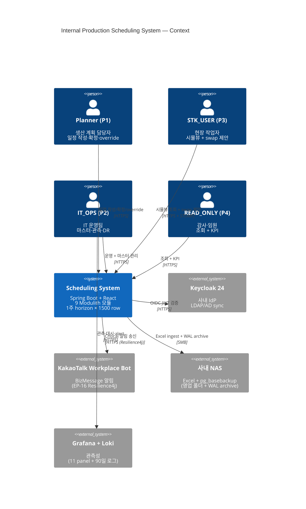

# Modulith C4 다이어그램 + 9 모듈 명세

**자동 생성**: `ModulithDocumentationTest` (backend/app/src/test) — `Documenter` API
**상위 참조**: [SAD-001 §4 (Phase 2)](../../../Phase%202/3.SAD/SAD-001_Production_Scheduling_System_v1.0.md) · [ADR-021](../../../Phase%202/3.SAD/ADR-021_Sprint6_Decisions_v1.0.md)
**갱신**: 2026-05-23 (Phase 3 종료 시점)

> Spring Modulith `Documenter` 가 자동 생성한 **C4 Component 다이어그램** (모듈 단위) +
> 개별 모듈 puml + AsciiDoc canvas. **CI 산출물 → 영구 commit** (Phase 5 발표 자료).

---

## 1. C4 모델 레벨 매핑

```
Level 1 — System Context  ────  본 문서 §2 Mermaid (사용자·외부 시스템)
Level 2 — Container       ────  SAD-001 §4 (백엔드·프론트·DB·Redis·Keycloak)
Level 3 — Component       ────  components.puml (9 Modulith 모듈) ★ 자동
Level 4 — Code            ────  module-<name>.puml (모듈 내부 컴포넌트) ★ 자동
```

---

## 2. C4 Level 1 — System Context (Mermaid)



---

## 3. C4 Level 3 — Component 다이어그램 (자동 생성)

### 전체 모듈 다이어그램

→ [components.puml](components.puml)

PlantUML 렌더링 — IntelliJ / VS Code PlantUML extension + Graphviz, 또는 https://www.plantuml.com/plantuml/.

### 다이어그램 누락 모듈 노트

Spring Modulith `Documenter` 는 **명시적 cross-module 의존성** 이 있는 모듈만 표시 (1.4.11 정책):

- ✅ **7 모듈 표시**: common, master, order, vc, ex, audit, notify
- ⚠️ **누락**: `security` (인프라 — domain module 외) · `kpi` (의존 = common 만, 다른 모듈이 의존 안 함 — `isolated`)

**9 모듈 전체** 는 [ModuleBoundaryTest](../../../backend/app/src/test/java/com/scheduling/architecture/ModuleBoundaryTest.java) 가 검증 (expected 9). ArchUnit + Modulith verify 0 위반.

---

## 4. 9 Modulith 모듈 상세

| 모듈 | 의존 | 책임 | puml | adoc |
|---|---|---|---|---|
| **common** | (의존 0) | BR / BrCode / ProblemDetail / ChangeSeverity | [module-common.puml](module-common.puml) | [module-common.adoc](module-common.adoc) |
| **master** | common | VcConstraint / HoseRule / ExConstraint / Shift / Inventory / SettingGroup / LineType / Calendar | [module-master.puml](module-master.puml) | [module-master.adoc](module-master.adoc) |
| **order** | common · master::api · audit::events | ExcelParser / ImportOrchestrator / FolderWatcher / Diff / Mapping | [module-order.puml](module-order.puml) | [module-order.adoc](module-order.adoc) |
| **vc** | common · master::api · order::events · audit::events · audit::aop | Schedule / Rotation / Capacity / Allocator(5 룰) / Confirm / Override / Swap / events(2) | [module-vc.puml](module-vc.puml) | [module-vc.adoc](module-vc.adoc) |
| **ex** | common · master::api · vc::events · audit::events · audit::aop | Deadline / Yield / Demand / Grouping / Gate / Conflict / Routing / Confirm / Replan / Ranking / Export | [module-ex.puml](module-ex.puml) | [module-ex.adoc](module-ex.adoc) |
| **audit** | common | trigger(V025/V026/V030) · AOP(@Auditable) · Snapshot forensic | [module-audit.puml](module-audit.puml) | [module-audit.adoc](module-audit.adoc) |
| **notify** | common · order::events · vc::events · ex::events | WebSocket STOMP · Kakao Resilience4j · Redis fanout · ExReplanListener | [module-notify.puml](module-notify.puml) | [module-notify.adoc](module-notify.adoc) |
| **security** | (인프라) | Keycloak JWT · RBAC (PLANNER·STK_USER·IT_OPS·READ_ONLY) | [module-security.puml](module-security.puml) | [module-security.adoc](module-security.adoc) |
| **kpi** | common | BusinessKpiPersister · Controller (NS-S01~S09 + K-V01~06 + K-E01~06) | [module-kpi.puml](module-kpi.puml) | [module-kpi.adoc](module-kpi.adoc) |

---

## 5. cross-module 이벤트 흐름 (Sprint 0~6 종합)

```
[order.events]
  OrderChangedEvent ─────────► vc (성형 스케줄 재계산)
  OrderDiffPersistedEvent ──► notify (알림 발송)

[vc.events]
  VcConfirmedEvent ─────────► ex (압출 candidate 자동 생성)
  VcChangedEvent ──────────► ex (PartialReplanService — BR-X03 cascade)

[ex.events]
  ExConfirmedEvent ─────────► (audit 자동, notify 구독 가능)
  ExReplanCompletedEvent ──► notify (STOMP /topic/extrusion-updates push)

[audit.events]
  ScheduleAuditedEvent ────► notify (mutation 알림 — Sprint 7+)
```

---

## 6. 갱신 절차

```bash
# 코드 변경 후 다이어그램 자동 갱신
cd backend
./gradlew :app:test --tests "com.scheduling.ModulithDocumentationTest"
# 산출물: app/build/spring-modulith-docs/

# 영구 commit 위치로 복사
cp app/build/spring-modulith-docs/*.{puml,adoc} ../docs/architecture/modulith/
git add ../docs/architecture/modulith/ && git commit -m "docs(modulith): 다이어그램 갱신"
```

---

## 7. PlantUML → PNG/SVG 렌더링

```bash
# PlantUML jar 실행 (Java 8+)
java -jar plantuml.jar components.puml
# → components.png 생성

# 또는 Graphviz + Docker
docker run --rm -v $(pwd):/work plantuml/plantuml components.puml
```

CI 통합 — Sprint 7+ Jenkins stage 추가 검토 (산출물 archive).

---

## 8. 상위 참조

- [Phase-3_Completion_v1.0.md](../../../Phase%203/2.Phase-Completion/Phase-3_Completion_v1.0.md) §3 (9 Modulith 모듈)
- [ADR-021_Sprint6_Decisions](../../../Phase%202/3.SAD/ADR-021_Sprint6_Decisions_v1.0.md) — 5 ADR 영구 기록
- [SAD-001 §4](../../../Phase%202/3.SAD/SAD-001_Production_Scheduling_System_v1.0.md) — Phase 2 C4 Container

---

## 9. 개정 이력

| 버전 | 날짜 | 작성자 | 변경 |
|----|-----|------|------|
| 1.0 | 2026-05-23 | Claude Code | 초안 — 9 Modulith 모듈 자동 PlantUML + Mermaid C4 Context + 이벤트 흐름도 |
